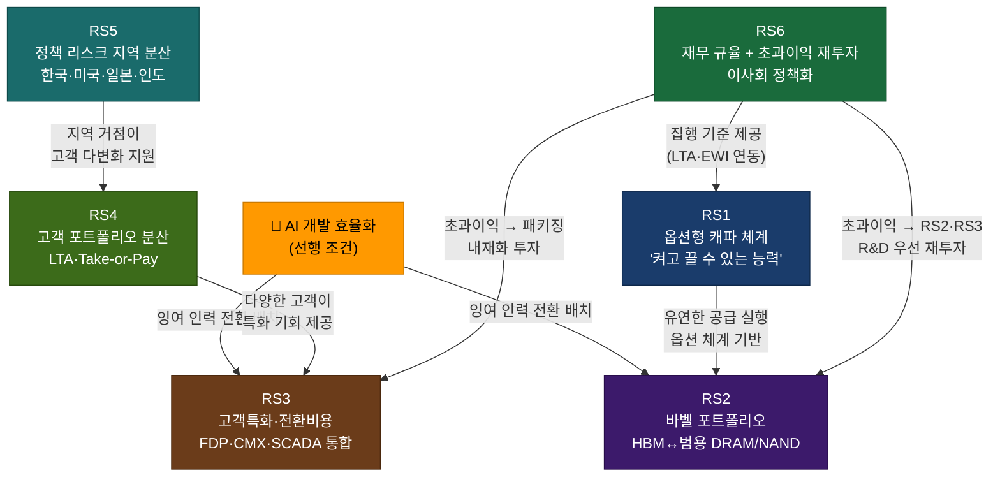

# 삼성전자 메모리사업부 전략 권고안

> **Focal Issue**: AI 메모리 시대에 삼성전자 메모리사업부가 2030~2035년에도 글로벌 리더십을 유지하기 위해 어떤 전략적 결정을 지금 내려야 하는가?
>
> **작성 기준일**: 2026년 5월 6일 (벤치마크 인사이트 통합 + Q1 2026 데이터 반영)
> **작성 주체**: Strategy Agent (시나리오 플래닝 프로젝트)

---

## 0. 벤치마크 정합성 점검 — 7개 사이클 전략 패턴 vs 본 권고안

> **출처**: `analysis/benchmark/cyclical-strategy-benchmark.md`
>
> 7개 산업·7개 기업의 사이클 대응 사례에서 추출한 검증된 7가지 패턴을, 본 권고안의 RS·MB·SB 전략에 매핑하여 **누락 없는 사이클 방어 체계**를 검증한다.

| # | 벤치마크 패턴 | 대표 사례 | 본 권고안 매핑 | 상태 |
|---|--------------|----------|---------------|------|
| 1 | **역(逆)사이클 투자** | Samsung 2022~2023 / ExxonMobil-Pioneer / Disney-Marvel | RS6(재무 규율)·MB-3(1c nm 다운턴 전환)·Option L-4(다운사이클 M&A) | ✅ 반영됨 |
| 2 | **변동비 구조** | Nucor (전기로 미니밀) | RS1(옵션형 캐파)·"롤링 캐파 리뷰" | ✅ 반영됨 |
| 3 | **자산 경량화** | Marriott · Maersk | RS3(소프트웨어 구독 — FDP, SCADA SW) — 부분 반영 | ⚠️ **확장 필요** |
| 4 | **수직·수평 통합** | Maersk (해운+물류) | RS2(바벨 포트폴리오) — DRAM·NAND·SSD·CXL 묶음 | ✅ 반영됨 |
| 5 | **헤징·장기계약** | Southwest 연료 헤징 / Samsung Foundry Tesla 다년 계약 | RS4(LTA·Take-or-Pay) | ✅ 반영됨 |
| 6 | **요새형 재무구조** | Nucor (순부채/EBITDA <1배) / Samsung 2025년 현금 $63B | RS6(재무 규율)·SC-2(순현금 30조 원 버퍼) | ✅ 반영됨 |
| 7 | **불황기 M&A** | Disney-Marvel · ExxonMobil-Pioneer | Option L-4 + SE-1(3D DRAM M&A 펀드) | ✅ 반영됨 |

### 벤치마크에서 새로 도입한 3가지 보강 사항

#### A. RS3 확장 — Marriott식 "Asset-Light Royalty 모델" 추가
- **벤치마크 메시지**: Marriott는 호텔의 1% 미만만 직접 보유하면서 매출의 70~75%를 fee로 창출. 사이클 비용을 가맹점주에게 이전. EBITDA 마진 77.7%.
- **메모리에 적용**: 삼성 SSD 하드웨어 판매 중심에서 **FDP/SCADA 호스트 소프트웨어 구독·라이선스 모델**로 진화. 테슬라 FSD 방식("HW 한 번 팔고 SW 구독")을 메모리 영역에 적용하면 사이클 변동성에서 일부 매출이 분리된다.
- **반영 위치**: RS3 사례 1(FDP)에 "테슬라 FSD 방식 비즈니스 모델"이 이미 기술됨. 본 권고안 리뉴얼에서 **연 매출 목표 $5B(2030년)** 명시 및 별도 P&L 추적을 추가한다.

#### B. RS6 강화 — Nucor식 "사이클 전 구간 투자 지속" 명문화
- **벤치마크 메시지**: Nucor는 2020~2024년 호황·불황 가리지 않고 매년 30~40억 달러 capex 집행. 순부채/EBITDA 1배 미만 유지가 전제 조건.
- **메모리에 적용**: RS6의 "초과이익 재투자 원칙"에 **"다운사이클 capex 하한선"**(예: HBM 신세대 R&D + 패키징 = 연간 4조 원 이상 삭감 불가)을 명문화. 호황기에 capex 절제, 불황기에 절대 하한 사수.
- **반영 위치**: 6.1 Decision 7에 추가 — "다운사이클 capex 하한선 4조 원/년 이사회 정책화"

#### C. Disney-Marvel 모델 — "다운사이클 M&A 트리거" 사전 정의
- **벤치마크 메시지**: Disney는 글로벌 금융위기 끝자락 2009.8 Marvel을 40억 달러에 인수 (PER 37배). 시장은 부정적이었으나 10년 후 박스오피스 180억 달러+ 창출.
- **메모리에 적용**: 시나리오 C·D 진입 시 **3D DRAM·CXL 소프트웨어·어드밴스드 패키징** 영역의 자산 가격 하락 시점을 사전 정의된 트리거(예: 동종 기업 EV/EBITDA 5배 이하)로 자동 발동.
- **반영 위치**: Option L-4에 트리거 조건 명문화 — "주요 차세대 메모리 스타트업 EV/EBITDA 5배 이하 6개월 지속 시 M&A 펀드 즉시 집행"

#### D. ExxonMobil-Pioneer 모델 — "활동가 투자자 압박 사전 방어"
- **벤치마크 메시지**: ExxonMobil은 다운사이클에 자본지출을 줄이지 않다가 2020년 다우 산업평균에서 제외되고 첫 연간 적자. 그러나 회복기 Pioneer $59.5B 인수로 폭발적 성장. 활동가 투자자 Engine No.1 압박을 견딘 거버넌스가 핵심.
- **메모리에 적용**: 다운사이클에서 외국인 투자자의 배당 확대 압박이 RS6를 무력화하지 않도록, **이사회 차원의 "장기 가치 우선 의결권 위임 구조"** 사전 명문화. 호황기 IR 메시지에 "다운사이클 배당 보장 < 장기 capex 사수" 명시.
- **반영 위치**: RS6 핵심 리스크 섹션에 추가 — "외국인 주주 압박 대비 IR 메시지 사전 정비"

---

---

## 1. Main Bet: 핵심 시나리오 선정

### 선정 근거

**시나리오 B "AI 르네상스"를 Main Bet으로 선정한다 (추정 확률 30~35%).**

#### 현재 증거 (2026년 5월 기준)

1. **AI CapEx 지속 모멘텀**: 2026년 빅테크 4개사(구글·마이크로소프트·아마존·메타) 합산 AI 관련 CapEx가 6,500~7,250억 달러에 달하며 전년 대비 40% 이상 증가하고 있다. HBM 시장 전체 규모는 2025년 약 350억 달러에서 2026년 546억 달러(Bank of America)로 성장 중이며 2026년 전량 Sold Out 상태가 지속되고 있다. (출처: Bank of America, 2026)

2. **관리된 공존의 정책 신호**: 미국은 2025~2026년 HBM 수출 통제를 강화하면서도 H20 GPU 재허용 등 경제적 상호의존을 완전히 끊지 않는 '정책 진동' 패턴을 반복하고 있다. MATCH 법안이 위원회 단계를 넘지 못하고 있으며, 범용 DRAM·NAND 분야는 선별적 제재·허용 프레임이 유지되고 있다. 이는 디커플링 심화(시나리오 A)보다 관리된 공존(시나리오 B) 방향에 가깝다.

3. **삼성전자 HBM 회복 궤도 확인**: 삼성전자는 HBM3E 품질 이슈로 2025년 상반기 HBM 점유율 17%까지 추락했으나, Q3 2025에 35%로 반등했다 (출처: Counterpoint Research, 2025). 2026년 2월 HBM4 양산을 개시하고 GTC 2026에서 HBM4E를 공개하며 NVIDIA 파트너십을 재확인했다. 회복 궤도 진입은 시나리오 B의 핵심 전제인 'HBM 기술 추격 성공'의 초기 증거다.

4. **신흥 AI 시장 개화**: 사우디 Humain 프로젝트, UAE G42, 인도 Reliance Jio 데이터센터 등 신흥 시장에서 AI 인프라 투자가 가시화되고 있으며, 이는 시나리오 B에서만 삼성전자가 '동서 균형 공급자'로 최대 수혜를 받는 구조다.

5. **시나리오 B가 삼성전자에 최대 기회**: 시나리오 B("AI 르네상스")는 2035년 글로벌 메모리 시장이 5,200억 달러에 달하는 유일한 시나리오로, HBM 매출 300억 달러(2032년 기준) 달성과 중국 일반 메모리 연간 120억 달러 유지가 동시에 가능하다. 삼성전자의 '동서 양쪽 시장 접근' 포지션이 유일하게 최대 가치를 발휘하는 시나리오다.

---

### Main Bet 전략: "AI 르네상스" 대응

#### Initiative MB-1: HBM4E·HBM5 기술 1위 탈환 — "NVIDIA 듀얼소싱 1번 공급사 지위 확보"

- **목표**: 2027년 HBM4E 기준 NVIDIA 루빈(Rubin) 플랫폼 탑재 점유율 40% 이상 달성; 2030년 HBM5에서 SK하이닉스와 동등 이상의 성능·수율 확보
- **기간**: 2026~2030년 (단기~중기)
- **핵심 결정**:
  - 2026년 3분기까지 HBM4 로직 다이 수율 90% 이상 달성 및 NVIDIA GB300 시리즈 공식 납품 확인서 확보 (현재 수율 70%에서 목표치까지 개선 필요; 출처: Samsung Newsroom, 2026)
  - 하이브리드 본딩(Hybrid Bonding) 양산 기술 자체 확보를 위해 2026~2027년 패키징 R&D에 2조 원 추가 투자 — SK하이닉스 대비 1세대 뒤처진 어드밴스드 패키징 격차 해소
  - HBM4E(2027~2028년)·HBM5(2029~2030년) 양산 수율 목표를 각각 85%, 80%로 설정하고 분기별 수율 달성률을 경영진 KPI에 반영
  - TSMC와의 HBM용 로직 다이 공동 개발 협약 체결 검토 (삼성 파운드리 4nm GAA 공정 경쟁력이 확보되지 않는 경우 대안으로 TSMC 외주화 유연성 확보)
- **성과 지표**: HBM4E NVIDIA 공급 비중 40%+, HBM 사업부 영업이익률 35% 이상 (2028년 기준)

#### Initiative MB-2: 동서 균형 공급망 구축 — "유일한 글로벌 플레이어" 포지션 강화

- **목표**: 2030년까지 서방 AI 시장(북미·유럽·일본)과 신흥 시장(인도·중동·동남아) 동시 공략; 중국 일반 메모리 시장 연간 80~120억 달러 유지
- **기간**: 2026~2030년
- **핵심 결정**:
  - 시안 팹 운영 전략: 연간 라이선스 갱신 체제에서 128단급 NAND 생산 유지, 범용 DRAM·NAND 대중국 판매 경로 확보. 라이선스가 갱신되지 않을 경우를 대비해 동기간 평택 P5·P6에 동급 NAND 생산 대체 라인 준비 (단, 양산 결정은 라이선스 상황에 따라 트리거 방식으로 집행)
  - 인도 사업 확대: 2027~2028년 인도 반도체 투자 인센티브(ISMP)를 활용한 인도 조립·테스트(OSAT) 거점 설립 검토. 인도향 메모리 공급 전용 로컬 서비스 센터 2027년까지 구축
  - 사우디 Humain, UAE G42, 인도 Jio 등 신흥 AI 데이터센터 발주처에 대해 삼성전자 메모리사업부 전담 영업팀 신설 (2026년 하반기 착수); 목표 수주 규모 연간 30억 달러 이상 (2028년 기준)
- **성과 지표**: 비중국 신흥 시장 메모리 매출 2025년 대비 3배 이상 (2028년 기준)

#### Initiative MB-3: 1c nm 공정 조기 전환과 원가 우위 복원

- **목표**: 2027년 1c nm DRAM 웨이퍼 월 생산 25만 매 달성; 삼성전자 DRAM 원가를 SK하이닉스 대비 15% 이상 낮은 수준으로 복원
- **기간**: 2026~2028년
- **핵심 결정**:
  - 2026년 말 목표치인 1c nm 웨이퍼 월 20만 매를 2027년 상반기까지 25만 매로 확대; 이를 위해 평택 P4·P5 라인에 1c nm 전환 장비 발주를 2026년 3분기 내 완료
  - 1c nm HBM4 수율 목표 85%를 2027년 1분기까지 달성하는 조건으로 HBM 생산 라인 전환 스케줄 수립
  - 원가 절감 효과를 HBM 단가 방어(경쟁사 수준 이하로 가격 인하 금지)가 아닌 영업이익률 확대에 우선 활용: 목표 HBM 사업부 영업이익률 40% 이상 (2028년)
- **성과 지표**: 1c nm 전환율 HBM 라인 100% (2027년 말), DRAM 비트 생산 원가 YoY 20% 절감 (2027년)

#### Initiative MB-4: 커스텀 AI 메모리 솔루션 사업 구축 — "메모리 솔루션 프로바이더" 전환

- **목표**: 2029년까지 구글·아마존·마이크로소프트의 커스텀 ASIC에 통합 가능한 맞춤형 메모리 솔루션(HBM + CXL + PIM + CMX 복합) 공급; 삼성전자 단일 고객 매출 비중 30% 이상 달성
- **기간**: 2026~2030년
- **핵심 결정**:
  - 주요 하이퍼스케일러 3개사(구글·아마존·마이크로소프트)와 NDA 기반 '메모리 공동 로드맵 협의체' 설립 — 2026년 하반기 착수. 이들의 차세대 ASIC 설계에 삼성 메모리 인터페이스 요구사항을 반영하는 것이 목적
  - CXL 메모리 모듈 전담 사업부 신설 (2026년 내): CXL 3.1/4.0 기반 서버 어태치형 DRAM 모듈 양산을 2027년까지 완료, 목표 시장 점유율 30% 이상 (2028년 기준)
  - LPDDR5X-PIM 기반 온디바이스 AI 메모리 양산 확대: 퀄컴·애플 SoC 파트너십 강화를 통해 2027년 LPDDR6-PIM 개발 착수
  - **NVIDIA CMX(Context Memory Storage Platform) 에코시스템 심화 참여**: CMX는 NVIDIA Vera Rubin 플랫폼에서 KV 캐시를 GPU HBM 외부의 NVMe SSD 어레이(G3.5 계층)로 오프로드하는 AI 추론 인프라다. 삼성전자 PM1753이 CMX 공식 공급 SSD로 이미 확정됐으나, BlueField-4 DPU 출하(2026 H2) 이후 Gen6 PM1763으로의 전환 타이밍을 선제 관리하고, 향후 CMX 전용 AI SSD(KV 캐시 최적화, NVMe KV Extension 지원)를 NVIDIA와 공동 개발하는 "CMX 전략적 공급 파트너" 지위 확보. 목표: CMX 생태계 SSD 점유율 40% 이상(2028년)
- **성과 지표**: 커스텀/솔루션 메모리 매출 비중 전체 메모리 매출의 20% 이상 (2029년); CMX SSD 매출 연간 $10억+ (2028년)

#### Initiative MB-5: 텍사스 테일러 팹 2기 조기 착공 — 미국 현지 HBM 공급 역량 확보

- **목표**: 2030년 텍사스 테일러 2기 팹 가동 개시; CHIPS Act 2.0 보조금 수령을 통한 미국 현지 HBM 생산 연 20만 웨이퍼 규모 달성
- **기간**: 2026~2030년
- **핵심 결정**:
  - 2026년 내 미국 상무부에 CHIPS Act 2.0 보조금 신청서 제출 (텍사스 테일러 2기 대상); 목표 보조금 규모 60~80억 달러
  - 테일러 2기는 HBM4E·HBM5 전용 라인으로 설계하여 NVIDIA·AMD·인텔 등 미국 반도체 고객의 '미국산 메모리' 요구에 대응
  - 텍사스 팹 기반 HBM 공급 단가 프리미엄은 현지 생산 비용 증가분(약 15~20%)을 미국 정부 조달 수주 + 관세 면제 + 보조금으로 상쇄하는 구조 설계
- **성과 지표**: 2030년 텍사스 팹 HBM 생산 개시, 미국 정부 및 미국계 빅테크 향 HBM 매출 연 50억 달러 이상 (2031년 기준)

---

## 2. Side Bets: 나머지 시나리오 헤징

### Side Bet A: "황금 요새" 대비 (시나리오 A: AI 수요 지속 + 디커플링 심화)

- **핵심 위협**:
  1. 시안 팹 장비 반입 라이선스 박탈 → NAND 글로벌 생산 능력 40% 급감 (시안 팹 기여분 기준; 출처: scenario-A.md)
  2. 대중 HBM 수출 전면 차단 → 중국 데이터센터 매출 소멸 (전체 매출의 약 20~25% 추정)
  3. 공급 다각화 압박으로 마이크론 HBM 역할 확대 → 삼성 점유율 방어 어려움

- **헤징 전략**:
  1. **시안 팹 단계적 축소 시나리오 계획 수립 (2026년 내 완료)**: 라이선스 갱신 실패 시 평택 P5·P6으로 NAND 생산 이전 가능한 'Plan B' 세부 실행 계획을 2026년 4분기까지 완성. 이전 비용 추산 약 5조 원 및 실행 타임라인(24개월) 사전 준비
  2. **일본 요코하마 R&D 허브 확대 투자 (2026~2028년)**: ASML EUV 장비 대체 가능성에 대비해 일본 소재·장비 공급망(JSR, 신에쓰화학, 캐논 반도체) 파트너십을 강화하고, EUV 의존도를 줄일 수 있는 나노임프린트(NIL) 기술 공동 개발 계약 체결. 투자 규모 약 1조 원
  3. **서방 AI 고마진 포지션 강화**: 디커플링 심화 시 HBM 희소성 증가 → 단가 프리미엄 최대화 전략으로 전환. 2028년 이후 HBM5 단위당 평균 단가를 900달러 이상으로 유지하기 위해 장기 공급 계약(LTA) 체결을 2026~2027년에 집중 협상

- **투자 규모/우선순위**: 시안 팹 이전 대비 예산 5조 원 별도 확보 (비상 대비 예산으로 충당금 설정); 일본 R&D 허브 1조 원. 우선순위: 시나리오 B 투자를 저해하지 않는 범위에서 실행 (병렬 운용)

---

### Side Bet C: "기술 냉전" 대비 (시나리오 C: AI 거품 붕괴 + 디커플링 심화)

- **핵심 위협**:
  1. HBM 수요 급냉각 + 시안 팹 상실 이중 충격 → 단일 사업부 연간 영업손실 10조 원 이상 가능성 (출처: scenario-C.md)
  2. HBM4/5 라인 설비투자 30조 원 이상의 가동률 30% 이하 추락
  3. 중국산 소재(희토류·게르마늄·갈륨) 수출 제한 발동 시 소재 원가 30% 급등

- **헤징 전략**:
  1. **소재 공급망 다각화 및 비축 (2026년 즉시 착수)**: 희토류·게르마늄·갈륨·텅스텐의 비중국 대체 공급선을 캐나다·호주·카자흐스탄 광산 기업과 2026년 내 장기 구매 계약 체결. 6개월 이상 재고 비축 정책 수립. 연간 소재 조달 예산의 30%를 비중국 소싱으로 전환하는 목표 설정 (2027년 말 기준)
  2. **재무 방어 구조 구축 (2026~2027년)**: 다운사이클 대비 유동성 버퍼로 순현금 30조 원 이상 유지. HBM4 설비투자 중 변동 가능 집행분(약 10~15조 원)을 트리거 방식으로 전환 — 빅테크 CapEx 삭감 신호 확인 시 즉시 집행 속도를 조정할 수 있는 '계약 유연성 조항' 장비 발주 계약에 명시
  3. **3D DRAM·차세대 R&D 지속 투자 (다운사이클 중에도 불변 예산)**: 시나리오 C 발생 시에도 HBM 다음 세대 아키텍처(HBM6 또는 3D DRAM)를 위한 R&D 예산 연간 3,000억 원 이상을 다운사이클 중 삭감 불가 항목으로 지정. 과거 2023년 다운사이클 때 삼성전자의 R&D 투자 유지가 2024~2025년 회복의 기반이 됐던 교훈 반영

- **투자 규모/우선순위**: 소재 비축·대체 공급 계약 약 5,000억 원; 재무 버퍼 30조 원 유지는 자본 배분 정책에 반영. 이 Side Bet은 보험 성격으로 Main Bet 대비 10~15% 수준의 추가 비용

---

### Side Bet D: "조용한 재편" 대비 (시나리오 D: AI 거품 붕괴 + 관리된 공존)

- **핵심 위협**:
  1. SK하이닉스 기술 우위 고착화 — AI 수요 조정기에 삼성이 회복에 집중하는 동안 SK하이닉스와 NVIDIA 파트너십이 더욱 공고화됨
  2. CXMT의 범용 DRAM 가격 공세 — 중국 내 DDR5·LPDDR5 시장에서 보조금 기반 원가 이하 가격으로 삼성 마진 잠식
  3. 장기 저성장 함정 — 2028~2033년 조정기 지속 시 과도한 설비 투자가 장기 부담

- **헤징 전략**:
  1. **HBM 조직 독립 재편 (2026년 내)**: HBM 사업부를 메모리사업부 내 독립 P&L 센터로 분리하고, 패키징 기술(하이브리드 본딩) 전담 조직 신설. 외부 패키징 전문 인재(TSMC·IMEC·ASE 경력자) 100인 이상 전략 채용 계획 수립. 시나리오 D 발생 시 이 조직이 다운사이클 기간의 핵심 혁신 조직으로 기능
  2. **산업용 AI 메모리 전용 제품 선행 개발 (2026~2028년)**: 2030년 이후 회복 수요처로 전망되는 의료 AI·자율주행·제조 로봇 분야에 특화된 저전력·고신뢰성 HBM4E/HBM5 변형 제품(AEC-Q100 자동차 등급 메모리)을 2026년부터 개발 착수. 이 분야는 소비자 AI 대비 사이클이 안정적이고 마진이 높음
  3. **CXMT 경쟁 대응 원가 구조 개선**: 범용 DRAM(DDR5·LPDDR5)에서 1c nm 공정 전환 속도를 최대화하여 CXMT의 보조금 공세에도 흑자 유지 가능한 원가 구조 확보. 목표: 1c nm DDR5 웨이퍼당 생산 원가를 현재 대비 30% 절감 (2027년 말 기준)

- **투자 규모/우선순위**: HBM 조직 재편은 구조 변화로 별도 자본 불필요; 산업용 AI 메모리 R&D 약 2,000억 원 (2026~2028년 누계). 이 Side Bet은 Main Bet 전략과 90% 이상 겹치므로 별도 비용 최소화

---

### Side Bet E: "패러다임 전환" 대비 (시나리오 E: 3D DRAM·PIM·CXL이 HBM 대체)

- **핵심 위협**:
  1. HBM 집중 투자 40조 원 이상의 전략적 매몰 비용화 — '승자의 저주' 리스크
  2. 3D DRAM 원천 특허 취약 — 삼성전자의 3D DRAM 특허 포트폴리오가 마이크론·IMEC 대비 미흡
  3. 고객 설계 생태계 소외 — NVIDIA·구글·아마존이 3D DRAM/PIM 통합 설계 시 삼성 참여 기회 창 협소화

- **헤징 전략**:
  1. **3D DRAM 전담 R&D 조직 및 EWI 기반 피벗 메커니즘 구축 (2026~2027년)**: 메모리사업부 내 3D DRAM 전담 R&D 조직을 2027년 1분기까지 신설하고, 초기 인원 300인 이상으로 구성. IMEC와 공동 연구 협약 체결(벨기에 IMEC는 3D DRAM 핵심 특허의 30% 보유; 출처: scenario-E.md). 동시에 3D DRAM 원천 기술 보유 팹리스 스타트업 2~3개사에 대한 M&A 또는 전략 투자(총 5,000억 원 규모)를 2027년까지 집행하여 특허 포트폴리오 강화
  2. **CXL SIG 내 표준 주도권 강화 (2026년 즉시 착수)**: 이미 CXL 컨소시엄에 참여 중인 삼성전자가 CXL 4.0+ 표준 개발 워킹 그룹에 인력을 2배 이상 투입(현 10인 → 25인). 자사 메모리 아키텍처에 유리한 기술 사양을 표준에 반영하여 CXL 메모리 패브릭 시장에서 선도 포지션 확보
  3. **시나리오 E 전환 트리거 발동 시 즉시 실행 플랜**: 아래 EWI 대시보드의 '시나리오 E 전환 트리거' 2개 이상 동시 발동 시, 6개월 이내에 HBM5 투자 50% 축소·3D DRAM 전담 조직 독립 사업부 격상·IBM Research 또는 IMEC와 3D DRAM 공동 개발 양해각서 체결을 자동 착수하는 내부 의사결정 메커니즘을 2026년 내 이사회에서 승인

- **투자 규모/우선순위**: 3D DRAM R&D 조직 구축 연간 1,500억 원; M&A 펀드 5,000억 원 사전 적립. 전체 R&D 예산의 10~15%를 HBM 외 대안 기술에 배분 (현재 추정 HBM 집중도 85% 이상 → 70%로 분산)

---

## 3. Robust 전략 (어떤 시나리오에서도 유효한 전략)

> **Robust 전략 설계 원칙**: 아래 7개 전략은 시나리오 A~E 어느 경우에도 긍정적 가치를 창출하도록 설계되었다. 단, RS2(바벨 포트폴리오)와 RS3(고객특화 기능)은 **AI 개발 효율화를 공통 실행 기반**으로 삼는다는 점에서 서로 연결된다. 이 두 전략은 독립적으로 실행하는 것이 아니라, AI 활용 엔지니어링 생산성 도구의 전사 도입이 선행될 때 비로소 추가 인원 없이 동시 실행이 가능해진다.

---

### RS1: 옵션형 캐파 체계 (Options-Based Capacity)

- **왜 Robust한가**: 메모리 산업의 가장 치명적인 실수는 "잘못된 타이밍의 고정 증설"이다. 시나리오 B(AI 르네상스)에서는 빠른 증설 옵션이 매출 극대화를 가능하게 하고, 시나리오 C·D(수요 조정)에서는 집행을 미룰 수 있는 유연성이 손실을 방지한다. 시나리오 A(디커플링)에서는 지역별 팹 전환 유연성이 정책 충격을 흡수한다. 어떤 시나리오에서도 "제때 켤 수 있는 능력"이 "지을 수 있는 능력"보다 더 많은 가치를 창출한다.

- **구체적 실행 방안**:
  - **Fab Shell 선행 건설 + 장비 반입 단계화**: 팹 건물(cleanroom, 유틸리티, 인프라)은 수요 신호와 무관하게 선행 건설하되, 핵심 생산 장비(노광기, CVD, CMP, 테스터)의 반입 결정은 수요 신호 확인 후 단계적으로 집행. 이를 통해 장비 반입 결정을 6~9개월 지연시킬 수 있는 유연성 확보. 패키징 라인(TSV, 하이브리드 본딩) 증설은 DRAM 웨이퍼 라인과 분리하여 독립적으로 결정
  - **Multi-Product Fab 구조 도입**: DRAM / NAND / Logic 생산 비율을 수요에 따라 조정 가능한 Multi-Product Fab을 평택 P5·P6에 적용. 단일 팹에서 DRAM 비중을 60~80% 범위 내에서 분기별 조정 가능하도록 설계
  - **장비 발주 계약에 "반입 연기 옵션" 조항 명문화**: ASML, TEL, LAM Research 등 주요 장비 벤더와의 장기 발주 계약에 "수요 조건부 반입 연기 옵션(최대 12개월)" 조항을 명문화. 옵션 프리미엄 비용은 추산 장비 대금의 2~5% 수준이나, 다운사이클 시 불필요한 설비 집행을 막는 보험 효과가 훨씬 크다
  - **핵심 병목 분리 투자 단위 관리**: Cleanroom, TSV 라인, 어드밴스드 패키징 설비, 테스터 용량을 별도 투자 단위(Investment Unit)로 관리. 각 단위별로 독립적인 집행 트리거(수요 지표, 수율 목표 달성, 고객 선행 주문 확인)를 설정하여 전체 팹 투자를 일괄 집행하지 않는 체계 구축
  - **캐파 집행 거버넌스 개편**: 기존 연간 예산 배정 방식 대신, 분기마다 수요·수율·경쟁사 동향을 기반으로 캐파 집행 여부를 재검토하는 "롤링 캐파 리뷰(Rolling Capacity Review)" 프로세스를 이사회 승인 아젠다로 제도화

- **기간**: 즉시~중기 (구조 설계 2026~2027년, 운영 전 기간)
- **핵심 리스크**: Fab Shell 선행 건설 시 건물 비용은 선지출되나 장비 미반입 시 가동률이 낮아 보이는 "공장 공실" 문제가 발생할 수 있다. 투자자 커뮤니케이션에서 이를 "전략적 옵션 가치"로 설명하는 IR 메시지 정비가 필요하다.

---

### RS2: 바벨 포트폴리오 전략 + AI 개발 효율화 메커니즘

- **왜 Robust한가**: 메모리 산업은 극단적 사이클성을 갖는다. 호황기에는 HBM·고성능 서버 메모리의 고마진이 이익을 견인하고, 불황기에는 원가 경쟁력 있는 범용 DRAM·NAND·QLC SSD가 현금흐름을 방어한다. "가운데 어정쩡한 제품"(중간 성능·중간 마진)은 호황기에도 불황기에도 경쟁 우위를 갖지 못한다. 바벨 구조는 어떤 사이클에서도 포트폴리오 최소 수익성을 보장한다.

  또한 이 전략의 핵심은 **추가 인원 없이 실행 가능**하다는 점이다. AI 개발 효율화로 기존 엔지니어의 잉여 자원을 창출하고, 이를 포트폴리오 다변화와 고객특화 기능 개발에 투입하는 메커니즘이 RS2와 RS3를 동시에 가능하게 한다.

- **구체적 실행 방안**:

  **[한쪽 끝] 고성능 프리미엄 제품군 (호황기 수익 극대화)**:
  - HBM4E·HBM5·커스텀 AI 메모리(PIM, CXL 복합), 고성능 서버 DRAM(DDR5 고클럭), 엔터프라이즈 SSD
  - 이 제품군에서 영업이익률 35~45% 목표. 불황기에는 생산 비중 축소, 호황기에는 최대화
  - HBM 베이스다이 커스텀 로직 통합, FDP 기반 하이퍼스케일러 전용 SSD 등 RS3(고객특화 기능)과 연계

  **[다른 쪽 끝] 원가경쟁력 범용 제품군 (불황기 현금흐름 방어)**:
  - 범용 DRAM(DDR5·LPDDR5 1c nm 공정 전환 완료), QLC SSD(고용량·저단가), 모바일 DRAM
  - 1c nm 공정 전환 완료 기준 원가 목표: DDR5 웨이퍼당 생산 원가 CXMT 대비 10% 이상 우위 유지
  - 이 제품군에서는 적자를 절대 허용하지 않는 원칙 (불황기 흑자 유지 가능 원가 구조)

  **[가운데 제품 축소]**:
  - 중간 성능·중간 마진 제품(예: 일반 서버 DDR4, 구형 3D NAND TLC 등)의 라인업을 2027년까지 30% 이상 축소
  - 해당 라인의 생산 캐파를 고성능 또는 원가경쟁 제품으로 전환

  **[AI 개발 효율화 메커니즘 — RS2·RS3 공통 실행 기반]**:
  - **선행 조건**: AI 코딩 도구(GitHub Copilot Enterprise급), EDA(Electronic Design Automation) AI 자동화, 공정 시뮬레이션 AI, 수율 예측 AI 등 엔지니어링 생산성 도구를 2026년 내 전사 도입. 투자 규모 약 500~1,000억 원 (엔지니어 1인당 생산성 20~30% 향상 기대)
  - **메커니즘**: AI 개발 효율화 → 기존 인력의 잉여 자원(역량 여유) 창출 → 이를 포트폴리오 다변화(RS2) + 고객특화 기능 개발(RS3)에 투입
  - **구체적 적용**: PC/Mobile/Automotive 포트폴리오 유지·강화에 AI 효율화로 확보된 엔지니어링 자원 우선 배분. 단순 구호가 아니라, 제품 개발 사이클을 AI 도구로 20~30% 단축함으로써 동일 인력이 더 많은 제품 라인을 커버할 수 있게 되는 구체적 메커니즘
  - **거버넌스**: 연 1회 "AI 생산성 절감 → 전략 투자 전환" 효과를 사업부장 보고 아젠다로 의무화. 절감된 자원이 전략적 목적(고객특화 기능, 포트폴리오 다변화)에 실제로 투입되고 있는지 추적

- **기간**: 중기 지속 (2026~2030년, AI 도구 도입은 2026년 즉시)
- **핵심 리스크**: "가운데 제품 축소"는 단기 매출 감소를 야기할 수 있다. 특히 기존 고객과의 관계 단절 리스크가 있으므로, 축소 전에 해당 고객을 바벨 양 끝 제품으로 마이그레이션하는 전환 지원 프로그램이 선행되어야 한다.

---

### RS3: 고객특화 기능·전환비용 극대화

> **RS2와의 연결**: RS3는 RS2의 AI 개발 효율화 메커니즘이 없으면 추가 인원 없이 실행 불가능하다. RS2에서 확보된 엔지니어 잉여 자원이 RS3의 고객특화 기능 개발에 투입되는 구조다. 두 전략은 "AI 효율화"라는 단일 실행 기반을 공유한다.

- **왜 Robust한가**: 메모리 다운턴에서 고객이 경쟁사로 전환하는 가장 큰 이유는 "삼성 제품과 경쟁사 제품의 차이가 없다"고 느끼기 때문이다. 고객의 시스템 소프트웨어·하드웨어 설계에 삼성 메모리가 깊이 연결될수록, 전환 시 검증 재수행 비용·개발 재투자 비용이 급증한다. 이 전환비용(switching cost)은 호황기에는 고객 락인으로 점유율을 방어하고, 불황기에는 가격 인하 압박을 흡수한다. 어떤 시나리오에서도 전환비용이 높은 고객은 이탈하지 않는다.

- **구체적 실행 방안**:

  **[2026-05-06 팩트체크 검증 완료]**

  RS3은 NVIDIA 생태계의 3대 데이터 경로(CMX·SCADA·FDP)를 통해 전환비용을 만든다. 각 영역의 시장 현실성을 데이터로 검증한 결과:

  | 영역 | 시장 현실성 | 기존 SSD로 대응? | 사업 모델 검증 |
  |------|------------|-----------------|---------------|
  | **CMX** (KV 캐시 G3.5) | NVIDIA CES 2026 공식 발표, 17개 클라우드·스토리지 파트너 확보, 2H 2026 일반 출시 (성능 5x TPS + 5x 전력 효율 입증) | ❌ 새 폼팩터(이더넷 연결 플래시) + BlueField-4 DPU 통합 필요. NAND 자체는 기존 사용 가능하나 **컨트롤러·펌웨어·NVMe over Fabrics 최적화 차별화**가 핵심 | NVIDIA Storage-Next 표준의 한 부분. 단기 fad 아님 — 장문맥 추론 인프라의 구조적 요구 |
  | **SCADA** (GPU 네이티브) | AI 스토리지 시장 **$36B(2025) → $322B(2035, CAGR 24%)** (MarketsAndMarkets). 메모리가 hyperscaler capex의 30% 차지(2026, vs 2023~24 8%) | ❌ 기존 SSD는 CPU 경유 I/O — SCADA는 GPU 직접 제어. **컨트롤러 펌웨어 + DOCA SDK 통합** 필요. SK hynix·Kioxia가 100M IOPS SLC NAND 개발 중(2027 양산) | 단기 fad 절대 아님. AI 추론 표준 인터페이스 후보. SLC NAND 신규 사업 카테고리. 미참여 시 SSD에서 HBM 패권 손실 반복 |
  | **FDP** (Flexible Data Placement) | NVMe TP41461 표준화(2022.12, Meta+Google+Samsung 공동). WAF 50%↓, OP 28%↓, 드라이브 수명 2배, 쓰기 속도 2배 (NVMe Consortium) | ✅ 기존 NAND·컨트롤러로 펌웨어 업데이트만으로 가능 (이미 OS·라이브러리·도구 지원). 그러나 **호스트 SW 통합·검증·튜닝 노하우**가 차별화 영역 | "구글에 SW 단독 판매"는 비현실적 (구글이 표준 공동 개발) — 그러나 (a) 통합 검증된 SSD 프리미엄 단가 (b) 중소 클라우드 대상 reference 라이선스 (c) 컨설팅·튜닝 서비스 매출은 가능 |

  **사업 모델 재설계 (FDP 사례 — 현실성 보강 후)**:
  
  *현실 점검*: FDP 표준 자체는 오픈이며 구글이 공동 개발자다. "구글에게 FDP SW를 유료 판매"는 비현실적이므로 다음 3계층 매출 모델로 전환한다:
  
  1. **하드웨어 프리미엄** (HW 매출): FDP 통합 검증된 삼성 SSD를 일반 SSD 대비 단가 +10~15% 프리미엄에 판매. TCO 절감 효과(WAF -50%, 드라이브 수명 2배)로 고객은 ROI 회수 6~12개월. 2030년 FDP 검증 SSD 매출 비중 30% 목표.
  2. **Reference 라이선스** (SW 매출): 구글과 공동 개발한 호스트 SW 스택을 reference implementation으로 패키징하여 중소 클라우드(CoreWeave·Crusoe·Lambda 등)에 라이선스 제공. 라이선스당 연 $50~200K 추정.
  3. **컨설팅·통합 서비스** (서비스 매출): 엔터프라이즈 고객의 스토리지 소프트웨어 스택과 FDP 통합 컨설팅. 프로젝트당 $500K~5M.
  
  → 통합: 2030년 FDP 관련 매출 $2~3B/년 (HW 프리미엄 70% + 라이선스/서비스 30%)

  **[사례 1] FDP(Flexible Data Placement) 기반 SSD 전략 — 가장 상세한 실행 모델**

  *배경*: FDP(NVMe Flexible Data Placement)는 NVMe SSD에서 호스트(서버 OS·스토리지 소프트웨어)가 데이터를 SSD 내부 어디에 배치할지를 직접 제어하는 인터페이스 표준이다. 기존 SSD는 FTL(Flash Translation Layer)이 데이터 배치를 자율 결정하는 구조라 Write Amplification Factor(WAF)가 높고 SSD 수명이 단축된다. FDP를 사용하면 호스트가 "이 데이터는 자주 쓰고, 저 데이터는 가끔 쓴다"는 정보를 SSD에 직접 전달하므로 WAF를 최대 50% 감소시킬 수 있다 (출처: NVMe FDP Specification, NVMe Consortium, 2023).

  *구글과의 공동 개발 모델*:
  - 구글은 이미 자사 데이터센터 스토리지 최적화를 위해 FDP 스펙 개발에 주도적으로 참여했다. 삼성전자는 구글과 FDP 스펙 기반 SSD를 공동 개발하여 구글 데이터센터에 납품. 이 과정에서 구글의 스토리지 소프트웨어 스택(CFS, 구글 파일시스템)이 삼성 SSD의 FDP 인터페이스에 최적화된 형태로 통합됨
  - 결과: 구글 입장에서는 WAF 감소(스토리지 수명 연장 = TCO 절감), WAL(Write-Ahead Log) 지연 감소로 DB 성능 향상. 삼성 입장에서는 구글 스토리지 소프트웨어가 삼성 FDP 인터페이스에 최적화되어 경쟁사 SSD로의 전환 시 소프트웨어 재검증 비용 발생 → 전환비용 창출

  *하이퍼스케일러 전체 확산*:
  - 구글과의 공동 개발 결과를 표준 FDP 구현체(Reference Implementation)로 패키징하여 MS Azure, AWS, Meta 등 주요 하이퍼스케일러에 순차 적용. 각 하이퍼스케일러의 스토리지 소프트웨어 팀과 공동 최적화 프로젝트 진행 (2026~2028년)
  - 목표: FDP 최적화 하이퍼스케일러 스토리지 소프트웨어를 사용하는 고객 매출 비중 2028년 40% 이상

  *호스트 소프트웨어의 새로운 사업 모델*:
  - 구글과 공동 개발한 FDP 호스트 소프트웨어 스택을 구글과 협약하여 중소 클라우드 사업자·엔터프라이즈 고객에게 유료 제공 또는 삼성 SSD 구매 고객에게 번들 제공
  - 이는 메모리·SSD 하드웨어 판매를 넘어선 소프트웨어 사업 모델의 첫 사례가 된다

  *테슬라 FSD 방식 비즈니스 모델 적용*:
  - 삼성 SSD 전 제품에 FDP 지원 하드웨어를 기본 탑재하되, 소프트웨어 업데이트로 FDP 기능을 Enable하는 구조로 설계
  - 기본 구매 시: 표준 SSD로 판매 (하드웨어 마진)
  - FDP Enable 구독: 고객이 원할 때 소프트웨어 업데이트로 FDP 기능 활성화 (추가 구독 수익)
  - 이는 테슬라 FSD(Full Self-Driving)처럼 "하드웨어는 팔고, 소프트웨어로 추가 수익"을 창출하는 새로운 메모리 비즈니스 모델

  **[사례 2] HBM 베이스다이 커스텀 로직 통합**:
  - HBM의 베이스다이(Logic Die)에 고객 ASIC 설계에 맞춤화된 로직(데이터 전처리, 희소 행렬 연산, 특정 AI 커널 가속)을 삼성이 직접 구현
  - 예시: 구글 TPU v6에 최적화된 HBM4 베이스다이 로직, 아마존 Trainium3에 특화된 메모리 컨트롤러 로직
  - 이 구조에서는 경쟁사 HBM으로의 전환 시 고객 ASIC 설계 전체를 수정해야 하므로 대체 불가 수준의 전환비용이 발생
  - 실행 일정: 구글·아마존 각 1개씩 파일럿 프로젝트 2026년 하반기 착수, 2028년 양산 목표

  **[사례 3] 고객 시스템 소프트웨어 연계 인증 구조 심화**:
  - 고객의 서버 OS·하이퍼바이저·스토리지 소프트웨어가 삼성 메모리·SSD와의 공동 인증(Co-Validation)을 완료한 상태에서, 경쟁사 제품으로 전환하려면 전체 인증 사이클을 재수행해야 하는 구조
  - 이를 위해 주요 고객별 "Samsung Memory Co-Validation Program" 운영: 삼성 전담 엔지니어를 고객 사이트에 파견하여 고객 시스템 스택 전체와의 인증을 선행 투자로 수행
  - 인증 선행 투자 회수 조항: 공동 인증 비용을 삼성이 부담하되, 고객이 일정 물량 이하로 구매할 경우 인증 투자 비용을 회수하는 계약 조항 삽입 (취소 시 페널티 구조)

  **[사례 4] NVIDIA SCADA 호환 AI SSD — SK하이닉스 파트너십 고착화 방지**

  *배경*: NVIDIA SCADA(Scaled Accelerated Data Access)는 GPU가 CPU를 거치지 않고 NVMe SSD의 I/O를 직접 제어하는 GPU 네이티브 스토리지 프로그래밍 모델이다. SC'25(2025년 11월)에서 Micron 9650 PCIe Gen6 SSD 44개로 단일 서버 2.3억 IOPS를 달성했으며, NVIDIA의 목표는 단일 SSD당 1억 IOPS다. SCADA는 NVIDIA Storage-Next 이니셔티브의 소프트웨어 기반으로, AI 추론 스토리지의 표준 인터페이스가 될 가능성이 높다 (출처: Blocks & Files, 2025; Micron Newsroom, 2026).

  *위협 현황*: NVIDIA의 AI SSD 핵심 파트너십이 **SK하이닉스(AI-N P, 2,500만→1억 IOPS SLC 기반, Phison 컨트롤러)**, **Kioxia(1억 IOPS SLC, 2027년 목표)**, **Micron(9650, 최초 레퍼런스)** 중심으로 형성되고 있다. 삼성전자는 PM1763으로 GTC 2026에서 시연했으나, 공개적인 SLC 기반 AI SSD 로드맵이 없고 전략 파트너 지위에서 상대적으로 소외되어 있다. 이는 HBM에서의 경험(SK하이닉스 독점 공급 → 삼성 17% 추락)이 SSD 영역에서도 반복될 수 있음을 시사한다.

  *실행 방안*:
  - **SCADA 전용 AI SSD 로드맵 공개 (2026년 내)**: SLC NAND 또는 삼성 고유의 대안 아키텍처를 기반으로 한 AI SSD 전략을 2026년 Samsung Tech Day에서 공개. 목표 IOPS: 2026년 1,000만 IOPS → 2027년 5,000만 IOPS → 2028년 1억 IOPS
  - **NVIDIA Storage-Next 공동 개발 파트너십 심화**: PM1763 GTC 시연을 발판으로 NVIDIA와 SCADA 기반 AI SSD 공동 개발 MOU 체결. NVIDIA DOCA Memos SDK와의 통합 최적화, NVMe KV Extension 공동 개발을 전략적 과제로 설정
  - **고객 전환비용 심화**: SCADA-최적화 삼성 SSD를 구매한 하이퍼스케일러의 AI 추론 스택(NVIDIA Dynamo + NIXL + 삼성 SCADA SSD)을 인증한 이후, 경쟁사 SSD로의 전환 시 전체 추론 스택 재인증 필요 → RS3의 Co-Validation 구조와 동일한 전환비용 메커니즘 적용
  - **AI 개발 효율화 잉여 자원 투입**: AI 도구로 확보된 FW 엔지니어 잉여 자원을 SCADA 컨트롤러 펌웨어 + NVMe KV Extension 개발에 집중 투입

  **[AI 개발 효율화와의 연결]**:
  - FDP 소프트웨어 개발, HBM 베이스다이 커스텀 로직 설계, SCADA AI SSD 개발, 고객별 Co-Validation 엔지니어링 작업 모두 기존 인력 대비 상당한 추가 엔지니어링 자원을 요구한다
  - 이 추가 자원은 신규 채용이 아니라 RS2에서 확보한 AI 개발 효율화 잉여 자원에서 조달
  - 전사 AI 코딩 도구 도입으로 FW(펌웨어) 개발 사이클 30% 단축 → 기존 FW 엔지니어 일부를 고객특화 FDP·SCADA 소프트웨어 개발에 전환 배치하는 것이 핵심 실행 경로

- **기간**: 중기~장기 (FDP 파일럿 2026년, SCADA AI SSD 전략 발표 2026년, 양산 적용 2027~2028년, 소프트웨어 구독 모델 2028년+)
- **핵심 리스크**: (1) 고객 사이트에 삼성 엔지니어를 파견하는 Co-Validation 모델은 인력 부담이 크다. AI 효율화 선행 없이 이 전략을 추진하면 기존 제품 개발 인력이 희석된다. (2) SCADA AI SSD에서 SLC NAND 전략 여부에 대한 내부 결정이 선행되어야 한다. TLC 기반으로도 컨트롤러 혁신으로 목표 IOPS에 도달 가능한지, 아니면 SLC 또는 새로운 NAND 아키텍처가 필요한지의 판단이 2026년 내 이루어져야 한다. 결정 지연 시 SK하이닉스·Kioxia의 SLC 기반 플랫폼이 시장 표준으로 고착될 위험이 있다.

---

### RS4: 고객 포트폴리오 의도적 분산

- **왜 Robust한가**: 소수 GPU 벤더·하이퍼스케일러에 대한 집중은 호황기에는 매출을 극대화하지만, shortage 시기에 관계가 망가지거나 다운턴에 협상력이 역전될 때 치명적이다. 시나리오 A~E 어느 경우에도 고객 다변화는 협상력을 유지하고 사이클 충격을 분산하는 효과가 있다. 특히 지금은 삼성이 공급 우위에 있는 shortage 시기로, 장기 계약 구조를 확보하기 위한 골든 타임이다.

- **구체적 실행 방안**:
  - **고객 분류 체계 재편 (매출 규모 기준 → 협상력의 질 기준)**:
    - **장기계약 고객(LTC: Long-Term Contract)**: 3년 이상 take-or-pay 계약으로 묶인 고객. 단가 변동성이 낮고 수요 예측이 가능. 전체 HBM 매출의 50% 이상을 이 카테고리로 유지하는 목표 설정
    - **전략 고객(Strategic)**: 장기 계약은 없으나 공동 로드맵 개발, 인증 선행 투자, 커스텀 기능 개발이 진행 중인 고객. 전환비용이 높아 사실상의 락인 효과
    - **성장 고객(Growth)**: 신흥 AI 시장(중동·인도·동남아) 또는 신규 버티컬(자동차·의료·엣지 AI)의 성장 가능성이 높은 고객. 현재 매출은 작지만 2~3년 후 전략 고객으로 전환 목표
  - **Shortage 시기 중소 고객 최소 물량 공급 원칙**: 현재 shortage 상황에서 대형 고객 우선 배분이 불가피하더라도, 전략 고객·성장 고객으로 분류된 중소 고객에게는 최소 물량(기존 납품 물량의 60% 이상)을 보장하는 내부 정책 수립. 단기 매출 손실보다 관계 소원화 방지가 중요
  - **장기 계약 구조 확보 (2026~2027년 집중 협상)**:
    - **Take-or-Pay 조항**: 고객이 약정 물량을 구매하지 않을 경우 차액을 지급하는 조항. 삼성의 캐파 투자를 보호하고 고객의 이탈을 방지
    - **Minimum Volume Commitment(MVC)**: 분기별 최소 구매 물량 약정. LTA(Long-Term Agreement)의 기본 조건으로 포함
    - **공동 로드맵 개발 조항**: 고객의 차세대 제품 사양에 삼성 메모리가 설계 단계부터 참여하는 조항. 이를 통해 고객이 차세대 제품 개발 시 삼성과의 계약 지속 인센티브를 갖게 됨
    - **인증 선행 투자 회수 조항**: RS3에서 설명한 Co-Validation 비용 회수 조항과 연계
  - **고객 집중도 관리 목표**: 단일 고객 매출 비중 25% 이하 유지 (현재 특정 고객 편중 30%+ 추정), 상위 3개 고객 합산 비중 55% 이하 목표 (2028년 기준)

- **기간**: 즉시~중기 (계약 협상 2026~2027년, 포트폴리오 구조 2028년까지 정착)
- **핵심 리스크**: 장기 계약은 삼성에게도 공급 의무를 부과한다. 수요 폭발 시 LTA 고객 우선 공급으로 인해 더 높은 현물 가격을 포기하는 기회비용이 발생할 수 있다. 단가 조정 조항(예: 시장 가격의 ±15% 범위 내 조정)을 LTA에 포함하여 양방향 유연성을 확보해야 한다.

---

### RS5: 정책 리스크 지역 분산 공급망

- **왜 Robust한가**: 미중 갈등, 한미 무역 협상, 인도·유럽 현지화 요구 등 정책 리스크는 어떤 시나리오에서도 상존한다. 시나리오 A·C에서는 지역 분산이 생존 조건이고, 시나리오 B·D에서도 신시장 접근의 전제 조건이다. "제품은 좋은데 못 파는 상황"을 방지하는 것이 이 전략의 핵심이다.

- **구체적 실행 방안**:
  - **규제별 출하 가능 SKU 체계 설계**: 미국 수출 통제, 중국 반보복 규제, EU 공급망 투명성 요건 등 각 규제별로 출하 가능한 제품 목록(Compliant SKU Matrix)을 사전 설계. 규제 변화 시 SKU 체계를 즉시 전환할 수 있는 "제품 라인업 스위칭 플레이북" 수립 (법무팀·영업팀 합동)
  - **미국 팹 미확보 시 관세 리스크 수치화**: 2026년 기준 미국이 한국산 반도체에 추가 관세를 부과하는 시나리오에서의 연간 손실액을 분기별로 업데이트하여 경영진 보고서에 포함. 이를 텍사스 팹 2기 투자 결정의 근거 데이터로 활용 (MB-5 연계)
  - **미국 팹 합작투자(JV) 모델 검토**: 단독 투자 대신 샌디스크+키옥시아 협력 모델처럼, 미국 현지 파트너(마이크론의 경우 제외, AMD·퀄컴 등 팹리스 또는 미국 소재 OSAT)와의 JV 구조를 통해 투자 리스크를 분산. JV 파트너가 고객으로도 참여하면 물량 확보 연계가 가능하여 투자 ROI 개선
  - **지역별 생산 거점 역할 분담**:
    - **한국(평택)**: HBM4/5, 첨단 DRAM, 첨단 NAND 전용 고부가가치 라인. 전 세계 공급의 전략 허브
    - **미국(텍사스 테일러)**: HBM4E/HBM5 미국산 공급 거점. CHIPS Act 보조금 + 관세 면제 조건 활용. 2030년 가동
    - **일본(요코하마)**: 첨단 소재·패키징 R&D 허브. 일본 공급망(JSR, 캐논, 신에쓰) 파트너십
    - **인도(델리 NCR 또는 구자라트)**: 2027~2028년 OSAT 거점. 인도·중동·동남아 공급 허브
    - **중국(시안)**: 라이선스 조건부 운영. 128단 NAND 유지, 최악의 경우 단계적 철수

- **기간**: 중기~장기 (SKU 체계 즉시 수립, 생산 거점 2027~2030년)
- **핵심 리스크**: 지역 분산으로 인한 단위 원가 상승 (미국 팹 한국 대비 20~30% 높음). 보조금·현지 판매 프리미엄으로 상쇄해야 하며, 미달 시 한국 팹 비중을 유지하는 방향으로 조정. JV 구조는 파트너 선택 실패 시 기술 유출 위험이 있으므로 NDA·IP 보호 계약 사전 완비 필수.

---

### RS6: 재무 규율 제도화 + HBM 초과이익 재투자 원칙

> RS6(재무 규율)과 구 RS7(초과이익 재투자)은 하나의 이사회 정책 패키지로 통합한다. 규율(지출 억제)과 재투자(초과이익 배분)는 동전의 양면이며, 분리 운영 시 규율이 호황기 배당 압력에 무너지는 구조적 약점이 생긴다.

- **왜 Robust한가**: 삼성전자 메모리사업부의 과거 손실 패턴은 "호황기 피크 과도 증설 → 다운턴 재고 급증 → 현금흐름 악화"의 반복이었다. 재무 규율은 이 패턴을 구조적으로 차단하고, 초과이익 재투자 원칙은 호황기 이익을 배당·외형 확대가 아닌 "다운턴 흑자 구조"를 만드는 데 우선 투입한다. 시나리오 B(호황)에서 번 돈이 시나리오 C·D(불황) 생존 자원이 되도록 설계한다.

- **구체적 실행 방안**:

  **[재무 규율 — 지출 통제]**
  - **재고일수 상한 정책**: DDR5 범용 60일, HBM 45일, NAND SSD 50일을 이사회 정책으로 설정. 상한 초과 시 생산 속도 자동 조정. 분기 1회 TrendForce·DRAM Exchange 기준 보정
  - **LTA 없는 신규 캐파 증설 제한**: 장기계약(LTA) 물량 뒷받침 없이 신규 팹 라인 착공 원칙 금지. 예외는 이사회 특별 결의 필요 — "수요 확인 후 공급" 원칙 제도화
  - **업황 피크 Capex 승인 기준 강화**: HBM 현물 가격 YoY 30%+ 상승·빅테크 CapEx YoY 40%+ 증가 시 신규 Capex에 "증거 기반 승인(Evidence-Based Approval)" 절차 의무화. 시장 컨센서스 3개+, 서드파티 수요 검증 2개+, 시나리오별 수익성 분석 첨부
  - **FCF 중심 의사결정**: EBITDA 기준에서 FCF 기준으로 전환. "FCF 마이너스 허용 조건"(전략적 시장점유율 방어)은 이사회 별도 결의로만 가능
  - **EWI 연동 자동 보고 의무**: 다운턴 선행 지표 2개 이상 동시 발동 시 경영진이 14일 이내 Capex 조정 계획을 이사회에 보고. 임의 생략 불가

  **[초과이익 재투자 — 이익 배분]**
  - **재투자 원칙 이사회 정책화**: HBM 사업부 영업이익률 35%+ 분기에는 초과이익(35% 초과분의 60% 이상)을 4개 항목에 우선 배분. 임의 변경 불가
  - **재투자 대상 4개 항목**:
    1. **원가 개선**: 차세대 공정 개발·소재·장비 국산화 → 매 공정 세대 비트당 원가 20%+ 절감
    2. **수율·Fab Intelligence**: AI 기반 공정 이상 감지·예측 유지보수·수율 예측 모델 → HBM 수율 목표 달성 기간 세대별 단축
    3. **패키징 내재화**: 하이브리드 본딩·TSV·어드밴스드 패키징 자체 역량 강화 (RS2 예산의 우선 재원)
    4. **테스트 시간 단축**: HBM 테스트는 원가의 10~15% 병목 (업계 추산). 병렬 테스트 장비·AI 테스트 알고리즘으로 30% 단축 목표 (2028년)
  - **다운턴 흑자 구조 목표**: HBM 시장 가격이 현재의 60%까지 하락해도 영업이익 흑자 유지 (2028년까지). 이것이 RS6 재투자 프로그램의 최종 KPI
  - **FCF 연동 재투자 비율 자동 조정**: 분기마다 FCF 추이에 따라 재투자 vs. 주주환원 비율을 공식으로 자동 조정 — 주주환원을 완전히 배제하지 않되 우선순위를 명문화

  **[Nucor·ExxonMobil 벤치마크 적용 — 신규]**
  - **다운사이클 Capex 하한선 명문화**: HBM 신세대 R&D + 어드밴스드 패키징 + 3D DRAM 합산 capex가 다운사이클 중에도 **연간 4조 원 이하로 삭감 불가**. 이사회 결의로만 변경 가능. (Nucor가 2020~2024년 호황·불황 모두 매년 30~40억 달러 capex를 사이클 전 구간에서 유지한 모델)
  - **활동가 투자자 압박 대비 거버넌스**: 다운사이클 시 외국인 투자자의 배당 확대 요구가 RS6를 무력화하지 않도록, **이사회 "장기 가치 우선 의결권 구조"** 사전 명문화. ExxonMobil이 2020년 다우 산업평균 제외 + 첫 연간 적자에도 capex를 사수해 2023년 Pioneer Natural Resources $59.5B 인수까지 도달한 거버넌스 모델 차용. 호황기 IR 메시지에 "다운사이클에도 R&D·패키징 capex 하한 보장" 사전 공시
  - **다운사이클 Capex 하한 보고**: 분기마다 "다운사이클 시나리오 가정" 보고서 부록에 capex 하한 준수 현황 포함. Q1 2026과 같은 호황기에는 절제 기준이, Q4 2027~2028 다운사이클 가정에서는 사수 기준이 둘 다 동일 거버넌스에서 작동

- **기간**: 즉시 (2026년 이사회 승인), 이후 전 기간 적용
- **핵심 리스크**: ① 재무 규율 경직 → 호황기 기회 포착 속도 저하 (RS1 옵션형 캐파와 결합으로 "빠른 준비 + 규율 있는 집행" 동시 구현). ② 주주(외국인 투자자)의 배당 확대 압력 → IR에서 "주주 장기 가치 극대화를 위한 원가 구조 투자"로 명확히 커뮤니케이션 필요. ③ ExxonMobil 사례에서 보듯 활동가 투자자가 다운사이클 capex 사수에 반대할 수 있음 — 사전 의결권 구조와 IR 메시지 정비로 방어

---

## 4. 전략 포트폴리오 매트릭스

| 전략 이니셔티브 | 시나리오 A (황금 요새) | 시나리오 B (AI 르네상스) | 시나리오 C (기술 냉전) | 시나리오 D (조용한 재편) | 시나리오 E (패러다임 전환) | 유형 |
|---|---|---|---|---|---|---|
| **MB-1** HBM4E·HBM5 기술 1위 탈환 | ✅ 서방 HBM 듀오폴리 | ✅ 글로벌 1위 탈환 | ⚠️ 다운사이클 재고 리스크 | ⚠️ 기술 회복 기회 | ⚠️ HBM 집중 과잉 위험 | Main Bet |
| **MB-2** 동서 균형 공급망 구축 | ⚠️ 중국 매출 제한 | ✅ 최대 수혜 | ❌ 중국 매출 소멸 | ✅ 중국 현금흐름 유지 | ✅ 신흥시장 유효 | Main Bet |
| **MB-3** 1c nm 공정 전환 및 원가 우위 | ✅ HBM 마진 확대 | ✅ 비용 경쟁력 | ✅ 생존력 강화 | ✅ CXMT 방어 | ✅ 신기술 전환 원가 절감 | Robust |
| **MB-4** 커스텀 AI 메모리 솔루션 | ✅ 고객 락인 | ✅ 하이퍼스케일러 파트너십 | ⚠️ 수요 감소로 제한적 | ⚠️ 조기 씨앗 투자 가치 | ✅ PIM·CXL 솔루션 기반 | Main Bet |
| **MB-5** 텍사스 테일러 2기 | ✅ CHIPS법 + 관세 면제 | ✅ 미국 고객 대응 | ⚠️ 공급 과잉 기여 | ⚠️ 과잉 투자 부담 | ✅ 미국 차세대 기술 거점 | Main Bet |
| **SA-1** 시안 팹 이전 시나리오 계획 | ✅ 필수 대비 | ⚠️ 선택적 실행 | ✅ 필수 실행 | ⚠️ 부분 실행 | ✅ 공급망 분산 기여 | Side Bet A |
| **SA-2** 일본 소재·장비 파트너십 | ✅ ASML 대안 확보 필수 | ⚠️ 공존 환경, 예방적 | ✅ 소재 위기 핵심 완화 | ✅ 안정적 소재 확보 | ✅ 신기술 R&D 기반 | Robust |
| **SC-1** 소재 공급망 다각화 | ✅ 디커플링 최우선 대비 | ⚠️ 공존 환경, 예방적 | ✅ 핵심 생존 전략 | ✅ 안정적 운영 | ✅ 신기술 공급망 | Robust |
| **SC-2** 재무 방어 구조 (순현금 30조) | ⚠️ 기회비용 발생 | ⚠️ 성장 투자 제약 | ✅ 핵심 생존 조건 | ✅ 생존·회복 기반 | ✅ 피벗 자금 확보 | Side Bet C |
| **SE-1** 3D DRAM 전담 R&D + IMEC 협약 | ⚠️ 분산 비용 | ✅ 미래 포트폴리오 | ✅ 회복 이후 선점 | ✅ 다운사이클 전환 기회 | ✅ 핵심 생존 전략 | Side Bet E |
| **SE-2** CXL SIG 표준 주도 | ⚠️ 주력 외 분산 | ✅ 솔루션 확장 | ✅ 미래 수요 대비 | ✅ 보완재 성장 | ✅ 핵심 전략 | Side Bet E |
| **RS1** 옵션형 캐파 체계 | ✅ 규제 환경 유연 대응 | ✅ 공급 기회 포착 | ✅ 과잉 손실 최소화 | ✅ 다운사이클 투자 조절 | ✅ 기술 전환 피벗 준비 | Robust |
| **RS2** 바벨 포트폴리오 + AI 효율화 | ✅ 고마진+방어 양날 | ✅ 성장+수익 극대화 | ✅ 불황기 범용 방어선 | ✅ 사이클 충격 분산 | ⚠️ HBM 위축 시 바벨 한쪽 붕괴 | Robust |
| **RS3** 고객특화 기능·전환비용 극대화 | ✅ 점유율 방어 필수 | ✅ 하이퍼스케일러 파트너십 | ⚠️ 수요 감소로 co-dev 축소 | ✅ 락인으로 이탈 방지 | ✅ SW 가치 오히려 증가 | Robust |
| **RS4** 고객 포트폴리오 의도적 분산 | ✅ 서방 편중 리스크 분산 | ✅ 신흥시장 발굴 필수 | ✅ 위기 시 리스크 분산 | ✅ 다운사이클 안정 수요 | ✅ 다양한 기술 수요처 | Robust |
| **RS5** 정책 리스크 지역 분산 공급망 | ✅ 규제 대응 최우선 | ⚠️ 공존 환경, 덜 시급 | ✅ 생산 유지 생존 조건 | ✅ 안정적 출하 보장 | ⚠️ 기술 변화가 더 중요 변수 | Robust |
| **RS6** 재무 규율 + 초과이익 재투자 | ✅ 투자 절제·원가 우위 | ⚠️ 호황기 성장 기회 미세 제약 | ✅ 생존 필수·흑자 구조 | ✅ 회복 자금·속도 확보 | ✅ 피벗 자금 보호 | Robust |

> 범례: ✅ 높은 가치 창출 / ⚠️ 조건부 가치 또는 제한적 효과 / ❌ 효과 없거나 역효과

---

## 4b. Robust 전략 상호의존 관계도

> **핵심 논리**: AI 개발 효율화는 모든 전략의 선행 조건이다. RS6(재무 규율)은 RS1(캐파)의 집행 기준을 제공하고, 초과이익을 RS2·RS3에 재투자한다. RS5→RS4→RS3로 이어지는 지역 분산→고객 다변화→고객특화 체인이 삼성의 경쟁 해자를 구성한다.

---

## 5. Early Warning Indicators 통합 대시보드

### 모니터링 주기별 분류

**월간 모니터링**:
- **HBM 현물 가격 변동**: DRAM Exchange·TrendForce 기준 HBM3E·HBM4 현물 가격 월별 추적 — 6개월 내 30% 이상 하락 시 시나리오 C 경보 발령 (출처: scenario-C.md EWI-3)
- **NVIDIA HBM 수주 계획 변동**: NVIDIA 공급사 미팅 후속 및 업계 채널을 통한 분기 HBM 발주량 변화 추적 — 20% 이상 하향 조정 시 긴급 경보 (출처: scenario-C.md EWI-5)
- **삼성전자 HBM 수율 내부 KPI**: HBM4 로직 다이 수율 월별 추적 — 목표 대비 5%p 이상 미달 시 즉시 개선팀 소집
- **빅테크 AI 구독 해지율**: 마이크로소프트 Copilot·구글 Gemini 기업용 구독 분기 해지율 — 10% 초과 시 시나리오 C·D 방향 경보 (출처: scenario-C.md EWI-1)
- **재고일수 모니터링 (RS6 연계)**: 제품별 재고일수가 RS6 정책 상한(DDR5 60일, HBM 45일)의 80% 도달 시 조기 경보 발령

**분기별 모니터링**:
- **빅테크 CapEx 가이던스**: 구글·마이크로소프트·아마존·메타 분기 실적 발표 시 AI 관련 CapEx 가이던스 추적
  - 성장률 20%+ 유지 → 시나리오 A·B 방향 확인
  - 성장률 5~10% 둔화 → 시나리오 D 방향 경보
  - 절대금액 삭감 → 시나리오 C 방향 긴급 경보
- **삼성전자 HBM 시장 점유율**: Counterpoint Research·TrendForce 기준 분기별 HBM 점유율 추적 — 30% 이하 하락 시 경보
- **미중 반도체 정책 동향**: 미 상무부 BIS 고시·MATCH 법안 진행 상황·중국 보복성 소재 규제 발동 여부 분기별 정리
- **시안 팹 라이선스 갱신 조건**: 미 상무부 BIS의 시안 팹 장비 라이선스 갱신 조건 추적
  - 1년 무조건 갱신 → 시나리오 B·D 방향 확인
  - 조건부(128단 이하 제한) 갱신 → 시나리오 D 방향 확인
  - 6개월 이하 단기 갱신 또는 거절 → 시나리오 A·C 방향 긴급 경보
- **경쟁사 HBM 기술 발표**: SK하이닉스 M15X 팹 생산량·NVIDIA 채택 발표, 마이크론 HBM4 수율 개선 발표 분기별 추적
- **고객 포트폴리오 지표 (RS4 연계)**: 단일 고객 매출 비중 25% 초과 여부, LTA 고객 비중 50% 달성 경로 추적
- **FDP 파일럿 진행 현황 (RS3 연계)**: 구글·MS·AWS FDP 공동 개발 마일스톤 분기별 점검
- **AI 개발 효율화 생산성 지표 (RS2·RS3 연계)**: 엔지니어링 생산성 도구 도입률, 제품 개발 사이클 단축 효과 측정

**연간 검토**:
- **글로벌 메모리 시장 TAM 전망**: TrendForce·IDC·Gartner 연간 메모리 시장 전망 보고서 — 2028년 HBM 시장 1,000억 달러 목표 달성 경로 점검 (출처: hbm-roadmap.md)
- **3D DRAM 상용화 진척도**: IMEC·마이크론·SK하이닉스의 3D DRAM 학술 발표(ISSCC·Hot Chips)·특허 출원 연간 분석 — 시나리오 E 조기 전환 여부 판단
- **신흥 AI 시장 규모**: 사우디·UAE·인도·동남아 데이터센터 발주 규모 연간 집계 — 목표 연 50억 달러 수주 달성 여부 점검
- **중국 CXMT 기술 수준 평가**: CXMT DDR5 양산 규모·HBM 개발 진척도 연간 평가 — 삼성전자 기술 격차 유지 여부 확인
- **Robust 전략 실행 현황 연간 리뷰**: RS1~RS6 6개 전략의 핵심 지표 달성 현황을 종합 평가. AI 개발 효율화 생산성 향상 → 전략 투자 전환 실적을 포함한 연간 전략 세션 필수 안건
- **삼성전자 전략 포트폴리오 연간 리뷰**: 주요 시나리오 확률 업데이트 및 전략 이니셔티브 유효성 재검토 (경영진 연간 전략 세션 필수 안건)

---

### 시나리오 전환 트리거

아래 기준을 충족하면 해당 시나리오 방향으로 전략 중심 이동:

| 트리거 이벤트 | 전환 방향 | 즉각 행동 |
|---|---|---|
| 빅테크 CapEx YoY 25%+ 삭감 발표 (1개사 이상) | C 또는 D | HBM 신규 설비 집행 중단·소재 비축 즉시 실행·RS6 다운턴 EWI 발동 |
| MATCH 법안 하원 본회의 300표 이상 통과 | A 또는 C | 시안 팹 이전 계획 즉시 발동·NAND 라인 평택 이전 착수·RS5 SKU 체계 긴급 전환 |
| 삼성 HBM4 NVIDIA 공식 탑재 미발표 (2026년 말까지) | 전략 위기 | HBM4 기술 결함 원인 분석팀 구성·TSMC 로직 다이 위탁 검토 착수 |
| 시안 팹 라이선스 거절 또는 3개월 단기 갱신 | A 또는 C | 시안 팹 단계적 축소 Plan B 즉시 실행 |
| 구글·아마존 커스텀 ASIC에 CXL/3D DRAM 인터페이스 특허 출원 확인 | E | 3D DRAM 조직 즉시 독립 사업부 격상·HBM5 투자 50% 축소 검토 |
| HBM 현물 가격 6개월 내 30% 이상 하락 | C 또는 D | HBM 생산 속도 조절·RS1 캐파 조절 즉시 발동·재고 관리 긴급 가이드라인 |
| 빅테크 AI 직접 매출 합산 5,000억 달러 돌파 (2027년) | B | Main Bet 전략 최대 가속 실행·텍사스 2기 조기 착공 확정 |
| 중국 게르마늄·갈륨 대한국 수출 제한 발동 | C | 비중국 소재 공급망 긴급 전환·6개월 비축분 조기 집행 |
| IMEC/마이크론 3D DRAM PoC에서 HBM3E 대비 전력 50% 개선 입증 | E | 3D DRAM M&A 펀드 즉시 집행·IMEC 공동개발 협약 체결 |
| 인도·중동 AI 데이터센터 삼성 수주 연간 50억 달러 돌파 | B 가속 | 신흥시장 전담 사업 조직 격상·현지 생산·서비스 확대 |
| 단일 고객 매출 비중 25% 초과 2분기 연속 확인 | 고객집중 경보 | RS4 고객 포트폴리오 다변화 긴급 실행·신규 LTA 협상 착수 |
| 재고일수 RS6 정책 상한 초과 (2개 이상 제품군 동시) | 공급 과잉 신호 | RS1 캐파 즉시 조절·생산 속도 제어·RS6 다운턴 EWI 레벨 상향 |

---

## 6. 전략적 의사결정 로드맵

### 즉시 결정 필요 (2026~2027)

#### Decision 1: HBM4 NVIDIA 공급 계약 확보 — "2026년 최우선 과제"
- **결정 내용**: HBM4(11.7~13 Gbps) 로직 다이 수율을 2026년 3분기까지 90% 이상으로 달성하고, NVIDIA GB300/GB400 시리즈에 삼성 HBM4 공식 탑재 확인서를 확보
- **근거**: 현재 SK하이닉스가 NVIDIA 루빈 플랫폼 HBM4 시장 70% 점유를 전망받고 있으며(출처: UBS), 삼성전자가 이 계약을 미확보할 경우 HBM4E 세대 경쟁에서도 후발로 시작하게 됨
- **시한**: 2026년 3분기 내 NVIDIA 공식 탑재 발표 (2026년 9월 30일)
- **비상 계획**: 2026년 7월까지 수율 85% 미달성 시 TSMC 4nm 로직 다이 외주화 검토 착수

#### Decision 2: HBM 사업부 독립 P&L 조직 전환 및 패키징 인재 집중 채용
- **결정 내용**: 메모리사업부 내 HBM 전담 독립 P&L 센터 설립, 하이브리드 본딩 전담 패키징 조직 신설, 외부 전문가(TSMC·IMEC·ASE 경력) 100인 채용 계획 확정
- **근거**: HBM3E 품질 이슈의 근본 원인 중 하나가 HBM 전담 의사결정 구조 부재와 패키징 기술 내재화 미흡. SK하이닉스는 이미 HBM 전담 조직을 운영 중
- **시한**: 2026년 4분기 내 조직 개편 완료, 채용 계획 확정

#### Decision 3: 소재 공급망 비중국 다각화 — 3개년 계획 착수
- **결정 내용**: 희토류·게르마늄·갈륨·텅스텐의 비중국 대체 공급선 확보를 위한 캐나다·호주·카자흐스탄 장기 구매 계약 체결 및 6개월 이상 재고 비축 정책 수립
- **근거**: 중국의 게르마늄·갈륨 수출 통제(2023년 시행)가 확대될 경우 단기 생산 차질 위험. 반도체 소재 조달 긴급 전환에는 6~12개월의 리드타임이 필요하므로 선제적 준비 필수
- **시한**: 2026년 3분기 내 계약 체결 완료

#### Decision 4: 3D DRAM R&D 조직 신설 및 IMEC 공동 개발 협약 체결
- **결정 내용**: 메모리사업부 내 3D DRAM 전담 R&D 조직 신설(초기 200~300인), IMEC와 공동 연구 협약 체결(3년, 약 2,000억 원 규모 기여), 3D DRAM 원천 특허 보유 팹리스 2개사 전략 투자 검토
- **근거**: 마이크론이 이미 IMEC와 협력 관계를 심화하고 있으며, SK하이닉스도 3D DRAM 관련 학술 발표를 늘리고 있다. 삼성전자가 3D DRAM 진입을 2027년 이후로 미루면 2030년 이후 기술 격차가 회복 불가능한 수준에 달할 수 있음(출처: scenario-E.md)
- **시한**: 2026년 4분기 내 조직 신설 및 IMEC 협약 체결

#### Decision 5: 텍사스 테일러 2기 CHIPS Act 보조금 신청
- **결정 내용**: 텍사스 테일러 2기 팹(HBM4E/HBM5 전용) CHIPS Act 2.0 보조금 신청서 제출. 목표 보조금 60~80억 달러, 2030년 가동 목표
- **근거**: CHIPS Act 보조금 신청 창구가 경쟁적이며, 마이크론·인텔·TSMC와의 경쟁에서 선점 효과가 중요. 보조금 미확보 시 미국 현지 생산 원가 불이익(한국 대비 20~30% 높은 비용)을 흡수하기 어려움
- **시한**: 2026년 4분기 신청서 제출

#### Decision 6: AI 개발 효율화 도구 전사 도입 — RS2·RS3 공통 실행 기반 확보 (신규)
- **결정 내용**: AI 코딩 도구(GitHub Copilot Enterprise급), EDA 설계 자동화 AI, 공정 시뮬레이션 AI, 수율 예측 AI 등 엔지니어링 생산성 도구를 2026년 내 메모리사업부 전 조직에 도입. 도구별 도입 계획·예산·성과 측정 방법을 포함한 "AI 생산성 전환 로드맵" 수립
- **근거**: RS2(바벨 포트폴리오)와 RS3(고객특화 기능·전환비용 극대화)는 추가 인원 없이 실행 가능해야 한다. AI 개발 효율화로 기존 인력의 잉여 자원(20~30% 생산성 향상 기대)을 창출하지 않으면, 두 전략은 기존 제품 개발 자원을 희석시켜 오히려 핵심 경쟁력을 약화시킨다. AI 도구 도입은 RS2·RS3의 선행 조건이다.
- **투자 규모**: 연간 500~1,000억 원 (엔지니어 1인당 연간 비용 대비 생산성 향상 ROI는 12개월 이내 회수 가능 수준으로 추산)
- **성과 측정**: 분기별로 "AI 도구 도입률", "제품 개발 사이클 단축 %", "고객특화 프로젝트에 전환 배치된 엔지니어 수"를 사업부장 보고 아젠다로 의무화
- **시한**: 2026년 4분기 내 전사 도입 결정 및 파일럿 완료, 2027년 1분기 전사 전개

#### Decision 7: Robust 전략 RS1~RS6 이사회 정책화 (신규)
- **결정 내용**: RS1(옵션형 캐파 체계), RS4(고객 분류 및 LTA 원칙), RS6(재무 규율 + 초과이익 재투자 + **다운사이클 capex 하한 4조 원/년**) 통합 패키지를 이사회 수준의 공식 정책으로 승인. 이사회 승인 없이는 임의 변경 불가 원칙 명문화
- **근거**: Robust 전략이 경기 호황기에 "규율보다 성장" 논리에 밀려 무력화되지 않으려면, 이사회 정책화가 필수다. 특히 RS6의 초과이익 재투자 원칙은 배당 압력을 받기 쉬운 호황기에 구조적으로 보호되어야 하며, 다운사이클 capex 하한선은 ExxonMobil이 활동가 투자자 압박을 견딘 거버넌스 사례를 차용한다.
- **벤치마크 적용 사항** (신규):
  - **Nucor 모델**: 사이클 전 구간 capex 지속(연간 30~40억 달러) — 메모리 환산 4조 원/년 하한 명문화
  - **ExxonMobil 모델**: 활동가 투자자 압박 견디기 위한 사전 거버넌스 — "장기 가치 우선 의결권 구조"
  - **Marriott 모델**: Asset-Light 진화 — RS3 FDP·SCADA 소프트웨어 매출 별도 P&L 추적 (목표 $5B/년, 2030년)
- **시한**: 2026년 3분기 이사회 결의

---

#### Decision 8: 텍사스 테일러 2단계(HBM 전용) 발표 + 보조금 추가 협상 (신규)
- **결정 내용**: 2024년 12월 확정된 CHIPS Act 보조금 $4.745B는 당초 목표 $6~8B의 60~80% 수준이며 1단계(2nm Foundry) 중심 배정. **HBM 전용 2단계는 별도 보조금 협상이 필수**. 2026년 Q4까지 (a) 2단계 투자 계획 공식 발표 (b) 추가 보조금 신청서 제출 (c) Tesla(현재 $16.5B Foundry 계약) 이외 미국계 빅테크와 HBM 다년 LTA 사전 체결을 동시 완료
- **근거**: Q1 2026 발표 기준 1단계 가동이 2026년 말~2027년 초로 일부 슬립 가능성. 2단계는 더 긴 리드타임 필요(최소 36개월). 2단계 발표 지연 시 마이크론 Idaho ID2와 인텔 Ohio 팹이 미국 HBM 공급의 표준 거점으로 고착화될 위험. RS5(지역 분산 공급망) 차원에서도 미국 거점 확보가 필수
- **시한**: 2026년 Q4
- **비상 계획**: CHIPS Act 추가 보조금 협상 실패 시 합작투자(JV) 모델 검토 — 샌디스크+키옥시아 모델처럼 미국 OSAT(Amkor 등) 또는 미국 빅테크 1개사와 공동 투자

---

#### Decision 9: 다운사이클 M&A 펀드 사전 적립 (신규 — Disney-Marvel·ExxonMobil-Pioneer 모델)
- **결정 내용**: 차세대 메모리 기술(3D DRAM·CXL SW·FDP·어드밴스드 패키징) 영역의 스타트업 인수를 위한 **별도 M&A 펀드 5,000억 원**을 2026년 내 사전 적립. 자동 발동 트리거 사전 정의 (Option L-4 트리거 조건 참조)
- **근거**: 호황기에는 자산 가격이 비싸 인수가 어렵고, 다운사이클 진입 후 자산 가격이 떨어진 시점에 다른 회사들도 자금 여력이 줄어드는 패러독스. 호황기에 펀드를 적립하고 트리거 발동 시 5개월 내 종결을 목표로 PMI 팀을 사전 구성한다.
- **시한**: 2026년 Q4 이사회 승인, 2027년부터 실행 대기 상태 유지

---

### 중기 결정 (2027~2030)

#### Mid-term Decision 1: 시안 팹 전략 최종 결정 (2027년 말 트리거 검토)
- **내용**: 2027년 말 라이선스 갱신 조건을 기준으로 시안 팹의 3가지 경로 중 하나 확정
  - **경로 1 (관리된 공존 지속)**: 라이선스 1년 갱신 → 128단 NAND 지속 생산, 중국 판매 유지
  - **경로 2 (조건부 운영 강화)**: 조건부 갱신 → 신규 장비 투자 중단, 기존 라인 유지 운용만
  - **경로 3 (단계적 철수)**: 라이선스 거절·단기 갱신 → 2년 내 시안 생산 종료, 평택 대체 라인 즉시 착공
- **타이밍**: 2027년 말 라이선스 갱신 결과 확인 후 60일 이내 이사회 결정

#### Mid-term Decision 2: HBM4E·HBM5 점유율 목표 달성 경로 검토 (2028년)
- **내용**: 2028년 HBM 시장에서 삼성전자 점유율 35%+ 달성 여부를 기준으로 HBM5 투자 규모 확정
  - 점유율 35%+ 달성 시 → HBM5 라인 추가 투자 확정, 2030년 양산 목표
  - 점유율 35% 미달 시 → HBM5 투자 일부 축소 및 CXL·PIM 이전 가속

#### Mid-term Decision 3: 인도 생산 거점 투자 결정 (2027~2028년)
- **내용**: 인도 반도체 투자 인센티브(ISMP) 조건 확인 후, 인도 내 OSAT 또는 팹 경량 투자 여부 결정. 투자 규모 10~20억 달러 수준
- **타이밍**: 인도 정부 ISMP 2.0 세부 조건 확정(2026년 말~2027년 초) 후 6개월 내 투자 결정

#### Mid-term Decision 4: 3D DRAM·CXL 사업화 타임라인 확정 (2029년)
- **내용**: 2026~2028년 R&D 결과와 시장 신호를 종합하여 3D DRAM 양산 목표 시점(2032년 vs 2035년) 및 투자 규모 확정. CXL 메모리 모듈 사업 독립 추진 여부 결정

#### Mid-term Decision 5: FDP 소프트웨어 구독 사업 모델 상업화 검토 (2028년)
- **내용**: RS3에서 구글과 공동 개발한 FDP 호스트 소프트웨어의 중소 클라우드 사업자 대상 유료 제공 모델 상업화 여부 결정. 소프트웨어 사업부 신설 또는 기존 사업 조직 내 통합 여부 포함
- **타이밍**: FDP 파일럿(2026~2027년) 결과 및 하이퍼스케일러 확산(2027~2028년) 성과 확인 후

#### Mid-term Decision 6: 바벨 포트폴리오 재조정 검토 (2028년)
- **내용**: AI 개발 효율화 실적(생산성 향상 %, 고객특화 프로젝트 수) 및 포트폴리오 재편 진행 현황을 기준으로 RS2 목표 달성 여부 평가. 필요 시 AI 도구 투자 확대 또는 포트폴리오 재조정

---

### 장기 옵션 (2030+)

아래 옵션들은 포기하지 않고 열어두되, 시나리오 전개에 따라 집행 여부를 결정한다:

#### Option L-1: HBM6 세대 선도 (2031~2033년)
- **조건**: 시나리오 A·B가 지속되고 HBM 아키텍처가 2030년 이후에도 AI 학습 클러스터의 표준을 유지하는 경우
- **내용**: 4D DRAM 기반 HBM6(64단 이상), 스택당 대역폭 5 TB/s 이상, 3nm 로직 다이 적용. 2033년 양산 목표 기준으로 2029년부터 R&D 집중

#### Option L-2: 3D DRAM 상용화 선도 (2032~2035년)
- **조건**: 시나리오 E 방향으로 전환 신호가 2028~2029년에 확인되는 경우
- **내용**: IMEC 협약 및 M&A로 확보한 원천 기술을 기반으로 3D DRAM 양산. HBM5 투자를 50% 축소하고 3D DRAM 라인 전환. 2035년 기준 3D DRAM 시장 점유율 25% 이상 목표

#### Option L-3: AI 메모리 솔루션 스핀오프 또는 독립 사업부 격상
- **조건**: CXL·PIM·3D DRAM 복합 솔루션 매출이 메모리사업부 전체 매출의 30% 이상에 도달하거나, RS3의 FDP 소프트웨어 구독 매출이 연간 5억 달러 이상으로 성장하는 경우
- **내용**: 'AI Memory Solutions' 독립 사업부 또는 자회사로 분리. FDP 소프트웨어 등 소프트웨어 자산 포함. 시스템 반도체(Exynos)·파운드리와의 수직 통합 가치를 극대화

#### Option L-4: 전략적 M&A — 차세대 메모리 기술 스타트업 인수 (Disney-Marvel 모델)
- **조건**: 자금 여력(순현금 30조 원 버퍼 초과 달성)과 기술 공백이 확인되는 경우
- **대상 후보군**:
  - 3D DRAM 원천 특허 보유 팹리스 스타트업 (Perceptive.io 등 AI 메모리 설계사)
  - CXL 소프트웨어·미들웨어 스타트업 (MemVerge 등)
  - FDP 관련 스토리지 소프트웨어 스타트업
  - 어드밴스드 패키징 기술 보유 중소 업체
- **타이밍**: 2028~2030년 (다운사이클 발생 시 밸류에이션 저점 매수 기회 활용)
- **자동 트리거 (벤치마크 신규)**:
  - **트리거 1**: 동종 차세대 메모리 스타트업 EV/EBITDA 5배 이하 6개월 지속 → M&A 펀드 5,000억 원 즉시 집행 권한 발동
  - **트리거 2**: 시나리오 C·D 진입(빅테크 CapEx 25%+ 삭감 확정) → 사전 정의된 우선순위 5개 후보군에 대해 60일 내 평가 보고 의무화
  - **트리거 3**: ExxonMobil-Pioneer 사례 차용 — M&A 실행 시 "5개월 내 종결" 표준 (산업 평균 10개월의 절반). 다운사이클 매수 기회는 시간 우위가 결정적이므로 의사결정 속도를 거버넌스에 사전 반영
- **벤치마크 시사점**: Disney가 2009년 글로벌 금융위기 끝자락에 Marvel을 PER 37배에 인수한 사례 — "위기는 자산 가격을 낮춘다. 재무력 + 장기 비전이 있다면 위기일수록 매물 시장은 매수자 우위다." 단, Disney의 후기 Fox 인수 후 통합 난항 사례를 교훈으로, **인수 후 통합(PMI) 역량을 사전에 갖춰야 함**

#### Option L-5: 중국 시장 재진입 전략 (관리된 공존 심화 시)
- **조건**: 미중 반도체 협상이 2030년 이후 더욱 완화되고, 중국 AI 메모리 시장이 재개방되는 경우
- **내용**: 중국 현지 합작 법인(JV) 또는 라이선싱 모델을 통해 중국 AI 데이터센터향 HBM 공급 재개. 단, 미국 수출 통제 준수를 전제 조건으로 법적 검토 후 집행

---

*본 전략 권고안은 2026년 5월 5일 기준 가용 데이터 및 시나리오 분석을 기반으로 작성되었습니다. 주요 지표 변화에 따라 연간 또는 분기별 업데이트가 필요합니다.*

*주요 출처: TrendForce (시장 점유율·HBM 시장 규모), Counterpoint Research (분기별 HBM 점유율), Bank of America (2026E HBM 시장 전망), Samsung Newsroom (HBM4 양산 현황), S&P Global Market Intelligence (DRAM 매출 전망), NVMe Consortium (FDP Specification, 2023), UBS (NVIDIA HBM 점유율 전망), scenario-A·B·C·D·E.md (시나리오 분석), key-drivers.md (Driving Force 분석)*
