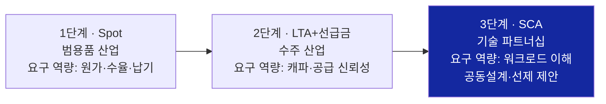

# 개발실 체질 전환 전략 보고서 — LTA에서 SCA로, 수주 이행자에서 기술 파트너로

**작성일**: 2026-07-04
**대상**: 삼성전자 메모리사업부 개발실 및 경영진
**성격**: 빌드 산출물 — 진실의 원천은 wiki ([lta-to-sca-transition.md](../../wiki/concepts/lta-to-sca-transition.md), [dev-org-transformation.md](../../wiki/strategies/dev-org-transformation.md))

---

## Executive Summary

2026년 6월 22일, Micron은 Anthropic과의 계약을 발표하며 더 이상 "장기공급계약(LTA)"이라 부르지 않았다. **전략적 계약(Strategic Agreement)** — 다년 공급 위에 **워크로드 공동 최적화, 고객 AI의 전사 도입, 지분 투자**를 적층한 구조다. 이틀 뒤 실적 발표에서 Micron은 이런 계약을 **SCA(Strategic Customer Agreements)라는 공식 카테고리로 16건, 최소 계약매출 약 $100B**을 공시했다.

이것은 명칭 변경이 아니라 산업의 체질 변화다. 스팟 거래(1단계) → LTA·선급금(2단계, 수주산업화) → **SCA(3단계, 기술 파트너십)**로 계약 구조가 진화하면서, **고객이 사는 것이 "정확한 납품"에서 "공동 기술 드라이브"로 바뀌었다.**

우리 개발실은 1~2단계에 최적화되어 있다 — 고객 요구사항을 정확하게 받아, 높은 품질로, 정확한 시간에 납품하는 것. 이 역량은 여전히 필요하지만 더 이상 충분하지 않다. 고객이 기술 혁신을 시도할 때 함께 토론하며 방향을 정하는 파트너가 아니라 "시키는 대로 만들어오는 기업"으로 인식되는 한, SCA 시대의 계약 테이블에 앉을 수 없다.

본 보고서는 ① 왜 지금인지를 사건으로 증명하고, ② 개발실의 새 역할을 As-Is/To-Be로 정의하며, ③ 전환 실패의 리스크와 성공의 이점을 계량하고, ④ 기술·문화·조직·일하는 방식 4대 축의 전략과 3-Phase 액션 플랜을 제시한다.

---

## 1. 무슨 일이 일어났는가 — LTA가 SCA가 되기까지

### 1.1 사건의 연대기

| 시점 | 사건 | 의미 |
|---|---|---|
| 2025-06 | SK hynix, NVIDIA·Microsoft·Broadcom 3사로부터 **커스텀 HBM 수주 인증** | 제품 정의 주도권이 고객별 공동설계로 이동 |
| 2025-10 | OpenAI Stargate ↔ Samsung·SK hynix **LOI — 월 90만 장 DRAM 웨이퍼(글로벌 ~40%)** | 수주산업화 확정. 미절단 웨이퍼 납품 = 수요처의 기술 관여 심화 |
| 2025~26 | LTA 선급금이 계약가의 **10~30%로 체제화** (역사적 <5%), 2027년까지 DDR 비트 **20~30% 고정가 락인** 전망 | 물량·가격 경쟁 여지 축소 — 남는 경쟁 변수는 기술 관계 |
| 2026-05-28 | Anthropic **Series H** 클로징 ($65B, post-money $965B) — **Micron·Samsung·SK hynix 3사 모두 strategic infrastructure partners 참여** | 메모리 3사가 프런티어 모델사 자본 테이블에 동시 등재 |
| **2026-06-22** | **Micron ↔ Anthropic 전략적 계약** 발표 | LTA 4대 요소를 넘어선 첫 완전체 SCA |
| 2026-06-24 | Micron Q3 FY26 — **SCA 16건, 최소 계약매출 ~$100B, 예치금+금융약정 $22B** 공시 | SCA가 IR 공식 용어·계약 카테고리로 제도화 |

출처: [micron-anthropic-sca-2026-06-22.md](../../sources/articles/micron-anthropic-sca-2026-06-22.md), [lta-to-sca-industry-context-2026-06.md](../../sources/articles/lta-to-sca-industry-context-2026-06.md), [micron-q3-fy26.md](../../sources/filings/micron-q3-fy26.md)

### 1.2 Micron–Anthropic 계약의 해부 — LTA와 무엇이 다른가

| 구성요소 | LTA | SCA (Micron–Anthropic) |
|---|---|---|
| 다년 공급 (HBM·DRAM·SSD) | ✅ | ✅ |
| **공동 최적화** — Claude 학습·추론 워크로드에 맞춘 메모리·스토리지 서브시스템 공동 설계 | ❌ | ✅ |
| **운영 통합** — Micron 엔지니어링·제조 전반에 Claude 배치 | ❌ | ✅ |
| **자본 연계** — Series H 전략적 투자 | ❌ | ✅ |

Anthropic 공동창업자 Tom Brown의 표현이 핵심을 요약한다: 양사는 "AI 워크로드 전반의 메모리·스토리지 성능과 이들이 더 넓은 인프라 스택에 통합되는 방식"을 공동 검토한다. **고객이 사는 것은 칩이 아니라, 자기 워크로드를 이해하고 아키텍처를 함께 최적화하는 파트너다.**

### 1.3 계약 구조 3단 진화와 요구 역량의 이동

우리는 1→2단계 전환(수주산업화)에는 적응했다. 문제는 2→3단계다. 2단계의 승자 조건(정확한 납품)과 3단계의 승자 조건(공동 기술 드라이브)은 **다른 조직 체질을 요구한다.**

---

## 2. 개발실의 새로운 역할 — As-Is vs To-Be

### 2.1 역할 비교

| 차원 | As-Is: 수주 이행자 (Order Executor) | To-Be: 기술 파트너 (Technology Partner) |
|---|---|---|
| **요구사항** | 고객이 확정한 스펙을 정확히 수령 | 고객 워크로드를 먼저 해석, **요구사항을 공동 정의** |
| **제안** | RFQ 응답 — 요청받은 것에만 답변 | 고객 로드맵 분석 기반 **선제 제안** |
| **기술 방향** | 고객·표준이 정한 방향을 추종 | 자사가 유리한 기술 요소를 **드라이브** |
| **성공 지표** | 품질·납기·수율 (QCD) | QCD **+ 공동설계 건수·로드맵 채택률·전환비용** |
| **고객 접점** | 영업이 소유, 개발은 후방 지원 | 개발 엔지니어가 고객 아키텍트와 **직접 상시 교류** |
| **정보 흐름** | 요구사항이 내려오면 착수 | 고객 워크로드를 **상시 센싱** |
| **가치 단위** | 부품 (component) | 서브시스템 최적화 + 임베디드 SW |
| **모델링 범위** | 메모리 디바이스 단품 (스펙·데이터시트) | **랙·데이터센터 전체 시스템 모델** — 성능·전력 효과 정량 예측 |

특히 마지막 행 — **모델링 범위의 확장** — 이 공동 최적화의 기술적 관문이다. SCA의 공동설계는 "이 메모리를 쓰면 고객 워크로드의 성능·전력·TCO가 어떻게 달라지는가"를 계약 전에 정량으로 보여줄 수 있어야 성립한다. Micron–Anthropic이 합의한 것도 부품 스펙이 아니라 "AI 워크로드 전반의 메모리·스토리지 성능과 인프라 스택 통합 방식"의 공동 검토였다. 디바이스 데이터시트로는 이 대화에 참여할 수 없다. 워크로드→서버→랙→데이터센터로 이어지는 **시스템 레벨 성능·파워 모델**, 그리고 그 모델로 고객 시스템 아키텍트와 대등하게 토론할 **자체 시스템 아키텍트·모델링 전문 인력**이 새 역할의 기술적 전제조건이다.

### 2.2 왜 As-Is 체질로는 안 되는가

As-Is 문화는 합리적 적응의 결과였다. 범용품·스팟 시장에서는 고객 요구를 정확히 파악해 빠르고 싸게 만드는 것이 유일한 승리 공식이었고, 우리 조직의 평가·회의·인력 배치가 모두 여기에 맞춰졌다. 그 결과:

- 고객이 새로운 것을 시도할 때 우리의 첫 반응은 "스펙을 확정해 주시면 만들겠다" — 스펙이 확정되기 **전** 단계, 즉 SCA의 공동설계가 일어나는 바로 그 단계에 개입하지 못한다.
- 고객 시야에서 우리는 실행력 있는 제조사이지 기술 토론 상대가 아니다 — 커스텀 HBM 인증 경쟁에서 SK hynix에 뒤처진 구조적 배경 ([lta-to-sca-industry-context-2026-06.md](../../sources/articles/lta-to-sca-industry-context-2026-06.md) §3).
- 베인 신문섭 파트너 진단과 동일: 공급 사이클 → 수요 검증 사이클로 바뀌는 국면에서 **Commodity→Customization 체질 전환**이 최우선 과제 ([expert-interview-ai-infra-supercycle-2026-06-18.md](../../sources/raw-notes/expert-interview-ai-infra-supercycle-2026-06-18.md)).

---

## 3. 리스크와 이점 — 전환하지 않으면, 전환하면

### 3.1 전환 실패 시 리스크 (Do Nothing의 비용)

| # | 리스크 | 근거 사건 |
|---|---|---|
| R1 | **SCA 수주 배제** — 다년 최소매출 락인($100B급) 계약군에서 배제, 사이클 방어 수단 상실 | Micron SCA 16건 $100B — 공동설계 역량이 계약의 전제 |
| R2 | **커스텀 전환기 점유율 고착** — 커스텀 HBM이 범용을 대체하면 범용 잔여 시장에 갇힘 | 커스텀 HBM 시장 2033년 $130B 전망, SK hynix 3사 인증 선점 |
| R3 | **가격 결정력 상실** — 기술 관계 없는 공급자는 대체 가능한 2nd source로 취급 | LTA 고정가 체제에서 가격 경쟁 여지 자체가 소멸 |
| R4 | **미래 기술 선점 실패** — 고객 워크로드 조기 접근 없이는 차세대 제품 정의를 항상 후행 | HBM4 로직 베이스다이 3자 공동설계 구조 |

### 3.2 전환 성공 시 이점

| # | 이점 | 메커니즘 |
|---|---|---|
| B1 | **지속 가능한 매출** | 공동설계 락인 → 최소 약정 매출 + 선급금 → 사이클 진폭 완화 (RS-8) |
| B2 | **수익률 프리미엄** | 커스텀·공동설계 제품의 가격 결정력 — Micron 매출총이익률 84.9%의 기반은 SCA 예측가능성 |
| B3 | **미래 기술 선점** | 워크로드 조기 가시성 → 차세대 표준을 자사 유리하게 드라이브. IDM 5종 메모리 통합 제안은 경쟁사가 복제 불가한 카드 |
| B4 | **자본 연계 옵션** | 전략적 파트너 지위 → 고객 자본 테이블 참여(Series H 모델) 등 관계 심화 |

**비대칭성에 주목**: 리스크는 구조적·비가역적(한 번 2nd source로 고착되면 복구 비용이 크다)이고, 이점은 누적적·복리적(공동설계 관계는 세대를 거듭할수록 깊어진다)이다. 조기 전환의 기대값이 압도적으로 크다.

---

## 4. 전환 전략 — 4대 축

상세: [dev-org-transformation.md](../../wiki/strategies/dev-org-transformation.md) §4

| 축 | 핵심 조치 | 목적 |
|---|---|---|
| **기술** | 워크로드 랩 신설 · **시스템 레벨 성능·파워 모델**(디바이스→서버→랙→DC, 실측 캘리브레이션, 고객 공용 시뮬레이션 자산화) · 커스텀 설계 플랫폼화 · 임베디드 SW 스택 | 공동 최적화 제안의 기술적 기반 |
| **문화** | "정답 구현"→"가설 제안" · 실패 허용 예산 · 트레이드오프 토론 표준화 | 선제 제안이 보상받는 행동 체계 |
| **조직** | 고객별 Co-Design Pod · **시스템 아키텍트·모델링 전문 조직 신설**(외부 채용+내부 육성, Pod에 아키텍트 공급) · 워크로드 인텔리전스 기능 · 기술 마케팅 승격 | 개발 엔지니어를 고객 아키텍트 옆으로 |
| **일하는 방식** | 로드맵 교차 리뷰(분기) · 선행 시제품(PoA) 사이클 · AI 도구 내재화 | 스펙 확정 전 단계 개입 + 시간 재배치 |

문화 축이 가장 느리고 가장 결정적이다. 기술·조직은 투자로 살 수 있지만, "요구받지 않은 제안을 하는 엔지니어가 승진하는 조직"은 평가·보상·리더십 행동의 일관된 변화 없이는 만들어지지 않는다.

## 5. 액션 플랜 — 3 Phase

### Phase 1 · 90일 (증명): 파일럿 고객 1사 Co-Design Pod 발족, 워크로드 랩 최소 구성 + 시스템 모델 v0.1(디바이스→서버 레벨, 실측 오차 검증), 선제 제안 1호 제출, KPI 개정안 설계
### Phase 2 · 1년 (제도화): Pod 3~5개 확대, **시스템 아키텍트·모델링 전문 조직 신설**(모델 v1.0 랙 레벨), 로드맵 교차 리뷰 정례화, PoA 연 4회, 개정 KPI 전면 적용, **SCA형 계약 1건 이상 수주**
### Phase 3 · 3년 (표준화): 커스텀 설계 플랫폼 완성(리드타임 50%↓), 시스템 모델 v2.0(데이터센터 레벨·고객 공용 시뮬레이션 자산), "전략적 인프라 파트너" IR 공시 수준 도달, 임베디드 SW 별도 P&L

### KPI 대시보드

| 지표 | 현재 | 1년 | 3년 |
|---|---|---|---|
| 공동설계 조항 포함 계약 | 파악 필요 | 1건+ | 분기 공시 수준 |
| 선제 제안 건수 (연) | ~0 | 12건 | 40건 |
| 제안→로드맵 채택률 | — | 20% | 35% |
| 개발 엔지니어 고객 직접 교류 시간 | 낮음 | 10% | 25% |
| 커스텀 제품 매출 비중 | 낮음 | 추적 | 30%+ |
| 시스템 모델 커버리지 | 디바이스 | 서버→랙 (v1.0) | 데이터센터 (v2.0)·고객 공용 |
| 시스템 아키텍트·모델링 인력 | 전담 없음 | 전담 조직 출범 | Pod당 1명+ 공급 |

## 6. 시나리오 플래닝 정합성

본 전략은 특정 시나리오에 베팅하지 않는 **Robust 성격**이다: B(AI 르네상스)에서 SCA 시장 최대 개화, A(황금 요새)에서 진영 내 SCA 심화, C·D(AI 조정)에서 최소 약정 락인이 방어벽, E(패러다임 전환)에서 워크로드 조기 가시성이 헤지. 기존 전략 체계와의 연결: **MB-4**(커스텀 AI 메모리)의 조직적 전제조건이며, **RS-3**(전환비용)·**RS-7**(AI 자동화)·**RS-8**(구조화 매출)·**RS-9**(수요 센싱)의 개발실 실행 계층이다.

---

*본 보고서는 wiki에서 합성된 빌드 산출물이다. 수치·주장의 원출처는 wiki 페이지와 sources/ 파일을 따른다.*
