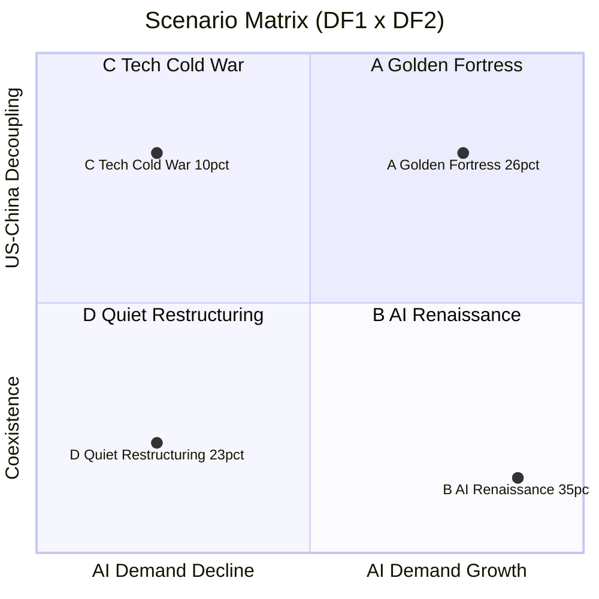

# 삼성전자 메모리사업부
# AI 메모리 시대의 전략적 선택: 시나리오 플래닝 기반 전략 보고서

**작성일**: 2026년 5월 6일 (Q1 2026 실적 + 벤치마크 통합 업데이트) | **최종 데이터 갱신**: 2026년 6월 13일 (병목 모델 지수 업데이트 + HBM4E·Vera Rubin 반영)
**방법론**: Shell 시나리오 플래닝 + 사이클 전략 벤치마킹(7개 산업 사례)
**대상**: 삼성전자 DS부문 메모리사업부 경영진

---

## Executive Summary

본 보고서의 한 문장 요약은 다음과 같다 — *호황의 정점에서 다운턴을 준비하는 유일한 방법은 어느 미래가 와도 작동하는 9개 Robust 전략(2026-06 수요 변곡 센싱 RS-9 신설)과 2026년 Q4 안에 묶음으로 처리해야 하는 17개 결정이다.*

- **호황 속 구조적 패배**. 2026년 1분기 메모리 매출은 사상 최대 $50.4B(+292% YoY)를 기록했고 빅테크 AI CapEx는 $725B(+77%)로 폭주하고 있으며 HBM4 캐파는 전량 Sold Out 상태다. 그러나 NVIDIA Rubin HBM4 1번 자리는 SK하이닉스(70%)가 가져갔고 삼성은 28%로 후순위로 밀렸다. 메모리는 지난 30년 5번의 다운턴마다 매출 −38%·이익 −84%가 사라진 사이클 산업이며 다음 다운턴은 반드시 온다 — 호황 속의 점유율 패배는 다운턴 손실을 키운다.

- **두 축이 만드는 다섯 개의 미래**. 답할 수 없는 두 질문이 미래를 가른다. 첫째, AI 수요는 구조적으로 지속되는가(DF1). 둘째, 미중 디커플링은 어디까지 가는가(DF2). 두 축의 조합이 시나리오 A부터 E까지 다섯 개의 대안적 미래를 정의하며, 각 시나리오의 2035년 메모리 시장 규모는 $1,800억에서 $5,200억까지 갈린다.

- **Main Bet은 시나리오 B "AI 르네상스" (확률 30~35%)**. 5개 시나리오 중 시나리오 B만이 2035년 시장 $5,200억 규모로 가장 크고 삼성의 동서 균형 포지션이 최대 가치를 발휘하는 유일한 미래다. 그러나 자동 실현되지 않는다. HBM4E·HBM5 기술 1위 탈환, 동서 균형 공급망(텍사스+인도), 1c nm 원가 우위, 커스텀 AI 메모리 솔루션, 텍사스 2기 미국 현지 생산이 동시에 추진되어야 1번 자리를 회복할 수 있다.

- **어떤 미래가 와도 가치를 만드는 Robust 9개 전략**. 시나리오 불확실성과 무관하게 작동하는 9개 전략을 네 개 축으로 묶었다. *공급 거버넌스* 축의 RS-1(옵션형 캐파 — Fab Shell + 장비 단계 반입)과 RS-5(재무 규율 + 다운사이클 capex 4조 원 하한, Nucor·ExxonMobil 모델 적용)는 호황기 절제와 다운턴 사수를 같은 거버넌스 안에 넣는다. 여기에 2026-06 신설한 **RS-9(데이터 기반 수요 변곡 센싱)**가 같은 축에 더해진다 — AI DC 착공 트래커(55.9GW·17개국) + 수요 변곡 EWI 앙상블(선행·끈적·공급 과잉·SCM 공급망 + 괴리 밴드)로 하락 변곡을 선행 신호에서 먼저 잡아 RS-1 캐파 on/off와 RS-5 규율을 *제때* 발동하는 트리거 역할을 한다. *포트폴리오* 축의 RS-2(바벨, HBM ↔ 범용 1c nm 양 끝)와 RS-6(공정 리더십 — 1c nm DRAM + NAND 주기 연장 4트랙 + Hybrid bonding 자체 IP로 YMTC 종속 회피)은 사이클 양면에서 모두 흑자가 가능한 제품 구조를 만든다. *고객 관계* 축의 RS-3(고객 락인 — CMX·SCADA·FDP 3대 통합 + Marriott식 Asset-Light SW 매출)와 RS-4(고객 분산 — LTA·Take-or-Pay·단일 고객 ≤25%)는 협상력의 양면을 동시에 잡는다. 마지막으로 *신규 도구* 축에는 RS-7(AI 엔지니어링 자동화 — 잉여 인력을 RS-2·3·6에 전환 배치하는, 모든 RS의 prerequisite)과 RS-8(구조화 매출 헷지 — Participating Forward + HTA + Memory Trading Desk로 매출 변동성을 ±25%에서 ±12%로 절반 축소하는, 농수산·외환 100년 헷지 노하우의 메모리 첫 도입)이 들어간다.

- **2026년 Q4 안에 묶음으로 처리해야 할 17개 결정**. 17개 결정은 단일 결정으로 분리하면 효과가 사라진다. 가장 임박한 D-150에는 D1(HBM4 NVIDIA 점유율 28→40%), D2(소재 비중국 다각화), D6(RS-1·4·5 이사회 정책화)와 2026-06 신설 D15(수요 변곡 조기경보 운영 — RS-9), D16(호황 정점 공급 규율 즉시 발동 — RS-5, critical)이 묶여 있다. D-240에는 R&D·생산 영역의 D3(3D DRAM + IMEC 협약), D4(텍사스 1·2단계), D5(AI 효율화 전사 도입), D8(텍사스 추가 보조금), D10(NAND 4트랙 R&D), D11(Stargate Korea 본 계약), D13(SE-1 3D DRAM 가속 — IMEC $300M+ 상향·조직 확대), D14(SE-2 CXL 표준 주도권 4단계)과 거버넌스·헷지 영역의 D9(다운사이클 M&A 펀드 5,000억), D12(RS-8 구조화 헷지 시범), D17(소버린·신흥 수요처 다변화 — RS-4)이 함께 처리된다. 가장 후순위인 D-330에는 D7(AI 잉여 인력 RS-2·3 전환 배치)이 위치한다.

- **호황의 정점이 다운턴 준비의 마지막 기회다**. 다운턴은 막을 수 없다. 그러나 다운턴이 와도 흑자를 유지하고(RS-5·RS-8), 회복기에 1번 자리를 회복하고(MB-1·RS-3), 자산 가격 폭락 시 즉시 M&A를 집행하는 것(Option L-4)은 구조로 해결할 수 있다.

### 핵심 수치 한눈에 (2026년 6월 13일 최신)

| 항목 | 수치 | 시사점 |
|------|------|---------|
| Samsung Q1 2026 메모리 매출 | $50.4B (+292% YoY), DS 영업이익 약 49배(53.7조 원) | 호황의 정점·ROI 실현 확인 |
| **Micron Q3 FY26 실적 (2026-06-24)** | **매출 $41.46B (+74% QoQ·+346% YoY), 매출총이익률 84.9%, EPS $25.11** — 가이던스 $33.5B 전면 상회 | DRAM ASP +low-60s% QoQ(가격 동인). SCA 16건 $100B·예치금 $22B. Q4 가이던스 $50B. 슈퍼사이클 정점 확증 |
| 빅테크 4사 AI CapEx 2026 | **$700~725B** (+77% YoY, 상단 수렴·Meta 상향) | 메모리 수요 근거 확증. Microsoft $25B 메모리 비용 직접 인정 |
| HBM4 NVIDIA Rubin 공급 | SK 2/3 락인 (Counterpoint·현지언론), 삼성 회복. 3사 모두 **2026-06-05 공식 인증** | 삼성 점유율 25~30%(Q1 2026 추정, 마이크론 재추월) |
| **NVIDIA Rubin 생산 목표** | **200만 대 → 150만 대(−25% 하향**, KeyBanc) | HBM4 인증 지연. 패키징 병목 일부 완화 |
| **삼성 HBM4E 업계 최초** | **2026-05-29 샘플 출하**(3.6TB/s, SK하이닉스보다 6개월 선행) | HBM4E 세대 점유율 역전 가능성 열림. HBM5 목업도 공개 |
| Q2 2026 DRAM 가격 | 서버 DDR5 +58~63% QoQ, 모바일 +93~98% QoQ | NAND 5월 둔화 신호 — 정점 임박 감시 필요 |
| **4대 병목 제약지수 (2026-06-13)** | 전력 **68**(▲+4) · CAPEX **44**(▼-2) · 파운드리 **54**(▼-2) · 패키징 **70**(▼-2) | 전력 유일 악화·미국 DC 23→42GW·대기 2,600GW/5~12년 |
| HBM 점유율 (Q3 2025 → Q1 2026 추정) | SK 57%→60~65% / Samsung 22%→25~30% / Micron 21%→10~15% | 삼성 회복 궤도, 마이크론 급락. Main Bet KPI(28%+) 달성 근접 |
| TSMC 5월 2026 매출 | NT$417B YoY +30.1% (단월 사상 최고), N2 50K→140K WPM 순항 | 파운드리 병목 완화 추세 |
| Micron 미국 캐파 | 10% → 40% (10년) $200B 약정 | 미국 메모리 자급 비중 상승 — 시나리오 A 강화 |
| CXMT HBM3 양산 | 2026년 개시, 월 60K 웨이퍼 | 2027년 HBM3E, 2028년 HBM4 위협 |
| 텍사스 테일러 CHIPS 보조금 | $4.745B 확정 (목표 $6~8B의 60~80%) | 2단계 추가 협상 필수 (Decision 8) |

---

## 1. 왜 지금 시나리오 플래닝인가?

### 1.1 현재 상황: 호황의 함정

2026년 글로벌 메모리 시장은 사상 최고 호황 국면에 있다. TrendForce 기준 전체 시장 규모는 2026년 $551.6B(+134% YoY), 2027년 $842.7B으로 폭발적 성장이 전망된다. HBM 시장만 해도 2026년 $54.6B(Bank of America)으로, 전 제품이 Sold Out 상태다. 빅테크 4개사(구글·마이크로소프트·아마존·메타) 합산 AI CapEx는 $650~725B으로 전년 대비 40% 이상 증가했다.

그러나 이 호황 속에 삼성전자 메모리사업부는 구조적 위기 신호를 동시에 받고 있다.

- **점유율 역전**: 2025년 1분기 SK하이닉스가 삼성전자를 33년 만에 처음으로 DRAM 시장 점유율에서 추월했다 (SK하이닉스 36% vs 삼성 33%, Korea Herald). 2025년 연간 DRAM 매출도 SK하이닉스($49.6B) > 삼성($46.4B)으로 역전됐다.
- **HBM 추락**: HBM3E 품질 이슈로 2025년 2분기 삼성전자 HBM 점유율은 17%까지 추락했다 (2023년 40% → 2025년 Q2 17%, Counterpoint Research). SK하이닉스는 같은 시점 62%를 점유했다.
- **AI 버블 경고음**: MIT 보고서에 따르면 엔터프라이즈 AI 투자의 95%가 ROI 미실현 상태다. NBER(2026) 조사에서 기업 90%가 AI의 생산성 효과를 체감하지 못하고 있다. Sam Altman(OpenAI), Jamie Dimon(JP Morgan)도 AI 거품 가능성을 공개 경고했다.
- **지정학 리스크**: 시안 팹(글로벌 NAND 생산의 40%)은 VEU¹ 폐지 이후 연간 라이선스 갱신 리스크에 노출됐다. 2026년 4월 발의된 MATCH² 법안이 통과되면 장비 반입이 전면 차단될 수 있다.

> **용어 주석**  
> ¹ **VEU (Validated End-User)**: 미국 BIS³가 특정 기업을 신뢰 수출 대상으로 사전 승인하여 개별 라이선스 없이 통제 품목 수출을 허용하는 제도. 2023년 폐지 후 라이선스 연간 갱신 체제로 전환.  
> ² **MATCH (Microchip Access to Trade, Commerce and Heroic manufacturing) Act**: 중국 내 반도체 장비 반입을 전면 차단하는 미국 의회 법안(2026년 발의). 통과 시 삼성 시안 팹 장비 업그레이드 불가.  
> ³ **BIS (Bureau of Industry and Security)**: 미국 상무부 산업안보국. 반도체 수출 통제 규정(EAR) 집행 기관.  
> ⁴ **P&L (Profit & Loss)**: 손익 — 독립 P&L 센터는 별도 매출·비용·이익을 집계하는 사업 단위를 의미.  
> ⁵ **FCF (Free Cash Flow)**: 영업현금흐름에서 설비투자(Capex)를 차감한 잉여 현금 흐름.  
> ⁶ **EWI (Early Warning Indicator)**: 시나리오 전환 신호를 사전에 포착하기 위한 선행 모니터링 지표.

### 1.2 불확실성의 본질

단순한 수요 예측이 아닌 시나리오 플래닝이 필요한 이유는 두 가지 핵심 불확실성이 '독립적으로' 작동하기 때문이다.

첫째, **AI 수요의 구조적 지속성**: AI CapEx가 2030~2035년까지 슈퍼사이클로 이어질지, 아니면 ROI 실망으로 2027~2028년 급격히 위축될지는 기술 내적 ROI 논리에 의해 결정된다.

둘째, **미중 기술 디커플링의 강도**: 미국 주도 수출 통제가 전면적 디커플링으로 치달을지, 아니면 경제적 상호의존에 의한 관리된 공존으로 수렴할지는 외교·안보 논리에 의해 결정된다.

이 두 변수는 서로 독립적이며, 각각 양 극단으로 전개될 경우 삼성전자에게 근본적으로 다른 전략을 요구한다. 어느 하나의 경로만 가정한 단선적 계획은 위험하다.

### 1.3 Focal Issue

> **삼성전자 메모리사업부가 AI 메모리 시대인 2030~2035년에도 글로벌 리더십을 유지하기 위해, 어떤 전략적 결정을 지금(2026년) 내려야 하는가?**

---

## 2. 현황 진단: 삼성전자 메모리의 현주소

### 2.1 시장 환경 (데이터 기반)

| 지표 | 수치 | 출처 |
|------|------|------|
| 글로벌 메모리 시장 (2026E) | $551.6B (+134% YoY) | TrendForce, 2026 |
| HBM 시장 규모 (2026E) | $54.6B | Bank of America, 2026 |
| HBM 시장 규모 (2028E) | ~$100B | 업계 복수 추정치 |
| HBM4 평균 단가 | $500/개 (HBM3E $300 대비 +67%) | HBM 시장 데이터, 2026 |
| 빅테크 4사 합산 AI CapEx (2026E) | $650~725B (+40%+ YoY) | CNBC, Tom's Hardware |

2026년은 AI 수요 급증으로 HBM 전 물량이 Sold Out이며, DRAM 전체 시장도 AI 서버용 수요가 구조적 성장 동력이 됐다. 단, 2028~2029년 마이크론 Idaho·SK하이닉스 용인 신규 팹이 동시 완공되면서 공급 과잉 전환 리스크가 내재한다.

### 2.2 경쟁 구도 변화

HBM 시장에서의 점유율 변화가 전체 DRAM 패권을 뒤흔들고 있다.

| 구분 | 삼성전자 | SK하이닉스 | 마이크론 |
|------|---------|-----------|---------|
| DRAM 점유율 (2023) | 43% | 28% | 25% |
| DRAM 점유율 (Q3 2025) | **32.6%** | **33.2%** | 25.7% |
| HBM 점유율 (2023) | 40% | 50% | 10% |
| HBM 점유율 (Q2 2025) | **17%** | **62%** | 21% |
| HBM 점유율 (Q3 2025, Astute) | 35% | 53% | 11% |
| HBM 점유율 (Q3 2025, Counterpoint) | **22%** | **57%** | 21% |
| FY2025 영업이익 (조 원) | 24.9 (메모리만) / 43.6 (전사) | **47.2** (사상 최초 Samsung 전사 초과) | — |

SK하이닉스는 NVIDIA H100/H200/B200 시리즈의 HBM3E 주요 공급업체로 확고한 입지를 구축했으며, UBS는 NVIDIA 루빈(Rubin) 플랫폼 HBM4 시장에서도 SK하이닉스가 70% 점유를 전망하고 있다. **Counterpoint Research(2026-01)와 현지 언론은 한 단계 더 나아가 SK하이닉스가 Rubin HBM4 공급량의 2/3 이상을 이미 락인했다고 평가한다.** 마이크론은 2024년 7%에서 Q2 2025년 21%로 HBM 점유율을 3배 이상 성장시켰다(단 Q3 2025 Astute는 11%, Counterpoint는 21%로 두 기관 추정이 갈림). **Counterpoint MS Hwang은 SK하이닉스를 "outstanding AI Winner in Asia"로 평가했다.** 중국의 CXMT·YMTC는 2025년 Q3 기준 합산 약 8~10%로 범용 메모리 시장 진입을 가속하고 있다.

**삼성전자 함의 (2026-05-25)**: Q3 2025 HBM 점유율은 Astute 기준 35%, Counterpoint 기준 22%로 기관 간 격차가 크다. Main Bet KPI("HBM 28%+ 회복")는 Astute 기준 충족, Counterpoint 기준 6%pt 미달. **두 기관의 평균(약 28%)이 실제 시장 진실에 가깝다고 가정하면 KPI는 경계선 수준이며, Rubin 2/3+ SK 락인이 사실이면 HBM4E·HBM5(2027~) 세대로 KPI 윈도우를 이동하는 것이 안전.**

### 2.3 삼성전자의 강점과 약점

| 구분 | 내용 |
|------|------|
| **강점 (S)** | 그룹 차원의 자금력 및 순현금 규모 / 시안·평택·텍사스 멀티-팹 글로벌 네트워크 / DRAM·NAND 통합 포트폴리오 (경쟁사 대비 리스크 분산) / PIM(LPDDR5X-PIM), CXL 등 신기술 선행 개발 이력 / K-칩스법 세액공제(20%, 2031년 일몰) |
| **약점 (W)** | HBM3E 품질 이슈로 인한 NVIDIA 신뢰 손실 / 어드밴스드 패키징(하이브리드 본딩) 기술 SK하이닉스 대비 1~2세대 후행 / 1c nm DRAM 수율 50~70% 수준 (개선 진행 중) / HBM 전담 의사결정 조직 미흡 |
| **기회 (O)** | AI 르네상스 시나리오 하 동서 양쪽 시장 동시 공략 가능한 유일한 플레이어 / 텍사스 테일러 팹 CHIPS Act 2.0 보조금 수령 가능성 / 인도·중동·동남아 신흥 AI 시장 개화 / 3D DRAM·PIM·CXL 차세대 기술 선점 기회 / **NVIDIA CMX 에코시스템 공식 공급 파트너(PM1753/PM1763) — HBM+SSD 이중 수혜 포지션** |
| **위협 (T)** | 시안 팹(NAND 40%) MATCH 법안 통과 시 장비 반입 차단 / SK하이닉스 HBM 기술 우위 고착화 리스크 / AI 버블 붕괴 시 HBM 재고 급증 + 대규모 설비투자 손실 / CXMT의 범용 DRAM 시장 가격 공세 / **SK하이닉스·Kioxia의 NVIDIA SCADA AI SSD 전략 파트너십 고착화 위험 — SSD에서 HBM 경험 반복 가능성** |

---

## 3. 환경 분석: STEEP

### 3.1 분석 개요

STEEP 방법론(Social·Technology·Economy·Environment·Political)으로 삼성전자 메모리사업부의 2030~2035년 전략 환경에 영향을 미칠 50개 요인을 도출했다. 각 요인은 Impact(1~5점)와 Uncertainty(1~5점)로 평가해 I×U 합산 점수로 우선순위를 결정했다.

- **핵심 불확실성**: Impact ≥4 + Uncertainty ≥4 → 20개 요인
- **기정사실(Predetermined Element)**: Impact ≥3 + Uncertainty ≤3 → 8개 요인 (모든 시나리오에 공통 반영)
- **주변부 요인**: 모니터링 수준으로 관리

### 3.2 핵심 불확실성 요인 (상위 10개)

| 순위 | 요인 | 분류 | I×U | 핵심 내용 |
|------|------|------|-----|---------|
| 1 | 3D DRAM 상용화 시점 | T | 25 | 기술 패러다임 전환의 핵심 분기점 |
| 2 | AI 버블 붕괴 시나리오 | Ec | 25 | HBM 수요 전체를 뒤흔드는 거시 위험 |
| 3 | 미국 대중국 반도체 수출 통제 | P | 25 | 삼성 시안 팹·HBM 수출 직결 |
| 4 | 대만 해협 지정학 리스크 | P | 25 | 공급망 재편의 최대 변수 |
| 5 | HBM 세대 전환 속도·고객 인증 경쟁 | T | 20 | 2026~2028년 점유율 직결 |
| 6 | 커스텀 AI 칩(ASIC) 확산과 NVIDIA 의존도 변화 | T | 20 | HBM 고객 구조 변화 |
| 7 | AI CapEx 지속 여부 | Ec | 20 | HBM 수요의 근본 드라이버 |
| 8 | 메모리 반도체 가격 사이클 전환 위험 | Ec | 20 | 수익성 사이클 결정 |
| 9 | 동맹국 공조 수출 통제(MATCH 법안) | P | 20 | 시안 팹 전면 제약 가능성 |
| 10 | 미중 기술 디커플링 심화 | P | 20 | 전체 공급망 전략의 근본 재편 |

### 3.3 기정사실 (High Impact, Low Uncertainty)

이미 방향이 확정된 트렌드로, 모든 시나리오에서 전략적 전제 조건으로 반영해야 한다.

| 기정사실 | 전략 반영 방식 |
|--------|------------|
| DDR6 2027년 대규모 상용화 | 모든 시나리오에 세대 전환 일정 반영 |
| 반도체의 국가 안보 자산화 | 정부 개입·보조금 구조를 모든 팹 투자 계획에 내재화 |
| 선진국 스마트폰·PC 수요 구조적 둔화 | AI 서버 중심 수요 재편을 기정사실로 포트폴리오 구성 |
| K-칩스법 세제 지원 (2031년까지) | 한국 팹 투자 세액공제 20%를 투자 수익률 계산에 반영 |
| 2026~2028년 CapEx 증가 추세 | 경쟁사도 동시에 투자 확대 — 기술 우위 없이는 점유율 방어 불가 |
| CHIPS Act 조건 하 미국 팹 의무화 | 텍사스 팹 조건 이행을 기정사실로 미국 현지 운영 계획 수립 |
| **NVIDIA Vera Rubin 플랫폼 중심 AI 추론 인프라 재편** | CMX(G3.5 KV 캐시 계층)·SCADA(GPU 네이티브 스토리지) 생태계를 AI SSD·HBM 전략의 전제 조건으로 내재화 |

### 3.4 신규 기술 트렌드: NVIDIA CMX & SCADA AI 스토리지 아키텍처

AI 추론 인프라의 스토리지 레이어가 근본적으로 재설계되고 있다. NVIDIA가 주도하는 두 플랫폼은 삼성전자 메모리사업부와 SSD 사업 모두에 직접적인 영향을 미친다.

#### NVIDIA CMX (Context Memory Storage Platform)

CMX는 NVIDIA GTC 2026에서 공개된 AI 추론용 컨텍스트 메모리 스토리지 플랫폼으로, NVIDIA Vera Rubin 플랫폼의 핵심 구성 요소다. 장문맥(Long-Context) AI 추론과 에이전틱 AI 워크로드에서 GPU HBM 메모리를 빠르게 소진하는 KV 캐시(Key-Value Cache) 문제를 해결하기 위해 설계됐다.

**메모리 계층 구조 재편:**

| 계층 | 미디어 | 지연 | 역할 |
|------|--------|------|------|
| G1 | GPU HBM | 나노초 | 활성 계산 (핫 데이터) |
| G2 | 시스템 DRAM | 수십 나노초 | KV 스테이징/버퍼링 |
| G3 | 로컬 NVMe SSD | 마이크로초 | 단일 노드 캐시 |
| **G3.5** | **CMX (이더넷 연결 플래시)** | 마이크로초~수백 마이크로초 | **공유 포드 레벨 KV 캐시** |
| G4 | 공유 스토리지 | 밀리초 | 지속성 데이터 |

CMX는 BlueField-4 DPU(2026년 하반기 출하 예정)와 DOCA Memos SDK, Spectrum-X 이더넷 패브릭으로 구성되며, 장문맥 워크로드에서 **최대 5배 TPS 향상 및 5배 전력 효율 향상**을 달성한다.

**삼성전자 포지션**: PM1753(PCIe Gen5)이 CMX 공식 공급 SSD로 확정됐으며, PM1763(PCIe Gen6, 순차 읽기 28.4 GB/s)이 Vera Rubin 메인 스토리지로 GTC 2026 시연에 활용됐다. HBM 관점에서는 CMX가 HBM을 대체하는 것이 아니라 HBM 활용도를 극대화하는 오프로드 계층이므로 기회 요인이 우세하다.

#### NVIDIA SCADA (Scaled Accelerated Data Access)

SCADA는 일반 산업제어 SCADA와 완전히 다른 기술로, GPU가 스토리지 I/O를 CPU를 거치지 않고 직접 시작·제어하는 **GPU 네이티브 스토리지 프로그래밍 모델**이다. AI 추론에서 지배적인 4KB 이하 소형 블록 I/O에서 기존 GPUDirect Storage 대비 CPU 병목을 완전히 제거한다.

SC'25(2025년 11월)에서 Micron 9650 PCIe Gen6 SSD 44개를 연결해 **2억 3천만 IOPS**를 달성했으며, NVIDIA의 최종 목표는 단일 SSD에서 1억 IOPS다.

**AI SSD 파트너십 경쟁 구도:**

| 업체 | NVIDIA 파트너십 | 목표 IOPS | 예상 시기 | NAND 타입 |
|------|----------------|-----------|----------|-----------|
| **Micron** | 최초 레퍼런스 (9650 Gen6) | 540만 IOPS (현재) | 양산 중 | TLC |
| **SK하이닉스** | 공동 개발 (AI-N P) | 2,500만 → 1억 IOPS | 2026~2027 | SLC |
| **Kioxia** | 공동 개발 | 1억 IOPS | 2027 | SLC |
| **삼성전자** | 생태계 참여 (PM1763 시연) | 미공개 | 미정 | TLC (Gen6) |

**삼성전자 핵심 위험**: SK하이닉스가 SLC NAND 기반 초고 IOPS AI SSD와 Phison 컨트롤러 조합으로 NVIDIA Storage-Next의 레퍼런스 파트너로 고착화될 경우, HBM에서 경험한 구조적 열위가 SSD 사업에서 반복될 수 있다. 2026년이 SCADA 호환 AI SSD 전략 수립의 임계 시점이다.

---

## 4. 핵심 Driving Forces

### 4.1 선정 과정

50개 STEEP 요인 중 I×U 최상위 그룹에서 두 가지 기준을 적용해 Driving Force(DF)를 선정했다.

1. **점수 기준**: I×U 합산 점수 최상위 그룹 (I×U = 25)
2. **독립성 기준**: 두 축이 서로 독립적인 인과 경로를 가져야 함 — 한 축이 다른 축의 원인·결과 관계로 포섭되지 않아야 함

DF1(AI 수요 구조)과 DF2(미중 지정학 강도)는 각각 기술·경제 내적 논리와 외교·안보 논리로 작동하여 독립성을 충족한다. DF3(AI 메모리 기술 패러다임)은 보조 축으로 선별해 와일드카드 시나리오(E)에 활용한다.

### 4.2 DF1: AI 수요의 구조적 지속성

**정의**: 빅테크·하이퍼스케일러의 AI 데이터센터 투자(CapEx)와 이에 기반한 HBM·고부가 메모리 수요가 2030~2035년까지 구조적으로 유지되는지, 아니면 AI ROI 실망·금융 버블 붕괴로 급격히 위축되는지.

| 극단 | 설명 |
|------|------|
| **Pole A (슈퍼사이클)** | AI ROI 실현 → 빅테크 CapEx 2027년 $1조 돌파 → HBM이 DRAM 매출의 50% 차지 → "황금기" |
| **Pole B (버블 붕괴)** | AI ROI 미실현 → 빅테크 CapEx 급삭감 → 신규 팹 공급 과잉 → 2022~2023년형 메모리 불황 재현 |

**현재 위치**: 근위(近位) 슈퍼사이클 정점이 확인되었다 — Micron 주가 +7.6×(Q3 FY26 실적 발표 직후 시간외 +13.7%·~$1,192), Micron Q3 FY26 매출 $41.46B(+346% YoY, 매출총이익률 84.9% 사상최고)·Q4 가이던스 $50B·SCA 16건 $100B, 전 세계 AI DC 착공 파이프라인 55.9GW(17개국), HBM sold-out. 그러나 동시에 **선행 균열**도 형성 중이다 — 수요 변곡 조기경보(EWI) 복합 위험 43(주의)·공급 과잉 축 68(경계)·SCM 공급망 축 56(경계 근접), GPU 현물 임대가 둔화, DC 착공 일부 취소, DRAM 영업이익률이 HBM을 초과 — HBM sold-out·LTA·선급금 정점(할당 커버리지 최대)이 역설적 언와인드 셋업. 2027~2028년이 AI 수익화 가시화의 분기점이며, **AI DC 착공 트래커 + 수요 변곡 EWI가 DF1 방향(특히 하락 변곡)을 조기 센싱하는 공식 도구**다(전략 RS-9).

**Bain 컴퓨트 경제학 갭 (베인앤컴퍼니 신문섭 파트너)**: AI 수요 지속성 논쟁에 자본·매출 경제학 렌즈를 더한다. 베인 6th Global Technology Report는 2030년 AI 컴퓨트 수요 충족에 연 **$500B DC capex**가 필요하나 이를 *수익성 있게* 회수하려면 **신규 매출 $2조/년**이 필요하며 — 온프레미스 IT 예산 전액을 클라우드로 옮기고 AI 절감액의 20%를 재투자해도 **연 $800B 자금 갭**이 남는다고 본다. 단 수요 자체는 견조(2030 글로벌 컴퓨트 200GW·DC 용량 163GW·**메모리 = 하이퍼스케일러 AI 지출의 ~30%**, 2023~24 ~8%에서 급등)로 보며, 하이퍼스케일러가 "원시적 확장 → 규율 있는·전력 인식형(power-aware) 성장"(자본 효율)으로 전환 중이고 **전력 접근성이 GPU·건설을 넘어선 1순위 게이트키퍼**라 진단한다. "수요는 살되 자본 효율·전력이 변수"라는 중간 입장으로, RS-1(옵션형 캐파)·RS-5(재무 규율)·RS-9(수요 변곡 센싱)의 규율형 대응을 외부에서 정합 지지한다 ([ai-compute-economics-gap.md](../../wiki/concepts/ai-compute-economics-gap.md)).

**2030 병목 정량 모델 (딥리서치, 2026-06-10)**: DF1의 상방·하방을 **4대 병목 — 전력·CAPEX/ROI·선단 파운드리·첨단 패키징 — 의 min() 제약**으로 정량화했다. 2030년 메모리 수요는 기술적 상한이 아니라 "배치 가능한 상한"이 결정한다: 기준 시나리오에서 HBM-GPU 서버 출하 **125만 대**(잠재 164만 대의 76%), **HBM 수요 2.88EB vs 공급 2.95EB(+0.07EB, 사실상 균형)**, AI 서버 DRAM 수요 2.50EB vs 공급 3.30EB(+0.80EB 완충). 하방 민감도는 **CAPEX/ROI(-31.5%) > 전력(-21.1%) ≈ 패키징(-20.5%) > 파운드리(-14.9%)** — Pole B(버블 붕괴)의 가장 유력한 진입 경로는 기술이 아니라 **투자수익률 재평가**(트리거: capex 가이드 -15%·FCF/CapEx<0.8·HY OAS 급등)다. 반대로 상방(Pole A)에서는 패키징이 완화된 뒤에도 **선단 파운드리가 끝까지 남는 최종 병목**(152.8만 대 상한)이며, 고수요-저공급 stress에서 HBM은 -1.12EB 부족·가격지수 149.7(기준 97.5)로 **물량 부족보다 가격 급등이 먼저 오는 구조**다. 이 모델은 대시보드 **Bottleneck Model 탭**(what-if 시뮬레이터·수급 곡선·충격 대응 매뉴얼)으로 운영화되어 DF1 감시를 "방향(EWI)"에서 "실현 가능 수량(병목)"까지 확장한다 ([bottleneck-model-2030.md](../../wiki/concepts/bottleneck-model-2030.md)).

### 4.3 DF2: 미중 기술 디커플링 강도

**정의**: 미국 주도의 대중국 반도체 수출 통제가 '전면적 기술 디커플링'으로 치닫는지, 아니면 협상·예외 조항·경제적 상호의존에 의해 '관리된 공존' 상태로 수렴하는지.

삼성전자는 미중 갈등의 '이중 노출(dual exposure)' 구조에서 가장 취약한 기업이다. 시안 팹(글로벌 NAND 40%), 대중국 HBM 수출 차단, 한국산 반도체 관세 25% 시나리오가 동시에 삼성전자를 표적으로 한다.

| 극단 | 설명 |
|------|------|
| **Pole A (전면 디커플링)** | MATCH 법안 통과 → 시안 팹 장비 반입 차단 → 중국 시장 매출 소멸 → 서방 동맹 독점 공급자 |
| **Pole B (관리된 공존)** | 선택적 제재·허용 프레임 유지 → 시안 팹 라이선스 갱신 지속 → 범용 DRAM·NAND 중국 판매 허용 |

**현재 위치**: 두 극단 사이의 긴장된 중간 지점. 2025년 강화(VEU 폐지)와 완화(H20 재허용)가 반복되는 정책 진동 중. 2026년 MATCH 법안 통과 여부가 방향 결정의 분기점.

---

## 5. 시나리오 2035: 대안적 미래

### 5.1 시나리오 매트릭스

> **X축 (DF1)**: AI 수요 약화 ← → AI 수요 지속  
> **Y축 (DF2)**: 관리된 공존 ↓ ↑ 미중 디커플링 심화  
> **E (Paradigm Shift)**: 와일드카드 — AI 수요는 지속되지만 HBM이 3D DRAM·CXL로 대체되는 기술 불연속. 어느 사분면에도 완전히 속하지 않아 우측 중앙에 위치.

| 시나리오 | DF1 | DF2 | 확률 | 삼성 함의 핵심 |
|---------|-----|-----|------|-------------|
| **A: 황금 요새** | AI 지속 | 디커플링 | 26% | 시안 팹 상실, HBM 서방 듀오폴리로 고마진-고리스크 |
| **B: AI 르네상스** ⭐ | AI 지속 | 공존 | 35% | 동서 양쪽 시장 공략, HBM 1위 탈환 시 최대 성장 |
| **C: 기술 냉전** | AI 붕괴 | 디커플링 | 10% | 이중 충격, 사상 최대 손실 가능성 |
| **D: 조용한 재편** | AI 붕괴 | 공존 | 23% | 2022~2023년형 다운사이클 재현, 체질 개선 기회 |
| **E: 패러다임 전환** | AI 지속(변형) | 양쪽 가능 | 6% | HBM 집중 투자 잘못된 베팅 위기 |

> **[2026-06 확률 갱신]** AI DC 착공 트래커(55.9GW·17개국)와 수요 변곡 EWI(공급 과잉 축 68 경계·선행-끈적 괴리 +4)를 반영해 **B 34→35%**(슈퍼사이클로 수요 가시성↑)·**D 22→23%**(공급 과잉·정점 신호로 순환 조정 리스크↑) 상향, **A 27→26%·C 11→10%** 소폭 하향, **E 6% 불변**(신규 신호는 DF1축이며 DF3 패러다임 근거 아님). 합계 100%. 단일 소스: `wiki/scenarios/scenario-matrix.md` + 대시보드 Planning 탭.

### 5.2 시나리오 A: "황금 요새"

2035년 글로벌 메모리 시장 약 4,500억 달러. 2027년 MATCH 법안 통과로 삼성전자 시안 팹이 2028년 사실상 장비 반입 차단. 그러나 AI CapEx는 2030년 $1.5조로 계속 성장하며 서방 진영 HBM 수요가 폭발한다.

삼성전자는 시안 팹 NAND 생산 비중이 40%→8%로 붕괴하는 단기 충격을 받지만, HBM4/5 서방 독점 공급자로서 고마진 포지션을 구축한다. 2031년 HBM 점유율 38% 회복, NVIDIA향 분기 매출 5억 달러+ 확보. 2033년 메모리사업부 영업이익률 42% 달성이 가능하다.

**삼성 핵심 과제**: 시안 팹 단계적 축소 계획 선제 실행, HBM5 단가 프리미엄(900달러/개) 유지를 위한 장기 공급 계약 조기 체결.

### 5.3 시나리오 B: "AI 르네상스" ⭐ Main Bet

2035년 글로벌 메모리 시장 5,200억 달러로 전 시나리오 중 최대 규모. AI가 산업 전반의 생산성 혁명을 실현하고, 미중 관계는 2028년 '선택적 제재·선택적 허용' 프레임워크로 수렴한다.

삼성전자는 2030년 메모리사업부 연간 매출 1,200억 달러 돌파. HBM4E 단계에서 NVIDIA 인증 회복 후 NVIDIA Feynman 플랫폼 공식 탑재. 1c nm 공정 전환 완료로 원가 우위 복원. 텍사스 테일러 2기 2030년 가동. 중국 일반 메모리 시장에서 연간 120억 달러 안정적 유지.

**전제 조건**: ① AI ROI 실현(2027~2028년), ② 미중 반도체 무역 타협(범용 DRAM·NAND 허용), ③ 삼성 HBM4E 기술 추격 성공, ④ 시안 팹 부분 운영 지속.

**2026년 현재 Evidence**: 빅테크 4사 CapEx $650~725B(강한 Pole A 모멘텀) + H20 재허용·MATCH 법안 위원회 미통과(공존 방향 신호) + 삼성 HBM 점유율 Q3 2025 35% 반등(Astute 기준 추격 궤도 진입). **현재 가장 가능성 높은 시나리오(30~35%).**

**Main Bet KPI 사실 직시 [2026-05-25 Counterpoint·Bloomberg·SemiAnalysis 통합 신호]**: Counterpoint(2026-01) Q3 2025 HBM 점유 22% / SK 57% / Rubin 2/3+ SK 락인 → Main Bet 진행은 Astute·Counterpoint 사이 기관 격차에 가려져 있으나 보수적으로 보면 6%pt 미달. SemiAnalysis(2026-02)는 "Micron is effectively out of the picture for Rubin HBM4"로 (β) 시나리오 가속. Q1 2026 DRAM OPM 60%(Counterpoint)가 HBM 마진을 사상 첫 초과 → 호황 정점 12~18개월 전 신호로 RS-1·RS-5 절제 격상. Micron CEO Mehrotra(Bloomberg 2026-05)의 "shortage well beyond 2026" + "with discipline" 4회 발언은 경쟁사 동시 절제 환경을 확인 → Samsung 단독 절제 점유율 손실 우려 약화. **결론: Main Bet 확률(30~35%) 유지하되 KPI 윈도우를 HBM4E·HBM5(2027~)로 이동, Rubin 진입 포기 옵션 사전 평가, HBM4 잔여 인증·MB-4 커스텀 HBM·하이퍼스케일러 ASIC 공동개발 가속.**

### 5.4 시나리오 C: "기술 냉전"

2035년 글로벌 메모리 시장 2,600억 달러로 최저. 2027~2028년 AI 투자 버블 붕괴(빅테크 CapEx 30% 삭감)와 MATCH 법안 통과에 의한 시안 팹 차단이 동시 발생하는 이중 충격 시나리오.

삼성전자는 2028~2029년 사상 최대 영업손실 직면. HBM4/5 라인 30조 원+ 투자의 가동률 30% 이하 추락, 시안 팹 자산 처리(장부가 약 15조 원), 중국 소재 수출 제한 발동 시 소재 원가 30% 급등이 중첩된다.

**삼성 핵심 과제**: 그룹 차원 자금력으로 다운사이클 버텨내기. 다운사이클 중에도 HBM 다음 세대 R&D 예산 3,000억 원/년 삭감 불가로 지정. 경쟁사 약화 시 점유율 흡수 준비.

### 5.5 시나리오 D: "조용한 재편"

2035년 시장 3,200억 달러. AI 과열이 합리적으로 조정되어(투자 20% 삭감) 2022~2023년형 다운사이클이 재현되지만, 공급망 붕괴나 지정학 충격 없이 '조용히' 진행된다. 중국 일반 메모리 매출(연간 80억 달러)이 유지되어 시나리오 C 대비 피해가 절반 이하.

2028~2031년 다운사이클 기간, 삼성전자는 HBM 조직 독립 재편, 패키징 기술 내재화, TSMC와의 HBM 로직 다이 협력 확대 등 '조용한 혁신'으로 2033년 HBM5 1위 탈환 기반을 마련한다.

**삼성 핵심 과제**: SK하이닉스의 다운사이클 중 기술 우위 고착화를 방지하는 조직·기술 혁신. CXMT의 범용 DRAM 원가 공세에 1c nm 공정 전환으로 대응.

### 5.6 시나리오 E: "패러다임 전환" (와일드카드)

AI 수요 자체는 지속되지만, AI 메모리 아키텍처가 HBM에서 3D DRAM·PIM·CXL 메모리 패브릭으로 빠르게 전환되는 시나리오. 2030년 구글 TPU Omega가 HBM 대신 3D DRAM을 채택하며, 6개월 안에 아마존·메타·마이크로소프트도 동방향 발표.

2035년 HBM 시장 비중은 전체의 20%로 급감하고, 3D DRAM(35%)·CXL 풀링(40%)이 AI 메모리 표준이 된다. 삼성전자는 HBM4E에 집중된 40조 원+ 투자의 전략적 매몰 비용화 위기에 직면한다.

**삼성 핵심 과제**: 2026~2027년 EWI 포착 시 HBM5 투자 50% 축소·3D DRAM 조직 독립 격상·IMEC 공동 개발 협약 체결을 자동 착수하는 내부 트리거 메커니즘 사전 수립.

---

## 6. 전략적 권고안

### 6.1 Main Bet 전략: "AI 르네상스" 공략 (5대 핵심 이니셔티브)

**MB-1: HBM4E·HBM5 기술 1위 탈환 — "NVIDIA 듀얼소싱 1번 공급사 지위 확보"**

- 목표: 2027년 HBM4E 기준 NVIDIA 루빈(Rubin) 플랫폼 탑재 점유율 40%+; 2030년 HBM5 SK하이닉스 동등 이상 성능·수율 확보
- 실행: 2026년 Q3까지 HBM4 로직 다이 수율 90% 이상 달성 (현재 70%) → NVIDIA GB300 시리즈 공식 납품 확인서 확보. 하이브리드 본딩 양산 기술 자체 확보를 위해 패키징 R&D 2조 원 추가 투자(2026~2027년). TSMC 4nm 로직 다이 외주화 유연성 확보(수율 미달성 비상 계획)
- 성과 지표: HBM4E NVIDIA 공급 비중 40%+, HBM 사업부 영업이익률 35%+(2028년)

**MB-2: 동서 균형 공급망 구축 — "유일한 글로벌 플레이어" 포지션 강화**

- 목표: 서방 AI 시장(북미·유럽·일본)과 신흥 시장(인도·중동·동남아) 동시 공략; 중국 일반 메모리 연간 80~120억 달러 유지
- 실행: 시안 팹 연간 라이선스 체제 하 128단 NAND 생산 유지 + 평택 P5·P6 대체 라인 동시 준비(트리거 방식 집행). 사우디 Humain·UAE G42·인도 Jio 전담 영업팀 신설(2026년 하반기). 인도 OSAT 거점 설립 검토(2027~2028년 ISMP 인센티브 활용)
- 성과 지표: 비중국 신흥 시장 메모리 매출 2025년 대비 3배 이상(2028년)

**MB-3: 1c nm 공정 조기 전환 — 원가 우위 복원**

- 목표: 2027년 1c nm DRAM 웨이퍼 월 25만 매; DRAM 원가 SK하이닉스 대비 15% 이상 낮은 수준 복원
- 실행: 평택 P4·P5 라인 1c nm 전환 장비 발주 2026년 Q3 내 완료. DRAM 비트 생산 원가 YoY 20% 절감(2027년). 원가 절감 효과를 가격 인하가 아닌 영업이익률 확대에 우선 활용
- 성과 지표: HBM 라인 1c nm 전환율 100%(2027년 말), HBM 사업부 영업이익률 40%+(2028년)

**MB-4: 커스텀 AI 메모리 솔루션 사업 구축 — "메모리 솔루션 프로바이더" 전환**

- 목표: 2029년까지 구글·아마존·마이크로소프트 커스텀 ASIC에 통합 가능한 맞춤형 메모리 솔루션(HBM + CXL + PIM + CMX 복합) 공급
- 실행: 하이퍼스케일러 3개사와 NDA 기반 '메모리 공동 로드맵 협의체' 설립(2026년 하반기). CXL 메모리 모듈 전담 사업부 신설(2026년 내). LPDDR6-PIM 개발 착수(퀄컴·애플 SoC 파트너십, 2027년)
- **NVIDIA CMX 에코시스템 심화**: 삼성 PM1753이 CMX 공식 공급 SSD로 확정됐으나, BlueField-4 DPU 출하(2026 H2) 이후 PCIe Gen6 PM1763 전환 타이밍을 선제 관리하고 CMX 전용 AI SSD(KV 캐시 최적화, NVMe KV Extension)를 NVIDIA와 공동 개발하여 "CMX 전략적 공급 파트너" 지위 확보. 목표: CMX 에코시스템 SSD 점유율 40%+(2028년), CMX SSD 매출 연간 $1B+(2028년)
- **NVIDIA SCADA 대응**: GPU 네이티브 스토리지 표준 SCADA에서 SK하이닉스·Kioxia가 전략 파트너를 선점한 상태. 삼성은 2026년 내 SLC 기반 AI SSD 전략을 확정하고 SCADA 호환 드라이버·펌웨어 개발로 HBM 패권 손실 경험이 AI SSD에서 반복되지 않도록 대응해야 한다.
- 성과 지표: 커스텀/솔루션 메모리 매출 비중 전체의 20%+(2029년); CMX SSD 매출 연간 $1B+(2028년)

**MB-5: 텍사스 테일러 2기 조기 착공 — 미국 현지 HBM 공급 역량 확보**

- 목표: 2030년 텍사스 테일러 2기 팹 가동. HBM4E/HBM5 전용 라인, CHIPS Act 2.0 보조금 60~80억 달러 수령
- 실행: 2026년 내 미국 상무부에 보조금 신청서 제출. 미국 정부 조달 및 미국계 빅테크 향 HBM 매출 연 50억 달러+(2031년)
- 성과 지표: 2030년 텍사스 팹 HBM 생산 개시

### 6.2 Side Bet 전략: 나머지 시나리오 헤징

| 시나리오 | 핵심 위협 | 헤징 전략 | 투자 규모 |
|---------|---------|---------|---------|
| **A 황금 요새** | 시안 팹 상실(NAND 40% 급감), 대중 HBM 수출 봉쇄 | 시안 팹 단계적 축소 Plan B 수립(2026년 내), 일본 소재·장비 파트너십 강화, HBM 장기 공급 계약 집중 체결 | 시안 이전 예비 5조 원, 일본 R&D 허브 1조 원 |
| **C 기술 냉전** | HBM 수요 급냉 + 시안 팹 차단 이중 충격, 소재 수출 제한 | 희토류·게르마늄·갈륨 비중국 대체 공급선 장기 계약(캐나다·호주·카자흐스탄), 순현금 30조 원 버퍼 유지, 3D DRAM R&D 예산 삭감 불가 지정 | 소재 비축·대체 계약 5,000억 원 |
| **D 조용한 재편** | SK하이닉스 기술 우위 고착화, CXMT 범용 DRAM 잠식 | HBM 조직 독립 P&L 센터 전환, 패키징 전문 인재 100인+ 채용, 산업용 AI 메모리(자동차·의료) 선행 개발 | 산업용 AI 메모리 R&D 2,000억 원 |
| **E 패러다임 전환** | HBM 40조 원+ 투자 매몰 비용화, 3D DRAM 기술 격차 | 3D DRAM 전담 R&D 조직(300인), IMEC 공동 개발 협약, 3D DRAM 스타트업 M&A 펀드, CXL SIG 표준 주도권 강화 | 3D DRAM R&D 1,500억 원/년, M&A 펀드 5,000억 원 |

### 6.2b 벤치마크 정합성 — 7개 산업 사례 + 농수산·외환 헷지 100년 노하우 적용

> 출처:
> - `analysis/benchmark/cyclical-strategy-benchmark.md` (Samsung·Nucor·Maersk·ExxonMobil·Marriott·Disney·Southwest 7개 사례)
> - `analysis/benchmark/agri-hedging-to-memory-semi.md` (농수산업 7가지 헷지 메커니즘 → 메모리 매핑)
> - `analysis/benchmark/upside-participation-hedging.md` (상방 참여형 5가지 계약 구조 + 적정 strike 산정 이론)

| # | 벤치마크 패턴 | 대표 사례 | 본 권고안 매핑 |
|---|--------------|----------|---------------|
| 1 | 역(逆)사이클 투자 | Samsung 2022 / ExxonMobil-Pioneer / Disney-Marvel | RS6 다운사이클 capex 하한 + Option L-4 |
| 2 | 변동비 구조 | Nucor 미니밀 | RS1 옵션형 캐파 + 롤링 캐파 리뷰 |
| 3 | Asset-Light | Marriott (자체 보유 1% 미만, fee 70%) | RS3 FDP·SCADA 소프트웨어 구독 매출 (목표 $5B/년, 2030년) |
| 4 | 수직·수평 통합 | Maersk (해운+물류 통합) | RS2 바벨 포트폴리오(DRAM·NAND·SSD·CXL 통합) |
| 5 | 헤징·장기계약 | Southwest 연료 헤징 + Samsung Foundry Tesla 다년 계약 | RS4 LTA·Take-or-Pay |
| 6 | 요새형 재무구조 | Nucor (순부채/EBITDA <1배) + Samsung 2025 현금 $63B | RS6 + SC-2 순현금 30조 원 버퍼 |
| 7 | 불황기 M&A | Disney-Marvel (PER 37배에 인수, 10년 후 $18B+) / ExxonMobil-Pioneer ($59.5B, 5개월 종결) | Option L-4 + Decision 9 (M&A 펀드 5,000억 원 사전 적립) |

**벤치마크에서 새로 도입한 4가지 보강 사항**

- **Marriott 모델 적용** → RS3에 "테슬라 FSD 방식 비즈니스 모델" 명시. SSD 하드웨어 판매 + 소프트웨어(FDP·SCADA) 구독·라이선스 별도 P&L. 2030년 매출 목표 $5B
- **Nucor 모델 적용** → RS6에 "다운사이클 capex 하한 4조 원/년" 명문화. HBM 신세대 R&D + 어드밴스드 패키징 + 3D DRAM 합산. 호황기 절제 + 불황기 사수 동일 거버넌스
- **Disney-Marvel 모델 적용** → Option L-4에 자동 트리거 사전 정의(EV/EBITDA 5배 이하 6개월 지속 시 발동). 다운사이클에서 5개월 내 종결 가능한 PMI 팀 사전 구성
- **Cargill DDC + Black River + Participating Forward 모델 적용 (신규, 2026-05-07)** → **RS8 신설**: 농수산업 100년 + 외환 50년 헷지 노하우를 메모리에 압축 이식. (1) Floor + 50% 상방 참여 Participating Forward 시범 (NVIDIA/하이퍼스케일러 1~2사 HBM4E 일부 물량), (2) Wafer Slot Reservation HTA 표준 템플릿 (슬롯/가격 결정 분리), (3) Tiered Pricing (자동차·산업용·신흥 AI 시장), (4) Memory Trading Desk + DRAMeXchange OTC 스왑 시장 조성. **단일 Floor 원칙 명문화** — 셰일 Pioneer·Whiting 2014/2020 Three-way Collar 손실 가속 사례 회피. 매출 변동성 ±25%→±12% 절반 축소

---

### 6.3 Robust 전략: 어떤 미래가 와도 반드시 해야 할 것

> **⚠️ 알려진 정합성 이슈 (2026-06)**: 아래 §6.3의 RS 넘버링(RS1=수율·RS2=패키징…)은 *구(舊) 택소노미*로, 현행 대시보드 Strategy 탭·전략 위키의 9개 Robust 전략 택소노미(RS-1=옵션형 캐파, RS-5=재무 규율, RS-9=수요 변곡 센싱 등)와 불일치한다. 이번 수요 변곡 리팩토링에서는 RS 택소노미 *전면 재조정*을 보류하고 이슈로만 명시한다 — **진실의 원천은 `wiki/strategies/invariant/`와 대시보드 Strategy 탭**이며, 보고서 §6.3 재정렬은 차기 작업으로 분리.

| 전략 | 왜 Robust한가 | 핵심 실행 방안 | 기간 |
|------|------------|------------|------|
| **RS1 수율·품질 경쟁력 복원** | 모든 시나리오에서 수율이 전략 실행의 기반 — 수율 없이는 HBM 점유율도, 원가 우위도 없음 | HBM4 로직 다이 수율 90%+(Q3 2026), Fab Intelligence AI 기반 공정 이상 감지 전 HBM 라인 적용(2026년 하반기), CEO 주관 월간 수율 리뷰 의무화 | 단기(2026~2027) |
| **RS2 어드밴스드 패키징 내재화** | HBM4 이상·3D DRAM·PIM·CXL 모두 하이브리드 본딩이 핵심 — 패키징 역량이 기술 차별화의 필수 기반 | 2026~2028년 패키징 R&D 2조 원, 하이브리드 본딩(Cu-Cu Direct Bonding) 양산 공정 자체 확보(2027년), DS부문 파운드리와 공식 JDP 전환 | 단기~중기(2~4년) |
| **RS3 PIM·CXL·3D DRAM 선행 R&D** | HBM 지속 시(A·B) PIM·CXL은 보완재, 조정 시(C·D) 다음 사이클 선점, 패러다임 전환(E) 시 핵심 생존 전략 | R&D 포트폴리오 재배분: HBM 85% → HBM 70% / PIM·CXL 20% / 3D DRAM 10%(2027년 말). IMEC 공동 개발 협약 체결. CXL 3.1 CMM 양산 착수(2026년 내) | 전 기간 |
| **RS4 공급망 지리적 분산** | 단일 지역 과집중은 어떤 시나리오에서도 취약점 — 한국(고부가)·미국(CHIPS법)·일본(소재·R&D)·인도(신흥 시장) 4거점 체계 | 한국 평택: HBM·첨단 DRAM, 미국 텍사스: HBM4E/5 2030년 가동, 일본 요코하마: 소재·패키징 R&D, 인도: OSAT 거점(2027~2028년) | 중기~장기(3~7년) |
| **RS5 핵심 인재 보유** | 모든 시나리오에서 기술 리더십의 궁극적 원천은 인재 — 다운사이클 인재 이탈이 회복기 경쟁력을 붕괴시킴 | HBM·패키징·PIM 핵심 인력 300인 전략 보유 프로그램(5년 스톡옵션). 패키징 전문가 100인+ 외부 채용(2026~2027년). 다운사이클 핵심 인력 감원 금지 이사회 정책화 | 즉시~전 기간 |
| **RS6 재무 규율 + 초과이익 재투자 + 다운사이클 capex 하한 (Nucor·ExxonMobil 벤치마크)** | 호황기 과잉 증설과 다운사이클 R&D 삭감의 양 끝을 동시에 차단 — 사이클 전 구간에서 일관된 자본 배분 거버넌스 | (지출 통제) 재고일수 상한·LTA 없는 신규 캐파 금지·EBITDA→FCF 전환·EWI 연동 자동 보고 / (재투자) HBM 영업이익률 35%+ 분기에는 초과이익 60%+ 4개 항목(원가·수율·패키징·테스트)에 우선 배분 / **(다운사이클 하한)** **HBM 차세대 R&D + 어드밴스드 패키징 + 3D DRAM 합산 capex 4조 원/년 삭감 불가 명문화 (Nucor 모델)** / (거버넌스) 활동가 투자자 대비 "장기 가치 우선 의결권 구조" 사전 명문화 (ExxonMobil 모델) | 즉시~전 기간 |
| **RS7 NAND 공정 전환 주기 연장 R&D (Process-Cycle Extension)** | NAND layer 경쟁이 capex·수율 ramp 부담을 매 세대 가중. 양산 ramp **6개월 지연 = 누적 이익의 2/3 소실** (Weber/PSU 학습곡선). 2026년 NAND capex \$22.2B(+5%)도 대부분 process upgrade·hybrid bonding에 — 업계 4사가 capa 확장 대신 "동일 fab에서 가치 연장"으로 일제히 선회. **YMTC가 hybrid bonding 핵심 IP 지배** → 디커플링(C) 시 라이선스 차단 = 차세대 NAND 양산 불가 리스크. 시나리오 A·B 모두에서 비용 우위, C에서 자체 IP 생존 직결, D에서 신규 노드 정당화 어려운 환경의 유일한 경로, E에서 NAND 자원 절감→차세대 메모리 R&D 재배분 | **(트랙 1) Hybrid Bonding/CBA 자체 IP** — 2026~2028 패키징·본딩 R&D 1.5조 원 추가, 한국 IP 컨소시엄 검토, V11에서 자체 IP 70%+ / **(트랙 2) Multi-deck stacking 정교화** — Deck 당 layer 수 한계 돌파, V9→V10 fab 재구성 비용 30% 절감 / **(트랙 3) bit-per-cell 확장** — QLC 비중 30%+ (2026), PLC 시제품 (2028) / **(트랙 4) 호스트 협력 firmware (FDP·SCADA)** — 같은 silicon에서 endurance 2배+, RS3 SW 매출과 R&D 공유 / **(KPI 4)** ① Hybrid bonding 자체 IP 비율 ② 공정 전환 ramp 시간 ③ NAND capex/bit growth ④ YMTC 라이선스 의존도 / **(재무 효과)** 전환 주기 18→24M 연장 시 3년 누적 capex 회피 1.5~2조 원 | 즉시~전 기간 |
| **RS8 구조화 매출 헷지 (Structured Revenue Hedging) — Participating Forward + HTA + Tiered Pricing + Memory Trading Desk (신규, 농수산·외환 헷지 벤치마크)** | 메모리 가격 변동성 σ ≈ 60~120% (원유 30%·S&P 18% 대비)·2025년 9~12월 16Gb DDR5 +297% 점프 같은 사이클에서 **단순 고정가 LTA(RS-4)는 사이클당 50~100% 매출 기회를 포기**한다. 농수산업 100년 헷지 노하우 + 외환 50년 옵션 구조 + Cargill Black River \$10B 정보 자산화 모델을 메모리에 압축 이식하면 매출 변동성을 절반 축소 + 다운사이클 흑자 + 호황기 +63%~+187% 회수 동시에 가능. RS-4 LTA(*물량* 계약) 위에 적층되는 *가격 구조* 혁신 | **(트랙 1) Participating Forward 시범** — Floor(변동비+5~10%) 보장 + 50% 상방 참여, NVIDIA/하이퍼스케일러 1~2사 HBM4E 일부 물량(연 10~20%)에 시범 도입 / **(트랙 2) Wafer Slot Reservation HTA** — 슬롯 예약과 가격 결정 분리, Nvidia 2023 선급금 \$5.4~7.7억 사례 산업 표준 템플릿화, capex 20~30% 앵커 고객 선급금 보장 / **(트랙 3) Tiered Pricing** — 시장 구간별 차등 share (자동차·산업용·신흥 AI 시장 대상) / **(트랙 4) Memory Trading Desk** — 골드만/JP모건 commodity 트레이더 20~30인, DRAMeXchange 기반 OTC 스왑 시장 조성, capex 결정 정확도 향상 / **(금지)** Three-way Collar(sub-put 매도형) 절대 금지 — Pioneer·Whiting 2014/2020 두 차례 손실 가속 사례 / **(KPI 5)** ① 다년 고정가+Participating Forward 매출 비중 ② 매출 변동성 분기 표준편차 ③ Floor 발동 시 변동비 회수율 ④ Trading Desk capex 결정 정확도 ⑤ Three-way Collar 발동 0건 유지 / **(재무 효과)** 매출 변동성 ±25%→±12% / capex 회수율 60~70%→80~90% / 사이클당 +50~100% 회수 | 즉시~전 기간 |

### 6.4 전략 포트폴리오 매트릭스

| 전략 이니셔티브 | 시나리오 A | 시나리오 B | 시나리오 C | 시나리오 D | 시나리오 E | 유형 |
|---|---|---|---|---|---|---|
| MB-1 HBM4E·5 기술 1위 탈환 | ✅ 서방 듀오폴리 | ✅ 글로벌 1위 탈환 | ⚠️ 재고 리스크 | ⚠️ 기술 회복 기회 | ⚠️ HBM 집중 과잉 위험 | Main Bet |
| MB-2 동서 균형 공급망 | ⚠️ 중국 매출 제한 | ✅ 최대 수혜 | ❌ 중국 매출 소멸 | ✅ 중국 현금흐름 유지 | ✅ 신흥시장 유효 | Main Bet |
| MB-3 1c nm 공정 전환 | ✅ HBM 마진 확대 | ✅ 비용 경쟁력 | ✅ 생존력 강화 | ✅ CXMT 방어 | ✅ 전환 원가 절감 | Robust |
| MB-4 커스텀 AI 메모리 솔루션 | ✅ 고객 락인 | ✅ 하이퍼스케일러 파트너십 | ⚠️ 수요 감소 제한 | ⚠️ 씨앗 투자 가치 | ✅ PIM·CXL 솔루션 기반 | Main Bet |
| MB-5 텍사스 2기 착공 | ✅ CHIPS법 + 관세 면제 | ✅ 미국 고객 대응 | ⚠️ 공급 과잉 기여 | ⚠️ 과잉 투자 부담 | ✅ 차세대 기술 거점 | Main Bet |
| 소재 공급망 다각화 | ✅ 디커플링 대비 | ⚠️ 예방적 투자 | ✅ 핵심 생존 전략 | ✅ 안정적 운영 | ✅ 신기술 공급망 | Robust |
| 재무 방어(순현금 30조 원) | ⚠️ 기회비용 | ⚠️ 성장 투자 제약 | ✅ 핵심 생존 조건 | ✅ 생존·회복 기반 | ✅ 피벗 자금 확보 | Side Bet C |
| 3D DRAM 전담 R&D + IMEC 협약 | ⚠️ 분산 비용 | ✅ 미래 포트폴리오 | ✅ 회복 이후 선점 | ✅ 다운사이클 전환 기회 | ✅ 핵심 생존 전략 | Side Bet E |
| RS1 수율·품질 복원 | ✅ 수율=HBM 점유 기반 | ✅ 최우선 과제 | ✅ 생존 전제조건 | ✅ 회복 속도 결정 | ⚠️ HBM→신기술 전환기 | **Robust** |
| RS2 어드밴스드 패키징 내재화 | ✅ HBM 차별화 필수 | ✅ 최우선 투자 | ⚠️ 수요 감소로 ROI 지연 | ✅ 경쟁력 기반 | ⚠️ HBM 패키징 자체가 위축 | **Robust** |
| RS3 PIM·CXL·3D DRAM R&D | ⚠️ HBM 집중 vs 분산 | ✅ 포트폴리오 확장 | ✅ 다음 사이클 선점 | ✅ 다운사이클 혁신 기회 | ✅ 핵심 생존 전략 | **Robust** |
| RS4 공급망 지리적 분산 | ✅ 규제 대응 필수 | ⚠️ 공존 환경, 덜 긴급 | ✅ 핵심 생존 조건 | ✅ 안정적 출하 보장 | ⚠️ 아키텍처 변화가 더 중요 | **Robust** |
| RS5 핵심 인재 보유 | ✅ 기술 격차 방어 | ✅ 성장 실행 인프라 | ✅ 다운턴 이탈 방지 필수 | ✅ 회복기 경쟁력 원천 | ✅ 신기술 전환 인재 필수 | **Robust** |
| RS7 NAND 공정 전환 주기 연장 R&D | ✅ 비용 우위=마진 우위 | ✅ Capex 회수율 우위 | ✅ 자체 IP 생존 직결 | ✅ 다운사이클 유일 경로 | ✅ NAND 자원 절감 → 차세대 R&D 재배분 | **Robust** |
| RS8 구조화 매출 헷지 (Participating Forward·HTA·Tiered·Trading Desk) | ✅ HBM 희소성 상방 + Floor 양면 | ✅ 297% 가격 점프 시 +63% 회수 | ✅ Floor가 변동비 회수 보장 → 다운사이클 흑자 | ✅ 매출 변동성 평탄화로 자본회수 안정 | ✅ Trading Desk가 패러다임 전환 신호 선포착 | **Robust** |

> 범례: ✅ 높은 가치 창출 / ⚠️ 조건부 가치 또는 제한적 효과 / ❌ 효과 없거나 역효과

---

## 7. 실행 계획

### 7.1 의사결정 로드맵

**즉시 결정 필요 (2026~2027)** — 17개 결정 묶음 (D10·D11·D12는 2026-05-07 보강, D13·D14는 2026-05-27 SE 확장(권석준 진단) 보강, **D15·D16·D17은 2026-06 수요 변곡 리팩토링 신규**)

| 결정 사항 | 핵심 내용 | 시한 | 비상 계획 |
|---------|---------|------|---------|
| **Decision 1** HBM4 NVIDIA 점유율 회복 | HBM4 로직 다이 수율 90%+ 달성, NVIDIA Rubin 점유율 28% → 40% 상향 | 2026년 9월 30일 | 2026년 7월까지 수율 85% 미달 시 TSMC 4nm 로직 다이 외주화 착수 |
| **Decision 2** 소재 공급망 비중국 다각화 | 희토류·게르마늄·갈륨 비중국 공급선 장기 계약, 6개월 재고 비축 | 2026년 Q3 내 계약 체결 | — |
| **Decision 3** 3D DRAM R&D 조직 신설·IMEC 협약 | 전담 조직 200~300인 신설, IMEC 3년 공동 연구 협약 체결(약 $200M) | 2026년 Q4 내 | — |
| **Decision 4** 텍사스 테일러 1단계 가동 + 2단계 발표 | 1단계(2nm Foundry) 2026년 말 Risk Production 가동, **HBM 전용 2단계 투자 계획 공식 발표** | 2026년 Q4 | 2단계 발표 지연 시 마이크론·인텔에 미국 HBM 표준 거점 빼앗김 |
| **Decision 5** AI 개발 효율화 도구 전사 도입 | AI 코딩·EDA·공정 시뮬레이션·수율 예측 도구 메모리사업부 전 조직 도입 | 2026년 Q4 파일럿, 2027년 Q1 전사 전개 | — |
| **Decision 6** Robust RS1·RS4·RS6 이사회 정책화 | 옵션형 캐파·LTA 원칙·재무 규율 + 다운사이클 capex 하한 4조 원/년을 이사회 공식 정책으로 결의 | 2026년 Q3 | — |
| **Decision 7** AI 개발 효율화 잉여 인력 RS2·RS3 전환 배치 | 도구 도입 후 분기별 "전환 배치 엔지니어 수" 사업부장 보고 의무화 | 2027년 Q1 (도구 도입 직후) | — |
| **Decision 8** 텍사스 2단계 CHIPS Act 추가 보조금 협상 | 1단계 $4.745B 확정에 추가하여 2단계 HBM 전용 보조금 별도 협상 신청서 제출, Tesla 외 미국계 빅테크와 HBM 다년 LTA 사전 체결 | 2026년 Q4 | 추가 보조금 미확보 시 합작투자(JV) 모델 검토 (샌디스크+키옥시아 모델) |
| **Decision 9** 다운사이클 M&A 펀드 사전 적립 (Disney-Marvel 모델) | 차세대 메모리(3D DRAM·CXL SW·FDP·어드밴스드 패키징) 영역 M&A 펀드 5,000억 원 사전 적립 + 트리거 발동 시 5개월 내 종결 가능한 PMI 팀 사전 구성 | 2026년 Q4 이사회 승인 | — |
| **Decision 10** NAND 공정 전환 주기 연장 R&D 4트랙 착수 (RS-6 신규) | 4트랙 병행: ① **Hybrid Bonding 자체 IP** (1.5조 원/3년 + 한국 IP 컨소시엄 검토 — YMTC IP 우회), ② **Multi-deck 정교화** (V9→V10 fab 재구성 30% 절감, TSMC "Nx · Nx+ · Nx++" 패턴), ③ **bit-per-cell 확장** (QLC 30%+/2026, PLC 시제품/2028), ④ **FDP·SCADA 호스트 협력 firmware** (RS-3 SW 매출과 R&D 자원 공유). 양산 ramp 6개월 지연 = 누적 이익의 2/3 소실 (Weber/PSU 학습곡선) | 2026년 Q4 R&D 4트랙 착수 결의 | 트랙 1 IP 개발 지연 시 한국 IP 컨소시엄(SK하이닉스 공동) 또는 정부 R&D 분리 트랙. 자체 IP 확보 실패 시 YMTC 라이선스 의존도 최대 50% 한도로 통제 |
| **Decision 11** AI 인프라 수직 진출 — Stargate Korea 본 계약 + Neocloud Equity-for-Supply (SE-3 신규) | 3-Tier 동시 착수: ① **Tier 1 (지분 헷지)** — Catalyst Fund/계열 VC로 CoreWeave-급 neocloud 1~3% 지분 + HBM equity-for-supply swap (5년 누계 $5~10B), ② **Tier 2 (AI Factory 파트너)** — Stargate Korea LOI(2025-10) → DA 본 계약, Electronics+C&T+SDS+Heavy 4사 컨소시엄, BTO/BOO 모델 (5년 누계 $15~25B), ③ **Tier 3 (자체 캠퍼스, 옵션)** — Hwaseong/Pyeongtaek 인접 50~100MW 2029~2030 검토. NVIDIA DC 영업이익률 60.4%·하이퍼스케일러 33% 대비 메모리(슈퍼사이클 ~25%)는 가치사슬 상류에 영업이익 헌납 — Big4 capex $630B(2026, +62%) 중 75%가 AI 인프라 | 2026년 H1 컨소시엄 운영 협약 + LOI→DA, H2 첫 neocloud equity-for-supply swap 1건, 2027년 첫 BTO/BOO 수주 | Stargate Korea 본 계약 결렬 시 Tier 1만 유지, Tier 2는 한국 정부 Sovereign AI 인프라 수요 대상 재포지셔닝. 하이퍼스케일러 카니발리제이션 신호 시 Tier 2 비-하이퍼스케일러(OpenAI·Anthropic·xAI·neocloud) 우선 타겟 |
| **Decision 12** RS-8 구조화 매출 헷지 시범 도입 (농수산·외환 헷지 벤치마크) | (트랙 1) NVIDIA 또는 하이퍼스케일러 1~2사 HBM4E 일부 물량(연 10~20%)에 **Participating Forward** 시범 — Floor + 50% 상방 참여 / (트랙 2) **Wafer Slot Reservation** HTA 표준 계약 템플릿 작성 — 슬롯/가격 분리 결정 + Take-or-Pay 산업 표준화 / (트랙 3) 자동차·산업용·신흥 AI 시장 대상 **Tiered Pricing** 시범 / (트랙 4) **Memory Trading Desk 신설** (20~30인, 골드만삭스/JP모건 commodity 출신) + DRAMeXchange OTC 스왑 시장 조성 / **단일 Floor 원칙 이사회 정책 명문화** (셰일 Three-way Collar 함정 회피 — Pioneer·Whiting 2014/2020 손실 가속) | 2026년 Q4 시범 계약 협상 + 표준 템플릿 v1, 2027년 Q2 Trading Desk 1차 채용, 2028년 Q4 HBM 매출 30~40% 적용 | 트랙 1 결렬 시 트랙 2(Slot Reservation)·트랙 4(Trading Desk)만 우선 추진 — 정보 자산화 단독으로도 RS-1·RS-5 정확도 향상 가치 충분 |
| **Decision 13** SE-1 3D DRAM 가속 — IMEC 협약 $300M+ 상향 + R&D 조직 확대 (SE-1, 2026-05) | 권석준 교수(동아일보 2026-05) "2030년대 후반 게임 체인저 = 3D DRAM + CXL" 진단 반영: ① IMEC 협약 $200M → $300M+ 상향, ② 3D DRAM R&D 전담 조직 200~300인 → 300~500인 확대, ③ SemiAnalysis ISSCC 2026 Samsung 4F² COP DRAM 후속 아키텍처 양산 일정 앞당김 (2030 → 2028 H2 risk production 목표) | 2026년 Q4 | IMEC 협상 결렬 시 미국·일본 대학·연구소(Stanford·東京大·東北大)와 별도 컨소시엄. 4F² COP 양산 지연 시 외부 IP(SanDisk/Kioxia CBA) 라이선스 검토 |
| **Decision 14** SE-2 CXL 표준 주도권 4단계 로드맵 (SE-2, 2026-05) | 권석준 교수 "CXL = 메모리 부도심·삼성 차별점" 진단 반영. 단순 SIG 멤버 → 표준 주도자 전환: ① 2026 Q4 SIG 의장단 진입, ② 2027 H1 CXL 3.0 차세대 표준 작성 주도, ③ 2027 H2 CXL Memory Expander NVIDIA·하이퍼스케일러 인증, ④ 2028+ CXL Memory Pooling 점유 30%+. MB-4 5종 메모리 통합 솔루션의 핵심 부품 | 2026년 Q4 | SIG 의장단 진입 지연 시 단독 표준(Samsung CXL+) 발표 후 NVIDIA·CSP 협력. 표준 분파 위험 통제 위해 SK하이닉스·Micron과 한·미 동맹 표준 협력 검토 |
| **Decision 15** 수요 변곡 조기경보 운영 체계 (RS-9 신규, 2026-06) | DC 착공 추적 + 수요 변곡 EWI 앙상블(선행·끈적·공급 과잉·SCM 공급망 + 괴리 밴드) 상시 운영 — GPU 임대가·신용 스프레드·스팟-계약 괴리·재고일수·DRAM>HBM OPM·가짜수요 갭(발주−셀스루)·할당 커버리지 주간 모니터링, 복합 위험 경계(≥75) 또는 괴리 2분기 연속 확대 시 RS-1/RS-5 자동 발동 프로토콜 명문화 | 2026년 Q3 | 실시간 피드 부재 신호(book-to-bill·CoWoS)는 분기 수동 보완. 단일 지표 오경보 방지 위해 괴리 2분기 연속 확인 후 발동 |
| **Decision 16** 호황 정점 공급 규율 즉시 발동 (RS-5, 2026-06, critical) | DRAM OPM>HBM OPM(Counterpoint Q4 2025) + 공급 과잉 경계(68) + GPU 임대가 둔화 = 정점 신호 다중 확인 → RS-5 규율 즉시: 재고일수 −15%, LTA 없는 신규 캐파 동결, 자사주 매입 보류, HBM 초과이익 재투자 70%+ 명문화 | 2026년 Q3 | 경쟁사(Micron "with discipline" 4회 발언) 동시 절제 환경 — 단독 절제 점유율 손실 우려 약화. 신호 역전 시 동결 자동 해제 룰 |
| **Decision 17** 소버린·신흥 수요처 다변화 (RS-4, 2026-06) | AI DC 수요가 상위 ~10개 운영사(OpenAI/Stargate·Meta·G42·AWS)에 ~76% 집중 → 단일 운영사 의존 리스크. UAE·사우디·인도·한국 소버린 AI 인프라 수요처와 LTA + Take-or-Pay 직접 계약, 단일 고객 ≤25% 한도 | 2026년 Q4 | 소버린 수요 실현 지연 시 기존 하이퍼스케일러 LTA 비중 유지. 운영사 카니발리제이션 신호 시 비-하이퍼스케일러(neocloud) 우선 |

**중기 결정 (2027~2030)**

| 결정 사항 | 트리거 조건 | 타이밍 |
|---------|---------|------|
| 시안 팹 전략 최종 확정 (3가지 경로) | 2027년 말 라이선스 갱신 조건 확인 | 갱신 결과 확인 후 60일 내 |
| HBM4E·5 점유율 기반 투자 규모 확정 | 2028년 HBM 점유율 35%+ 달성 여부 | 2028년 결산 후 |
| 인도 생산 거점 투자 결정 | 인도 ISMP 2.0 세부 조건 확정 | 조건 확정 후 6개월 내 |
| 3D DRAM·CXL 사업화 타임라인 확정 | 2026~2028년 R&D 결과 + 시장 신호 종합 | 2029년 |

**장기 옵션 유지 (2030+)**

- **L-1** HBM6 세대 선도(2031~2033년): 시나리오 A·B 지속 시
- **L-2** 3D DRAM 상용화 선도(2032~2035년): 시나리오 E 신호 2028~2029년 확인 시
- **L-3** AI 메모리 솔루션 스핀오프: CXL·PIM·3D DRAM 복합 매출이 전체의 30%+ 도달 시
- **L-4** 차세대 메모리 스타트업 전략 M&A: 2028~2030년 다운사이클 밸류에이션 저점 활용

### 7.2 Early Warning Indicators 대시보드

**월간 모니터링**

| 지표 | 경보 기준 | 시나리오 신호 |
|------|---------|-------------|
| HBM 현물 가격 (DRAM Exchange·TrendForce) | 6개월 내 30%+ 하락 | C 또는 D 방향 경보 |
| NVIDIA HBM 수주 계획 변동 | 20%+ 하향 조정 | 긴급 경보 |
| 삼성전자 HBM4 수율 KPI | 목표 대비 5%p+ 미달 | 즉시 개선팀 소집 |
| 빅테크 AI 구독 해지율 | 분기 해지율 10% 초과 | C·D 방향 경보 |

**분기별 모니터링**

| 지표 | 경보 기준 | 시나리오 신호 |
|------|---------|-------------|
| 빅테크 4사 AI CapEx 가이던스 | 성장률 20%+ → A·B 확인 / 5~10% 둔화 → D 경보 / 절대 금액 삭감 → C 긴급 경보 | 분기 실적 발표 시 |
| 삼성전자 HBM 시장 점유율 | 30% 이하 하락 | 전략 위기 경보 |
| 시안 팹 라이선스 갱신 조건 | 1년 갱신 → B·D / 조건부 → D / 6개월 이하·거절 → A·C 긴급 경보 | BIS 결정 후 즉시 |
| CXMT 기술 발전 동향 | DDR5 분기 1,000만 개+ 출하 | D 방향 신호 |

**연간 검토**

| 지표 | 확인 내용 |
|------|---------|
| 글로벌 HBM 시장 TAM | 2028년 $1,000억 목표 달성 경로 점검 |
| 3D DRAM 상용화 진척도 | IMEC·마이크론·SK하이닉스 학술 발표 분석 — E 시나리오 조기 전환 판단 |
| 신흥 AI 시장 수주 | 사우디·UAE·인도 연간 50억 달러+ 달성 여부 |
| 전략 포트폴리오 연간 리뷰 | 시나리오 확률 업데이트 및 이니셔티브 유효성 재검토 |

**병목 레이더 (2026-06-10 신설 — 대시보드 Bottleneck Model 탭)**

수요 *방향*을 보는 EWI에 더해, 2030 수요의 *실현 가능성*을 제약하는 4대 병목을 제약지수(0~100, 경보 5단계 Green<40 / Yellow 40~60 / Orange 60~75 / Red 75~85 / Critical>85)로 상시 감시한다 ([bottleneck-model-2030.md](../../wiki/concepts/bottleneck-model-2030.md)):

| 병목 | 현재 지수 (2026-06) | 핵심 감시 트리거 | 충격 시 영향 (연환산) |
|---|---|---|---|
| 첨단 패키징 (CoWoS) | **72 Orange** — "still fully loaded" | qualified output -15% WoW 2주 · 대형 사이트 outage | HBM -0.59EB (-20.5%) |
| 전력 | **64 Orange** — 접속지연·변압기 리드타임 2배 | 상위 허브 2+ reserve <8% · LMP P90 72h · 접속지연 >60일 | HBM -0.61EB (-21.1%) |
| 선단 파운드리 | 56 Yellow — N2·High-NA 순항 | N2/A16 램프 1분기+ 지연 · High-NA 삽입 지연 | HBM -0.43EB (-14.9%) |
| CAPEX/ROI | 46 Yellow — 가이던스 강세, 부채 의존 확대 | capex 가이드 -15% · FCF/CapEx <0.8 · HY OAS 급등 | **HBM -0.91EB (-31.5%)** |

운영 원칙: 전력은 실시간 API(EIA·PJM·ERCOT) 감시가 가능한 유일한 축, 나머지는 공시·IR 이벤트 기반(단일 공식 원문도 Red 승격 가능). 복합 충격(전력 Red + CAPEX Orange 동시 1개월)은 HBM -38~-47%로 비상대책위 발동 사유. 충격별 즉시/중기/사전 대응 매뉴얼은 대시보드 탭에 내장.

**상류 드라이버 트리 (2026-06-11 확장)**: 각 병목에 영향을 주는 상류 요소를 depth 1(중류)·depth 2(상류)로 분해해 선행시차만큼 먼저 인지한다 — 예: CAPEX ← 하이퍼스케일러 이익·FCF(d1, 2~4분기 선행) ← **AI 기업 매출·이익(OpenAI·Anthropic·xAI·Google)**(d2, 12~18개월 선행). 22개 드라이버의 가중 롤업으로 병목별 선행 압력(상류/중류)을 산출하고, 현재 지수와의 괴리로 조기경보(악화 예고·완화 예고·상류-중류 괴리)를 발동한다. 2026-06 판독: CAPEX는 중류(가이던스 강세)가 조용하나 상류(GPU 임대가·자금조달)가 먼저 악화(괴리 +11), 패키징은 상류(57)가 현재(72)보다 낮아 2027~28 완화 방향(완화 예고 경계 발동). 모델 구조 도식(상류→병목→min()→수급)이 탭 상단에 내장되어 있으며, 수요 변곡 EWI는 프레임 일관성을 위해 같은 탭의 별도 서브탭으로 분리 운영한다(모델 화면에는 비표출).

### 7.3 시나리오 전환 트리거

아래 신호 중 해당 조건 충족 시 전략 중심 즉시 이동:

| 트리거 이벤트 | 전환 방향 | 즉각 행동 |
|---|---|---|
| 빅테크 CapEx YoY 25%+ 삭감 (1개사 이상) | C 또는 D | HBM 신규 설비 집행 중단·소재 비축 즉시 실행 |
| MATCH 법안 하원 300표+ 통과 | A 또는 C | 시안 팹 이전 계획 즉시 발동 |
| 삼성 HBM4 NVIDIA 탑재 미발표 (2026년 말까지) | 전략 위기 | HBM4 결함 원인 분석팀·TSMC 위탁 검토 착수 |
| 시안 팹 라이선스 거절 또는 3개월 단기 갱신 | A 또는 C | 시안 팹 단계적 축소 Plan B 즉시 실행 |
| 구글·아마존 커스텀 ASIC에 CXL/3D DRAM 인터페이스 특허 출원 확인 | E | 3D DRAM 조직 독립 사업부 격상·HBM5 투자 50% 축소 검토 |
| HBM 현물 가격 6개월 내 30%+ 하락 | C 또는 D | HBM 생산 속도 조절·재고 관리 긴급 가이드라인 발동 |
| 빅테크 AI 직접 매출 합산 5,000억 달러 돌파 (2027년) | B 가속 | Main Bet 전략 최대 가속·텍사스 2기 조기 착공 확정 |
| IMEC/마이크론 3D DRAM PoC에서 HBM3E 대비 전력 50% 개선 입증 | E | 3D DRAM M&A 펀드 즉시 집행·IMEC 협약 체결 |
| **GPU 현물 임대가 6개월 −35% 급락** (수요 변곡 EWI Tier0 선행) | D 또는 C | RS-9 발동 — RS-1 캐파 on/off·RS-5 규율 즉시 검토, HBM 초과이익 재투자율 상향 |
| **AI DC 착공 분기 취소·연기 5건+** (수요 변곡 EWI ②) | D 또는 C | 운영사별 파이프라인 재점검·소버린 다변화(D17) 가속·신규 캐파 동결 |
| **수요 변곡 복합 위험 경계(≥75) 또는 선행−끈적 괴리 2분기 연속 확대** | D 가속 | RS-5 호황 정점 규율 전면 발동(D16)·다운사이클 M&A 펀드(D9) 집행 준비 |

---

## 8. 결론

### 8.1 핵심 메시지

1. **삼성전자는 지금 호황 한가운데서 구조적 위기에 처해 있다.** SK하이닉스에 33년 만에 DRAM 1위를 내준 것은 일시적 부진이 아니라 HBM이라는 새로운 전쟁에서의 패배다. AI 메모리 시대의 리더십은 AI 수요의 구조적 지속성과 미중 지정학이라는 두 개의 통제 불가능한 외부 변수에 의해 결정되는 4가지 대안적 미래 중 하나에서 펼쳐질 것이다.

2. **Main Bet은 "AI 르네상스"(시나리오 B, 확률 30~35%)이지만, 이 시나리오조차 저절로 실현되지 않는다.** 삼성전자가 2026년 내 HBM4 NVIDIA 인증을 회복하고, HBM 손익 가시성을 재무 규율(RS-5) 안에서 확보하며, 소재 공급망을 다각화하고, 3D DRAM R&D에 착수하며, 수요 변곡 조기경보(RS-9)로 하락 신호를 선제 센싱하지 않으면, 가장 우호적인 시나리오에서도 SK하이닉스의 선점 효과를 극복할 수 없다.

3. **시나리오에 관계없이 지금 당장 실행해야 할 Robust 전략이 있다.** 수율 회복(RS1), 어드밴스드 패키징 내재화(RS2), 차세대 기술 R&D 포트폴리오(RS3), 공급망 지리적 분산(RS4), 핵심 인재 보유(RS5) — 이 다섯 가지는 어떤 시나리오가 현실이 되더라도 삼성전자 메모리사업부의 생존과 회복의 기반이 되는 절대 불가결한 전략이다.

### 8.2 Call to Action: 부문별 즉시 행동 과제

불확실성은 피할 수 없다. 준비된 전환만이 불확실성을 기회로 바꾼다. 아래 행동 과제는 2026년 내 각 부문이 착수해야 할 구체적 실행 과제다.

---

#### 🏢 전략기획 부문

> **목표**: 시나리오 거버넌스 제도화 + 재무 규율 이사회 정책화

1. **[2026 Q3 이사회 안건]** RS1(옵션형 캐파), RS4(고객 LTA 원칙), RS6(재무 규율 + 초과이익 재투자 + **다운사이클 capex 하한 4조 원/년**)를 이사회 공식 정책으로 승인. 임의 변경 불가 원칙 명문화. ExxonMobil 모델 차용 — "장기 가치 우선 의결권 구조" 사전 정비.
2. **[2026 Q3 이사회 안건]** 이 보고서의 시나리오 전환 트리거(빅테크 CapEx 25%+ 삭감, MATCH 법안 통과 등)를 이사회 정식 안건으로 상정하고, 경영진이 30일 내 전략 전환 의사결정을 이행하는 거버넌스 체계를 수립하라.
3. **[즉시]** 텍사스 테일러 **1단계 가동 일정 점검 + 2단계(HBM 전용) 투자 계획 공식 발표** + CHIPS Act 추가 보조금 협상 착수 (1단계 확정 $4.745B 외 별도). Tesla($16.5B) 외 미국계 빅테크와 HBM 다년 LTA 사전 체결.
4. **[즉시]** 고객 포트폴리오 Tier화 작업 착수: 장기계약(LTA)/전략/성장 기준으로 고객 분류, Take-or-Pay 조항 포함 LTA 계약 협상 우선순위 결정.
5. **[2026 Q4 이사회 안건]** 다운사이클 M&A 펀드 5,000억 원 사전 적립 + 자동 트리거 사전 정의(EV/EBITDA 5배 이하 6개월 지속). PMI 팀 사전 구성으로 5개월 내 종결 가능 (Disney-Marvel·ExxonMobil-Pioneer 모델).

---

#### 📣 마케팅·영업 부문

> **목표**: 신흥 시장 개척 + NVIDIA CMX/SCADA 에코시스템 파트너십 강화

1. **[2026 H2 즉시 착수]** 사우디 Humain, UAE G42, 인도 Jio 등 신흥 AI 데이터센터 발주처 전담 영업팀 신설. 목표 수주 연간 $3B+(2028년).
2. **[2026 Q3]** NVIDIA CMX 공급 파트너 지위 강화를 위한 PM1763(PCIe Gen6) 전환 로드맵을 NVIDIA 영업팀과 협의하고, CMX 전용 AI SSD 공동 개발 MOU 체결.
3. **[2026 H2]** SCADA 에코시스템 조기 진입을 위한 NVIDIA 파트너십 협상 착수. SK하이닉스·Kioxia의 선점 구조를 최소 2029년 이전에 깨지 않으면 AI SSD에서 HBM 경험이 반복된다.
4. **[분기별]** 고객별 매출 비중 모니터링 — 단일 고객 25% 초과 2분기 연속 시 즉시 다변화 협상 착수.

---

#### 👥 인사 부문

> **목표**: AI 개발 효율화 전환 + 핵심 인재 보유 프로그램

1. **[2026 Q4]** AI 코딩(GitHub Copilot Enterprise급), EDA 설계 자동화, 공정 시뮬레이션, 수율 예측 AI 도구를 메모리사업부 전 조직에 파일럿 도입. 2027 Q1 전사 전개.
2. **[2026 Q4]** AI 도구 도입으로 창출되는 잉여 역량(추정 20~30% 생산성 향상)을 고객특화 기능 개발(RS3)과 포트폴리오 다변화(RS2) 프로젝트로 전환 배치하는 "인력 재배치 로드맵" 수립.
3. **[즉시]** HBM·패키징·PIM 핵심 인력 300인 전략 보유 프로그램 수립 (5년 스톡옵션). 다운사이클 핵심 인력 감원 금지 이사회 정책화.
4. **[2026~2027]** 하이브리드 본딩(Hybrid Bonding) 전담 패키징 전문가 100인+ 외부 채용 (TSMC·IMEC·ASE 경력).

---

#### 🏭 제조·생산 부문

> **목표**: 옵션형 캐파 체계 구축 + 소재 공급망 다각화

1. **[2026 Q3 최우선]** HBM4 로직 다이 수율 90%+ 달성 — 메모리사업부 단일 최고 KPI. CEO 주관 주간 리뷰 가동. 2026년 7월까지 85% 미달 시 TSMC 4nm 로직 다이 외주화 착수.
2. **[2026 Q3]** 기존 고정 증설 방식 대신, 장비 반입 시점과 mix 전환권을 단계화한 "옵션형 캐파 체계"(RS1)를 평택 P4·P5 라인부터 시범 적용. "켜고 끌 수 있는 능력"을 제도화하라.
3. **[2026 Q3]** 희토류·게르마늄·갈륨·텅스텐 비중국 공급선 확보 — 캐나다·호주·카자흐스탄 장기 구매 계약 체결, 6개월 이상 재고 비축.
4. **[즉시]** 재고일수 상한 정책(DDR5 60일, HBM 45일, NAND SSD 50일) 도입. 상한 초과 시 생산 속도 자동 조정 메커니즘 발동.

---

#### 🔬 연구·선행기술 부문

> **목표**: 3D DRAM + PIM/CXL 기반 기술 확보

1. **[2026 Q4]** 3D DRAM 전담 R&D 조직 신설(초기 200~300인) 및 IMEC와 3년 공동 연구 협약 체결(약 $200M 기여). 3D DRAM 원천 특허 보유 스타트업 2개사 전략 투자 검토.
2. **[즉시]** R&D 포트폴리오 재배분 로드맵 수립: HBM 85% → HBM 70% / PIM·CXL 20% / 3D DRAM 10%(2027년 말 목표).
3. **[2026 내]** CXL 3.1/4.0 기반 CMM(CXL Memory Module) 양산 착수. CXL SIG 표준 주도권 강화 — 워킹그룹 chair 포지션 확보.
4. **[2026 Q4]** NVIDIA CMX 전용 KV 캐시 최적화 SSD 아키텍처 설계 착수. NVMe KV Extension 표준 지원 및 BlueField-4 DPU 인터페이스 최적화.

---

#### 💻 개발(SW/펌웨어) 부문

> **목표**: 고객특화 소프트웨어 통합으로 전환비용 극대화

1. **[2026 내]** FDP(Flexible Data Placement) 확대 적용 — 고객 파일시스템과 메모리 하드웨어 직접 통합하여 전환비용 높이기. 구글·MS·AWS 각 1개씩 FDP 공동 개발 파일럿 착수.
2. **[2026 H2]** NVIDIA SCADA 호환 드라이버·펌웨어 개발 착수. 삼성 SSD의 GPU 메모리 공간 직접 접근 지원으로 SCADA 에코시스템 내 공급업체 지위 확보.
3. **[2027]** HBM 베이스다이 커스텀 로직 내장 — AI 추론 부하 분산 가속기 구현. 고객별 맞춤형 HBM 인터페이스 규격 정의로 락인 효과 창출.
4. **[2026 Q4]** AI 개발 효율화 도구 도입 이후 분기별 "제품 개발 사이클 단축 %" 및 "고객특화 프로젝트에 전환 배치된 엔지니어 수"를 사업부장 보고 아젠다로 의무화.

---

## 부록

### A. STEEP 전체 요인 목록 (50개)

| 분류 | 코드 | 요인명 | I×U |
|------|------|--------|-----|
| Social | S1 | AI 리터러시 격차와 인재 확보 경쟁 | 9 |
| Social | S2 | 한국 이공계 인력 고령화·기피 | 6 |
| Social | S3 | 온디바이스 AI 확산과 엣지 메모리 수요 | 12 |
| Social | S4 | 데이터센터 전력 ESG 압력 | 9 |
| Social | S5 | AI 규제 강화에 따른 인프라 수요 억제 | 12 |
| Social | S6 | 반도체의 국가 안보 자산화 | 8 |
| Social | S7 | 중국 내 국산 반도체 선호 트렌드 | 12 |
| Social | S8 | AI 투자 ROI 미실현과 사회적 회의론 | 16 |
| Social | S9 | 반도체 공급망 재편에 따른 지역 갈등 | 6 |
| Social | S10 | 선진국 스마트폰·PC 수요 구조적 둔화 | 6 |
| Technology | T1 | HBM 세대 전환 속도와 고객 인증 경쟁 | 20 |
| Technology | T2 | DRAM 미세공정 한계와 High-NA EUV 도입 | 12 |
| Technology | T3 | 3D DRAM 상용화 시점 | **25** |
| Technology | T4 | PIM 기술의 AI 메모리 영향력 | 16 |
| Technology | T5 | CXL 메모리 패브릭 확산 속도 | 16 |
| Technology | T6 | 커스텀 AI 칩(ASIC) 확산과 NVIDIA 의존도 변화 | 20 |
| Technology | T7 | NAND 고단화 경쟁(300단 이상) | 6 |
| Technology | T8 | DDR6 세대 전환 속도 | 6 |
| Technology | T9 | AI 워크로드별 메모리 아키텍처 다변화 | 16 |
| Technology | T10 | 어드밴스드 패키징 기술(Hybrid Bonding) 경쟁력 | 12 |
| Environment | E1 | AI 데이터센터 전력 소비 폭증과 전력망 병목 | 12 |
| Environment | E2 | 탄소 중립 의무화와 반도체 공정 에너지 규제 | 6 |
| Environment | E3 | SMR 상용화 타이밍과 데이터센터 전력 구조 | 12 |
| Environment | E4 | 반도체 팹 용수 수급 리스크 | 9 |
| Environment | E5 | 희토류·전략광물 수출 통제와 소재 공급망 | 16 |
| Environment | E6 | 전력 가격 급등과 반도체 생산 원가 | 9 |
| Environment | E7 | 기후 변화에 따른 자연재해 리스크 | 9 |
| Environment | E8 | 반도체 부산물 환경 규제 강화 | 4 |
| Environment | E9 | 탄소 국경세(CBAM) 확대 | 6 |
| Environment | E10 | F-gas(불소계 가스) 규제 강화 | 6 |
| Economy | Ec1 | AI CapEx 지속 여부와 HBM 슈퍼사이클 지속성 | 20 |
| Economy | Ec2 | 메모리 반도체 가격 사이클 전환 위험 | 20 |
| Economy | Ec3 | 반도체 관세·무역전쟁과 수익성 | 16 |
| Economy | Ec4 | 글로벌 금리·인플레이션과 CapEx 조달 비용 | 9 |
| Economy | Ec5 | 원-달러 환율 변동성 | 9 |
| Economy | Ec6 | AI 버블 붕괴 시나리오 | **25** |
| Economy | Ec7 | 한국 내수 침체와 정부 지원 지속성 | 9 |
| Economy | Ec8 | 중국 내수 침체와 중국 메모리 수요 변화 | 9 |
| Economy | Ec9 | HBM 단가 프리미엄 유지 가능성 | 16 |
| Economy | Ec10 | 반도체 설비투자 사이클과 장비 공급 병목 | 9 |
| Political | P1 | 미국의 대중국 반도체 수출 통제 강화·완화 | **25** |
| Political | P2 | 미국 CHIPS Act 보조금의 정치적 조건성 | 12 |
| Political | P3 | 한국 K-칩스법 및 정부 지원 지속성 | 9 |
| Political | P4 | 중국 빅펀드 III와 반도체 자립 가속 | 15 |
| Political | P5 | 동맹국 공조 수출 통제(MATCH 법안) | 20 |
| Political | P6 | 미중 기술 디커플링 심화 | 20 |
| Political | P7 | 미국의 한국산 반도체 관세 부과 가능성 | 16 |
| Political | P8 | 대만 해협 지정학 리스크 | **25** |
| Political | P9 | 중동 지정학 리스크와 핵심 소재 수급 | 16 |
| Political | P10 | 일본·EU 반도체 정책 강화와 경쟁 지형 변화 | 9 |

### B. 시나리오별 상세 내러티브 참조

각 시나리오의 2035년 세계 내러티브, 핵심 전제 조건, Early Warning Indicators 상세 내용은 아래 파일에서 확인:

- 시나리오 A "황금 요새": `/analysis/scenarios/scenario-A.md`
- 시나리오 B "AI 르네상스": `/analysis/scenarios/scenario-B.md`
- 시나리오 C "기술 냉전": `/analysis/scenarios/scenario-C.md`
- 시나리오 D "조용한 재편": `/analysis/scenarios/scenario-D.md`
- 시나리오 E "패러다임 전환": `/analysis/scenarios/scenario-E.md`
- 전략 권고안 전체: `/analysis/scenarios/strategy.md`

### C. 데이터 출처

| 데이터 | 출처 | 수집일 |
|------|------|------|
| HBM 시장 규모·점유율 | TrendForce, Counterpoint Research, Bank of America | 2026년 |
| DRAM 시장 점유율 분기별 | TrendForce, S&P Global Market Intelligence, Korea Herald | 2025~2026년 |
| 빅테크 AI CapEx | CNBC, Tom's Hardware, 각사 분기 실적 발표 | 2026년 |
| HBM 단가 데이터 | HBM 시장 복수 추정치 | 2026년 |
| 글로벌 메모리 시장 전망 | Yole Group, TrendForce, Grand View Research, IDC | 2026년 |
| 삼성전자 HBM 수율 현황 | Samsung Newsroom | 2026년 |
| AI ROI 연구 | MIT 보고서, NBER (2026-02) | 2026년 |
| 3D DRAM 상용화 전망 | Yole Group | 2026년 |
| CXMT·YMTC 시장 현황 | 업계 복수 추정치 | 2025~2026년 |
| MATCH 법안 현황 | 미 의회 공개 자료 | 2026년 4월 |

---

*본 보고서는 Shell 시나리오 플래닝 방법론에 따라 작성되었으며, 2026년 5월 5일 기준 가용 데이터를 반영합니다. 주요 지표 변화에 따라 연간 또는 분기별 업데이트를 권고합니다.*
