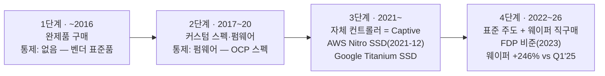
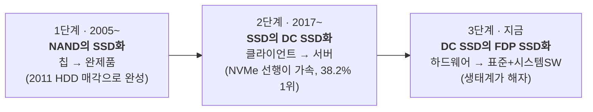

# 삼성 SSD 전략적 방향성 — 사이클을 감쇠해 온 세 번의 선택, 그리고 네 번째

> **문서 성격**: 집필 브리프([prompt-fdp-ssd.md](../../sources/prompt/prompt-fdp-ssd.md), 2026-08-17 구술·목차 승인)를 바탕으로 한 전략 보고서. 모든 수치는 `sources/` 인용을 달았고, 검증 유보 항목은 부록 A 팩트체크 대장에 모았다. 슬라이드 변환은 다음 단계 — 말미 PPT 압축 맵 참조.

---

## 0. Executive Summary

첫째, **SSD는 처음부터 메모리 사이클을 감쇠하기 위한 전략 사업이었다.** 자기잠식을 무릅쓴 진출(2005), 표준 주도자 인텔보다 빨랐던 NVMe 제품화(2013), 전담 조직을 건 데이터센터 집중(2017~) — 세 번의 선제적 방향 전환이 같은 목적을 향했고, 그 결과가 20년째 이어지는 독보적 지위다(1Q26 enterprise SSD 점유율 38.2% 1위).

둘째, **AI 호황이 바로 그 완충 구조를 흔들고 있다.** 이익 극대화를 위해 믹스는 서버로 쏠리고(마이크론은 소비자 시장에서 아예 퇴장), 최대 고객인 하이퍼스케일러는 NAND를 단품·웨이퍼로 직접 사서 자체 SSD(Captive)를 만드는 경쟁자가 되고 있다. 다운턴이 도착하는 순간 이 두 균열은 동시에 완충 능력을 잠식한다.

셋째, **네 번째 방향 전환은 커스텀의 표준화다.** 고객마다 풀커스텀을 받아주는 길은 지속 불가능하고, 고객이 진짜 원하는 것 — 자기 워크로드에 대한 최적화 — 을 표준(FDP)으로 흡수한 뒤 시스템 소프트웨어 생태계로 완성해야 한다. 고객이 물량을 아쉬워하는 공급자 우위 국면인 지금이, 워크로드 정보와 생태계 지위를 얻어낼 유일한 계절이다.

---

## 1장. 사이클을 감쇠해 온 세 번의 선택 (2005~현재)

> **거버닝 메시지**: 삼성 SSD 20년은 우연이 아니라 같은 패턴의 세 번 반복이었다 — 자기잠식을 무릅쓴 선제 결단, 표준 주도자보다 빠른 실행, 솔루션 부가가치로 사이클을 감쇠.

### 1.1 진출(2005) — 자기잠식을 무릅쓴 결단

2005년의 삼성에게 SSD는 당연한 선택이 아니었다. 당시 삼성은 HDD 사업자였다. NAND로 저장장치를 만든다는 것은 곧 자사 HDD를 침식하는 제품을 자기 손으로 만든다는 뜻이었고, 조직 안에서 자기잠식(cannibalization)의 반대 논리가 성립하기 딱 좋은 구도였다. 그럼에도 진출을 결정한 이유가 이 사업의 성격을 규정한다. 메모리는 수요를 기다리는 사업이 아니라 만들어야 하는 사업이라는 것 — 2005년 Apple iPod nano향 NAND 대량 공급에서 "수요를 만들려면 완제품까지 내려가야 한다"를 학습했고, 2006년 3월 세계 최초 SSD(32GB PATA)를 양산하며 HDD 대체라는 초장기 수요를 스스로 개척했다 ([samsung-storage-solution-history.md](../../wiki/concepts/samsung-storage-solution-history.md) §2, [samsung-storage-solution-research-2026-08-17.md](../../sources/raw-notes/samsung-storage-solution-research-2026-08-17.md)). NAND 증설이라는 공급 베팅이 성립하려면 그 공급을 흡수할 수요처가 필요했고, SSD가 그 수요처였다. **사이클 감쇠는 이 사업의 부수 효과가 아니라 설립 목적이었다.**

결단은 매각으로 완성됐다. SSD가 안정화되자 삼성은 2011년 4월 HDD 사업을 Seagate에 $1.375B에 매각했다 — 현금 50% + Seagate 지분 9.6% + NAND 크로스-서플라이 계약을 동반한 구조로, 2차 치킨게임의 한복판에서 비핵심을 팔고 핵심에 집중한 자산 재배치였다 ([samsung-ssd-ufs-market-transition-strategy-2026-08-16.md](../../sources/articles/samsung-ssd-ufs-market-transition-strategy-2026-08-16.md)). 자기잠식의 딜레마에 대한 삼성의 답은 명확했다. **잠식당할 사업을 지키는 것이 아니라, 잠식할 사업을 선점하고 잠식당할 사업은 제값에 파는 것.** 빠른 진출의 보상은 지위로 돌아왔다 — 2013년 연간 전체 SSD 점유율 28.5% 1위(Gartner 집계, [samsung-ssd-ufs-history-competition-2026-08-15.md](../../sources/articles/samsung-ssd-ufs-history-competition-2026-08-15.md)).

감쇠 효과는 실측된다. 2019년 다운턴에서 삼성 반도체 부문 영업이익이 69% 급감하는 동안([samsung-2019-downturn-2017-2019-actions-2026-08-16.md](../../sources/articles/samsung-2019-downturn-2017-2019-actions-2026-08-16.md)), 스토리지 솔루션(SSD·UFS 합산)은 영업이익 -0.9조 원ᵉ의 소폭 적자에 그쳤다 — 솔루션 믹스가 진폭의 완충재로 작동한 것이다 ([samsung-storage-solution-history.md](../../wiki/concepts/samsung-storage-solution-history.md) §1·§4, 전량 추정ᵉ).

### 1.2 NVMe 선행(2013) — 표준은 인텔, 제품은 삼성

두 번째 방향 전환은 인터페이스 세대 교체와 함께 왔다. SATA의 병목을 벗어나는 NVMe 표준은 인텔이 주도해 만들었다. 통상의 각본이라면 표준 주도자가 첫 제품도 가져간다. 그런데 업계 최초의 NVMe SSD는 삼성에서 나왔다. 2013년 7월 공개된 XS1715는 최초의 NVMe PCIe 엔터프라이즈 SSD였고(2013-05-31 UNH-IOL NVMe 인증 목록 최초 등재), 순차 읽기 3,000MB/s·랜덤 740K IOPS에 업계 최초로 SFF-8639(현 U.2) 커넥터를 얹었다. 표준 주도자 인텔의 첫 NVMe 제품군(DC P3700/P3600/P3500)은 2014년 2분기 — **약 1년 후발**이었다 ([samsung-ssd-ufs-market-transition-strategy-2026-08-16.md](../../sources/articles/samsung-ssd-ufs-market-transition-strategy-2026-08-16.md) B-2·B-4).

이 1년이 눈여겨볼 대목인 이유는, 빠른 의사결정과 빠른 실행력이 **동시에** 증명된 순간이기 때문이다. 표준이 완성되기 전에 제품화를 결단하는 것은 의사결정의 속도이고, 결단을 1년의 리드로 바꾸는 것은 실행의 속도다. 실행 속도의 기반은 수직계열화였다 — 컨트롤러·NAND·DRAM·펌웨어를 일괄 내재화한 구조가 세대 전환마다 속도 우위로 나타났고, 같은 2013년 세계 최초 3D V-NAND 양산까지 겹치며 2013년은 삼성 SSD의 해가 됐다 (같은 소스 B-4, [samsung-storage-solution-history.md](../../wiki/concepts/samsung-storage-solution-history.md) 연표). 선행은 연쇄됐다. 950 PRO(2015)로 최초의 소비자 리테일 M.2 NVMe 시장을 열었고, 서버에서는 3Q17 실적발표에서 "datacenter NVMe 적극 대응"을 공식화한 뒤 3Q18 매출 기준 점유율 38.5%로 정점을 찍었다(전환 초기 출하량 기준으로는 인텔과 선두를 다퉜다 — 1Q17 출하 1위는 인텔) ([samsung-ssd-ufs-market-transition-strategy-2026-08-16.md](../../sources/articles/samsung-ssd-ufs-market-transition-strategy-2026-08-16.md)).

결말의 대비가 교훈을 완성한다. 표준을 주도했던 인텔은 이후 Optane을 청산하고 NAND 사업을 매각하며 스토리지에서 퇴장했다 (같은 소스). **표준을 만든 자가 아니라, 표준 위에서 가장 빨리 달린 자가 이겼다.** 이 명제는 3장에서 다시 등장한다 — 이번에는 삼성이 표준(FDP)의 공동 주도자 위치에 있고, 누군가 그 표준 위에서 가장 빨리 달리려 하기 때문이다.

### 1.3 데이터센터 집중(2017~) — 요구사항의 분화에 조직으로 답하다

세 번째 방향 전환은 데이터센터의 부상이었다. 데이터센터용 SSD는 일반(클라이언트) SSD의 연장선으로 대응할 수 없었다 — 지속 쓰기 내구성, 테일 레이턴시(QoS), 멀티테넌트 격리, 텔레메트리, 전력·폼팩터까지 요구사항의 차원 자체가 달랐다. 삼성의 대응은 기술과 조직 두 축이었다. 기술로는 COTS, MPF, ZNS(Zoned Namespace), FDP(Flexible Data Placement) 등 데이터센터 특화 기술을 내재화했고, 조직으로는 데이터센터용 SSD 개발 조직을 별도로 둘 만큼 자원을 집중했다 ([prompt-fdp-ssd.md](../../sources/prompt/prompt-fdp-ssd.md) §3 — 조직 운영은 사내 1차 확인, 기술명 표기는 부록 A F-8 참조).

성과는 두 층위로 확인된다. **점유율의 층위**: 1Q26 enterprise SSD 시장에서 삼성은 38.2%($7.05B)로 1위를 지켰다 — Top5 합산 $18.46B, 전분기 대비 +86.1%의 급팽창 국면에서의 1위라 무게가 다르다 ([enterprise-ssd-market-1q26-2026-08.md](../../sources/articles/enterprise-ssd-market-1q26-2026-08.md)). **채용(design win)의 층위**: AI 인프라의 양 끝단에 모두 들어갔다. AI PC 쪽에서는 PM9E1이 NVIDIA DGX Spark에 실탑재됐고(분해로 확인), GPU 서버 쪽에서는 PM1753이 NVIDIA CMX의 첫 공식 공급 SSD로 확정됐으며 후속 PM1763(PCIe 6.0, 9세대 V-NAND + 4nm 컨트롤러)은 2026-07-08 양산에 들어갔다. CMX는 1유닛에 SSD 576개·9,600TB를 싣는 구조로, CMX향 NAND 수요만 2027년 1억+ TB로 추정된다 ([samsung-ssd-design-wins-nvidia-aipc-2026-08-16.md](../../sources/articles/samsung-ssd-design-wins-nvidia-aipc-2026-08-16.md)).

### 1.4 패턴 — 세 선택의 공통 구조

세 번의 방향 전환을 나란히 놓으면 같은 구조가 반복된다.

| | 진출 (2005) | NVMe 선행 (2013) | DC 집중 (2017~) |
|---|---|---|---|
| **선제 결단** | 자사 HDD 자기잠식 감수 | 표준 완성 전 제품화 착수 | 전담 조직·기술 내재화 투자 |
| **실행 속도** | 2006 세계 최초 SSD 양산 | 인텔 대비 약 1년 선행 | 3Q17 공식화 → 3Q18 38.5% |
| **솔루션 부가가치** | 칩 판매 → 완제품 판매 | 인터페이스 세대 선점 | 요구사항 분화를 제품력으로 |
| **사이클 감쇠 기여** | NAND 수요처 창출 | 프리미엄 믹스 확보 | 2019 완충 실증·AI 결실 |

셋 모두 "아직 아프지 않을 때" 내린 결정이라는 공통점이 있다. HDD가 잘 팔릴 때 SSD에 진출했고, SATA가 주력일 때 NVMe를 제품화했고, 클라이언트가 이익을 내던 시기에 데이터센터 조직을 세웠다. 그리고 셋 모두 목적이 같았다 — 사이클의 진폭을 완제품 부가가치로 감쇠하는 것. **네 번째 선택을 판단하는 잣대도 이 세 요소다: 지금 결단하는가, 남보다 빨리 실행하는가, 부가가치를 어느 계층에서 만드는가.**

---

## 2장. 호황의 역설 — 두 개의 균열

> **거버닝 메시지**: 역대 최대 호황이 다운턴 완충재(소비자 믹스)를 스스로 줄이게 만들고, 최대 고객을 경쟁자(Captive)로 바꾸고 있다.

### 2.1 첫 번째 균열 — 믹스 쏠림

지금 시황은 서버 쏠림을 강하게 지지한다. AI 수요 폭발로 enterprise SSD 계약가가 분기에 +80% 뛰었고 ([captive-ssd-fdp-context-2026-08.md](../../sources/articles/captive-ssd-fdp-context-2026-08.md)), Top5 매출은 한 분기에 +86.1% 늘었다 ([enterprise-ssd-market-1q26-2026-08.md](../../sources/articles/enterprise-ssd-market-1q26-2026-08.md)). 이익 극대화의 관점에서 소비자용 SSD 비중을 줄이고 서버용 비중을 늘리는 현재 전략은 합리적이며, 삼성 V-NAND 캐파의 60% 이상이 NVIDIA CMX향으로 배정됐다는 보도까지 나온다(신뢰도 중간, [samsung-ssd-design-wins-nvidia-aipc-2026-08-16.md](../../sources/articles/samsung-ssd-design-wins-nvidia-aipc-2026-08-16.md) §1.3, 믹스 전환 자체는 [prompt-fdp-ssd.md](../../sources/prompt/prompt-fdp-ssd.md) §4.1 사내 1차 확인). 산업 전체가 같은 방향이다 — 마이크론은 컨슈머 브랜드 Crucial을 아예 접고 데이터센터에 집중하기로 했다 ([enterprise-ssd-market-1q26-2026-08.md](../../sources/articles/enterprise-ssd-market-1q26-2026-08.md), [samsung-ssd-ufs-history-competition-2026-08-15.md](../../sources/articles/samsung-ssd-ufs-history-competition-2026-08-15.md)).

문제는 이 합리성이 **호황을 전제로만 합리적**이라는 데 있다. 이 사업의 설립 목적으로 돌아가 보면, 다운턴마다 진폭을 줄여준 것은 서버·소비자·모바일을 아우른 믹스였다 — 2019년의 완충이 그랬다(1.1). 더 아픈 역사도 있다. 지금 줄이는 소비자·리테일 채널은 바로 2차 치킨게임 다운턴의 한복판(2012년 840 시리즈 소매 진출)에 심어서 2013년 점유율 1위(28.5%)의 발판이 됐던, "다운턴에 심어 호황에 거둔" 채널이다 ([samsung-storage-solution-history.md](../../wiki/concepts/samsung-storage-solution-history.md) 연표, [ssd-ufs-market.md](../../wiki/concepts/ssd-ufs-market.md)). 쏠림 자체가 잘못이 아니다 — **되돌릴 수 없는 방식으로 쏠리는 것**, 즉 채널·고객 관계·제품 라인을 청산해 버려서 다운턴에 돌아갈 곳을 없애는 것이 문제다. 마이크론의 퇴장은 삼성에게 리테일 과점이라는 기회이기도 하지만, 산업 전체로 보면 완충재가 하나 사라진 사건이다.

### 2.2 두 번째 균열 — Captive SSD의 부상

두 번째 균열은 더 구조적이다. 하이퍼스케일러는 글로벌 enterprise SSD 물량의 약 55%를 소비하는 절대 구매자다 ([captive-ssd-fdp-context-2026-08.md](../../sources/articles/captive-ssd-fdp-context-2026-08.md)). 그 절대 구매자가 완제품 대신 NAND 단품·웨이퍼를 직접 사서 자체 SSD를 만드는 방향으로 움직이고 있다 — NAND 웨이퍼 다년 계약가가 한 달에 +60%, 2025년 1분기 대비 +246% 뛰었는데도 직구매가 계속된다는 것은, 컨트롤러와 펌웨어의 부가가치를 자기 손으로 가져가겠다는 의지의 가격표다 (같은 소스).

이 움직임은 갑자기 나타난 것이 아니라 10년에 걸친 통제권 상승의 마지막 단계다 ([fdp-host-ssd-platform.md](../../wiki/strategies/fdp-host-ssd-platform.md) §2):

**동인을 분해해야 대응이 갈린다.** 첫째 동인은 가격이다 — 계약가가 분기에 80% 뛰는 시장에서 완제품 마진을 회피할 유인은 어느 때보다 크다. 둘째 동인은 워크로드 최적화다 — AI 데이터센터 워크로드가 빠르게 변하면서(추론의 KV Cache를 SSD로 내리는 계층화가 표준 아키텍처로 자리 잡는 중이고, NVMe 오프로드만으로 H100 한 장의 동시 사용자를 10배로 늘린 실증까지 나왔다, [kv-cache-ssd-offload-ecosystem-2026-08.md](../../sources/articles/kv-cache-ssd-offload-ecosystem-2026-08.md)), 자기 워크로드에 맞춘 SSD로 WAF(Write Amplification Factor)를 줄이고 성능·수명을 높이려는 수요가 커졌다. 특히 수명 연장은 스토리지 가격이 급등한 지금 곧바로 투자비 절감이다 — 구글의 소프트웨어 아키텍트가 OCP에서 말한 그대로다: "쓰기는 SSD 동작 중 가장 전력 집약적인 부분이다. 필요량의 2.5배를 쓰면 전력 한계에 훨씬 빨리 도달한다." FDP의 정량 효과(오버프로비저닝 28% 제거 등)가 그 절감의 크기를 보여준다 ([google-captive-titanium-fdp-factcheck-2026-08.md](../../sources/articles/google-captive-titanium-fdp-factcheck-2026-08.md)).

실행 주체는 갈린다. 벤더에게 "우리에게 맞는 SSD를 만들어 달라"고 요구할 수 있는 기업은 구글·메타·마이크로소프트 정도의 소수이고, 아마존은 그래서 오래전부터 NAND를 사서 자체 SSD(Nitro SSD, 2021-12 공개 — "crown jewels는 만들고 staples는 산다")를 만들어 써 왔다 ([captive-ssd-fdp-context-2026-08.md](../../sources/articles/captive-ssd-fdp-context-2026-08.md)). 경계 사례가 구글이다 — FDP 표준의 공동 설계자이면서 **동시에** 자체 설계 Titanium SSD(랜덤 읽기 240만 IOPS, 접근 지연 -35%)를 신규 인스턴스에 싣는 이중 트랙이다 ([google-captive-titanium-fdp-factcheck-2026-08.md](../../sources/articles/google-captive-titanium-fdp-factcheck-2026-08.md)). 표준을 설계하는 손과 캡티브를 만드는 손이 같은 몸에 달려 있다.

규모는 얼마나 되나. 가트너는 "2026년까지 온프레미스 스토리지의 30% 이상이 captive NVMe SSD에 의존하게 된다 — 2023년의 5% 미만에서"라고 전망했다. 인용에 범위 주의가 필요하다 — 이 수치의 측정 대상은 온프레미스 스토리지(어레이 벤더 자체 설계 드라이브 문맥)이지 하이퍼스케일러의 자체 개발 SSD 비중이 아니며, 하이퍼스케일러 캡티브 비중의 공식 통계는 아직 없다 ([gartner-captive-nvme-ssd-forecast-2026-08.md](../../sources/articles/gartner-captive-nvme-ssd-forecast-2026-08.md)). 그러나 방향은 정확히 같은 곳을 가리킨다 — **기성품에서 자체 설계 드라이브로**. 그리고 정황 지표(웨이퍼 직구매 +246%, Nitro, Titanium)는 하이퍼스케일러 쪽에서도 같은 이동이 진행 중임을 보여준다. 크기 감각을 위해 단순 환산하면, 1Q26 Top5 분기 매출 $18.46B(연율 ~$74Bᵉ)의 시장에서 30%가 캡티브로 넘어간다는 것은 연 $20B+ 규모의 완제품 매출이 벤더 시장에서 사라진다는 뜻이다 — 서버 SSD 1위(점유 38.2%)인 삼성이 가장 큰 노출을 갖는다.

### 2.3 이중 리스크 — 다운턴이 도착했을 때

두 균열은 평시에는 각각 관리 가능해 보인다. 문제는 다운턴이 도착하는 순간 둘이 **동시에, 서로를 증폭하며** 작동한다는 점이다.

첫째, 줄여둔 소비자 믹스는 완충재의 부재로 돌아온다. 서버 수요가 꺾이는 국면에서 되돌아갈 채널이 없다면, 이번 다운턴의 진폭은 2019년보다 2023년(스토리지 영업적자 -9.1조ᵉ, [samsung-storage-solution-history.md](../../wiki/concepts/samsung-storage-solution-history.md) §1)에 가까워진다. 둘째, Captive에 내준 물량은 회복기에 돌아오지 않는다. 통제권 상승은 지난 10년간 한 방향으로만 움직였다 — 펌웨어를 가진 고객이 컨트롤러로, 컨트롤러를 가진 고객이 표준과 웨이퍼로 내려갔고, 되돌아간 사례가 없다 ([fdp-host-ssd-platform.md](../../wiki/strategies/fdp-host-ssd-platform.md) §2 독해). 다운턴으로 SSD 가격이 내려가면 캡티브의 가격 유인은 줄지만, **호황기에 구축된 자체 개발 역량은 사라지지 않는다** — 즉 지금 내주는 자리는 사이클과 무관한 구조적 상실이다.

정리하면, 현재의 이익 극대화 전략은 틀린 것이 아니라 불완전하다. 위로 최대한 버는 것과 별개로, 다운턴 도착을 전제로 한 보완 장치가 필요하다(다운턴의 도착 자체를 전제로 대비를 설계하는 관점은 [wiki/downturn](../../wiki/downturn/README.md)의 SP-2 트랙과 같다). 그 보완 장치가 3장의 네 번째 방향성이다.

---

## 3장. 네 번째 방향성 — 커스텀 니즈의 표준화 (FDP)

> **거버닝 메시지**: 모든 커스텀을 받아주는 길은 지속 불가능하다 — 커스텀 니즈를 표준(FDP)으로 흡수하고 시스템 소프트웨어 생태계로 완성하는 것이 세 번의 성공 패턴의 네 번째 적용이다.

### 3.1 두 갈래 길 — 그리고 왜 풀커스텀이 아닌가

Captive 앞에서 가장 직관적인 대응은 고객 커스텀 SSD를 모두 개발해 주는 것이다. 고객 만족은 극대화된다 — 고객이 원하는 것을 원하는 대로 만들어 주니까. 그러나 비용 구조가 발산한다. 개발 리소스는 시작일 뿐이고, 고객 수만큼 갈라지는 제품·펌웨어 브랜치마다 평가(qualification) 리소스가 곱으로 붙으며, 출하 후에는 불량 대응과 유지보수의 꼬리가 제품 수명만큼 이어진다. 무엇보다 이 장사의 계약 체질이 아직 없다는 사내 1차 증언이 있다 — "커스텀 제품은 소싱·컨트랙이 파운드리 모델과 비슷한데 그걸 우리가 안 해본 것, 보상 계약 없이 코스트를 다 먹었다"(최장석 상무, 메모리 상품기획, [choi-jangseok-product-planning-interview-2026-07-29.md](../../sources/raw-notes/choi-jangseok-product-planning-interview-2026-07-29.md)). 풀커스텀은 고객당 이익이 아니라 고객당 부채를 쌓는 구조가 되기 쉽다.

두 번째 길은 고객의 니즈를 파악해 **효율적으로** 해결하는 것이다. 고객이 특화 SSD를 만들려는 진짜 이유는 자기 워크로드에 대한 최적화이지, SSD를 만드는 일 자체가 아니다. 그렇다면 그 최적화 니즈를 고객별 커스텀이 아니라 표준으로 흡수할 수 있다 — 하나의 공통 펌웨어·공통 제품 위에서, 고객마다 다른 것은 설정과 소프트웨어로 대응하는 구조다. (참고로 위키의 선행 검토는 선택지를 넷 — 컴포넌트 후퇴 / 풀커스텀 / FDP 하드웨어만 / FDP+시스템 SW 플랫폼 — 으로 놓고 비교했으며, 결론은 본 보고서와 같다: [fdp-host-ssd-platform.md](../../wiki/strategies/fdp-host-ssd-platform.md) §3.)

### 3.2 왜 FDP인가 — 고객이 설계한 표준의 공동 주도자

FDP(Flexible Data Placement, NVMe TP4146)는 호스트가 데이터의 수명·그룹(RU/RUH)을 지정해 SSD 내부 배치를 통제하게 하는 표준이다. 잘 쓰면 WAF가 내려가고, 오버프로비저닝이 줄고(정량 효과: OP 28% 제거 등), 수명과 테일 레이턴시가 개선된다 ([google-captive-titanium-fdp-factcheck-2026-08.md](../../sources/articles/google-captive-titanium-fdp-factcheck-2026-08.md)). 중요한 것은 이 표준의 출생이다 — FDP는 벤더가 만들어 고객에게 권한 기능이 아니라, **Meta와 Google이 각자 WAF 문제를 풀다 합류하고 삼성이 함께 완성해 6개월 만에 비준(2023)한, 고객이 설계한 표준**이다 ([captive-ssd-fdp-context-2026-08.md](../../sources/articles/captive-ssd-fdp-context-2026-08.md)). 고객이 원하는 통제권을 표준의 형태로 넘겨주는 대신, 삼성은 표준의 공동 주도자 지위와 실공급 이력(구글·메타향 FDP SSD 공급, [prompt-fdp-ssd.md](../../sources/prompt/prompt-fdp-ssd.md) §5 사내 확인)을 확보했다.

냉정하게 볼 반증도 있다. FDP는 멀티벤더로 확산 중이다 — 마이크론은 실워크로드 측정 결과를 공개했고, 키옥시아는 OCP에서 RocksDB 구동을 시연했으며, 머천트 컨트롤러 벤더까지 지원해 중소 메이커도 FDP SSD를 만들 수 있다 ([google-captive-titanium-fdp-factcheck-2026-08.md](../../sources/articles/google-captive-titanium-fdp-factcheck-2026-08.md)). 보급된 표준은 누구의 것도 아니다. **FDP SSD를 판다는 것만으로는 "FDP를 지원하는 여러 공급사 중 하나"일 뿐이다.** 차별화는 표준 그 자체가 아니라 표준 위 계층에서 성립한다 — 고객 워크로드를 이해하고 그것을 FDP 정책(RU/RUH 매핑)으로 변환해 주는 시스템 소프트웨어와 엔지니어링이다. 선택 논리는 한 줄로 요약된다: **고객이 가져간 계층 아래(웨이퍼)가 아니라, 고객이 아직 풀지 못한 계층 위(워크로드↔정책 변환)에서 부가가치를 만든다** ([fdp-host-ssd-platform.md](../../wiki/strategies/fdp-host-ssd-platform.md) §3).

이것이 1장 패턴의 네 번째 적용인 이유가 여기 있다. 2005년에는 칩에서 완제품으로 올라가 부가가치를 지켰고, 2013년에는 인터페이스 전환기에 남보다 먼저 뛰어 지위를 만들었고, 2017년부터는 요구사항 분화에 조직으로 답했다. 지금은 AI 워크로드 분화라는 전환기에, 완제품에서 소프트웨어·생태계 계층으로 **한 번 더 올라가는** 선택이다. 잣대 세 개를 대보면 — 결단은 호황의 한복판인 지금이어야 하고(2.3), 실행은 경쟁 벤더와 캡티브 팀보다 빨라야 하며, 부가가치는 워크로드 계층에서 만든다. 구조가 정확히 같다.

### 3.3 성립 조건 — 시스템 소프트웨어 생태계

단서가 하나 붙는다. FDP는 쓰기 어렵다. RU/RUH를 워크로드에 맞게 매핑하려면 애플리케이션과 시스템 소프트웨어(파일시스템, I/O 스택, 캐시 라이브러리, DB 엔진)를 함께 손봐야 하고, 이 연계가 힘들면 고객은 FDP를 켜지 않는다. 구글·메타처럼 자체 시스템 SW 역량이 있는 고객은 소수다 — **모든 고객이 그 기술을 가진 것이 아니기 때문에, FDP를 업계 표준으로 만들려면 시스템 소프트웨어 생태계를 확산시켜야 한다.** Linux 커널·io_uring·SPDK 같은 기반 계층, CacheLib·RocksDB·vLLM/LMCache 같은 응용 계층에 FDP 지원을 심고, 고객이 쉽고 빠르게 적용할 도구(SDK·프로파일러·검증 체계)를 제공하는 일이다 (실행 골격: [fdp-host-ssd-platform.md](../../wiki/strategies/fdp-host-ssd-platform.md) §4 실행전략 1~3).

생태계 조성은 삼성에게 익숙한 게임이 아니다 — 하드웨어 스펙 경쟁이 아니라 개발자 채택 경쟁이고, 이기는 방법이 벤치마크 수치가 아니라 커밋과 문서와 레퍼런스이기 때문이다. 그러나 익숙하지 않다는 것이 하지 않을 이유가 되지 못한다. 소프트웨어 생태계가 하드웨어를 지킨 선례는 업계가 이미 안다 — CUDA가 GPU를 지켰다(같은 논지의 전작: [ssd-fdp-proposal.md](../storyline/ssd-fdp-proposal.md) 「SSD의 CUDA」). KV Cache처럼 수명·재사용 패턴이 명확한 새 워크로드가 FDP와 자연스럽게 맞물리며 열리는 지금이 ([kv-cache-ssd-offload-ecosystem-2026-08.md](../../sources/articles/kv-cache-ssd-offload-ecosystem-2026-08.md)), 생태계 게임의 개막 시점이다.

---

## 4장. 실행 전략과 결론

> **거버닝 메시지**: 공급자 우위인 지금이 워크로드를 얻을 유일한 계절 — 제휴 패키지로 문을 열고, 오픈소스 조직으로 생태계를 만들어, "FDP로 판매되는 SSD 비중"이라는 세 번째 비중 전환을 완성한다.

### 4.1 문을 여는 법 — 전략적 제휴 패키지

전략의 원료는 워크로드 정보다. 그런데 고객은 워크로드 정보를 쉽게 내주지 않는다 — 그것이 그들의 경쟁력이기 때문이다. 여기서 지금 시황이 지렛대가 된다. 공급 부족 국면에서 고객이 가장 아쉬운 것은 물량이고, 물량을 확약할 수 있는 것은 공급자다. 그래서 **장기 물량 계약과 워크로드 최적화 협력을 하나의 패키지로 묶는다** — 물량·가격 확약(이미 가동 중인 take-or-pay Binding 체제, 이창수 부사장 1차 확인: [lee-changsoo-memory-sales-interview-2026-08-03.md](../../sources/raw-notes/lee-changsoo-memory-sales-interview-2026-08-03.md))을 주고, 워크로드 트레이스 공유·공동 검증·공동 로드맵을 받는 구조다. 물량 계약을 공동 플랫폼 계약으로 격상하는 것이다 ([fdp-host-ssd-platform.md](../../wiki/strategies/fdp-host-ssd-platform.md) 실행전략 5).

이 구조는 가설이 아니라 선례가 있다. 마이크론과 앤트로픽은 2026-06-22 전략적 계약을 발표했다 — ① 공동 최적화(HBM·DRAM·데이터센터 SSD를 Claude 학습·추론 워크로드에 공동 설계) ② 다년 공급 ③ Claude 전사 도입 ④ Series H 지분 투자, 네 요소를 한 계약으로 묶었다 ([micron-anthropic-sca-2026-06-22.md](../../sources/articles/micron-anthropic-sca-2026-06-22.md)). 물량과 워크로드 협력의 패키지가 이미 산업의 계약 형태로 등장한 것이다. 삼성에게는 발판도 있다 — 삼성 역시 Anthropic Series H에 마이크론·SK와 나란히 "strategic infrastructure partner"로 참여해, 같은 구조로 확장할 자본 관계가 이미 존재한다 (같은 소스 §3, [customer-co-design-anthropic.md](../../wiki/concepts/customer-co-design-anthropic.md)).

1순위 파트너는 구글이다. FDP를 함께 설계하고 함께 공급해 온, 워크로드 대화가 이미 열려 있는 고객이기 때문이다. 단, 협상 설계에는 구글의 이중 트랙(2.2)을 반영해야 한다 — 구글의 캡티브(Titanium)는 로컬 SSD 라인에서 시작된 1세대이고, 플릿의 대부분은 여전히 표준 드라이브이며 그 표준의 규격이 바로 FDP다 ([google-captive-titanium-fdp-factcheck-2026-08.md](../../sources/articles/google-captive-titanium-fdp-factcheck-2026-08.md)). 목표는 캡티브의 저지가 아니라 **표준 플릿에서 대체 불가능한 파트너가 되는 것**이다. 2순위 이후로는 CacheLib에 FDP 지원을 공식화한 메타 ([captive-ssd-fdp-context-2026-08.md](../../sources/articles/captive-ssd-fdp-context-2026-08.md)), 그리고 마이크론 선례의 대칭으로 AI 네이티브 기업(Anthropic·OpenAI류)이 후보다.

### 4.2 조직 — 잘하던 것과 새로 잘해야 하는 것

실행은 두 트랙이다. **첫째 트랙(잘하던 것)**: FDP SSD의 개발·최적화는 기존 SSD 개발 조직의 강점 연장이다 — 데이터센터 전담 조직의 전통(1.3) 위에서, 워크로드 프로파일 표준화·E2E 공동 검증 같은 실행 골격도 이미 정리돼 있다 ([fdp-host-ssd-platform.md](../../wiki/strategies/fdp-host-ssd-platform.md) §4). **둘째 트랙(새로 잘해야 하는 것)**: 시스템 소프트웨어 생태계는 다른 인력 구조를 요구한다 — Linux 커널·SPDK·CacheLib·vLLM 계열 오픈소스에서 활동하는 컨트리뷰터와 메인테이너, 그리고 고객사 현장에서 적용을 완성하는 엔지니어(FDE — 팔란티어가 실증한 전진 배치 모델, [palantir-fde-model-2026-07.md](../../sources/articles/palantir-fde-model-2026-07.md))다. 이 조직을 강화하는 것이 지금 시점의 전략적 투자처다 — 제품은 준비돼 있는데 생태계 인력이 병목이 되는 순간, 3장의 전략 전체가 "FDP를 지원하는 여러 공급사 중 하나"로 퇴행하기 때문이다.

오픈소스 운영에는 경계 원칙이 필요하다. 기반 라이브러리·연동·적합성 도구는 공개해 표준 채택을 넓히고, NAND·FTL 내부 모델과 정책 추천·예측은 차별화 영역으로 지킨다 — 고객에게는 락인 우려 없이, 삼성 SSD를 선택할 때 더 높은 TCO 효과가 나오는 구조다 ([fdp-host-ssd-platform.md](../../wiki/strategies/fdp-host-ssd-platform.md) 실행전략 6). 성과 지표도 출하량이 아니라 **고객 시스템에서 FDP가 실제 활성화된 용량**, 그리고 **캡티브 계획에서 삼성 완제품으로 전환된 물량**으로 잡아야 한다 (같은 페이지 §5) — 지원만 되고 켜지지 않는 기능은 생태계가 아니기 때문이다.

### 4.3 결론 — 세 번째 비중 전환

이 보고서의 논지를 한 축으로 모으면 이렇게 된다. SSD는 메모리 사이클에 대비하기 위한 사업이고, 그 역사는 "무엇으로 파는가"의 비중을 옮겨온 역사였다.

첫 번째로 SSD로 판매되는 NAND 비중을 늘렸고, 두 번째로 서버(DC) SSD 비중을 늘렸다면, 세 번째는 **FDP로 판매되는 SSD 비중**을 늘릴 차례다(NVMe 선행은 별도의 단계가 아니라 1→2 전환을 가속한 실행력의 증거다). 필요한 역량도 함께 이동한다 — 잘하던 SSD 디바이스 개발 역량 위에 데이터센터와 시스템 소프트웨어에 대한 이해가 얹혀야 하고, 결정적으로 게임의 성격이 바뀐다. **이전에는 혼자 잘하면 됐지만, 지금은 고객사와 함께 잘해야 한다.** 표준은 고객과 함께 설계했고, 워크로드는 고객만 알고 있으며, 생태계는 고객과 함께 만들어야 하기 때문이다.

이것은 부담이 아니라 삼성의 DNA를 한 번 더 업그레이드할 기회다. 자기잠식을 무릅쓰고(2005), 표준 주도자보다 빨리 달리고(2013), 조직을 걸고 집중했던(2017) 회사가, 이번에는 고객과 함께 생태계를 만드는 회사로 진화하는 것이다. 세 번의 선택이 모두 그랬듯, 네 번째 선택의 가치도 다운턴이 도착했을 때 증명될 것이다 — 장기 계약이 물량의 바닥을 지키고, FDP 생태계가 대체 불가능한 자리를 지키고, 그렇게 남들보다 훨씬 부드럽게 연착륙하는 것. 호황의 한복판인 지금이 그 전략을 심을 수 있는 유일한 계절이다 (「호황은 전략을 심는 계절이다」, [common-overview.md](../storyline/common-overview.md)).

---

## 부록 A. 팩트체크 대장 (브리프 F-1~F-9 승계)

| # | 주장 | 판정 | 본문 반영 방식 |
|---|---|---|---|
| F-1 | 가트너 Captive 5%→30% | ⚠️ 수치 실존, 측정 대상은 온프레미스 스토리지의 captive NVMe SSD | 범위 명시 인용 + 정황 지표 병기 (2.2) |
| F-2 | 마이크론–앤트로픽 제휴 선례 | ✅ 2026-06-22 Strategic Agreement 4요소 | 4.1 핵심 선례 |
| F-3 | 마이크론 소비자 시장 퇴장 | ✅ Crucial 철수 | 2.1 |
| F-4 | NVIDIA AI PC·GPU 서버 채용 | ✅ PM9E1 DGX Spark·PM1753 CMX·PM1763 양산 | 1.3 |
| F-5 | 인텔 주도 표준, 삼성 선행 출시 | ✅ XS1715(2013-07) vs DC P3700(2014-Q2) | 1.2 |
| F-6 | 2005 진출·안정화 후 HDD 매각 | ✅ 2006-03 최초 양산·2011-04 $1.375B | 1.1 |
| F-7 | 구글 = 적합한 협력 대상 | ⚠️ 유효하되 Titanium 이중 트랙 반영 | 2.2·4.1 |
| F-8 | 기술명 COTS·MPF | ❓ 공개 자료 미확인(내부 명칭 추정) — 외부 공유 시 표기 확인 필요 | 1.3 원문 유지 |
| F-9 | 아마존 오래전부터 자체 SSD | ✅ AWS Nitro SSD(2021-12, 자체 컨트롤러) | 2.2 |

상세 근거·링크: [prompt-fdp-ssd.md](../../sources/prompt/prompt-fdp-ssd.md) 팩트체크·보강 대장.

## 부록 B. 용어

- **FDP** (Flexible Data Placement): 호스트가 데이터 수명·그룹을 지정해 SSD 내 배치를 통제하는 NVMe 표준(TP4146). 배치 단위가 RU(Reclaim Unit), 그룹 지정이 RUH(Reclaim Unit Handle)
- **WAF** (Write Amplification Factor): 호스트 쓰기 대비 NAND 실제 쓰기의 배율 — 수명·전력·성능을 잠식하는 핵심 지표
- **OP** (Over-Provisioning): WAF 관리를 위해 사용자에게 숨겨두는 예비 용량 — 줄일수록 판매 가능 용량 증가
- **ZNS** (Zoned Namespace): 존 단위 순차 쓰기로 배치를 통제하는 NVMe 표준 — FDP의 선행 세대 격
- **Captive SSD**: 하이퍼스케일러 등이 NAND를 직접 조달해 자체 설계(컨트롤러·펌웨어)로 만드는 SSD (예: AWS Nitro SSD, Google Titanium SSD)
- **SCA** (Strategic Customer Agreement): 물량·가격 약정 위에 공동설계·운영 통합·자본 연계까지 얹은 전략 고객 계약 (예: Micron–Anthropic)
- **Binding / take-or-pay**: 선수금을 동반해 구매 의무를 강제하는 장기 공급 계약 구조
- **FDE** (Forward Deployed Engineer): 고객사 환경에 상주하며 제품 가치를 현장에서 실증·통합하는 엔지니어 (Palantir 모델)
- **KV Cache**: LLM 추론에서 계산 결과(Key/Value)를 재사용하는 캐시 — 장문맥일수록 커져 SSD 계층화 수요를 만드는 신규 워크로드

## 부록 C. 저장소 재사용 자산 맵

| 주제 | 자산 | 활용 위치 |
|---|---|---|
| 20년 사업사 | [samsung-storage-solution-history.md](../../wiki/concepts/samsung-storage-solution-history.md) · [samsung-ssd-ufs-market-transition-strategy-2026-08-16.md](../../sources/articles/samsung-ssd-ufs-market-transition-strategy-2026-08-16.md) · [samsung-ssd-ufs-history-competition-2026-08-15.md](../../sources/articles/samsung-ssd-ufs-history-competition-2026-08-15.md) | 1장 |
| 시장 현재값 | [enterprise-ssd-market-1q26-2026-08.md](../../sources/articles/enterprise-ssd-market-1q26-2026-08.md) · [ssd-ufs-market.md](../../wiki/concepts/ssd-ufs-market.md) | 1·2장 |
| Captive·FDP | [fdp-host-ssd-platform.md](../../wiki/strategies/fdp-host-ssd-platform.md) · [captive-ssd-fdp-context-2026-08.md](../../sources/articles/captive-ssd-fdp-context-2026-08.md) · [google-captive-titanium-fdp-factcheck-2026-08.md](../../sources/articles/google-captive-titanium-fdp-factcheck-2026-08.md) · [gartner-captive-nvme-ssd-forecast-2026-08.md](../../sources/articles/gartner-captive-nvme-ssd-forecast-2026-08.md) | 2·3장 |
| NVIDIA 채용 | [samsung-ssd-design-wins-nvidia-aipc-2026-08-16.md](../../sources/articles/samsung-ssd-design-wins-nvidia-aipc-2026-08-16.md) | 1장 |
| KV Cache 워크로드 | [kv-cache-ssd-offload-ecosystem-2026-08.md](../../sources/articles/kv-cache-ssd-offload-ecosystem-2026-08.md) | 2·3장 |
| 제휴 선례·계약 | [micron-anthropic-sca-2026-06-22.md](../../sources/articles/micron-anthropic-sca-2026-06-22.md) · [customer-co-design-anthropic.md](../../wiki/concepts/customer-co-design-anthropic.md) · [lee-changsoo-memory-sales-interview-2026-08-03.md](../../sources/raw-notes/lee-changsoo-memory-sales-interview-2026-08-03.md) | 4장 |
| 사내 증언 | [choi-jangseok-product-planning-interview-2026-07-29.md](../../sources/raw-notes/choi-jangseok-product-planning-interview-2026-07-29.md) | 3장 |
| 인접 산출물 | [ssd-fdp-proposal.md](../storyline/ssd-fdp-proposal.md) 「SSD의 CUDA」 · [common-overview.md](../storyline/common-overview.md) | 3·4장 에코 |

## PPT 압축 맵 (다음 단계)

| 슬라이드 | 4장 구성 (기본) | 3장 구성 (압축 시) | 거버닝 메시지 출처 |
|---|---|---|---|
| S1 | 1장 — 세 번의 선택 (연표+패턴 3요소) | 1장 동일 | 1장 거버닝 |
| S2 | 2장 — 호황의 역설 (믹스 쏠림+통제권 계단) | 2장 동일 | 2장 거버닝 |
| S3 | 3장 — FDP 전략 (두 갈래 비교+표준 위 계층) | 3장+4장 통합 | 3장 거버닝 |
| S4 | 4장 — 실행·결론 (제휴 패키지+3단계 전환) | — | 4장 거버닝 |
