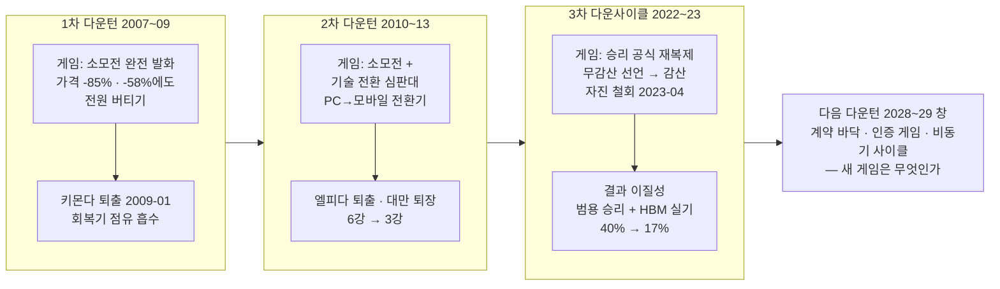
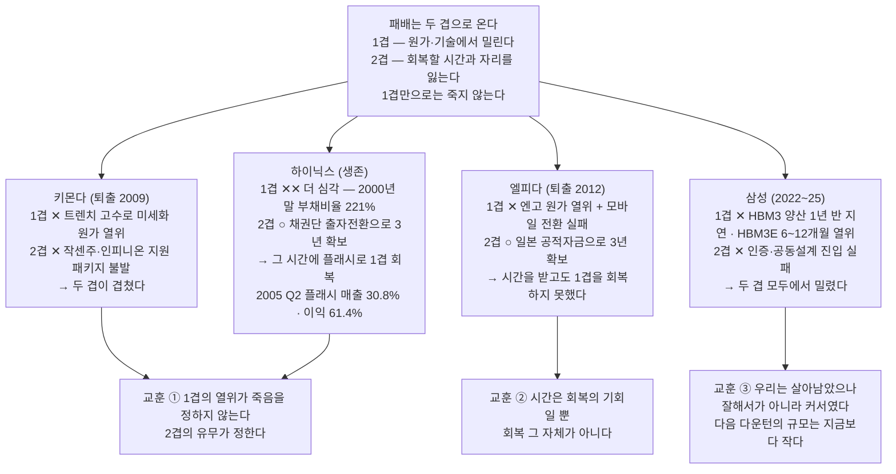
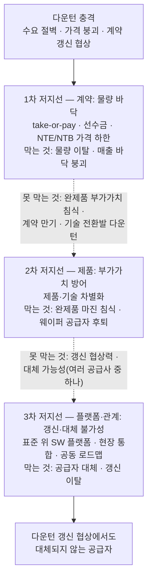

# 호황은 전략을 심는 계절이다

### 다음 다운턴을 준비하는 세 개의 저지선 — 공통 개요편

---

## 1. 이 호황은 우리가 만든 것이 아니다

올해 빅테크 네 곳이 AI 인프라에 붓는 돈은 약 7,000억 달러다. 전년보다 77% 늘었고, 최대 7,250억 달러까지 열려 있다는 전망도 있다[1]. 상향은 지금도 진행형이다. 알파벳은 2분기 실적 발표에서 2026년 투자 가이던스를 1,950억~2,050억 달러로 다시 올렸고, 클라우드 매출은 82% 늘었으며, 수주 잔고는 한 분기에 500억 달러가 쌓여 5,140억 달러가 됐다[1]. 이 자릿수는 수요자 쪽에서도 교차 확인된다 — OpenAI의 컴퓨트 총괄이 업계 투자를 약 7,000억 달러로 셈했다[1]. 그 돈의 끝에서 메모리가 팔린다. 기업용 SSD 계약가는 한 분기에 80% 뛰었고, 주요 공급사의 재고는 사상 최저다 — 생산이 주문 증가를 따라가지 못한다[2]. 마이크론의 분기 매출은 414.6억 달러로 전년 동기 대비 346% 늘었고, 매출총이익률은 84.9%로 사상 최고를 찍었다[3]. 만들면 팔리는 시장이다. 그리고 이 호황의 원장은 우리의 실적 발표 자료가 아니라 고객의 투자 계획서다.

그런데 이 호황의 원인을 분해하면 불편한 사실이 나온다. 수요는 우리가 만들지 않았다. AI 인프라 건설이라는 외생 변수가 가격 불문의 구매 약정으로 물량을 빨아들이고 있을 뿐이다[2]. 3사의 공급 규율도, 우리의 제품력도 부차 요인이다. 가격이 실력을 가려 주는 시장에서는 모든 공급자가 유능해 보인다 — 실력의 시험은 가격이 무너진 다음에 온다. 사업부 최고경영진이 상시 화두로 삼는다는 말이 그 요약이다. "이거는 AI가 우리에게 준 선물이지 여러분들이 실력으로 만든 게 아니에요. 그건 팩트야."[4]

환경이 준 것은 환경이 거둬간다. 그리고 호황이 끝난 뒤를 대비하는 전략은 호황일 때만 심을 수 있다. 고객이 스스로 선수금을 예치하고 다년 계약에 서명하는 국면은 다운턴이 시작되는 순간 끝나기 때문이다[5]. 계약만이 아니다 — 기술이든 관계든 조직이든, 심는 값이 가장 싸고 상대가 문을 열어 주는 계절은 호황뿐이다. 조직은 특히 그렇다. 회사가 잘되고 이익률이 높을 때는 조직을 새로 만들거나 사람을 옮기는 일에 대한 저항이 가장 낮다. 같은 개편안이 적자 국면에서는 구조조정으로 읽힌다. 다운턴이 도착한 뒤에 시작하는 준비는 준비가 아니라 대응이고, 대응은 언제나 조건이 가장 나쁠 때의 협상이 된다. 메모리 영업 리더의 말대로다. "인플렉션 포인트가 오면 뭘 해야 되는데 그때 가서 하면 늦으니까 지금 할 수 있는 걸 지금 하는 거야."[4]

이 보고서는 그 준비의 공통 지도다. 먼저 게임의 룰이 어떻게 바뀌어 왔는지(2장), 과거의 승리 공식 중 무엇이 아직 유효하고 무엇이 부러졌는지(3장)를 확인한다. 그 위에서 이미 세워지고 있는 첫 번째 저지선과 그것이 지키지 못하는 것(4장)을 짚는다. 순서에는 뜻이 있다 — 과거를 다시 읽지 않으면, 미래의 준비가 과거의 반복이 되기 때문이다. 나머지 두 저지선은 제품 경쟁력의 몫이고, 이어지는 일곱 편의 제안이 각자의 자리에서 그 답을 낸다.

## 2. 게임의 룰은 세 번 바뀌었다

우리는 다운턴을 세 번 통과했고, 세 번 모두 다른 게임이었다.

먼저 20년을 관통하는 관측 하나를 놓고 시작한다. **이 산업에서 회사는 한 겹으로 죽지 않는다.** 패배는 늘 두 겹으로 왔다. 1겹은 원가와 기술에서 밀리는 것이고, 2겹은 그것을 회복할 시간과 자리를 잃는 것이다. 1겹만으로는 죽지 않는다 — 밀린 채로도 시간이 있으면 되돌아온다. 두 겹이 겹칠 때에만 되돌릴 수 없게 된다[12]. 세 번의 다운턴에서 죽은 회사와 산 회사를 가른 것이 정확히 이것이었다.

첫 번째(2007~09)는 체력의 게임이었다. 당시 시장은 삼성 약 30%, 하이닉스 약 19%, 엘피다 약 15%를 비롯한 여섯 개 이상의 경기자가 비슷한 무기 — 캐파와 원가 — 로 맞서는 대칭 구도였다[6]. DRAM 가격이 2007년 한 해 85%, 이듬해 다시 58% 무너지는 동안 전원이 버티기를 택했고, 결국 누적 손실 30억 달러를 넘긴 키몬다가 2009년 1월 파산했다. 독일 정부의 5억 달러 지원도 소용없었다. 퇴출 발표 직후 현물가가 급등했다 — 경기자 하나가 빠지면 가격 균형이 즉시 바뀌는 과점 구조가 실증된 순간이다[6]. 삼성은 퇴출을 확인한 직후 메모리 투자를 5.5조 원에서 9조 원으로 올려 회복기 점유율을 흡수했다[6]. 소모전을 버티고 바닥에서 산다 — 첫 승리 공식이다.

같은 시기에 더 심하게 밀리고도 살아남은 회사가 있다. 하이닉스다. 1겹으로 보면 키몬다보다 나을 것이 없었다 — 2000년 말 부채비율이 221%였다. 다른 것은 2겹이었다. 2002년 4월 마이크론 매각안(약 40억 달러)이 이사회에서 부결된 뒤 채권단이 출자전환으로 주주가 되면서 3년의 시간이 생겼고, 그 시간에 플래시로 1겹을 회복했다. 2005년 2분기 플래시는 매출 비중 30.8%에 이익 비중 61.4%였다[12]. 키몬다에게는 그 3년을 대 줄 주체가 없었다. **1겹의 열위가 죽음을 정한 것이 아니라, 2겹의 유무가 정했다.**

두 번째(2010~13)는 앞의 교훈을 뒤집는 게임이었다. 태국 홍수와 엔고 위로 PC에서 모바일로의 수요 전환이 진행됐고, 이 전환에 대응하지 못한 엘피다가 부채 4,480억 엔을 안고 무너졌다 — 전후 일본 제조업 사상 최대 파산이다[6]. 눈여겨볼 것은 엘피다에게 2겹이 없지 않았다는 사실이다. 일본 공적자금이 3년을 대 줬다. 그런데도 죽었다 — 그 시간에 1겹을 회복하지 못했기 때문이다. 블룸버그의 진단 제목이 그것을 한 줄로 적었다. 스마트폰의 돈을 좇는 데 실패한 결과라는 것이다[12]. **시간은 회복의 기회일 뿐 회복 그 자체가 아니다.** 하이닉스와 정확히 반대편의 사례다.

파산한 엘피다는 마이크론이 인수해 모바일 DRAM의 스케일을 얻었다 — 다운턴의 퇴출자는 사라지는 것이 아니라 인수자의 체급이 된다[6]. 여섯이 셋이 됐고, "3사는 6사가 할 수 없는 공급 규율 조율이 가능하다"는 구조적 유산이 남았다[6].

그리고 아무도 죽지 않은 5년이 뒤따랐다(2016~21). 클라우드 확대로 2017년 DRAM 매출이 76% 늘었지만 서버 DRAM도 결국 범용 구간이었기에 기존 원가 공식이 그대로 작동했고, 순위는 고정됐다. 이 기간의 재편은 파산이 아니라 자발적 이탈이었다 — 인텔의 낸드 매각, 도시바 메모리의 분리[12]. 1겹만으로 순위가 유지된 마지막 시기이며, 이 5년의 성공이 다음 시기의 판단 기준을 굳혔다.

세 번째(2022~23)에 삼성은 첫 공식을 다시 꺼냈다. 2022년 10월 "인위적 감산은 고려하지 않는다"고 선언했고, 그해 투자 47.7조 원을 유지했으며, 텍사스 테일러 팹을 다운사이클 한복판에 착공했다[7]. 이듬해 1월 무감산을 재확인했다. 그러나 2023년 4월 7일, "의미 있는 수준까지"의 감산을 스스로 공식화하며 선언을 거둬들였다[7]. 1분기 전사 영업이익이 0.6조 원(-96%)으로 내려앉고 DS부문이 4.58조 원의 사상 최대 부문 적자를 낸 뒤였다[7]. 3강 과점에는 퇴출시킬 상대가 없었다 — 소모전은 패배한 것이 아니라 불발했고, 그 불발을 우리 스스로 철회로 실증했다. 주목할 것은 같은 해의 분리 집행이다. 생산은 줄이면서도 투자 53.1조 원과 R&D 28.34조 원은 사상 최대로 유지했다[7]. 버티기는 접어도 미래 투입은 접지 않았다는 사실은, 뒤에서 볼 "역사이클 투자" 메커니즘이 감산 여부와 별개로 살아 있음을 보여 준다.

그래서 세 번째 다운턴의 결과를 하나의 낱말로 부르면 오독이 된다. 결과는 둘로 갈라졌다. 복제된 공식이 겨냥한 낡은 게임 — 범용 캐파 경쟁 — 에서는 이겼다. 2025~26년의 사상 최대 실적이 그 배당이고, 업계 전체가 같은 배당을 받았다 — SK하이닉스의 2026년 2분기 영업이익 컨센서스는 64.1조 원, 영업이익률 75~77%에 이른다[1]. 그러나 같은 기간 진행되던 새 게임 — HBM 인증 경쟁 — 은 놓쳤다. HBM 점유율은 2023년 40%에서 2025년 상반기 17%로 추락했고, 33년 만에 DRAM 1위를 내줬다[5].

여기서 한 가지를 정직하게 적어야 한다. 이것은 기술은 좋았는데 판단이 틀렸다는 이야기가 아니다. **2022년 시점에 우리는 이미 기술에서 밀려 있었다.** SK는 2022년 6월 HBM3 양산에 들어갔고 우리는 2023년 말이었으며, HBM3E도 6~12개월 뒤졌다[12]. 인증에 들어가지 못한 것은 관계의 문제이기 이전에 물건의 문제였다. 두 겹의 언어로 옮기면 이렇다 — 1겹에서 먼저 밀렸고, 그 뒤에 그것을 회복할 시간과 자리(2겹)를 확보하지 못했다. 20년 만에 처음으로 우리가 두 겹 모두에서 밀린 국면이었고, 그런데도 살아남은 것은 잘해서가 아니라 커서였다[12].

공식은 작동했다. 게임이 바뀌어 있었다.

*도식 1. 세 번의 다운턴은 같은 게임의 반복이 아니었다 — 룰은 캐파·체력(1차)에서 기술 전환(2차)으로 이동했고, 3차는 낡은 게임의 승리와 새 게임의 실기가 동시에 일어났으며, 다음 다운턴(2028~29 창, 예측)은 또 다른 룰로 온다.*

*도식 2. 20년간 죽은 회사는 예외 없이 두 겹이 겹친 회사였고, 한 겹만 밀린 회사는 시간을 받아 되돌아왔다 — 2022~25년의 우리는 두 겹 모두에서 밀린 첫 사례이며 살아남은 이유는 규모였다.*

그리고 지금, 네 번째 게임의 룰이 이미 쓰이고 있다. 거래가 수주로 바뀐다 — 현물 중심이던 시장이 3~5년 고정가 장기계약으로 이동했고, 역사적으로 5%를 밑돌던 선급금은 계약가의 10~30%가 관행이 됐으며, 2027년까지 DDR 비트 출하의 20~30%가 고정가로 잠긴다는 전망까지 나온다[8]. 한 글로벌 투자은행은 장기계약이 이 산업의 사이클 변동성을 근본적으로 제거하고 있다고까지 평가했다[8]. 배분을 정하는 것은 캐파가 아니라 인증과 공동설계다 — 마이크론과 앤스로픽의 계약처럼 공동 최적화·다년 공급·전사 도입·자본 연계가 한 몸으로 묶인다[9]. 웨이퍼를 팔 자격은 캐파가 주지만, 고부가 제품을 팔 자격은 고객의 인증이 준다. 제품별로 사이클이 따로 돈다 — HBM과 범용 DRAM과 낸드가 함께 오르내리던 단일 사이클의 시대가 끝나 간다. 그리고 소수 고객이 수요를 지배한다 — OpenAI의 스타게이트 의향서 하나가 DRAM 웨이퍼 월 최대 90만 장, 글로벌 생산량의 약 40%에 이른다[8]. 다음 다운턴은 과거와도, 지금과도 다른 세상에 도착할 것이다. 필요한 것은 세 번째 재복제가 아니라 새 공식이다. 그리고 새 공식의 재료는 과거를 감사한 뒤에야 고를 수 있다.

## 3. 무엇이 통했고, 무엇이 부러졌는가

전략은 목록이 아니라 조건이다 — 같은 전략은 같은 결과를 재생하지 않는다.

그래서 이 장은 과거의 승리 공식을 나열하는 대신 재감사한다. 질문은 세 겹이다. 무엇을 했고, 그것이 어떤 조건에서 왜 통했으며, 그 조건이 지금도 성립하는가. 이 재감사가 특히 우리에게 필요한 까닭은 역설적이게도 우리가 과거 다운턴의 승자이기 때문이다. 승자는 자기 성공 공식을 복제하려는 유인이 가장 강하고, 맥락이 바뀐 것을 모른 채 낡은 공식을 다시 꺼내는 함정에 가장 깊이 노출된다 — 그리고 2장이 보여 주듯, 그 함정은 가설이 아니라 이미 한 번 실현된 관측이다[5]. 지난 세 다운턴에서 삼성이 실제로 한 액션 여섯 건을 이 질문에 통과시키면 아래 표가 나온다[5].

*표 1. 다운턴 액션 재감사 — 판정 ◎(A1~A4)의 공통 분모는 "다운턴을 버티는 시간이 아니라 사용하는 시간으로 썼다"는 것. ✕(A5·A6)는 각각 조건 소멸(3강에선 소모전 불발)과 새 게임 실기(HBM)의 기록이다[5].*

| 다운턴 액션 | 판정 | 그때 통한 이유 | 지금도 성립하는가 |
|---|---|---|---|
| A1 · 위기 국면 사업부 통합 (2008~09) | ◎ 분명 | 불황을 버티는 시간이 아니라 조직 재편의 창으로 사용 — 이듬해 연결 매출 136.3조·영업이익 10.9조 | 성립 — 맥락에 거의 무관 |
| A2 · 경쟁사 퇴출 확인 직후 역사이클 증설 — 메모리 투자 5.5조→9조 (2010) | ◎ 분명 | 퇴출 확인 직후의 저가 국면 투입 + 캐파=점유율 맥락 | 절반 성립 — "바닥에서 산다"는 유효하나 캐파=점유율 등식은 소멸(인증 게임) → 사는 대상을 기술 자산·인재로 교체 |
| A3 · 재무 요새 유지 — 현금 약 630억 달러·저부채 (전 기간 관통) | ◎ 분명 (전제) | 어떤 다운턴이든 버틸 체력 — 모든 액션의 밑돌 | 성립 — 맥락 준불변 |
| A4 · 다운사이클 한복판 팹 착공 — Taylor (2022) | ◎ 분명 | 수년의 건설 리드타임을 불황 기간에 소화 | 성립 — 단 장비 반입은 수요 확인 후 분리 |
| A5 · "인위적 감산 없다" 선언 → 2023-04 감산 공식화로 자진 철회 | ✕ 불발·자진 철회 | 1·2차에선 통했다 — 다수의 이윤 극대화 경기자 상대 퇴출 유도(그 조건에서만 발화) | 불성립 — 3강 절제 균형에선 자해, 국가가 손실을 흡수하는 경기자는 가격으로 퇴출 불가. 불발은 2023년 철회로 이미 실증 |
| A6 · 범용 캐파 우선·HBM 니치 후순위 (2022~23) | ✕ 역효과 (실기) | — (주력의 자원배분 논리가 니치를 합리적으로 배제) | 재발 위험 — 다음 니치는 다운턴 한복판에서 자란다 |

판정이 분명한 네 액션의 공통 분모는 하나다. 다운턴을 버티는 시간이 아니라 사용하는 시간으로 썼다는 것 — 조직을 재편하고, 싸진 자산을 사고, 리드타임을 소화하고, 그 전부를 가능케 하는 체력을 유지했다[5]. 부러진 두 액션은 각각 조건의 소멸과 새 게임의 실기를 기록한다. 소모전이 부러진 자리는 특히 정확하게 볼 필요가 있다. 그것이 작동하려면 네 개의 전제가 동시에 서 있어야 했는데, 2019년 이후 네 개가 모두 무너졌다 — 모든 경기자가 이윤에 반응한다(국가 자본 경기자가 등장했다), 적자가 이어지면 자금줄이 끊긴다(자급률 목표는 회수를 요구하지 않는다), 제품이 비차별 범용재다(HBM과 규격 배분이 생겼다), 퇴출된 캐파는 시장에서 사라진다(인수·재가동으로 소유자만 바뀐다)[12]. 하나가 아니라 넷이 무너졌다는 사실이 중요하다. 조건 하나가 바뀐 것이면 되돌릴 여지가 있지만, 넷이면 그 전략은 되돌아오지 않는다.

무너진 이유도 층이 있다. 표면은 코로나와 공급망 충격이 "반도체는 시장에 맡길 수 없다"는 인식을 심은 것이지만, 중국의 빅펀드는 2014년이고 CXMT·푸젠진화 설립은 2016년이니 코로나는 촉매였지 원인이 아니다. 중간층은 제재의 역설이다 — 수출 통제는 중국의 자급 동기를 키웠을 뿐 아니라 제재 대상 기업을 시장 논리에서 아예 해방시켰다. 근본은 메모리가 부품에서 전략 물자로 격상된 것이다. 2015년 이전의 DRAM은 PC와 스마트폰의 부품이었기에 한 회사가 망해도 국가적 사안이 아니었고, 독일이 키몬다를 포기한 이유가 그것이었다[12].

여기서 조건이 전면에 드러난 자연 실험이 하나 있다. 푸젠진화는 자본과 기술을 확보하고도 2018년 엔티티 리스트 지정으로 장비 접근이 봉쇄돼 사실상 소멸했고, CXMT는 키몬다 특허 약 7,000건의 라이선스라는 합법 경로로 접근권을 유지해 살아남았다[12]. 같은 국가 자본, 다른 접근권. 앞으로 승부가 갈리는 변수가 자본이 아니라 접근권일 수 있다는 신호다. 역사이클 투자는 여전히 유효하되 사야 할 것이 바뀌었다 — 인증이 배분을 정하는 게임에서 인증 없는 캐파는 점유율로 전환되지 않으므로, 바닥에서 사야 할 것은 웨이퍼 캐파가 아니라 기술 자산과 인재다[5]. 같은 전략도 조건이 사라지면 불발하고, 낡은 게임의 합리적 배분이 새 게임의 실기가 된다.

경쟁사는 같은 시기를 다르게 통과했고, 그 차이가 자연 실험이 됐다. SK하이닉스는 2023년 영업적자 7.7조 원 속에서 투자를 10조 원 수준으로 줄였다 — 삼성과 같은 "절감"이다. 다른 것은 방향이었다. 축소 국면에서도 HBM과 엔비디아 공동설계에 자원을 집중했고, 그 결과 DRAM 1위(2025년 1분기 36% 대 34%)와 HBM 점유 57%(삼성 22%), 그리고 2025 회계연도 영업이익 47.2조 원 — 삼성 전사 43.6조 원을 넘는 숫자 — 를 가져갔다[5]. 갈린 것은 지출의 양이 아니라 배분의 방향이었다. 축소 국면이야말로 다음 게임으로 방향을 트는 최적기라는 것 — A6의 정확한 반례다.

다만 이 사례를 "그들은 처음부터 옳았다"로 읽으면 배울 것이 없어진다. SK도 틀렸었다. 2021년 90억 달러를 들여 솔리다임을 인수하며 낸드와 기업용 SSD에 크게 걸었고, 이후 적자가 이어졌다. 결정적 차이는 그다음에 있었다. 원래 M15 옆에 짓던 낸드 확장 라인 M15X는 2022년 하반기 다운턴으로 건설이 지연됐는데, 2024년 4월 이사회가 이 팹을 DRAM 생산기지로 바꾸기로 결정하고 5.3조 원(장기로는 20조 원 이상)을 투입했다. 판단 근거는 두 가지였다 — 같은 비트를 만드는 데 HBM이 범용 대비 최소 두 배 이상의 캐파를 요구한다는 것, 그리고 TSV 캐파를 늘리던 M15와 붙어 있다는 것. 이어서 P&T7 패키징 팹을 19조 원 규모로 신설해 전공정에서 패키징까지를 하나로 이었다[12]. **SK가 이긴 것은 처음부터 옳아서가 아니라, 틀린 베팅을 3년 안에 물리적 자산의 재배분으로 되돌렸기 때문이다.** 마이크론은 2023 회계연도 매출 -49%의 전통적 수축으로 버텼지만, 두 가지가 달랐다. 과거 파산한 엘피다를 인수해 여러 사이트를 하나의 중앙 운영 체계로 통합해 낸 경험, 그리고 회복기에 수요를 먼저 잠그고 팹을 나중에 짓는 순서 역전이다 — 전략 고객 계약 16건, 최소 계약 매출 약 1,000억 달러, 현금 예치금·금융 약정 220억 달러가 그 결과다[3]. 수요 확약이 투자를 정당화하는 구조는 다운턴이 와도 무너지지 않는다. 2026년 초에는 컨슈머 브랜드 크루셜에서 철수하며 전 캐파를 고마진 기업용·AI 시장으로 돌렸다[2]. 낸드 쪽에서도 문법은 같았다 — 체력이 열위였던 키옥시아는 캐파 경쟁 대신 아키텍처 세대 선행으로 생존 공식을 바꿨다[5]. 벤치마킹할 것은 셋이다. 다운턴에도 다음 게임의 방향을 지킬 것, 수요 확약을 투자에 선행시킬 것, 그리고 산 것을 통합해 낼 것.

다음 다운턴의 지형에서 특히 봐야 할 곳이 있다. DRAM은 3강이지만 낸드 진영은 더 잘게 쪼개져 있다. 기업용 SSD 매출 기준(2026년 1분기)으로 삼성 38.2%, SK그룹 25.1%, 마이크론 16.7%, 키옥시아 12.0%, 샌디스크 8.0%의 5강 구도이고[2], 그 바깥에서 YMTC가 제재 속에서도 낸드 점유를 2023년 약 5%에서 2025년 3분기 13%로 늘리며 동세대 적층에 복귀했다[5]. 이 구도가 뜻하는 것은 간단하다. 여섯을 셋으로 눌러 만든 DRAM의 공급 규율이 낸드에는 없다. 다섯 중 하나가 빠져도 남는 넷은 여전히 많고, 국가 목표로 움직이는 경기자에게는 가격에 의한 퇴출 메커니즘 자체가 작동하지 않는다. 감산 공조도 퇴출 유도도 그만큼 어렵다. 2023년에 낸드가 더 깊이, 더 오래 가라앉은 정황이 그 방증이다 — 감산은 낸드 중심으로 연장됐고, DRAM이 회복을 논하던 시점에도 낸드 감산률은 50% 수준으로 유지됐다[7]. 내부 판단도 같은 방향이다. 메모리 영업 리더는 "D램은 HBM이라는 (빗 관점) 비효율 제품이 캐파의 30~40%를 깔고 가니까 (수급이) 당당한데, 낸드는 그런 게 없어"라며 낸드의 조정이 먼저 올 수 있다고 봤다[4]. 다음 다운턴은 낸드에서 더 깊고, 더 규율 없이 올 가능성이 크다.

그리고 점유율을 읽는 법을 하나 바꿔야 한다. 우리는 2025년 3분기에 32.6%까지 내려갔다가 4분기 36.5%로 1위를 되찾았고 2026년 1분기에는 38.5%다[12]. 1겹을 회복하면 되찾아진다는 증거다. 그러나 같은 표의 다른 열을 봐야 한다. 3사 사이를 오가는 **순환 점유율**은 되찾아지지만, 중국으로 넘어간 **유출 점유율**은 돌아오지 않고 파이 자체를 줄인다. 2013~2019년의 DRAM은 사실상 3사가 94%를 나눠 가진 시장이었는데 지금은 CXMT와 대만 업체들을 포함해 실질 6사이고, 낸드는 YMTC의 진입으로 6사 체제로 되돌아갔다[12]. 경기자가 늘어난 것이 문제가 아니라, **규칙이 다른 경기자가 늘어난 것**이 문제다. 4사 이상의 체제에서는 선택지의 성질이 바뀐다 — 가격으로 퇴출을 유도할 수 없고(국가가 손실을 흡수한다), 후퇴는 일시적 양보가 아니라 영구 상실이 되며(상대에게 진입 기반을 준다), 증설은 방어 수단이 아니라 과잉의 가속이 된다. 남는 유효한 선택지는 하나뿐이다. 상대가 올 수 없는 자리로 먼저 옮기는 것.

세 다운턴의 패배를 한 문장으로 묶으면 공통의 실패 문법이 보인다. **패자는 언제나 자기가 밀린 칸을 자기가 강한 칸으로 메우려 한 쪽이었다.** 키몬다는 원가에서 밀리자 캐파로 버텼고, 엘피다는 기술에서 밀리자 자금으로 버텼으며, 우리는 HBM에서 밀리자 범용 규모로 버텼다[12]. 밀린 칸은 그 칸에서 갚아야 한다.

재감사와 벤치마킹, 지형 판독을 합치면 다음 다운턴 전에 풀어야 할 문제는 세 개로 정리된다. 첫째, 계약이 만들어 줄 매출 바닥 아래에 무엇을 둘 것인가 — 만기가 왔을 때 갱신을 지키는 힘의 문제다. 바닥은 계약이 깔지만, 그 바닥 위에 다시 계약을 얹게 만드는 것은 계약이 아니다. 둘째, 다운턴 중에 태어날 새 게임을 어떻게 선점할 것인가 — 지난 다운턴의 HBM이 그랬듯, 다음 다운턴에도 워크로드와 소프트웨어를 둘러싼 새 게임이 그 한복판에서 자랄 것이다. 새 게임의 실기는 실력의 문제가 아니라 배분의 문제였다는 점에서 더 위험하다 — 주력 사업의 합리적 자원배분 논리가 니치를 배제하는 동안, 니치는 다음 판의 본선이 된다. 셋째, 캐파와 원가가 아닌 차별화 축을 어디에 세울 것인가. 상품기획 리더의 경고가 이 문제의 값을 말해 준다. "대부분의 돈은 80% 메인스트림에서 나와요. 20% 상위 차별화 제품에서 프로핏이 더 나오는 거고, 거기를 선점 못하면 다음 턴이 오면 점점 (저가) 장사밖에 안 되는 거거든요."[10]

## 4. 세 개의 저지선

첫 번째 저지선은 이미 올라가고 있다. 수주사업화다.

메모리 영업 리더의 설명은 구체적이다. "지금은 5년짜리에 선수금을 수십억 달러 단위로 받아서 통장에 넣어. 걔네가 구매 의무를 저버리면 그 개수 × 판가만큼 받은 캐시에서 깐다는 것 — 테이크 오어 페이(take-or-pay)야. 사우디 오일 계약처럼. 메모리가 처음으로 그 개념을 바인딩해."[4] 가장 큰 고객 한 곳의 선수금만 백억 달러대, 전부 합치면 수백억 달러 규모다[4]. 가격에는 위아래로 난간을 단다 — 상한(NTE)과 하한(NTB)을 함께 두는데, "컬랩스가 와도 상당한 이익률로 세팅한 NTB 밑으로는 안 되는" 구조다. 의무는 상호적이어서 삼성이 공급을 이행하지 못해도 페널티를 문다. 하한을 보장받는 대신 가격 상승분의 일부를 나누는 참여형 구조까지, 계약은 금융의 언어로 진화하는 중이다[5]. 목표는 캐파의 과반을 훨씬 넘는 수준을 이 개념으로 묶는 것이다[4]. 업계 전체가 같은 방향이다. 마이크론은 SCA 16건에 최소 계약 매출 약 1,000억 달러를 쌓았고[3], 장기계약 선급금 10~30%는 업계 관행이 됐다[8]. 세 다운턴 어디에도 없던 것 — 매출의 바닥을 계약으로 미리 깔아 두는 메커니즘 — 이 지금 처음 만들어지고 있는 것이다. 과거의 공식이 폭락을 체력으로 버티는 것이었다면, 새 공식의 첫 항은 폭락이 매출에 도달하지 못하게 하는 것이다[5].

이것이 왜 1순위인지는 2장의 두 겹으로 설명된다. 하이닉스에게는 채권단이, 엘피다에게는 국가가 2겹을 대 줬다. 우리에게는 그런 주체가 없다. 한국 3사는 접근권은 열려 있으나 자본이 주주 요구에 종속되는 유일한 부류이고, 그래서 **1겹을 회복할 시간을 스스로 사야 한다**[12]. 계약이 그 시간을 사는 수단이다. 다만 값도 함께 적어 둔다 — 하방을 막는 대신 상방도 제한된다. 2026년 SK가 장기계약 때문에 판가 상승분을 온전히 받지 못한 것이 그 실례이고, 수요 위험이 고객 신용 위험으로 성질을 바꾼다는 점에서 익스포저 상한 설계가 함께 가야 한다[12].

> **용어** — SCA(Strategic Customer Agreement): 물량·가격 약정(LTA) 위에 공동설계·운영 통합·자본 연계까지 얹은 전략 고객 계약. 거래는 스팟 → LTA → SCA로 진화 중이다.

그러나 계약이 지키는 것은 물량뿐이다. 세 개의 구멍이 있다. 첫째, 물량을 지켜도 완제품의 부가가치는 지키지 못한다. 고객의 구매 단위가 완제품에서 웨이퍼로 내려가고 있기 때문이다 — 낸드 웨이퍼 계약가는 2025년 11월 한 달에만 60% 넘게 뛰었고 2025년 1분기 대비로는 246% 올랐는데, 이는 완제품의 값을 만들던 계층을 고객이 자기 손으로 내재화하고 있다는 신호다[11]. 계약 물량이 아무리 커도 그 안에서 웨이퍼 공급자로 후퇴하면 마진의 층은 사라진다 — 웨이퍼만 남은 계약은 물량의 껍데기다. 둘째, 계약에는 만기가 있다. "얘네는 계약을 했다지만 필요 없으면 CFO가 오더를 다 캔슬해 — 2023년 하반기에 경험한 거예요. 선수금 떼이는 게 계산기 두들겨보고 더 낫다면 PO 다 캔슬할 애들이야."[4] 다운턴의 갱신 협상에서 힘은 계약서 밖에서 나온다. 셋째, 기술 전환이 방아쇠가 되는 다운턴에는 커버리지 자체가 공동화된다. 계약은 기존 제품 기준이므로 수요가 대체 기술로 이동하면 갱신 시점에 지켜 줄 물량이 비어 있을 수 있다 — 아직은 예측이지만, 계약은 사이클은 막아도 전환은 못 막는다[5].

*도식 3. 1차 저지선(계약)은 물량 바닥만 지킨다 — 앞선 저지선이 못 막은 위협이 다음 저지선의 존재 이유이며, 갱신과 대체 불가성은 3차(플랫폼·관계)에서만 지켜진다.*

계약 위에 앉아 있어서는 안 되는 이유를, 계약을 만든 당사자가 먼저 말하고 있다. "1차 방어가 그렇게 되더라도 2차 방어가 이제부터 필요한 거죠. 여러분들이 그 과제를 하는 게 나는 2차 방어라고 생각해. 미래 리스크의 80%는 뭔가 마련을 해야 된다."[4] 2차 저지선은 제품이다 — 다운턴에도 마진이 완전히 걷히지 않게 하는 부가가치의 차별화. 3차 저지선은 플랫폼과 관계다 — 만기가 와도 우리를 대체하지 못하게 만드는 통합과 공동 로드맵. 세 저지선은 대체재가 아니라 직렬이다. 앞선 저지선이 못 막은 위협이 다음 저지선의 존재 이유다.

2차 방어의 골격도 이미 짚혀 있다. 같은 인터뷰가 꼽은 사업 경쟁력의 세 축 — 제품(램프업 속도와 수율), 투자("투자 셰어 < 빗 셰어 < 프로핏 셰어"의 순서를 지키는 규율), 오퍼레이션 — 이 그것이다[4]. 이 축들을 기술·투자·생산·조직·고객의 관점으로 나눠 구체화하는 것이 이어지는 작업이다.

그 작업에 앞서 순서의 원칙 하나를 공유해 둔다. 방향을 바꾸기로 했다면 무엇부터 손대는가가 실행의 전부이고, 원칙은 **되돌릴 수 있는 것부터 버린다**는 것이다. 미집행 CapEx와 팹 용도 결정은 완전히 가역이므로 시황 신호만으로 가장 먼저 조정하고, 가동률과 제품 믹스와 노드 전환은 부분 가역이므로 재고와 가격 지표를 보고 두 번째로 움직이며, 사업 매각과 라인 폐쇄는 비가역이므로 수요 자체의 소멸이 확인될 때에만 마지막으로 건드린다[12]. SK가 정확히 그렇게 했다 — 가역 구간에서는 M15X의 용도를 갈아엎을 만큼 과감했고, 비가역 구간에서는 적자가 이어지던 솔리다임을 팔지 않았다. 그 판단의 근거가 좋은 질문 하나로 남는다. 철수를 논할 때 먼저 물어야 할 것은 **사업이 틀렸는가, 시점이 이른가**다. 솔리다임은 후자였고 — 기업용 SSD 수요는 실재했으나 2021~23년에는 일렀다 — 그래서 유지하되 증분을 끊었으며, 2024년 2분기에 흑자로 돌아섰다[12]. 우리의 2022~23년은 반대였다. 가장 쉽게 되돌릴 수 있는 층에서 가장 늦게 움직였다.

덧붙이면, 이 순서에는 실행상의 이점도 있다. 자산 처분부터 논의하면 아무도 동의하지 않지만 증분 배분의 조정부터 시작하면 저항이 훨씬 적다. 그리고 메모리에서 기민성은 예산이 아니라 클린룸 면적의 재배분이다 — 예산은 늘릴 수 있어도 클린룸은 18~24개월의 리드타임을 가진 유한 자원이고, HBM이 같은 비트에 두 배 이상의 캐파를 요구하므로 그 배분은 제로섬이다[12]. 공간은 시간보다 비싸다. 일곱 편의 제안 — 낸드·DRAM·SSD·제조·인사·기획·구매 — 이 각자의 자리에서 2차와 3차 저지선의 구체안을 낸다. 공통 질문은 하나다. 다운턴이 왔을 때, 그리고 그 한복판에서 새 게임이 태어났을 때, 우리는 대체되지 않는 공급자인가.

---

## 참고자료

- [1] 빅테크 CapEx 합산·증가율·알파벳 가이던스·SK하이닉스 실적 컨센서스: wiki/concepts/ai-capex.md · sources/articles/hyperscaler-q2-2026-capex-2026-07-28.md
- [2] 기업용 SSD 계약가·재고·1Q26 시장·점유율·크루셜 철수: sources/articles/enterprise-ssd-market-1q26-2026-08.md
- [3] 마이크론 FQ3 FY26 실적·SCA 16건: sources/filings/micron-q3-fy26.md
- [4] 사내 인터뷰 정리본(메모리 영업 리더, 2026년 8월): sources/raw-notes/ — 익명화 원칙에 따라 파일명 생략. 인용문은 녹취 정리본 원문
- [5] 다운턴 재감사(액션 판정·경쟁사 비교·계약 바닥과 참여형 계약 논리)·HBM 40%→17%(2023→2025 상반기)·SK하이닉스/키옥시아/YMTC 비교·전환발 커버리지 공동화(예측): wiki/storyline/storyline-cmo.md (원출처 승계: wiki/concepts/dram-market-share.md, wiki/entities/sk-hynix.md·micron.md·ymtc.md, wiki/concepts/nand-process-transition.md)
- [6] 1·2차 치킨게임 수치(가격 -85%/-58%·키몬다·엘피다·투자 5.5조→9조): sources/articles/dram-chicken-game-history-2026-08-05.md
- [7] 3차 다운사이클 타임라인·실적·2023 CapEx/R&D·낸드 감산 연장: sources/articles/samsung-downturn-actions-2007-2023-2026-08-07.md
- [8] LTA 선급금 10~30%·DDR 락인 전망·스타게이트 월 90만 장: sources/articles/lta-to-sca-industry-context-2026-06.md
- [9] 마이크론–앤스로픽 SCA 4요소: sources/articles/micron-anthropic-sca-2026-06-22.md
- [10] 사내 인터뷰 정리본(상품기획 리더, 2026년 7월): sources/raw-notes/ — 익명화 원칙에 따라 파일명 생략
- [11] 낸드 웨이퍼 계약가 상승·완제품 부가가치 내재화: sources/articles/captive-ssd-fdp-context-2026-08.md
- [12] 과제팀 스토리라인 R3(2026-08-12) — 두 겹 프레임·하이닉스 출자전환과 플래시 회생·엘피다의 시간·2016~21 자발적 이탈·HBM3 양산 시점 대조·치킨게임 4대 전제 붕괴와 3층 원인·푸젠진화 대 CXMT의 접근권·SK 솔리다임과 M15X 전환·순환 대 유출 점유율(2026 Q1 38.5%)·L1/L2/L3 가역성 층위·"패자는 자기가 밀린 칸을 자기가 강한 칸으로 메웠다": sources/raw-notes/memory-cycle-storyline-r3-2026-08-12.md. 자료 자체의 출처는 TrendForce·Counterpoint·Omdia·SK하이닉스 공시·Bloomberg 등이며 【검증】 표기 항목만 본문에 인용했다. CXMT의 Q3 2025 점유율은 자료(5%)와 위키(8.5%)가 갈리는데 중국 업체가 TrendForce 상위 공급사 표에 포함되지 않아 생기는 기준 차이이므로 본문에서 단일 수치로 쓰지 않았다

*표 1의 2009년 실적(연결 매출 136.3조·영업이익 10.9조)·Taylor 착공·현금 약 630억 달러는 [5]·[7]의 원출처를 따른다.*
