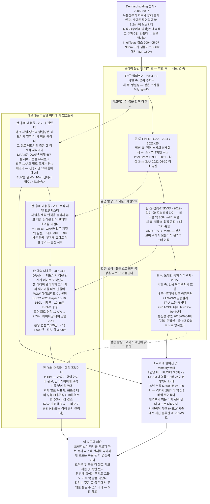
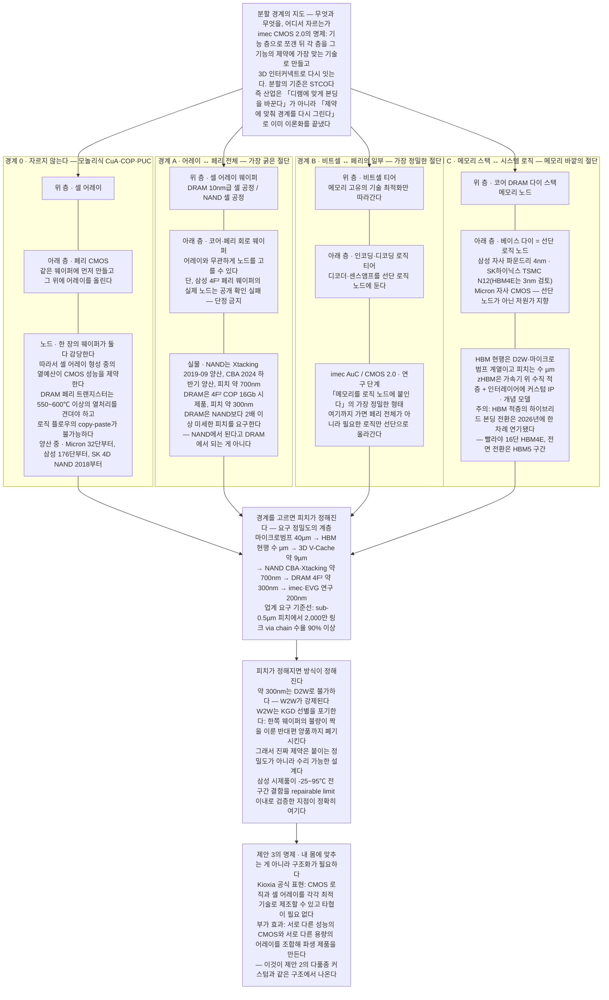
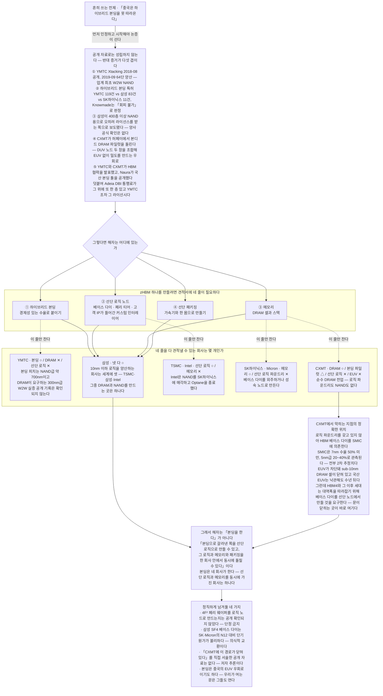
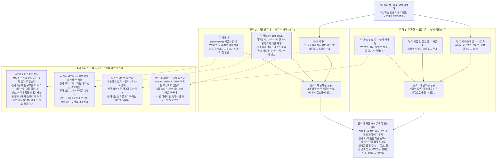

# 판을 옮긴다

### DRAM 제품·아키텍처 경쟁력 — 2차 저지선 전략 2번

---

공통편은 세 개의 저지선을 세웠다. 계약이 물량의 바닥을 깔고, 제품이 부가가치를 지키고, 플랫폼과 관계가 갱신을 지킨다. 이 글은 두 번째 저지선의 두 번째 전략이다. 앞선 제안이 제품을 만드는 몸을 다뤘다면 이 글은 그 몸이 만들 제품을 다룬다. 전략 1이 설비·공정의 축 — 세대 연장성과 제품 간 동일성과 N-1 설계 — 을 맡았고, 이 글은 제품·아키텍처의 축을 맡는다[18].

명제는 한 문장이다. 중국이 따라올 수 있는 축에서, 따라오기 어려운 축으로 판을 옮긴다. 셀을 더 작게 만드는 일과 캐파를 더 크게 짓는 일과 원가를 더 낮추는 일은 자본과 국가 보조로 따라올 수 있다. 다만 오해를 먼저 막는다. 아키텍처를 바꾸는 일 자체는 그들도 한다 — 이미 하고 있다. 따라오기 어려운 것은 바꾼 구조를 선단 로직과 메모리와 패키징을 한 견적서 안에서 감당하는 일이다. 5장이 그 구분을 데이터로 세운다.

경계를 먼저 긋는다. 이것은 원가를 포기하자는 제안이 아니다. 볼륨과 로우엔드의 원가 방어는 전략 1의 N-1 설계가 전적으로 맡는다[18]. 선단 공정의 목표 — 1c nm의 원가 절감과 HBM4E와 EUV — 도 하나도 조정하지 않는다. 이 글이 다루는 것은 그 위층이다.

## 1. 우리는 따라잡히는 축에 서 있다

문제는 전술이 아니라 우리가 서 있는 축이다.

치킨게임은 이미 봉인됐다. 2022년 10월의 무감산 선언은 이듬해 4월 감산 공식화로 스스로 철회됐고, 3강 과점에는 퇴출시킬 상대가 없으며 국가가 손실을 흡수하는 경기자는 가격으로 밀어낼 수 없다[12]. 공통편이 이미 판정한 그대로다. 남는 질문은 하나다. 소모전이 봉인된 판에서 무엇으로 이기는가.

과거의 답은 원가였다. 그런데 그 답의 전제가 이미 흔들린다. 메모리 영업 리더의 진단은 에두르지 않는다. "원가가 경쟁사 대비 비교열위 상태야 — 낸드도 D램도. … 원판이 잘못 그려졌거나 공정에 비효율이 깔렸거나, 수율 램프업이 늦어지는 것들이 상대적 비교열위인 거지."[1] 원가로 이긴다는 공식은 우리가 원가에서 앞설 때에만 성립한다.

위와 아래에서 동시에 밀린다. 삼성의 DRAM 점유는 2024년 41%에서 2025년 3분기 32.6%로 내려앉았다[4]. 위쪽에서는 HBM 점유가 2023년 40%에서 2025년 상반기 17%로 무너졌고, 아래쪽에서는 CXMT가 2024년 4.9%에서 2025년 3분기 8%로 올라왔다[4][5]. 가운데가 비어 있는 것이 아니라, 가운데만 남았다.

아래쪽 추격의 성격을 정확히 봐야 한다. CXMT의 캐파는 2020년 월 3만 장 수준에서 이미 월 30만 장에 도달했고 2026년 말 35만 장을 겨냥한다 — 글로벌 DRAM 캐파의 10~12%다[5][8]. 2026년 7월 상장으로 86억 달러를 조달했고 2030년 점유율 30%를 목표로 내걸었다[8]. 품질도 문턱을 넘고 있다. DDR5와 LPDDR5X가 JEDEC 인증을 받았고, 애플이 중국 내수용 기기의 DRAM에 대해 CXMT 기술 검증에 착수했다[5]. 낸드 쪽에서는 YMTC가 점유를 2023년 5%에서 2025년 3분기 13%로 늘리며 294단 양산으로 동세대에 복귀했고, 3공장 신규 용량의 절반을 2027년까지 DRAM에 배정한다[6].

다른 축이 있다는 증거는 다른 산업에 있다. 일본 키엔스는 10년 내내 영업이익률이 50~56% 밴드를 벗어난 적이 없다. 코로나에도 미중 무역분쟁에도 50% 아래로 내려가지 않았다[20]. 우리 DS부문은 역대 최고 호황이던 2018년에 51.6%였다[12]. 숫자만 보면 비슷한데 성질이 정반대다. 우리는 사이클이 가장 좋을 때 그 수준에 닿고, 키엔스는 사이클과 무관하게 늘 그 수준에 있다. 원가로 이기는 회사는 사이클을 탄다. 제품으로 이기는 회사는 타지 않는다.

키엔스가 그것을 어떻게 하는지는 4장과 6장에서 항목별로 빌려 온다. 여기서는 하나만 먼저 적는다. 그들의 개발 철학은 고객이 원하는 상품을 만들지 않는다는 것이다 — 고객이 아직 모르는 니즈를 제품화해 업계 최초, 세계 최초를 만들고, 그래서 제조원가와 무관한 가격을 매긴다[20]. 원가가 가격을 정하지 않는 구조를 만든 것이다.

이 숫자들이 말하는 것은 하나다. 셀 미세화와 캐파와 원가는 돈과 국가 의지로 살 수 있는 축이다. 돈은 상장으로 조달됐고 의지는 국가가 댄다. 그 축 위에서 우리는 앞서 있을 수는 있어도 따돌릴 수는 없다. 원가 경쟁력이 디램의 미덕이라는 공식이 틀렸다는 뜻이 아니다. 그 공식이 성립하던 조건 — 우리가 원가에서 앞서고, 상대가 이윤을 좇으며, 캐파가 곧 점유율이던 조건 — 이 세 겹으로 무너지고 있다는 뜻이다.

위쪽에도 같은 질문이 서 있다. 사업부 최고경영진의 질문이 그 자리를 정확히 짚는다. "DDC 라인업이 지금 HBM밖에 없는데 HBM 꺼지면 이거 어떡할 거냐. 개발하고 있는 게 16기가 정도밖에 없는데 그럼 뭐 해야 되냐."[2] 전략 1은 이 질문을 설비의 문제로 받았다. 여기서는 원래의 자리, 곧 제품 라인업의 문제로 받는다. 답은 다음 제품이 아니라 다음 축에 있다.

## 2. 로직은 네 번 판을 옮겼다

로직은 같은 벽을 우리보다 스무 해 먼저 만났고, 네 번 판을 옮겨 답했다.

벽의 이름은 Dennard scaling의 종료다. 그 법칙이 2005년 무렵 깨졌다. 누설전류가 치수를 따라 줄지 않았고, 게이트 절연막은 65nm 세대에서 실리콘 원자 다섯 개 두께인 1.2nm에 닿았다[7]. 무어의 법칙이 끝난 것은 아니다. 집적도는 계속 올랐고 주파수만 멈췄다. 2004년 5월 7일 인텔이 테자스를 취소했을 때, 그 칩의 90nm 초기 샘플은 2.8GHz에서 150W를 썼다[7]. 축 하나가 죽은 날이다.

> **용어** — Dennard scaling: 치수를 줄이면 전압·전류도 함께 줄어 전력밀도가 유지된다는 1974년의 법칙. 집적도를 다루는 무어의 법칙과는 별개다.

*도식 1. 로직은 클럭이 막히자 네 번 판을 옮겼고 그때마다 "소자 하나를 좋게"가 아니라 "시스템 전체를 영리하게"라는 축을 새로 열었는데, 메모리는 같은 20년 동안 셀 미세화라는 한 축에만 서 있었고 4F² COP가 그 두 번째 축에 처음 발을 디딘 지점이다.*

그 뒤가 네 번이다. 클럭이 막히자 같은 소자를 여럿 놓았고, 평면 미세화가 막히자 소자를 세웠으며, 모놀리식 다이가 레티클 한계와 수율에 막히자 블록마다 최적 공정을 따로 쓰고 패키지에서 붙였고, 범용 아키텍처의 효율이 막히자 문제에 맞춘 구조로 갔다. 연도와 수치는 도식 1에 적었다[7].

> **용어** — 칩렛: 한 다이로 만들던 기능을 여러 다이로 나눠 각각 다른 공정에서 만든 뒤 패키지에서 다시 잇는 방식.

레슨은 축이 두 개라는 것이다. 트랜지스터 하나를 빠르게 만드는 축과, 시스템 전체를 영리하게 만드는 축은 둘 다 경쟁력이다. 로직은 첫 축이 막힌 뒤에도 두 번째 축으로 20년을 더 벌었다. 헤네시와 패터슨이 2018년 튜링상 강연에서 새 황금기의 네 축 가운데 하나로 개발 민첩성을 꼽은 것도 같은 이야기다[7]. 속도 자체가 아키텍처의 일부라는 선언이다.

메모리는 아직 첫 축에만 서 있다. DRAM은 2007년 이래 6F² 셀 레이아웃을 유지했고, 최근 10년의 밀도 증가는 단 두 배에 그쳤다 — 전성기에는 18개월마다 두 배였다[7]. EUV를 넣고도 10nm급에서 밀도가 정체했다. 그사이 벌어진 격차가 memory wall이다. 2년마다 피크 연산은 3.0배, DRAM 대역폭은 1.6배 늘어 20년 누적으로 6만 배 대 100배가 됐다[7].

이제 그 벽은 대역폭이 아니라 전력과 열로 나타난다. 상품기획 리더의 현장 증언이 그것이다. "예전 기준으로 노멀하게 6kW~8kW면 됐어요. 근데 지금 새로 나오는 NVIDIA 솔루션은 210kW로 늘어났어요. … 리퀴드 쿨링으로 바꿨는데도 되는지 안 되는지 모를 정도."[2] 20년 치 격차의 청구서가 랙 전력으로 도착해 있다.

그런데 이동은 이미 시작됐다. 우리가 ISSCC 2026에서 발표한 4F² COP DRAM이 그 증거다[7]. 셀 어레이 웨이퍼와 코어·페리 웨이퍼를 따로 만들어 웨이퍼 대 웨이퍼 하이브리드 구리 본딩으로 접합했고, 셀 트랜지스터는 채널을 수직으로 세운 VCT로 바꿔 6F²를 4F²로 줄였다. 결과는 코어 회로 면적 17.0%에서 2.7%로, 웨이퍼당 다이 산출 20% 증가다[7][8]. 이것이 메모리판 칩렛이다. 로직이 2019년에 한 일이 DRAM에서 시제품으로 도착한 지점이다.

> **용어** — VCT(수직 채널 트랜지스터): 채널을 세워 면적을 늘리지 않고 채널 길이를 확보하는 셀 트랜지스터 구조. 4F² 셀의 전제다.

이동이 필연인 이유는 물리에 있다. 한 장의 웨이퍼에 페리를 먼저 만들고 그 위에 셀을 올리면, 어레이를 만드는 동안의 열이 아래 CMOS를 제약한다. DRAM 주변 트랜지스터는 550~600℃ 이상의 열처리를 견뎌야 해서 로직 공정 흐름을 그대로 옮겨 쓸 수 없다[9]. 어레이와 페리를 분리하는 순간 이 제약이 사라진다. 로직이 메모리 안으로 들어올 문이 열리는 것이다. 그 반대편 통행도 이미 시작됐다 — HBM4의 베이스다이를 찍는 곳이 우리 파운드리의 4nm 라인이다[9].

그리고 이것은 논문 속의 이야기만이 아니다. 사내에서 이미 진행되거나 검토되는 횡전개 사례가 같은 방향을 가리킨다 — 고성능 DRAM에 파운드리의 핀펫을 적용하는 일, 같은 제품에 HKMG를 적용하고 확산하는 일, 그리고 반대 방향으로 차세대 저전력 낸드에 DRAM의 TSV를 옮겨 오는 일이다[21]. 로직의 소자 기술이 DRAM으로 들어오고 DRAM의 적층 기술이 낸드로 나간다. 판이 옮겨지고 있다는 증거는 밖에서 찾을 필요가 없다.

같은 사실을 전략 1은 설비의 공통 기술 축이 수렴한다는 증거로 읽었다[18]. 여기서는 제품의 아키텍처가 로직화되고 있다는 증거로 읽는다. 각도가 다르면 처방도 다르다.

## 3. 우리가 만드는 것은 세 종류다

우리가 만드는 것은 세 종류인데 개발 체계는 하나다.

세 종류는 시장 구분이 아니라 개발 체계의 구분이다. 커머디티는 유지의 문제이고, 차별화는 선점의 문제이며, 차세대는 개념의 문제다. 지키는 것이 다르고 게이트가 다르고 속도의 원천이 다르다. 하나의 규범으로 셋을 다 관리하려는 순간 셋 다 무너진다.

*표 1. 세 분류는 시장 구분이 아니라 개발 체계의 구분이며, 각 칸이 요구하는 품질 게이트와 속도의 원천이 서로 달라서 하나의 규범으로 셋을 다 관리하려는 순간 셋 다 무너진다.*

| 분류 | 무엇을 지키는가 | 개발 체계 | 품질 게이트 | 속도의 원천 | 지금 위치와 목표 |
|---|---|---|---|---|---|
| **① 커머디티** DDR5 · LPDDR · GDDR | 현 경쟁력의 **유지**. 원가는 목적이 아니라 결과다 — 영업 리더가 지목한 순서의 역전(원가를 먼저 놓고 다이를 늘리고 레이어를 줄인 것)을 되돌린다 | **유지의 방법론을 시스템화한다.** 노드 전환은 세대 간 재사용도가 높은 구간이므로, 개발 방법 자체를 문서화된 규범으로 고정하는 것이 곧 속도다. 리더가 바뀌어도 같은 게이트가 적용되어야 한다 | **완벽하지 않으면 생산하지 않는다.** 현실과 맞지 않는 개발 스피드업으로 양산 캐파를 희석하지 않는다. 반대 증거가 우리 안에 있다 — 1c 수율 보고가 2025-07 65% → 2025-10 50% → 2026-02 약 60%로 진동했다 | 세대 간 재사용 + **규범의 반복 가능성**. 새로운 기술이 아니라 같은 일을 같은 방식으로 다시 하는 능력 | 1c 수율 2026-02 약 60%, 80% 양산 목표 근접. 캐파 2026년 60~70K/월에서 +50% 확장 계획. **목표는 조정하지 않는다** — 1c DDR5 웨이퍼당 원가 2027년 말까지 30% 절감, CXMT 대비 원가 10% 이상 우위 유지. 경쟁 위치: SK하이닉스 2026년 1c 출하 8배 증산·EUV 6레이어, Micron 1γ EUV 양산 |
| **② 차별화** HBM · 커스텀 HBM · zHBM | **시장을 선도하는 자리**와 이익의 원천. 여기를 선점 못 하면 다음 턴에는 점점 저가 장사밖에 남지 않는다 | **이어달리기가 아니라 단거리 달리기.** 표준품 조직과 커스텀 조직을 분리해 운영하고(삼성은 HBM4부터 팀 이원화, 커스텀에 엔지니어 250명 추가 투입 보도), 커스텀은 제품 개발이 아니라 **파운드리 모델**로 운영한다 — 소싱·계약 방식이 다르고 우리가 안 해본 영역이다 | **인증 통과가 게이트의 끝이 아니다 — 볼륨 발주 전환이 게이트다.** HBM4는 2026-06-05 인증을 통과했으나 2026-07-17 현재 볼륨 발주로 전환되지 않았고 NVIDIA향 매출은 유상 평가용 샘플 수준이다. 성능은 이겼는데 발주는 못 받았다 | **메모리 코어 + 자사 파운드리 베이스 다이 + 3D 패키징의 턴키.** 조율 주체가 둘이 아니라 하나라는 구조적 차이. 실리콘부터 최종 패키징까지 전체 스택을 통제하는 유일한 HBM4 공급사(2차 평가) | HBM4 36GB·12단·3.3 TB/s, 핀 속도 최고 13 Gb/s(JEDEC 6.4의 2배 이상), VDDQ 0.75V, 1c 코어 + SF4 베이스. NVIDIA Vera Rubin 배정 25~30%(SK 60~70%). **창이 열려 있다** — HBM4E 개발 완료 목표는 삼성과 SK하이닉스가 나란히 2026년 상반기이고, 커스텀 HBM4E 설계 완료 목표는 3사 모두 2026년 5~6월이며 "특별히 앞서거나 뒤진 회사 없음"이 외부 관측이다. 커스텀 HBM 시장은 2027년 본격화·2029년 380억 달러 전망 |
| **③ 차세대** 4F² COP · 3D DRAM · 수직 적층 DRAM 계열 | **다음 판 그 자체.** 3사가 모두 고전 중인 구간이고, 여기에서까지 중국 추격을 허용하면 남는 미래가 없다 | **conventional 제품과 W2W 본딩 제품의 개념설계를 병행한다.** 어느 경계에서 자를 것인지(표 2)가 설계의 첫 질문이고, 셀 개발의 2D shrink 시간을 벌면서 기존 라인 효율과 개발 TAT를 동시에 개선하는 것이 목적이다 | **층을 나눈다.** 제안·개념설계 단계는 실패를 허용하고(개발실 체질 전환 축2와 병존), **양산 진입 게이트만 무관용**으로 둔다. 두 규범이 같은 조직 안에서 단계별로 병존한다고 명시하면 모순이 아니라 설계가 된다 | **셀 웨이퍼와 페리 웨이퍼의 검토 turn을 독립적으로 돌릴 수 있는 구조 자체.** 어레이와 CMOS를 개별 처리하므로 두 흐름이 서로를 기다리지 않는다(Kioxia가 CBA에서 명시한 메커니즘) | 4F² COP 16Gb 시제품(ISSCC 2026), 코어 회로 면적 17.0% → 2.7%, 웨이퍼당 다이 +20%, 셀 크기 6F² 대비 약 30% 축소. 내부 일정은 개발 완료 2026 → 검증 2027 → 양산 이관 2028(업계 관측은 2029~30). **경쟁**: SK하이닉스 4F² VG + 3D DRAM(VLSI 2025 30년 로드맵), Micron은 **4F²를 건너뛰고 3D 직행**, CXMT는 IEDM 2023에서 18nm 4F² 논문 + 허페이 본디드 DRAM 파일럿 |

세 칸의 내용은 표 1에 적었다. 요지만 옮기면 이렇다. 커머디티에 필요한 것은 새로운 기술이 아니라 같은 일을 같은 방식으로 다시 하는 능력이고, 차별화의 강점은 코어 다이와 베이스다이와 패키징을 한 회사 안에서 동시에 돌릴 수 있다는 구조에서 나오며, 차세대는 conventional 제품과 본딩 적용 제품의 개념설계를 나란히 놓는 일이다. 여기서 원가 목표는 그대로 둔다 — 1c nm의 원가 절감과 CXMT 대비 우위는 이 보고서가 건드리지 않고, 로우엔드의 원가 방어는 전략 1의 N-1 설계가 맡는다[10][18]. 다만 순서는 지킨다. 원가를 개발의 목적함수로 앞세워 다이를 늘리고 레이어를 줄인 순서의 역전을 영업 리더는 이미 과거의 잘못으로 지목했다[1]. 원가는 결과물이다.

그리고 게이트다. 선단 노드에는 하나의 원칙이 필요하다 — 완벽하지 않으면 생산하지 않는다. 현실과 맞지 않는 개발 스피드업으로 양산 캐파를 희석해서는 안 된다. 반대 증거가 우리 안에 있다. 1c 수율은 2025년 7월에 일부 웨이퍼 런이 65%를 냈고, 10월 보고는 50%, 2026년 2월은 약 60%였다[10]. HBM4는 2026년 6월 5일 인증을 통과했으나 7월 17일 현재 볼륨 발주로 전환되지 않았다[11]. 성능은 이겼는데 발주는 못 받았다. 흔들리는 숫자와 전환되지 않는 인증은 같은 곳을 가리킨다. 게이트가 규범이 아니라 사람에 걸려 있으면, 값은 개발이 아니라 양산에서 청구된다.

그래서 속도의 성격을 여기서 못 박는다. 속도는 게이트를 낮춰서 얻는 것이 아니라 구조를 바꿔서 얻는다. 검토를 건너뛰어 빨라진 개발은 양산에서 되돌려 갚고, 그 청구서가 수율의 진폭이다. 4장의 세 제안은 전부 구조 쪽의 답이다. 어레이와 페리를 갈라 두 흐름을 독립시키고, 커스텀 자산을 IP로 얼려 파생 개발을 줄이고, 경계를 먼저 골라 나중의 되돌림을 없앤다. 게이트는 그대로 두고 그 앞에 놓인 일 수를 줄인다. "완벽하지 않으면 생산하지 않는다"와 TAT 단축이 충돌하지 않는 이유가 이것이다.

그 게이트를 누가 소유하고 어떻게 층으로 나눌지는 6장에서 규범으로 다룬다. 다만 이 장에서 미리 확인할 것이 있다. 문제가 개발 조직에만 있지 않다는 사실이다. 상품기획 리더의 진단이 양쪽을 함께 짚는다. "기획은 … 이기는 기획을 해야 되니까 어쩔 수 없이 더 공격적인 스펙과 일정으로 요청할 수밖에 없고, 개발은 제품이 많은데 일정하고 스펙이 자꾸 변해." 같은 사람이 기획 쪽의 자기 규율도 함께 말했다. "그냥 전달할 거면 왜 기획이 있냐, 그냥 딜리버리지."[2]

## 4. 세 개의 제안

세 제안은 같은 뿌리에서 나온다. 어디서 자를 것인가가 셋 다의 첫 질문이다.

### 4.1 웨이퍼 본딩은 필연이다

셀을 더 줄이는 일이 어려워질수록, 셀 말고 다른 데서 세대를 벌어야 한다.

웨이퍼 대 웨이퍼 본딩이 낸드에서 이미 검증됐다는 사실은 전략 1이 계보로 정리했다[18]. 여기서 필요한 것은 계보가 아니라 그다음 질문이다. 그 기술로 DRAM 제품을 어떻게 다시 설계하는가.

먼저 정직해야 한다. 본딩은 웨이퍼를 두 장 쓰므로 단순 원가 비교에서 모놀리식보다 비싸고, 나노 정밀도의 정렬을 요구해 장비 투자가 붙는다[17]. 그러니 논지는 원가를 산다가 아니다. 시간을 산다.

사는 시간은 세 종류다. 첫째는 셀의 시간이다. 4F²는 6F² 대비 셀 크기를 약 30% 줄이고 웨이퍼당 다이를 20% 늘린다[8]. 2D shrink가 한 세대마다 어려워지는 국면에서, 구조가 한 세대를 대신 벌어 준다.

둘째는 라인의 시간이다. 어레이 밖 회로를 다른 웨이퍼로 빼면 그쪽의 설계 규칙을 느슨하게 쓸 수 있고[8], 어레이 형성의 열예산에서 페리가 풀린다. 같은 라인을 더 오래 쓸 수 있는 설계 여유가 생긴다는 뜻이다.

셋째가 개발의 시간이다. 모놀리식에서는 페리만 고치고 싶어도 어레이 형성 공정을 전부 다시 통과해야 한다. 분리하면 페리 웨이퍼만 재투입한다. 두 흐름의 캘린더가 합이 아니라 최댓값이 되고, 부분 수정은 한쪽 흐름만 탄다. Kioxia가 CBA에서 명시한 메커니즘이 그것이다. 로직과 셀 어레이를 각각 최적 기술로 만들 수 있어 타협이 필요 없다는 것[9].

사내에서 잡은 목표는 D1d 개발 TAT 90일, D0a 60일이고, 본딩 후 공정을 최소화해 그 기간의 공정 검토 turn 횟수를 30% 개선하는 것이다[3]. 세 숫자 모두 사내 확인 수치이고 공개 벤치마크가 없다. 그래서 절대값이 아니라 부등식으로 읽어야 한다.

> **용어** — 개발 TAT: 신제품 개발 한 사이클의 소요 시간. 전략 1이 다룬 제품 믹스 전환 리드타임과는 다른 시계다.

감싸는 외부 앵커는 셋뿐이다. 본딩의 TAT 효과에 대한 유일한 공개 정량은 YMTC의 자사 주장 — 제품 개발 기간 최소 3개월 단축, 제조 사이클 20% 단축 — 이고, 3사와 Kioxia는 이 수치를 공개한 적이 없다[8]. 값의 크기는 학습곡선이 말해 준다. 양산 램프가 6개월 늦으면 누적 이익의 3분의 2가 사라지고, 공정 개발 시간은 1분당 약 5,000달러다[14]. 절대값을 모른 채로도 방향은 분명하다. 개발의 캘린더를 두 흐름의 합에서 최댓값으로 바꾸는 구조 변경은, 검토 한 번을 줄이는 어떤 노력보다 크다.

### 4.2 zHBM은 주문 생산의 시대로 온다

차별화 제품의 경쟁 축이 스펙에서 속도로 옮겨 간다.

지금 시장의 요구는 한 곳으로 수렴한다. "지금은 어떤 고객을 만나도 다 zHBM이에요." 미국 서버 고객들에게 고용량 솔루션과 HPF 연장과 PIM과 CXL까지 대여섯 개의 아젠다를 들고 갔는데, "다 필요 없고 zHBM 그거였어요"[2].

그리고 그 제품은 표준품이 되지 않는다. "표준이 아니고 고객마다 인터레이어가 다 다를 거예요. 코어는 동일해도 업체마다 달라 하나의 커스텀 제품이 될 거예요."[2] 회사가 FMS 2026에서 공개한 zHBM 개념 모델도 인터레이어에 고객 커스텀 IP를 통합한다고 명시했다[7]. 고객 수만큼 제품 수가 생긴다는 뜻이다. 사내에서는 한 해에 zHBM만 열 종을 주문 생산해야 할 수도 있다는 가정이 나왔다[3].

여기서 정면으로 받아야 할 사내 반론이 있다. "커스텀 HBM4를 쓰는 데가 이제 거의 다 캔슬됐어. 왜? HBM이 해마다 나와 — 3, 3E, 4, 4E. … 근데 커스텀은 개발에 2~3년 걸려. 나올 때쯤엔 커머디티가 기술 발전으로 앞서 있는데 뒤늦게 나온 커스텀이 기술적으로 좋은 것도 아니야."[1] 이 반론은 옳다. 그리고 그 옳음이 전제 하나에 걸려 있다. 개발에 2~3년이 걸린다는 것.

그 전제를 바꾸는 것이 앞 절이다. 커스텀이 지는 이유가 개발 기간이라면, 개발 기간을 줄이는 일이 그 반론의 답이다. 제안 1이 제안 2의 전제인 이유가 여기 있다.

줄이는 길은 둘이다. 하나는 앞 절의 구조 분리이고, 다른 하나는 파는 것과 만드는 것을 분리하는 일이다. 코어는 공통으로 얼리고 인터레이어만 고객별로 간다. 커스텀 자산을 IP 블록으로 등록해 재사용률을 관리하면, 열 종의 주문은 열 개의 개발이 아니라 하나의 플랫폼과 열 개의 층이 된다. 설계팀 안에서 IP화 검토는 이미 시작됐다[2].

전략 1의 명제를 빌리면 대칭이 분명해진다. 그쪽이 제품은 다극으로 공정은 단극에 가깝게라고 썼다면[18], 이쪽은 제품은 다품종으로 설계는 단일 플랫폼으로다. 세는 단위를 제품 코드에서 설계 플랫폼으로 옮기면, 제품 수를 줄이자는 방침과도 충돌하지 않는다.

방향도 하나 뒤집어야 한다. 주문 생산이라는 말은 고객이 부르는 대로 받아 적는 그림을 떠올리게 하는데, 그렇게 하면 우리는 영원히 뒤에서 따라간다. 키엔스의 원칙이 정확히 그 반대다 — 고객이 원하는 상품을 만들지 않고, 현장에서 캐낸 잠재 니즈를 개발로 넘겨 고객이 요구하기 전에 만든다[20]. 우리 조건은 그들과 다르다. 그들은 다수 고객에게서 신호를 모으지만 우리 고객은 소수이고, 그래서 넓게 센싱하는 대신 소수에게 깊이 박히는 쪽이 맞다. 인터레이어에 우리가 먼저 제안한 IP가 들어가면 그것이 곧 전환 비용이 된다. 그 자리는 SK하이닉스가 이미 보여 줬다 — 그들이 HBM에서 앞서간 이유로 초기 엔비디아와의 밀착 설계가 지목되고[20], 위키의 다운턴 분석도 적자 국면에서 공동설계 방향을 유지한 것을 역전의 원인으로 판정한다[12].

남는 것은 운영이다. "커스텀 HBM·zHBM 같은 커스텀 제품들은 소싱하는 방법, 컨트랙 하는 방법이 다 다르더라고요. 파운더리 모델하고 거의 비슷해서, 그걸 우리가 안 해본 거죠."[2] 커스텀은 제품 개발이 아니라 파운드리 사업으로 운영해야 한다는 뜻이다. 자매편이 짚은 조직의 공백과 같은 자리이며, 여기서는 그 공백을 설계 IP와 인터레이어 표준의 언어로 메운다.

창은 지금 열려 있다. HBM4E 개발 완료 목표는 우리와 SK하이닉스가 나란히 2026년 상반기이고, 커스텀 HBM4E의 설계 완료 목표는 3사가 모두 2026년 5~6월이어서 특별히 앞서거나 뒤진 회사가 없다는 것이 외부 관측이다[9]. 출발선이 같을 때에만 개발 속도가 순위를 만든다.

### 4.3 최적의 본딩 구조 — 어디서 자를 것인가

지금까지의 질문은 본딩을 디램에 맞게 어떻게 바꿀 것인가였다. 바꿔야 할 질문은 어디서 자를 것인가다.

진화에는 논리가 있다. 내 몸에 맞추는 것이 아니라 구조화가 필요하다는 말의 뜻이 그것이다. 하이브리드 본딩은 붙이는 기술이 아니라 자르는 자유다. 그리고 산업은 이 방법론에 이미 이름을 붙여 두었다. imec의 CMOS 2.0과 STCO다. 시스템을 기능 층으로 쪼갠 뒤 각 층을 그 기능의 제약에 가장 맞는 기술로 만들고 3D 인터커넥트로 다시 잇는다[8]. 우리가 논쟁 중인 것을 그들은 방법론으로 정리해 두었다.

경계를 고르면 나머지가 자동으로 따라온다. 자르는 자리가 그 평면을 건널 신호 수를 정하고, 신호 수가 요구 피치를 정하고, 피치가 본딩 방식을 정하고, 방식이 양품 다이 선별의 가능 여부를 정하고, 그것이 수율 구조와 리페어 부담을 정한다[8].

> **용어** — W2W 하이브리드 본딩: 두 웨이퍼를 범프 없이 구리 패드끼리 직접 접합하는 방식. / KGD: 미리 테스트해 양품으로 판정한 다이. 웨이퍼째 붙이면 고를 수 없다.

*도식 2. 하이브리드 본딩의 본질은 붙이는 기술이 아니라 어디서 자를지 고르는 자유이며, 산업에는 이미 네 개의 선택지가 서로 다른 성숙도로 존재하고 각 층이 어느 노드에서 만들어지느냐가 곧 그 선택의 값이다.*

*표 2. 네 개의 경계는 난이도 순서가 아니라 서로 다른 것을 사고파는 선택지이며, 굵게 자를수록 지금 할 수 있고 정밀하게 자를수록 로직에 가까워지지만, 어느 쪽을 고르든 값을 치르는 통화는 원가가 아니라 수리 가능한 설계다.*

| 분할 경계 (무엇과 무엇을 자르는가) | ① 요구 피치·방식 | ② 수율 구조 — KGD | ③ 열예산·설계 자유 | ④ 공개 확인된 이득 | ⑤ 성숙도와 우리 위치 |
|---|---|---|---|---|---|
| **경계 0 · 자르지 않는다** 모놀리식 CuA·COP·PUC — 페리를 먼저 만들고 그 위에 어레이 | 본딩 없음. 대신 CMOS와 어레이를 잇는 **고종횡비 콘택(HARC)**이 필요하다 | 웨이퍼 한 장이므로 곱셈 손실 없음. 가장 단순 | **가장 나쁘다.** 셀 어레이 형성 중의 열이 아래 CMOS를 열화시킨다. DRAM 페리는 550~600℃ 이상을 견뎌야 해 로직 플로우를 그대로 못 쓴다 | 이미 양산된 구조 — Micron 32단~, 삼성 176단~, SK 4D NAND 2018~. Micron CuA 32→64단 실측 어레이 효율 84.9 → 89.8% | **양산 중이자 한계선.** 여기 머무는 한 페리는 영원히 셀의 열예산에 묶인다 |
| **경계 A(NAND) · 어레이 ↔ 페리 전체** Xtacking · CBA | **약 700nm · W2W** | KGD 포기. 층당 99%면 10층 누적 약 90%. 다이가 클수록 비용곡선이 가팔라진다 | 분리 제조로 열예산 제약이 사라진다. HARC를 제거하고 저저항 Cu 배선을 쓴다. 서로 다른 CMOS와 서로 다른 어레이를 조합해 파생 제품을 만들 수 있다 | Kioxia BiCS10 332층에서 4,800 MT/s 신호 무결성을 로직 층 타협 없이 달성(2차). 삼성 V10 BV-NAND 400층 이상, V9 대비 밀도 약 +58%. 같은 층수에서 비트 밀도 1.6배 | **YMTC 2019-09 양산, Kioxia 2024 하반기 양산.** 우리가 뒤에 선 구간이며, 이 구간의 계보는 전략 1이 이미 서술했다 |
| **경계 A′(DRAM) · 셀 어레이 ↔ 코어·페리** 4F² COP / PUC | **약 300nm · W2W 강제** NAND보다 2배 이상, HBM 현행보다 10배 이상 미세하다. 이 피치는 D2W로 불가하다 | KGD 포기 + 피치가 훨씬 미세해 정렬 부담이 크다. 참고 실증: 450nm 피치에서 수율 98%, 300nm 피치에서 오버레이 50nm(AMAT·EVG). 업계 요구 기준선은 sub-0.5µm에서 2,000만 링크 90% 이상 | 열예산 해방에 더해, **어레이 밖 회로를 다른 웨이퍼로 빼면서 design rule을 느슨하게 쓸 수 있다** — 설계 자유가 늘어난다 | 코어 회로 면적 **17.0% → 2.7%**, 웨이퍼당 다이 **+20%**, 셀 크기 6F² 대비 약 30% 축소, 본딩 접점 **2,880만 → 약 1,000만**, 서브워드라인 드라이버 재구성으로 웨이퍼 간 신호 75% 감소 | **16Gb 시제품(ISSCC 2026).** 남은 과제는 VCT의 부유체 효과로 인한 누설 증가·리텐션 저하. 결함이 -25~95℃ 전 구간에서 repairable limit 이내임을 검증한 것이 실질 관문 통과의 근거 |
| **경계 B · 비트셀 ↔ 페리의 일부** 디코더·센스앰프만 선단 로직 티어로 (imec AuC / CMOS 2.0) | 경계 A′ 이하 — 연구 최선단이 200nm(imec·EVG, post-bond 오버레이 40nm 미만) | 미확인. W2W 전제이므로 KGD 문제는 동일하거나 더 크다 | **가장 크다.** 비트셀은 메모리 고유 최적화만 따르고, 인코딩·디코딩 로직은 완전히 다른 기술 최적화를 따라간다 | 정량 공개 없음. 방법론(STCO)만 정립돼 있다 | **연구 단계.** 양산 사례 없음. "메모리를 로직 노드에 붙인다"의 가장 정밀한 형태이며 우리가 개념설계를 미리 걸어둘 자리 |
| **경계 C · 메모리 스택 ↔ 시스템 로직** HBM 베이스 다이 · zHBM | 현행 HBM은 **수 µm · D2W**(마이크로범프 계열). 하이브리드 본딩 전환은 한 차례 연기 | D2W이므로 **KGD 유지 가능** — 사전 테스트한 양품 다이만 적층한다. 다층 적층의 곱셈 손실을 KGD로 완화 | 층별로 다른 노드를 자유롭게 고를 수 있는 구간. 베이스 다이 노드 분화가 이미 3사 갈림길이다(삼성 자사 4nm / SK TSMC N12·3nm 검토 / Micron 자사 CMOS) | Samsung HCB vs TCB(16단급): 스택 높이 15% 이상 감소, **열저항 20% 이상 감소**. 마이크로범프 대비 인터커넥트 밀도 15배 이상·에너지 효율 3배. zHBM 수치는 회사 발표 목표치(비교 기준 HBM5 미출시) | **HBM4는 2026-01 양산.** zHBM은 개념 모델이고 본딩 방식·피치·베이스다이 노드가 모두 미공개. **하이브리드 본딩 전면 전환은 HBM5 구간(2029~2030) 전망** |

피치의 계층이 그 사슬을 눈에 보이게 한다. 마이크로범프가 40µm, 현행 HBM이 수 µm, 낸드 CBA가 약 700nm인데, DRAM의 4F²는 약 300nm를 요구한다[8]. 낸드보다 두 배 이상 미세하다. 낸드에서 된다고 DRAM에서 되는 것이 아니라는 뜻이고, 300nm에서는 다이 단위 접합이 불가능해 웨이퍼째 붙이는 길만 남는다. 그러면 양품 다이만 골라 붙이는 길이 닫힌다.

그래서 이 설계의 진짜 제약은 본더가 아니라 수리 가능한 설계다. 잘게 자를수록 이득은 커지지만 피치가 조여지고, 피치가 조여지면 선별을 잃고, 선별을 잃으면 리던던시와 리페어가 유일한 방어선이 된다. 우리 4F² 시제품이 영하 25도에서 95도까지 검증한 것도 성능이 아니라, 결함이 수리 가능 한계 안에 있다는 사실이었다[8].

다섯 개의 선택지와 그 비교는 표 2에 놓았다. 자르지 않는 쪽부터 메모리 바깥까지가 한 줄에 서 있다.

두 갈래는 경쟁하지 않는다. 다이 안쪽의 경계와 메모리 바깥의 경계는 다른 평면이고, 바깥쪽은 이미 양산이며 오늘 현금이 흐른다. 눈여겨볼 것은 둘이 만나는 지점이다. 다이 안쪽을 한 번 더 잘라 만드는 로직 티어와 zHBM의 커스텀 인터레이어는 같은 종류의 물건이다. 선단 노드에서 만들고, 제품마다 다르고, 고객 IP가 들어가고, 메모리 쪽이 사양을 소유한다. 궤도는 둘로 보이지만 길러야 할 능력은 하나다.

이 절은 1안을 고르지 않는다. 그것은 조직의 몫이다. 지금 필요한 것은 답이 아니라 첫 측정값이다. 각 경계에서 본딩 평면을 실제로 몇 개의 신호가 건너는지, 그리고 하단 웨이퍼를 어느 노드로 찍을 때 다이당 원가가 최소인지. 첫째 값이 나머지 전부를 정하고, 둘째 값은 메모리와 선단 로직 팹을 한 회사에 두었다는 사실의 실무적 의미를 처음으로 숫자로 만든다.

하나는 구분해 두어야 한다. 본딩이 필연이라는 명제는 DRAM의 셀과 페리를 가르는 자리에서 강하게 성립하지만, HBM 적층의 본딩 전환은 산업이 2026년에 한 번 늦췄다. HBM4는 열압착을 유지했고 전면 전환은 HBM5 구간으로 밀렸다[8]. 두 명제를 붙여 쓰면 안 된다.

## 5. 따라올 수 없는 것은 본딩이 아니다

먼저 무너지는 명제를 치운다. 중국이 하이브리드 본딩을 못 한다는 말은 공개 자료로 성립하지 않는다.

먼저 한 것은 YMTC다. 2018년 8월 Xtacking을 공개했고 2019년 9월 64단으로 양산에 올렸다. Kioxia가 CBA를 양산에 올린 것이 2024년 하반기이고, 우리가 400층대 V10 BV 낸드를 발표한 것은 2026년이다[8]. 특허도 그쪽이 많다. Knowmade 집계로 하이브리드 본딩 특허가 YMTC 119건, 삼성 83건, SK하이닉스 11건이고, 판정은 회피 불가다[8]. 핵심 특허 패밀리에는 커패시터 웨이퍼와 페리 웨이퍼의 모듈러 분리가 들어 있다. 우리가 4F²에서 그으려는 바로 그 경계다. 삼성이 400층대 낸드용으로 그 특허를 라이선스한다는 보도까지 있다 — 양사 공식 확인은 없다[8]. 그 위에 Adeia의 통행료가 한 층 더 있고, YMTC조차 그 라이선시다.

CXMT도 이미 그 문 안에 있다. 허페이 파일럿에서 셀과 페리를 따로 찍어 붙이는 본디드 DRAM을 시험 중인데, 그 논리가 정확히 EUV 우회다 — DUV로 도달 가능한 노드 두 장을 조합해 한 장으로는 불가능한 밀도를 만든다[8]. 본딩은 우리의 해자이기만 한 것이 아니라 그들의 우회로이기도 하다.

*도식 3. 본딩에 해자를 두면 무너진다 — 먼저 한 것도 특허를 지배하는 것도 YMTC이고 CXMT는 이미 본디드 DRAM 파일럿을 돌리고 있으며, 방어 가능한 해자는 본딩 그 자체가 아니라 본딩·선단 로직 노드·메모리·패키징 네 개를 한 회사가 동시에 견적낼 수 있다는 결합이다.*

그렇다면 해자는 다른 곳에 있다. zHBM 하나를 만들려면 견적서에 네 줄이 필요하다 — 하이브리드 본딩, 선단 로직 노드에서 만든 베이스다이와 커스텀 인터레이어, DRAM 셀과 스택, 가속기와 한 몸으로 만드는 선단 패키징이다[8]. 본딩만 있으면 한 줄이 찬다.

그 자리에 선 회사의 수를 세면 답이 나온다. 10nm 이하 로직을 양산하는 회사는 TSMC와 삼성과 인텔 셋이고, 그중 DRAM과 낸드를 함께 만드는 곳은 하나다[8]. 인텔은 낸드를 팔고 옵테인을 접었다. 나머지 회사들이 각각 어느 줄에서 막히는지는 도식 3에 적었다.

문이 닫히는 정확한 위치도 있다. HBM4와 그 이후 세대는 대역폭을 따라잡기 위해 베이스다이를 선단 노드에서 만들 것을 요구한다[8]. 다만 수위는 지킨다. 저쪽 경로가 닫혔다고 단정할 근거는 없다 — 공개 자료로 확인되는 범위에서 이 결합을 갖춘 곳이 없을 뿐이고, SMIC의 수율은 전부 2차 추정치다. 우리 쪽 정직성도 적어 둔다. 자사 4nm 베이스다이는 경쟁사의 12nm 노선 대비 단기 원가가 불리하다는 외부 평가가 있다[9]. 이 거래는 무의식적으로 하면 손실이고, 의식하고 하면 투자다. 지금 우리는 어느 쪽인지를 문서로 답할 수 없다.

산업 구조로 보면 이 자리의 희소성이 더 분명해진다. 반도체는 지난 20년 동안 분업으로 갈라졌다. TSMC는 설계 없이 제조만 하고, 브로드컴과 퀄컴은 생산 없이 설계만 한다. 키엔스는 그 분업을 끝까지 밀어 공장을 아예 갖지 않는 쪽을 택했고, 고정비를 지지 않는 대가로 사이클을 무력화했다[20]. 분업이 정답인 영역에서는 그것이 옳다. 그러나 지금 열리는 판은 설계와 제조가 한 몸이어야 성립하는 판이다 — 어느 경계에서 자를지 정하는 일은 설계의 문제인 동시에 그 층을 어느 노드에서 찍을지의 문제이고, 두 결정이 다른 회사에 있으면 왕복 한 번에 분기가 간다. 20년 동안 분업이 만든 지형에서 통합을 유지한 것이 부담이었다면, 이 판에서는 그것이 자격이 된다.

여기서 1등의 약점이 뒤집힌다. 점유가 크면 다 잘해야 한다는 부담을 영업 리더는 이렇게 설명한다. "경쟁사는 미국 몇 군데 셀렉티드 포커스인데, 우리는 마켓셰어가 워낙 크니까 다 잘해야 돼. 그게 장점이기도 하고 — 헤지를 위해서라도."[1] 다 해야 하는 회사만 네 줄을 한 견적서에 담을 수 있다. 그리고 우리가 하지 않는 분야는 남에게 블루오션이 된다.

반론은 넷이 올 것이고 넷 다 정당하다.

**첫째, 경쟁사도 같은 방향으로 간다.** 맞는 지적이다. SK하이닉스는 VLSI 2025의 30년 로드맵에 4F² 수직 게이트와 셀 하부 회로 본딩을 함께 올렸고, 마이크론은 4F²를 건너뛰고 3D로 직행한다는 보도가 있다[7]. 방향이 같다는 것과 조율 주체가 하나라는 것은 다르다. 그리고 마이크론이 옳다면 우리 4F² 투자는 매몰될 수 있다 — 3D DRAM 전략이 이미 자기 약점으로 적어 둔 위험이다[13]. 그래서 4F²는 목적이 아니라 3D로 가는 학습 차량으로 취급해야 한다. 어느 쪽이 옳든 남는 자산은 특정 셀 구조가 아니라 경계를 고르는 능력이다.

**둘째, 파운드리 통합은 오래된 약속인데 실현된 적이 없다.** 가장 아픈 지적이다. 다만 이번에는 약속이 아니라 제품이 있다. HBM4의 베이스다이는 자사 4nm 산출물이고, HBM4 양산은 2026년 1월에 시작됐다[8]. 그래도 정직하게 적으면, 파운드리 보유가 개발 TAT를 줄인다는 인과를 정량으로 입증한 공개 자료는 없다[7]. 공개된 것은 구조와 결과물의 성능뿐이다. 그래서 이 보고서는 그 인과를 주장이 아니라 측정 대상으로 놓는다.

**셋째, TAT 단축은 품질을 깎는다.** 가장 강한 형태로 세우면 이렇다. 1c 수율 보고가 65에서 50으로, 다시 60으로 흔들린 조직에 개발 TAT 목표를 새로 걸면 게이트는 또 한 번 사람이 아니라 일정에 걸린다. 목표가 규범을 이긴 전례가 바로 그 진폭이다. 답은 줄이려는 대상이 다르다는 데 있다. 이 제안이 줄이는 것은 게이트가 아니라 게이트에 도달하기까지의 왕복 횟수다. 어레이와 페리를 갈라 두 흐름을 독립시키면 페리 하나를 고치려고 어레이 공정 전체를 다시 통과할 이유가 없어진다 — 검토를 건너뛰지 않고도 캘린더가 줄어든다. 그리고 TAT 목표는 양산 진입 게이트가 아니라 그 앞 구간에만 건다.

**넷째, 지금 인력은 HBM4E에 다 붙어 있다.** 이것이 실제로 올 반론이다. 4F² 양산 전망은 2028년에서 2030년, 3D DRAM은 2032년에서 2035년으로 벌어져 있는데[7], 당장 발주로 전환되지 않은 HBM4E를 두고 5년 뒤 제품에 사람을 붙일 여유가 어디 있느냐는 것이다. 정당한 지적이고, 그래서 이 제안은 인력 증원을 요구하지 않는다. 6장의 네 영역은 전부 승인 요건과 문서 양식의 변경이다 — 차세대 과제의 설계 승인서에 어느 경계를 왜 골랐는가 한 항목을 더하는 일에 새 조직은 필요하지 않다. 덧붙이면, 전망의 폭이 넓다는 것은 시점이 아직 결정되지 않았다는 뜻이다. 개념설계는 그 시점에 맞추려고 시작하는 것이 아니라 그 시점을 결정하려고 시작한다.

## 6. 체질을 사람에 걸지 않는다

지금까지가 무엇을 할 것인가라면, 이 장은 그것이 사람이 바뀌어도 남게 하는 방법이다.

먼저 올 반론을 받는다. 축을 하나 더 만들어 자원을 분산시킨다는 지적이다. 답은 축을 늘리지 않는다는 것이다. 순서를 바꾼다. 셀 미세화 단독에서 셀과 구조의 병행으로. 그리고 두 번째 축의 실행은 예산이 아니라 승인 요건과 문서 양식에서 시작한다.

*도식 4. 전략 1은 겨울이 오면 이 설비를 다른 제품으로 돌릴 수 있느냐를 묻고 이 보고서는 그때 돌릴 만한 제품이 애초에 로드맵에 있느냐를 묻는데, 둘은 경쟁하는 답이 아니라 같은 몸의 다른 근육이다.*

네 영역의 조치와 계기판은 표 3에 놓았다. 관통하는 원리는 하나다. 게이트의 소유권을 특정 조직장이 아니라 문서에 두고, 게이트를 두 층으로 나눠 개념설계에는 실패를 허용하되 양산 진입에는 무관용을 적용하며, 완료 판정을 인증 통과가 아니라 볼륨 발주 전환으로 옮긴다. 어느 것도 예산을 요구하지 않는다.

네 번째 영역에는 빌려올 본보기가 있다. 키엔스의 영업사원은 하루 다섯 건 이상 고객 상담이 있어야 외근이 허가되고, 상담 내용을 5분 안에 시스템에 기록한다. 그 기록이 그대로 신제품 기획의 원천이 된다[20]. 배울 것은 다섯 건이나 5분이라는 숫자가 아니라 구조다 — 고객 접점에서 나온 정보가 사람의 기억이나 보고 라인을 거치지 않고 개발로 곧장 흐르며, 그 흐름 자체가 제도로 강제된다는 것. 우리에게는 그 경로가 문서로 존재하지 않는다. 기획과 개발 사이의 변경 이력을 계량하자는 제안은 같은 문제의 다른 쪽 끝이다.

조직 편제는 전략 1이 맡는다. DRAM에 본딩이 들어오면 낸드와 라인을 공유할 수 있게 되므로 본딩 공통기술 개발조직과 전용 모듈 팹을 두자는 제안, 그리고 횡전개의 절감액을 인센티브 재원으로 환산하고 파견 인력에 전략적 처우를 거는 제안이 그쪽에 있다[18][21]. 여기서는 그 조직이 무엇을 들고 일할지 — 어느 경계에서 자를 것인가 — 를 정하는 데까지만 간다.

표에 담기지 않은 것이 하나 있다. 파운드리 공동 개발 채널의 상설화다. 이미 하고 있는 일을 문서로 만드는 일이다. 본드 패드 층을 누가 소유하는지, 설계 키트에 본딩 층이 들어와 있는지, 검증 신호가 층을 넘을 수 있는지, 리스핀 리드타임이 얼마인지. HBM4 베이스다이에 이미 답이 있고, 문서로 갖고 있지 않을 뿐이다.

*표 3. 네 영역 모두 축을 늘리는 것이 아니라 축의 순서를 바꾸고 게이트의 소유권을 사람에서 규범으로 옮기는 조치이며, KPI의 절반은 기준치 0에서 출발하는 새 계기판이다.*

| 영역 | 구체 조치 | KPI | 근거·전례 |
|---|---|---|---|
| **① 개발 규율과 게이트** 완벽하지 않으면 생산하지 않는다 | · 연구소–개발실–MTC 3단 게이트의 **통과 기준을 문서로 고정**하고, 게이트의 소유권을 특정 조직장이 아니라 규범 문서에 둔다 — 리더가 바뀌어도 같은 기준이 적용되게 · 게이트를 **두 층으로 분리**한다: 제안·개념설계 단계는 실패 허용, **양산 진입 게이트만 무관용** · 완료 판정 기준을 **인증 통과에서 볼륨 발주 전환으로** 바꾼다 · 개발 요구가 양산 캐파를 잠식한 양을 **별도 지표로 노출**한다 | · 양산 진입 게이트 반려율과 반려 후 재진입 소요 **(신규 계기판 · 기준치 0)** · **수율 보고값의 분기 간 진폭** — 65 → 50 → 60%의 진동을 기준선으로 삼는다 · 인증 통과 → 볼륨 발주 전환까지의 개월 수 (HBM4는 2026-06-05 인증, 2026-07-17 현재 미전환) · 개발용 투입이 잠식한 양산 캐파 비중 **(신규 계기판 · 기준치 0)** | 사내 진단이 이미 정확하다 — 기획은 이기는 기획을 해야 하니 더 공격적인 스펙과 일정으로 요청할 수밖에 없고, 개발은 일정과 스펙이 자꾸 변한다(상품기획 리더) · "우리 회사 장점이 시스템으로 움직이는 것"(영업 리더) · 개발실 체질 전환 축2의 실패 허용 문화와 **층위로 병존**시키면 모순이 아니다 |
| **② 본딩 분할 경계의 개념설계** 제안 1·3의 실행 형태 | · 차세대 제품의 **설계 승인 요건에 「분할 경계 선택안과 그 근거」를 필수 항목으로 신설** — 경계 0·A′·B·C 중 무엇을 왜 골랐는지(표 2) · **수리 가능한 설계를 W2W 채택의 전제 조건**으로 명문화 — 리던던시·BIST·repair 여유를 스펙 단계에서 먼저 박는다 · 페리 웨이퍼의 **노드 선택을 파운드리와 공동으로 확정**하는 절차를 신설 · **본딩 후 공정을 최소화**하는 방향으로 공정 순서를 재설계해 셀·페리 두 웨이퍼의 검토 turn을 독립적으로 돌린다 | · 신규 차세대 과제 중 **분할 경계 근거서 첨부율** (신규 계기판 · 기준치 0) · **경계별 교차 신호 수 실측 완료 건수** — 경계를 고르기 위해 먼저 재야 할 값 (신규 계기판 · 기준치 0) · **개발 TAT — D1d 90일 / D0a 60일, 본딩 후 공정 최소화로 개발 TAT 동안 공정 검토 turn 횟수 30% 개선** (사내 확인 수치) · 이하는 **현행 4F² 과제에 한정**한 지표다 — 본딩 접점 수 2,880만 → 약 1,000만의 설계 최적화, 양산 이관 내부 목표 2028년, 핀당 7 → 10 Gbps·3 → 2 pJ/bit (2030 목표) | Kioxia 공식: 로직과 셀 어레이를 **각각 최적 기술로 제조 가능 — 타협이 필요 없다**. 어레이와 CMOS를 개별 처리하므로 두 웨이퍼의 검토 turn을 독립적으로 돌릴 수 있다 · YMTC 자사 주장: Xtacking이 제품 개발 기간을 **최소 3개월 단축**하고 제조 사이클을 **20% 단축**(본딩의 TAT 효과에 대한 **유일한 공개 정량**) · Weber 학습곡선: 6개월 지연이면 누적 이익의 2/3 소실, 공정 개발 **1분당 약 $5,000** |
| **③ zHBM 커스텀 플랫폼** 파는 것과 만드는 것을 분리한다 (제안 2) | · **코어는 공통, 인터레이어는 고객별**. 커스텀 자산을 IP 블록으로 등록하고 재사용률을 관리한다 — 설계팀 내부에서 이미 IP화를 검토 중이다 · 커스텀 사업을 **파운드리 모델로 운영**한다 — 소싱·계약·NRE·SCM 절차를 제품 절차와 분리해 신설 · **SKU가 아니라 설계 플랫폼의 수를 센다** — 제품은 다품종으로, 설계는 단일 플랫폼으로 | · 인터레이어 **IP 블록 재사용률**, 신규 커스텀 1건당 신규 설계 비중 **(신규 계기판 · 기준치 0)** · 커스텀 1건당 **설계 착수 → 샘플 출하 개월 수** — 반론이 지목한 2~3년을 절반 이하로 · **플랫폼 하나당 동시 진행 가능한 커스텀 과제 수** — 「1년에 zHBM만 10개 제품을 MTO」는 사내에서 제기된 가정이며 인터뷰 근거는 없다. 목표치가 아니라 설계 부하의 상한 가정으로만 쓴다 · 커스텀 NRE 수익과 배정 인력 대비 산출 | "고객마다 인터레이어가 다 다를 것 — 코어는 동일해도 하나의 커스텀 제품이 될 것"(상품기획 리더) · "커스텀 제품은 소싱·계약 방식이 **파운더리 모델하고 거의 비슷해서, 그걸 우리가 안 해본 것**"(동) · zHBM은 **인터레이어에 커스텀 IP를 통합**해 고객 맞춤 최적화(FMS 2026 공개) · 커스텀 HBM4E 설계 완료 목표는 3사 모두 2026년 5~6월 · 커스텀 HBM 2029년 380억 달러 전망 · CBA의 부가 효과가 이미 같은 구조다 — 서로 다른 CMOS와 서로 다른 어레이의 조합으로 파생 제품 |
| **④ 기획 ↔ 개발 인터페이스** 변경을 계량한다 | · 기획의 산출물 정의를 **"고객 요구의 전달"에서 "정제된 가이드로의 변환"으로 고정**한다 · 스펙·일정 **변경을 이력으로 계량**하고, 변경 횟수 자체를 기획의 KPI로 노출한다 · **로드맵 공유 프로토콜과 PoA 사이클**을 개발실 체질 전환의 기존 자산에서 그대로 가져온다 — 새로 만들지 않는다 · 고객 대면 축(FDE·Co-Design Pod)은 자매편이 이미 다뤘으므로 **사내 개발 규율 축만** 취한다 | · 과제당 **스펙·일정 변경 횟수와 변경 시점** (신규 계기판 · 기준치 0) · 개발 착수 → 스펙 동결까지의 기간 · 선제 제안 **연 12 → 40건**, 로드맵 채택률 **20 → 35%** (개발실 체질 전환 목표치를 그대로 승계)[16] | "그냥 전달할 거면 왜 기획이 있냐, 그냥 딜리버리지"(상품기획 리더 — 기획의 자기 규율) · 개발실 체질 전환 §4.6 DE 트랙 재정의와 축 4(로드맵 공유 프로토콜·PoA 사이클) · 조직 공백은 자매편이 인용한 그대로다 — 커머셜 텀·SCM을 정리할 사람이 없다는 진단 |

세어야 할 것은 셋이다. 제품군별 개발 TAT, 본딩 구조의 재사용률, 파운드리 공동 개발 건수. 셋 다 기준치 0에서 출발하는 신규 계기판이고, 그 사실 자체가 문제의 크기를 말해 준다. 조기 경보는 새로 만들지 않는다. zHBM 채택의 확산과 3D DRAM의 전력 개선과 빅테크 커스텀 칩의 인터페이스 특허는 이미 파괴 렌즈의 지표로 등록돼 있다[19].

분업을 다시 확인하며 닫는다. 전략 1은 겨울이 오면 이 설비를 다른 제품으로 돌릴 수 있느냐를 묻고, 이 글은 그때 돌릴 만한 제품이 애초에 로드맵에 있느냐를 묻는다[18]. 두 질문은 경쟁하지 않는다. 돌릴 수 있는 몸과 돌릴 곳이 있는 로드맵은 한쪽만으로 성립하지 않는다.

## 7. 결론 — 셀의 회사에서 시스템의 회사로

크리스 밀러의 문장 하나가 이 보고서의 출발점과 도착점을 함께 말한다. HBM이 AI가 필요로 하는 유일한 메모리 솔루션은 아니라는 것이다[15].

셀만 잘하는 회사에서 시스템을 잘하는 회사로 간다는 말의 뜻이 그것이다. 셀은 계속 잘해야 한다. 그 축을 놓으면 아래에서 밀린다. 다만 그 축 하나로는 이제 부족하다. 원가는 목표가 아니라 결과이고, 그 결과를 만드는 것은 성능과 구조다. 오해가 남지 않도록 다시 적는다 — 원가 목표는 한 줄도 내리지 않는다. 이 글이 옮기자는 것은 목적함수가 아니라 축의 순서다. 메모리와 로직을 한 몸으로 만드는 일이 memory wall을 넘는 길이며, 그 일을 네 줄의 견적서로 감당할 수 있는 회사는 지금 하나다.

영업 리더의 문장을 그대로 옮긴다. "우리는 기술로 승부 걸어야 되거든. 아키텍처가 바뀌는 곳에 몰빵해야 된다 — 거기 오피니언 리더 업체와 끊임없이, 그들도 성공하고 우리도 성공하는."[1] 아키텍처가 바뀌는 곳은 이미 정해져 있다. 어디서 자를 것인가다.

셀을 한 번 더 줄이는 일에는 끝이 있지만, 어디서 자를지 고르는 일에는 아직 끝이 없다.

---

## 참고자료

- [1] 사내 인터뷰 정리본(메모리 영업 리더, 2026년 8월): sources/raw-notes/ — 익명화 원칙에 따라 파일명 생략. 인용문은 녹취 정리본 원문이며 `[]`·`…`는 편집자 보충·생략
- [2] 사내 인터뷰 정리본(상품기획 리더, 2026년 7월): sources/raw-notes/ — 위와 동일
- [3] **사내 확인 수치** — 개발 TAT D1d 90일·D0a 60일, 본딩 후 공정 최소화로 개발 TAT 동안 공정 검토 turn 횟수 30% 개선. 저장소와 공개 자료 어디에도 외부 근거가 없다. 조사 결과 DRAM 개발 TAT의 공개 벤치마크 자체가 존재하지 않으며, "공정 검토 turn 횟수" 지표는 산업 전체에 공개 자료가 없다. "1년에 zHBM만 10종 MTO" 역시 사내에서 제기된 가정이며 인터뷰 녹취에 해당 수치는 없다 — 목표치가 아니라 설계 부하의 상한 가정으로만 쓴다
- [4] DRAM 점유율 추이(2024년 41% → 2025년 3분기 32.6%)·HBM 점유 40%→17%: wiki/strategies/invariant/rs2-barbell-portfolio.md · wiki/concepts/dram-market-share.md · wiki/storyline/storyline-cmo.md
- [5] CXMT 캐파·점유율·수율·JEDEC 인증·애플 기술 검증: wiki/entities/cxmt.md · sources/articles/apple-cxmt-china-dram-2026-07-08.md
- [6] YMTC 점유율·294단 양산·3공장 DRAM 배정: wiki/entities/ymtc.md
- [7] 로직 패러다임 전환 4단계·Dennard scaling 종료·Memory wall 정량·4F² COP DRAM 상세·3사 차세대 DRAM 현황·zHBM·커스텀 HBM·양산 시점 전망 폭·"파운드리 보유가 TAT를 줄인다"의 정량 입증 부재: sources/articles/logic-paradigm-shifts-3d-dram-2026-08.md
- [8] 분할 경계 지도·피치 계층·W2W/D2W 수율 구조·YMTC 선행성과 특허·Adeia 층·CXMT 본디드 DRAM 파일럿과 한계선·선단 로직+메모리 희소성·HBM4 양산·Kioxia CBA·HBM 본딩 전환 연기: sources/articles/hybrid-bonding-structures-china-limits-2026-08.md
- [9] DRAM 페리 열예산 550~600℃와 로직 플로우 비이전성·HBM4 베이스다이 노드 분화·SF4 노선의 단기 원가 평가·Kioxia CBA "각각 최적 기술로 제조 가능, 타협 불필요"·커스텀 HBM4E 3사 동일 일정(2026년 5~6월): sources/articles/fab-toolset-commonality-conversion-2026-08.md · wiki/entities/samsung.md
- [10] RS-6 공정 리더십 — 1c 수율 진동(2025-07 65% → 2025-10 50% → 2026-02 약 60%)·1c 원가 목표와 CXMT 대비 우위·하이브리드 본딩 자체 IP·YMTC 특허 지배 판정: wiki/strategies/invariant/rs6-process-leadership.md
- [11] HBM4 인증 통과(2026-06-05) 후 볼륨 발주 미전환(2026-07-17): sources/articles/samsung-hbm4-volume-order-pending-2026-07-17.md
- [12] 무감산 선언과 자진 철회·액션 A5 판정·다음 다운턴 창 2028~29년(예측): outputs/storyline/common-overview.md · wiki/storyline/storyline-cmo.md
- [13] 4F² 매몰 리스크(마이크론 3D 직행 노선)·4F² 대 6F² 산술·3D DRAM 상용화 전망: wiki/strategies/core/current-state-se1-3d-dram-imec-ma.md
- [14] Weber 수율 학습곡선 — 6개월 지연 시 누적 이익의 2/3 소실, 공정 개발 1분당 약 $5,000: wiki/concepts/nand-process-transition.md · wiki/strategies/invariant/rs6-process-leadership.md
- [15] 크리스 밀러 — "HBM이 AI가 필요로 하는 유일한 메모리 솔루션은 아니다"·체질 전환 촉구: wiki/entities/samsung.md · sources/articles/chris-miller-interviews-2025-12-to-2026-07.md
- [16] 개발실 체질 전환 — 가설 제안 문화, DE 트랙 재정의, 로드맵 공유 프로토콜·PoA 사이클, 선제 제안 연 12→40건·로드맵 채택률 20→35%: wiki/strategies/dev-org-transformation.md
- [17] 하이브리드 본딩의 원가 정직성 — 웨이퍼 두 장 사용으로 모놀리식보다 비싸고 나노 정밀 정렬 장비 투자 필요: wiki/concepts/nand-process-transition.md
- [21] 자원배분 두 축 — 인사·조직·보상 관점(사내 자료, 2026-08-12) — 사내 횡전개 진행·검토 사례(고성능 DRAM에 Foundry FinFET·HKMG, 차세대 저전력 NAND에 DRAM TSV)·본딩 공통기술 개발조직과 전용 모듈 팹·횡전개 인센티브와 파견 처우: sources/raw-notes/hr-org-open-innovation-note-2026-08-12.md
- [20] 키엔스 벤치마크(사내 별첨 자료, 2026-08-12) — 10년 50~56% 영업이익률 밴드·팹리스 경영·외보(外報) 체계·"고객이 원하는 상품을 만들지 않는다"·선택과 집중·IDM 통합 시사점·SK하이닉스 HBM 선행 요인 분석: sources/raw-notes/keyence-benchmark-note-2026-08-12.md. 키엔스 관련 수치는 참고 도서 기반의 자료 인용치이며 외부 검증은 하지 않았다. 삼성 DS 2026년 상반기 영업이익률 68%도 같은 자료의 인용치로, 저장소에는 Q1 2026 영업이익률이 비공개로 기록돼 있어 본문에서는 사용하지 않았다
- [19] 파괴 렌즈 D15 EWI — 3D DRAM 전력 50% 개선·빅테크 커스텀 칩의 CXL/3D 인터페이스 채택·zHBM 채택 확산: wiki/storyline/storyline-disruption.md
- [18] 전략 1 「전환할 수 있는 몸」 — 세 축(세대 연장성·제품 간 동일성·N-1 설계), 제품 믹스 전환 리드타임, W2W 낸드 계보, "제품은 다극으로, 공정은 단극에 가깝게": outputs/storyline/mfg-fungibility-proposal.md

*4.3의 분할 경계 구분(경계 0·A·A′·B·C)과 그 사이의 발전 경로는 공개 자료 위에 세운 저자 구성이며 산업 표준 분류가 아니다. 개별 사실은 [8]의 공개 출처를 따르지만, 경계를 다섯으로 나눈 것과 두 궤도가 만난다는 판단은 저자의 것이다. 사내 설계 제약 — 실제 달성 가능한 본딩 피치, 보유·발주 본더 사양, 본딩 전 웨이퍼 레벨 테스트 커버리지, 제품별 실제 교차 신호 수, 웨이퍼·조립 원가 모델 — 은 반영되지 않았다. 삼성 4F² COP의 페리 웨이퍼가 로직 노드인지는 공개 확인되지 않았으므로 본문에서 단정하지 않았다(위키 dram-technology.md의 "로직 노드 주변회로" 표현과 [8] §7의 판정이 어긋나므로 lint 항목 등록을 권장한다). zHBM의 성능 수치(HBM5 대비 8배·10배·3배·열저항 50% 이상 감소)는 자사 발표 목표치이고 비교 기준인 HBM5는 아직 출시되지 않았으므로, 본문은 수치가 아니라 방향을 논증의 축으로 삼았다. "본딩+선단 로직+메모리의 결합이 CXMT에게 닫혀 있다"를 직접 서술한 공개 자료는 없다 — 구성 요소는 전부 인용 가능하나 결합 논증은 저자 추론이며, 서술 수위를 "현재 공개 자료로 확인되는 범위에서 이 결합을 갖춘 곳은 없다"로 유지했다. "수직 적층 DRAM 계열"은 공개 근거가 없는 사내 용어를 대체한 일반명이고, VCT는 공개 근거가 있는 고유 용어다.*
