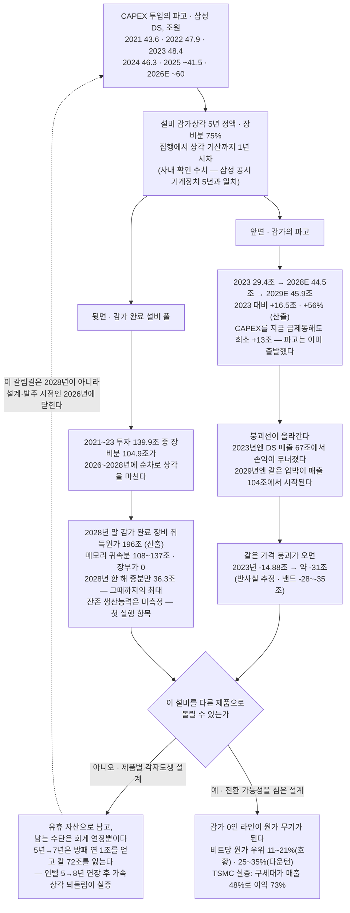
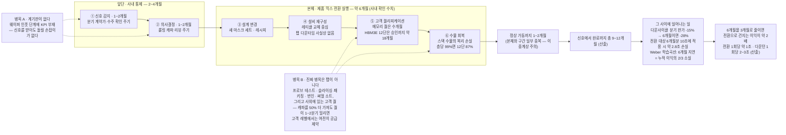
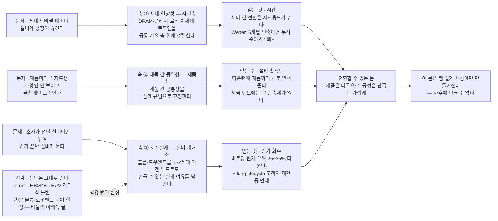
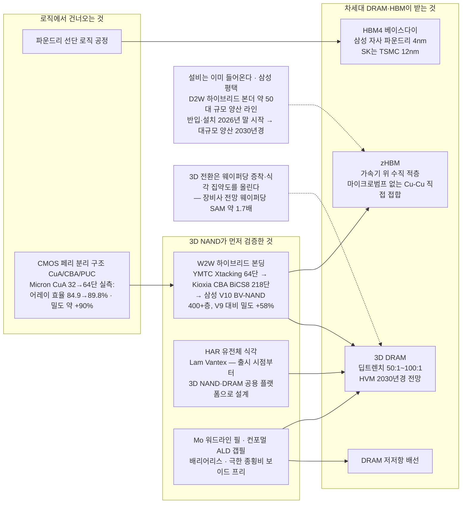

# 전환할 수 있는 몸

### 종합반도체의 양산 체제로 — 2차 저지선 전략 1번

---

공통편은 세 개의 저지선을 세웠다. 계약이 물량의 바닥을 깔고, 제품이 부가가치를 지키고, 플랫폼과 관계가 갱신을 지킨다. 이 글은 그 두 번째 저지선의 첫 번째 전략이다. 다루는 것은 제품이 아니라 제품을 만드는 몸, 곧 양산 체제다. 공통편이 남긴 세 문제 가운데 셋째 — 캐파도 원가도 아닌 차별화 축을 어디에 세울 것인가 — 에 대한 제조의 답이기도 하다. 답은 한 낱말이다. 전환 가능성.

명제는 이렇다. 종합반도체는 제품 포트폴리오만이 아니라 양산 체제가 종합반도체여야 한다. 우리는 DRAM과 플래시와 로직을 다 만들지만, 만드는 방법은 세 갈래로 갈라져 있다. 갈라진 몸은 호황에 아무 문제가 없다. 모든 라인이 다 팔리기 때문이다. 결함은 불황에만 드러난다. 한쪽이 무너질 때 다른 쪽이 받아 주지 못하고, 받아 주지 못하는 만큼 서로 더 어려워진다.

세 축을 제안한다. 세대가 바뀌어도 설비와 공정이 끊기지 않게 하는 **세대 연장성**, 제품이 달라도 설비가 서로 통하게 하는 **제품 간 동일성**, 볼륨·로우엔드 티어를 한두 세대 아래 설비로도 만들 수 있게 하는 **N-1 설계**다. 마지막 것부터 경계를 그어 둔다. 선단 공정 리더십은 그대로 간다. 1c nm과 HBM4E와 EUV에 대한 투자는 계속되고, N-1은 바벨의 아래쪽 끝에만 적용한다. 이 제안은 선단을 낮추자는 것이 아니라, 선단 아래층에서 같은 설비로 더 오래 벌자는 것이다.

낸드에서 출발했으나 낸드의 이야기는 아니다. 다음 다운턴이 낸드에서 더 깊고 더 규율 없이 올 것이라는 공통편의 판독이 출발점일 뿐, 세 축은 메모리 전체에 그대로 적용된다. 그리고 이 제안의 자리는 조금 특이하다. 2차 방어의 세 축 — 제품과 투자와 오퍼레이션 — 가운데 어느 하나에 속하지 않고 셋을 한 번에 관통한다. 무엇을 만들 수 있는 몸인가는 제품의 문제이면서 동시에 투자의 문제이고 운영의 문제이기 때문이다.

## 1. 감가의 파고

다음 다운턴에서 우리를 무너뜨릴 수 있는 것은 판가가 아니라 감가다.

2023년을 다시 보자. DS부문은 매출 66.6조 원에 영업손실 14.88조 원을 냈다[12]. 그해의 감가상각비를 CAPEX 시계열로 재구성하면 29.4조 원, 매출의 44%다[4]. 모델은 단순하다. CAPEX의 75%를 장비로 보고 5년 정액으로 상각하되, 집행에서 상각 기산까지 1년의 시차를 둔다. 이 모델은 2024년과 2025년의 DS 감가상각비 실측치 34.10조 원과 37.96조 원을 각각 1.8%와 1.5%의 오차로 재현한다[4][5]. 2023년의 감가·매출 비율 44.2%가 마이크론 회계연도 2023의 실측 49.4%와 약 5%p 차로 만나는 것도 이 모델의 두 번째 검증이다[5].

그 모델을 앞으로 돌리면 불편한 그림이 나온다. 2028년 44.5조, 2029년 45.9조. 2023년보다 각각 15.1조와 16.5조가 더 무겁고, 비율로는 51%와 56%가 늘어난다[4]. 사상 최대 투자의 감가가 다음 다운턴의 창에 정확히 정점으로 도착한다.

이 숫자가 뜻하는 바는 손익분기점의 이동이다. 2023년에는 DS 매출 67조 원에서 손익이 무너졌지만, 2029년에는 같은 압박이 매출 104조 원에서 시작된다 — 붕괴선이 6년 만에 1.5배 올라간다[4]. 같은 폭의 가격 붕괴가 온다면 적자는 30조 원 안팎으로 깊어진다(반사실 추정, 밴드 −28~−35조).

지금 CAPEX를 급제동해도 달라지지 않는다. 2029년의 감가를 결정하는 것은 이미 집행된 2024~2026년 투자분이고, 어느 경로를 타도 2023년 대비 최소 13조 원이 늘어난다[4]. 파고는 이미 출발했다. 되돌릴 수 없는 것을 흡수할 방법만 남았다.

감가가 특히 위험한 것은 다운턴의 가격 규칙 때문이다. 감가는 이미 매몰된 비용이므로 팹은 현금원가만 넘기면 웨이퍼를 계속 돌리는 편이 낫고, 그래서 가격은 총원가가 아니라 현금원가를 향해 내려간다[5]. 가동률이 아무리 흔들려도 감가는 한 푼도 줄지 않는다. 가격이 닿는 바닥은 현금원가이고, 감가는 그 바닥 아래에 그대로 남는다.

여기에 하나를 더 얹으면 문제가 완성된다. HBM 한 장을 만들 때 우리가 포기하는 것은 범용 DRAM 네다섯 장이다 — 상품기획 리더의 표현이 그렇고[1], 공개 추정은 GB당 3~4배에 모이되 하한으로는 최소 2배라는 경쟁사 공식 표현도 있다[11]. 캐파는 이미 상쇄 관계다. 그래서 사업부 최고경영진의 질문이 정확히 그 지점을 짚는다. "DDC 라인업이 지금 HBM밖에 없는데 HBM 꺼지면 이거 어떡할 거냐."[1] 이 질문에는 양산 체제 버전이 있다. HBM이 꺼졌을 때 남는 것은 수요의 공백만이 아니다. 감가가 한창인 설비가 남는다. 그리고 그 설비가 무엇을 만들 수 있느냐는, 그날 결정할 수 없다.

그런데 같은 사건에는 반대편이 있다. 5년 정액으로 상각하므로 2021~2023년에 쏟아부은 139.9조 원 가운데 장비분 104.9조 원은 2026~2028년에 차례로 상각을 마친다[4]. 특히 2028년 한 해에 상각을 마치는 장비분이 36.3조 원인데, 사상 최대 CAPEX였던 2023년의 장비분이 그대로 돌아오는 해이므로 연간 증분으로는 그때까지의 최대치다. 2016년 이후를 누적하면 2028년 말 기준 감가 완료 장비의 취득원가는 196조 원이고, 메모리 귀속분으로 좁히면 108~137조 원이다[4]. 이것은 모델만의 이야기도 아니다. 삼성전자 연결 기준 기계장치는 취득원가 404.2조 원 가운데 311.8조 원을 이미 상각해 장부 잔액이 92.4조 원이고(상각률 77.1%), 연간 기계장치 감가 37.3조 원으로 나누면 평균 잔여 내용연수는 2.5년 남짓이다[4][5]. 우리는 장비 장부가의 4분의 3을 이미 털었다.

다음 다운턴이 도착하는 바로 그 구간에, 연간 증분으로 가장 큰 몫의 설비가 장부가를 턴다. 위기와 기회는 같은 CAPEX 곡선의 앞면과 뒷면이다. 어느 쪽으로 읽힐지를 가르는 것은 단 하나다. 그 설비로 무엇을 만들 수 있는가. 다만 이 풀은 취득원가 기준의 상한이라는 점을 함께 적어 둔다 — 폐기와 손상을 반영하지 않았고, 2016~2019년 투입분은 2028년이면 열 살 안팎이다. 실제로 돌릴 수 있는 설비가 얼마인지는 아직 아무도 세어 본 적이 없다.

*표 1. 감가의 파고 — 2023년 앵커와 2028~29년 창.*

| 항목 | 2023 (앵커) | 2028E | 2029E |
|---|---|---|---|
| DS CAPEX | 48.4조 (사상 최대) | 55조 (가정) | 45조 (가정) |
| 감가상각비 (모델) | 29.4조 | **44.5조** | **45.9조** |
| 시나리오 밴드 | — | 43.4~45.8조 | 42.4~49.6조 |
| 2023년 대비 증가 | — | +15.1조 (+51%) | +16.5조 (+56%) |
| 2023형 붕괴선 매출 | 66.6조 (실측) | **101조** | **104조** |
| 같은 가격 붕괴 시 영업손익 | −14.88조 (실측) | 약 −29.9조 | 약 −31.3조 |
| 감가 완료 장비 취득원가 (2016년 이후 누적) | — | **196조** (2028년 말) 메모리 귀속분 108~137조 | — |

*모델 검증 — 2024·2025년 DS 감가상각비 실측 34.10조·37.96조를 각각 −1.8%·−1.5% 오차로 재현한다. DS CAPEX는 파운드리·시스템LSI를 포함하며 메모리 단독 CAPEX는 미공시다 — 메모리 귀속분(55~70%)만 보면 감가 증가분은 9.1~11.5조로 줄어든다. 영업손익 환산은 "2023년과 똑같은 가격 붕괴가 온다면"이라는 조건 위에서만 성립하는 반사실 추정이며 예측이 아니다. 감가 완료 장비 취득원가는 자산 폐기·손상·조기 상각을 반영하지 않은 상한이므로, 실제 가동 가능한 설비는 이보다 작다[4].*

*도식 1. 2021~26년의 CAPEX 파고는 5년 뒤 감가의 파고로 되돌아와 2028~29년 다운턴 창과 정면으로 겹치는데, 바로 그 해에 감가가 끝난 설비 풀도 사상 최대가 된다 — 같은 곡선의 앞면과 뒷면이며, 어느 쪽으로 읽힐지는 그 설비를 다른 제품으로 돌릴 수 있느냐 하나로 갈린다.*

## 2. 왜 각자도생이 됐나

제품마다 최적을 좇은 결과가 회사 전체의 차선(次善)이다.

구조는 단순하다. 제품별 조직이 각자 자기 제품의 원가와 수율과 일정을 최적화하면, 설비 사양도 제품별로 갈라진다. 각각의 선택은 개별로 옳다. 옳은 선택들의 합이 틀린다. 이것이 국소해의 정의다.

산업의 물리도 갈라지는 쪽으로 밀었다. 3D 낸드는 수직 적층으로 리소의 압력을 걷어 내고 가장 어려운 과제를 증착과 식각으로 옮겼다. 반면 DRAM 팹의 툴링 비용은 여전히 리소가 지배한다. 그래서 업계의 관찰자는 3D 전환이 "DRAM과 3D 낸드 팹 툴링의 공통점을 오히려 줄였다"고 적는다[6]. 더 아픈 판정도 있다. 완전 가변 팹을 만들려던 시도가 장비 밸런스 불일치로 유휴 장비만 남겼고, 오늘날 팹을 다른 기술로 전환하는 것을 고려할 제조사는 거의 없다는 것이다[6]. 이 반론은 5장에서 정면으로 받는다. 여기서는 인정만 한다 — 각자도생에 이른 데에는 조직의 문제만이 아니라 공정의 이유가 있었다.

문제는 그 결함이 호황에는 보이지 않는다는 것이다. 2026년 1분기 DRAM 계약가는 분기 대비 90~95% 올랐다[11]. 이런 시장에서는 모든 라인이 다 팔리고, 갈라진 설비는 갈라진 채로 최적이다. 결함은 불황에만 드러나고, 고칠 수 있는 계절은 호황뿐이다. 이 어긋남이 각자도생을 오래 살아남게 했다.

낸드에는 완충재조차 없다. 메모리 영업 리더의 진단이 "낸드가 심상치 않아"로 시작하는 이유가 거기에 있다[2]. HBM이라는 비효율 제품이 D램 캐파의 30~40%를 깔고 앉아 역설적으로 수급을 받쳐 준다는 진단은 공통편이 이미 짚었다. 제조편의 질문은 그다음이다. 그 완충재가 없는 낸드에서, 같은 것을 인공적으로 만들 수 있는가. 설비 공통성이 그 인공 완충재다.

2023년에 우리가 남긴 기록이 그 필요를 증언한다. 같은 회사 안에서 레거시 라인은 감산하고 HBM과 DDR5는 증설했다[12]. 상호 보완이 아니라 각자도생의 기록이다. 후과도 남았다. 레거시 DRAM 생산이 급감해 2026년 물량이 2025년 수준의 20% 언저리로 내려앉자 DDR4와 LPDDR4X가 20~30% 급등하는 역설이 벌어졌다[11]. 전환이 한 방향으로만 열려 있으면 되돌아올 수 없다. 비가역 전환은 그 자체가 비용이다.

그리고 시간이 있다. 제품 믹스 전환에 걸리는 시간은 약 6개월이고[3], 앞에 신호를 확인하고 결정을 내리는 2~4개월을 붙이면 신호에서 완료까지의 실제 지연은 9~12개월이 된다[4]. 우리가 늘 반 박자 늦게 도착한다는 뜻이다. 그사이 다운사이클 판가는 분기마다 15%씩 빠져 6개월이면 28%가 움직이고, 전환 대상 매출의 6개월분에 그 낙폭을 얹으면 2.8조 원이 리드타임 안에서 사라진다[4]. 상승장에서도 대칭으로 손해라는 점이 이 지연의 성격을 말해 준다 — 방향의 문제가 아니라 속도의 문제다.

그 지연의 값을 가장 정직하게 환산해 주는 것은 수율 학습곡선이다. 양산 램프가 6개월 늦으면 누적 이익의 3분의 2가 사라진다[8]. 전환 리드타임 6개월은 목적지 제품의 램프를 정확히 그만큼 늦추는 일이니, 전환으로 건지려던 이익의 3분의 2가 리드타임 안에서 증발한다. 제품마다 사이클이 따로 도는 비동기 시대에는 이 손실이 한 번으로 끝나지 않는다 — 신호가 올 때마다 같은 반 박자가 새로 쌓인다.

여기서 이 보고서의 자리를 분명히 해 둔다. 오늘의 전환율을 높이는 일은 이미 최고경영진의 일상 의제다. 상품기획 리더가 못 박은 대로다. "[대응은] 어떻게든 전환율 높일 수 있는 방향. 지금 [사업부 최고경영진이] 매일매일 챙기시는 게." 그리고 이어진 말이 경계선이다. "제품 수 줄여 선택과 집중. 이 [액션러닝] 프로젝트를 할 건 아니다."[1] 옳은 지적이다. 그래서 이 글은 오늘의 전환율을 말하지 않는다. 전환 가능성의 설계를 말한다.

그 구분이 필요한 실무적 이유가 있다. 진짜 병목이 물리적 장비가 아니기 때문이다. 같은 팹 안에서 DDR5를 GDDR7으로 바꾸는 일은 웨이퍼 투입에서 패키지 출하까지 약 5개월이 걸리는데, 레티클 교체를 빼면 팹 다운타임은 사실상 없다 — 설계 변경과 새 마스크 세트가 필요할 뿐이다[6]. 병목은 그 바깥에 있다. 하나는 사외에 있는 고객 퀄리피케이션이다. HBM3E 12단은 개발 완료 후 승인까지 약 18개월이 걸렸고, 캐파를 50% 더 갖고도 퀄이 한두 분기 밀리면 고객 레벨에서는 여전히 공급 제약이다[6]. 다른 하나는 설계 종속성이다. HBM 다이는 TSV 홀과 I/O 레이아웃이 달라 표준 DRAM으로 되돌리는 것이 비현실적이고, 본딩된 스택은 분해되지 않는다[6]. 병목의 물리적 위치조차 팹이 아니라 프로브 테스트와 패키징과 번인에 걸려 있다[6].

오늘의 전환율을 아무리 독려해도 이 구간은 줄지 않는다. 줄이려면 설계와 발주와 인증의 규범을 바꿔야 한다.

> **용어** — 퀄리피케이션(qualification): 고객이 자사 시스템에서 부품을 검증해 승인하는 절차. 통과하기 전에는 물량이 아무리 있어도 팔 수 없다.

*도식 2. 전환 6개월은 실행 구간만의 시간이고, 신호 감지와 의사결정을 앞에 붙이면 실제 지연은 9~12개월이다 — 그사이 판가는 28% 움직이고, 진짜 병목은 팹이 아니라 사외에 있는 고객 퀄과 후공정에 있다.*

### 2.1 세 갈래 길

진단이 여기까지면 길은 셋이고, 둘은 막다른 길이다.

첫째는 하던 대로다. 제품마다 각자 최적화하고, 전환이 필요해지면 그때 가서 한다. 지금 시황에서는 이 길이 옳아 보인다 — 모든 라인이 다 팔리는 시장에서 갈라진 설비는 갈라진 채로 최적이기 때문이다. 그러나 이 길의 값은 다운턴에 청구된다. 감가는 정점인데 받아 줄 라인이 없고, 그때 남는 수단은 회계 연장뿐이다.

둘째는 반대쪽 끝이다. 어떤 제품이든 만들 수 있는 완전 가변 팹을 짓는다. 업계가 이미 시도했다가 실패한 길이다. 장비 밸런스가 제품마다 너무 달라 유휴 장비만 남았고, 오늘날 이 길을 고려할 제조사는 거의 없다[6]. 선단 성능도 최대공약수에 묶인다. 기각한다.

셋째가 이 글의 제안이다. 티어를 나눠 선단은 최적화를 그대로 좇게 두고, 볼륨 아래층에만 전환 가능성을 설계로 심는다. 완전 가변이 아니라 부분 가변이고, 사후 전환이 아니라 사전 설계다. 우리 전략이 이미 걸어 둔 ±20%라는 조정 범위는 그대로 두되, 그 20%를 다운턴이 아니라 설계 시점에 확보해 두자는 것이다[7]. 3장의 세 축이 그 확보의 방법이다.

*표 2. 세 갈래 길 — 2안을 기각하는 이유는 실행 불가능해서만이 아니라 선단 리더십을 훼손하기 때문이다.*

| 선택지 | 선단 리더십 보존 | 다운턴 흡수력 | 감가 회수 | 실행 가능성 | 판정 |
|---|---|---|---|---|---|
| **1안 · 각자도생 유지** 제품별 최적화, 전환은 사후 대응 | ◎ 영향 없음 | ✕ 한쪽이 무너져도 받아 줄 라인이 없다 | ✕ 유휴로 남고 회계 연장 외 수단이 없다 | ◎ 현상 유지 | **기각** — 값이 다운턴에 청구된다 |
| **2안 · 완전 가변 팹** 어떤 제품이든 만드는 라인 | ✕ 최대공약수 설계가 선단을 끌어내린다 | ◎ 이론상 최대 | ○ | ✕ 장비 밸런스 불일치로 유휴 장비만 남긴 실패 실증[6] | **기각** — 업계가 이미 치른 수업료 |
| **3안 · 바벨형 전환 설계** 티어 분리 + 사전 설계 | ◎ 선단 티어는 최적화 그대로, N-1은 아래층 한정 | ○ 부분 가변 범위(±20%) 안에서 상호 보완 | ◎ 감가 완료 라인이 로우엔드 원가 무기가 된다 | ○ 규범·양식의 변경 — 증액 요구 없음 | **채택** |

## 3. 세 개의 축

전환 가능성은 하나의 능력이 아니라 서로 직교하는 세 개의 축이다.

세대가 바뀔 때 끊기는 문제, 제품끼리 받쳐 주지 못하는 문제, 감가가 끝난 설비가 노는 문제는 각각 다른 축의 문제다. 시간축과 제품축과 설비 세대축이다. 셋 중 하나만 풀면 나머지 둘에서 새는데, 지금까지의 논의는 대개 하나씩만 다뤘다.

*도식 3. 세 축은 서로 다른 축의 문제를 푼다 — ①은 시간축(세대가 바뀌어도 끊기지 않게), ②는 제품축(제품이 달라도 서로 받쳐 주게), ③은 설비 세대축(선단 설비가 아니어도 만들 수 있게). 셋이 직교하기 때문에 합쳐야 비로소 하나의 몸이 된다.*

### 3.1 세대 연장성 — 공통 기술 축은 이미 생겼다

공통 기술 축은 만들자는 당위가 아니라 이미 일어난 사실이다.

증거는 우리 안에 있다. 차세대 DRAM의 설계를 설명하는 상품기획 리더의 문장이 그렇다. "zHBM은 웨이퍼-웨이퍼 새로운 기술이에요. 3D 낸드에서 쓰는 기술을 사용하긴 하는데 여러 개를 쌓아야 되는 거라 난이도가 높아요. 수율이 더 안 나와요."[1] 차세대 DRAM이 낸드의 기술 위에 선다는 뜻이다.

산업의 궤적도 같다. 웨이퍼 대 웨이퍼 하이브리드 본딩은 YMTC가 64단에서 먼저 썼고, 키옥시아가 218단 CBA로 양산에 올렸으며, 우리는 400층대 V10 BV 낸드에서 어레이와 페리 로직을 분리해 접합하면서 직전 세대 대비 저장 밀도를 약 1.6배로 올렸다[6][10]. 그 축이 그대로 zHBM과 3D DRAM으로 건너간다. DRAM 쪽에서도 이미 도착해 있다. ISSCC에서 발표한 4F² COP DRAM은 하이브리드 본딩으로 DRAM 노드의 셀과 로직 노드의 주변 회로를 결합해 핵심 회로 면적을 17.0%에서 2.7%로 줄였다[11]. 장비사의 언어도 같은 방향이다. 낸드 워드라인용 몰리브덴 필과 컨포멀 ALD 갭필의 공정 이해가 3D DRAM으로 적응되는 중이고, 고종횡비 유전체 식각 플랫폼은 출시 시점부터 3D 낸드와 DRAM 로드맵을 함께 겨냥해 나왔다[6].

반대 방향의 다리도 이미 놓였다. HBM4의 베이스다이는 로직 팹의 산출물이고, 우리는 그것을 자사 파운드리 4nm로 만든다[6]. 10nm 이하 로직을 양산할 수 있는 세 회사 가운데 메모리도 만드는 곳은 우리뿐이며, 이것이 코어다이와 베이스다이와 패키징을 한 몸으로 통제할 수 있는 유일한 위치를 만든다[13]. 다만 이 자산이 무조건 유리하다고 말하면 정직하지 않다 — 자사 4nm 노선이 경쟁사의 TSMC 12nm 대비 고비용이라는 외부 평가가 있다[13]. 단기의 원가와 장기의 구조를 맞바꾸는 선택이고, 그 교환을 의식적으로 하는 것과 모르고 하는 것은 다르다.

그러니 제안은 새 축을 만들자는 것이 아니다. 이미 수렴 중인 축 — 웨이퍼 본딩, 고종횡비 식각, 컨포멀 증착 — 을 공식 축으로 선언하고, 차세대 로드맵의 승인 요건을 그 위에 정렬하는 것이다. 로직에는 이 규범의 선례가 있다. N7에서 N5, N5에서 N3로 넘어가는 핀펫 세대 사이의 툴 재사용률이 50~70%로 유지되는 것이 그것이다[6]. 단서는 둘이다. 이 수치는 제품 간이 아니라 로직 노드 간이고 2차 자료다. 그리고 GAA와 백사이드 전력공급이 들어오는 N2에서는 재사용률이 크게 떨어진다[6] — 구조가 바뀌는 세대에는 규범도 깨지므로, 축의 정렬은 구조가 바뀌기 전에 끝나 있어야 한다.

이 축이 벌어 주는 것은 원가가 아니라 시간이다. 하이브리드 본딩만 해도 웨이퍼를 두 장 쓰기 때문에 단순 원가 비교에서는 CuA보다 비싸다[10] — 공통화가 곧 저원가라는 뜻이 아니다. 같은 제품군 안의 세대 전환은 대부분의 장비가 이미 그 자리에 있어 재사용도가 높고[6], 세대 연장성이란 그 재사용도를 제품군 경계 너머까지 끌고 가는 일이다. 학습곡선에서 6개월은 누적 순이익 두 배의 값이다[8].

> **용어** — W2W 하이브리드 본딩: 두 장의 웨이퍼를 범프 없이 구리 패드끼리 직접 접합하는 방식. 셀 어레이와 주변 회로를 각각 최적 공정으로 따로 만들어 붙일 수 있게 한다.

*도식 4. 공통 기술 축은 당위가 아니라 이미 수렴 중인 사실이다 — 3D 낸드가 검증한 W2W 하이브리드 본딩·고종횡비 식각·컨포멀 ALD가 zHBM과 3D DRAM으로 건너가고, 반대 방향에서는 로직 공정이 HBM 베이스다이와 페리 분리 구조로 메모리에 들어온다.*

### 3.2 제품 간 동일성 — 제품은 다극으로, 공정은 단극에 가깝게

파는 것은 여러 갈래여도 만드는 방법은 한 갈래에 가까워야 한다.

이 명제가 필요한 이유는 우리 전략이 이미 다극을 요구하기 때문이다. 호황과 불황 모두에서 우위를 갖는 단일 제품군은 없으므로 포트폴리오를 여러 극으로 벌리라는 것이 바벨 전략의 전제이고[9], 그 비중을 분기마다 조정할 멀티 프로덕트 팹을 평택에 적용하라는 것이 옵션형 캐파 전략의 실행안이다[7]. 목표 믹스는 이미 문서에 있다. 없는 것은 그 이동을 6개월 안에 해낼 수 있는가에 대한 명세다. 제품 다극과 공정 단극이 함께 서야 다극 포트폴리오가 다운턴에 자원 분산이 아니라 상호 보완이 된다.

전환 자체는 예외가 아니다. 증권가는 올해 메모리 CAPEX에서 전환 투자가 신규 투자를 앞지를 것으로 보고[6], 우리 팹에서도 이미 벌어지고 있다. 화성 12라인은 2D 낸드를 끝내고 1c DRAM 엔드팹으로 바뀌는 중이고, 평택 P4의 파운드리 예정 구역은 1c DRAM으로 돌려졌으며, HBM3E용 1a 캐파의 30~40%를 범용으로 되돌리는 검토도 진행됐다[6]. 평택 P2에서 DRAM과 낸드를 혼용 운영한 전례도 있다[7]. 눈여겨볼 것은 화성 12라인의 전환 단위다 — 팹 전체가 아니라 메탈 배선 이후의 공정 구간이 바뀐다[6]. 전환의 실제 단위는 팹이 아니라 모듈이며, 설계 규범의 단위도 거기에 맞춰야 한다.

그러나 사전 설계 없이 사후에 하면 느리고 비싸다. 화성 11·13라인을 DRAM에서 이미지센서로 돌렸을 때 두 공정의 약 80%가 동일했고 리소·CVD·식각과 테스트 장비를 그대로 썼지만, 스텝 수가 늘어 전환 후 캐파가 절반으로 줄었다. 비용은 최소 1조 원이었고, 그래도 신규 라인 신설보다는 훨씬 적었다[6]. 이 사례에서 뽑아야 할 명제는 하나다. 공용성은 산출량을 지키는 것이 아니라 자본지출을 지킨다. 이 구분을 흐리면 논거 전체가 흔들린다. 더 큰 전례로 오스틴 팹이 있다 — 2010년 투자 결정에서 2012년 플래시 종료까지, 메모리 팹이 로직 팹으로 바뀌는 데 2~3년이 걸렸다[12]. 되긴 된다. 다만 사전 설계 없이 하면 그 시간을 다 치른다.

다른 산업은 이 문제를 오래전에 풀었다. 토요타는 부품 공용률을 20~30%에서 70~80%까지 끌어올리는 것을 목표로 삼으면서 그 최대 효과를 원가가 아닌 데서 찾았다. 부품을 전략적으로 공유하면 한 라인에 복수 플랫폼과 파워트레인을 얹는 혼류 생산이 가능해지고, 그 결과로 신모델 생산라인 준비 투자가 절반 가까이 준다는 것이다[6]. 르노-닛산이 다섯 개의 큰 모듈 조합으로 모델당 진입비용을 30~40% 낮춘 것도 같은 결이다[6]. 경계도 적어 둔다. 폭스바겐이 MQB로 원가를 20% 줄인다고 했을 때 한 애널리스트는 과대포장이라고 반박했다[6]. 공용화의 효과는 과대추정되기 쉬우므로, 이 글은 원가 절감률을 목표로 걸지 않는다.

*표 3. 전환 난이도는 제품쌍마다 다르고 방향에 따라서도 다르다 — 쉬운 쌍은 이미 하고 있고, 어려운 쌍의 병목은 장비 그 자체가 아니라 리소·식각 집약도의 불일치와 고객 퀄이다. 이 표의 진짜 결론은 지금 우리 팹이 어느 칸에 서 있는지를 아무도 숫자로 답할 수 없다는 것이다.*

**난이도 표기** — ◎ 낮음(실증 사례 있음) / ○ 중(경로 있음, 병목 관리 필요) / △ 상(설계 시점 결정에 의존) / ✕ 최상(근대 사례 미확인)

| 전환 전 ↓ \ 전환 후 → | 범용 DRAM (DDR5) | HBM | LPDDR·GDDR | NAND | 차세대 (zHBM·3D DRAM) |
|---|---|---|---|---|---|
| **범용 DRAM (DDR5)** | ◎ 노드 전환 — 장비 대부분 잔류 | ○ 전공정 공통. 병목은 TSV·스택 등 후공정 전용 캐파와 고객 퀄. 캐파는 등가가 아니다 — HBM 1장 = 범용 3~4장(외부 추정)·4~5장(사내) | ◎ 설계 변경 + 새 마스크 세트. DDR5→GDDR7 약 5개월, 팹 다운타임 사실상 없음 | ✕ 근대 사례 미확인. 리소 집약 → 식각·증착 집약의 역방향 | △ W2W 본더 신규 반입 필요. 평택 D2W 본더 2026년 말~ |
| **HBM** | ○ **검토 단계(실행 미확인)** — 1a 캐파 30~40%를 범용으로 되돌리는 검토, 약 8만 장/월. 병목: 고객 퀄 · KGD 탈락 다이 전용 불가 | ◎ 세대 전환 (HBM3E→HBM4) | ○ 전공정 공통 · 후공정 라인 성격이 다름 | ✕ 사례 없음 | △ 접합 방식 자체가 바뀐다(CoW→W2W) · 수율이 더 안 나옴(사내) |
| **LPDDR·GDDR** | ◎ 같은 팹 공정 · 마스크 세트 교체 | ○ 후공정 TSV·스택 캐파가 병목 | ◎ 동일 계열 내 전환 | ✕ 근대 사례 미확인 | △ 범용 DRAM 경유 |
| **NAND** | ○ **실행 중** — 화성 12라인 2D NAND → 1c DRAM 엔드팹(월 8만~10만 장). 단 전환 단위가 팹 전체가 아니라 **공정 구간** 이다 | △ 직접 경로 미확인 — 범용 DRAM 경유 2단계 | △ 동 (범용 DRAM 경유) | ◎ **가장 싸다** — 세대 전환은 재사용도가 높다(대부분 장비가 이미 그 자리에) | ○ **유일한 순방향 다리** — W2W 본딩 · HAR 식각 · Mo 필 · 컨포멀 ALD가 그대로 이전 |
| **차세대 (zHBM·3D DRAM)** | △ 양산 전 — 역방향 전환 가능성은 지금의 설계 결정에 달려 있다 | △ 동 | △ 동 | △ 동 | ○ 3D DRAM HVM 2030년경 · zHBM과 W2W 축 공유 |
| **로직 팹 (파운드리)** | ○ **실증** — 평택 P4 파운드리 예정 구역 → 1c DRAM 전환(P4 월 8만 장 추정) | ◎ HBM4 베이스다이가 이미 로직 팹 산출물 (자사 4nm) | ○ P4 사례에 준함 | ✕ 미확인 | ○ CMOS 페리 분리가 로직→메모리 유입 경로 |

*주 1 — 업계의 현행 상식은 이 표의 반대편에 있다. 완전 가변 팹 시도는 장비 밸런스 불일치로 유휴 장비를 낳았고, 오늘날 한 기술에서 다른 기술로 팹을 전환하는 것을 고려할 제조사는 거의 없다[6].*
*주 2 — 공용성은 산출량이 아니라 자본지출을 지킨다. 화성 11·13라인 DRAM→CIS 전환은 공정의 약 80%가 동일했으나 스텝 수 증가로 전환 후 캐파가 약 50% 감소했고(월 10만 장 → 약 5만 장), 비용은 최소 1조 원이었다[6].*
*주 3 — DRAM↔NAND 장비군별 공용 가능 비율의 공개 추정치는 존재하지 않는다. 제품 간 정량 공용률로 확인되는 유일한 값이 위 DRAM↔CIS 약 80%다[6]. 각 칸에 우리 팹의 현재 값을 채워 넣는 것 자체가 이 보고서의 첫 실행 항목이다.*

### 3.3 N-1 설계 — 같은 설비에서 가치를 더 오래

먼저 경계를 다시 긋는다. 선단 공정 리더십은 그대로 간다.

1c nm DDR5의 웨이퍼당 원가를 2027년 말까지 30% 줄이고 CXMT 대비 10% 이상의 원가 우위를 지킨다는 목표, 그리고 1c nm 우위와 낸드 공정 주기 연장과 하이브리드 본딩 자체 IP라는 세 축은 하나도 건드리지 않는다[8]. N-1 설계는 그 아래층, 볼륨과 로우엔드 티어에만 적용하는 바벨의 한쪽 끝이다. 그리고 이것은 원가를 목표로 세우자는 말이 아니다. 메모리 영업 리더의 순서를 그대로 따른다. "커머디티의 본질[원가]을 벗어날 수 없는데, 원가라는 컨셉이 개발의 핵심으로 먼저 작용해서는 안 되고 원가는 결과물이어야 해. 과거에 잘못한 게 원가 싸게 하려고 다이 늘리고 레이어 줄이고 — 그 순서가 잘못된 거야."[2] 우리가 요구하는 것은 원가 목표가 아니라 설계 자유도다. 목적함수가 아니라 제약조건의 완화다.

정의를 스스로 내린다. N-1 설계란 현 세대 대비 한두 세대 이전의 노드와 장비로도 같은 소자를 만들 수 있게 남겨 두는 설계 여유이며, 적용 범위는 볼륨·로우엔드 티어에 한정한다. 저자의 정의이고, 저장소에도 공개 자료에도 이 용어의 표준 정의는 없다.

경제학은 명료하다. 메모리 매출원가의 30~45%가 감가상각비이고, 그 감가의 85~93%가 기계장치에서 나온다[5]. 설비를 어떤 레벨로 설계하느냐가 곧 원가 구조 그 자체라는 뜻이다. 감가가 0인 라인은 그 30~45%를 통째로 덜어낸 채 출발한다. 구세대 설비의 생산성 열위와 유지보수 부담을 되돌려 놓아도 비트당 원가 우위는 호황에 11~21%, 다운턴에 25~35%로 남는다[4]. 다운턴일수록 우위가 커지는 이유는 1장에서 본 그대로다 — 분모가 줄어도 감가는 그대로이기 때문이다. 마이크론의 2023 회계연도가 그 실측이다 — 감가 76.7억 달러가 매출의 49.4%였고 매출원가율은 109%였다[5].

이 구조는 TSMC에서 이미 관측된다. 2024년에 3nm와 5nm가 매출의 52%를 만들면서 영업이익 기여는 27%에 그친 반면, 감가가 끝난 7nm 이상 구세대가 매출의 48%로 이익의 73%를 만들었다[5]. 외부 추산이라는 단서는 붙지만, 선단이 감가를 짊어지고 레거시가 이익을 만든다는 방향은 분명하다.

여기서 중화 시장이 다시 열린다. CXMT는 EUV 없이 DUV 멀티패터닝으로 가기 때문에 같은 산출을 내는 데 웨이퍼를 30% 더 넣어야 하고, 그 결과 비트당 원가가 30% 이상 열위다[5]. YMTC는 낸드에서 10~20% 저가로 점유를 산다[5]. 다운턴 국면이라면 감가가 끝난 우리 라인은 로우엔드 가격이 15% 내려도 흑자권에 남는다(원가 지수 65~75). 호황 국면에서는 그 여유가 11~21%로 좁아진다. 단서도 있다. 저 30%는 공정 효율 기준이고, 국가 보조와 보조금의 자산 차감 회계가 실효 감가 부담을 낮추면 격차는 줄어든다 — 중국 두 회사의 감가 정책은 미확인이다[5]. 그리고 최근 보도는 CXMT의 DDR5 모듈 가격이 빅3를 그대로 추종해 저가 대안 역할을 못 한다고 지적한다[5]. 가격 전쟁이 아직 시작되지 않았다는 뜻이고, 그렇다면 이 여유는 아직 쓰지 않은 저축이다.

고객 쪽 편익도 있다. 새 적층 세대가 양산에 들어가면 구세대 다이가 단종되고, 산업·자동차·서버 고객은 재설계와 재인증을 강요당한다[10]. N-1 라인을 유지한다는 것은 그 부담을 우리가 흡수한다는 뜻이다. 마이크론은 이 구조를 이미 팹 단위로 채택해 매너서스를 장수명 전용으로 돌리고 보이시와 시러큐스를 선단에 두었다[9]. 다만 그것은 팹 사이의 분리이지 팹 안의 전환이 아니다. 그 차이가 우리에게 남은 여지다.

이 축은 공정 리더십 전략의 부정이 아니라 확장이다. 그 전략은 이미 "같은 실리콘에서 가치를 더 오래 추출한다"를 축으로 세우고 있고, 산업 전체가 2026년 낸드 투자를 캐파 확장이 아니라 공정 업그레이드와 하이브리드 본딩에 집중시키고 있다[8][10]. N-1 설계는 그 문장의 설비판이다. 같은 설비에서 가치를 더 오래 추출한다.

마지막으로, 감가를 받아내는 다른 길 하나를 미리 닫아 둔다. 회계다. 내용연수를 5년에서 7년으로 늘리면 2028~29년의 감가 부담은 연 1조 원 정도 줄지만, 감가 완료 설비 풀은 196조에서 124조로 72조 원이 사라진다[4]. 방패를 1조 얻고 칼을 72조 잃는 거래다. 실증도 있다. 인텔은 2023년 1월 내용연수를 5년에서 8년으로 늘려 그해 감가를 42억 달러 줄였으나, 설비가 수요를 초과하자 2024·2025년에는 오히려 일부 설비의 내용연수를 단축하고 9.92억·4.56억 달러의 가속상각을 인식했다[5]. 설비가 전환 불가능하면 회계는 시간을 벌 뿐 현금을 만들지 못한다.

> **용어** — N-1 설비(저자 정의): 현 세대 대비 1~2세대 이전의 노드·장비. / 감가 완료 설비: 취득원가를 모두 상각해 장부가가 0이 되었으나 여전히 도는 설비.

*표 4. N-1 원가 브리지 — 신규 선단 설비 라인의 비트당 총원가를 100으로 둔 지수.*

| 구성 | 호황 국면 | 다운턴 국면 |
|---|---|---|
| 신규 선단 라인 비트당 총원가 | 100 | 100 |
| └ 그중 감가상각비 | 30.8 | 45.2 |
| └ 현금원가(감가 제외) | 69.2 | 54.8 |
| 감가 완료 설비 라인: 감가 = 0 | 69.2 | 54.8 |
| + 구세대 생산성 열위·유지보수 | +10 ~ +20 | +10 ~ +20 |
| **= 감가 완료 로우엔드 라인 비트당 원가** | **79 ~ 89** | **65 ~ 75** |
| **순 비트당 원가 우위** | **11 ~ 21%** | **25 ~ 35%** |
| (참고) CXMT — DUV 멀티패터닝, 동일 산출에 웨이퍼 30% 추가 | 130 | 130 |

*감가 비중 30.8%·45.2%는 SK하이닉스 2025년과 마이크론 FY2023의 전사 매출원가 기준 실측 대리지표다 — 비트당 원가에서 감가가 몇 %인지의 공식 수치는 어느 회사도 공개하지 않는다[5]. 생산성 열위 페널티는 가정이며, 그 근거는 DRAM→CIS 전환에서 스텝 수 증가로 캐파가 50% 줄어든 실측이다[6].*

## 4. 무엇을 바꾸는가

네 영역 어디에도 증액 요구가 없다.

이것이 이 장의 첫 문장이어야 하는 이유는 분명하다. 자원 분산이야말로 이 제안에 날아올 가장 강한 반론이고, 실제로 그 반론은 정당하다. 그래서 답을 먼저 놓는다. 여기서 바꾸는 것은 예산이 아니라 설계 규범과 문서 양식이다. 같은 돈을 쓸 때 무엇을 필수 심사 항목에 넣을지의 문제다.

**설계 규범.** 차세대 로드맵의 승인 요건에 공통 기술 축 정렬 여부를 필수 심사 항목으로 신설한다. 웨이퍼 본딩, 고종횡비 식각, 컨포멀 증착 위에 서 있는가를 묻는 한 줄이다. 볼륨·로우엔드 티어에는 N-1 노드로도 생산 가능한 설계 여유를 제품 스펙에 명시한다. 그리고 순서를 뒤집는다 — 성능 목표보다 포맷과 사양 표준을 먼저 고정한다. 디스플레이가 이 순서의 대가를 보여 줬다. 유리 기판이 10cm 커지면 생산 효율은 9% 오르지만 기존 세대의 장비는 더 이상 쓸 수 없게 된다[6]. 공용성은 규격이 유지되는 한에서만 성립한다.

**설비 구매 사양.** 신규 장비 발주 사양서에 제품 간 전환 가능성 등급을 필수 기재 항목으로 넣는다. 범용 성격이 강한 장비군 — CMP, 세정, PR 스트립, 셀렉티브 식각, ALD와 CVD — 의 비중 하한을 티어별로 규정하고, 전용 장비인 EUV와 TSV와 본딩은 선단 티어로 격리한다. 바벨의 위쪽 끝을 흐리지 않기 위해서다. 시장은 이미 그렇게 팔고 있다. 주요 장비사의 셀렉티브 식각 신제품은 낸드와 DRAM과 파운드리 로직 전반을, SiN ALD는 DRAM과 로직 양쪽을 대상으로 명시한다[6]. 우리가 할 일은 그 범용성을 발주서에서 요구하는 것뿐이다.

**교차 퀄 상시화.** 6개월을 3개월로 줄이는 실제 수단은 여기에 있다. 주력 제품을 둘 이상의 라인과 노드에서 미리 인증받아 둔다. 전환 시점에 퀄을 시작하면 창을 이미 넘긴다 — 2장에서 본 대로 퀄은 사외에 있고, 짧아도 수개월이며 길면 1년을 훌쩍 넘긴다. 전환 규범의 범위도 후공정과 테스트 프로그램과 퀄 패키지까지 넓힌다. 팹만 보면 병목을 못 푼다. 장수명 고객의 재인증 부담을 N-1 유지로 흡수하는 것도 이 항목의 일부다.

**투자 거버넌스.** 투자 단위의 필수 속성에 전환 가능성 등급을 추가하고, 롤링 캐파 리뷰의 심사 항목에 "이 투자로 전환 가능성이 늘었나 줄었나"를 신설한다. 둘 다 이미 있는 제도이므로 한 줄을 더하는 일이다[7]. 전환 옵션의 프리미엄은 장비 반입 연기 옵션과 같은 종류의 보험료로 예산에 명문화한다 — 반입을 최대 12개월 미룰 권리를 장비 대금의 2~5%로 사는, 이미 승인된 구조다[7]. 그리고 클린룸까지는 선행하되 그 뒤는 수도꼭지로 둔다.

**계기판.** 세어야 할 것은 넷이다. 신규 발주 금액 중 제품 간 공용 장비의 비중, 신호에서 완료까지의 전환 리드타임, 전환 후 수율 회복 곡선, 그리고 감가 완료 설비의 재가동률 — 2028년 말에 도착하는 취득원가 196조 원, 메모리 귀속분으로는 108~137조 원의 풀 가운데 몇 퍼센트를 실제로 돌렸는가. 넷 중 셋은 기준치 0에서 출발하는 신규 계기판이다. 이 사실이 문제의 크기를 말해 준다 — 지금 우리 팹의 전환 가능 캐파 비율이 몇 퍼센트인지 아무도 답할 수 없다. 첫 실행 항목은 목표치를 세우는 것이 아니라 값을 재는 것이다. 측정되지 않는 것은 설계되지 않는다.

### 4.1 DS 전사로 넓히면 — 옵션으로만 제시한다

여기까지는 메모리 사업부 안에서 닫히는 이야기다. 그 밖으로 나가면 세 갈래가 더 열리는데, 셋 다 사업부 단독 결정 범위를 넘으므로 옵션으로만 놓는다.

첫째, 파운드리와의 접점이다. HBM4 베이스다이가 이미 로직 팹의 산출물이고 평택 P4의 파운드리 예정 구역이 DRAM으로 돌려진 이상, 두 사업부의 설비 사양 표준을 한 문서에서 관리하면 전환 가능한 면이 넓어진다. 둘째, 이미지센서다. DRAM과 CIS 공정의 약 80% 동일성은 우리가 이미 두 라인에서 실증했다[6]. 셋째, 감가 완료 설비의 두 번째 수명이다. 반도체 2차 시장의 본질이 거래가 아니라 검사·등급화·잔존수명 예측·보증에 있다는 위키의 판정은[15] 칩과 모듈을 대상으로 한 것이고, 장비로 확장하는 것은 아직 제안일 뿐이다. 그래도 경고는 분명하다 — 전환 불가능한 팹의 처분 경로는 매각뿐이었고, 그것도 원가 아래였다[5].

*표 5. 네 영역 모두 예산이 아니라 규범과 문서 양식의 변경이다 — 자원을 더 쓰자는 제안이 아니라, 같은 돈을 쓸 때 무엇을 필수 심사 항목으로 넣을지의 제안이다.*

| 영역 | 구체 조치 | KPI | 근거·전례 |
|---|---|---|---|
| **① 설계 규범** (무엇을 설계 승인 요건에 넣나) | · 차세대 로드맵 승인 요건에 **공통 기술 축(웨이퍼 본딩·HAR 식각·컨포멀 ALD) 정렬 여부** 를 필수 심사 항목으로 신설 · 볼륨·로우엔드 티어는 **N-1 노드로도 생산 가능한 설계 여유** 를 제품 스펙에 명시 · 성능 목표보다 **포맷·사양 표준을 먼저 고정** | · 신규 제품 설계 중 "N-1 생산 가능" 판정 비율 **(신규 계기판 · 기준치 0)** · 차세대 로드맵의 공통 기술 축 정렬률 · N-1 라인 비트당 원가 우위 — 목표 다운턴 25~35% · 호황 11~21% | "전환 가능성을 갖춘 설계는 팹 설계 단계에서 결정 — 사후에 만들 수 없다"[7] · 8.5세대 LCD 장비가 8.6세대 전환에서 무용지물이 된 디스플레이 사례[6] |
| **② 설비 구매 사양** (무엇을 발주서에 넣나) | · 신규 장비 발주 사양서에 **제품 간 전환 가능성 등급** 을 필수 기재 항목으로 신설 · 범용 성격 장비(CMP·세정·PR 스트립·셀렉티브 식각·ALD/CVD)의 **비중 하한을 티어별로 규정** · 전용 장비(EUV·TSV·본딩)는 **선단 티어로 격리** | · 신규 발주 금액 중 제품 간 공용 장비 비중 · **팹별 전환 가능 캐파 비율 — 현재 미측정, 지표 신설이 곧 조치 (신규 계기판 · 기준치 0)** · 전환 시 유휴 장비 발생률 | 셀렉티브 식각 신제품이 "NAND·DRAM·파운드리 로직 전반", SiN ALD가 "DRAM과 로직 양쪽"을 명시[6] · 완전 가변 팹 실패의 원인이 장비 밸런스 불일치로 인한 유휴 장비[6] |
| **③ 교차 퀄** (병목을 다운턴 전으로 당긴다) | · 주력 제품을 **둘 이상의 라인·노드에서 사전 인증** · 전환 규범의 범위를 **후공정·테스트 프로그램·퀄 패키지까지** 확장 · 장수명 고객(자동차·산업·국방)의 **재설계·재인증 부담을 N-1 유지로 흡수** | · 주력 제품 중 2개 이상 라인에서 사전 퀄 완료된 비율 **(신규 계기판 · 기준치 0)** · **전환 본체 리드타임(신호→완료) — 9~12개월을 6~9개월로. 값은 전환 1회당 약 1조** · 고객 재퀄 소요 개월 — 전환 본체 안의 하위 단계로 분리 관리 · 라인 간 퀄 패키지 재사용률 | HBM3E 12단 승인까지 약 18개월 · 캐파를 50% 더 갖고도 퀄이 1~2분기 밀리면 고객 레벨에서는 여전히 공급 제약[6] · 새 적층 세대 양산은 구세대 다이 단종으로 고객 재인증을 강요[10] |
| **④ 투자 거버넌스** (누가 언제 심사하나) | · 투자 단위의 **필수 속성에 전환 가능성 등급 추가** · 롤링 캐파 리뷰 심사 항목에 **"이 투자로 전환 가능성이 늘었나 줄었나"** 신설 · 전환 옵션 프리미엄을 **장비 반입 연기 옵션과 같은 보험료로 예산에 명문화** · 클린룸까지는 선행, 그 이후는 수도꼭지 · **감가 연한 연장으로는 풀지 않는다** | · 투자 승인 건 중 전환 가능성 등급 부여율 **(신규 계기판 · 기준치 0)** · 옵션 프리미엄 지출 대비 확보된 전환 가능 캐파 · 감가 완료 설비 재가동률 — **2028년 말 메모리 귀속 108~137조 풀 중 몇 %를 돌렸나** | 장비 반입 연기 옵션 최대 12개월, 프리미엄은 장비 대금의 2~5%, 반입 결정을 6~9개월 지연시킬 유연성[7] · 감가 5년→7년은 2028~29년 부담을 연 1조 줄이는 대신 감가 완료 풀을 72조 줄인다 — 인텔의 연장과 되돌림이 실증[4][5] |

## 5. 이익의 크기와 네 개의 반론

값은 세 층으로 나뉜다.

첫째는 리드타임의 값이다. 전환 본체를 6개월에서 3개월로 줄이면 전환 한 번당 약 1조 원, 다운턴 한 번당 2~3조 원이 회수된다[4]. 세 가지 경로로 따로 계산해도 같은 자릿수가 나오지만, 경로들이 같은 손실을 다른 각도에서 본 것이므로 합산하지 않고 가장 보수적인 하나만 취했다. 둘째는 원가의 값이다. 감가가 끝난 라인의 비트당 원가 우위는 다운턴에 25~35%다[4]. 크기를 정하는 것은 2028년 말에 도착하는 감가 완료 설비 — 취득원가 196조 원, 메모리 귀속분 108~137조 원 — 가운데 몇 퍼센트를 실제로 돌릴 수 있느냐다. 폐기와 손상을 반영하지 않은 상한이므로 가동 가능한 설비는 그보다 작고, 얼마나 작은지는 아직 측정되지 않았다[4]. 셋째는 붕괴선의 값이다. 감가가 매출 104조 원에 붕괴선을 그어 놓은 국면에서 유휴 라인 하나를 돌려 매출을 만드는 일의 값은, 호황기의 같은 매출과 다르다.

절대값을 제시하지 않는 이유는 밝혀 둔다. 라인 전환 1회당 자본 단가는 3사 모두 미공시이고 우리 팹의 현재 공용률도 측정되지 않았다[6]. 그래서 부등식으로만 논증한다. 사고의 비용은 전환 불가 시 2026~2028년 투자 집행분만 30조 원 이상이고[14] 2023년 한 해 DS부문 적자가 14.88조 원이었던 반면, 보험료는 장비 반입 연기 옵션과 같은 종류라면 장비 대금의 2~5%다[7][12]. 옵션형 캐파를 정당화할 때 쓴 논법을 제품축으로 옮긴 것이다.

이제 반론이다. 네 개가 올 것이고, 넷 다 정당하다.

**첫째, 공정 리더십을 포기하는 것 아닌가.** 가장 강한 형태로 세우면 이렇다. 자원은 유한하고, 공정 리더십 전략이 스스로 지목한 최대 리스크가 자원 분산이다. 축을 셋에서 넷으로 늘리면 그 리스크가 그대로 현실이 된다. 답은 셋이다. 첫째, 이 제안에는 증액 요구가 없다 — 4장의 네 영역 전부가 심사 항목과 발주 양식의 변경이다. 둘째, 선단의 목표치는 그대로 재확인한다. 1c nm DDR5의 웨이퍼당 원가 30% 절감과 CXMT 대비 10% 이상의 우위라는 목표는 조정하지 않는다[8]. 셋째, 바벨의 위쪽 끝이 흐려지지 않도록 전용 장비를 선단 티어로 격리하는 조항을 실행안에 넣었다. 이것은 선단을 낮추는 제안이 아니라 선단 아래층의 규범을 만드는 제안이다.

**둘째, 전환은 물리적으로 불가능하다.** 이 반론은 이 보고서가 인용한 자료 자체에서 나온다. 완전 가변 팹은 이미 시도되었다가 장비 밸런스 불일치로 유휴 장비만 남기고 실패했고, 3D 낸드 전환은 DRAM과의 공통점을 오히려 줄였으며, 오늘날 팹 전환을 고려할 제조사는 거의 없다[6]. 진지하게 받아야 할 지적이다. 그러나 이 제안은 완전 가변 팹이 아니다. 우리 전략이 스스로 건 제약은 ±20% 범위의 조정이고[7], 이 글이 바꾸자는 것은 그 범위의 크기가 아니라 획득 방법이다. 그 20%가 설계 시점에 확보되어 있는가를 묻는 것이다. 그리고 전환은 이미 일어나고 있다 — 화성 12라인과 평택 P4가 실행 중이고, 1a 캐파의 30~40%는 검토 단계다[6]. 질문은 가능한가가 아니라 몇 개월에 얼마에 가능한가다.

**셋째, 제품 수를 줄여 선택과 집중하자는 현 방침과 모순 아닌가.** 가장 강한 형태로 세우면 이렇다. 제품 수를 줄이는 목적은 설계와 검증과 퀄에 들어가는 유한한 자원을 아끼는 것이다. 그런데 공용성 규범은 제품 스펙마다 제약 조건을 하나씩 더 얹고, 그 제약이 지켜졌는지 심사하는 절차를 새로 만든다. 아끼려고 줄인 자원을 규범이 도로 쓴다 — 방향이 반대라는 지적이다.

답은 축의 구분에 있다. 제품 수 축소는 파는 것의 축이고 공용성은 만드는 방법의 축이다. 그리고 제품 수를 줄일수록 남은 제품끼리 설비를 받쳐 줘야 할 필요는 오히려 커진다. 극이 적을수록 한 극이 무너질 때의 충격이 크기 때문이고, 낸드에 완충재가 없다는 2장의 진단이 정확히 그 이야기였다. 표 3이 그린 어려운 쌍들 — 범용 DRAM에서 낸드로, HBM에서 낸드로 가는 길에 근대 사례조차 없다는 사실 — 이 그 취약함의 지도다. 규범이 쓰는 자원은 설계 단계의 한 번이고, 받쳐 주지 못해 치르는 값은 다운턴 내내다. 정식 명제로 쓰면 이렇다. 제품은 다극으로, 공정은 단극에 가깝게.

**넷째, 공용화는 하향 평준화 아닌가.** 최대공약수로 설계하면 모든 제품이 평범해진다는 우려이고, 폭스바겐의 공용화 효과를 과대포장이라 반박한 애널리스트의 지적도 같은 결이다[6]. 답은 범위에 있다. 우리는 티어를 나눴다. 선단은 최적화 그대로 가고, 설계 여유는 볼륨과 로우엔드에만 남긴다. 토요타가 공용화에서 얻은 최대 효과로 꼽은 것도 성능을 깎아 만든 원가 절감이 아니라 한 라인에 복수 플랫폼을 얹는 혼류 생산이었다[6]. 그리고 하향 평준화의 진짜 위험은 다른 데 있다. 원가를 목적함수로 놓고 다이를 늘리고 레이어를 줄이는 순서 — 영업 리더가 과거의 잘못으로 지목한 그 순서다[2]. 이 제안은 그 반대다. 목적함수는 그대로 두고 제약조건만 푼다.

## 6. 결론 — 2026년의 발주서

리드타임을 거꾸로 세워 보면 이 제안의 시점이 나온다.

다음 다운턴의 유력한 창은 2028~29년이다[14]. 신호를 확인하고 결정을 내리는 데 2~4개월, 전환 실행에 6개월[3], 설비의 감가에 5년[3], 팹을 설계해 가동하기까지는 그보다 더 긴 시간이 걸린다. 이 숫자들을 한 줄에 세우면 결론은 하나다. 2028~29년에 행사할 전환 옵션의 대상은 2023~2025년에 집행한 투자분이고, 그때 함께 쥘 감가 완료 설비도 2021~2023년 투자분이다. 그리고 2031년의 몸은 지금 서명하는 발주서 안에서 결정된다. 위키가 이미 한 줄로 적어 둔 명제 그대로다. 전환 가능성을 갖춘 설계는 팹 설계 단계에서 결정되며, 사후에 만들 수 없다[7].

자매 제안이 호스트 인터페이스 층의 표준을 말한 자리에서, 이 제안은 설비와 공정 층의 표준을 말한다. 그쪽이 다운사이클을 인재가 싸지는 시간이라고 부른 자리에서, 이쪽은 같은 시간을 설비의 시간이라고 부른다. 사는 것이 다르고 파는 창도 다르지만 원리는 같다. 호황에만 심을 수 있고 불황에 거둔다.

마지막으로 이 일의 층위를 분명히 해 둔다. 이것은 담당자가 할 수 있는 일이 아니다. 메모리 영업 리더의 구분이 그 이유를 말해 준다. "리더의 역량은 빅딜과 스몰딜을 구분할 줄 아는 거예요. 부품 몇 개 아끼는 건 스몰딜이야 — 오퍼레이션에 맡기면 돼. … 리더가 프로액티브하게 유관 부서를 움직이면서 빅딜을 파고들어야지. 담당자가 하기 쉽지 않은 영역이야, 위에서 해줘야지."[2] 설계 규범과 설비 사양 표준과 투자 거버넌스는 빅딜이다. 제품 조직 하나가 자기 최적을 포기해야 성립하는 일이므로, 그 포기를 요구할 수 있는 자리에서만 시작된다.

겨울에 방향을 바꿀 수 있는 몸은 여름의 설계도 안에서만 만들어진다.

---

## 참고자료

- [1] 사내 인터뷰 정리본(상품기획 리더, 2026년 7월): sources/raw-notes/ — 익명화 원칙에 따라 파일명 생략. 인용문은 녹취 정리본 원문이며 `[]`는 편집자 보충
- [2] 사내 인터뷰 정리본(메모리 영업 리더, 2026년 8월): sources/raw-notes/ — 위와 동일
- [3] 사내 확인 수치 — 제품 믹스 전환 리드타임 약 6개월, 설비 감가상각 5년. 저장소와 공개 자료 어디에도 외부 근거가 없다. 다만 감가 5년은 삼성전자 2025 연결감사보고서 주석 2.9의 기계장치 내용연수 5년과 일치하며, 전환 6개월의 인접 대리지표로 DDR5→GDDR7 웨이퍼 투입~패키지 출하 약 5개월이 있다
- [4] 감가 경로·전환 리드타임 가치·N-1 원가 브리지·내용연수 민감도: 본 제안서의 저자 산출 모델. 입력 CAPEX 시계열은 wiki/concepts/memory-capex-history.md §1, 전환 가능 캐파 20%는 wiki/strategies/invariant/rs1-options-based-capacity.md의 자체 제약
- [5] 감가·원가 구조 실측(각사 내용연수·감가의 자산별 구성·매출원가 대비 비중·마이크론 FY2023·TSMC 레거시 수익성·인텔 내용연수 연장과 되돌림·CXMT/YMTC 원가 구조·전환 불가 팹의 매각 사례): sources/articles/semiconductor-depreciation-cost-structure-2026-08.md
- [6] 팹 설비 공용성·라인 전환 사례·전환 병목(고객 퀄·수율·후공정)·기술 연장성·타 산업 공용화 벤치마크: sources/articles/fab-toolset-commonality-conversion-2026-08.md
- [7] RS-1 옵션형 캐파 — Multi-Product Fab, ±20% 조정 범위, "전환 가능성을 갖춘 설계는 팹 설계 단계에서 결정", 장비 반입 연기 옵션, 투자 단위 분리, 롤링 캐파 리뷰: wiki/strategies/invariant/rs1-options-based-capacity.md · wiki/scenarios/strategy.md
- [8] RS-6 공정 리더십 — 1c nm 원가 목표와 CXMT 대비 우위, "같은 실리콘에서 가치를 더 오래 추출", Weber 수율 학습곡선: wiki/strategies/invariant/rs6-process-leadership.md
- [9] RS-2 바벨 포트폴리오 — 다극 포트폴리오, 마이크론 매너서스 ↔ 보이시·시러큐스 이원화, 장수명 끝단: wiki/strategies/invariant/rs2-barbell-portfolio.md
- [10] NAND 공정 전환 — 하이브리드 본딩 4사 대전환, 구세대 다이 단종과 고객 재인증, 2026년 낸드 투자 방향: wiki/concepts/nand-process-transition.md
- [11] HBM 캐파 트레이드 배수·4F² COP DRAM·가격 시계열(2026년 1분기 계약가, 레거시 급등): wiki/concepts/hbm-market.md · wiki/concepts/dram-technology.md · wiki/concepts/price-trends.md
- [12] 2023년 DS 실적과 감산의 방향·오스틴 팹 메모리→로직 전환: sources/articles/samsung-downturn-actions-2007-2023-2026-08-07.md · wiki/concepts/memory-capex-history.md
- [13] 로직·메모리 동시 양산이라는 구조적 자산과 그에 대한 반대 평가(SF4 베이스다이 고비용 노선): wiki/entities/samsung.md
- [14] 전환 실패 시 손실 상한(가동률 30% 이하, 2026~2028년 투자 집행분 30조 원 이상)·다음 다운턴 창 2028~29년(예측): wiki/scenarios/scenario-C.md · wiki/storyline/storyline-cmo.md
- [15] 감가 완료 자산의 2차 시장 — 본질은 거래가 아니라 검사·등급화·잔존수명 예측·추적성·보증: wiki/concepts/used-semiconductor-market.md

*본문의 감가 경로·붕괴선 매출·반사실 손익 환산·감가 완료 설비 풀·전환 가치·N-1 원가 브리지는 모두 [4]의 저자 산출이며, 입력 가정을 본문과 각 표의 주에 노출했다. 삼성 DS CAPEX는 파운드리·시스템LSI를 포함하므로 감가 모델의 절대 규모는 메모리 단독보다 크다 — 메모리 귀속분은 55~70%로 가정했다. 감가 완료 설비 풀은 자산 폐기·손상·조기 상각을 반영하지 않은 취득원가 기준의 상한이며, 2016~2019년 투입분은 2028년 시점에 열 살 안팎이므로 실제 가동 가능 규모는 이보다 작다. "N-1 설계"의 정의는 저자 정의이며 표준 용어가 아니다. 표 3의 각 칸에 대응하는 우리 팹의 실제 공용률은 미측정 상태이므로, 표는 난이도의 지형도이지 현황표가 아니다.*
