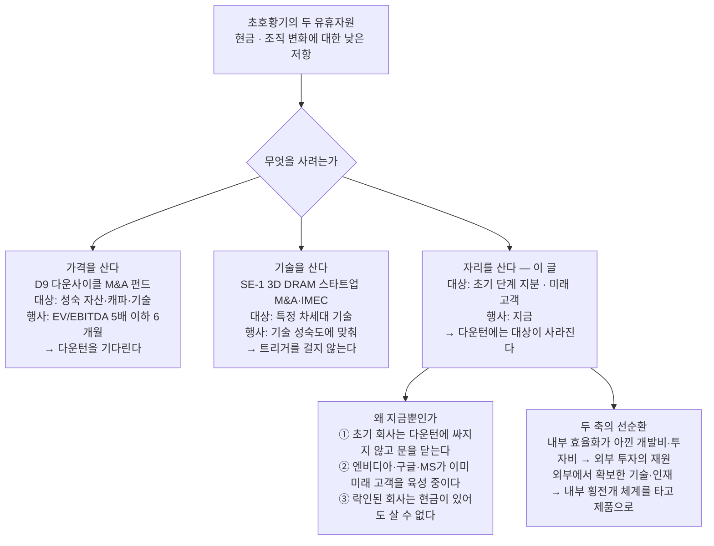

# 지금만 살 수 있는 것

### 초호황기 자본으로 미래 기술과 고객을 락인한다 — 오픈이노베이션 전략

---

공통편은 호황이 전략을 심는 계절이라고 했다[5]. 그 명제가 가장 문자 그대로 성립하는 영역이 여기다. 이 글이 다루는 것은 사업부 밖에 있는 기술과, 아직 고객이 아닌 회사들이다.

자원배분의 관점에서 지금 설계해야 할 축은 둘이다. 하나는 이미 사내에 축적된 기술·설비·인력을 빠르게 재조합해 개발을 가속하는 일이고, 다른 하나는 초호황기의 현금으로 중장기에 필요한 기술과 고객사를 확보하는 일이다[1]. 앞의 축은 별도 문서가 맡는다 — 횡전개 인센티브와 파견 처우, 본딩 공통기술 조직과 전용 모듈 팹은 전략 1의 실행 영역으로 들어가 있다[2]. 이 글은 뒤의 축만 다룬다.

두 축은 별개가 아니다. 내부 효율화로 아낀 개발 시간과 투자비가 외부 투자의 재원이 되고, 외부에서 확보한 기술과 인재는 내부의 횡전개 체계를 타고 제품으로 들어온다[1]. 하나는 재원을 만들고 다른 하나는 그 재원이 갈 곳을 만든다.

## 1. 왜 하필 지금인가

호황은 두 종류의 유휴자원을 만든다. 첫째는 현금이다. 회수 기간이 긴 투자에 나설 수 있는 시점은 실적이 좋을 때뿐이다. 둘째는 조직의 여유다. 회사가 잘될 때는 조직을 새로 만들거나 사람을 옮기는 일에 대한 저항이 가장 낮고, 같은 개편안이 적자 국면에서는 구조조정으로 읽힌다[1].

여기서 우리 전략 체계와 정면으로 부딪히는 것처럼 보이는 지점이 있다. 우리는 이미 **다운사이클 M&A 펀드**를 갖고 있다 — 자산 가격이 폭락해 EV/EBITDA 5배 이하가 6개월 지속되면 5,000억 원을 행사하는 구조이고, 실물옵션의 언어로는 가장 우아한 콜옵션이다[3]. 그 원칙은 "싸질 때까지 기다린다"이다. 그런데 이 글은 가장 비쌀 때 사자고 말한다.

모순이 아니다. **대상이 다르다.** 다운사이클 M&A가 겨냥하는 것은 가격 기회다 — 성숙한 자산과 캐파와 기술을 남들이 팔아야 할 때 사는 것이고, 그 대상은 다운턴에 실제로 싸진다. 이 글이 겨냥하는 것은 접근권과 관계다. 그리고 초기 단계의 회사는 **다운턴에 싸지지 않는다. 사라진다.** 자금 조달이 끊기면 밸류에이션이 내려가는 것이 아니라 회사가 문을 닫는다. 더 결정적인 것은 그 전에 일어나는 일이다 — 엔비디아와 구글과 마이크로소프트가 이미 스타트업 투자로 미래 고객을 직접 육성하고 있고[1], 그들이 락인한 회사는 우리가 현금을 들고 가도 살 수 없다. 다운턴에 열리는 것은 **가격**의 창이고, 지금 열려 있는 것은 **자리**의 창이다.

같은 구분이 우리 위키 안에도 이미 있다. 3D DRAM 스타트업 두세 곳을 인수하고 IMEC과 공동 연구를 하겠다는 전략은 다운턴 트리거를 걸지 않았다 — 기술 획득에는 때가 있기 때문이다[4]. 이 글은 그 논리를 분야만 넓혀 적용한다.

*도식 1. 세 개의 투자 전략은 경쟁하지 않는다 — 겨냥하는 것이 각각 가격·기술·자리이고, 그래서 행사 시점도 다르다.*

## 2. 두 개의 시계

투자 대상은 회수 시계로 갈린다. 하나는 지금 당장 팔리는 시장이고, 다른 하나는 아직 시장이 없는 곳이다. 둘을 같은 기준으로 심사하면 뒤의 것이 항상 진다.

*표 1. 두 분야는 성격과 회수 시계가 달라 심사 기준을 분리해야 한다.*

| 분야 | 우선순위 | 성격 | 투자 형태 | 회수 시계 |
|---|---|---|---|---|
| **저전력 반도체 (엣지 AI)** | ★★★ 즉시 실행 | 제품 차별화 — 지금 팔리는 시장 | 지분투자 → 전략적 M&A | 2~4년 |
| **퀀텀 컴퓨팅 생태계 · 극저온 메모리** | ★★☆ 장기 베팅 | 신시장 선점 — 아직 시장이 없다 | 분산 소액 투자 + 공동 R&D | 7~10년 이상 |

## 3. 저전력 반도체 — 지금 실행한다

이 분야를 먼저 두는 이유는 제품 시너지가 가장 명확하기 때문이다.

AI가 클라우드에서 엣지로 확산되면서 전력 효율 자체가 제품의 차별화 요소가 되고 있고, 이 시장은 우리의 LPDDR과 온디바이스 낸드에 직접 결합된다[1]. 회사가 이미 온디바이스 AI를 겨냥한 메모리 로드맵을 발표한 방향과도 일치한다. 그리고 아키텍처가 디지털 NPU와 아날로그 인메모리 컴퓨팅 등으로 갈라져 있어 한 곳에 몰지 않고 나눠 거는 것이 유효하다.

후보로 검토할 만한 곳은 다섯이다. 네덜란드의 **Axelera AI**는 저전력 엣지 추론칩으로 누적 4억 5,000만 달러를 조달한 유럽 최대 규모이고, 미국의 **Efficient Computer**는 범용 초저전력 프로세서로 6,000만 달러 시리즈 A를 받았다. 프린스턴 스핀오프인 **EnCharge AI**는 아날로그 인메모리 컴퓨팅으로 1억 달러 시리즈 B를 조달했고, 캐나다의 **Blumind**는 상시 구동 올아날로그 저전력 칩을, 일본의 **EdgeCortix**는 엣지용 에너지 효율 AI 프로세싱을 한다 — 마지막 하나는 아시아 생태계 접근성이라는 별도의 값이 있다[1].

권장하는 경로는 지분투자에서 시작해 실제 메모리 번들링 파트너십으로 전환하고, 유망한 곳은 전략적 M&A까지 검토하는 것이다. 지분만으로는 관계가 만들어지지 않는다 — 우리 LPDDR과 저들의 가속기가 한 보드 위에서 검증되는 단계까지 가야 투자가 제품이 된다.

## 4. 퀀텀과 극저온 메모리 — 장기 옵션으로 건다

이쪽은 회수를 기대하고 넣는 돈이 아니다. 표준이 정해지는 자리에 앉기 위한 입장료다.

플레이북은 이미 검증돼 있다. 엔비디아와 구글과 마이크로소프트, 블랙록이 스타트업 투자로 미래 고객을 직접 육성하는 전략을 실행 중이고, 관련 벤처 투자액은 2025년 39억 달러로 역대 최고를 기록했다[1]. 다만 한 가지를 조심해야 한다. 양자 하드웨어는 초전도·이온트랩·광자·중성원자·실리콘스핀으로 모달리티가 아직 갈리지 않았다. 어느 쪽이 이길지 모르는 국면에서 한 곳에 집중하는 것은 베팅이지 옵션이 아니다. **분산이 이 투자의 전제다.**

우리 자산과 가장 크게 만나는 곳은 실리콘스핀 계열이다. 호주의 **Diraq**은 300mm CMOS 공정과 호환되는 방식이라 우리 팹과의 시너지가 가장 크다. 나머지는 모달리티를 나누기 위한 포지션이다 — 핀란드의 **IQM**은 초전도로 13개 고객사에 15기를 설치한 상용 트랙 레코드가 있고, 미국의 **QuEra Computing**은 중성원자로 96개 검증 논리 큐비트를 네이처에 실으며 가장 빠르게 확장 중이며, **PsiQuantum**은 광자 방식으로 반도체 표준 공정 제조를 논거로 삼아 포트폴리오 헤지에 맞고, 2026년 나스닥 상장을 앞둔 **Quantinuum**은 이온트랩 진영의 앵커이자 가장 낮은 위험 포지션이다[1].

극저온 메모리와 제어 전자는 성격이 다르다. 여기는 고객 육성이 아니라 기술 커플링이 목적이고, 아직 상용 수요가 없는 연구 인프라 단계다 — 투자해서 매출이 나오는 구조가 아니라 공동 R&D로 표준을 선점하는 긴 호흡의 게임이다[1]. 가장 성숙한 곳은 3,000만 달러 이상을 조달하고 머크·영국 NQCC와 파트너십을 맺은 미국의 **SEEQC**이고, 영국의 **sureCore**는 이름 그대로 극저온용 임베디드 메모리 IP를 한다. 네덜란드의 **FrostByte**(TU델프트·QuTech 스핀오프)와 스위스의 **Rhonexum**(EPFL 스핀오프)은 프리시드 단계라 소액 옵션으로 적합하다[1].

실행은 벤처투자 조직을 통한 시리즈 A~B급 분산 소액 투자로 시작하고, 실리콘스핀 진영과는 공동 R&D와 파운드리 파트너십을 병행한다. 이 구조는 우리 전략 체계에 이미 이름이 있다 — 프리미엄만 내고 상방을 사는 콜옵션이고, HBM 이후의 패러다임 전환 시나리오에 대한 보험이다[3].

*표 2. 후보군 — 저전력은 제품 결합, 퀀텀은 모달리티 분산, 극저온은 기술 커플링이라는 서로 다른 목적을 갖는다.*

| 목적 | 후보 | 국가 | 특징 |
|---|---|---|---|
| **제품 결합** (엣지 AI) | Axelera AI | 네덜란드 | 저전력 엣지 추론칩, 누적 4.5억 달러 조달 — 유럽 최대 |
| | Efficient Computer | 미국 | 범용 초저전력 프로세서, 6,000만 달러 시리즈 A |
| | EnCharge AI | 미국 | 아날로그 인메모리 컴퓨팅, 프린스턴 스핀오프, 1억 달러 시리즈 B |
| | Blumind | 캐나다 | 상시 구동 올아날로그 저전력 칩 |
| | EdgeCortix | 일본 | 엣지용 에너지 효율 AI 프로세싱 — 아시아 생태계 접근성 |
| **모달리티 분산** (미래 고객 육성) | Diraq | 호주 | 실리콘스핀 — 300mm CMOS 호환, 우리 팹 시너지 최대 |
| | IQM | 핀란드 | 초전도 — 13개 고객사 15기 설치, 상용 트랙 레코드 |
| | QuEra Computing | 미국 | 중성원자 — 96개 검증 논리 큐비트, 가장 빠른 확장 |
| | PsiQuantum | 미국 | 광자 — 반도체 표준 공정 제조, 헤지 포지션 |
| | Quantinuum | 미국·영국 | 이온트랩 — 2026년 나스닥 상장, 앵커·저위험 |
| **기술 커플링** (극저온 메모리·제어) | SEEQC | 미국 | SFQ 디지털 로직, 3,000만 달러 이상 — 가장 성숙 |
| | sureCore | 영국 | 극저온용 임베디드 메모리 IP — 메모리 특화 |
| | FrostByte | 네덜란드 | TU델프트·QuTech 스핀오프, 프리시드 |
| | Rhonexum | 스위스 | EPFL 스핀오프, 프리시드 — 옵션형 소액 |

*후보 기업의 조달액·트랙 레코드는 사내 자료의 조사 결과이며 별도 실사로 검증하지 않았다[1].*

## 5. 실행의 세 가지 원칙

**첫째, 락인되지 않은 곳을 먼저 본다.** 두 분야 공통이다. 대형 플레이어에게 이미 묶인 회사는 지분을 얻어도 의미 있는 관계가 되지 않는다. 초기에서 중기 단계에 있고 아직 진영이 정해지지 않은 곳이 실질적인 대상이다[1].

**둘째, 자본 배분에 상한을 건다.** 퀀텀과 극저온은 전체 오픈이노베이션 재원의 5~10% 수준으로 묶는다[1]. 회수 시계가 7~10년 이상인 투자를 그 이상으로 키우면 옵션이 아니라 베팅이 된다.

**셋째, 심사 기준을 시계별로 분리한다.** 이것이 조직의 문제다. 2~4년 회수를 전제로 만든 투자 심사 기준을 7~10년짜리에 적용하면 뒤의 것은 매년 부결된다. 여기에 인사 기능의 역할이 있다 — 첫 번째 축이 인센티브 제도와 조직 개편과 파견 처우 기준을 다뤘다면, 이 축에서 필요한 것은 **투자와 파트너십을 다룰 줄 아는 인력을 기르고 외부와 교류하는 제도를 만드는 일**이다[1]. 지분을 사는 일과 그 지분을 제품으로 바꾸는 일은 다른 능력이고, 우리에게 부족한 것은 뒤쪽이다.

## 6. 남겨 두는 것

이 제안이 지금 답하지 못하는 것을 적어 둔다. 후보 기업들의 조달액과 기술 성숙도는 사내 조사 결과이지 실사가 아니다. 투자 규모의 절대값도 정하지 않았다 — 전체 재원의 규모가 정해져야 5~10%라는 비율이 숫자가 된다. 그리고 가장 중요한 것 하나, 우리가 이 회사들에게 매력적인 투자자인가는 검증되지 않았다. 엔비디아가 주는 것은 돈만이 아니라 생태계이고, 우리가 그에 대응해 줄 수 있는 것 — 메모리 우선 공급, 파운드리 접근, 공동 검증 환경 — 을 패키지로 정의하는 일이 첫 실행 항목이다.

호황은 현금을 준다. 그러나 현금은 어디에나 있고, 자리는 한 번 차면 비지 않는다.

---

## 참고자료

- [1] 자원배분 두 축 — 인사·조직·보상 관점(사내 자료, 2026-08-12): sources/raw-notes/hr-org-open-innovation-note-2026-08-12.md. 후보 기업의 조달액·모달리티·트랙 레코드, 퀀텀 VC 투자액 2025년 39억 달러, 자본 배분 5~10% 권고는 모두 이 자료의 조사 결과이며 외부 실사·검증은 하지 않았다
- [2] 2차 저지선 전략 1번 「전환할 수 있는 몸」 — Axis 1(내부 역량 효율화)의 실행 영역: 횡전개 인센티브 펀드, 파견 인력 전략적 처우, 본딩 공통기술 개발조직과 전용 모듈 팹: outputs/storyline/mfg-fungibility-proposal.md
- [3] D9 다운사이클 M&A 펀드(EV/EBITDA 5배 이하 6개월 지속 트리거·5,000억 원)와 콜옵션 구조·시나리오 E 헤지: wiki/scenarios/strategy.md · wiki/storyline/storyline-real-options.md · wiki/scenarios/scenario-E.md
- [4] SE-1 — 3D DRAM 전담 조직·IMEC 공동연구·스타트업 2~3개 M&A(5,000억 원 펀드): wiki/strategies/core/current-state-se1-3d-dram-imec-ma.md
- [5] 공통편 「호황은 전략을 심는 계절이다」 — 3중 저지선과 "심을 수 있는 계절" 명제: outputs/storyline/common-overview.md

*이 문서는 자원배분 두 축 중 Axis 2만 다룬다. Axis 1(내부 역량 효율화 — 횡전개 인센티브·파견 처우·본딩 조직 편제)은 전략 1에 실행 영역으로 병합했다[2]. 기존 M&A 전략(D9·SE-1)과의 관계는 §1에서 정리했으며, 세 전략은 겨냥하는 대상(가격·기술·자리)이 달라 경쟁하지 않는다.*
