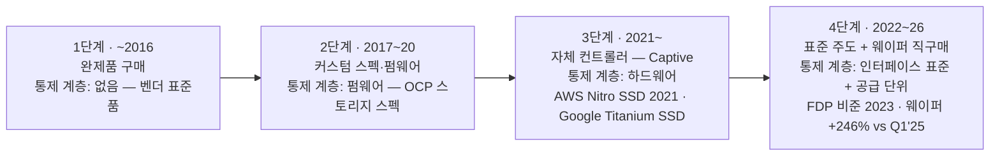
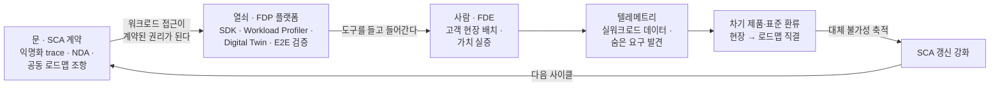

# SSD의 CUDA — 하드웨어를 지키는 소프트웨어

### Captive의 물결 위에서 다음 다운턴을 준비하는 SSD 사업 제안 (5~7장)

---

공통편의 결론은 이렇다. 수주사업화라는 1차 저지선은 물량의 바닥을 지키지만, 완제품의 부가가치(2차)와 만기 이후의 갱신(3차)은 지키지 못한다. 그래서 다음 다운턴 전에 풀어야 할 문제는 셋이었다 — 계약 바닥 아래에 둘 힘, 다운턴 중 태어날 새 게임의 선점, 그리고 캐파·원가가 아닌 차별화 축. 이 글은 그 세 문제에 대한 SSD 사업의 답이다. 답의 뼈대를 먼저 말하면, 문(SCA)과 열쇠(FDP)와 사람(FDE), 그리고 그 셋을 하나의 사업 모델로 묶는 CUDA의 교훈이다. 소프트웨어를 팔자는 제안이 아니다 — 소프트웨어로 하드웨어를 지키자는 제안이다.

> **용어** — SCA(Strategic Customer Agreement): 물량·가격 약정 위에 공동설계·운영 통합·자본 연계까지 얹은 전략 고객 계약(공통편 4장). / FDE(Forward Deployed Engineer): 고객사 환경에 상주하며 제품 가치를 현장에서 실증·통합하는 엔지니어.

## 5. Captive의 물결 위에서 — SSD 사업의 대응 전략

### 5.1 진단 — 고객은 통제권을 원한다, 그리고 이미 가져가고 있다

하이퍼스케일러의 스토리지 통제권 상승은 사이클이 아니라 구조이고, 그 방향은 10년째 한쪽이다.

기업용 SSD는 낸드 사업의 주전장이다 — "엔터프라이즈 SSD에 목숨 걸고 신나게 하는 거고"라는 것이 영업 리더의 표현이다[1]. 그런데 이 주전장의 수요는 소수가 지배한다. 하이퍼스케일러가 전 세계 기업용 SSD의 55~65%를 소비하고, 공급 부족 국면에서는 이들의 개방형 구매 약정이 가격을 묻지 않고 물량을 흡수한다[2][3]. 규칙은 그들이 정한다.

그들이 원하는 것은 통제권이고, 통제권의 이동은 통계보다 이정표로 선명하게 확인된다. 2017년 이후 OCP 스펙과 고객별 펌웨어 관행으로 펌웨어 계층이 넘어갔다. 2021년 말 AWS가 자체 컨트롤러의 Nitro SSD를 내놓으며 하드웨어 계층까지 내려갔다 — "크라운 주얼은 만들고, 스테이플은 산다"는 그들의 원칙 그대로다[3]. 2023년에는 표준 그 자체를 고객이 설계했다. NVMe의 데이터 배치 표준 FDP는 메타와 구글이 각자 WAF 문제를 풀다 합류하고 삼성이 함께 완성해 6개월 만에 비준한, 고객이 설계한 표준이다[3][4]. 삼성은 이 표준의 공동 주도자다 — 비준 이후 백서와 기술 블로그를 함께 낸, 흐름의 피해자가 아니라 설계 참여자의 위치다[3]. 그리고 지금은 구매 단위가 완제품 아래로 내려간다. 낸드 웨이퍼 다년 계약가가 2025년 1분기 대비 246% 뛰었는데도 직구매가 계속된다는 것은, 컨트롤러와 펌웨어의 부가가치를 자기 손으로 가져가겠다는 의지의 가격표다[3].

> **용어** — FDP(Flexible Data Placement): 호스트가 데이터의 수명·그룹을 지정해 SSD 내 배치(RU/RUH 단위)를 통제하게 하는 NVMe 표준(TP4146). / WAF(Write Amplification Factor): 호스트 쓰기 대비 낸드 실제 쓰기의 배율 — 수명·전력·성능을 갉아먹는 핵심 지표.

*도식 3. 고객 통제권은 완제품→펌웨어→컨트롤러→표준·웨이퍼로 10년간 일방향 상승했다 — 이 흐름은 되돌릴 수 없고, 남은 선택은 흐름 위에서 부가가치를 재정의하는 것이다.*

이 사슬의 끝을 가장 잘 보여 주는 고객이 구글이다. 구글은 FDP의 공동 설계자다. OCP 글로벌 서밋에서 구글의 소프트웨어 아키텍트 크리스 사볼(Chris Sabol)은 메타와 나란히 서서 이렇게 말했다. "쓰기는 SSD 동작 중 가장 전력 집약적인 부분이다. 필요량의 2.5배를 쓰면 전력 한계(power envelope)에 훨씬 빨리 도달한다."[4] 같은 구글이 자체 설계 SSD도 배포한다. 자체 Axion CPU 기반 C4A 인스턴스와 함께 GA된 "custom-designed" 타이타늄(Titanium) SSD는 전용 오프로드 프로세서로 호스트에 연결되어 랜덤 읽기 240만 IOPS를 내고, 이전 세대 대비 접근 지연을 35% 줄이며, C4A를 시작으로 신규 머신 시리즈에 실리고 있다[4](드라이브 공급 구조 — 완전 자체 설계인지, 벤더 제조 드라이브에 구글의 오프로드 통합인지 — 는 사내 확인 후 보강). 표준을 설계하는 손과 캡티브를 만드는 손이 같은 몸에 달려 있다. 이중 트랙이다.

여기서 읽어야 할 것은 위협의 크기가 아니라 표준 게임의 크기다. 타이타늄은 로컬 SSD 라인에 한정된 1세대이고, 같은 기간 하이퍼스케일러들은 한 분기에 80% 뛴 계약가를 감수하며 표준 드라이브의 대량 구매를 계속했다[2][3]. 캡티브 비중의 공식 통계는 공개되어 있지 않지만, 플릿의 대부분은 여전히 표준 드라이브다 — 그리고 그 표준 플릿의 규격이 바로 고객이 직접 설계한 FDP다. 승부처는 캡티브의 저지가 아니라, 표준 플릿 안에서 대체되지 않는 자리다.

통제권 상승의 동인을 분해하면 대응 수단이 갈린다. TCO — WAF·전력·수명 — 는 표준과 소프트웨어로 풀 수 있는 문제다. 공급 안보는 계약으로 푼다. 보안·수직 통합은 자체 실리콘의 영역이라 뺏어 올 수 없다. 남는 하나, 워크로드 최적화가 본 전략의 표적이다. 이 분해가 중요한 까닭은 캡티브를 하나의 위협으로 뭉뚱그리면 대응도 뭉뚱그려지기 때문이다 — 네 동인 중 셋은 계약과 표준이 이미 다루고 있거나 우리 손을 떠났고, 승부가 열려 있는 것은 넷째뿐이다.

그 표적에서 지금 새 게임이 개막하고 있다. KV Cache다. 장문맥·에이전트 추론이 GPU 메모리를 소진하면서, 한 번 계산한 컨텍스트를 버리지 않고 SSD로 내려 두는 계층화가 추론 인프라의 표준 아키텍처로 자리 잡는 중이다. NVMe 오프로드만으로 H100 한 장의 동시 사용자를 10배로 늘렸다는 실증 보고가 나왔고[5], 엔비디아는 SSD 상주 KV 캐시를 컨텍스트 메모리 주소 공간에 편입하는 CMX를 발표하며 장문맥 처리량과 전력 효율을 각각 최대 5배로 제시했다 — 기반 칩 BlueField-4는 2026년 하반기 출하가 예고돼 있다[6]. 소프트웨어 생태계는 더 빠르다. 엔비디아 Dynamo가 GPU 메모리에서 SSD까지의 오프로딩 계층을 프레임워크로 정의했고, 오픈소스 LMCache는 올해 3월 Dynamo 1.0과 공식 통합됐으며, Mooncake는 클러스터의 유휴 CPU·DRAM·SSD를 묶은 분리형 KV 캐시 풀을 제시한다[5]. SSD가 저장 장치에서 추론 파이프라인의 성능 부품으로 이동하는 것이다. 그리고 KV 캐시 블록은 수명·재사용·퇴거 패턴이 명확하다 — 데이터 수명을 태깅하는 FDP와 자연스럽게 맞물린다(분석적 관찰이다)[5].

> **용어** — KV Cache: LLM 추론에서 이미 처리한 토큰의 중간 계산 결과(Key/Value)를 저장해 재계산을 피하는 캐시. 장문맥일수록 커져 GPU 메모리 밖 계층화가 필요해진다.

기시감이 있다. HBM이 그랬듯 이 생태계의 공동개발 슬롯도 선착순이다. 엔비디아의 AI SSD 트랙에서 마이크론이 첫 레퍼런스 지위를 가져갔고, SK하이닉스는 1억 IOPS급 AI-N P를 2026~27년, 키옥시아도 같은 급을 2027년 목표로 공동 개발 중이다[6]. 삼성이 밖에 있는 것은 아니다 — PM1753(순차 읽기 14.5 GB/s)은 CMX의 첫 공식 공급 SSD로 확정됐고, PM1763은 베라 루빈의 메인 스토리지로 시연됐다[6]. 그러나 전용 AI SSD 로드맵은 아직 공개되지 않은 후발이며, 실행의 시간 창은 경쟁사의 1억 IOPS 제품이 예고된 2027년 이전까지다. 진단의 결론은 이것이다. 통제권의 물결은 막을 수 없고, 표준 게임은 실재하며 크고, 그 위에서 새 게임이 열리고 있는데, 창은 좁다.

### 5.2 선택지 — 세 갈래 길

이 진단 앞에서 길은 셋이고, 둘은 막다른 길이다.

첫째 길은 하던 대로다 — 잘 만든 기성품에 집중한다. 지금 시황은 이 길을 지지하는 것처럼 보인다. 계약가가 분기에 80% 뛰고 재고가 사상 최저인, 만들면 팔리는 시장이니까[2]. 그러나 쇼티지는 사이클이고 통제권 상승은 구조다. 쇼티지가 걷히는 순간 기성품은 다시 스펙 시트와 가격으로 비교당하는 제품이 되고, 완제품 마진부터 걷혀 나가며, 그때는 심을 시간이 없다. 지금이 전략을 심을 수 있는 유일한 계절이라는 것 — 1안을 기각하는 이유이자, 이 제안서가 호황의 한복판에 쓰인 이유다.

둘째 길은 전면 수용이다 — 고객마다 풀커스텀으로 만들어 준다. 제품과 펌웨어가 고객 수만큼 갈라지고, 브랜치가 늘수록 검증 부담은 곱으로 늘어 R&D가 발산한다. 무엇보다 우리에게는 아직 이 장사의 체질이 없다. 커스텀은 소싱과 계약의 방법부터 파운드리 모델에 가까운데, 그 계약 체질 없이 치른 수업료에 대한 조직의 증언이 있다. "프로젝트가 스톱될 수는 있어요. 근데 이거에 대한 임팩트가 적어야 되는데 우리가 거기 따른 코스트는 다 먹은 거죠. 스타트는 뭔가 보상을 받아야 되는데 보상은 컨트랙 베이스로 돼 있어야 하는데, 그거 없이 의지로만 갔고 배우면서 했던 상황."[7]

셋째 길이 답이다 — 표준화된 유연성. FDP 표준 기성품 위에 소프트웨어 플랫폼을 얹는다. 단서가 하나 붙는다. FDP SSD를 파는 것만으로는 차별화가 아니다. 마이크론은 실워크로드 측정 결과를 공개했고, 키옥시아는 OCP에서 RocksDB 구동을 시연했으며, 머천트 컨트롤러 벤더까지 FDP를 지원해 중소 메이커도 탑재할 수 있다[4]. 표준의 보급은 우리가 함께 주도했지만, 보급된 표준은 누구의 것도 아니다. FDP만 있으면 우리는 "FDP를 지원하는 여러 공급사 중 하나"다. 차별화는 표준 위 계층 — 워크로드를 아는 시스템 소프트웨어와 현장의 엔지니어링 — 에서만 성립한다. 선택의 논리는 한 줄이다. 고객이 가져간 계층 아래(웨이퍼)가 아니라, 고객이 아직 풀지 못한 계층 위(워크로드↔정책 변환)에서 부가가치를 만든다[8]. 이 선택은 고객의 이해와도 정렬된다 — 고객이 FDP를 만든 이유가 벤더 종속 없는 데이터 배치 통제였고, 3안은 그 통제권을 존중하면서 부가가치를 재정의하는 유일한 길이다.

*표 2. 세 갈래 길의 비교 — 무시(1안)도 전면 수용(2안)도 아닌 표준 위의 소프트웨어(3안)만이 네 기준을 동시에 충족한다.*

| 선택지 | 부가가치 방어 | 파편화 방지 | 통제권 흐름과의 정합 | 차별화 지속성 | 판정 |
|---|---|---|---|---|---|
| 1안 · 하던 대로 (기성품 집중) | ✕ 호황 종료 시 완제품 마진부터 침식 | ◎ 단일 기성품 (현상 유지) | ✕ 쇼티지는 사이클, 통제권 상승은 구조 — 구조를 무시 | ✕ 가격·캐파 경쟁 회귀 | 기각 — 지금이 전략을 심을 유일한 계절 |
| 2안 · 전면 수용 (풀커스텀) | △ 보상 계약 없이 코스트를 흡수한 체질 (사내 1차 확인) | ✕ 고객별 제품·펌웨어 파편화 · R&D 발산 | △ 수용은 하나 커스텀 소싱·컨트랙 체질 부재 | △ 특정 고객 전속 — 확장 불가 | 기각 — R&D 발산 + 조직 적합성 |
| 3안 · 표준화된 유연성 (FDP 표준 + 플랫폼) | ◎ 표준 위 SW·검증 계층에서 재정의 | ◎ 공통 펌웨어 + 워크로드 프로파일 | ◎ 고객이 설계한 표준(FDP)을 수용 | ◎ 디바이스를 아는 자만 만드는 도구·현장 계층 — 단 FDP SSD 단독으론 "여러 공급사 중 하나", 플랫폼이 조건 | 채택 — 유일하게 전 기준 동시 충족 |

### 5.3 실행 — 문, 열쇠, 사람

실행의 구조는 세 단어다. SCA가 문을 열고, FDP가 공용어가 되며, FDE가 들어간다.

**문은 SCA다.** 물량과 가격만 있던 Binding 계약에 기술협력을 내재화한다. 고객은 물량과 함께 익명화된 워크로드 trace, qualification 일정, 공동 로드맵 참여를 약정하고, 삼성은 공급능력과 함께 SDK, 그리고 WAF·수명 개선 목표를 약정한다[8]. 이 조항 하나로 일의 성격이 바뀐다 — FDE의 워크로드 접근이 부탁이 아니라 계약된 권리가 되고, 영업의 언어와 개발의 언어가 같은 문서에서 만난다. 고객 데이터가 오가는 만큼 NDA·클린룸·trace 익명화의 거버넌스도 계약 안에 함께 설계한다. 여기까지는 제안(To-Be)이다 — 물량 계약을 공동 플랫폼 계약으로 격상하자는 것이며, 1차 저지선의 문서에 3차 저지선의 조항을 심는 일이다.

**열쇠는 FDP 플랫폼이다.** 표준단체 백서는 FDP의 잠재 효과로 오버프로비저닝 28% 제거, 같은 쓰기 밀도에서 용량·수명·쓰기 속도 2배를 제시한다[4]. 그러나 그 효과는 저절로 나오지 않는다. 어떤 데이터가 뜨겁고, 무엇이 함께 지워지고, 어느 I/O가 지연에 민감한지를 SSD는 스스로 알 수 없다 — 그 정보는 전부 DB·캐시·파일시스템 같은 상위 소프트웨어에 있다[8]. 그래서 인터페이스와 워크로드 사이를 잇는 계층을 우리가 만든다. Linux·io_uring·SPDK와 연동되는 SDK와 공통 라이브러리, RocksDB·CacheLib·Ceph에서 vLLM/Dynamo 백엔드까지 잇는 워크로드 플러그인, 고객 trace를 분석해 추천 정책과 예상 WAF를 뽑는 Workload Profiler, 대규모 도입 전에 효과를 예측하는 Digital Twin, 그리고 WAF·테일 지연·격리·전력·qualification 기간까지 재는 엔드투엔드 공동검증이다[8]. 고객마다 펌웨어를 새로 파는 대신, 캐시·KV·데이터베이스·멀티테넌트·벡터·체크포인트·QLC의 표준 워크로드 프로파일을 검증된 호스트 설정으로 제공한다 — 펌웨어 공통화와 고객별 최적화는 이렇게 양립한다[8].

포지셔닝은 명확히 한다. 오케스트레이션 계층 — 엔비디아 Dynamo, LMCache, CacheLib — 과 경쟁하지 않는다. 그들이 호출하는 최적의 FDP 백엔드가 되고, 디바이스를 아는 자만 만들 수 있는 것들 — 낸드와 FTL의 동작 모델, 정책 추천, 수명·지연 예측 — 로 그 아래 계층을 소유한다[5][8]. 기본 라이브러리와 표준 연동은 공개해 락인 우려를 지우고, 차별화는 모델과 도구에 남긴다[8]. 저계층 소프트웨어의 힘은 사내 선례가 이미 증명했다. 펌웨어와 드라이버를 통합 최적화한 SmartSSD는 스캔 중심 DB 쿼리의 처리 시간을 절반 이하로, 에너지를 최대 70%, CPU 부담을 최대 97%까지 줄였다[10]. 문제는 이런 자산이 무상 번들로 흩어져 있어 사업 구조에 연결되지 않았다는 것 — 플랫폼은 그 자산들을 한 몸으로 묶는 그릇이다[10].

**사람은 FDE다.** 팔란티어가 10여 년 전 창안한 전진 배치 엔지니어 — 고객 시스템 안에 상주하며 "한 명의 고객, 많은 능력"의 원칙으로 일하고, 청구 시간이 아니라 성과로 평가받는 역할 — 는 앤스로픽과 OpenAI가 엔터프라이즈 전략으로 채택하며 산업 표준이 되어 가고 있다. OpenAI는 2025년 초 두 명으로 FDE 팀을 만들어 열 명 이상으로 키웠다[9]. 우리에게 필요한 것은 이 모델의 제조업 번역이다. 메모리는 물리적 제조 리드타임이 길므로, 현장 상주에 시스템 아키텍트와 성능·파워 모델링 역량을 결합해야 유효하다[9]. FDE가 현장에서 하는 일의 핵심은 고객이 명시한 요구와 실제 요구 사이의 간극을 발견하는 것이고, 그 발견이 차기 제품과 표준 제안으로 직결되는 환류 채널을 만든다[9]. 고객 워크로드가 제품 개발의 후반에 들어오는 것이 아니라 컨트롤러·펌웨어 설계의 초기부터 반영되게 하는 것 — 현장이 로드맵을 쓰게 하는 것이 세 번째 요소다.

*도식 4. SCA가 문을 열고, FDP 플랫폼이 열쇠가 되며, FDE가 들어간다 — 현장 텔레메트리가 차기 제품·표준으로 환류되어 SCA 갱신을 강화하는 순환이 대체 불가성을 축적한다.*

이 플랫폼으로 돈을 어떻게 버는가. 사다리는 3단이고, 1단이 본질이다. 1차 수익화는 CUDA 모델이다. 소프트웨어는 무료로 제공하고, 가치는 하드웨어의 점유·마진·가격 결정력으로 회수한다. 엔비디아는 CUDA를 팔지 않는다 — 그러나 CUDA 때문에 GPU가 팔리고, 그 위에 쌓인 솔루션 소프트웨어는 이미 핵심 수익원으로 자랐다[10]. 무료로 시작한 소프트웨어가 먼저 하드웨어를 팔고, 성숙한 뒤에야 스스로 수익원이 되는 순서 — 우리의 사다리가 따를 순서이기도 하다. 같은 원리로 FDP Enable은 전 제품 기본 탑재·무료다. 고객이 설계한 표준을 인질로 잡는 순간 표준 공동 주도자의 신뢰가 무너지기 때문이기도 하다. 2차는 계약 프리미엄이다. 플랫폼 지원 패키지를 SCA에 묶어 계약 조건 — 가격 프리미엄과 물량 우선권 — 으로 회수한다. 하이퍼스케일러는 벤더 소프트웨어를 사지 않지만, 계약 조건은 받아들인다. 청구서의 형태만 다를 뿐, 임베디드 소프트웨어 사업이 번들 단가와 맞춤 개발비로 값을 받아 온 문법의 계약 버전이다[10]. 3차는 성과 연동 과금이다. WAF·TCO 개선을 실측으로 입증한 뒤에만 여는 업사이드 옵션이며, 계획의 전제로 삼지 않는다.

지표도 이 사다리에 맞춘다. 세어야 할 것은 FDP 지원 SSD의 출하량이 아니라 고객 시스템에서 FDP가 실제 활성화된 용량이다 — 지원 출하량만 세면 쓰이지 않는 기능이 된다. 이 지표는 기준치 0에서 출발하는 신규 계기판이며, 고객의 캡티브 계획에서 삼성 완제품으로 전환된 물량을 함께 잰다[8]. 계기판 하나로 조직의 시선이 바뀐다 — 출하가 아니라 활성화를 세는 순간, 성공의 정의가 "팔았다"에서 "고객 시스템에 박혔다"로 이동한다. 로드맵은 네 걸음이다. 제품과 기본 도구, 전략 고객 2~3사 공동검증, SCA 내재화를 통한 상용 플랫폼화, 그리고 QoS·전력·텔레메트리로의 Host Control 확장[8].

마지막으로 이 장의 결론인 다운턴 방어 논리다. 계약은 물량을 지키고, 통합은 갱신을 지킨다. 다운턴에 계약 조건은 재협상되지만, 아키텍처에 박힌 통합은 재협상되지 않는다. 고객 시스템에 우리의 SDK가 깔리고, 우리의 프로파일로 워크로드가 튜닝되고, 우리의 FDE가 그 곁에 있는 상태에서 공급자를 바꾸는 일은 가격표의 비교가 아니라 아키텍처의 재공사가 된다. 그리고 소프트웨어의 가치는 역주기적이다 — 불황은 고객이 비용절감 모드로 전환하는 시간이고, WAF와 TCO를 줄여 주는 소프트웨어의 수요는 그때 가장 커진다[10]. 저계층 소프트웨어 자산은 낸드 세대가 바뀌어도 이전된다 — 다운턴을 건너 다음 사이클로 넘어가는 자산이다[10].

## 6. 이익의 크기 — 방어, 전환, 새 매출

삼성은 이 시장의 도전자가 아니라 1위다. 2026년 1분기 기업용 SSD 매출 점유 38.2% — 직전 분기 33.8%에서 출렁임이 크므로 33.8~38.2%의 범위로 읽는 것이 안전하다[2]. 따라서 이 전략의 가치도 새로 얻을 것이 아니라 지킬 것, 되찾을 것, 새로 열 것의 합으로 계산해야 한다. 기준선은 무대응의 세계다 — 캡티브 침식이 진행되고 가격 경쟁으로 회귀한 반사실(counterfactual)과 전략 시나리오의 차이가 이 전략의 값이다.

모수부터. 2026년 1분기 상위 5사 매출은 184.6억 달러, 연환산 약 740억 달러다 — 단 한 분기에 80% 뛴 쇼티지 가격이 부풀린 수치이므로, 산정은 2027~28년의 가격 정상화를 명시적으로 반영한 세 경로로 한다. 기관의 중장기 전망은 보수 CAGR 15.5%에서 AI 스토리지 28%까지 벌어져 있고[2], 이를 브래킷 삼아 2027~31년 5년 누적 시장을 하단 2,500억, 기본 3,450억, 상단 4,620억 달러로 놓는다(경로 수치는 저자 구성 — 기본 경로의 2030년 770억 달러는 기관 보수 전망 660억과 실측 연환산 740억 사이에 놓인다). 이 중 하이퍼스케일러 소비가 55~65%다[2].

산정은 3층이다. 첫째 층은 방어 — 무대응 시 캡티브·자체화로 이탈했을 삼성 물량 중 전략이 지켜 내는 것. 둘째 층은 전환 — 경쟁사나 자체화로 갔을 캡티브 계획 물량이 삼성 완제품으로 회귀하는 것(핵심 KPI와 같은 지표다). 셋째 층은 신규 — SCA 프리미엄과 물량 우선권의 마진 효과이며, 소프트웨어 직접 과금은 공격 시나리오에만 소액으로 반영한다. 층의 구분은 중복 계산을 막는 장치이기도 하다 — 방어는 삼성 몫의 이탈 차단분만, 전환은 비삼성 몫의 회귀분만 센다. 캡티브 침투의 공식 통계가 없으므로 핵심 모수는 가정으로 두되, 세 시나리오의 브래킷으로 불확실성을 감싼다.

*표 3a. 산정 가정(다이얼) — 하이퍼스케일러 소비 비중 60%(범위 55~65%의 중심)와 삼성 몫 36%(점유 33.8~38.2%의 중심)는 3안 공통[2], 나머지는 저자 가정.*

| 가정 | 보수 | 기본 | 공격 |
|---|---|---|---|
| 시장 경로 (2027~31 누적) | 2,500억 달러 | 3,450억 달러 | 4,620억 달러 |
| 캡티브 위험 침투율 (2027→2031) | 5→15% | 8→25% | 10→35% |
| 무대응 침식률 → 전략 시 침식률 | 60→45% | 70→40% | 80→35% |
| 전환률 (비삼성 캡티브 계획 → 삼성 완제품) | 3% | 7% | 12% |
| SCA 커버리지 × 계약 프리미엄 | 20% × 0.5% | 35% × 1.5% | 50% × 2.5% |
| SW 직접 과금 | 0 | 0 | 5년 3억 달러 |

*표 3. 시나리오별 5년(2027~31) 누적 효과 — 3안 × 3층, 매출 환산.*

| 층 | 보수 | 기본 | 공격 |
|---|---|---|---|
| ① 방어 (무대응 대비 침식 차단) | 8억 달러 | **39억 달러** | 111억 달러 |
| ② 전환 (캡티브 계획 물량의 완제품 회귀) | 3억 | **16억** | 53억 |
| ③ 신규 (SCA 프리미엄 + 공격안만 직접 과금) | 1억 | **4억** | 15억 |
| **합계 (5년 누적)** | **12억** | **59억** | **179억** |
| (참고) 영업이익 환산 — 마진 25~35% 가정 | 3~4억 | 15~21억 | 45~63억 |

기본 시나리오에서 전략은 5년 누적 59억 달러의 매출을 지키거나 되찾는다 — 방어 39억, 전환 16억, 프리미엄 4억이고, 보수 12억에서 공격 179억 달러의 범위다. 수익화의 1차 경로가 소프트웨어 판매가 아니라 플랫폼이 지켜 주는 하드웨어의 마진과 물량이라는 점은 이 표에도 그대로 반영되어 있다 — 셋째 층이 가장 작고, 첫째 층이 가장 크다. 셋째 층의 프리미엄 가정이 공중에 뜬 것도 아니다. 영업 현장은 작년 4분기에 서버 모듈 시장가 대비 상당한 프리미엄을 받았다고 확인했고[1], 임베디드 소프트웨어 사업의 일반 문법에서 번들 단가 프리미엄 10~20%, 맞춤 개발 30%가 참고치다[10]. 본 산정의 0.5~2.5%는 그보다 훨씬 보수적인 가정이다.

숫자의 크기보다 중요한 것은 구조다. 전체 시장 점유율은 캡티브화된 물량이 분모에서도 빠지므로 침식이 가려지는 착시가 있다. 실질을 보여 주는 지표는 하이퍼스케일러 조달 물량 안에서의 삼성 완제품 비중이다 — 기본 시나리오에서 무대응 시 36%에서 28% 선까지 밀리는 이 숫자를, 전략은 32% 선에서 방어한다. 일부 캡티브 전환은 비가역이므로 완전 복원은 가정하지 않는다.

*표 4. 점유율 경로(기본 시나리오, 2031년) — 실질 침식은 둘째 행이 보여 준다.*

| 2031년 지표 | 무대응 | 전략 시 |
|---|---|---|
| 전체 완제품 시장 점유 | ~34.9% | **~36.6%** |
| 하이퍼스케일러 조달 물량 내 삼성 완제품 비중 | 36% → **28.1%** | 36% → **31.9%** |

산정을 가장 크게 흔드는 가정은 둘이다. 하나는 방어 격차다 — 기본 30%p를 15%p와 45%p로 움직이면 누적 효과가 40억과 79억 달러 사이에서 흔들린다(±33%). 이는 "FDP 플랫폼과 FDE가 실제로 고객의 자체화 결정을 되돌릴 수 있는가"라는 이 전략의 핵심 베팅 그 자체다. 다른 하나는 캡티브 침투율이다 — 2031년 15%와 35% 사이에서 42억과 77억 달러로 갈린다. 공식 통계가 없는 만큼 웨이퍼 직구매 계약과 자체 컨트롤러 발표 빈도를 조기경보 지표로 추적해 반기마다 재추정한다.

리스크도 명시한다. AI SSD 생태계의 공동개발 슬롯에서 삼성은 후발이다 — SK하이닉스와 키옥시아의 1억 IOPS급이 2027년 전후로 예고돼 있고, 마이크론이 첫 레퍼런스를 선점했다[6]. 다만 진단의 균형도 잡아 두자. 후발은 전용 AI SSD 트랙의 이야기이고, CMX 첫 공식 공급과 베라 루빈 시연이 보여 주듯 생태계의 문 안에는 이미 들어가 있다[6]. 필요한 것은 진입이 아니라 속도이며, 본 전략의 실행 창은 2027년 이전이다. 그리고 이 장의 모든 가정은 본문에 그대로 두었다 — 반박이 가능해야 갱신도 가능하다.

## 7. 결론 — 겨울이 오기 전에

호황은 환경이 줬고, 다음 다운턴은 다른 얼굴로 온다. 시점으로는 2028~29년이 유력한 창이고 경로는 셋이다 — AI 투자수익률의 재평가, 신규 캐파의 동시 도래, 그리고 기술 전환(예측이다 — 시점은 빗나갈 수 있으나 준비는 시점을 가리지 않는다)[11]. 어느 얼굴이든 정점의 신호에 대한 영업 리더의 판단은 명료하다. "꼭짓점이 프리캐시플로우(FCF)야. 지금은 CAPEX 올라가면 빅테크 주가가 떨어져."[1] 실제로 알파벳의 2026년 잉여현금흐름은 90% 급감이 전망되고 아마존은 마이너스 170억 달러가 전망된다[11]. 빅테크의 FCF가 꺾이는 순간이 계절의 변곡이다.

여정을 요약하면 이렇다. 환경이 준 호황 위에서, 세 번의 다운턴이 가르친 것은 공식이 아니라 조건이었고, 조건이 바뀐 다음 다운턴을 위해 우리는 세 개의 저지선을 세우기로 했다. SSD의 답은 그중 2차와 3차 저지선을 표준 위의 소프트웨어와 현장의 사람으로 세우는 것이다 — 문(SCA)이 열고, 열쇠(FDP 플랫폼)가 연결하고, 사람(FDE)이 지킨다. 공통편이 남긴 세 문제에 그대로 대응한다. 다운턴 중 태어날 새 게임 — KV Cache가 이미 열고 있는 워크로드·소프트웨어 게임 — 의 선점이자, 캐파·원가가 아닌 차별화 축이며, 계약 바닥 아래에 둘 갱신의 힘이다.

마지막으로 필요한 것은 인식과 조직이다. 이 전략은 우리를 소프트웨어를 팔아 돈을 버는 회사로 만들지 않는다. 소프트웨어 때문에 하드웨어가 선택되는 회사로 만든다. 하드웨어를 가장 잘 아는 소프트웨어 조직 — 그것이 다운턴의 가격 경쟁에서 우리를 꺼내 줄 자산이다. 그 조직은 규모보다 성격이 중요하다. 고객 워크로드가 있는 곳에 사람이 있어야 하므로 한국 중심이 아니라 미국·유럽을 포함한 글로벌 조직이어야 하고, 고객 접점에서 일하는 특성상 소통과 문화 이해가 기술만큼 중요하다(저자 제언). 기술지원 조직이 아니라 제품 기획과 개발에 참여하는 조직이어야 한다는 점도 분명히 해 둔다 — 현장의 발견이 로드맵이 되는 통로가 조직도에 그려져 있어야 한다[8]. 이 일을 맡을 사람이 사내에 아직 없다는 것은 상품기획 리더도 인정하는 공백이다 — "커머셜 텀을 어떻게 정리하고 가느냐 … 우리 회사에서 할 사람이 없어요. 이제는 정상화를 해야죠."[7] 그리고 그 공백을 채울 최적의 계절이 온다. 다운사이클은 위협이기 이전에 인재와 기술 자산이 싸지는 시간이다 — 역사이클 매수의 대상을 캐파에서 기술 자산과 인재로 바꾸라는 것이 과거 감사의 결론이었다[11].

겨울이 왔을 때 대체되지 않는 공급자만이 봄의 규칙을 쓴다.

---

## 참고자료

- [1] 사내 인터뷰 정리본(메모리 영업 리더, 2026년 8월): sources/raw-notes/ — 익명화 원칙에 따라 파일명 생략. 인용문은 녹취 정리본 원문
- [2] 기업용 SSD 시장 1Q26(점유·계약가·규모·전망)·하이퍼스케일러 소비 비중: sources/articles/enterprise-ssd-market-1q26-2026-08.md · wiki/concepts/ssd-ufs-market.md
- [3] 통제권 이정표(OCP·Nitro·FDP 기원·웨이퍼 +246%): sources/articles/captive-ssd-fdp-context-2026-08.md
- [4] 구글 이중 트랙·크리스 사볼 발언(영어 발표의 한국어 번역)·타이타늄 SSD·FDP 지원 확산·NVM Express 백서 효과: sources/articles/google-captive-titanium-fdp-factcheck-2026-08.md
- [5] KV Cache 오프로드 생태계·H100 10배 실증 보고·백엔드 포지셔닝: sources/articles/kv-cache-ssd-offload-ecosystem-2026-08.md
- [6] NVIDIA CMX·AI SSD 슬롯 경쟁(마이크론 레퍼런스·SK AI-N P·키옥시아 2027)·PM1753/PM1763: wiki/entities/nvidia-cmx-scada.md · wiki/concepts/ssd-ufs-market.md
- [7] 사내 인터뷰 정리본(상품기획 리더, 2026년 7월): sources/raw-notes/ — 익명화 원칙에 따라 파일명 생략
- [8] FDP Host–SSD 통합 플랫폼 전략(선택지 평가·실행전략 6종·KPI·로드맵): wiki/strategies/fdp-host-ssd-platform.md · sources/raw-notes/fdp-host-ssd-platform-strategy-2026-07-24.md
- [9] FDE 모델(팔란티어 기원·산업 확산·제조업 번역): sources/articles/palantir-fde-model-2026-07.md
- [10] 임베디드 SW 수익화·NVIDIA 솔루션 SW 운영·SW 역주기성: wiki/concepts/embedded-software-monetization.md
- [11] 다음 다운사이클 원인 3종(2028~29 창, 예측)·역사이클 매수 대상 교정: wiki/storyline/storyline-cmo.md · wiki/concepts/ai-capex.md

*6장의 산정 모델(시장 경로·침투율·침식률·전환률·프리미엄)은 본 제안서의 저자 구성이며, 기준 실측치는 [2]를 따른다. "엔비디아는 CUDA를 팔지 않는다"는 저자의 수사이며, 사실 근거는 [10]의 경쟁 환경 분석(솔루션 SW를 핵심 수익원으로 운영)에 한정된다. 구글·메타와의 FDP 협업 현황 서술은 공개 자료 기준이며, 실제 협업 수준의 표현 수위는 사내 확인 후 조정한다.*
