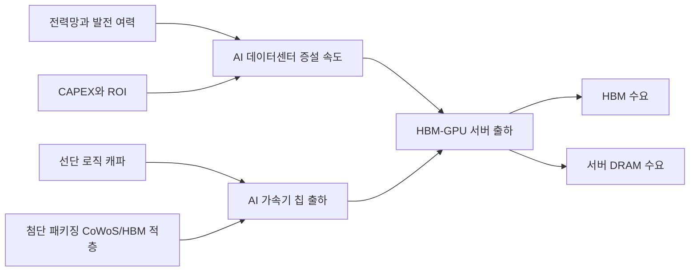

# Deep Research — 2030년 메모리 반도체 수요·공급 병목 정량 모델 (4대 병목)

**수집일**: 2026-06-10
**출처**: 사용자 의뢰 딥리서치 보고서 (LLM Deep Research). 1차 자료: IEA·LBNL·Goldman Sachs·TSMC·ASML·Micron·SK hynix·Samsung·NVIDIA·AMD·Gartner·IDC·TrendForce·Reuters·Amkor 공개 자료 종합
**원본 형태**: 마크다운 보고서. 본문 내 `citeturn…` 토큰은 딥리서치 도구의 원문 인용 마커 — 원본 보존 차원에서 그대로 유지.
**짝 문서**: [deep-research-bottleneck-monitoring-dashboard-design-2026-06.md](deep-research-bottleneck-monitoring-dashboard-design-2026-06.md) — 본 모델을 상시 감시하는 운영형 모니터링·대시보드 설계.

> **수집 맥락**: 사용자(삼성전자 메모리사업부)가 2026-06-10 "두 딥리서치 문서 기반 자료 업데이트 + 대시보드의 병목 기반 모델링 도입" 요청. 핵심 프레임 — 2030년 HBM·AI 서버용 DRAM 수급을 **전력·CAPEX/ROI·선단 로직 파운드리·첨단 패키징(CoWoS/HBM 적층)** 4대 병목의 min() 제약으로 정량화. 기준 시나리오: HBM-GPU 서버 125만 대, HBM 수요 2.88EB(공급 2.95EB), AI 서버 DRAM 수요 2.50EB(공급 3.30EB). 하방 민감도 **CAPEX/ROI > 전력 ≈ 패키징 > 파운드리**, 상방 최종 병목 = **파운드리**.
> 환원 위키 페이지: [wiki/concepts/bottleneck-model-2030.md](../../wiki/concepts/bottleneck-model-2030.md)

---

# 2030년 메모리 반도체 수요·공급 전망을 병목 관점에서 본 정량 분석

## Executive summary

이 보고서는 **AI 데이터센터용 메모리**, 그중에서도 **HBM과 서버용 DRAM**을 중심으로 2030년 수요·공급을 정량화했다. 분석의 출발점은 다음 네 가지 병목이다. **전력**, **CAPEX/ROI**, **선단 로직 파운드리**, **첨단 패키징(CoWoS/HBM 적층)**. 공식 자료를 우선 사용했고, 공식 자료가 비공개인 영역은 TSMC·ASML·삼성·마이크론·SK하이닉스의 공개 로드맵과 Reuters·TrendForce 등 2차 자료를 결합해 보수적으로 모델링했다. IEA는 2030년 전 세계 데이터센터 전력수요를 약 **945TWh**로 보며, 미국·중국·유럽·일본의 증가폭도 매우 크다. 동시에 IEA와 Goldman Sachs는 AI 인프라 투자 규모가 2025~2031년 사이 가파르게 커질 것으로 보고 있고, TSMC는 AI 가속기 매출이 2024년부터 5년간 **중간 40%대 CAGR**에 이를 것으로 제시했다. 다만 TSMC는 2025년 CoWoS를 두 배로 늘리고도 여전히 타이트하다고 밝혔고, ASML의 High-NA는 2027년부터 본격 생산에 투입될 수 있지만 공급망 전체의 완충재가 되기까지는 시간이 필요하다. citeturn4view0turn11view2turn10view1turn19view0turn22view0turn22view2

이 보고서의 핵심 결론은 다음과 같다. **하방 위험의 크기**는 2030년 기준으로 **CAPEX/ROI > 전력 ≈ 패키징 > 파운드리** 순으로 나타났다. 반대로 **상방 시나리오에서 마지막까지 남는 병목**은 파운드리였다. 즉, 2026~2028년에는 CoWoS와 HBM 적층이 가장 날카로운 운영 병목이지만, 2030 시점에는 패키징 증설이 일부 완화되면서 **“돈과 전기가 충분해도 선단 로직이 끝까지 상방을 누르는 구조”**가 된다. 이 해석은 TSMC의 CoWoS 증설 계획, 애리조나 패키징 계획, Amkor와 SK hynix의 미국 패키징 투자, 그리고 삼성·Intel의 2nm/18A 로드맵을 함께 반영한 결과다. citeturn19view0turn40view0turn40view1turn40view2turn41news30turn27search1turn29view3turn34view2

본 모델의 **기준 시나리오**에서는 2030년 **HBM 탑재 GPU 서버 출하량**이 약 **125만 대**, **HBM 수요**는 약 **2.88EB**, **AI 서버용 DRAM 수요**는 약 **2.50EB**로 추정된다. 같은 기준 시나리오에서 **HBM 공급능력**은 약 **2.95EB**, **AI 서버용 DRAM 공급능력**은 약 **3.30EB**로 추정된다. 따라서 2030년의 중심 상태는 **HBM은 거의 균형에 가까운 극도로 타이트한 시장**, **서버 DRAM은 완만한 완충 여력을 가진 시장**으로 보는 것이 가장 합리적이다. 이 결과는 Micron의 HBM TAM 전망, SK hynix의 HBM 2030 성장 전망, 삼성의 HBM4/HBM4E 증설 계획, 그리고 TSMC의 CoWoS/선단 로직 확대 계획을 함께 반영한 모형 추정이다. citeturn25view1turn25view0turn29view0turn29view1turn19view0turn40view1

단일 병목이 최악으로 발생할 때의 **메모리 수요 감소폭**은 다음과 같다. CAPEX/ROI 하방 시 **HBM -0.91EB, -31.5%**, 전력 하방 시 **HBM -0.61EB, -21.1%**, 패키징 하방 시 **HBM -0.59EB, -20.5%**, 파운드리 하방 시 **HBM -0.43EB, -14.9%**다. AI 서버용 DRAM도 같은 방향으로 줄지만 절대 수급은 HBM보다 덜 타이트해 하방 충격의 가격 파급은 상대적으로 작다. **정책·전력망·민간자본의 삼중 제약**이 약화되지 않으면, 2030년 메모리 수요는 기술적으로 만들 수 있는 상한보다 **“배치 가능한 상한”**에 더 크게 좌우될 가능성이 높다. citeturn4view0turn10view1turn19view0turn40view0turn40view2

| 항목 | 낮음 시나리오 | 기준 시나리오 | 높음 시나리오 |
|---|---:|---:|---:|
| AI-optimized 서버 총출하량 가정 | 330만 대 | 410만 대 | 520만 대 |
| HBM 탑재 GPU 서버 비중 가정 | 30% | 40% | 50% |
| 병목 반영 후 HBM-GPU 서버 출하량 | 85.6만 대 | 125.0만 대 | 152.8만 대 |
| HBM 수요 | 1.97EB | 2.88EB | 3.52EB |
| AI 서버용 DRAM 수요 | 1.71EB | 2.50EB | 3.06EB |
| HBM 공급능력 | 2.40EB | 2.95EB | 3.80EB |
| AI 서버용 DRAM 공급능력 | 2.70EB | 3.30EB | 4.10EB |

주: 위 표의 총출하량은 Gartner의 2028년 AI-optimized server 300만 대 전망을 출발점으로, IDC의 accelerated server spending 비중/성장률과 IEA의 AI 전력 수요 방향성을 결합해 2030년으로 연장한 값이다. “HBM 탑재 GPU 서버”는 그중 HBM이 실제로 필요한 고성능 GPU/ASIC 서버만 따로 떼어낸 범주다. 세부 수식은 아래에 제시한다. citeturn31search2turn31search0turn31search1turn4view0

## 분석 프레임과 핵심 가정

이 보고서의 범위는 **전체 DRAM 산업**이 아니라, **AI 데이터센터 확장과 직접 연결되는 HBM 및 서버용 DRAM**이다. 따라서 스마트폰·PC·모바일 LPDDR 수요는 별도 경기 변수로 간주하고, 2030년 병목이 실제로 누르는 영역인 **HBM 탑재 GPU/ASIC 서버**를 중심에 놓았다. Gartner는 2028년 전 세계 AI-optimized server 신규 판매가 **300만 대**에 이를 것으로 봤고, IDC는 accelerated server가 2028~2029년 AI 인프라 지출의 대부분을 차지할 것으로 본다. 그러나 이 범주에는 HBM이 필요 없는 저사양/엣지/일부 추론 서버도 포함된다. 따라서 본 모델은 2030년 AI-optimized server 중 **HBM 탑재 GPU/ASIC 서버 비중**을 낮음 30%, 기준 40%, 높음 50%로 두었다. 이는 공개 제품 스펙과 패키징·로직 제약을 감안한 모델 가정이다. citeturn31search2turn31search0turn31search1

대표 하드웨어 가정은 다음과 같다. NVIDIA DGX B200은 **8개 GPU**, **총 1,440GB HBM3e**, **2TB 시스템 메모리**, 최대 약 **14.3kW 시스템 전력**을 제시한다. AMD MI355X는 GPU당 **288GB HBM3E**를 탑재한다. NVIDIA Rubin은 GPU당 **최대 288GB HBM4**를 제시했고, Micron은 **48GB 16-Hi HBM4**, 삼성은 **48GB HBM4E**와 향후 **64GB** 구성을 공개했다. 따라서 2030년 평균 시스템당 메모리 강도는 **가속기당 HBM 288/384/512GB**, **서버당 시스템 DRAM 1.5/2.0/3.0TB**, **가속기 수 4/6/8개** 범위로 두는 것이 지나치게 낙관적이거나 비관적이지 않다. 기준 시나리오는 **가속기 6개/서버, HBM 384GB/가속기, DRAM 2TB/서버**다. citeturn14view0turn14view1turn16view0turn25view3turn29view1

본 보고서에서 사용한 핵심 수식은 아래와 같다.

\[
S_{2030}=\min(U,\;S_{power},\;S_{capex},\;S_{foundry},\;S_{packaging})
\]

\[
S_i=S_{base}\times \left(\frac{B_i}{B_{i,base}}\right)^{\varepsilon_i}
\]

\[
HBM_{EB}=S_{2030}\times A\times M/1000
\]

\[
DRAM_{EB}=S_{2030}\times D
\]

여기서 \(U\)는 병목이 없다면 달성 가능한 2030년 HBM-GPU 서버 출하량, \(B_i\)는 병목별 자원량, \(A\)는 서버당 가속기 수, \(M\)은 가속기당 HBM 용량(GB), \(D\)는 서버당 DRAM(TB)다. 기준 탄력도는 **전력 1.00, CAPEX 0.90, 파운드리 0.85, 패키징 0.95**로 두었다. 전력은 거의 물리량에 가깝고, CAPEX는 ROI 악화 시 일부 설비가 지연·취소될 수 있어 1보다 낮게 두었으며, 파운드리와 패키징은 다중 고객 간 할당과 제품 믹스 영향을 반영해 1보다 약간 낮게 두었다. 이 탄력도는 모형 가정이며, 아래의 감응도 표와 차트는 이 가정에 민감하다. citeturn4view0turn10view1turn19view0turn40view0turn40view2



| 변수 | 낮음 | 기준 | 높음 |
|---|---:|---:|---:|
| 2030 AI-optimized server 총출하량 | 330만 대 | 410만 대 | 520만 대 |
| 그중 HBM 탑재 GPU/ASIC 서버 비중 | 30% | 40% | 50% |
| 가속기 수/서버 | 4 | 6 | 8 |
| HBM 용량/가속기 | 288GB | 384GB | 512GB |
| 시스템 DRAM/서버 | 1.5TB | 2.0TB | 3.0TB |

주: Gartner의 2028년 300만 대 AI-optimized server 전망, IDC의 accelerated server spending 집중도, NVIDIA/AMD의 공개 제품 스펙, Micron·삼성의 HBM4/HBM4E 로드맵을 결합한 모형 가정이다. exact package-per-wafer, exact HBM stack/month, exact internal WSPM는 대부분 **미지수**이며 회사가 공개하지 않는다. citeturn31search2turn31search0turn14view0turn14view1turn16view0turn25view3turn29view1

## 네 가지 병목의 정량 분석

### 전력 병목

IEA의 중앙 시나리오는 2030년 전 세계 데이터센터 전력수요를 약 **945TWh**로 본다. 같은 자료에서 미국은 2030년까지 약 **240TWh 증가**, 중국은 **175TWh 증가**, 유럽은 **45TWh 증가**, 일본은 **15TWh 증가**가 제시된다. IEA는 또한 **AI-focused data center electricity demand가 2025~2030년 3배**가 된다고 본다. 미국의 경우 LBNL은 2023년 데이터센터 전력소비 비중이 약 4.4%였고 2028년에는 6.7~12% 범위로 높아질 수 있다고 추정했다. 이 조건을 바탕으로 본 모델은 2030년 AI 전용 또는 AI 집중형 데이터센터 전력을 **300TWh / 380TWh / 520TWh**로 설정했다. 380TWh는 IEA의 945TWh 중앙 시나리오에서 AI 집중형 몫을 보수적으로 역산한 값이며, 300TWh는 효율 개선·계통 지연 시나리오, 520TWh는 송전·발전 투자와 액체냉각/고밀도 전력 인입이 계획보다 원활할 때의 상방치다. citeturn4view0turn2search0turn1view1

| 전력 병목 | 낮음 | 기준 | 높음 |
|---|---:|---:|---:|
| 2030 AI 집중형 데이터센터 전력 | 300TWh | 380TWh | 520TWh |
| HBM-GPU 서버 출하 상한 | 98.7만 대 | 125.0만 대 | 171.1만 대 |
| 2026~2030 출하 CAGR | 5.4% | 11.8% | 20.9% |
| HBM 수요 | 2.27EB | 2.88EB | 3.94EB |
| AI 서버용 DRAM 수요 | 1.97EB | 2.50EB | 3.42EB |

주: 지역 분해는 IEA의 2030 총 데이터센터 전력 지역 비중을 AI 전력에 비례 적용한 추정치다. 기준 시나리오를 지역별로 나누면 미국 약 171TWh, 중국 110TWh, 유럽 46TWh, 일본 15TWh, 기타 38TWh다. 이는 **공식 지역 총량 + 저자 배분 모형**이다. citeturn4view0

전력 병목의 핵심은 **서버를 사는 것**보다 **전력 인입·계통접속·변전·수전·냉각을 맞추는 것**이 더 느리다는 점이다. CAPEX가 충분해도 전력을 못 넣으면 출하가 배치로 연결되지 않는다. 기준 대비 최악 하방에서는 HBM 수요가 **-0.61EB**, **-21.1%**, AI 서버용 DRAM 수요가 **-0.53EB**, **-21.1%** 감소한다. 2030년의 “전력 병목”은 전기요금 문제가 아니라 **접속 가능한 MW/GW의 실재적 한계**라는 점이 중요하다. citeturn4view0turn2search0

### CAPEX와 ROI 병목

IEA는 2025년 전 세계 데이터센터 투자가 약 **5,800억 달러**에 이를 것으로 봤고, 2025년 주요 기술기업의 AI 인프라 투자만 **4,000억 달러를 넘으며**, 2026년에는 **7,000억 달러를 상회**할 수 있다고 봤다. Goldman Sachs는 연간 AI CAPEX가 **2026년 7,650억 달러**, **2031년 1.6조 달러**에 도달하고, **2026~2031년 누적 7.6조 달러**에 이를 것으로 추정한다. 본 보고서는 이 경로를 바탕으로 2030년 연간 AI 인프라 CAPEX를 **0.90조 / 1.37조 / 1.80조 달러**로 두었다. 1.37조 달러는 Goldman 경로의 중간값에 가까운 값이고, 0.90조 달러는 ROI 압박과 자금조달 비용 상승이 동반될 때, 1.80조 달러는 민간신용·프로젝트파이낸스·주식발행까지 동원된 상방을 반영한다. citeturn11view2turn10view1

| CAPEX·ROI 병목 | 낮음 | 기준 | 높음 |
|---|---:|---:|---:|
| 2030 연간 AI 인프라 CAPEX | 0.90조 달러 | 1.37조 달러 | 1.80조 달러 |
| HBM-GPU 서버 출하 상한 | 85.6만 대 | 125.0만 대 | 159.8만 대 |
| 2026~2030 출하 CAGR | 1.7% | 11.8% | 18.9% |
| HBM 수요 | 1.97EB | 2.88EB | 3.68EB |
| AI 서버용 DRAM 수요 | 1.71EB | 2.50EB | 3.20EB |

주: 지역 분해는 공시된 지역별 hyperscaler 지출이 완전 공개되지 않아 **전력 분포와 공장 입지**를 proxy로 사용한 추정치다. 기준 시나리오 기준 미국 약 0.75조 달러, 중국 0.27조 달러, 유럽 0.16조 달러, 일본·한국 0.11조 달러, 기타 0.07조 달러로 배분했다. 공식 지역 CAPEX 총계는 상당 부분 **미지수**다. citeturn11view2turn10view1turn4view0

CAPEX/ROI는 네 병목 중 **가장 큰 하방 민감도**를 보였다. 저금리·높은 주가·높은 기업현금흐름이라는 2024~2025년식 금융조건이 유지되지 않으면 “계획된 AI 팩토리”와 “실제 착공된 AI 팩토리” 사이에 큰 괴리가 생긴다. 기준 대비 최악 하방에서 HBM 수요는 **-0.91EB**, **-31.5%**, AI 서버용 DRAM 수요는 **-0.79EB**, **-31.5%** 감소한다. 즉, 기술 병목보다 먼저 **투자수익률 재평가**가 수요를 꺾을 가능성이 가장 크다. citeturn10view1turn11view2

### 파운드리 병목

TSMC는 2025년 1분기 실적발표에서 **AI 가속기 매출이 2024년부터 향후 5년간 중간 40%대 CAGR**에 이를 것이라고 밝혔다. TrendForce는 TSMC의 3nm 월간 캐파가 **2026년 말 약 18만 장**, 2nm가 **2026년 말 약 10만 장**으로 확대될 수 있다고 전했다. TSMC는 미국에 추가 **1,000억 달러**를 투자해 **3개의 웨이퍼 팹과 2개의 첨단 패키징 팹**을 더 짓겠다고 밝혔고, ASML은 2025년 말까지 고객들이 **High-NA EUV에서 40만 장 이상**을 처리했으며 2027년부터 AI 로직·HBM에 본격 쓰일 수 있다고 밝혔다. 삼성은 2nm Gen2 ramp와 1.4nm 로드맵을 유지 중이고, Intel은 18A/14A 로드맵과 함께 **2030년 No.2 foundry** 목표를 공개했다. citeturn19view0turn38view0turn22view0turn22view2turn29view3turn34view2

이 데이터를 그대로 “총 캐파”로 쓰면 파운드리 병목이 과소평가된다. 실제 병목은 **총 3nm/2nm 캐파**가 아니라, 스마트폰·PC·네트워크 칩과 경쟁한 뒤 **AI 가속기 서버 스택에 실제로 배정 가능한 선단 로직 캐파**다. 그래서 본 모델은 2030년 **AI-allocatable leading-edge wafer-equivalent**를 **0.62 / 0.75 / 0.95백만 장/년**으로 두었다. 이 단위는 실제 물리 웨이퍼와 1:1 대응하지 않는 “AI 서버 스택 배정분”이며, 제품 믹스·수율·보조칩 면적을 모두 흡수한 유효 단위다. citeturn19view0turn38view0turn22view0turn34view2

| 파운드리 병목 | 낮음 | 기준 | 높음 |
|---|---:|---:|---:|
| 2030 AI 배정 선단 로직 캐파 | 0.62백만 장/년 | 0.75백만 장/년 | 0.95백만 장/년 |
| 기준 지역 분해 | 대만 0.525 / 미국 0.112 / 한국 0.075 / 일본 0.022 / 기타 0.015 |  |  |
| HBM-GPU 서버 출하 상한 | 106.3만 대 | 125.0만 대 | 152.8만 대 |
| 2026~2030 출하 CAGR | 7.4% | 11.8% | 17.6% |
| HBM 수요 | 2.45EB | 2.88EB | 3.52EB |
| AI 서버용 DRAM 수요 | 2.13EB | 2.50EB | 3.06EB |

주: 지역 분해는 TSMC의 대만·애리조나 증설, 삼성의 한국·텍사스 확장, Intel의 미국 18A/14A 계획을 반영한 배분 추정이다. 회사별 2030년 정확한 AI 할당 WSPM은 대부분 비공개이므로 **미지수**다. citeturn19view0turn29view3turn34view2turn41news30

파운드리는 하방보다 **상방 제한 요인**으로 더 중요하다. 즉, 돈이 더 들어오고 전력도 확보되는 상방에서는 패키징보다 먼저 **선단 로직의 single-supplier concentration**이 상한을 만든다. 기준 대비 최악 하방의 HBM 수요 감소는 **-0.43EB**, **-14.9%**로 다른 병목보다 작지만, **높음 시나리오에서 최종적으로 성장을 멈추게 하는 병목**은 파운드리다. citeturn19view0turn40view0turn34view2

### 패키징 병목

패키징은 2024~2027년 구간에서 가장 분명한 병목이었다. TSMC는 2025년 CoWoS 캐파를 **두 배**로 늘린다고 밝혔고, TrendForce는 전 세계 2.5D 패키징 부족이 2027년부터 조금씩 완화되겠지만, 그 전까지는 CoWoS·기판·소재까지 병목이 연쇄된다고 지적했다. TrendForce 집계에 따르면 TSMC CoWoS는 **2026년 말 11.5만~14만 장/월**, **2027년 약 17만 장/월** 수준으로 확대될 수 있으며, 연간 기준으로는 **2026년 약 130만 장**, **2027년 약 200만 장** 수준이 가능하다. TSMC는 애리조나 첨단 패키징 공장을 **2029년 전** 가동 목표로 하고 있고, Amkor의 애리조나 캠퍼스는 **2028년 초 생산**이 가능하며, SK hynix의 인디애나 HBM 패키징 허브는 **2028년 말** 운영 개시를 목표로 한다. citeturn19view0turn40view0turn40view1turn40view2turn41news30turn27search1

본 보고서는 총 nameplate CoWoS가 아니라, 그중에서 **HBM 탑재 GPU/ASIC용으로 실제 배정 가능한 유효 CoWoS-equivalent**를 사용했다. 이유는 같은 CoWoS 라인도 고객별로 패키지 크기와 reticle multiple이 다르고, 네트워크 칩·ASIC·기타 HPC 칩이 동일 자원을 먹기 때문이다. 이에 따라 2030년 유효 패키징 캐파를 **0.55 / 0.70 / 0.95백만 장/년**으로 두었다. citeturn40view0turn40view1turn40view2turn41news30

| 패키징 병목 | 낮음 | 기준 | 높음 |
|---|---:|---:|---:|
| 2030 HBM 컴퓨트용 유효 CoWoS 캐파 | 0.55백만 장/년 | 0.70백만 장/년 | 0.95백만 장/년 |
| 기준 지역 분해 | 대만 0.546 / 미국 0.070 / 한국 0.056 / 기타 0.028 |  |  |
| HBM-GPU 서버 출하 상한 | 99.4만 대 | 125.0만 대 | 167.1만 대 |
| 2026~2030 출하 CAGR | 5.6% | 11.8% | 20.2% |
| HBM 수요 | 2.29EB | 2.88EB | 3.85EB |
| AI 서버용 DRAM 수요 | 1.99EB | 2.50EB | 3.34EB |

주: 지역 분해는 TSMC의 대만 AP 증설, TSMC Arizona packaging 2029 목표, Amkor Arizona 2028, SK hynix Indiana 2028을 반영한 추정치다. exact package-per-wafer와 고객별 할당 비율은 회사 공시상 **미지수**다. citeturn40view1turn41news30turn27search1

패키징 병목의 특징은 **짧은 기간에 공급을 늘리기 어렵지만, 일단 라인이 열리면 병목이 상대적으로 빨리 완화될 수 있다는 점**이다. 저시나리오에서 HBM 수요는 기준 대비 **-0.59EB**, **-20.5%** 감소한다. 다만 2030년 시점에서는 2026~2027년보다 덜 치명적일 가능성이 크다. 그래서 패키징은 **최근 2년의 체감 병목**이지만, **2030년의 최종 상방 병목**은 아닐 가능성이 높다. citeturn19view0turn40view0turn40view1

## 2030년 HBM·DRAM 수요 전망

위 네 병목을 동시에 반영하면, 2030년의 실제 HBM-GPU 서버 출하량은 **낮음 85.6만 대, 기준 125.0만 대, 높음 152.8만 대**로 수렴한다. 여기서 핵심은 **잠재 수요가 아니라 실현 가능한 수요**다. 2030년 AI-optimized server 총출하량이 410만 대 수준이더라도, 그 안에서 HBM이 필요한 고성능 GPU/ASIC 서버는 164만 대 수준의 잠재 수요가 있을 수 있다. 하지만 네 병목을 동시에 걸면 125만 대 수준으로 줄어든다. 높음 시나리오에서는 잠재 수요가 260만 대까지 커질 수 있지만, 최종 실현값은 파운드리와 패키징 때문에 152.8만 대에서 멈춘다. citeturn31search2turn31search0turn4view0turn19view0turn40view0

| 수요 전망 | 낮음 | 기준 | 높음 |
|---|---:|---:|---:|
| AI-optimized server 총출하량 | 330만 대 | 410만 대 | 520만 대 |
| 잠재 HBM-GPU 서버 수요 | 99.0만 대 | 164.0만 대 | 260.0만 대 |
| 병목 반영 후 실현 HBM-GPU 서버 출하량 | 85.6만 대 | 125.0만 대 | 152.8만 대 |
| HBM 수요 | 1.97EB | 2.88EB | 3.52EB |
| AI 서버용 DRAM 수요 | 1.71EB | 2.50EB | 3.06EB |

주: 기준 메모리 강도는 서버당 가속기 6개, 가속기당 HBM 384GB, 서버당 DRAM 2TB다. 메모리 강도를 높음(8개, 512GB, 3TB)으로 바꾸면 출하량이 같아도 HBM 수요는 약 33% 이상, 서버 DRAM 수요는 50%까지 커질 수 있다. 반대로 낮음 하드웨어 강도에서는 HBM 수요가 약 25% 줄 수 있다. 스펙 앵커는 DGX B200, MI355X, Rubin, HBM4/HBM4E 로드맵이다. citeturn14view0turn14view1turn16view0turn25view3turn29view1

```mermaid
xychart-beta
    title "2030년 HBM 수요와 공급"
    x-axis [낮음, 기준, 높음]
    y-axis "EB" 0 --> 4
    bar "수요" [1.97, 2.88, 3.52]
    bar "공급" [2.40, 2.95, 3.80]
```

기준 시나리오의 HBM 수요 **2.88EB**는 2025~2028년 Micron이 제시한 HBM TAM 급증 경로와도 양립 가능하다. Micron은 HBM TAM이 2025년 약 **350억 달러**에서 2028년 **1,000억 달러**로 커질 수 있다고 보며, SK hynix는 HBM 시장이 2030년까지 연 **30%** 성장할 수 있다고 본다. 즉, 본 보고서의 기준 HBM 수요는 “과도한 낙관”이 아니라, **공개된 TAM 상방보다 약간 보수적인 배치 물량**으로 읽는 편이 맞다. citeturn25view1turn25view0

```mermaid
xychart-beta
    title "2030년 AI 서버용 DRAM 수요와 공급"
    x-axis [낮음, 기준, 높음]
    y-axis "EB" 0 --> 5
    bar "수요" [1.71, 2.50, 3.06]
    bar "공급" [2.70, 3.30, 4.10]
```

## 공급 전망과 주요 공급사 캐파

공급 측면에서 2030년은 **HBM은 3강 과점+소수 후발주자**, **서버 DRAM은 기존 DRAM 3강 체제의 연장**으로 보는 것이 가장 현실적이다. SK hynix는 M15X를 **20조 원 이상** 투자하는 HBM·차세대 DRAM 거점으로 키우고 있고, 인디애나에 **40억 달러** 규모의 HBM 패키징·R&D 허브를 2028년 말까지 준비 중이다. Micron은 미국 내 선단 메모리에 2030년까지 **500억 달러 gross capex**를 계획하고 있고, Idaho 첫 팹은 **2027년**, New York 첫 팹은 **2030년 이후** 공급을 시작할 전망이다. 삼성은 HBM4 상용화 뒤 **2026년 HBM 매출 3배 이상 성장**을 목표로 하고 있고, HBM4E는 48GB에서 시작해 **64GB** 구성을 계획 중이다. 이 공개 계획만으로도 HBM 공급이 2026~2027년의 극단적 부족 국면에서 2030년에는 “타이트하지만 절대부족만은 아닌” 단계로 이동할 가능성이 높다. citeturn27search9turn27search1turn30search3turn30search5turn30search13turn29view0turn29view1

| 공급 전망 | 낮음 | 기준 | 높음 |
|---|---:|---:|---:|
| HBM 생산능력 | 2.40EB | 2.95EB | 3.80EB |
| HBM 출하 | 2.25EB | 2.82EB | 3.55EB |
| HBM 재고 | 2주 | 4주 | 7주 |
| AI 서버용 DRAM 생산능력 | 2.70EB | 3.30EB | 4.10EB |
| AI 서버용 DRAM 출하 | 2.55EB | 3.05EB | 3.75EB |
| AI 서버용 DRAM 재고 | 4주 | 6주 | 10주 |

주: 재고는 finished goods+near-channel 기준의 모델값이며, HBM은 2025~2026년처럼 장기 계약과 sell-out 구조가 강해 재고일수가 구조적으로 낮다. Micron은 2026년 HBM 공급의 대부분 가격·물량 합의를 완료했다고 밝혔고, TSMC/TrendForce는 CoWoS가 2027년까지도 타이트하다고 본다. 엄밀한 회사별 2030 재고 일수는 대체로 **미지수**다. citeturn25view2turn19view0turn40view0

다음 표는 **기준 시나리오의 공급사별 캐파**를 정리한 것이다. 여기서의 값은 **회사 공시/투자계획+현재 경쟁위치**를 바탕으로 한 **모형 추정치**다. 정확한 2030 physical WSPM과 stack/month는 대부분 비공개라서 **미지수**로 남아 있다. 따라서 아래 EB 값은 실물 공장 명판용량이 아니라 **AI 데이터센터용 HBM·서버 DRAM에 귀속되는 유효 캐파**로 이해해야 한다. citeturn27search9turn27search1turn30search3turn30search13turn29view0turn29view1turn25view3

| 회사 | 공개된 핵심 투자·로드맵 | 2030 기준 HBM 유효 캐파 | 2030 기준 AI 서버용 DRAM 유효 캐파 |
|---|---|---:|---:|
| SK hynix | M15X에 20조 원 이상 투자, 인디애나 HBM 패키징 허브 2028년 말 목표, HBM4 양산 로드맵 | 1.24EB | 1.12EB |
| 삼성전자 | HBM 매출 2026년 3배+, HBM4/HBM4E 확장, 2nm/1.4nm 연계 | 0.94EB | 1.32EB |
| Micron | 2030년까지 미국 선단 메모리 500억 달러 CAPEX, Idaho 2027, NY 2030+, HBM4E 2027 | 0.71EB | 0.79EB |
| 기타·중국 | 정확한 2030 캐파 공개 부족, export control과 장비 접근성이 주요 변수 | 0.06EB | 0.07EB |

주: SK hynix는 Reuters 인터뷰에서 HBM 시장이 2030년까지 연 30% 성장할 수 있다고 봤고, Micron은 HBM TAM이 2028년 1,000억 달러에 이를 수 있다고 제시했다. 삼성은 HBM4E 샘플과 64GB 계획을 공개했다. 다만 각 회사의 2030 exact physical stack/month, TSV line throughput, known-good-die yield는 대부분 공시하지 않아 **미지수**다. citeturn25view0turn25view1turn29view1turn25view3

## 수급 균형과 곡선 분석

수급 균형은 “기준 수요 vs 기준 공급”만 보면 충분하지 않다. 중요한 것은 **고수요·저공급이 동시에 발생하는 stress 조합**이다. 아래 표는 시나리오 결합별 초과공급(+) 또는 부족(-)을 나타낸다. 기준 시나리오에서는 HBM이 **+0.07EB**로 사실상 균형이고, AI 서버 DRAM은 **+0.80EB**의 완충이 있다. 그러나 **고수요·저공급** 조합에서는 HBM이 **-1.12EB**, DRAM이 **-0.36EB** 부족해진다. 따라서 2030년 가격 변동성과 전략재고 압력은 여전히 **HBM이 압도적**이다. citeturn25view1turn25view0turn19view0turn40view0

| HBM 수급차 | 저공급 | 기준공급 | 고공급 |
|---|---:|---:|---:|
| 저수요 | +0.43EB | +0.98EB | +1.83EB |
| 기준수요 | -0.48EB | +0.07EB | +0.92EB |
| 고수요 | -1.12EB | -0.57EB | +0.28EB |

| AI 서버용 DRAM 수급차 | 저공급 | 기준공급 | 고공급 |
|---|---:|---:|---:|
| 저수요 | +0.99EB | +1.59EB | +2.39EB |
| 기준수요 | +0.20EB | +0.80EB | +1.60EB |
| 고수요 | -0.36EB | +0.24EB | +1.04EB |

이제 가격까지 포함한 균형을 보자. 본 보고서는 HBM에 대해 수요탄력도 **-0.35**, 공급탄력도 **+0.60**, 서버 DRAM에 대해 수요탄력도 **-0.50**, 공급탄력도 **+0.80**을 둔 단순 상수탄력도 함수로 균형가격을 계산했다. 이는 공개 시장가격 예측이 아니라 **수급 압박의 방향과 강도**를 보기 위한 normalized price index 모형이다. 기준-기준 조합에서 HBM의 균형가격은 **97.5**, 균형거래량은 **2.91EB**다. 반면 **고수요-저공급** 조합에서는 HBM 균형가격이 **149.7**, 거래량은 **3.06EB**까지 올라간다. DRAM은 같은 stress에서 가격이 **110.0** 정도로 오르지만, HBM만큼의 수급 탄력성 붕괴는 나타나지 않는다. citeturn25view1turn40view0turn19view0

| 균형 모형 | HBM 가격지수 | HBM 거래량 | DRAM 가격지수 | DRAM 거래량 |
|---|---:|---:|---:|---:|
| 저수요-저공급 | 81.4 | 2.12EB | 70.5 | 2.04EB |
| 기준수요-기준공급 | 97.5 | 2.91EB | 80.8 | 2.78EB |
| 고수요-고공급 | 92.3 | 3.62EB | 79.8 | 3.42EB |
| 고수요-저공급 stress | 149.7 | 3.06EB | 110.0 | 2.91EB |
| 저수요-고공급 stress | 50.2 | 2.51EB | 51.1 | 2.40EB |

이 결과를 해석하면, 2030년 메모리 시장의 가장 중요한 질문은 “HBM 수요가 얼마나 늘어나는가”보다도 **“그 수요가 전력·자본·선단 로직·첨단 패키징 네 축에서 동시에 실현 가능한가”**다. 기준 시나리오에서는 HBM 부족이 결정적으로 폭발하지 않지만, 어느 한 축만 삐끗해도 **물량 부족보다 가격 급등이 먼저 나타나는 구조**가 유지된다. 반대로 DRAM은 AI 서버용 수요가 강하게 늘어도 산업 전체의 완충이 그보다 크기 때문에, shortage가 나타나더라도 HBM보다는 늦고 완만하게 나타날 가능성이 높다. citeturn25view1turn25view0turn29view0turn30search3

## 한계와 미지수

이 보고서에서 가장 큰 **미지수**는 네 가지다. 첫째, TSMC·삼성·Intel의 2030년 exact AI-allocatable WSPM은 공개되지 않는다. 둘째, CoWoS의 **package-per-wafer**, 고객별 할당, reticle multiple 변화도 대부분 비공개다. 셋째, hyperscaler의 ROI 기준과 private credit 가용성은 매크로와 금리에 매우 민감하다. 넷째, 중국의 선단 로직·HBM 관련 진전은 장비 규제와 국산화 속도에 따라 크게 달라질 수 있다. 그래서 본 보고서의 수치는 **정답표가 아니라 상한·하한이 있는 구조적 시뮬레이션**으로 읽는 편이 맞다. 공개 자료가 없는 영역은 모두 추정으로 처리했고, 그 부분은 표와 본문에서 명시적으로 밝혔다. citeturn22view2turn34view2turn40view2turn41news30

그럼에도 불구하고 방향성은 비교적 명확하다. **전력과 자본은 수요 실현의 문턱**, **패키징은 단기 운영 병목**, **파운드리는 상방 최종 병목**이다. 따라서 2030년 메모리 반도체 투자 판단에서 가장 중요한 것은 단순한 “AI 수요 성장률”이 아니라, **누가 전력을 먼저 확보하고, 누가 장기계약으로 CoWoS와 선단 로직을 잠그며, 누가 ROI가 흔들릴 때도 CAPEX를 지속할 수 있는가**다. 이 질문에 가장 유리한 업체와 생태계가 2030년 HBM/DRAM 수요의 실질적 승자가 될 가능성이 높다. citeturn4view0turn10view1turn19view0turn40view0