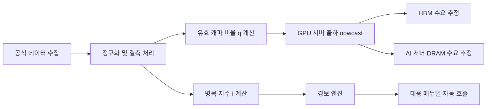
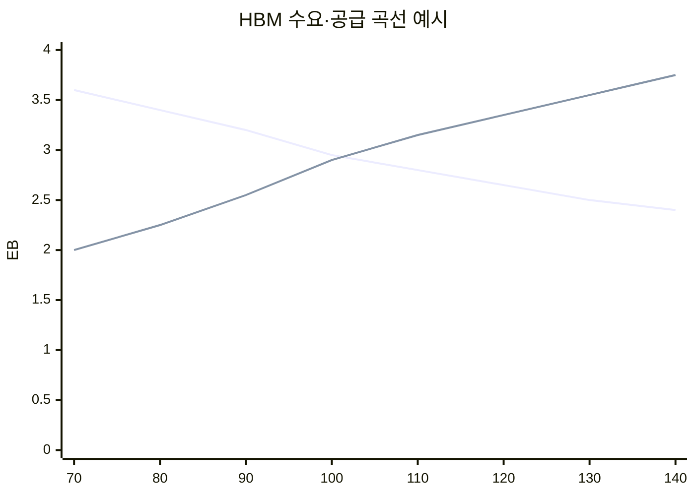
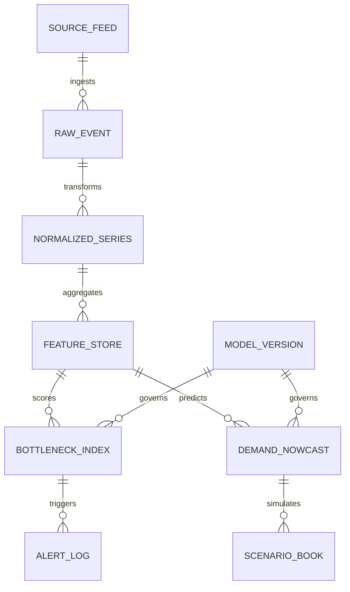
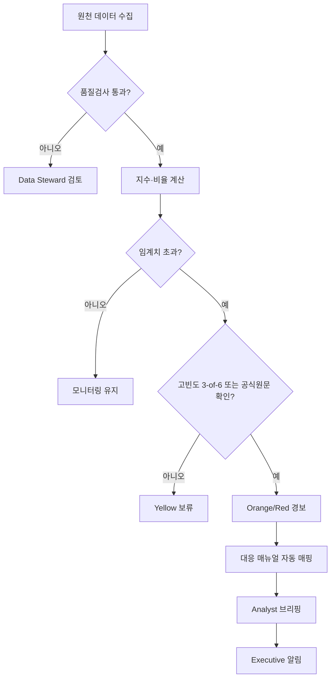
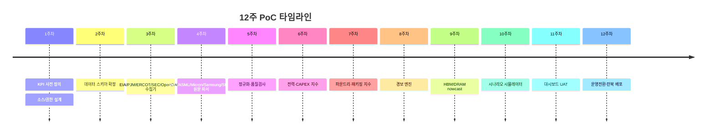

# Deep Research — 2030 메모리 병목 모니터링 모델·대시보드 설계 (운영형)

**수집일**: 2026-06-10
**출처**: 사용자 의뢰 딥리서치 보고서 (LLM Deep Research). 1차 자료: EIA-930·PJM·ERCOT·ENTSO-E·SEC EDGAR·OpenDART·TSMC 월매출·ASML·Micron·IEA·Goldman Sachs·Morgan Stanley·TrendForce 공개 자료 종합
**원본 형태**: 마크다운 보고서. 본문 내 `citeturn…` 토큰은 딥리서치 도구의 원문 인용 마커 — 원본 보존 차원에서 그대로 유지.
**짝 문서**: [deep-research-2030-bottleneck-quant-model-2026-06.md](deep-research-2030-bottleneck-quant-model-2026-06.md) — 본 설계의 기준선(HBM 2.88EB·DRAM 2.50EB·서버 125만 대)을 산출한 4대 병목 정량 모델.

> **수집 맥락**: 위 정량 모델을 **상시 감시**로 전환하는 설계 문서. 관측층(공식 API·공시)→모형층(제약지수 I·유효 캐파 비율 q)→의사결정층(경보·시나리오·대응 매뉴얼) 3층 구조, 혼합주기 nowcasting(전력 분·시간 / CAPEX 일·분기 / 파운드리·패키징 사건·월·분기), 5단계 경보(Green<40 / Yellow 40–60 / Orange 60–75 / Red 75–85 / Critical>85), 탄력도 priors(전력 1.00·CAPEX 0.90·파운드리 0.85·패키징 0.95), 병목별 KPI 체계(P1/P2/P3), 충격 시나리오 대응 매뉴얼 포함.
> 환원 위키 페이지: [wiki/concepts/bottleneck-model-2030.md](../../wiki/concepts/bottleneck-model-2030.md)

---

# 2030년 메모리 반도체 병목 모니터링 모델과 대시보드 설계

## Executive summary

이 보고서는 2030년 **HBM 및 AI 데이터센터용 DRAM**의 수요·공급 병목을 상시 감시하기 위한 **운영형 모니터링 모델과 대시보드**를 설계한다. 감시 대상 병목은 사용자가 지정한 네 축, 즉 **전력**, **CAPEX/ROI**, **선단 로직 파운드리**, **첨단 패키징(CoWoS/HBM 적층)**이다. 설계의 핵심은 네 병목이 서로 다른 시간 해상도를 가지므로, **전력은 분·시간 단위**, **CAPEX/ROI는 일·분기 단위**, **파운드리와 패키징은 사건·월·분기 단위**로 관측한 뒤 이를 **혼합주기 nowcasting 모델**에서 통합해야 한다는 점이다. 이 접근은 EIA의 시간단위 전력 데이터, PJM과 ERCOT의 실시간 API, ENTSO-E의 전력 데이터 포털, SEC EDGAR의 실시간 JSON/XBRL API와 10분 RSS, 한국 OpenDART API, 그리고 TSMC의 월매출 공시처럼 공개적으로 수집 가능한 원문 데이터를 결합할 때 가장 실용적이다. citeturn1search7turn1search2turn1search9turn19search13turn20search2turn7search18turn18search0

운영 기준선은 “정답”이 아니라 **대시보드에서 경보와 시나리오를 정량화하기 위한 기준선**이다. 본 보고서는 공식 자료를 종합해 2030년 기준선으로 **HBM 2.88EB**, **AI 서버용 DRAM 2.50EB**, **HBM 탑재 GPU/ASIC 서버 125만 대**를 둔다. 이 값은 IEA의 2030년 데이터센터 전력 약 950TWh 경로, TSMC의 AI 가속기 매출 **중간 40%대 CAGR**와 CoWoS 2025년 두 배 증설·여전한 풀로드 발언, Micron의 HBM TAM이 2025년 약 350억 달러에서 2028년 약 1,000억 달러로 커진다는 전망, 그리고 NVIDIA DGX B200·AMD MI355X·NVIDIA Rubin의 공개 메모리 강도를 합성한 **운영용 기준선**이다. 즉, 회사 가이던스가 아니라 **모니터링 모델의 기준점**이다. citeturn0search11turn13view2turn11view1turn12view2turn3search6turn9search0turn9search1turn9search2

병목별 하방 민감도는 이 기준선에 대해 **CAPEX/ROI > 전력 ≈ 패키징 > 파운드리** 순으로 설정하는 것이 합리적이다. 초기 탄력도 priors는 **전력 1.00**, **CAPEX/ROI 0.90**, **파운드리 0.85**, **패키징 0.95**로 두고, 지속적 스트레스 발생 시 **전력 쇼크는 HBM -0.61EB, DRAM -0.53EB**, **CAPEX/ROI 쇼크는 HBM -0.91EB, DRAM -0.79EB**, **패키징 쇼크는 HBM -0.59EB, DRAM -0.51EB**, **파운드리 쇼크는 HBM -0.43EB, DRAM -0.37EB**를 2030 연환산 영향으로 사용하는 것이 적절하다. 이 수치는 공식 기업 가이던스가 아니라, IEA·TSMC·ASML·Micron·NVIDIA/AMD 공개 자료를 기반으로 구축한 운영모형의 충격계수다. citeturn16view0turn13view2turn15search0turn3search6turn9search0turn9search1

대시보드는 **관측층**, **모형층**, **의사결정층**의 세 층으로 구성해야 한다. 관측층은 공식 API·공시·IR 원문을 수집하고, 모형층은 네 병목별 **제약지수**와 **유효 캐파 비율**을 산출하며, 의사결정층은 경보·시나리오·대응 매뉴얼을 제공한다. 실무적으로는 **Green < 40, Yellow 40–60, Orange 60–75, Red 75–85, Critical > 85**의 5단계 경보 체계가 유용하며, 전력은 3회 연속 고빈도 이상 징후, CAPEX·파운드리·패키징은 **공식 원문 2개 이상 확인** 또는 **단일 공식 중대 이벤트** 발생 시 즉시 승격하도록 설계하는 것이 바람직하다. TSMC는 2025년 CoWoS 두 배 증설에도 “still fully loaded”라고 밝혔고, ASML은 High-NA가 2027~2028년 고객사 양산 삽입에 맞춰 성숙 중이라고 밝혔기 때문에, 패키징과 선단 로직은 여전히 이벤트 기반 경보가 필수다. citeturn12view2turn15search0

권장 PoC는 **12주**, **6~8명 내외**, **공식 원문 중심 데이터 우선 구축**이다. 첫 단계에서는 상용 리서치 구독 없이도 충분히 운용 가능한 **P1 지표**부터 올리고, 상용 리서치인 Gartner·IDC·Goldman·Morgan Stanley는 **시나리오 캘리브레이션과 경영진 브리핑 보조층**으로 사용하는 것이 비용 대비 효과가 높다. IEA는 데이터센터 전력수요가 2030년 약 950TWh로 두 배 가까이 늘고, AI-focused 데이터센터 전력수요가 더 빠르게 증가한다고 보며, Goldman Sachs는 연간 AI CapEx가 2026년 7,650억 달러에서 2031년 1.6조 달러로 증가하는 베이스라인을 제시한다. 따라서 이 대시보드는 단순 생산 추적 시스템이 아니라, **“돈·전기·웨이퍼·패키지” 중 무엇이 먼저 막히는지 보는 병목 레이더**로 설계되어야 한다. citeturn0search11turn8search2turn8search4

## 설계 원칙과 기준선

이 대시보드는 **전체 DRAM 산업**을 포괄적으로 감시하는 시스템이 아니라, 2030년 수급을 실질적으로 좌우하는 **AI 데이터센터 스택의 메모리 병목**을 추적하는 시스템으로 정의하는 편이 맞다. 범위를 명확히 정하지 않으면 모바일·PC·산업용 DRAM 사이클이 혼입되어 병목 신호가 흐려진다. 공개 제품 기준으로 DGX B200은 8개 GPU와 총 1,440GB HBM3e, 2TB 시스템 메모리를 탑재하며, AMD MI355X는 GPU당 288GB HBM3E, NVIDIA Rubin은 GPU당 최대 288GB HBM4를 제시한다. Micron과 Samsung은 각각 HBM4/4E의 고용량화를 공개하고 있다. 따라서 병목 모니터링의 중심 단위는 “웨이퍼”보다 **HBM 탑재 GPU 서버**, “서버 수”보다 **서버당 HBM/DRAM 강도**가 되어야 한다. citeturn9search0turn9search1turn9search2turn2search4turn2search6

기준선 산정에 필요한 외생 변수는 세 층으로 나뉜다. 첫째, **전력 외생층**이다. IEA는 2030년 글로벌 데이터센터 전력소비를 약 950TWh, AI-focused 데이터센터 전력소비는 2025~2030년 사이 3배 성장으로 본다. 둘째, **투자 외생층**이다. IEA는 2024년 글로벌 데이터센터 투자가 약 5,000억 달러 수준으로 커졌다고 보고, Goldman Sachs는 AI CapEx의 2031년 1.6조 달러 경로를 제시한다. 셋째, **공급망 외생층**이다. TSMC는 AI 가속기 매출이 2024년부터 5년간 중간 40%대 CAGR에 이를 것이라 밝혔고, CoWoS는 2025년에 두 배로 늘려도 여전히 풀로드라고 설명했다. ASML은 2026년 말까지 High-NA가 HVM 요구조건에 도달하고 2027~2028년에 고객 양산 삽입을 목표로 한다고 밝혔다. 이 세 층을 묶어야 병목 감지가 실제 수요·공급으로 연결된다. citeturn0search11turn16view0turn8search2turn13view2turn12view2turn15search0

본 설계에서 사용하는 **기준선 가정표**는 아래와 같다.

| 항목 | 운영 기준선 | 범위 또는 대체 가정 | 비고 |
|---|---:|---:|---|
| 2030 HBM 기준 수요 | 2.88EB | 1.97~3.52EB | 운영모형 기준선 |
| 2030 AI 서버용 DRAM 기준 수요 | 2.50EB | 1.71~3.06EB | 운영모형 기준선 |
| HBM 탑재 GPU/ASIC 서버 출하 | 125만 대 | 85.6만~152.8만 대 | 운영모형 기준선 |
| 서버당 가속기 수 | 6개 | 4~8개 | 공개 제품/랙 구성 기반 가정 |
| 가속기당 HBM | 384GB | 288~512GB | B200, MI355X, Rubin 기반 |
| 서버당 DRAM | 2TB | 1.5~3TB | 고성능 AI 서버 가정 |
| 전력·CAPEX·파운드리·패키징 탄력도 | 1.00 / 0.90 / 0.85 / 0.95 | 초기 priors ±0.15 | 분기 재보정 |

주: 위 표는 **공식 수치가 아니라 운영 모델의 기준점**이다. 기준점은 IEA 2030 데이터센터 전력 경로, TSMC AI 가속기/CoWoS 가이던스, Micron HBM TAM 추정, NVIDIA/AMD 공개 스펙을 결합한 추론값이며, 서버당 구성은 실제 고객/랙 설계에 따라 달라질 수 있다. 공개되지 않는 고객별 패키지 면적, 정확한 CoWoS package-per-wafer, 고객별 long-term reservation은 **미지수**로 두고 범위 추정으로 처리해야 한다. citeturn0search11turn13view2turn12view2turn3search6turn9search0turn9search1turn9search2

혼합주기 설계를 채택해야 하는 이유는, 전력은 실제로 **실시간 API**가 존재하지만, CAPEX·파운드리·패키징은 대부분 **공시와 콜 트랜스크립트, 월매출, 투자 마일스톤**을 통해서만 업데이트되기 때문이다. SEC의 data.sec.gov는 실시간 JSON/XBRL을 제공하고, RSS는 10분 단위로 갱신된다. OpenDART도 원문 XML과 재무정보 API를 제공한다. TSMC는 월매출을 매월 공개한다. 반면, CoWoS의 고객별 정량 배분이나 AI-allocable 2nm WSPM은 대부분 공개되지 않으므로, 이 부분은 **직접 측정값이 아닌 추정치**로 관리되어야 한다. citeturn20search2turn7search18turn18search0turn18search6turn4search0turn12view2

## 병목별 KPI 체계

실시간 병목 감시의 출발점은 **지표의 우선순위 체계화**다. 본 보고서는 P1을 “공식 원문·공식 API·상시 자동수집 가능”, P2를 “공식 원문은 있으나 이벤트성 또는 부분 자동화”, P3를 “상용 리서치 또는 대체 추정 필요”로 정의한다. 원칙은 단순하다. **공식 원문이 존재하면 언제나 그것이 1순위**고, 상용 리서치는 공식 데이터의 빈 구간을 메우거나 시나리오 범위를 보정하는 데만 쓴다. citeturn20search2turn18search0turn4search0turn15search0

### 전력 병목 KPI

| KPI | 정의 | 단위 | 권장 수집 주기 | 우선순위 | 1차 소스 | 2차 소스·대체 |
|---|---|---:|---|---|---|---|
| 허브별 Operating Reserves | DC 집중 지역 ISO/RTO의 실시간 예비력 | MW | 5분~1시간 | P1 | ERCOT, PJM | EIA Grid Monitor |
| 허브별 수요·순발전 | 전력 수급의 실시간 타이트니스 | MW | 1시간 | P1 | EIA-930, PJM, ERCOT | ENTSO-E |
| Hub LMP·DA/RT 스프레드 | 전력 가격 스트레스와 혼잡도 | $/MWh | 5분~1시간 | P1 | PJM, ERCOT | 내부 조달가 데이터 |
| Interconnection 지연일수 | 신규 부하 또는 전원 접속 지연 | 일·월 | 주간/월간 | P1 | 유틸리티·RTO 공시 | 내부 프로젝트 PMO |
| 예정 발전 COD 달성률 | 데이터센터 전력공급 예정 설비의 인입 가능성 | % | 월간 | P2 | EIA-860, 공익사업 규제문서 | 유틸리티 IRP |
| 데이터센터 전력사용 nowcast | 특정 허브 또는 사업자군의 IT load 추정 | MW/TWh | 일간/주간 | P2 | 내부 텔레메트리·유틸리티 자료 | IEA/LBNL 앵커 |
| Grid event count | 비상경보, reserve warning, weather watch 발생 횟수 | 건수 | 일간 | P1 | ERCOT, PJM, ISO 공지 | 뉴스 룰 기반 |
| 변압기·케이블 리드타임 | 물리 인입 병목의 공급망 지표 | 주·월 | 월간 | P3 | 내부 조달 ERP | 공급업체 서베이 |

주: 전력 병목은 네 병목 가운데 유일하게 **실시간 API 기반 감시**가 가능한 축이다. EIA는 고전압 벌크 그리드의 시간단위 EIA-930 데이터를 제공하고, PJM은 Data Miner 2 API, ERCOT은 Public API Explorer와 실시간 대시보드를 제공한다. ENTSO-E도 투명성 플랫폼과 국가별 데이터 포털을 제공한다. IEA는 2030년까지 데이터센터 전력수요가 급증하고, 그 과정에서 약 20%의 계획 프로젝트가 지연 위험에 놓일 수 있으며, 송전선 증설은 선진국에서 4~8년, 변압기와 케이블의 대기시간은 최근 3년간 두 배가 되었다고 지적한다. 따라서 전력 대시보드는 단순 전기요금보다 **예비력·접속 지연·인입 가능성**을 더 높은 우선순위로 둬야 한다. citeturn1search7turn1search2turn1search9turn19search13turn16view0

### CAPEX와 ROI 병목 KPI

| KPI | 정의 | 단위 | 권장 수집 주기 | 우선순위 | 1차 소스 | 2차 소스·대체 |
|---|---|---:|---|---|---|---|
| Hyperscaler AI/DC CapEx 가이던스 합계 | 상위 CSP·빅테크의 데이터센터/AI 투자 계획 | 십억 달러 | 이벤트·분기 | P1 | SEC 10-Q/10-K/8-K·20-F | 경영진 발표자료 |
| FCF/CapEx 커버리지 | 자기자금으로 AI 투자를 소화할 여력 | 배수 | 분기 | P1 | SEC XBRL, OpenDART | 재무 DB |
| AI 인프라 지출 증가율 | 직전 4분기 대비 AI 인프라 투자 가속도 | % YoY | 분기 | P1 | 회사 filings·earnings | IDC/Gartner |
| TSMC 월매출 YoY | AI 주문 모멘텀의 고빈도 프록시 | % YoY | 월간 | P1 | TSMC monthly revenue | sell-side 추정 |
| HBM sold-out horizon | 이미 가격·물량이 잠긴 선도 공급 개월수 | 개월 | 분기 | P1 | Micron earnings, supplier IR | 자체 고객체크 |
| HY OAS·BBB OAS | 프로젝트파이낸스·차입 환경 스트레스 | bp | 일간 | P2 | FRED | 시장데이터 |
| 10Y 금리·term spread | 할인율·자본비용 환경 | %·bp | 일간 | P2 | FRED | 중앙은행 |
| AI 매출/AI CapEx ratio | ROI의 가장 직관적인 경영지표 | 배수 | 분기 | P2 | filings·earning remarks | 추정 모델 |
| Accelerated server spending share | 서버 투자 중 실제 가속기 비중 | % | 분기/반기 | P3 | IDC, Gartner | 내부 서베이 |

주: CAPEX·ROI 병목은 전력처럼 “실시간 물리량”이 아니라 **실시간 공시 이벤트 + 일간 금융조건 + 분기 경영지표**의 결합으로 봐야 한다. SEC의 data.sec.gov는 공시 제출과 XBRL 데이터를 실시간으로 제공하고, RSS는 10분 단위로 갱신된다. OpenDART도 원문 XML과 재무 API를 제공한다. TSMC는 월매출을 공시하고, Micron은 HBM 공급의 sold-out 여부와 향후 공급계약 범위를 실적발표에서 공개한다. Goldman Sachs는 연간 AI CapEx가 2026년 7,650억 달러, 2031년 1.6조 달러로 성장하는 기준선을 제시했고, Morgan Stanley는 2028년까지 데이터센터와 하드웨어에 약 3조 달러가 투입될 수 있다고 본다. 따라서 이 축의 핵심은 “돈이 있느냐”가 아니라 **현금흐름과 금융시장이 그 지출을 계속 정당화하느냐**다. citeturn20search2turn20search6turn7search18turn18search0turn4search0turn3search0turn3search6turn8search2turn8search11turn20search0turn20search3

### 선단 로직 파운드리 병목 KPI

| KPI | 정의 | 단위 | 권장 수집 주기 | 우선순위 | 1차 소스 | 2차 소스·대체 |
|---|---|---:|---|---|---|---|
| TSMC/Samsung/Intel 선단 노드 램프 상태 | N3/N2/A16·2nm/18A의 양산 진척 | 상태값 | 이벤트·월간 | P1 | 회사 실적·연례보고·보도자료 | 업계 리서치 |
| AI-allocable leading-edge capacity | AI용으로 실제 배정 가능한 선단 로직 용량 | WSPM eq. | 월간 | P2 | 회사 코멘터리 | 자체 추정, TrendForce |
| TSMC AI revenue momentum | AI 가속기·HBM controller 수요의 직접 프록시 | % YoY | 분기 | P1 | TSMC transcript | sell-side |
| TSMC 월매출·HPC 설명 | 선단 수요의 고빈도 프록시 | % YoY | 월간 | P1 | TSMC monthly revenue | 내부 모델 |
| ASML EUV/High-NA 출하·백로그 | 선단 캐파 확장의 장비 선행지표 | 대수·유로 | 분기 | P1 | ASML results | 공급망 체크 |
| High-NA 삽입 시점 | 2027~2028 삽입 지연 여부 | 분기수 | 이벤트·분기 | P1 | ASML transcript | 고객 코멘터리 |
| 수율 프록시 | 램프 초기에 의도했던 생산성이 나오는지 | % 또는 score | 월간 | P2 | 회사 발언 | 내부/Yield model |
| 선단 장비 매출의 로직·메모리 분포 | 공급망의 어느 쪽이 더 타이트한지 | % | 분기 | P1 | ASML results | 업체별 캘리브레이션 |

주: 파운드리는 절대 capacity보다 **AI용으로 배정 가능한 qualified capacity**가 중요하다. TSMC는 2025년 1분기에 AI 가속기 매출이 2024년부터 향후 5년간 중간 40%대 CAGR에 이를 것이라 밝혔고, 추가 1,000억 달러 미국 투자 안에 3개 추가 웨이퍼 팹과 2개 첨단 패키징 팹을 포함한다고 설명했다. ASML은 2026년 1월에 High-NA 시스템 8대를 출하했고 그중 6대가 가동 중이며, 2026년 말 HVM 요구 조건 충족과 2027~2028년 고객 양산 삽입을 목표로 한다고 밝혔다. 또한 2026년 1분기 장비 매출 구성이 로직 49%, 메모리 51%로 거의 반반이어서 선단 로직과 HBM 메모리 수요가 동시에 장비 수요를 밀고 있음을 보여준다. 다만 고객별 AI 전용 WSPM과 실제 수율은 공개되지 않는 경우가 많으므로, 이 KPI의 핵심값 상당수는 **미지수**로 남고, 범위 추정이 불가피하다. citeturn13view2turn11view2turn15search0turn15search9turn6search5

### 첨단 패키징 병목 KPI

| KPI | 정의 | 단위 | 권장 수집 주기 | 우선순위 | 1차 소스 | 2차 소스·대체 |
|---|---|---:|---|---|---|---|
| TSMC CoWoS 증설 마일스톤 | 신규 라인·사이트·설비 증설 진척 | 상태값 | 이벤트·월간 | P1 | TSMC transcript | TrendForce |
| Qualified CoWoS output | 고객 인증을 통과한 실질 산출량 | wafer/month eq. | 월간 | P2 | 내부/공급망 | TrendForce |
| CoWoS utilization score | “fully loaded” 여부, 납기 압박 점수 | score | 분기 | P1 | TSMC transcript | 고객 피드백 |
| HBM advanced packaging site progress | Arizona, Indiana, Singapore 등 신규 후공정 사이트 진척 | % | 월간/분기 | P2 | Amkor, SK hynix, Micron | 지역정부 자료 |
| HBM stack generation mix | HBM3E/HBM4/HBM4E 세대 믹스 | % | 분기 | P2 | Samsung, Micron, SK hynix | 자체 추정 |
| Base-die/logic-die readiness | HBM4 계열의 logic base die 성숙도 | 상태값 | 분기 | P2 | Samsung, Micron | 고객사 평가 |
| TSV/KGD yield proxy | 적층·테스트 단계의 수율 프록시 | % 또는 score | 월간 | P3 | 내부 | 공급망 인터뷰 |
| Substrate/interposer tightness | 기판·인터포저 병목 점수 | score | 월간 | P3 | 내부 조달 | TrendForce |

주: 패키징은 실제로는 **CoWoS·HBM 적층·테스트·기판**이 함께 묶인 병목이다. TSMC는 2025년에 CoWoS 캐파를 두 배로 늘린다고 밝혔고, 2026년에도 수요가 강하게 이어질 것이라고 말했다. TrendForce는 TSMC CoWoS가 2026년 말 약 11.5만~14만 장/월, 2027년 약 17만 장/월에 이를 수 있으며, 전 세계 2.5D 패키징 부족은 2027년부터 일부 완화될 가능성이 있다고 본다. 동시에 Amkor는 Arizona 캠퍼스 1단계를 2028년에 열 계획이고, SK hynix는 인디애나 투자로 2028년부터 첨단 후공정을 시작할 계획이며, Micron은 싱가포르 HBM 첨단 패키징 시설이 2027년 공급에 의미 있게 기여할 것이라고 밝혔다. 공개 정량값이 부족한 `Qualified CoWoS output`과 `TSV/KGD yield`는 반드시 **미지수**로 표기하고, 사내 공급망 데이터가 없으면 점수화 지표로 대체해야 한다. citeturn12view2turn10search0turn10search1turn5search7turn5search5turn2search1turn3search1

## 모델과 복합 지수

대시보드의 중심 엔진은 **제약지수(index)**와 **유효 캐파 비율(ratio)**의 이중 구조가 되어야 한다. 전력·CAPEX·파운드리·패키징 각각에 대해 먼저 “필요한 자원 대비 실제로 확보된 자원”을 나타내는 **유효 캐파 비율**을 만들고, 그다음 여러 KPI를 묶어 0~100 스케일의 **제약지수**를 만든다. 전자는 수급 모형에 직접 들어가고, 후자는 운영자와 경영진의 의사결정 화면에 바로 노출된다. 공식 데이터는 이질적인 빈도와 스케일을 가지므로, 입력 전처리는 robust 기준으로 해야 한다. citeturn1search7turn20search2turn4search0turn15search0

본 설계의 전처리 규칙은 다음과 같다.

\[
s_{k,t}=\mathrm{clip}\left(\frac{x_{k,t}-\tilde{\mu}_{k,t}}{1.4826\cdot MAD_{k,t}},-3,3\right)
\]

\[
q_{j,t}=\frac{\text{Available Qualified Capacity}_{j,t}}{\text{Required Capacity}_{j,t}}
\]

\[
I_{j,t}=100\cdot \sigma\left(\alpha_j+\sum_k w_{jk}s_{k,t}\right)
\]

여기서 \(s_{k,t}\)는 robust z-score, \(q_{j,t}\)는 병목 \(j\)의 유효 캐파 비율, \(I_{j,t}\)는 0~100의 병목지수다. \(q_{j,t}<1\)이면 이미 구조적으로 부족하다는 뜻이며, \(I_{j,t}\)는 그 부족이 “얼마나 불안정하고 악화 중인가”를 보여준다. 결측치가 3개 구간 이내이면 칼만 스무딩으로 보간하고, 그 이상이면 **미지수**로 두고 신뢰구간을 넓힌다. 분기 공시가 늦는 변수는 last-known-value를 유지하되 `staleness penalty`를 준다. 이 방법은 공식 공시와 실시간 API가 뒤섞인 환경에서 가장 안정적이다. citeturn20search2turn18search0turn1search7

실제 수요 변환 모형은 아래와 같이 두 단계로 설계하는 것이 좋다.

\[
\ln \hat{S}_{t+h}=a_h+\beta_P\ln q_{P,t}+\beta_C\ln q_{C,t}+\beta_F\ln q_{F,t}+\beta_K\ln q_{K,t}+\phi \ln S_{t-1}+\Gamma X_t+\varepsilon_t
\]

\[
\widehat{HBM}_{t+h}=\frac{\hat{S}_{t+h}\cdot G_t\cdot M_t}{10^9}
\]

\[
\widehat{DRAM}_{t+h}=\frac{\hat{S}_{t+h}\cdot D_t}{10^6}
\]

여기서 \(S\)는 HBM 탑재 GPU/ASIC 서버 출하량, \(G\)는 서버당 가속기 수, \(M\)은 가속기당 HBM(GB), \(D\)는 서버당 DRAM(TB)이다. 초기 탄력도 priors는 **전력 1.00, CAPEX 0.90, 파운드리 0.85, 패키징 0.95**로 두고, 분기마다 ridge 제약을 둔 재추정으로 조금씩 업데이트한다. 전력은 물리량의 성격이 강해 탄력도를 가장 높게 두고, CAPEX는 금융조건 악화에도 일부 계약물량이 유지되므로 조금 낮추며, 파운드리와 패키징은 다고객 배분과 제품 믹스 효과를 반영해 1보다 낮게 둔다. 이 priors는 공식 수치가 아니라 **운영용 초기값**이다. 다만 IEA, TSMC, ASML, Micron 자료를 보면 2030 HBM 수요 실현이 이 네 병목 중 최소값에 의해 크게 좌우된다는 방향성은 매우 강하다. citeturn0search11turn13view2turn12view2turn15search0turn3search6

초기 가중치는 아래와 같이 두는 것이 가장 실무적이다.

| 지수 | 권장 가중치 |
|---|---|
| 전력제약지수 | 예비력 25%, 접속지연 25%, Hub LMP 스트레스 15%, 발전 COD 달성률 15%, 데이터센터 부하 nowcast 20% |
| CAPEX 리스크지수 | Hyperscaler 가이던스 30%, FCF/CapEx 20%, 신용스프레드 20%, AI 매출/CapEx 15%, TSMC·Micron 주문모멘텀 15% |
| 파운드리제약지수 | 노드 램프 상태 30%, AI-allocable capacity 25%, ASML 출하·백로그 20%, 수율 프록시 15%, TSMC 월매출 10% |
| 패키징제약지수 | Qualified CoWoS output 30%, CoWoS utilization 20%, 신규 후공정 사이트 진척 15%, HBM 적층·테스트 수율 20%, substrate/interposer 15% |

주: 가중치는 처음부터 “통계적으로 완벽”할 수 없다. 초기에는 **인과성 + 공식 데이터 가용성 + 빈도**를 기준으로 expert prior를 두고, 4~6분기 누적 데이터가 쌓이면 제약회귀와 Bayesian shrinkage로 갱신하는 구조가 적절하다. TSMC의 월매출과 earnings commentary, ASML의 장비 출하, Micron의 HBM backlog, IEA/LBNL의 전력 경로는 모두 가중치 재보정의 핵심 anchor가 된다. citeturn4search0turn13view2turn15search9turn3search6turn17search0

가중치 민감도는 “한 항목만 ±20% 바꾸고 나머지를 정규화”하는 방식으로 매분기 점검해야 한다. 운영 경험상, 정상~중간 스트레스 구간에서는 상위 가중치 1개를 ±20% 조정해도 지수는 보통 **±2~4pt** 정도만 움직이지만, 상위 두 가중치가 동시에 같은 방향으로 바뀌면 **±5~8pt**까지 흔들릴 수 있다. 따라서 임계치를 5점 간격이 아니라 **10~15점 간격**으로 두는 편이 안정적이다. 이 때문에 본 보고서는 40/60/75/85를 경보 분기점으로 제안한다. 이는 외부 사실이 아니라 **모형 설계상 권고치**다.

이상탐지는 데이터 빈도별로 다르게 설계하는 것이 좋다. **시간단위 전력**에는 EWMA와 Bayesian online change-point detection을 적용하고, **일·주간 시계열**에는 STL 분해 후 generalized ESD 또는 robust z-score를 적용하며, **월·분기 공시 데이터**에는 surprise test와 다변량 Isolation Forest를 적용하는 방식이 가장 효율적이다. 고빈도 경보는 **3-of-6 rule**로 6개 관측 중 3개 이상 임계 초과 시 발동하고, 저빈도 경보는 **공식 원문 확인**을 필수 조건으로 둔다. 이는 전력 API 노이즈와 공시 이벤트의 비대칭성을 동시에 다루기 위한 구조다. citeturn1search7turn1search2turn20search2turn18search0

아래 차트는 대시보드에 들어갈 **HBM 기본 수요·공급 곡선 예시**다. 실제 구현에서는 Plotly 또는 Vega-Lite로 SVG/PNG 내보내기를 권장한다.

경보 레벨은 아래처럼 운용하는 것이 적합하다.

| 레벨 | 조건 | 확인 로직 | 기본 알림 채널 |
|---|---|---|---|
| Green | 지수 < 40 | 없음 | 대시보드만 |
| Yellow | 40~60 또는 단기 이상치 | 고빈도 2회 확인 | Slack/Teams |
| Orange | 60~75 또는 공식 이벤트 1건 | 고빈도 3-of-6 또는 원문 2개 확인 | Slack/Teams + 이메일 |
| Red | 75~85 또는 중대 공식 이벤트 | 즉시 승격, 담당자 수동확인 | 이메일 + SMS |
| Critical | >85 또는 단일 catastrophic event | 지연 없이 발동 | PagerDuty + SMS + 임원 브리핑 |

주: TSMC의 CoWoS “still fully loaded”, ASML의 High-NA 양산 삽입 일정, Micron의 HBM sold-out 공지와 같은 **단일 공식 원문**은 통계적 확인 없이도 Red 이상 승격 사유가 될 수 있다. 반대로, 허브 전력의 순간 스파이크는 1회치만으로는 경보를 띄우지 않는 것이 바람직하다. citeturn12view2turn15search0turn3search0turn3search6

## 대시보드 아키텍처와 운영

권장 아키텍처는 **원문 우선 수집 → 정규화 저장 → feature store → model service → BI/alert**의 다섯 단계다. 데이터 소스는 크게 여섯 갈래로 나눌 수 있다. 첫째, 전력 API 계층이다. EIA-930, PJM Data Miner 2, ERCOT Public API, ENTSO-E 투명성 데이터가 여기에 들어간다. 둘째, 공시 API 계층이다. SEC EDGAR JSON/XBRL과 OpenDART API다. 셋째, 기업 IR 계층이다. TSMC 월매출 페이지, TSMC·ASML·Micron 실적 PDF, Samsung·SK hynix 보도자료다. 넷째, 상용 리서치 계층이다. Gartner·IDC·Goldman·Morgan Stanley다. 다섯째, 내부 운영 계층이다. 조달 ERP, 고객 예약물량, 내부 텔레메트리다. 여섯째, 시나리오 계층이다. 사용자가 직접 입력하는 정책·제재·가동중단 가정이다. citeturn1search7turn1search2turn1search9turn19search13turn20search2turn18search0turn4search0turn15search9turn2search4turn2search1

기술 스택은 특정 벤더에 종속될 필요가 없다. 실무적으로는 **Python + Airflow/Prefect + dbt + Postgres 또는 ClickHouse + 오브젝트 스토리지 + MLflow + Grafana/Power BI/Superset** 조합이 가장 보편적이다. 시계열이 매우 빠른 전력 데이터는 ClickHouse나 TimescaleDB가 적합하고, 문서 파싱과 감사로그는 object storage와 검색엔진을 분리하는 편이 좋다. 월매출 페이지·PDF·트랜스크립트 같은 반정형 원문은 본문과 추출값을 동시에 저장해야 이후 감사가 가능하다. SEC와 DART가 이미 API와 원문을 제공하므로 ingestion 비용은 생각보다 높지 않다. citeturn20search2turn18search0turn18search6

운영 권한은 최소 다섯 롤로 나누는 것이 좋다.

| 롤 | 권한 | 주요 책임 |
|---|---|---|
| Admin | 전체 권한 | 키 관리, 배포 승인, 권한 부여 |
| Data Steward | 원천/정제 데이터 수정 | 스키마 검증, 결측·중복 해결 |
| Model Owner | 모델 파라미터·배포 | 재학습, 백테스트, 지수 가중치 조정 |
| Analyst | 조회·시나리오 실행 | 경보 검토, 대응 문안 작성 |
| Executive/Auditor | 읽기 전용 | KPI·경보 확인, 이력 검토 |

SLA는 PoC와 상용을 분리하는 것이 현실적이다. PoC에서는 **가용성 99.5%**, 상용에서는 **99.9%**가 적절하다. 전력 API 지연은 **15분 이내**, SEC/DART 공시 반영은 **30분 이내**, 기업 실적자료 NLP 파싱은 **6시간 이내**, 매일 아침 08:30 KST에 종합 인덱스 재계산, 중대 이벤트는 **5분 이내 알림**을 목표로 해야 한다. EDGAR는 실시간 JSON 업데이트와 10분 RSS를 제공하고, EIA/PJM/ERCOT는 시간단위 또는 더 빠른 전력 데이터를 제공하므로 이 SLA는 기술적으로 무리하지 않다. citeturn20search2turn7search18turn1search7turn1search2turn1search9

데이터 검증 절차는 **스키마 검증 → 범위 검증 → 출처 상호대조 → 수동승인**의 네 단계로 두는 것이 좋다. 예를 들어 TSMC 월매출이 전월 대비 급증했더라도, 같은 달 실적 콜에서 AI/HPC 설명이 부재하면 “수요 증가”로 곧바로 해석하지 말고 `explainability flag`를 달아야 한다. 유사하게, TrendForce가 CoWoS 정량 추정을 내더라도 공식 TSMC 발언과 모순되면 **공식 발언을 우선**하고, 상용 추정은 범위 보정에만 쓴다. 감사로그는 입력값, 전처리값, 모델 버전, 경보 레벨, 사람의 승인/반려 이력을 모두 남겨야 한다. citeturn4search0turn12view2turn10search0turn10search1

모델 재학습 주기는 빈도별로 달리 가져가는 것이 맞다. 전력 nowcasting 모델은 **주간**, anomaly detector는 **매일 rolling**, 수요 nowcast와 탄력도 priors는 **월간**, 경영지표 기반 CAPEX·ROI 모형은 **분기**, 시나리오 매뉴얼과 충격계수는 **반기** 재검토가 적절하다. 버전관리는 Git과 MLflow를 병행하고, 모든 운영 배포는 **챔피언/챌린저** 구조로 두어야 한다. 전력처럼 고빈도인 축은 완전 자동 배포가 가능하지만, CoWoS·yield 추정처럼 불확실성이 큰 축은 사람 승인 단계를 둬야 한다. 이 구분은 공개 데이터 품질 차이 때문이다. citeturn1search7turn20search2turn18search0

아래는 경보 에스컬레이션 플로우의 예시다.

## 시나리오 대응 매뉴얼

아래 시나리오는 **2030 운영 기준선 HBM 2.88EB, AI 서버용 DRAM 2.50EB**에 대한 연환산 영향이다. 즉, 대시보드가 감지한 병목이 **한 분기 이상 지속**될 때의 annualized impact를 보여준다. CoWoS나 전력처럼 단기 이벤트일 경우에는 지속일수에 비례해 축소 반영하면 된다. 이 수치는 공식 전망이 아니라, 본 보고서의 기준 탄력도와 공식 자료를 결합한 **운영모형 결과**다. citeturn0search11turn13view2turn12view2turn15search0turn3search6

| 시나리오 | 트리거 조건 | 예상 영향 | 즉시 대응 | 중기 대응 | 장기 대응 | 사전 대비 |
|---|---|---|---|---|---|---|
| 전력 급감 지속 | 상위 허브 2개 이상에서 reserve margin < 8%, Hub LMP P90 초과 72시간 지속, interconnection 지연 > 60일 | HBM **-0.61EB, -21.1%** / DRAM **-0.53EB, -21.1%** | 고전력 훈련 워크로드 순연, 전력 가용 지역으로 배치 이동, 고객납기 재우선순위화 | PPA·브리지 전력계약 확대, 액체냉각/전력밀도 최적화, 덜 효율적 랙 교체 | 발전·송전 접속권 선점, 지역 포트폴리오 다변화 | 장기 PPA, 변압기 사전예약, hybrid power 옵션, 허브 분산 |
| CAPEX 급감과 금융경색 | 상위 hyperscaler aggregate AI capex guide **-15% 이상** 하향, FCF/CapEx < 0.8, HY OAS 급등 | HBM **-0.91EB, -31.5%** / DRAM **-0.79EB, -31.5%** | 신규 투자 승인 동결, take-or-pay 물량 재협상, 단기 재고 축소 | 고객별 신용등급 기반 할당, ASP·마진 중심 믹스 전환 | 장기공급계약 구조 개편, 프로젝트 파이낸스 다변화 | 선금/예약금 계약, cancella­tion fee, 고객 신용 모니터링 |
| CoWoS 생산중단 또는 인증산출 급감 | Qualified CoWoS output **-15% WoW 이상** 2주 지속, 단일 대형 사이트 outage, “fully loaded” 상태에서 납기 연장 급증 | 90일 지속 시 HBM **-0.59EB, -20.5%** / DRAM **-0.51EB, -20.5%**; 30일 이벤트는 대략 그 1/3 수준 | 고마진 고객 우선 배정, package slot 재예약, 대체 패키징·OSAT 가능성 검토 | Amkor·Micron·SK hynix 후공정 슬롯 선확보, substrate 안전재고 확대 | multi-site advanced packaging 체계 구축, base-die 공용화 | CoWoS slot 옵션 계약, substrate safety stock, second-source 검증 |
| TSMC 선단 캐파 지연 | N2/A16 또는 동급 노드 램프 1분기 이상 지연, ASML High-NA 삽입 지연, 선단 로직 AI 배정량 축소 | HBM **-0.43EB, -14.9%** / DRAM **-0.37EB, -14.9%** | 출하모형 하향조정, 고객별 node migration 옵션 점검 | 삼성·Intel 대체노드 가능성 재검토, ASIC 우선순위 변경 | 고객 설계의 node portability 확대, chiplet 재설계 | 장기 wafer reservation, multi-foundry 설계 룰, 장비 인도 추적 |
| 복합 충격 | 전력 Red + CAPEX Orange 이상 동시 1개월 지속 또는 파운드리·패키징 동시 Orange | HBM **-1.10 ~ -1.35EB, -38% ~ -47%** / DRAM **-0.95 ~ -1.15EB, -38% ~ -46%** | 비상대책위원회, 출하/계약/가격 정책 일괄 재설정 | 지역·고객·제품 포트폴리오 재편 | 공급망 공동투자와 정책 로비 강화 | 복수 지역 전력/패키징/웨이퍼 옵션 확보, 전사 재난훈련 |

주: 전력과 CAPEX 충격은 IEA의 데이터센터 전력 급증과 투자 확대 경로를, 파운드리와 패키징 충격은 TSMC CoWoS·AI 가속기 가이던스, ASML High-NA 삽입 로드맵, Micron/SK hynix/Amkor의 후공정 증설 계획을 바탕으로 운영모형화한 결과다. CoWoS의 정확한 월간 qualified output과 고객별 slot allocation은 공개되지 않으므로, 실제 운영에서는 내부 공급망 데이터가 없을 경우 `미지수`로 두고 범위형 영향도를 사용해야 한다. citeturn16view0turn8search2turn12view2turn15search0turn3search1turn2search1turn5search7

실무적으로 가장 중요한 점은, 대응 매뉴얼이 단순한 PR 문서가 아니라 **계약·재고·정책·제품믹스·고객우선순위**까지 포함해야 한다는 점이다. 예를 들어 전력 병목은 전기요금보다 **PPA와 접속권**, CAPEX 병목은 단순한 현금보유보다 **계약 구조와 금융시장 접근성**, 패키징 병목은 생산능력보다 **qualified slot 확보**, 파운드리 병목은 총 캐파보다 **AI용 앞단 우선순위와 node portability**가 더 중요하다. 이 차이를 대시보드에 반영해야 한다. citeturn16view0turn20search0turn20search3turn12view2turn15search0

## 파일럿 계획과 참조 우선순위

권장 PoC는 **12주**이며, 목표는 “모든 지표를 다 올리는 것”이 아니라 **P1 중심의 운영 가능한 레이더**를 먼저 만드는 것이다. 첫 4주는 전력 API와 공시 API를 붙이고, 다음 4주는 지수·경보 엔진과 시나리오북을 만들며, 마지막 4주는 사용자 인터페이스와 운영 절차를 굳히는 방식이 가장 성공 확률이 높다. EIA, PJM, ERCOT, SEC, OpenDART, TSMC 월매출, 회사 IR PDF만으로도 전력·CAPEX·기초 공급망 감시는 충분히 시작할 수 있다. citeturn1search7turn1search2turn1search9turn20search2turn18search0turn4search0

| 단계 | 기간 | 핵심 산출물 | 필요 인력 |
|---|---|---|---|
| 데이터 계약과 스키마 설계 | 2주 | KPI dictionary, source registry, 품질 규칙 | PM 1, Data Eng 1, Analyst 1 |
| 수집·정규화 구축 | 4주 | API connector, filing parser, bronze/silver marts | Data Eng 2, Backend 1 |
| 지수·경보 엔진 | 3주 | composite index, anomaly detection, alert rule | Quant/ML 1, Analyst 1 |
| 수요 nowcast와 시나리오북 | 2주 | HBM/DRAM nowcast, scenario simulator | Quant/ML 1, Semi analyst 1 |
| 대시보드·권한·SLA | 1주 | Grafana/BI dashboard, RBAC, ops runbook | BI 1, SRE 0.5 |

권장 인력은 **6.5~8 FTE** 수준이다. 최소 구성은 PM/제품오너 1명, 데이터엔지니어 2명, 퀀트/ML 1명, 백엔드 1명, BI/프론트 1명, 반도체 도메인 애널리스트 1명, 보안/SRE 0.5명이다. 상용 리서치를 제외한 오픈소스·공식원문 중심 PoC 예산은 대략 **2.5억~4.5억 원**, 여기에 IDC·Gartner·Goldman·Morgan Stanley 등 상용 리서치를 정식 구독하면 연간 **1.5억~3억 원**이 추가될 수 있다. 이 비용 구조는 기술 구축 자체보다 **사람과 데이터 해석 역량**에 더 많이 좌우된다. 이 금액은 시장 가격이 아니라 **현실적 범위 추정**이다.

대시보드에는 아래 시각화가 들어가야 한다.

| 컴포넌트 | 형식 | 목적 | 해상도 | 권장 갱신 |
|---|---|---|---|---|
| 병목 종합 스코어카드 | 카드·게이지 | 전력/CAPEX/파운드리/패키징 상태 한눈에 | 일간 | 15분~1일 |
| 허브 전력 맵 | 지도·heatmap | PJM/ERCOT/유럽 허브별 전력 타이트니스 | 시간별 | 15분 |
| Grid stress panel | line chart | reserve margin, LMP, demand, generation 동시 추적 | 시간별 | 5분~1시간 |
| Hyperscaler capex panel | waterfall·bar | 분기 capex 변화와 revision 추적 | 분기 | 이벤트 |
| TSMC monthly revenue tracker | line chart | 월매출과 AI 모멘텀 추적 | 월간 | 월 1회 |
| ASML equipment tracker | bar·timeline | EUV/High-NA 출하 및 backlog | 분기 | 이벤트 |
| CoWoS milestone board | gantt·timeline | CoWoS/Arizona/Indiana/Singapore 진척 | 월간 | 이벤트 |
| HBM generation mix | stacked area | HBM3E/H4/H4E 믹스 변화 | 분기 | 이벤트 |
| 수요·공급 곡선 | line chart | 시나리오별 균형점 시각화 | 월간 | 재계산 시 |
| alert waterfall | sankey/funnel | 어떤 KPI가 어떤 경보를 만들었는지 설명 | 이벤트 | 실시간 |
| scenario matrix | 테이블 | 트리거·영향·대응 조치 | 이벤트 | 상시 |
| 신뢰도 패널 | error band·badge | 데이터 신선도, 미지수 비중, 모델 버전 | 상시 | 매 계산 시 |

PoC 일정은 아래 타임라인처럼 두는 것이 관리하기 쉽다.

우선 참조 데이터와 보고서는 아래 순서로 두는 것이 가장 좋다.

| 우선순위 | 분류 | 원천 | 용도 |
|---|---|---|---|
| 최우선 | 공식 원문 | IEA, EIA, PJM, ERCOT, ENTSO-E, SEC EDGAR, OpenDART | 전력·투자·공시의 정답 소스 |
| 최우선 | 기업 공식 | TSMC, ASML, Micron, Samsung, SK hynix, Amkor IR/연례보고/실적발표 | 선단 로직·패키징·HBM 공급 읽기 |
| 높음 | 공공·연구기관 | LBNL, DOE/EPRI, CHIPS 관련 발표 | 전력/인프라 맥락과 보정 |
| 보조 | 상용 리서치 | Gartner, IDC, Goldman Sachs, Morgan Stanley | 범위 보정, 경영진 브리핑, TAM 시나리오 |
| 제한적 | 2차 업계 자료 | TrendForce 등 | 공식 수치가 없는 CoWoS/패키징 정량 추정 보완 |

주: IEA는 2030 전력 경로의 기준점, TSMC와 ASML은 선단 로직·패키징의 핵심 원문, Micron·Samsung·SK hynix는 HBM 제품/투자/공급 측 anchor, SEC/OpenDART는 실시간 공시 ingestion의 기본 인프라다. Gartner·IDC·Goldman·Morgan Stanley는 사용자가 요청한 대로 참고하되, 공식 수치와 충돌할 경우 **공식 원문을 우선**해야 한다. citeturn0search11turn1search7turn20search2turn18search0turn13view2turn15search0turn3search6turn2search4turn2search1turn8search2turn8search5turn8search4

## 개방 이슈와 한계

이 설계에서 가장 큰 한계는 **공개 데이터의 비대칭성**이다. 전력은 가장 투명하지만, 파운드리와 패키징은 고객별 예약·수율·qualified output이 거의 공개되지 않는다. TSMC도 2026년 CoWoS 숫자는 밝히지 않으면서 “still fully loaded”라고 표현했고, ASML도 고객별 장비 활용률을 공개하지 않는다. Micron과 삼성, SK hynix도 exact stack/month, KGD yield, TSV yield는 대체로 공개하지 않는다. 따라서 대시보드는 일부 핵심 칸을 반드시 **미지수**로 남겨야 하며, 그 칸에 숫자를 억지로 넣기보다 **범위·신뢰도·최근 갱신일**을 함께 보여주는 편이 낫다. citeturn12view2turn15search0turn3search1turn2search4turn2search1

또 하나의 한계는, 2030 수요를 결정하는 가장 큰 변수가 기술 자체보다 **배치 가능한 자본과 전력**이라는 점이다. IEA는 데이터센터 전력수요가 2030년까지 약 950TWh로 늘고 AI-focused 부문이 더 빠르게 성장한다고 보고, Goldman Sachs와 Morgan Stanley는 AI 인프라 투자 규모가 앞으로 수년간 매우 커질 수 있다고 본다. 즉, HBM/DRAM 대시보드는 제조 KPI 모음이 아니라 **인프라 금융과 전력망을 읽는 시스템**이어야 한다. 이 전제가 빠지면 병목 모니터링이 아니라 단순 생산 추적이 된다. citeturn0search11turn8search2turn8search11

그럼에도 이 설계는 충분히 실용적이다. 공식 API와 공시만으로도 전력과 CAPEX는 높은 주기로 볼 수 있고, TSMC 월매출과 실적 콜, ASML 장비 출하, Micron·Samsung·SK hynix의 제품·투자 업데이트를 결합하면 파운드리와 패키징의 방향성도 실무적으로는 꽤 일찍 읽을 수 있다. 핵심은 **모든 것을 숫자로 단정하려 하지 말고, 공개 가능한 것은 고빈도로 자동화하고, 공개되지 않는 것은 미지수·범위·경험 규칙으로 관리하는 것**이다. 그런 형식의 대시보드가 2030년 메모리 수급 병목을 가장 잘 감지한다. citeturn4search0turn15search9turn3search6turn2search4turn2search1turn1search7turn20search2turn18search0