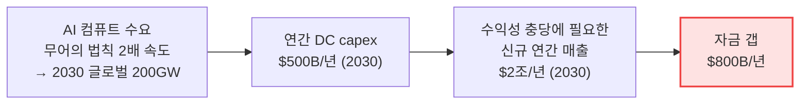

# AI 컴퓨트 경제학 갭 — Bain의 수요·자본·공급 프레임

빅테크의 AI 컴퓨트 수요가 **수익성 있게 충당 가능한가**를 자본(capex)·매출·공급 병목의 3축으로 정량화한 베인앤컴퍼니(Bain & Company)의 top-down 프레임. 본 위키의 기존 [ai-demand-sustainability.md](ai-demand-sustainability.md)가 "거품 심리" 논쟁(낙관 vs 비관 발언)을 다뤘다면, 이 페이지는 **그 논쟁을 숫자로 환산한 공급-수요-자금 경제학**을 담는다.

출처: Bain APAC 하드웨어·반도체·데이터센터 총괄 **신문섭(Moonsup Shin)** 파트너가 도메인 오너이며, 핵심 한 편인 [AI Ripple Effect(2026-03)](../../sources/articles/bain-ai-compute-semiconductor-2025-09-to-2026-03.md)는 신문섭 **공동저자**. 전체 시리즈·원본 URL은 [bain-ai-compute-semiconductor-2025-09-to-2026-03.md](../../sources/articles/bain-ai-compute-semiconductor-2025-09-to-2026-03.md).

관련: [ai-demand-sustainability.md](ai-demand-sustainability.md) · [ai-capex.md](ai-capex.md) · [ai-datacenter-buildout.md](ai-datacenter-buildout.md) · [energy-constraints.md](energy-constraints.md) · [hbm-market.md](hbm-market.md) · [semiconductor-cycle.md](semiconductor-cycle.md).

---

## 1. 컴퓨트 수요 → 자본 → 매출 갭 ($2T / $500B / $800B)

베인 6th Global Technology Report(2025)의 핵심 셈법 ([bain-ai-compute…md](../../sources/articles/bain-ai-compute-semiconductor-2025-09-to-2026-03.md) §①):

| 지표 | 수치 | 논리 |
|---|---|---|
| AI 컴퓨트 수요 성장 | **무어의 법칙 2배+** | 지난 10년 |
| 2030 글로벌 증분 컴퓨트 | **200 GW** | 전 세계 신규 |
| 2030 연간 DC capex | **$500B/년** | 수요 충족 설비투자 |
| 2030 필요 신규 매출 | **$2조/년** | capex를 **수익성 있게** 회수하려면 |
| **연간 자금 갭** | **$800B** | 온프레미스 IT 예산 전액 클라우드 이전 + AI 절감액 20% 재투자해도 남는 부족분 |

> "By 2030, technology executives will face deploying roughly **$500 billion in capital expenditures** while securing **$2 trillion in new revenue** to profitably satisfy demand." — David Crawford, Bain Global Technology Practice Chair

**해석**: $800B 갭은 AI 수요가 "거짓"이라는 뜻이 아니라, **현 매출화 속도로는 자본 회수가 빠듯**하다는 뜻. 갭이 메워지지 못하면 → 빅테크 capex 규율화(축소가 아닌 "선별") → 메모리 수요의 변동성. 위키의 [ai-capex.md](ai-capex.md) bottom-up(4사 합산 $650~725B, 2026)과 베인 top-down($500B/년 DC, 2030)은 **서로 다른 분모**(전자는 회사별 총 capex, 후자는 DC 건설 capex)이므로 직접 합산 금지.

---

## 2. 메모리 = AI 지출의 ~30% (2026, vs 2023~24 ~8%)

[AI Ripple Effect(2026-03)](../../sources/articles/bain-ai-compute-semiconductor-2025-09-to-2026-03.md) §②의 메모리사업부 직결 수치:

| 지표 | 수치 | 함의 |
|---|---|---|
| 메모리의 하이퍼스케일러 AI 지출 비중 (2026) | **~30%** | 2023~2024 **~8%**에서 급등 |
| AI의 글로벌 DRAM 공급 잠식 | **~20%** | HBM·GDDR7 등가 웨이퍼 환산 |
| 1GB HBM 웨이퍼 소비 (vs 표준 DRAM) | **4배** | 자원집약도 |
| 1GB GDDR7 웨이퍼 소비 | **1.7배** | |
| GPU 수요 2배 시 핵심 부품사 증산 요구 | **+30%+** | 동반 증산 압박 |

**메모리사업부 함의**: 메모리가 AI capex의 8%→30%로 구조적으로 올라섰다는 것은 HBM 슈퍼사이클의 **수요 측 정당화**다. 동시에 HBM·GDDR7의 웨이퍼 집약도(4배·1.7배)는 범용 DRAM 캐파를 잠식 → [semiconductor-cycle.md](semiconductor-cycle.md)·[hbm-market.md](hbm-market.md)의 "AI ~20% DRAM 웨이퍼 잠식"(TrendForce)·"HBM4 전환 시 4배 격차"(SemiAnalysis)와 정합. 베인 수치는 이를 **AI 지출 내 메모리 비중**이라는 별도 렌즈로 교차검증한다.

---

## 3. DC 전망 외부 앵커 + "Scramble → Strategy"

[DC Construction Crunch(2025-10) / From Scramble to Strategy](../../sources/articles/bain-ai-compute-semiconductor-2025-09-to-2026-03.md) §③:

| 지표 | 수치 | 비고 |
|---|---|---|
| 글로벌 DC 용량 수요 (2030) | **163 GW** | 현재의 ~2배 |
| 미국 DC 전력 (2030) | **409 TWh** / 미국 전력의 **9%** | 현재 ~4.5%·EIA 기준선 +150 TWh |
| 북미 집중도 | **~50%** | 글로벌 용량 |
| 프런티어 학습 메가캠퍼스 | **≥1 GW** 표준 | |

**"Scramble → Strategy" 테제**: 하이퍼스케일러가 "원시적 확장"에서 **"규율 있는, 전력 인식형(power-aware) 성장"**(자본 효율 중시)으로 전환. 단 투자 자체는 2025년 증가·향후 추가 성장(위축 예측과 배치). **추론(inference)이 워크로드 무게중심**. **전력 접근성이 GPU·건설을 넘어선 결정적 게이트키퍼** — behind-the-meter 발전(가스·태양광·원전)이 배치를 재편.

건설 지연: 인허가 장기화·장비 리드타임 **8~24개월**·계통 접속 **최대 5년**. 4대 처방(공기 최대 1년 단축): ① 부지 포트폴리오 ② 모듈러·프리팹 ③ 교차기능 설계+공급망 ④ 공급사 협업·대량 선구매.

**위키 착공 트래커 대비**: 본 위키 [ai-datacenter-buildout.md](ai-datacenter-buildout.md)는 대형(>200MW·>$1B) 표본 **55.9GW**를 추적(전수 아님). 베인 **163GW(2030 글로벌 전수 수요)**는 그 외부 상한 벤치마크 — 추적분이 전체의 일부임을 정량화. 9단계 모델의 ②인허가·⑤전력 병목은 베인의 "전력 게이트키퍼·계통 5년" 진단과 동일 구조.

---

## 4. 4대 공급 병목 (베인 분류)

DC를 충분히 빨리 못 짓는 이유 — 위키 [ai-datacenter-buildout.md](ai-datacenter-buildout.md) 9단계 병목과 매핑:

| 베인 병목 | 위키 9단계 매핑 | 비고 |
|---|---|---|
| ① 전력 공급 | ②인허가·계통, ⑤전력 인프라 | 신규 발전 가동 **4년+** |
| ② 건설 서비스 캐파 | ③·④ 부지·골조 | |
| ③ 컴퓨트 인에이블러 (GPU) | ⑦IT 장비 설치 | HBM 할당 binding |
| ④ DC 장비 (스위치기어·냉각) | ⑤·⑥ 전력·M&E | 리드타임 8~24개월 |

기타 거시: 중국이 글로벌 칩 제조 캐파의 **20%**. 양자컴퓨팅은 현 AI 워크로드 대체까지 **10~15년**(잠재 가치 ~$250B). 에이전트 AI는 기업 기술지출의 **최대 50%**로 이동 가능(선도 5~10%는 EBITDA +10~25%).

---

## 5. 시나리오 플래닝 연결고리

- **$800B 자금 갭이 빠르게 메워지지 않음** → 빅테크 capex 규율화·선별 → 수요 변동성 → 시나리오 **D(조용한 재편)** 신호. [demand-inflection-ewi.md](demand-inflection-ewi.md)의 공급 과잉/괴리 축과 연결.
- **메모리 = AI 지출 30%·전력 게이트키퍼로 수요 견조** → 시나리오 **A·B**(AI 지속) 우위 근거 보강.
- **"규율 있는 성장"** 테제는 RS-1(옵션형 캐파)·RS-5(재무 규율)·RS-9(수요 변곡 센싱)의 **외부 정합 근거** — 하이퍼스케일러가 스스로 자본 효율로 전환하므로, 메모리사도 무절제 증설 대신 옵션형·규율형 대응이 정당화됨 ([key-drivers.md](../driving-forces/key-drivers.md)).
- **거품론 균형추**: NBER·MIT의 ROI 미실현 비관([ai-demand-sustainability.md](ai-demand-sustainability.md))과 베인의 $800B 갭은 같은 "자본 회수 우려"를 다른 렌즈로 가리킴. 단 베인은 수요 자체는 견조(200GW·메모리 30%)로 봄 → **수요는 살되 자본 효율이 관건**이라는 중간 입장.

---

## 출처
- [sources/articles/bain-ai-compute-semiconductor-2025-09-to-2026-03.md](../../sources/articles/bain-ai-compute-semiconductor-2025-09-to-2026-03.md) — Bain 3개 시리즈 발췌 + 신문섭 인물 정보 + 전체 URL
- ① Bain 6th Global Technology Report (2025) — 컴퓨트 수요·자본·매출 갭
- ② The AI Ripple Effect: Managing Strained Semiconductor Supply (2026-03, **신문섭 공동저자**) — 반도체·메모리 공급 압박
- ③ Solving for AI's Data Center Construction Crunch (2025-10) / From Scramble to Strategy — DC 2030 전망·규율 성장
