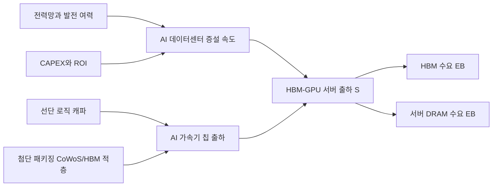
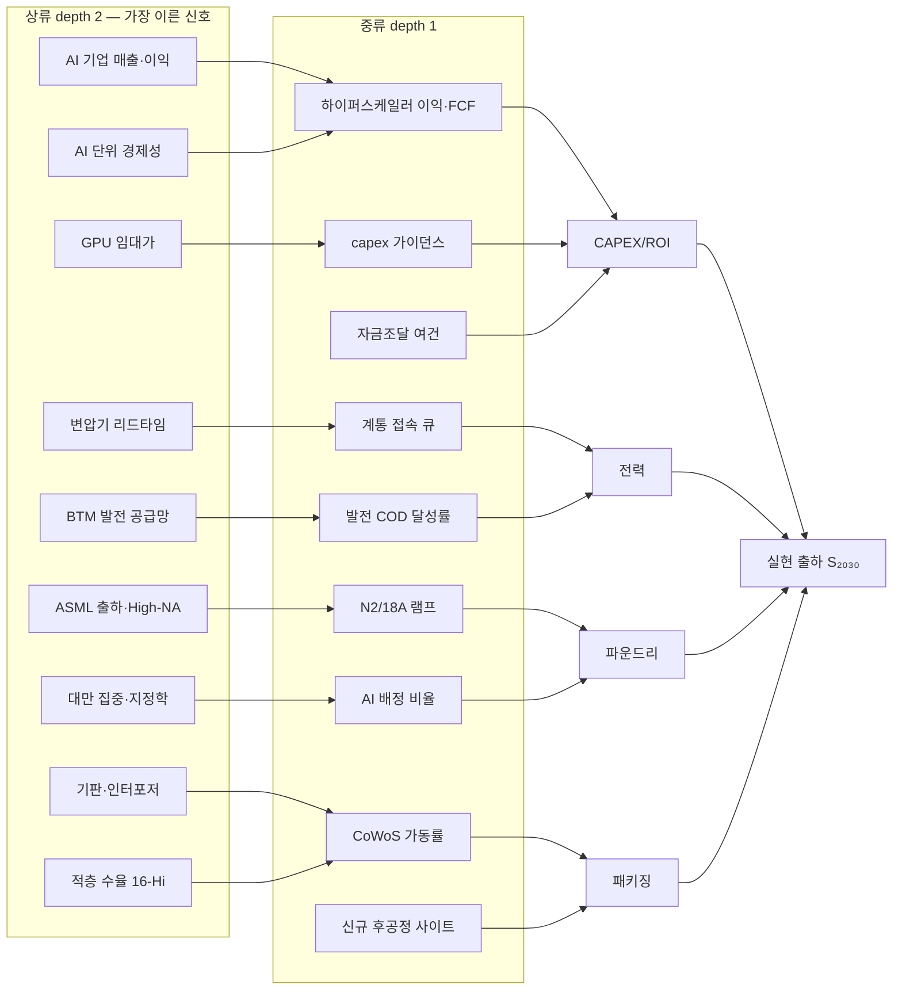

# 2030 병목 정량 모델 (Bottleneck Model 2030)

2030년 **HBM·AI 서버용 DRAM** 수급을 4대 병목 — **전력 · CAPEX/ROI · 선단 로직 파운드리 · 첨단 패키징(CoWoS/HBM 적층)** — 의 min() 제약으로 정량화한 운영 모델. 핵심 관점: 2030년 메모리 수요는 기술적으로 만들 수 있는 상한이 아니라 **"배치 가능한 상한"** — 돈·전기·웨이퍼·패키지 중 무엇이 먼저 막히는가 — 에 좌우된다 ([deep-research-2030-bottleneck-quant-model-2026-06.md](../../sources/papers/deep-research-2030-bottleneck-quant-model-2026-06.md)).

> 위키 내 위치: [ai-compute-economics-gap.md](ai-compute-economics-gap.md)(Bain top-down 자금 갭)이 "수요가 **돈이 되는가**"를, [demand-inflection-ewi.md](demand-inflection-ewi.md)(수요 변곡 EWI)가 "수요가 **꺾이는가**"를 본다면, 본 페이지는 "수요가 **물리적으로 실현 가능한가**"(상방 제약)를 본다. 셋이 합쳐 수요의 3면(경제성·방향·실현가능성)을 덮는다.
>
> 대시보드 미러: `dashboard/src/data/bottleneckModel.js` + `dashboard/src/components/BottleneckModel.jsx` (**Bottleneck Model 탭**). 병목 모델 화면 상단에 **모델 구조 도식**(상류 d2 → 중류 d1 → 4대 병목 → min() → 수급, 2026-06-11 추가). 수요 변곡 EWI는 같은 탭의 **별도 서브탭**으로만 운영 — 모델 프레임(도식·화면)에는 비표출 (2026-06-11 사용자 결정: 프레임 혼합이 자료 일관성을 해침).

---

## 1. 모델 구조

핵심 수식 (병목별 출하 상한의 최솟값이 실현 출하):

- **S₂₀₃₀ = min(U, S_power, S_capex, S_foundry, S_packaging)** — U는 병목이 없을 때의 잠재 수요
- **Sᵢ = S_base × (Bᵢ/B_base)^εᵢ** — 병목 자원 Bᵢ의 변화가 탄력도 εᵢ로 출하에 전달
- **HBM_EB = S × A × M / 10⁹** (A: 서버당 가속기 수, M: 가속기당 HBM GB)
- **DRAM_EB = S × D / 10⁶** (D: 서버당 DRAM TB)

**탄력도 priors**: 전력 **1.00**(물리량) · CAPEX **0.90**(ROI 악화 시 일부 지연·취소) · 파운드리 **0.85** · 패키징 **0.95**(다고객 할당·제품 믹스 흡수). 분기 재보정(ridge 제약) 전제의 운영용 초기값 ([deep-research-bottleneck-monitoring-dashboard-design-2026-06.md](../../sources/papers/deep-research-bottleneck-monitoring-dashboard-design-2026-06.md)).

### 기준 가정 (낮음 / 기준 / 높음)

| 변수 | 낮음 | 기준 | 높음 | 앵커 |
|---|---:|---:|---:|---|
| 2030 AI-optimized server 총출하 | 330만 대 | 410만 대 | 520만 대 | Gartner 2028년 300만 대 전망 연장 |
| 그중 HBM 탑재 GPU/ASIC 서버 비중 | 30% | 40% | 50% | 모델 가정 |
| 잠재 HBM-GPU 서버 수요 U | 99.0만 대 | 164.0만 대 | 260.0만 대 | 위 두 행의 곱 |
| 가속기 수/서버 A | 4 | 6 | 8 | DGX B200 8-GPU 등 |
| HBM 용량/가속기 M | 288GB | 384GB | 512GB | B200 1,440GB/8, MI355X 288GB, Rubin 288GB(HBM4), HBM4E 64GB 스택 |
| 시스템 DRAM/서버 D | 1.5TB | 2.0TB | 3.0TB | DGX B200 2TB |

---

## 2. 4대 병목 정량 (2030)

| 병목 | 자원 정의 | 낮음 | 기준 | 높음 | ε | 최악 하방 (HBM) |
|---|---|---:|---:|---:|---:|---:|
| **전력** | AI 집중형 DC 전력 (TWh) | 300 | 380 | 520 | 1.00 | **-0.61EB (-21.1%)** |
| **CAPEX/ROI** | 연간 AI 인프라 CAPEX (조 달러) | 0.90 | 1.37 | 1.80 | 0.90 | **-0.91EB (-31.5%)** |
| **파운드리** | AI 배정 선단 로직 캐파 (백만 장/년) | 0.62 | 0.75 | 0.95 | 0.85 | **-0.43EB (-14.9%)** |
| **패키징** | HBM 컴퓨트용 유효 CoWoS (백만 장/년) | 0.55 | 0.70 | 0.95 | 0.95 | **-0.59EB (-20.5%)** |

- **전력**: IEA 중앙 시나리오 2030 전 세계 DC 전력 ~**945TWh**, AI-focused 전력 2025~2030 **3배**. 기준 380TWh는 945TWh 중 AI 집중형 몫의 보수적 역산. 본질은 전기요금이 아니라 **접속 가능한 MW/GW의 실재적 한계**(인입·계통접속·변전·냉각이 서버 구매보다 느림). → [energy-constraints.md](energy-constraints.md)
- **CAPEX/ROI**: IEA 2025 DC 투자 ~$5,800억, 빅테크 AI 인프라 2025 $4,000억+ → 2026 $7,000억+. Goldman 경로: 2026 $7,650억 → 2031 $1.6조 (2026~31 누적 $7.6조). 네 병목 중 **최대 하방 민감도** — 금융조건 악화 시 "계획된 AI 팩토리"와 "착공된 AI 팩토리"의 괴리가 가장 먼저 수요를 꺾는다. → [ai-capex.md](ai-capex.md)
- **파운드리**: TSMC AI 가속기 매출 5년 중간 40%대 CAGR, 3nm 2026말 ~18만 장/월·2nm ~10만 장/월(TrendForce), 미국 추가 $1,000억(웨이퍼 팹 3 + 첨단 패키징 팹 2), ASML High-NA 2027 본격. 병목은 총 캐파가 아니라 **AI 서버 스택에 실제 배정 가능한 유효 캐파**. 하방은 작지만 **상방 시나리오에서 끝까지 남는 최종 병목**. → [../entities/tsmc.md](../entities/tsmc.md)
- **패키징**: TSMC CoWoS 2025 두 배 증설에도 "still fully loaded". TrendForce: 2026말 11.5만~14만 장/월 → 2027 ~17만 장/월. TSMC 애리조나 AP 2029 전, Amkor 애리조나 2028 초, SK hynix 인디애나 2028 말. 2026~27의 최예리한 운영 병목이지만 라인이 열리면 비교적 빨리 완화 — **2030년의 최종 상방 병목은 아님**.

**하방 위험 순서: CAPEX/ROI > 전력 ≈ 패키징 > 파운드리. 상방 최종 병목: 파운드리.**

---

## 3. 2030 수급 전망

### 수요 (병목 반영 후)

| 수요 | 낮음 | 기준 | 높음 |
|---|---:|---:|---:|
| 잠재 HBM-GPU 서버 수요 | 99.0만 대 | 164.0만 대 | 260.0만 대 |
| **실현 HBM-GPU 서버 출하** | **85.6만 대** | **125.0만 대** | **152.8만 대** |
| HBM 수요 | 1.97EB | **2.88EB** | 3.52EB |
| AI 서버용 DRAM 수요 | 1.71EB | **2.50EB** | 3.06EB |

기준 2.88EB는 Micron HBM TAM(2025 ~$350억 → 2028 ~$1,000억)·SK hynix "HBM 2030년까지 연 30% 성장"과 양립 — 공개 TAM 상방보다 약간 보수적인 **배치 물량** ([hbm-market.md](hbm-market.md)).

### 공급 (유효 캐파)

| 공급 | 낮음 | 기준 | 높음 |
|---|---:|---:|---:|
| HBM 생산능력 | 2.40EB | **2.95EB** | 3.80EB |
| HBM 재고 (finished+near-channel) | 2주 | 4주 | 7주 |
| AI 서버용 DRAM 생산능력 | 2.70EB | **3.30EB** | 4.10EB |
| AI 서버용 DRAM 재고 | 4주 | 6주 | 10주 |

### 공급사별 유효 캐파 (기준 시나리오, 모형 추정)

| 회사 | 공개 투자·로드맵 앵커 | HBM | AI 서버 DRAM |
|---|---|---:|---:|
| SK hynix | M15X 20조 원+, 인디애나 패키징 2028말, HBM4 양산 | **1.24EB** | 1.12EB |
| 삼성전자 | HBM 매출 2026 3배+, HBM4/HBM4E(48→64GB), 2nm 연계 | **0.94EB** | **1.32EB** |
| Micron | 미국 선단 메모리 $500억(2030까지), Idaho 2027·NY 2030+, HBM4E 2027 | 0.71EB | 0.79EB |
| 기타·중국 | export control·장비 접근성이 변수 | 0.06EB | 0.07EB |

각 사 exact stack/month·TSV throughput·KGD yield는 비공개 — **미지수**. 위 EB는 명판용량이 아니라 AI 데이터센터용 귀속 유효 캐파.

### 수급차 매트릭스 (＋초과공급 / －부족)

| HBM | 저공급 | 기준공급 | 고공급 |
|---|---:|---:|---:|
| 저수요 | +0.43EB | +0.98EB | +1.83EB |
| 기준수요 | -0.48EB | **+0.07EB** | +0.92EB |
| 고수요 | **-1.12EB** | -0.57EB | +0.28EB |

| AI 서버 DRAM | 저공급 | 기준공급 | 고공급 |
|---|---:|---:|---:|
| 저수요 | +0.99EB | +1.59EB | +2.39EB |
| 기준수요 | +0.20EB | **+0.80EB** | +1.60EB |
| 고수요 | **-0.36EB** | +0.24EB | +1.04EB |

**중심 상태**: HBM은 +0.07EB로 사실상 균형(극도 타이트), 서버 DRAM은 +0.80EB 완충. 단 고수요·저공급 stress에서 HBM -1.12EB — **물량 부족보다 가격 급등이 먼저 오는 구조**.

### 가격 균형 (정규화 가격지수, 상수탄력도 모형)

수요탄력도 HBM **-0.35** / DRAM **-0.50**, 공급탄력도 HBM **+0.60** / DRAM **+0.80**. 균형: p* = 100 × (D₀/S₀)^(1/(εs−εd)).

| 조합 | HBM 가격지수 | HBM 거래량 | DRAM 가격지수 | DRAM 거래량 |
|---|---:|---:|---:|---:|
| 저수요-저공급 | 81.4 | 2.12EB | 70.5 | 2.04EB |
| **기준-기준** | **97.5** | **2.91EB** | **80.8** | **2.78EB** |
| 고수요-고공급 | 92.3 | 3.62EB | 79.8 | 3.42EB |
| **고수요-저공급 stress** | **149.7** | 3.06EB | 110.0 | 2.91EB |
| 저수요-고공급 stress | 50.2 | 2.51EB | 51.1 | 2.40EB |

---

## 4. 모니터링 설계 (운영형 대시보드)

짝 문서([deep-research-bottleneck-monitoring-dashboard-design-2026-06.md](../../sources/papers/deep-research-bottleneck-monitoring-dashboard-design-2026-06.md))의 설계 요지. [rs9-demand-inflection-sensing.md](../strategies/invariant/rs9-demand-inflection-sensing.md)의 실행 청사진을 병목(상방 제약) 축으로 확장한다.

### 3층 아키텍처 + 혼합주기

- **관측층**: 공식 원문 우선 — 전력은 실시간 API(EIA-930·PJM Data Miner 2·ERCOT·ENTSO-E), 공시는 SEC EDGAR JSON/XBRL(10분 RSS)·OpenDART, 기업 IR(TSMC 월매출·ASML·Micron). 상용 리서치(Gartner·IDC·GS·MS)는 범위 보정·브리핑 보조층.
- **모형층**: 병목별 **유효 캐파 비율 q = 확보 자원/필요 자원** (수급 모형 직결) + **제약지수 I (0~100)** = 100·σ(α+Σwₖsₖ), sₖ는 robust z-score(MAD 기반, ±3 클립). q<1 = 구조적 부족, I = 불안정·악화 정도.
- **의사결정층**: 경보·시나리오·대응 매뉴얼 자동 매핑.

혼합주기: 전력 **분·시간** / CAPEX·ROI **일·분기** / 파운드리·패키징 **사건·월·분기** → nowcasting 통합.

### 경보 5단계

| 레벨 | 지수 | 확인 로직 |
|---|---|---|
| Green | < 40 | — |
| Yellow | 40~60 | 고빈도 2회 확인 |
| Orange | 60~75 | 고빈도 3-of-6 또는 공식 원문 2개 |
| Red | 75~85 | 중대 공식 이벤트 → 즉시 승격 + 수동확인 |
| Critical | > 85 | 단일 catastrophic event, 지연 없이 발동 |

단일 공식 원문(예: TSMC "still fully loaded"·ASML High-NA 지연·Micron sold-out 공지)은 통계 확인 없이 Red 이상 승격 사유. 허브 전력 순간 스파이크 1회는 경보 아님.

### 병목별 핵심 KPI (P1 = 공식 원문·자동수집 / P2 = 이벤트성 / P3 = 상용·추정)

| 병목 | P1 | P2 | P3 |
|---|---|---|---|
| 전력 | ISO/RTO 예비력·수요(5분~1h), Hub LMP, 접속 지연일수, grid event | 발전 COD 달성률, DC 부하 nowcast | 변압기·케이블 리드타임 |
| CAPEX/ROI | Hyperscaler capex 가이던스(공시), FCF/CapEx, TSMC 월매출 YoY, HBM sold-out horizon | HY/BBB OAS, 10Y 금리, AI 매출/CapEx | accelerated server 지출 비중 |
| 파운드리 | 노드 램프 상태(N2/18A), TSMC AI 모멘텀, ASML EUV/High-NA 출하·백로그, 장비 로직·메모리 분포 | AI-allocable capacity, 수율 프록시 | TrendForce 추정 |
| 패키징 | CoWoS 증설 마일스톤, utilization("fully loaded") | qualified CoWoS output, 신규 후공정 사이트(AZ·인디애나·싱가포르) 진척, HBM 세대 믹스, base-die readiness | TSV/KGD yield, substrate 타이트니스 |

지수 가중치(초기 expert prior): 전력 = 예비력 25·접속지연 25·LMP 15·COD 15·부하 nowcast 20 / CAPEX = 가이던스 30·FCF 20·신용 20·ROI 15·주문모멘텀 15 / 파운드리 = 램프 30·AI-allocable 25·ASML 20·수율 15·월매출 10 / 패키징 = qualified output 30·utilization 20·사이트 15·적층수율 20·substrate 15. 4~6분기 누적 후 제약회귀·Bayesian shrinkage로 갱신.

### 충격 시나리오 대응 매뉴얼 (기준선 대비 연환산)

| 시나리오 | 트리거 | 영향 (HBM / DRAM) | 즉시 대응 | 사전 대비 |
|---|---|---|---|---|
| 전력 급감 지속 | 상위 허브 2+ reserve margin <8%, LMP P90 초과 72h, 접속지연 >60일 | -0.61EB / -0.53EB (-21.1%) | 고전력 워크로드 순연·전력 가용 지역 재배치 | 장기 PPA·변압기 사전예약·허브 분산 |
| CAPEX 급감·금융경색 | hyperscaler capex 가이드 -15%+, FCF/CapEx <0.8, HY OAS 급등 | **-0.91EB / -0.79EB (-31.5%)** | 신규 투자 동결·take-or-pay 재협상 | 선금·cancellation fee·고객 신용 모니터링 |
| CoWoS 중단·인증산출 급감 | qualified output -15% WoW 2주, 대형 사이트 outage | -0.59EB / -0.51EB (-20.5%, 90일 지속 기준; 30일 ≈ 1/3) | 고마진 고객 우선 배정·OSAT 대체 검토 | CoWoS slot 옵션·substrate 안전재고·second-source |
| TSMC 선단 캐파 지연 | N2/A16 램프 1분기+ 지연, High-NA 삽입 지연 | -0.43EB / -0.37EB (-14.9%) | 출하모형 하향·node migration 점검 | 장기 wafer reservation·multi-foundry 설계 룰 |
| 복합 충격 | 전력 Red + CAPEX Orange 동시 1개월, 또는 파운드리·패키징 동시 Orange | -1.10~-1.35EB / -0.95~-1.15EB (-38~-47%) | 비상대책위·출하/계약/가격 일괄 재설정 | 복수 지역 전력·패키징·웨이퍼 옵션 |

---

## 5. 상류 드라이버 트리 (depth 1~2) — 더 이른 인지

4대 병목의 자원량은 결과 변수다. 각 병목에 **영향을 주는 상류 요소**를 depth 1(중류: 병목 자원을 직접 결정)·depth 2(상류: 중류를 움직이는 더 이른 원인)로 분해하면, 병목이 조여지기 **선행시차만큼 먼저** 수요 변화를 인지할 수 있다. 예: 하이퍼스케일러 CAPEX(병목)는 그들의 이익·FCF(d1)가 결정하고, 그 이익은 **AI 기업들(OpenAI·Anthropic·xAI·Google)의 매출·영업이익**(d2)이 결정한다 — AI 기업 매출이 꺾이면 12~18개월 후 CAPEX가 꺾인다.

### 드라이버 판정 체계

각 드라이버는 **제약 압력 4단계**로 판정한다 (병목을 조이는 방향이 악화): **완화**(15) · **중립**(40) · **긴장**(65) · **임계**(90). 괄호는 0~100 압력 점수 — 병목 제약지수·경보 5단계와 동일 스케일. 병목별 롤업: **선행 압력 = Σ(점수×가중치)/Σ가중치** (d1·d2 분리 산출). 판정값은 EWI와 동일하게 wiki 사실 기반 정성 판단(2026-06-11), 분기 재검토.

**조기경보 규칙**: ① **악화 예고** — 상류(d2) 압력이 현재 제약지수보다 +10 이상 높으면 선행시차 후 병목 심화 예상. ② **완화 예고** — d2가 현재보다 −15 이상 낮으면 완화 방향. ③ **상류-중류 괴리** — d2−d1 ≥ +10이면 중류는 아직 조용하나 상류가 먼저 꺾인 상태(가장 이른 경보). 2026-06-11 기준: CAPEX ③(+11)·파운드리 ③(+33)·패키징 ②(−15, 경계 발동).

### CAPEX/ROI 드라이버 (현재 제약지수 46 · d1 37 / d2 48)

| depth | 요소 | 선행시차 | 판정 | 근거 |
|---|---|---|---|---|
| 1 | 하이퍼스케일러 이익·FCF 커버리지 | 2~4분기 | 중립 ▼ | 빅4 FCF 견조하나 capex +77% 가속으로 커버리지 하락 — FCF/CapEx<0.8이 충격 트리거 ([ai-capex.md](ai-capex.md)) |
| 1 | capex 가이던스·발주 모멘텀 | 1~3분기 | 완화 ▶ | '26 $650~725B(+77%) 강세 (수요 EWI ②돈 `capex_guide` 연계) |
| 1 | 외부 자금조달 (HY OAS·사모신용·ABS) | 0~2분기 | 긴장 ▼ | 부채·SPV·ABS 의존 확대 — 스프레드 확대 시 급랭 (EWI `credit_spread` 연계) |
| 2→이익 | **AI 기업 매출·이익 (OpenAI·Anthropic·xAI·Google)** | 12~18개월 | 중립 ▶ | 클라우드 AI 매출 구조 성장(Google Cloud +63%·Azure +40%·AWS +28%, Q1 2026)·"AI 수익 실현 시작" vs MIT 95% ROI 미실현·프런티어 랩 적자 지속 ([ai-demand-sustainability.md](ai-demand-sustainability.md)) — 하이퍼스케일러 capex의 최상류 |
| 2→이익 | AI 단위 경제성 (토큰 원가 vs ARPU·구독 전환) | 12~24개월 | 중립 ▶ | 추론 효율 개선은 수요 촉진(추론 100배)과 단가 하락의 양날 — Bain: 수익성 충당에 $2조 매출 필요·$800B 갭 ([ai-compute-economics-gap.md](ai-compute-economics-gap.md)) |
| 2→가이던스 | GPU 임대가 (수요 청산가) | 9~18개월 | 긴장 ▼ | H100 현물 $2~3/GPU·h 둔화(Vast.ai 실측) — neocloud 경제성→GPU 발주의 최선행 (EWI `gpu_rental` 연계) |
| 2→자금조달 | 금리·텀스프레드 (10Y) | 0~6개월 | 중립 ▶ | 할인율·자본비용 환경 — FRED 일간 |

### 전력 드라이버 (현재 64 · d1 58 / d2 60)

| depth | 요소 | 선행시차 | 판정 | 근거 |
|---|---|---|---|---|
| 1 | 계통 접속 큐·지연일수 | 12~36개월 | 긴장 ▼ | 접속 지연 확대 — 송전 증설 선진국 4~8년 ([energy-constraints.md](energy-constraints.md)) |
| 1 | 발전 COD 파이프라인 달성률 | 6~18개월 | 긴장 ▶ | 계획 프로젝트 ~20% 지연 위험(IEA) |
| 1 | 허브 예비력·LMP | 0~3개월 | 중립 ▶ | 실시간 감시 축(EIA-930·PJM·ERCOT) — 현재 국지적 타이트 |
| 2→접속 | 변압기·HV 케이블 리드타임 | 18~36개월 | 긴장 ▼ | 대기시간 최근 3년간 2배(IEA) — 접속 지연의 물리적 원인 |
| 2→COD | BTM 발전 공급망 (가스터빈·SMR) | 24~48개월 | 긴장 ▼ | behind-the-meter 발전이 배치 결정 재편(Bain) — 터빈 슬롯·SMR 인허가 장주기 |
| 2→정책 | 전력요금 정치·지역 수용성 | 12~24개월 | 중립 ▼ | 요금 인상 반발·DC 신설 제한 움직임 — 접속 허가의 정치적 상류 |

### 파운드리 드라이버 (현재 56 · d1 15 / d2 48)

| depth | 요소 | 선행시차 | 판정 | 근거 |
|---|---|---|---|---|
| 1 | N2/18A 선단 램프 진척 | 6~12개월 | 완화 ▲ | N2 2026말 ~10만 장/월 확대 경로 순항 ([../entities/tsmc.md](../entities/tsmc.md)) |
| 1 | AI 배정 비율 (전통 수요와 캐파 경쟁) | 3~9개월 | 완화 ▶ | 스마트폰 -2.1% 약세 = AI 배정 여지 확대 — **교차 부호**: 수요 EWI에선 악재(전통 수요 약세), 병목엔 완화 |
| 2→램프 | ASML EUV/High-NA 출하·백로그 | 12~24개월 | 중립 ▶ | High-NA 2026말 HVM 요건 → 2027~28 고객 양산 삽입, 1Q26 장비 매출 로직 49:메모리 51 |
| 2→램프 | 선단 수율 프록시 (N2·18A) | 6~12개월 | 중립 ▶ | 비공개 — **미지수**, 범위 관리 |
| 2→배정 | 대만 집중·지정학 | 이벤트성 | 긴장 ▶ | AI 배정 선단 캐파의 70%가 대만(0.525/0.75) — 단일 충격점, 미국 분산은 2028+ |

### 패키징 드라이버 (현재 72 · d1 55 / d2 57)

| depth | 요소 | 선행시차 | 판정 | 근거 |
|---|---|---|---|---|
| 1 | CoWoS 가동률·증설 | 3~9개월 | 긴장 ▶ | 2025 두 배 증설에도 "still fully loaded" (EWI `cowos` 연계) |
| 1 | 신규 후공정 사이트 진척 | 12~30개월 | 중립 ▲ | Amkor AZ 2028 초·SK 인디애나 2028 말·TSMC AZ 2029 전 — 일정 진행 |
| 2→가동률 | 기판·인터포저 (ABF) | 6~18개월 | 긴장 ▶ | 2.5D 부족의 연쇄 병목(TrendForce) — 2027부터 완화 전망 |
| 2→가동률 | HBM 적층·테스트 수율 (TSV/KGD·16-Hi) | 6~12개월 | 긴장 ▼ | HBM4 16-Hi 전환 난도 상승(Micron 자격 이슈 등) — **미지수** 플래그 |
| 2→사이트 | HBM 세대 전환 믹스 (HBM4→4E 램프) | 6~12개월 | 중립 ▶ | 세대 전환기 유효 산출 일시 감소 — 3사 IR 추적 |

### 종합 판독 (2026-06-11)

- **CAPEX**: 중류(가이던스 강세)는 조용하나 **상류가 먼저 악화**(d2 48 > d1 37) — GPU 임대가 둔화·자금조달 긴장이 12~18개월 후 capex 둔화 리스크. AI 기업 매출이 최상류 감시 대상 (**상류-중류 괴리 경보**).
- **전력**: 상류·중류·현재가 모두 60 안팎 — 이미 반영된 구조적 긴장, 추세도 악화. 변압기·BTM 공급망(d2)은 18~48개월 장주기라 단기 해소 없음.
- **파운드리**: 운영(d1 15)은 완화 중이나 구조 리스크(d2 48 — 지정학·수율 미지수)는 잔존 — d2−d1 +33 **상류-중류 괴리**. 평시엔 가장 여유, 이벤트엔 가장 취약.
- **패키징**: 유일하게 **상류가 현재보다 낮음**(d2 57 < 현재 72, −15 — 완화 예고 경계 발동) — 신규 사이트·기판 완화가 진행되면 2027~28 완화 방향 (**완화 예고**). 단 16-Hi 수율(▼)이 변수.
- **수요 변곡 EWI와의 관계 (분리 운영)**: 수요 EWI의 ①수요청산가(GPU 임대가)·②돈(capex·신용)·③발주(CoWoS) 신호는 본 트리의 CAPEX·패키징 상류와 동일 사실을 다른 프레임(수요 방향 ↔ 제약 압력)으로 읽는다 — 위키 차원의 교차참조는 유지하되, **대시보드 모델 프레임에는 EWI를 표출하지 않는다**(2026-06-11 사용자 결정: 두 온톨로지 혼합이 자료 일관성을 해침). EWI는 Bottleneck Model 탭의 별도 서브탭으로만 접근.

### 종합 판독 업데이트 (2026-06-12) — 제약지수 재보정

최신 데이터(Samsung Q1 2026 실적, TrendForce Q2 가격, TSMC N2 예약 상황, CoWoS 증설 진척, IEA 전력 최신치)를 반영해 제약지수를 재보정.

| 병목 | 이전 (06-11) | **신규 (06-12)** | **변동** | 핵심 근거 |
|---|---:|---:|---:|---|
| 전력 | 64 | **66** | **+2** | IEA: 2026년말 전 세계 DC 전력 1,000 TWh 돌파(종전 2030 전망 조기 달성); 랙 밀도 50 kW+ 일상화로 계통 부하 가속 |
| CAPEX/ROI | 46 | **43** | **-3** | 2026 총 컴퓨트 capex $1.04조(첫 $1T 해) 확인; Samsung·빅4 Q1 실적 강세(AI cloud 매출 +28~63%); 단 GPU 임대가 $2.95 중앙값(2024 $7+에서 57% 하락)이 선행 약세 신호 |
| 선단 파운드리 | 56 | **63** | **+7** | TSMC N2 2026·2027 100% 예약 완료(리드타임 78~104주); Apple이 N2 물량 48~50% 독점 → AI 배정 여지 예상보다 크게 축소; 이전 "AI 배정 여지 확대" 판정 철회 |
| 첨단 패키징 | 72 | **67** | **-5** | CoWoS 35K wpm(2024말) → 130K wpm(2026말), 4배 확장; OSAT 위탁 240~270K장/년(Amkor+SPIL) 본격 가동; 완화 방향 실증 데이터 확보 |

**핵심 변화**:
1. **파운드리 인식 전환** — d1 '완화'에서 '긴장'으로 격상. Apple 독점이 AI 배정을 오히려 더 타이트하게 만드는 구조. 단, 이는 운영 층(d1)의 변화이며, 2026 캐파 확장 자체는 진행 중.
2. **패키징 완화 진행 실증** — 130K wpm 달성 경로 확인으로 지수 하향. 수율(16-Hi)은 여전히 미지수(플래그 유지).
3. **전력 소폭 상향** — IEA 2030 전망치(945 TWh)를 2026년에 이미 초과하는 구조 — 종전 모델의 전력 기준 380TWh(2030 AI-focused 몫)가 다소 보수적이었을 가능성 주의.
4. **CAPEX 하향** — 단기 지출 강세이나, GPU 임대가 하락(선행 9~18개월)이 자본효율 재평가 시작 신호. 지수는 낮아졌지만 d2 GPU 임대가 드라이버의 '긴장 ▼' 판정 유지.

**출처**: [web-research-market-update-2026-06-12.md](../../sources/articles/web-research-market-update-2026-06-12.md)

## 6. 시나리오 연결 + 한계

- **[시나리오 B "AI 르네상스"](../scenarios/scenario-B.md)** (Main Bet): 기준~높음 경로. HBM 거의 균형(+0.07EB)·가격 타이트 유지 — Main Bet의 수익성 전제를 정량 뒷받침. 단 상방에서도 152.8만 대에서 멈춤(파운드리) — 호황 참여 전략(RS-8)의 상한 인식.
- **[시나리오 A "황금 요새"](../scenarios/scenario-A.md)**: 디커플링 시 중국 캐파(0.06EB) 이탈 + 파운드리 지역 분해(대만 0.525/미국 0.112) 재배분 리스크.
- **[시나리오 C·D (AI 붕괴)](../scenarios/scenario-C.md)**: CAPEX/ROI 하방(-31.5%)이 진입 경로 — 본 모델의 CAPEX 트리거(가이드 -15%·FCF/CapEx<0.8·HY OAS)가 C/D 전환 EWI와 동일 축.
- **전략 함의**: 2030 승자의 조건 = ① 전력을 먼저 확보하고 ② 장기계약으로 CoWoS·선단 로직을 잠그고 ③ ROI가 흔들려도 CAPEX를 지속할 수 있는가. D-결정·RS 전략의 우선순위 검증 프레임.
- **한계(미지수)**: ① TSMC·삼성·Intel의 2030 AI-allocatable WSPM 비공개 ② CoWoS package-per-wafer·고객별 할당 비공개 ③ hyperscaler ROI 기준·private credit은 매크로 민감 ④ 중국 선단 진전은 규제 의존. 모든 수치는 정답표가 아니라 **상한·하한이 있는 구조적 시뮬레이션** — 탄력도·가중치는 분기 재보정 대상.

## 출처

- [sources/papers/deep-research-2030-bottleneck-quant-model-2026-06.md](../../sources/papers/deep-research-2030-bottleneck-quant-model-2026-06.md) — 4대 병목 정량 모델·수급·가격 균형 (본 페이지 수치의 전거)
- [sources/papers/deep-research-bottleneck-monitoring-dashboard-design-2026-06.md](../../sources/papers/deep-research-bottleneck-monitoring-dashboard-design-2026-06.md) — KPI 체계·제약지수·경보·대응 매뉴얼·PoC 계획
