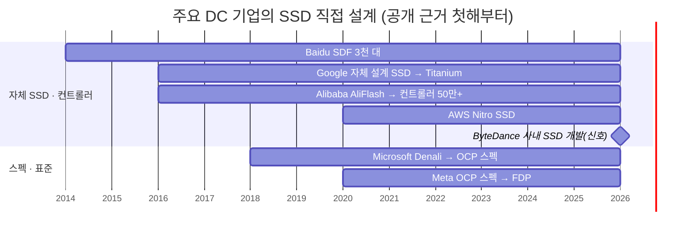

# 주요 데이터센터 기업의 자체 SSD · 공동 설계: 이미 시작된 흐름

> 사용자 질문(2026-10-07): "아마존이나 중화 DC 업체들은 자체 SSD를 개발해서 시스템과 연동하여 최적화하려는 움직임이 있다고 들었어. 팩트 체크해서 시각화까지 진행해 줘." 덱 3장 3칸(고객 시스템과 공동 설계)의 근거 페이지다.

**한 줄 요약**: 미국 · 중국의 주요 데이터센터 기업 7곳이 2014년부터 차례로 SSD를 직접 설계하거나(Baidu · Google · Alibaba · AWS · ByteDance) SSD 스펙 · 표준을 직접 썼다(Microsoft · Meta). 다만 "자체 SSD"의 깊이는 회사마다 다르다. 자체 컨트롤러 칩까지 공개 근거가 있는 곳은 Alibaba뿐이고, AWS는 자체 설계 SSD와 자체 FTL이지 자체 컨트롤러 칩의 근거는 없다. Tencent는 공개 근거가 없다. 근거 원장: [dc-in-house-ssd-co-design-2026-10.md](../../sources/articles/dc-in-house-ssd-co-design-2026-10.md)(US-01~29, CN-01~25).

⚠️ **등급**: 이 조사에서 원문을 연 곳은 Google 블로그 · GitHub뿐이다. AWS · Alibaba · Baidu · OCP 수치는 1차 출처 URL의 검색 스니펫(🟡ᴾ) 또는 2차 언론(🟡)이다. 회사 측 주장 수치는 "주장"으로 읽는다.

## 1. 회사별로 무엇을 직접 하나

| 회사 | 공개 근거 첫해 | 직접 하는 것 | 대표 근거 | 등급 |
|---|---|---|---|---|
| **Baidu** | 2014 | 자체 SSD(SDF, FPGA 기반 보드) · 자체 펌웨어 · 시스템 공동 설계 | ASPLOS'14: 채널을 호스트에 노출, 원시 대역폭 약 95% · 용량 99% 사용(상용 SSD는 대역폭 40% 이하), I/O 대역폭 +300% · GB당 비용 -50%, **3,000대 이상** 배치(CN-14). 이후 자료 없음(CN-16) | 🟡ᴾ |
| **Google** | 2016 | 자체 설계 SSD(상용 플래시 칩 + 자체 PCIe 인터페이스 · 펌웨어 · 드라이버) → Titanium SSD | FAST'16 "custom designed high performance solid state drives"(US-12 🟡ᴾ) · Titanium SSD "custom designed by Google", 접근 지연 최대 -35%(이전 세대 Local SSD 대비, 2025-01, US-14 ✅) · Z4D 15.6M IOPS(2026-09, US-16 ✅). 컨트롤러 · 제조사는 미공개 | ✅ / 🟡ᴾ |
| **Alibaba** | 2016 | 자체 SSD(AliFlash V1~V3) · Dual-mode SSD · AOC 스펙(벤더 5곳) · **자체 컨트롤러 칩**(AliFSC 2018 "customized", 镇岳510 2023) | AliFlash V1 **5만 대 이상**(2016년 말, CN-01) · Dual-mode 읽기 지연 -75%(주장, CN-04) · 镇岳510 PCIe 5.0 · RISC-V(2023-10/11, CN-06), EBS 등 규모 배포 · **누적 출하 50만 개 이상**(2026-03, CN-10, 내부 · 외판 비중 미공개) | 🟡ᴾ / 🟡 |
| **Microsoft** | 2018 | 스펙 공동 설계(Project Denali, OCP Cloud SSD 스펙 공저) · 오프로드 하드웨어(Azure Boost FPGA → ASIC/DPU) | Denali: 미디어 관리는 드라이브, 주소 맵 · GC는 호스트(2018-03, US-20) · OCP v1.0 공저(2020, US-27) · Azure Boost 로컬 6.6M IOPS(US-21 ✅). **자체 SSD · 컨트롤러 근거 없음** | ✅ / 🟡ᴾ |
| **Meta** | 2020 | 스펙 · 표준 공동 설계(OCP Cloud SSD 스펙 주저자, FDP의 Direct Placement Mode) | OCP v1.0 2020-03(US-27) · FDP TP4146 비준 2022-11-30(US-19 ✅) · CacheLib FDP WAF 3.22 → 1.03(US-25 ✅, 구현 · 논문은 삼성 엔지니어, Meta는 업스트림 반영 US-26) | ✅ / 🟡ᴾ |
| **AWS** | 2020(프리뷰) · 2021(공개) | **자체 설계 SSD(Nitro SSD) · 자체 FTL · 펌웨어**, NAND 멀티소싱 | "custom-designed by AWS"(US-03) · "rewrote the whole FTL"(US-04) · I3 대비 지연 최대 -60% · 변동성 -75%(US-02) · 3세대 120TB · 5.2M IOPS(US-06 · US-10). **채용공고에 "SSD controller vendor" 협업 문구 → 자체 컨트롤러 칩은 ❌**(US-08) | 🟡ᴾ |
| **ByteDance** | 2026 | 사내 SSD 개발 조직(요구 분석 · 펌웨어 설계 · 제품 납품) | FMS 2026 연사 소개 "in charge of in-house SSD development … firmware design/development"(CN-21). 자체 컨트롤러 근거 없음(CN-23) | 🟡ᴾ |
| Tencent | - | 근거 없음 | 자체 칩 3종에 SSD 컨트롤러 없음(CN-17), Intel과 시스템 최적화(CN-18) | ❌ |

## 2. 시각화: 공개 근거 첫해부터의 막대 (덱 3장 3칸)

덱 v2.2(2026-10-07, 사용자 지시 "업체가 너무 많으니 주요 업체만")부터 슬라이드에는 근거가 가장 분명한 **Google · Alibaba · AWS** 3사만 그린다. 아래 7사 그림은 위키 · 보고서 §3.4용이다.

**독해(⚠️ 과제팀 해석)**
- 2014년 1곳에서 2026년 7곳으로 늘었다. 미국 4곳 중 4곳, 중국 4곳 중 3곳(Tencent 제외)이 어떤 형태로든 SSD 설계에 직접 들어왔다.
- 깊이는 셋으로 갈린다. ① 컨트롤러 칩까지(Alibaba) ② SSD 설계 · FTL · 펌웨어까지(AWS · Google · Baidu · ByteDance) ③ 스펙 · 표준까지(Microsoft · Meta). 공통점은 **SSD 동작을 자기 시스템에 맞춰 정하려 한다**는 것이다.
- 근거가 회사 쪽 수치다. AWS -60%는 이전 세대 인스턴스 대비, Alibaba 50만 개는 외판 포함, Baidu +300%는 Baidu 기존 상용 SSD 시스템 대비다.
- 공급자에게 주는 뜻: 고객 시스템 안의 결정(배치 · 수명 · 지연 정책)이 SSD 가치를 정하는 흐름이 이미 진행 중이다. 공동 설계의 형태는 [ssd-core-technologies-customer-collaboration.md](ssd-core-technologies-customer-collaboration.md)(스펙으로 협력 대 공동 설계 필수)와 [solution-ladder-component-to-system.md](solution-ladder-component-to-system.md)(3단계 공동 설계)로 이어진다.

## 3. 기존 위키 정정 (2026-10-07)

| 기존 서술 | 정정 | 근거 |
|---|---|---|
| "AWS Nitro SSD = 자체 컨트롤러 자작 SSD"([fdp-host-ssd-platform.md](../strategies/fdp-host-ssd-platform.md) §2, 대시보드 captiveSteps) | 자체 설계 SSD(FTL · 펌웨어 자체, NAND 멀티소싱), 컨트롤러 실리콘 출처 미공개 · 외부 벤더 협업 정황 | US-03 · US-04 · US-07 · US-08 |
| "AWS가 2017년부터 자체 SSD" | 가장 이른 근거는 io2 Block Express 프리뷰 2020-12, 공식 공개 2021-11-30 | US-01 · US-02 |
| "CacheLib FDP 3.22 → 1.03 = Meta + 삼성 공동 논문" | 구현 · 논문(EuroSys'25)은 삼성 엔지니어, Meta는 CacheLib 업스트림 리뷰 · 머지. 수치 자체는 CacheLib 공식 문서로 ✅ | US-25 · US-26 |
| "FDP 2023 비준" | TP4146 비준 2022-11-30 ✅. "6개월 만에 · 삼성 공동 주도"는 1차 자료 미확인 | US-19 |
| "Disks for Data Centers가 SSD 신설계 요청" | HDD 대상 백서 | US-13 ✅ |
| "镇岳510 2022-11 발표" | 2023 云栖大会(2023-10-31~11-02) | CN-06 |

## 4. 연결

- 해법 사다리(3단계 공동 설계): [solution-ladder-component-to-system.md](solution-ladder-component-to-system.md)
- 통제권 상승 프레임(Captive): [fdp-host-ssd-platform.md](../strategies/fdp-host-ssd-platform.md) §2
- 협력 깊이 판정: [ssd-core-technologies-customer-collaboration.md](ssd-core-technologies-customer-collaboration.md)
- SSD 혼자 이룬 성장과 DWPD: [essd-decade-growth-vs-dwpd.md](essd-decade-growth-vs-dwpd.md)
- 산출물: [ssd-future-ready-strategy-report.md](../../outputs/report/ssd-future-ready-strategy-report.md) §3.4 · 덱 3장 3칸
