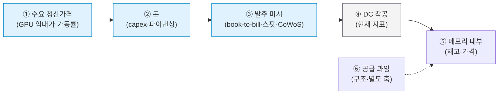

# 메모리 수요 변곡 조기경보 (Demand-Inflection EWI)

메모리 수요의 *하락 변곡*을 최대한 **먼저** 잡기 위한 인과-사슬 선행지표 체계. DC 착공 추적([ai-datacenter-buildout.md](ai-datacenter-buildout.md))을 *대체*하는 게 아니라, 착공을 인과 사슬의 *제자리*에 놓고 그보다 **왼쪽(선행)·오른쪽(미시)·공급 과잉** 신호로 둘러싸 변곡을 먼저 포착한다.

> 핵심: **DC 착공은 사슬 중간의 끈적한(committed) 지표** — 미래 수요 *규모*엔 좋지만 *하락 변곡* 탐지엔 느리다. 약정된 건설은 수요가 식어도 진행되기 때문. 따라서 더 정확한 조기탐지 = 단일 지표가 아니라 **앙상블 + 괴리(divergence) + 공급 축**.

단일 소스: dashboard `Data Viz > 수요 EWI` 탭(`dashboard/src/data/demandSignals.js`) + EWI 5종(`dashboard/src/data/indicators.js`). 관련: [semiconductor-cycle.md](semiconductor-cycle.md) · [ai-demand-sustainability.md](ai-demand-sustainability.md) · [ai-capex.md](ai-capex.md) · [ai-server-demand.md](ai-server-demand.md).

---

## 1. 인과 사슬 (하락 신호는 →로 전파)

착공보다 **왼쪽(①②③)**이 선행하고, **⑤ 메모리 내부** 미시신호(스팟·재고)는 매출/계약가보다 선행한다. **⑥ 공급 과잉**은 별도 구조 축 — 메모리 하락은 수요만큼 공급에서 터진다.

---

## 2. 계층별 신호 (선행도·출처·트리거)

| 단계 | 신호 | 선행 | 출처 | 하락 트리거 | EWI |
|---|---|---|---|---|---|
| ① 수요 청산가 | GPU 임대가 추세 | 9~18개월 | Vast.ai·ClusterMAX | 6개월 -35% 급락 | `gpu_rental_price_trend` |
| ① | AI 컴퓨트 가동률 | 9~18개월 | SemiAnalysis | 유휴율 상승 | — |
| ② 돈 | 하이퍼스케일러 capex 가이던스 | 6~12개월 | 빅4 콜 | 증가율 둔화·"digestion" | — |
| ② | AI-DC 신용 스프레드 | 6~12개월 | 채권·SPV·사모신용 | +150bps 확대 | `ai_dc_credit_spread` |
| ② | 착공 취소·연기 건수 | 6~12개월 | DCD 등 | 분기 5건+ | `dc_cancellation_count` |
| ③ 발주 미시 | 메모리 book-to-bill | 3~9개월 | SEMI | <1 하락 | — |
| ③ | 메모리 리드타임 | 3~9개월 | 채널 | 급단축(부족 해소) | — |
| ③ | 스팟-계약가 괴리 | 1~3개월 | DRAMeXchange | 스팟 계약 -10% 하회 | `spot_contract_spread` |
| ③ | CoWoS 가동률 | 3~9개월 | TSMC | 발주 둔화 | — |
| ④ 착공 | 신규 착공 파이프라인 | 3~12개월 | ai-datacenter-buildout | 신규 GW 급감 | (DC 트래커) |
| ⑤ 메모리 | 재고일수 | 0~3개월 | TrendForce·IR | 12주+ 급증 | `memory_inventory_days` |
| ⑤ | DRAM vs HBM 이익률 역전 | 0~6개월 | Counterpoint | DRAM OPM>HBM | `dram_opm_vs_hbm_opm` |
| ⑤ | 전통 수요(스마트폰 YoY) | 0~3개월 | Counterpoint | 추가 악화 | `smartphone_shipment_yoy` |
| ⑥ 공급 | bit 공급 vs 수요 밸런스 | 12~18개월 | 3사 capex·웨이퍼 | 공급>수요 | — |
| ⑥ | CXMT 범용 공급 | 12~18개월 | cxmt 위키 | ASP 격차 확대 | `cxmt_asp_gap` |

각 신호의 현재 레벨(확장/중립/주의/수축)은 대시보드에서 정성 판단값으로 운용(EWI와 동일, 실시간 피드 연동은 다음 단계).

---

## 3. 괴리(divergence) 로직 — 행동 윈도우

단일 지표가 아니라 **선행 신호 위험 − 끈적 신호 위험**의 괴리를 본다.
- **선행(①②③)이 먼저 꺾이는데 끈적(④착공·⑤메모리)은 아직 강함** → 그 *갭*이 곧 **하락 전 대응 윈도우**.
- 복합 위험 점수(0 안전~100 위험) = 신호 레벨 × 가중 평균. 밴드: 양호<25 · 주의<50 · 경계<75 · 위험≥75.

**2026-06 시점 판단**: 복합 ~36(주의). 선행 33 · 끈적 29 · 공급 68(경계). 괴리 +4 — 선행이 소폭 먼저 악화(GPU 임대가·착공 취소·리드타임 정점)하나 본격 변곡 전. 공급 과잉이 구조적 경계.

---

## 4. 샤프 드롭(급락) 메커니즘

- **더블오더링/불휩 언와인드**: 부족기 공포성 과잉발주(LTA·선급금) → 가용성 정상화 시 가짜 백로그 일시 증발. **"부족 신호의 정점"(리드타임·할당 정점)이 역설적으로 급락 셋업** — 현재 HBM sold-out·LTA·선급금이 바로 이 상태.
- **효율 혁신 에어포켓**: DeepSeek류 토큰당 컴퓨트 급감 → Jevons 미흡 시 수요 에어포켓.
- **파이낸싱 프리즈 / capex digestion**: 대형 하이퍼스케일러 capex 컷 연쇄.

---

## 5. 시나리오 연결 + 한계

- **DF1(AI 수요)** 하락 변곡의 선행 관측 ([key-drivers.md](../driving-forces/key-drivers.md)). 괴리 경보 = 시나리오 **D(조용한 재편)**·거품론 트리거.
- 신규 EWI 5종은 시나리오 시그널 `['D','C']`로 연결.
- **한계**: 가동률·고객 재고 불투명, GPU 임대가 노이즈 큼, 효율 혁신 예측 불가. 확실성이 아니라 **리드타임 최대화 + 앙상블 + 괴리**가 목표.

---

## 출처
- [sources/raw-notes/demand-inflection-ewi-2026-06.md](../../sources/raw-notes/demand-inflection-ewi-2026-06.md) — 방법론·계층·출처 정리
- 사실 앵커: [ai-capex.md](ai-capex.md) · [ai-datacenter-buildout.md](ai-datacenter-buildout.md) · [price-trends.md](price-trends.md) · [semiconductor-cycle.md](semiconductor-cycle.md) · [ai-server-demand.md](ai-server-demand.md) · [cxmt.md](../entities/cxmt.md)
- 신규 참조: SemiAnalysis ClusterMAX, TrendForce DXI, SEMI book-to-bill, TSMC CoWoS, AI-DC 파이낸싱(Oracle·CoreWeave·Blue Owl-Meta SPV)
