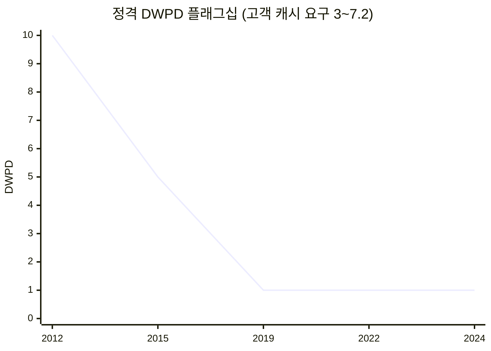

# SSD 혼자 이룬 10~15년 성장과, 오르지 않은 DWPD

> 사용자 지시(2026-10-07): "지금까지 SSD 최적화를 통해 진전이 있었던 데이터를 수집하여 그래프로 시각화 … 성능, 파워와 가성비 지표를 선정하여 지난 10~15년 동안 어떻게 성장하였는지 … SSD 내부 최적화만으로도 이 정도로 성장을 했다. 하지만 DWPD는 개선이 어려운 상황이다라는 메시지를 던지기 위한 전 단계." 덱 3장 계단 위 그래프 4개의 근거 페이지다.

**한 줄 요약**: 2010~2026년 데이터센터 SSD는 SSD 안의 혁신(NAND 세대 · 컨트롤러 · 인터페이스 세대)만으로 랜덤 읽기 성능 약 90배, 와트당 성능 약 13배, 1달러당 NAND 용량 약 24배가 늘었다. 같은 기간 정격 DWPD는 고내구 10에서 플래그십 1로, QLC는 0.26~0.6으로 내려왔고, 고객 캐시 계층은 하루 3~7.2회를 쓴다. 근거 원장: [essd-growth-metrics-2010-2026-2026-10.md](../../sources/articles/essd-growth-metrics-2010-2026-2026-10.md)(GR-01~85).

⚠️ **등급**: 원문 데이터시트 · PDF를 열지 못해 **모든 값이 검색 스니펫(🟡)** 이다. 덱에 쓰기 전 PM1733 · PM1743 브로슈어, Lenovo LP1300 · LP1712, LoC DSA 2018~2025 PDF를 원문으로 대조해야 한다.

## 1. 네 지표 (덱 3장에 그린 점)

| 지표 | 점 (연도, 값) | 배율 | 근거 |
|---|---|---|---|
| 성능: 4K 랜덤 읽기 (K IOPS, U.2 · E3.S x4) | 2012 Intel DC S3700 75 · 2015 PM1725 750 · 2019 PM1733 1,500 · 2022 PM1743 2,500 · 2024 PM1753 3,300 · 2026 PM1763 6,800 | **약 90배** | GR-01 · 06 · 09 · 11 · 13 · 15 |
| 전력 효율: 순차 읽기 MB/s per W | 2012 83 · 2015 124 · 2019 350(20W 기준) · 2022 608(삼성 공표) · 2026 1,120(Gen6, Micron 9650 공표 · PM1763 "1.8배" 주장과 같은 수준) | **약 13배** | GR-20 · 24 · 27 · 29 · 31 · 32 |
| 가성비: 1달러로 사는 NAND GB (IBM Storage Landscape, NAND 매출 ÷ 출하 비트, 명목) | 2010 0.56 · 2013 1.6 · 2016 3.1 · 2018 4.0 · 2020 7.8 · 2022 10.5 · 2023 20(사이클 저점) · 2024 13 | 2010 → 2024 **약 24배** | GR-40 ~ 50 |
| 정격 DWPD | 플래그십 2012 S3700 10 · 2015 PM1725 5 · 2019 PM1733 1 · 2022 PM1743 1 · 2024 PM1753 1 / QLC 2021 P5316 0.41 · 2024 BM1743 0.26 / 고객 캐시 요구 3~7.2 | **10 → 1** | GR-70 · 77 · 80 · 82 · 85 · 81 · 84, 고객 [ssd-customer-high-dwpd-evidence-2026-10.md](../../sources/articles/ssd-customer-high-dwpd-evidence-2026-10.md) |

## 1.5 출시 제품 226개 등급의 정격 DWPD (덱 3장 점도표, 2026-10-07)

> 사용자 지시(2026-10-07): "여러 그래프 그리지 말고 DWPD 그래프 하나로 해 주면 될 것 같아. 지난 십수 년간 출시한 SSD들에 대하여 DWPD 값이 어떻게 변화해 왔는지 조사를 해서 점도표로 표현을 해 줘." 덱 v2.3부터 3장 계단 위는 이 점도표 하나다(성능 · 전력 효율 · 가성비 그래프는 이 페이지 §1에만 남김).

6개 업체(Samsung · Intel/Solidigm · Micron · Kioxia/Toshiba · SK hynix · WD/HGST/SanDisk)의 데이터센터 SSD 226개 등급(RI · MU · WI 변형 각각), 5년 보증 기준 환산, QLC · 용량형은 랜덤 쓰기 기준. 근거: [essd-rated-dwpd-products-2008-2026-2026-10.md](../../sources/articles/essd-rated-dwpd-products-2008-2026-2026-10.md)(모두 🟡 · ⚠️), 데이터 [essd_dwpd_points.json](../../outputs/presentation/assets/essd_dwpd_points.json).

| 기간 (특수 제품 제외) | 등급 수 | 중앙값 DWPD | 10 이상 비중 | 최대 |
|---|---|---|---|---|
| 2008~2012 | 9 | 10 | 67% | 50 |
| 2013~2015 | 45 | 3 | 38% | 45 |
| 2016~2018 | 61 | 1.5 | 7% | 10 |
| 2019~2021 | 46 | 1 | 2% | 10 |
| 2022~2026 | 51 | 1 | 0% | 5 |

- 2016년 이후 30 이상은 SLC · SCM 특수 제품뿐(Optane P4800X 30 · 60, P5800X 100, Z-SSD 30, FL6 60, D7-P5810 50, XTR 35). 주력 TLC는 1(읽기 위주) · 3(혼합), QLC는 0.2~0.6.
- 표본 한계: 출시 등급의 단순 집계(판매량 가중 아님), 2008~2012 표본 9개.
- **덱 v2.4(2026-10-07, 사용자 지시 "번잡하니 업체별 주요 핵심 제품만, 도형보다 색으로")**: 슬라이드에는 업체마다 세대 대표 제품의 최고 내구 등급 33개 + QLC 8개만 찍는다([essd_dwpd_key_points.json](../../outputs/presentation/assets/essd_dwpd_key_points.json)). 최고 등급 중앙값 2011~2014 10 → 2015~2018 5 → 2019~2026 3, QLC 0.18~0.58. 업체는 색으로 구분.
- **덱 v2.6(2026-10-08, 사용자 제안 "상한값보다 중간값")**: 제목 숫자는 전체 226개 등급(특수 제외)의 중앙값 2008~2014 9.6(37개) → 2015~2018 2(78개) → 2019~2026 1(97개). 점(대표 제품 최고 등급)과 기준이 다르므로 라벨을 "전체 제품 중앙값"으로 단다.

## 2. 읽는 법 (⚠️ 과제팀 해석)

- **성장은 SSD 안에서 났다**: 순차 성능은 인터페이스 한계에 거의 붙어 올랐고(SATA 약 0.55 → Gen6 약 28 GB/s), 랜덤 IOPS · 전력 효율은 컨트롤러 공정과 NAND 세대의 기여가 크다(같은 Gen5 안에서 PM1743 → PM1753 랜덤 +32%, GR-11 · GR-13). 가성비는 NAND 비트 밀도(3D 적층 · TLC · QLC)가 만들었다. 모두 고객 시스템과 함께 설계하지 않고 얻은 것이다.
- **DWPD는 같은 방식으로 오르지 않았다**: 셀이 견디는 쓰기가 SLC 10만 회에서 QLC 1천 회로 약 100배 줄었다([solution-ladder-component-to-system.md](solution-ladder-component-to-system.md) §2, 원장 F30). DWPD = P/E × (1 + OP) ÷ (일수 × WAF)에서 SSD 혼자 움직일 수 있는 변수(OP)는 용량과 맞바꾸고, 남은 변수 WAF는 데이터 수명을 아는 호스트가 정한다(F29 · F35).
- **함정**: "10 → 1"에는 하이퍼스케일러 표준이 고내구 등급에서 읽기 위주 등급(1 DWPD)으로 옮겨 간 영향이 섞여 있다. 같은 등급의 내구가 10분의 1로 떨어졌다는 뜻이 아니다. 그래도 고객 캐시 계층의 요구(3~7.2)와 지금 정격(1 이하) 사이의 간격은 사실이다.
- **가격 시계열의 성격**: IBM 값은 NAND 부품 매출/비트이며 SSD 완제품가가 아니다. 2026년 eSSD 가격 급등(VDURA 30TB TLC 약 $100/TB → 약 $736/TB, GR-55)은 사이클이며 그래프에 넣지 않았다.

## 3. 쓰면 안 되는 문장

| 문장 | 이유 |
|---|---|
| "SSD 성능은 컨트롤러 최적화만으로 90배 늘었다" | 인터페이스 세대 · NAND 세대 기여가 크다. "SSD 안의 혁신"으로 쓴다 |
| "같은 등급 SSD의 DWPD가 10분의 1로 떨어졌다" | 등급 이동이 섞여 있다(GR-70 · 71 · 76) |
| "SSD 가격은 매년 내려간다" | 2017~18 정체, 2024 반등, 2026 급등 |

## 4. 연결

- 해법 사다리(1 ECC 완결 · 2 SSD 혼자 최적화 · 3 공동 설계): [solution-ladder-component-to-system.md](solution-ladder-component-to-system.md)
- 주요 DC 기업의 자체 SSD · 공동 설계: [datacenter-in-house-ssd-co-design.md](datacenter-in-house-ssd-co-design.md)
- 고DWPD 운영점: [high-dwpd-operating-point.md](high-dwpd-operating-point.md)
- 산출물: [ssd-future-ready-strategy-report.md](../../outputs/report/ssd-future-ready-strategy-report.md) §3.0 · 덱 3장 계단 위(v2.3부터 §1.5 점도표만)
