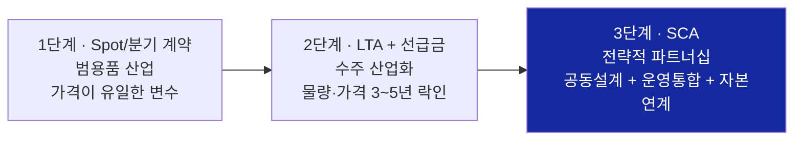

# LTA → SCA 전환 — 계약 구조가 말해주는 산업 체질 변화

> **한 줄 요약**: 메모리 산업의 고객 계약이 스팟 거래 → LTA(장기공급계약, 수주산업화) → **SCA(전략적 고객 계약: 공급 + 공동설계 + 운영통합 + 자본연계)**로 진화하고 있다. 2026-06-22 Micron–Anthropic 계약이 이 전환의 결정적 사건이며, 공급자에게 요구되는 역량이 "정확한 납품"에서 **"공동 기술 드라이브"**로 이동했다.

---

## 1. 계약 구조의 3단 진화

| 단계 | 계약 형태 | 정량 신호 | 공급자에게 요구되는 역량 |
|---|---|---|---|
| 1단계 | 스팟·분기 계약 | 사이클 진폭 ±60%p | 원가·수율·납기 |
| 2단계 | LTA + 선급금 | 선급금 계약가의 10~30% (역사적 <5%), 2027년까지 DDR 비트 20~30% 고정가 락인 ([lta-to-sca-industry-context-2026-06.md](../../sources/articles/lta-to-sca-industry-context-2026-06.md) §1) | 캐파 계획·공급 신뢰성 |
| 3단계 | **SCA** | Micron SCA 16건 · 최소 계약매출 ~$100B · 예치금+금융약정 $22B ([micron-q3-fy26.md](../../sources/filings/micron-q3-fy26.md) §3) | **워크로드 이해·공동 아키텍처 설계·로드맵 제안** |

## 2. 결정적 사건 — Micron ↔ Anthropic (2026-06-22)

LTA와 SCA의 차이를 가장 선명하게 보여주는 사건 ([micron-anthropic-sca-2026-06-22.md](../../sources/articles/micron-anthropic-sca-2026-06-22.md)):

| 구성요소 | LTA에 있던 것 | SCA에서 추가된 것 |
|---|---|---|
| 다년 공급 (HBM·DRAM·SSD 전 포트폴리오) | ✅ | — |
| **공동 최적화** — Claude 학습·추론 워크로드에 맞춘 메모리·스토리지 서브시스템 공동 설계 | ❌ | ✅ |
| **운영 통합** — Micron 엔지니어링·제조에 Claude 전사 배치 (고객 제품을 공급자 운영에 내재화) | ❌ | ✅ |
| **자본 연계** — Series H 전략적 투자 (Micron·Samsung·SK hynix 3사 모두 "strategic infrastructure partners") | ❌ | ✅ |

- Anthropic Tom Brown: 메모리·스토리지는 컴퓨트 전략에 "critical" — **AI 워크로드 전반의 메모리·스토리지 성능과 인프라 스택 통합 방식을 공동 검토**
- 함의: 고객이 원하는 것은 "스펙대로 만든 칩"이 아니라 **"내 워크로드를 이해하고 아키텍처를 함께 최적화하는 파트너"**

## 3. 동일 패턴의 누적 — 일회성이 아닌 구조 전환

| 사건 | 시점 | SCA 요소 |
|---|---|---|
| SK hynix, NVIDIA·Microsoft·Broadcom 커스텀 HBM 수주 인증 | 2025-06 | 고객별 bespoke 설계 ([lta-to-sca-industry-context-2026-06.md](../../sources/articles/lta-to-sca-industry-context-2026-06.md) §3) |
| OpenAI Stargate ↔ Samsung·SK LOI (월 90만 장 = 글로벌 DRAM ~40%) | 2025-10 | 미절단 웨이퍼 납품 — 수요처의 기술 관여 심화 (동 §2) |
| HBM4 로직 베이스다이 — 메모리사·파운드리·고객 3자 공동설계 | 2025~ | 제품 정의 주도권 이동 (동 §3) |
| Micron SCA 16건 $100B 공시 | 2026-06-24 | "SCA"가 IR 공식 용어로 등장 ([micron-q3-fy26.md](../../sources/filings/micron-q3-fy26.md) §3) |
| **Micron ↔ Anthropic 전략적 계약** | **2026-06-22** | **4대 요소 완비 — 전환의 정점** |
| **Micron ↔ General Motors SCA** | **2026-07-01** | **SCA가 빅테크/클라우드 밖 완성차 산업으로 최초 확산** — 차량용 메모리·스토리지 장기공급+혁신가속 조항. SCA가 "AI 인프라 특수 계약"이 아니라 **범용 산업 표준 계약 형태로 일반화**되는 신호 ([memory-market-strategy-update-2026-08-25.md](../../sources/raw-notes/memory-market-strategy-update-2026-08-25.md)) |
| SK하이닉스 ↔ NVIDIA $500B+ 전략적 파트너십 LOI | 2026-07-25 | AI 팩토리(SK텔레콤 2GW Vera Rubin DSX) + **HBM4 공동개발·장기공급** — 자본연계+공동설계+운영통합 요소를 스케일 최대치로 결합 (동 출처) |
| Micron SCA 고객 16곳→확대, DRAM 물량 ~20%·NAND ~1/3 편입 | 2026 하반기 | 개별 계약에서 **공급 포트폴리오의 구조적 비중**으로 이동 (동 출처) |

## 4. 전략 함의 (Samsung 메모리사업부)

- **[MB-4 커스텀 AI 메모리](../strategies/core/current-state-mb4-custom-ai-memory.md)**: SCA의 공동설계 요소는 MB-4가 겨냥하는 시장 그 자체. 커스텀 HBM이 범용을 대체하는 흐름(시장 2033년 $130B)과 정합
- **[RS-3 고객 전환비용](../strategies/invariant/rs3-customer-switching-cost.md)**: 공동설계·운영통합은 전환비용을 구조적으로 심는 가장 강한 수단
- **[RS-8 구조화 매출 헤징](../strategies/invariant/rs8-structured-revenue-hedging.md)**: SCA의 최소 약정 매출($100B)·예치금($22B) 구조는 RS-8의 산업 표준화 사례
- **[customer-co-design-anthropic.md](customer-co-design-anthropic.md)**: 영업 4단계 진화 모델의 4단계(Strategic Infra Partner)가 Micron에 의해 실체화 — Samsung 위치(2~3단계)와의 격차가 계약 구조로 가시화
- **조직 함의**: SCA를 수주·이행하려면 개발 조직이 고객 워크로드를 해석하고 선제 제안하는 역량 필요 → [dev-org-transformation.md](../strategies/dev-org-transformation.md)

## 5. EWI — 등록 완료 (2026-07-04, 대시보드 EWI > 분기별 모니터링)

기준선 조사: [sca-ewi-baseline-2026-07-04.md](../../sources/articles/sca-ewi-baseline-2026-07-04.md)

| 지표 (dashboard id) | 기준값 (2026-07-04) | 경보 임계값 | 의미 |
|---|---|---|---|
| 경쟁사 SCA형 계약 공시 건수 (`competitor_sca_disclosures`) | **분기 1건** (Micron–Anthropic 06-22; 스톡: Micron SCA 16건·SK 커스텀 인증 3건) | 분기 2건+ | 3단계 표준화 가속 — DT 시급도 격상 |
| Samsung 공동설계 조항 포함 계약 (`samsung_codesign_contracts`) | **공시 0건** (선행 신호: 커스텀 전담 2팀·250명 증원·Broadcom/AMD 협의) | 1건+ (긍정 경보) | 자사 전환 진도 — DT Phase 2 목표 달성 |
| 커스텀 HBM 매출 비중 (`custom_hbm_revenue_share`) | **~0%** (2026 매출은 표준 HBM3E/HBM4 중심) | 30%+ (경계 15%) | 범용→커스텀 역전 — 선행: HBM4E 2027년 ~40% 전망 |

다음 갱신 시점: Micron Q4 FY26 실적(2026-09 말)·TrendForce HBM 분기 리포트 — 정기 시장 점검 사이클에서 흡수.

---

## [Update 2026-08-06] 토큰 층위의 보장 계약 등장 — OpenAI "Guaranteed Capacity = Guaranteed Tokens"

- OpenAI가 엔터프라이즈 대상 **보장 캐파(guaranteed capacity)** 상품을 출시 — Sachin Katti: **"보장 캐파는 보장 토큰이다. 일정 달러어치 인텔리전스를 보장한다"** ([mad-podcast-sachin-katti-openai-compute-2026-07.md](../../sources/articles/mad-podcast-sachin-katti-openai-compute-2026-07.md)).
- 논리 구조가 본 페이지의 Spot→LTA→SCA 진화와 동형: "컴퓨트 부족 세계에서 토큰은 항상 프리미엄 → 엔터프라이즈의 필수 투입재가 된 인텔리전스의 공급을 계약으로 보증 → 사업 리스크 제거는 좋은 비즈니스 위생." **인텔리전스가 공급 단위(supply unit)로 유틸리티화.**
- 함의: 수요 사슬(프론티어→CSP→메모리)의 **최상류가 자기 하류(엔터프라이즈)에 공급 보증을 판매** — 메모리 층위의 take-or-pay/SCA(이창수 1차 방어선)와 토큰 층위의 보장 계약이 사슬 양끝에서 동시 진행. 사슬 전체가 "보장 계약의 사슬"로 재편되면 중간(CSP·메모리)의 수요 가시성이 구조적으로 개선되는 방향 — 단 중복 수요 리스크(이창수)는 계약 층위가 달라 별도 추적 필요.

**출처**: [mad-podcast-sachin-katti-openai-compute-2026-07.md](../../sources/articles/mad-podcast-sachin-katti-openai-compute-2026-07.md)

---

## [Update 2026-08-25] SCA 모델의 두 방향 확산 — 산업 경계 확장 + 규모 극대화

- **경계 확장**: Micron–General Motors SCA(2026-07-01)는 SCA가 AI 인프라·클라우드에 국한되지 않고 **완성차 등 전통 제조업으로 확산**되는 첫 사례다 — "메모리 공급의 전략적 계약화"가 AI 수요처만의 현상이 아니라 **공급 자체가 구조적으로 희소해진 모든 산업의 공통 대응**임을 시사. Samsung 입장에서는 SCA형 계약의 잠재 고객 풀이 하이퍼스케일러·AI 랩 너머로 넓어진다는 의미 — [MB-4](../strategies/core/current-state-mb4-custom-ai-memory.md)·[RS-4 고객 포트폴리오 분산](../strategies/invariant/rs4-customer-portfolio-diversification.md)의 타깃 고객군 재검토 필요.
- **규모 극대화**: SK하이닉스–NVIDIA $500B+ LOI(2026-07-25)는 지금까지의 SCA 중 최대 규모로, **자본연계(AI 팩토리 공동구축)와 공동설계(HBM4)가 결합된 최상위 사례**다 — Micron–Anthropic이 "4대 요소 완비"의 질적 정점이었다면, 이 딜은 규모의 정점. 경쟁사가 이미 이 축에서 앞서 있다는 사실은 Samsung의 [RS-3 전환비용](../strategies/invariant/rs3-customer-switching-cost.md) 확보 시급성을 높인다.
- Samsung 측 대응 신호: **AMD-삼성 HBM4 공급계약이 "거의 완료" 단계**(2026-07-24, Lisa Su 언급) — 3단계(SCA)로의 이동이 진행 중이나 공시된 계약 조항(공동설계·운영통합·자본연계 포함 여부)은 아직 확인 안됨. §5 EWI `samsung_codesign_contracts`(기준값 공시 0건)의 다음 갱신 시 반영 대상.
- **출처**: [memory-market-strategy-update-2026-08-25.md](../../sources/raw-notes/memory-market-strategy-update-2026-08-25.md)
