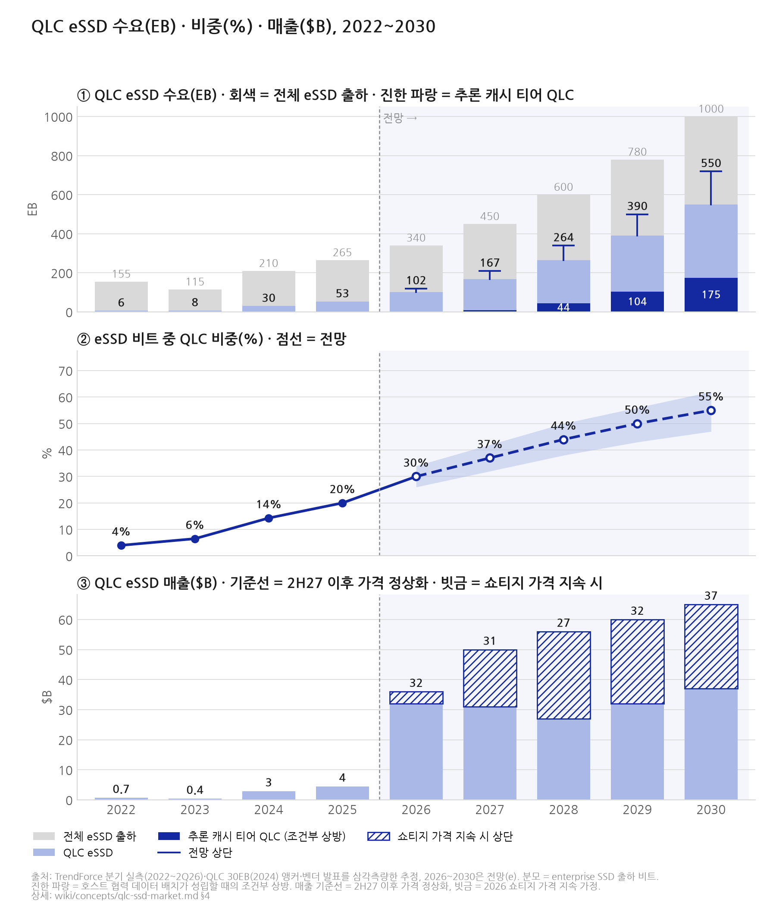

# QLC eSSD 시장 — 초기·현재·향후 3기의 배경·요구사항과 2022~2030 수요·매출 모델

> **한 줄 요약**: 데이터센터 QLC eSSD는 2022년에 "요구"가 형성되고(표준·폼팩터·가격 급락·데이터 레이크) 2024년에 "물량"이 터졌다(30EB, 전년 4배). 지금은 용량 경쟁(61→122→245TB)과 니어라인 HDD 부족이 QLC를 끌어올리고 있으나, 향후 3~5년의 스토리지 공급 부족 국면에서 QLC의 다음 무대는 HDD 대체가 아니라 **추론 캐시 티어(KV cache 오프로드)** 다. 그 티어는 오늘 TLC가 서비스하고 있고, QLC가 들어가려면 정격 내구성 10~40배 갭을 **호스트 협력 데이터 배치와 시스템 소프트웨어**로 메워야 한다. 수요 모델은 QLC eSSD 비트가 2025년 53EB에서 2030년 550EB로 10배 늘지만, 가격이 정상화되면 매출은 $30B대에서 정체한다고 본다. 비트가 아니라 시스템 위의 부가가치가 이익을 결정한다.

> **표기 원칙**: 본 페이지의 수치는 대부분 검색 인용 경유 🟡 또는 삼각측량 ⚠️다(수집 세션의 외부 원문 열람이 차단됨, [qlc-essd-market-size-forecast-data-2026-09.md](../../sources/articles/qlc-essd-market-size-forecast-data-2026-09.md) 접근 제약 고지). 모델의 전망치는 전부 추정(e)이며 §4.3의 가정표를 통해 재현 가능하다. 데이터 배치 표준은 NVMe FDP(Flexible Data Placement, TP4146)를 가리키며 이하 "배치 표준"으로 줄여 쓴다.

---

## 1. 초기 국면(2018~2023): 2022년, 하이퍼스케일러는 왜 대용량 QLC를 요구했나

### 1.1 2022년의 실제 시장은 "QLC 주문 폭증"이 아니라 "준비기"였다

2022년은 AI 인프라 투자가 늘기 시작한 해(하이퍼스케일러 4사 CapEx 분기 약 $36B, ChatGPT 출시 2022-11)이지만, 같은 해 enterprise SSD 시장은 정반대로 움직였다. 4Q22 eSSD 계약가 -25% QoQ, 4Q22 eSSD 매출 $3.79B(-27.4%), 원인은 PC·스마트폰 둔화와 데이터센터 재고 조정이었다 ([qlc-essd-history-2022-background-2026-09.md](../../sources/articles/qlc-essd-history-2022-background-2026-09.md) §2.1, [qlc-essd-market-size-forecast-data-2026-09.md](../../sources/articles/qlc-essd-market-size-forecast-data-2026-09.md) §1.1). 즉 2022년은 물량의 해가 아니라 **QLC를 쓸 수 있는 조건이 한꺼번에 갖춰진 해**다.

| 2022년에 갖춰진 조건 | 내용 | 출처 |
|---|---|---|
| 공급자 교체 | Intel NAND 사업의 SK hynix 매각 1단계 종결(2021-12-29) → Solidigm 출범, 대용량 QLC 전문 벤더의 탄생 | 연혁 소스 §2.1 |
| 폼팩터 표준 | Meta·Microsoft 주도 OCP E1.S 사양, E1.L "1U에 1PB"(D5-P5316 30.72TB) | 연혁 소스 §2.2·§2.3 |
| 배치 표준 | Meta와 Google이 각자 풀던 WAF 문제를 통합해 NVMe 배치 표준(TP4146) 비준(2022-12-22), WAF ~3 → ~1 | 연혁 소스 §2.4 |
| 가격 | 2H22 NAND·eSSD 계약가 급락으로 QLC $/TB의 HDD 대체 임계 접근 | 연혁 소스 §2.1 |
| 제품 예고 | OCP 2022(10월)에서 Solidigm이 61.44TB D5-P5336(192단 QLC) 예고 | 연혁 소스 §2.2 |
| 데이터 | AI 학습 데이터셋 중앙값 2022년 1,050억 → 2023년 7,500억 데이터포인트(6배 이상) | 연혁 소스 §2.1 |

### 1.2 요구의 논리: 공급자 TCO 논거와 수요자 계층 논거

**공급자(Intel/Solidigm)의 논거는 랙 밀도와 TCO였다.** 4TB HDD로 1PB를 채우면 20U, 30.72TB E1.L QLC로는 1U(20배). Ceph 기준 5년 TCO 47% 절감, 전력 32.9~79.5% 우위. 122TB 세대에서는 30TB TLC 대비 TB당 와트 3.4배, TLC+HDD 하이브리드 9랙을 QLC 1랙으로 ([qlc-essd-history-2022-background-2026-09.md](../../sources/articles/qlc-essd-history-2022-background-2026-09.md) §2.2).

**수요자(Meta)의 논거는 HDD의 대역폭 붕괴였다.** HDD는 용량이 늘어도 IOPS와 대역폭이 늘지 않아 TB당 대역폭이 계속 떨어진다. Meta는 "10 MB/s/TB 대역"을 요구하는 워크로드를 HDD(20~30TB, 최저 성능)와 TLC(8~16TB, 성능 계층) 사이의 **QLC 용량 계층(64~150TB)** 이 흡수한다고 정리했고, QLC 서버의 바이트 밀도 목표를 TLC 서버의 6배로 잡았다. 쓰기가 NAND 전력의 대부분을 차지하므로 읽기 중심 워크로드를 QLC로 옮기면 전력도 준다. 다만 "QLC가 TLC보다 싸지만 광범위 배치를 위해선 아직 더 싸져야 한다"는 단서가 붙었다 (같은 소스 §2.3).

**초기 국면의 요구사항 요약**: 읽기 중심, 낮은 내구성 허용(0.3~0.6 DWPD), 드라이브당 30TB급, PCIe 4.0, E1.L/U.2, TB당 원가·전력·랙 밀도가 구매 기준. 고객은 CDN·오브젝트 스토리지·빅데이터·어레이 벤더(Pure Storage DirectFlash QLC 2019~)였고, 하이퍼스케일러 인증을 가진 QLC 벤더는 2024년 4월 시점에도 Solidigm·삼성 2사뿐이었다 (같은 소스 §2.5).

### 1.3 물량이 터진 해는 2024년이다

TrendForce는 2024년 QLC eSSD 비트 출하를 **30EB, 2023년 대비 4배**로 집계했고, 동인을 "AI 추론 서버의 에너지 효율이 핵심 우선순위로 부상하며 북미 고객 주문 증가"로 짚었다 ([qlc-essd-market-size-forecast-data-2026-09.md](../../sources/articles/qlc-essd-market-size-forecast-data-2026-09.md) §2.1). 2023년 7월 Solidigm이 61.44TB를 세계 최초 출시하고 2024년 eSSD 수요 급증의 최대 수혜로 흑자 전환한 이야기는 [fdp-host-ssd-platform.md](../strategies/fdp-host-ssd-platform.md) §2.5에 정리돼 있다. 요약하면 **2022년에 요구가 정의되고, 2023년에 제품이 나오고, 2024년에 AI 추론 서버가 물량을 만들었다.**

## 2. 현재 국면(2024~2026): 용량 경쟁과 니어라인 HDD 부족이 QLC를 끌어올린다

### 2.1 2022년경 vs 2026년 현재 QLC eSSD 비교표

| 비교 축 | 2022년경 (Solidigm D5-P5316 → 2023 D5-P5336 61TB 초기) | 2026년 현재 (Micron 6600 ION 245TB · Kioxia LC9 · Solidigm 122TB · 삼성 176단/V9 QLC) |
|---|---|---|
| 드라이브 최대 용량 | 15.36 / 30.72TB (2023-07 61.44TB 등장) | 122.88 ~ 245.76TB (SanDisk 256TB 예고) |
| NAND 다이·단수 | 1Tb QLC, 96/144단 | 1Tb(192·286단) → **2Tb QLC**(BiCS8 Kioxia·SanDisk, 삼성 V9 2Tb 개발 완료, SK hynix 321단 2Tb 양산) |
| 인터페이스 | PCIe 3.1 → PCIe 4.0 | PCIe 5.0 주류, PCIe 6.0은 TLC(PM1763)부터 |
| 폼팩터 | U.2, E1.L(1U 1PB), E1.S | E3.S / E3.L 중심, 2.5"는 2026년 말 퇴장 전망, E2(1PB·80W) 표준화 진행 |
| 내구성(DWPD) | 0.4~0.6 (D5-P5336 61TB 0.58) | 0.3 랜덤 ~ 1.0 순차(6600 ION), LC9 0.3, 삼성 BM1743 0.26, Solidigm 122TB 0.6 |
| 전력 | 15W(2018, 1.95 W/TB) → 25W(61TB, 0.41 W/TB) | 30W 최대 / **0.12 W/TB**(245TB), 유휴 <5W |
| 순차 읽기 / 랜덤 읽기 | 3.2 → 7 GB/s / 427K → 1.6M IOPS | 12~13.7 GB/s / 1.3M~1.78M IOPS |
| 타깃 워크로드 | CDN·오브젝트·빅데이터·warm storage·HDD 대체 | AI 데이터 레이크·학습 인제스트·체크포인트·추론(RAG·KV cache)·니어라인 HDD 부족 대체 |
| 핵심 고객 | 북미 CSP 일부, CDN, 어레이 벤더 | 하이퍼스케일러 전면(삼성 176단 QLC 대량 출하, Meta QLC 계층, Pure DFM 2EB), AI 팩토리 |
| 경쟁 대상 | HDD 4~16TB, TLC 15~30TB("QLC 가격·TLC 성능" Micron 6500 ION) | 니어라인 HDD 24~44TB(2026년 완판, 리드타임 52주+), TLC 60TB. HDD 완판으로 QLC가 대안이 아니라 필수 공급원 |
| 호스트·펌웨어 기능 | Multi-stream(2017)·ZNS(2020)·배치 표준 비준 직후 | 배치 표준 상용 채택(삼성·Kioxia·Solidigm·Micron), OCP 2.5/2.6, NVMe 2.0/2.1, 텔레메트리·PLP 강화 |
| 인증·리드타임 | 인증 QLC 벤더 2사 | 5사 경쟁(Solidigm·삼성·Micron·Kioxia·SanDisk), 대용량 SSD 리드타임 약 1년 |
| 수요 논리 | 공급자 TCO 논거("$/TB·랙 밀도·전력으로 HDD 대체") | 수요자 주도("HDD 대역폭 붕괴 + HDD 공급 부족 + AI 추론 전력 효율") |
| $/TB(공개 소매 추정) | 61TB ≈ $60~95/TB(2024 초) | 30TB QLC 인덱스 $92(3Q25) → $504(1Q26) → $603(3Q26), TLC 대비 13~20% 할인 |

출처: [qlc-essd-history-2022-background-2026-09.md](../../sources/articles/qlc-essd-history-2022-background-2026-09.md) §1·§3, [qlc-essd-market-size-forecast-data-2026-09.md](../../sources/articles/qlc-essd-market-size-forecast-data-2026-09.md) §3.3. 전 항목 🟡.

### 2.2 현재 국면의 구조 신호

- **용량 리더십은 후발이다**: 61TB Solidigm 2023-07 vs 삼성 2024-07, 122TB Solidigm 2024-11 출하 vs 삼성 FMS 2024 전시, 245TB 첫 출하 Micron 2026-05. 삼성 BM1773 245.76TB(V9 QLC, 2Tb 다이)는 FMS 2026 전시 단계이며 DWPD·배치 표준 지원은 미공개다 ([qlc-essd-timeline-fdp-ruh-2026-09.md](../../sources/articles/qlc-essd-timeline-fdp-ruh-2026-09.md) §1, [kv-cache-qlc-tech-stack-vendor-capability-2026-09.md](../../sources/articles/kv-cache-qlc-tech-stack-vendor-capability-2026-09.md) §2).
- **물량은 1위다**: 1Q26 eSSD 매출 삼성 $7.05B(38.2%)는 176단 QLC 대량 출하가 기여했고, 2Q26에는 $14.35B(35.1%)로 배증했다. 2Q26 Top-5 합산 $37.59B(+103.6% QoQ), eSSD가 NAND 매출의 약 55%다 ([qlc-essd-market-size-forecast-data-2026-09.md](../../sources/articles/qlc-essd-market-size-forecast-data-2026-09.md) §1.2). 삼성은 2H26 QLC 비트를 1H26 대비 2배 이상 출하할 계획이다 (같은 소스 §2.1).
- **니어라인 HDD 부족이 QLC를 끌어올린다**: 니어라인 HDD 리드타임 수 주 → 52주 초과, Seagate·WD 2026년 물량 완판과 2027~28 장기계약, HDD 가격 2025-09 이후 +46%. TrendForce는 "2026년 대용량 QLC SSD 출하 급증"을 전망하되 대량 전환의 장애로 비용과 공급망을 꼽았다 (같은 소스 §5).
- **가격은 비정상이다**: 30TB TLC 인덱스가 3Q25 $3,062에서 3Q26 $22,600으로 6.5배, eSSD 계약가 1Q26 약 +80%. 2027년 하반기 공급 완화가 TrendForce의 전망이다 (같은 소스 §3). 수요 모델은 이 가격을 외삽하지 않는다.

## 3. 향후 국면(2027~2030): QLC의 다음 무대는 추론 캐시 티어다

### 3.1 왜 니어라인 HDD 대체가 아닌가

향후 3~5년은 스토리지 공급 부족 국면이다(HDD 완판·2027~28 장기계약, NAND 쇼티지 2028년까지 가능). 니어라인 대체 수요는 존재하지만 이 시장은 (a) TB당 원가와 전력으로만 승부하는 커머디티 경쟁이고, (b) 공급이 풀리는 순간 HDD 가격 경쟁력이 복귀하며, (c) 고객 시스템과의 접점이 얇아 전환비용이 쌓이지 않는다. 사용자 결정(2026-09-17): **니어라인 HDD 대체 시장에는 들어가지 않고, AI 추론 캐시 티어를 QLC로 가져간다** ([prompt-qlc-ssd-strategy.md](../../sources/prompt/prompt-qlc-ssd-strategy.md) 피드백 3).

### 3.2 추론 캐시 티어의 크기와 현재 주인

- **크기**: KV cache 단독 NAND 추가 수요 2027년 75~100EB, 2028년 그 2배(150~200EB), 2030년 AI 데이터센터 NAND 워크로드의 약 35%(SanDisk FMS 2026). NVIDIA CMX 공급망 추정은 2026년 35EB → 2027년 100EB 이상으로 독립 경로에서 같은 방향이다. 삼성은 V-NAND 캐파의 약 60%를 CMX 대응에 배정했다는 보도가 있다 ([qlc-essd-market-size-forecast-data-2026-09.md](../../sources/articles/qlc-essd-market-size-forecast-data-2026-09.md) §4, [kv-cache-ssd-demand-2026.md](../../sources/articles/kv-cache-ssd-demand-2026.md)).
- **현재 주인은 TLC다**: CMX 타깃으로 벤더가 지명한 드라이브는 전부 TLC(삼성 PM1753/PM1763, Kioxia CM10 1/3 DWPD, Solidigm PS1010/PS1030 1/3 DWPD)이고, CMX 발표 뒤 TLC 현물가가 반등했다. QLC를 이 티어에 지명한 공개 사례는 SanDisk FMS 2026의 "고내구 KV cache 구성(BiCS10 QLC)" 1건뿐이며 DWPD는 미공개다 ([kv-cache-qlc-tech-stack-vendor-capability-2026-09.md](../../sources/articles/kv-cache-qlc-tech-stack-vendor-capability-2026-09.md) §3.3).
- **갭**: 최신 QLC 정격 0.075~0.6 DWPD vs KV cache 티어 TLC 1~3 DWPD, ScaleFlux가 제시한 요구 유효 7~10+ DWPD. 정격 기준 10~40배 갭이다 (같은 소스 §3.1).
- **갭을 메우는 수단은 이미 공개돼 있다**: 배치 표준으로 수명이 다른 블록을 분리하면 CacheLib 실측에서 WAF 3.22 → 1.03(100% 사용률), XFS write streams에서 RocksDB WAF -35%, ScaleFlux는 200+ 스트림으로 유효 7~10+ DWPD. 반면 **KV cache 워크로드에서 배치 표준의 WAF 실측을 공개한 벤더는 아직 없다**. 이것이 업계 공백이자 선점 기회다 (같은 소스 §3.2).

### 3.3 향후 국면의 요구사항

| 요구 축 | 초기(2018~23) | 현재(2024~26) | 향후(2027~30, 추론 캐시 티어) |
|---|---|---|---|
| 배경 | 데이터 레이크·HDD 대역폭 붕괴·표준 정비 | AI 추론 서버 전력 효율, 용량 경쟁, HDD 부족 | 장문맥·에이전틱 추론의 KV cache가 HBM·DRAM을 넘쳐 SSD로 내려옴, 전력 제약 데이터센터 |
| 1차 구매 기준 | $/TB, 랙 밀도 | $/TB, W/TB, 리드타임(공급 확보) | **TB당 와트 + 유효 DWPD + 토큰 경제성(TTFT·GPU당 동시 사용자)** |
| 내구성 | 0.3~0.6 DWPD 허용 | 0.3 랜덤 / 1.0 순차 스펙 분리 | 유효 7~10+ DWPD를 미디어가 아니라 **배치·호스트 SW로 달성**, 수명 보증이 계약 조건 |
| 인터페이스·플랫폼 | PCIe 4, OCP NVMe | PCIe 5, E3.S/E3.L, 배치 표준 상용 | PCIe 6, NVMe-oF, NVMe KV 확장, CMX(BlueField-4·DOCA Memos)·GPU 직결(SCADA) |
| 호스트 기능 | 없음(블록 디바이스) | 배치 표준 지원(RUH 2~8), 텔레메트리 | **RUH 200+**, 세션·테넌트·prefix·수명별 스트림 분리, 커널 write streams, 캐시 관리자 연동 |
| 고객이 사는 것 | 드라이브 | 드라이브 + 공급 약정 | **워크로드에 검증된 TCO**(WAF·전력·QoS 보증) + 스택 통합 |
| 경쟁 대상 | HDD | HDD·TLC | **TLC 1~3 DWPD 드라이브, SLC AI SSD(SK hynix AI-N P·Kioxia 1억 IOPS), 고객 자체 SSD** |
| 삼성의 위치 | 후발(61TB 1년) | 물량 1위, 용량 후발 | 디바이스는 확보(PM1753 CMX), 워크로드·시스템 SW 연결은 공백 |

## 4. 수요·매출 모델 (2022~2030)

### 4.1 모델 표 (그래프 미러: `outputs/presentation/assets/qlc_model.csv`)

| 연도 | 구분 | 전체 eSSD(EB) | QLC eSSD(EB) | QLC 비중 | eSSD 매출($B) | eSSD ASP($/TB) | QLC $/TB | QLC 매출($B) 기준선 | QLC 매출 상단 | KV cache NAND 수요(EB, 전 미디어) | 그중 QLC(EB) |
|---|---|---|---|---|---|---|---|---|---|---|---|
| 2022 | 실측·추정 | 155 | 6 | 4% | 21.9 ✅ | 141 | 120 | 0.7 | 0.7 | 0 | 0 |
| 2023 | 실측·추정 | 115 | 7.5 | 6.5% | 7.0 ⚠️ | 61 | 52 | 0.4 | 0.4 | 0 | 0 |
| 2024 | 실측·추정 | 210 | **30 ✅** | 14% | 24 ⚠️ | 114 | 97 | 2.9 | 2.9 | 0 | 0 |
| 2025 | 실측·추정 | 265 | 53 | 20% | 26.5 🟡 | 100 | 85 | 4.5 | 4.5 | 0 | 0 |
| 2026 | 전망(e) | 340 (~390) | 102 (~120) | 30% (26~34) | 125 (1H 56 ✅) | 368 | 313 | 32 | 36 | 35 | 2 |
| 2027 | 전망(e) | 450 (~565) | 167 (~210) | 37% (32~42) | 99 | 220 | 187 | 31 | 50 | 90 | 9 |
| 2028 | 전망(e) | 600 (~825) | 264 (~340) | 44% (38~50) | 72 | 120 | 102 | 27 | 56 | 175 | 44 |
| 2029 | 전망(e) | 780 (~1,050) | 390 (~500) | 50% (43~56) | 74 | 95 | 81 | 32 | 60 | 260 | 104 |
| 2030 | 전망(e) | 1,000 (~1,300) | 550 (~720) | 55% (47~62) | 80 | 80 | 68 | 37 | 65 | 350 | 175 |

괄호는 상단 밴드. ✅는 TrendForce 실측(연 합산), ⚠️는 분기 QoQ 역산, 🟡는 검색 인용. 2026 이후 전 셀 추정(e).

### 4.2 독해

1. **비트는 10배, 매출은 정체.** QLC eSSD 비트는 2025년 53EB에서 2030년 550EB로 10배 늘지만, 2027년 하반기 이후 가격이 정상화되면 QLC 매출은 2026년 $32B 수준에서 $27~37B 사이를 오간다. 쇼티지 가격이 이어지는 상단에서도 $65B다. **비트 성장이 곧 이익 성장이 아니다.** 이익은 TB당 가격이 아니라 시스템 위에서 보증하는 TCO(WAF·전력·QoS)로 결정된다는 것이 모델의 첫 함의다.
2. **QLC는 2028년경 eSSD 비트의 절반에 다가선다.** 2024년 14%(30EB/210EB)에서 2026년 30%, 2030년 55%. 근거는 2026년 "출하 급증" 전망, 삼성 QLC 비트 2H26 2배, 5사 2Tb QLC 양산, Meta의 용량 계층 설계(QLC 서버 바이트 밀도 TLC의 6배)다.
3. **추론 캐시 티어는 조건부 상방이다.** KV cache NAND 수요 350EB(2030)의 절반을 QLC가 가져가는 경로(175EB)는 호스트 협력 배치와 시스템 SW가 성립할 때만 열린다. 성립하지 않으면 이 175EB는 TLC·SLC로 간다. 그래프의 진한 파랑이 이 조건부 영역이다.
4. **가격 밴드가 전략의 시계를 정한다.** 공급자 우위(협상력)는 2027년 하반기 공급 완화 전까지다. 고객에게 워크로드·스펙 접근권을 요구할 수 있는 창이 그때 닫힌다.

### 4.3 가정표 (재현용)

| 항목 | 가정 | 근거 |
|---|---|---|
| 전체 eSSD EB 2022~2025 | TrendForce 연 매출 ÷ 추정 ASP(2022 $141, 2023 $61, 2024 $114, 2025 $100/TB) | 매출은 [qlc-essd-market-size-forecast-data-2026-09.md](../../sources/articles/qlc-essd-market-size-forecast-data-2026-09.md) §1.3, ASP는 VDURA 30TB 인덱스(3Q25 $102~115)와 컨슈머 $/TB 방향 프록시(§3.2~3.3). 2025년 265EB는 Intel MR 수치와 일치 |
| 전체 eSSD EB 2026~2030 | 연 +28~30%(기준선), 상단은 TechInsights DC NAND 295→909EB(CAGR 46%)의 90% | 같은 소스 §2.1(Micron NAND 비트 +20%, 서버 >40%, Kioxia IR) |
| QLC 비중 | 2024년 14%(30EB 앵커 ÷ 210EB) → 2026년 30% → 2030년 55%, 밴드 ±4~7pt | 같은 소스 §2.3 삼각측량, 벤더 정성 신호 |
| eSSD ASP 기준선 | 2026 $368(1H 실측 $56B ÷ 추정 150EB 연장) → 2027 $220 → 2028 $120 → 2029 $95 → 2030 $80 | 2H27 공급 완화(TrendForce 2026-07-30), 4Q27 가격 개선 신호(Counterpoint), 2Tb QLC 원가 곡선 |
| 쇼티지 상단 ASP | 2027 $350, 2028 $250, 2029 $180, 2030 $140 | 2028년까지 NAND 쇼티지 지속 시나리오 |
| QLC $/TB | eSSD ASP × 0.85 | QLC 할인폭 13~20%(VDURA) |
| KV cache NAND 수요 | 2026 35EB(CMX 공급망) → 2027 90 → 2028 175 → 2029 260 → 2030 350EB(AI DC NAND 1,000EB × 35%) | SanDisk FMS 2026·Investor Day, CMX 공급망 보도 |
| QLC의 KV 티어 침투 | 2026 5% → 2027 10% → 2028 25% → 2029 40% → 2030 50% | 조건부: RUH 200+ 디바이스 + 캐시 관리자 연동 + 수명 보증 성립 시. 미성립 시 0~10% |

**민감도**: QLC 비중이 2030년 47%(하단)면 QLC EB 470, 매출 기준선 $32B. 가격 정상화가 1년 늦으면 2028년 매출이 $27B → $45B. 추론 캐시 침투가 0이면 2030년 QLC EB 375, 비중 38%.

### 4.4 삼성 몫 시나리오 (부록 성격, 사내 확인 필요)

삼성 eSSD 매출 점유 35~38%(1Q~2Q26)를 QLC에 그대로 적용할 수 없다. 용량 리더십이 후발이라 QLC 점유는 그보다 낮다고 보는 것이 보수적이다. 가정 `[사내 확인]`: 2026년 QLC 점유 25% → 2030년 35%(추론 캐시 티어 40%). 이 경우 2030년 삼성 QLC 매출은 기준선 $13B, 상단 $23B, 추론 캐시 티어 QLC 70EB. 점유 5pt는 2030년 기준 약 $2B(기준선)에 해당한다.

## 5. 리스크와 반대 신호

- **KV cache 압축**: DeepSeek V4.1-Flash(2026-09-10)는 토큰당 KV를 줄여 SSD 풋프린트를 8분의 1로 낮췄다고 보도됐다. 모델 측 압축이 총량을 줄일 수 있다 ([kv-cache-qlc-tech-stack-vendor-capability-2026-09.md](../../sources/articles/kv-cache-qlc-tech-stack-vendor-capability-2026-09.md) §3.3). 다만 같은 기간 컨텍스트 길이와 에이전트 세션 수가 늘어 총량 방향은 상방이라는 것이 SanDisk·Kioxia 전망이다.
- **상단이 SLC로 갈 수 있다**: SK hynix AI-N P(SLC, NVIDIA 공동), Kioxia 1억 IOPS SSD(2027)는 캐시 티어의 상단을 SLC로 끌어올린다. QLC의 자리는 캐시 티어의 "대용량·긴 수명 블록" 구간이며, 전 구간을 노리는 전략이 아니다.
- **플랫폼 힌트 매핑 미확인**: NVIDIA DOCA Memos의 배치·수명 힌트가 NVMe 배치 표준으로 내려오는지 확인되지 않았다. 내려오지 않으면 CMX 위의 QLC는 자체 텔레메트리와 호스트 라이브러리로 수명을 분리해야 한다 (같은 소스 §5).
- **배치 효과의 조건부성**: RUH 오분류·noisy RUH에서 효과가 붕괴한다(FAST'26 WARP). 워크로드 이해 없는 배치 표준 지원은 "여러 공급사 중 하나"로 회귀한다 ([fdp-host-ssd-platform.md](../strategies/fdp-host-ssd-platform.md) §3).
- **가격 정상화 시점**: 모델의 매출 정체는 2H27 정상화 가정에서 나온다. 늦어지면 상단 밴드, 빨라지면 기준선 아래다.

## 6. 연결

- 역량·기술 전략: [qlc-workload-capability-phases.md](../strategies/qlc-workload-capability-phases.md)
- 실행 전략·고객 협업: [qlc-execution-strategy.md](../strategies/qlc-execution-strategy.md)
- 선행 전략: [fdp-host-ssd-platform.md](../strategies/fdp-host-ssd-platform.md)(자매편), [dev-org-transformation.md](../strategies/dev-org-transformation.md)
- 시장 맥락: [ssd-ufs-market.md](ssd-ufs-market.md), [nand-process-transition.md](nand-process-transition.md), [nvidia-cmx-scada.md](../entities/nvidia-cmx-scada.md)
- 시나리오 연결: B(AI 르네상스)에서 추론 캐시 티어가 최대로 열리고, C·D(AI 조정)에서는 QLC 비중 상승 자체는 유지되나 KV 티어 침투가 지연된다 ([scenario-matrix.md](../scenarios/scenario-matrix.md))
