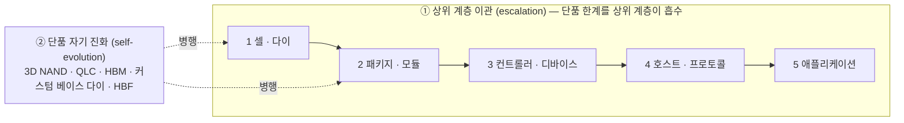

# 해법 사다리 — 단품이 요구를 못 채우면 해법은 상위 계층으로 이관된다 (NAND·DRAM·HBM·HBF)

> **한 줄 요약**: 메모리 단품의 특성이 고객 요구를 만족하지 못하는 수준이 되면, 해법은 그 부품을 쓰는 **상위 계층**(컨트롤러·디바이스 → 호스트·프로토콜 → 애플리케이션)으로 올라간다. NAND는 1991년 SSD(컨트롤러 계층)에서 시작해 2009~2022년 호스트 계층(TRIM·ZNS·FDP), 2025년 애플리케이션 계층(CacheLib FDP)까지 올랐고, QLC의 호스트 협력은 이 사다리의 **다음 칸**이다. DRAM은 단품이 요구를 오래 만족해 사다리 이관이 늦었지만, Row Hammer(2014) 이후 on-die ECC(2020) → RFM(2021) → **PRAC(2024, DRAM-호스트 협력 프로토콜)** → CXL 풀링으로 같은 사다리에 올라섰다. 단, **단품 자기 진화 축**(3D NAND·QLC·HBM·HBM4 커스텀 베이스 다이·HBF)은 이관 축과 병행하며, 두 축의 **순서**가 NAND(이관 먼저, HBF는 35년 뒤)와 DRAM(자기 진화 HBM이 6~11년 먼저)에서 반대였다. 근거는 [component-to-system-solution-ladder-facts-2026-09.md](../../sources/articles/component-to-system-solution-ladder-facts-2026-09.md)(F1~F27).

> **가설 출처**: 사용자(2026-09-18) — "단위 부품 특성이 고객 요구를 만족하지 못하면 상위 부품에서 솔루션을 제공할 필요가 생기고 이것은 자연스러운 흐름이다. DRAM은 단품이 요구를 계속 만족해 상위 솔루션 니즈가 크지 않았다. HBM은 단품 업그레이드, HBF는 NAND가 SSD로 먼저 간 뒤 늦게 온 것이라 순서가 다르다. 단품 자기 진화 축은 간과하면 안 된다." 본 페이지는 이 가설을 사실로 검증하고, 맞는 부분·보정할 부분·함의를 정리한다.

---

## 1. 모델 — 다섯 칸의 사다리와 두 축

- **이관의 조건**: 단품 특성(RBER·P/E·행 간섭·대역폭·용량)이 고객 요구를 **단품 가격에서** 못 채울 때. 이때 해법은 관리 로직(ECC·FTL·배치·카운팅)을 가진 상위 계층으로 올라간다.
- **자기 진화의 조건**: 한계가 물리 집적(층수·비트/셀·스택·패키지)으로 풀릴 때. 벤더가 단독으로 수행할 수 있어 통제권이 남는다.
- 둘은 배타적이지 않다. 같은 시기에 두 축이 함께 움직이고, 어느 축이 **먼저** 움직이는지는 한계의 종류와 경제성이 정한다(§4).

## 2. NAND의 사다리 — 이관이 먼저, 자기 진화(HBF)는 35년 뒤

| 연도 | 칸 | 해법 | 흡수한 단품 한계 | 근거 |
|---|---|---|---|---|
| 1991 | 3 컨트롤러·디바이스 | SanDisk 20MB SSD(IBM ThinkPad) | 플래시를 디스크 인터페이스로 | F1 |
| 1995 | 3 | M-Systems DiskOnChip · TrueFFS(FTL 원형) | 소거 단위·웨어아웃·배드 블록을 논리 주소 뒤에 숨김 | F2 |
| 2006 | 3 | 삼성 SSD 양산 | HDD 대체 수요를 스스로 창출 | F3 |
| 2009 | 4 호스트·프로토콜 | TRIM(ATA ACS-2, Windows 7) | 호스트가 무효 데이터를 알려 GC·WAF 감소 | F10 |
| 2014~15 | 3 | LDPC 컨트롤러(Marvell 88SS1093, Lite-On CV2) | 2x nm MLC·TLC의 RBER 급증(BCH 한계) | F6·F7 |
| 2017 | 4 | Open-Channel SSD(LightNVM) · Multi-stream | FTL을 호스트로, 수명별 블록 분리 | F11·F12 |
| 2020 | 4 | ZNS(TP 4053) | 순차 쓰기 존으로 컨트롤러 복잡도·OP 감소 | F13 |
| 2022 | 4 | FDP(TP 4146, Meta·Google) | 호스트 유도 배치로 WAF·OP 제거 | F14 |
| 2025 | 5 애플리케이션 | CacheLib FDP 업스트림 머지(EuroSys'25) | WAF 3.22 → 1.03 | F15 |
| 2026 | 5 | KV 캐시 관리자 4종 — **규격 미정의** | QLC 0.075~0.6 DWPD vs 캐시 계층 1~3 DWPD | F16·F17 |
| 2013 · 2018 | 1 셀·다이(자기 진화) | 3D V-NAND · QLC 상용(Micron 5210 ION) | 층수로 밀도, 비트/셀로 원가 — 단 QLC는 내구성 한계를 다시 키움(~1K P/E) | F4·F8·F9 |
| 2026 | 2 패키지·모듈(자기 진화) | HBF OCP 사양(512GB/패키지, 16-Hi, UCIe, 최대 3TB/s) | 대역폭·용량을 패키지에서 | F27 |

**독해**: NAND 셀의 한계(RBER↑·P/E↓)는 셀에서 풀린 적이 없다. 컨트롤러가 FTL·웨어 레벨링·BCH→LDPC로 흡수했고(F5·F6·F7), 그 다음 한계(WAF·OP·QLC 내구성)는 호스트(TRIM→ZNS→FDP)와 애플리케이션(CacheLib)이 흡수하고 있다. **디바이스 칸(1991)에서 호스트 칸(2022)까지 31년, 애플리케이션 칸(2025)까지 34년**. QLC의 추론 캐시 계층 진입([qlc-workload-capability-phases.md](../strategies/qlc-workload-capability-phases.md) Phase 1·2·3)은 이 사다리의 5번째 칸을 채우는 일이며, 예외가 아니라 반복이다.

### 2.5 지표로 보는 이관 — 셀이 못 지킨 BER, 컨트롤러가 못 지키는 DWPD (2026-09-18 보강)

사용자 지적: "단품의 한계는 비트 에러를 자체적으로 해결하지 못한 것에서 왔고, wear-out과 산포가 시간에 따라 변하는 속성을 부품이 못 풀어 SSD가 나왔다. SSD도 MLC·TLC·QLC를 쓰면서 고객이 원하는 신뢰성(DWPD)을 못 맞추게 됐고, 이제 더 상위 계층과의 협력이 필요하다." 이 흐름을 네 숫자로 쓰면 다음과 같다 ([component-to-system-solution-ladder-facts-2026-09.md](../../sources/articles/component-to-system-solution-ladder-facts-2026-09.md) §7).

| 지표 | 누가 정하나 | SLC('91~) | MLC('06~) | TLC('15~) | QLC('18~) | 무엇이 일어났나 |
|---|---|---|---|---|---|---|
| **P/E 사이클** | 셀(단품) | 30K~100K | 3K~10K | 1K~3K | ~100~1K | **100배 감소** — 비트/셀을 늘릴수록 산포 마진이 줄어 셀이 견디는 사이클이 준다(F4) |
| **RBER(EOL)** | 셀(단품) | ~10⁻⁹~10⁻⁷ ⚠️ | ≤10⁻² @10K P/E | ~10⁻³(LDPC 5×10⁻³까지) | ~10⁻³~10⁻² ⚠️ | **약 10⁶배 상승** — 보존(시간에 따른 Vt 이동)·사이클링·리드 디스터브. 셀은 스스로 고치지 못한다(F32) |
| **UBER 요구** | 고객(JESD218) | 10⁻¹⁵ / 10⁻¹⁶ | 동일 | 동일 | 동일 | **고정** — 보존 1년@30°C(클라이언트)·3개월@40°C(엔터프라이즈)도 고정(F28) |
| **ECC 정정 능력** | 컨트롤러(SSD) | ~1비트/512B | 8~60비트 BCH/KB | 72~120비트 LDPC/KB | LDPC 소프트 디시전 | **약 60배 강화** — RBER과 UBER 사이의 폭을 컨트롤러가 메웠다(F33). 이것이 "NAND → SSD" 이관의 실체 |
| **정격 DWPD(5년)** | 컨트롤러가 산출, 고객이 요구 | 17(X25-E 2008) | 10(S3700 2012) | 0.7(P4510 2018) | 0.41(P5316 2021) · 0.075~0.6(2026) | **40배 하락** — ECC는 BER을 막지만 P/E를 늘리지는 못한다(F30) |
| **고객 요구 DWPD** | 고객(워크로드) | 엔터프라이즈 3~10 | 동일 | 캐시 계층 1~3 | 유효 7~10(ScaleFlux) | **그대로** — 정격과 10~40배 갭(F17·F31) |
| **WAF** | 호스트·애플리케이션 | 랜덤 쓰기 ~3 | ~3 | 3.22(CacheLib, FDP 없음) | **1.03(CacheLib + FDP)** | **−68%** — 데이터 수명을 호스트가 알려 줄 때만 1에 수렴(F34) |

**산식**: DWPD = P/E × (1 + OP) ÷ (WAF × 365 × 보증연수) (F29). P/E는 셀이, OP는 디바이스가, WAF는 호스트·애플리케이션이, 보증연수와 요구 DWPD는 고객이 정한다. SLC→QLC로 P/E가 100배 줄었으니 요구 DWPD를 지키려면 남은 변수는 WAF뿐이고, WAF를 3에서 1로 내리는 것은 컨트롤러가 아니라 **호스트가 데이터 수명을 알려 줄 때**만 가능하다(F14·F15). 유효 DWPD는 정격 × (WAF_정격 / WAF_실제)이므로 3.22 → 1.03은 곧 ×3.1이다. 이것이 "이제 상위 계층과의 협력이 필요한 시점"의 수치적 근거이며, ScaleFlux의 RUH 200+·유효 7~10 DWPD 주장(F17)이 같은 산식 위에 있다.

**이관의 3단계**(2026-09-18 사용자 정정: "1단계는 ECC가 맞고, 2단계는 SSD가 워크로드에 최적화하려는 시도였으나 고객 워크로드를 완벽히 감지할 수 없어 QoS·성능은 개선했지만 WAF를 크게 줄이지 못했다. 3단계 호스트 시스템 co-design으로 WAF를 1에 가깝게 만드는 것이 QLC로 요구 DWPD를 만족하는 유일한 방법이다." 근거 [소스 §8](../../sources/articles/component-to-system-solution-ladder-facts-2026-09.md) F36~F40):

| 단계 | 시기 | 단품·SSD 지표 | 보상 시도(주체) | 결과 | 고객 요구 |
|---|---|---|---|---|---|
| 1단계 NAND → SSD | 1991~ | RBER 약 10⁶배 ↑ | 컨트롤러 ECC 60배 ↑(F33) | 완결 | UBER 요구 충족(F28) |
| 2단계 SSD 단독 워크로드 최적화 | 2014~2019 | P/E 100배 ↓, 정격 DWPD 0.4 | SSD·드라이버가 워크로드를 추정 — Multi-stream(F36)·AutoStream(F37)·FTL 핫/콜드 분리(F38)·IO 결정성(F39) | **부분 성공**: QoS(테일 지연)·성능 개선, WAF는 실 워크로드에서 ≈3 유지(CacheLib 3.22, F38) — 데이터 수명은 호스트만 아는 정보(F40) | DWPD 요구 미충족(격차 10~40배, F17) |
| 3단계 호스트 시스템 공동 설계 | 2022~ | 동일 | 호스트가 데이터 수명을 지정(배치 표준 F14)하고 캐시 관리자·애플리케이션 정책까지 공동 설계 | WAF ≈3 → ≈1(범용 F51·CacheLib F15·DB F50), 유효 DWPD 약 ×3 · KV 캐시 실측은 공백(F52) | **호스트가 결정하는 잔여 변수** — 다이 세대(P/E)·OP·보증연수·SLC 캐시 등 병행 중인 축과 결합해 요구에 도달(2026-09-19 정정: "유일한 경로" 표현 철회, F48 동급 비교 2~10배) |

세 단계 모두 "요구(UBER·DWPD)는 고정, 단품 지표(RBER·P/E)는 악화, 보상은 더 위 계층으로 올라간다"는 같은 구조이며, 2단계의 부분 성공이 3단계가 선택이 아니라 필연인 이유다.

**병렬 축 — SSD당 다이 수와 다이 고장률**(2026-09-18 사용자 지적, 근거 [소스 §9](../../sources/articles/component-to-system-solution-ladder-facts-2026-09.md) F41~F47): 내구성 축과 별개로 신뢰성 축에서도 같은 구조가 진행 중이다. 요구는 JESD218 FFR ≤ 3%로 고정인데(F41), SSD당 NAND 다이 수는 S3700 800GB 128(2012) → P4510 8TB ≈144(2018) → P5316 30.72TB ≈256(2021) → 61.44TB ≈512(2023) → Kioxia LC9 245.76TB 1,024(2025, 2Tb 32다이 스택 × 32패키지)로 8배 늘었다(F42). 보호 없는 SSD 고장률은 다이 수 N에 비례하므로(≈ (1−p)^N, 반도체 수율 Y = e^(−AD)에서 면적이 커질수록 수율이 떨어지는 것과 같은 구조, F43), 같은 FFR을 지키려면 다이 고장률을 8배 낮추거나 다이 고장을 허용해야 한다. 다이 고장률 개선이 한계에 닿자 해법은 SSD 계층으로 이관됐다: 다이 패리티(Micron RAIN, 슈퍼페이지 XOR 패리티 다이, F44)와 다이 은퇴·감량 운영(삼성 Fail-in-Place PM1733: 다이 고장 시 데이터 재배치 후 4~8GB 감량 운영, F45). 두 해법 모두 패리티·여분 용량 오버헤드를 키우므로 다이 수가 계속 늘면 SSD 단독으로는 부족해질 수 있고, 상위 계층은 이미 준비 중이다 — OCP SMART의 XOR 복구 카운트로 호스트가 다이 복구를 관측하고(F46), 플랫폼이 감량 운영을 수용하며(Microsoft Hyrax, F47), 드라이브 간 소거 부호가 SSD 고장을 흡수한다.

| 병렬 축 | 요구(고정) | 단품 지표(악화) | SSD 계층 해법(현재) | 상위 계층(한계 시) |
|---|---|---|---|---|
| 내구성 | DWPD(캐시 계층 1~3) | P/E 100배 ↓ | SSD 단독 워크로드 최적화 — WAF ≈3(부분 성공) | 호스트 시스템 공동 설계 — WAF 1.0(본 덱) |
| 신뢰성(다이 고장) | FFR ≤ 3%(JESD218) | 다이 수 8배 ↑(128 → 1,024) | 다이 패리티(RAIN) · 다이 은퇴·감량 운영(FIP) | 호스트 관측(OCP XOR 카운트) · 플랫폼 감량 운영 수용(Hyrax) · 드라이브 간 소거 부호 |

## 3. DRAM의 사다리 — "단품이 만족해 왔다"는 전제의 검증

| 연도 | 칸 | 해법 | 흡수한 단품 한계 | 근거 |
|---|---|---|---|---|
| 1997 | 3 컨트롤러 | IBM Chipkill ECC(메모리 컨트롤러가 칩 1개 고장 정정) | 칩 단위 고장·다중 비트 오류 | F18 |
| 2013 | 2 패키지·모듈(자기 진화) | HBM(JESD235, SK hynix·AMD) | 대역폭/핀·전력 — TSV 스택으로 패키지에서 해결 | F25 |
| 2014 | 1(한계 규명) | Row Hammer(ISCA 2014, 모듈 80%+ 취약) | 인접 행 간섭 = 셀 물리 한계 | F19 |
| 2019 | 4 호스트·프로토콜 | CXL 1.0 → 2.0(2020, 풀링) → 3.x(공유·패브릭) | 용량·대역폭을 시스템 패브릭에서 | F23 |
| 2020 | 1 셀·다이(자기 흡수) | DDR5 on-die ECC(JESD79-5) | 미세화 오류를 다이 안에서 정정 | F20 |
| 2021 | 4 | RFM(JESD79-5A, 호스트 발행 리프레시 관리) | Row Hammer 완화의 호스트 협력 1단계 | F21 |
| 2024 | 4 | **PRAC**(JESD79-5C): DRAM이 행별 활성화 카운트 + 호스트에 Alert Back-Off | Row Hammer 완화의 **협력 프로토콜** — "DRAM과 시스템의 긴밀한 협조" | F22 |
| 2024 | 2(모듈) | MRDIMM(JEDEC 2024, Micron 샘플) | 채널당 대역폭·용량 배증을 모듈에서 | F24 |
| 2025~26 | 2(자기 진화 + 공동 설계) | HBM4 커스텀 베이스 다이(삼성 4nm·TSMC N12/3nm) | 고객 사양 로직을 스택 안에 | F26 |
| — | 5 애플리케이션 | **미도달** | — | — |

**독해**: 전제는 **부분적으로 맞다**. 용량·대역폭 축에서 DRAM은 단품·패키지(HBM)로 요구를 채웠고, 애플리케이션 계층까지 올라간 해법은 아직 없다. 그러나 신뢰성 축에서는 1997년에 이미 컨트롤러 계층 해법(Chipkill)이 있었고, Row Hammer 이후 **on-die ECC(단품 흡수) → RFM(호스트) → PRAC(협력 프로토콜)** 로 4번째 칸까지 올라섰다. PRAC는 구조적으로 FDP와 같다. 단품이 상태(활성화 횟수 / 배치 힌트)를 관측·표현하고 호스트가 행동(완화 시간 / 스트림 지정)을 맡는 **호스트-디바이스 협력 규격**이다. 즉 DRAM은 "시간의 문제"가 아니라 **이미 시작**됐고, 다만 QLC처럼 5번째 칸(애플리케이션 코드가 메모리 특성을 아는 것)까지는 가지 않았다.

## 4. 두 축의 순서가 왜 달랐나 — 해석(⚠️ 추론)

| | NAND | DRAM |
|---|---|---|
| 첫 한계의 종류 | 신뢰성·내구성(RBER·P/E) — **관리 로직**이 필요 | 대역폭/핀·전력(GPU) — **물리 집적**이 필요 |
| 자연스러운 해법 | 상위 계층(컨트롤러의 ECC·FTL) → 호스트 | 패키지(TSV 스택) = 자기 진화 |
| 경제성 | SSD가 HDD 대체 시장을 열어 컨트롤러 투자를 정당화(F3) | GPU 한 고객이 대역폭을 요구, HBM 프리미엄이 패키징 투자를 정당화 |
| 순서 | 이관(1991) → 자기 진화 패키지(HBF 2026): **35년 뒤** | 자기 진화(HBM 2013) → 호스트 협력(CXL 2019·PRAC 2024): **6~11년 뒤** |
| 지금 위치 | 5번째 칸(애플리케이션) 진입 중 | 4번째 칸(호스트·프로토콜) 진입, 5번째 미도달 |

- **HBF 평가**: "시대를 역행"이라기보다 NAND의 **자기 진화 축이 뒤늦게 패키지 칸을 채우는 것**이다. NAND는 신뢰성 한계 때문에 이관이 먼저였고, 대역폭 요구(추론 KV 캐시·모델 가중치)가 생기자 HBM과 같은 물리 집적 해법이 뒤따랐다. 다만 HBF는 NAND의 내구성·지연 특성을 그대로 갖고 있어 Hot Chips 2026에서 "사용성은 극히 제한적"이라는 지적이 나왔다(F27 🟡). 즉 HBF도 결국 **상위 계층(호스트·애플리케이션)이 읽기 중심 워크로드를 골라 주어야** 성립한다 — 자기 진화 축이 이관 축을 대체하지 못한다는 방증이다.
- **HBM4E 커스텀 베이스 다이(F26)**: 자기 진화 축이 고객 공동 설계와 합쳐지는 지점. DRAM에서도 "단품 안에 고객 로직"이 들어오기 시작했다는 뜻이며, [customer-co-design-anthropic.md](customer-co-design-anthropic.md)·[hbm-roadmap.md](hbm-roadmap.md)와 연결된다.

## 5. 함의

1. **QLC 전략의 정당성**: QLC의 호스트 협력([fdp-host-ssd-platform.md](../strategies/fdp-host-ssd-platform.md), [qlc-execution-strategy.md](../strategies/qlc-execution-strategy.md))은 새로운 발상이 아니라 34년 된 사다리의 다음 칸이다. "단품(디바이스)만 잘 만들면 된다"는 관점은 사다리의 3번째 칸에 머무는 것이고, 고객은 이미 4·5번째 칸(FDP·CacheLib)에서 해법을 정의하고 있다([qlc-ssd-market.md](qlc-ssd-market.md) §3.5 교훈 1).
2. **DRAM의 다음 칸**: PRAC·CXL은 4번째 칸이다. 5번째 칸(애플리케이션이 DRAM 특성을 아는 것 — 예: KV 캐시 관리자가 CXL 풀·MRDIMM·HBM 계층을 수명·빈도로 배치)이 열리면, DRAM에서도 "고객 시스템 안으로 들어가는" 조직 역량이 같은 방식으로 요구된다. 준비 시점은 요구가 아니라 **고객 코드에 규격이 쓰이기 전**이다([qlc-ssd-market.md](qlc-ssd-market.md) §3.5 교훈 1·2).
3. **자기 진화 축의 간과 금지**: 3D 400+층·QLC/PLC·HBM4E 커스텀 베이스 다이·HBF는 이관 축과 병행한다. 이관 축만 좇으면 단품 원가·밀도 경쟁에서 밀리고, 자기 진화 축만 좇으면 요구를 정의하는 자리를 놓친다. 전략은 두 축을 **같은 로드맵**에 놓아야 한다.
4. **통제권**: 이관은 통제권을 위로 넘기는 일이다. Open-Channel(2017)은 FTL을 통째로 호스트에 넘겨 산업 채택이 제한적이었고(🟡), FDP는 배치 힌트만 넘겨 채택됐다. 무엇을 넘기고 무엇을 남길지(펌웨어·텔레메트리 통제권)가 이관 설계의 핵심이다([fdp-host-ssd-platform.md](../strategies/fdp-host-ssd-platform.md) §4.6).

## 6. 반론·리스크

- **이관의 비용**: 상위 계층 해법은 호스트 SW 복잡성과 표준 파편화(ZNS vs FDP vs Streams)를 낳는다. 고객이 채택하지 않는 규격은 사다리가 아니라 막다른 칸이다.
- **자기 진화의 반격**: 3D 층수·SLC 캐시·PLC 등 단품 개선이 요구를 다시 단품 가격 안으로 끌어내리면 이관의 필요가 줄어든다(DRAM의 on-die ECC가 그 예). QLC에서도 컨트롤러·미디어 개선(유효 DWPD)이 호스트 협력 없이 요구를 채우면 사다리 5칸은 열리지 않는다.
- **표본의 한계**: NAND·DRAM 두 사례의 귀납이며, 검색 요약 기반 팩트(🟡 다수)라 원문 대조가 남아 있다(소스 §6).

## 7. 연결

- 상위: [qlc-ssd-market.md](qlc-ssd-market.md)(§3.4 구매 기준·§3.5 다운턴 교훈) · [nand-process-transition.md](nand-process-transition.md) · [hbm-roadmap.md](hbm-roadmap.md) · [dram-technology.md](dram-technology.md)
- 전략: [fdp-host-ssd-platform.md](../strategies/fdp-host-ssd-platform.md) · [qlc-workload-capability-phases.md](../strategies/qlc-workload-capability-phases.md) · [qlc-execution-strategy.md](../strategies/qlc-execution-strategy.md) · [customer-co-design-anthropic.md](customer-co-design-anthropic.md)
- 산출물: [memory-solution-ladder-report.md](../../outputs/report/memory-solution-ladder-report.md) · 슬라이드 `outputs/presentation/memory-solution-ladder.pptx`(v1.2: 네 지표 차트, 공식 문안 — 타이틀 "RBER 상승은 컨트롤러 ECC가 보상했고, P/E 감소의 보상 변수 WAF는 호스트 계층에 있습니다", v2.0 이관 매트릭스: 열 = 요구(고정) → 단품 지표(악화) → SSD 계층의 보상(1 ECC 완결 · 2 SSD 단독 최적화 부분 성공) → 호스트·시스템 계층의 보상(3 공동 설계 = QLC 덱 2~5장), 행 = 내구성 축 / 신뢰성 축(다이 수 128→1,024 · FFR ≤3%), 셀마다 미니 차트·빅넘버 1개; 같은 슬라이드가 QLC eSSD 전략 덱 `qlc-ssd-strategy.pptx` 3장(v5.2, 2장 신뢰성 다음; v2.2~2.3 빌더 `build(lead·band_main·notes_tail)` 오버라이드로 "둘째 축 내구성은 SSD 단독 최적화로 WAF ≈3에 머물렀고 → 잔여 변수 WAF는 SSD 밖 호스트가 결정 → 고객 협업·새 역량" 문안 주입; v2.3(2026-09-19) 타이틀 오버라이드 추가 + "지렛대" → "변수" 용어 통일, QLC 덱 3장 제목 "둘째 축 내구성은 SSD 단독 최적화로 WAF ≈3에 머물렀고, 잔여 변수 WAF는 호스트가 결정합니다") — `scripts/solution_ladder_slide.py` 공용 빌더 `assets/solution_metrics_chart.png`; 계층 사다리 차트 `assets/solution_ladder_chart.png`는 보고서 그림)
