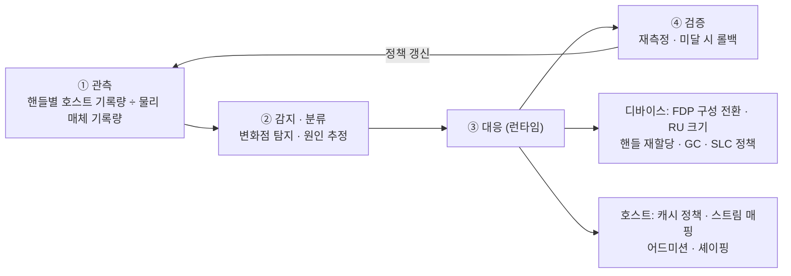

# WAF 급등의 런타임 감지·대응 — 리스크를 계약이 아니라 기술로 흡수한다

## 1. 왜 조건부 보증에서 축을 옮기는가

v5.2까지 이 문제의 답은 **WAF 밴드별 조건부 보증**이었다. 호스트 배치를 전제로 유효 DWPD를 표기하고, WAF가 밴드를 넘으면 등급을 재조정하는 계약이다. 이 구조의 약점은 분명하다. **워크로드가 바뀌면 보증이 깨지는 책임을 사실상 고객에게 되돌린다.** 고객이 자기 스택의 변경 자유를 담보로 내놓아야 하므로 수용성이 낮다.

대안은 같은 리스크를 **기술로 흡수**하는 것이다. WAF가 갑자기 오르는 것을 **감지하고 런타임에 되돌리는 능력**을 공급자가 갖는다. 계약은 기술이 흡수하고 남은 부분만 담는다.

> 2026-09-22 사용자 방향: "WAF를 모니터링하다가 갑자기 오르는 경우를 감지하고, 시스템 소프트웨어나 FDP Configuration 변경으로 대응하는 기술을 확보하는 것이 나은 방향."

## 2. WAF가 오르는 세 가지 경로

| 경로 | 내용 | 근거 |
|---|---|---|
| 워크로드 전환 | 퇴거 정책·프리픽스 재사용률·세션 길이가 바뀌면 수명 분포가 바뀐다 | CHEOPS'25는 KV 오프로드의 I/O 특성이 프레임워크마다 크게 다름을 보고 |
| 수명 오분류 · 핸들 간 간섭 | 분리가 깨지면 다른 핸들의 WAF까지 오른다 | **FAST'26 WARP** — FDP는 RUH 격리가 객체 수명과 정렬될 때만 1에 수렴 |
| 배치 힌트 손실 | 캐시 관리자·I/O 라이브러리 버전이 바뀌어 힌트가 사라지면 정격 WAF로 회귀 | CacheLib은 핸들이 소진되면 기본 핸들 0으로 폴백 |

기준선 자체가 조건에 따라 달라진다는 점도 중요하다. 같은 드라이브·같은 트레이스인데 디바이스 사용률 100%에서 기준 WAF 3.22, 50%에서 1.22다(Meta CacheLib 공식 문서).

## 3. 대응 루프

목표 주기는 **감지 1시간 · 회복 4시간**이다(설계 목표, 실측 아님). 대응 없이 방치한 경우와의 **누적 기입량 차이가 곧 보증 수명 손실**이다.

## 4. 확보해야 할 핵심 기술 요소

| ID | 기술 요소 | 현 수준 | 필요 수준 | 주체 |
|---|---|---|---|---|
| **T1** | 핸들별 WAF 텔레메트리 | OCP SMART C0는 **드라이브 단위 누적값**만 제공 | 핸들별·구간별 분해, 초 단위 샘플링 | 삼성(펌웨어) |
| **T2** | 급등 감지 알고리즘 | 사후 로그 분석에 의존 | 온디바이스 변화점 탐지, 오탐 억제, 원인 분류 | 삼성(펌웨어) |
| **T3** | 무중단 FDP 재구성 | FDP 구성은 **네임스페이스 생성 시 선택**되어 운영 중 변경 경로가 스펙에 없음 | 운영 중 구성 전환, 데이터 이전 경로, 무중단 보장 | 삼성 + NVMe 규격 |
| **T4** | 디바이스 → 호스트 경보 | 배치 열화를 알리는 규격이 없음 | 비동기 이벤트 + 원인 코드 + 권고 조치 | NVMe·OCP 규격 |
| **T5** | 정책 엔진 · 안전장치 | 수동 조치 | 오실레이션 방지, 성능 영향 상한, 롤백 | 삼성 + 고객 |
| **T6** | 검증 환경 | 실드라이브 실험만 | FDP 에뮬레이터(WARP 계열) + 트레이스 재생 회귀 | 삼성 |

T1~T3이 삼성이 직접 만드는 범위이고, T4는 규격 제안, T5~T6은 개발 인프라다.

## 5. 규격 과제

- **NVMe**: 런타임 FDP 재구성, 핸들별 기록량 필드, 배치 열화 이벤트
- **OCP Datacenter NVMe SSD 사양**: 위 텔레메트리 필드와 수용 기준 — 이 문서는 구매자(Meta·Microsoft·Google·Dell·HPE)가 쓰는 조달 사양이므로, 여기에 들어가면 요구가 된다
- **호스트 측**: 캐시 관리자의 정책 조정 API, 커널 write stream 매핑

## 6. 보증 조항 — 남기되 축소한다

- 기준은 관행대로 **TBW·물리 매체 기록량 선도달**
- 유효 DWPD는 **부가 표기**
- **대응 이력과 재측정 리포트**를 계약 부속으로 (조건부 등급표가 아니라 대응 기록)
- 원칙: **기술이 흡수한 만큼만 계약에 남긴다**

## 7. 미해결

- LLM KV 캐시 워크로드의 WAF 공개 실측이 없다(2026-09 기준). Phase 2 실측이 이 페이지 전체의 전제를 검증한다.
- 런타임 FDP 재구성의 데이터 이전 비용(대역폭·지연 영향)이 정량화돼 있지 않다.
- `DWPD_effective = DWPD_rated × (WAF_rated ÷ WAF_actual)`는 1차 출처가 없는 **유도식**이다. 인용 시 유도임을 밝힌다.

## 8. 연결

- 덱: `outputs/presentation/qlc-ssd-strategy.pptx` **6장**(v6.0)
- 역량 단계: [qlc-workload-capability-phases.md](../strategies/qlc-workload-capability-phases.md) Phase 2
- 내구성 산식: [solution-ladder-component-to-system.md](solution-ladder-component-to-system.md)
- 플랫폼 전략: [fdp-host-ssd-platform.md](../strategies/fdp-host-ssd-platform.md)
