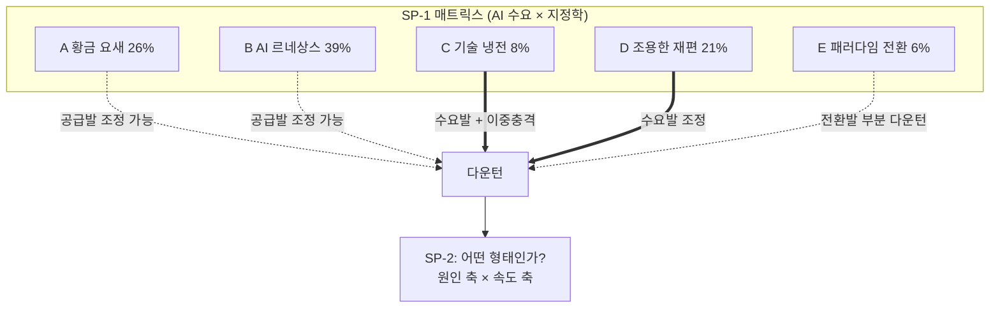
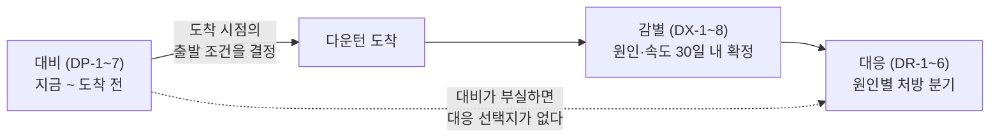

# 다운턴 시나리오 플래닝 (SP-2) — Focal Issue와 방법론

> **이 트랙의 한 문장**: 다운턴이 **오느냐**를 묻는 대신, **어떤 다운턴이 오느냐**를 묻는다. 원인(수요발/공급발)과 방식(급락형/침식형)이 다르면 대비와 대응이 통째로 달라지기 때문이다.

이 디렉토리는 위키의 **두 번째 시나리오 플래닝 트랙**이다. 기존 트랙(SP-1, [wiki/scenarios](../scenarios/scenario-matrix.md))과 방법론은 같고 Focal Issue가 다르다. 대시보드 **Scenario Planning** 메뉴에서 두 트랙은 별도 항목으로 분리되어 있다.

---

## 1. Focal Issue

> **"2027~2030년 사이 도착할 메모리 다운턴에 대해, 삼성전자 메모리사업부는 지금(호황 말기) 무엇을 준비하고, 도착한 뒤에는 무엇을 실행할 것인가?"**

### 1.1 세 개의 전제

이 Focal Issue는 세 가지를 전제로 고정하고 출발한다. 전제를 다투는 것이 아니라 전제 위에서 형태를 분기시키는 것이 이 트랙의 목적이다.

| 전제 | 내용 | 근거 |
|---|---|---|
| **① 다운턴은 온다** | 계약 체제화(LTA→SCA·take-or-pay·NTB)는 사이클의 **진폭을 줄이는** 주장이지 **소멸시키는** 주장이 아니다. 영업 수장 본인이 "충분히 올랐다·파티할 때 아니다·2차 방어선이 필요하다"고 말한다 | [lee-changsoo-memory-sales-interview-2026-08-03.md](../../sources/raw-notes/lee-changsoo-memory-sales-interview-2026-08-03.md), [lta-to-sca-industry-context-2026-06.md](../../sources/articles/lta-to-sca-industry-context-2026-06.md) |
| **② 타이밍은 이 플래닝의 대상이 아니다** | "언제"는 EWI([RS-9](../strategies/invariant/rs9-demand-inflection-sensing.md)·[수요 변곡 EWI](../concepts/demand-inflection-ewi.md))가 맡는다. 이 플래닝이 맞추는 것은 **형태**다 | 방법론 분리 |
| **③ 대비와 대응은 서로 다른 시간의 자원이다** | 대비는 지금 이 순간에만 살 수 있고(계약 커버리지·옵션 캐파·별동대), 대응은 도착한 뒤에만 살 수 있다(감산·저가매수·재편). 순서를 바꿀 수 없다 | [cmo-matrix.md §2](../storyline/cmo-matrix.md) |

### 1.2 왜 SP-1과 분리하는가

기존 SP-1의 Focal Issue는 "AI 메모리 시대에 어떤 전략적 위치를 차지할 것인가"이고, 축은 **DF1 AI 수요 지속성 × DF2 미중 지정학**이다. 그 매트릭스에서 다운턴은 시나리오 C(8%)·D(21%)의 **결과**로만 등장한다.

문제는 그 배치가 사실과 어긋난다는 점이다. [CMO 통합 매트릭스 §4.1](../storyline/cmo-matrix.md)이 이미 지적했듯 **공급발 조정은 시나리오 A·B(AI 수요 지속) 안에서도 일어난다**. 2028~29 신규 캐파 동시 도래는 AI 수요가 유지되어도 실현되는 확정 사실이기 때문이다. 즉:

**다운턴은 SP-1 매트릭스의 특정 사분면에 갇혀 있지 않다.** 다섯 시나리오 전부에서 경로가 열려 있다. 그래서 다운턴을 축으로 **다시 한 번 잘라야** 대비·대응 전략이 제대로 분기한다. 그것이 SP-2다.

### 1.3 두 트랙의 관계

| | **SP-1 (기존)** | **SP-2 (이 트랙)** |
|---|---|---|
| Focal Issue | AI 메모리 시대의 전략적 위치 | 다운턴의 원인·방식별 대비·대응 |
| 축 | DF1 AI 수요 × DF2 미중 지정학 | DF-D1 발원지 × DF-D2 전개 속도 |
| 시계 | 2026~2035 | 2027~2030 (4차 다운사이클 창) |
| 확률의 성격 | **무조건부** (합계 100%) | **조건부** — "다운턴이 도착한다는 조건 하에서" (합계 100%) |
| 산출물 | Main Bet·Side Bet·RS-1~9·D1~D17 | DP-1~DP-7(대비) · DR-1~DR-6(대응) · DX-1~DX-8(감별) |
| 관계 | 환경의 지도 | 그 지도 위 **하강 국면의 확대도** |

두 트랙은 경쟁하지 않는다. SP-1이 "어느 세계에 살게 되는가"를 그리면, SP-2는 "그 세계에서 하강이 시작될 때 무엇을 하는가"를 그린다. **SP-2의 전략은 SP-1의 RS(Robust Strategy)와 D(즉시 결정)를 다운턴 렌즈로 재배치·보강한 것**이며, 충돌하면 SP-1의 코드 정의가 우선한다.

### 1.4 경계 조건

- **In scope**: 메모리사업부(DRAM·NAND·SSD/UFS)의 손익·캐파·계약·조직·R&D 의사결정
- **Out of scope**: 파운드리·System LSI, 전사 지배구조, 환율·금리 헤지 기법 자체(재무 부문 소관)
- **분석 주체**: [삼성전자 메모리사업부](../entities/samsung.md)

---

## 2. 방법론 — 8단계 (CLAUDE.md §4 준수)

| 단계 | 산출 페이지 |
|---|---|
| 1. Focal Issue | 이 페이지 |
| 2. STEEP 요인 (다운턴 렌즈 40개) | [steep-factors.md](steep-factors.md) |
| 3. Impact × Uncertainty | [steep-factors.md §3](steep-factors.md) |
| 4. 핵심 Driving Forces (DF-D1·DF-D2) | [key-drivers.md](key-drivers.md) |
| 5. 시나리오 매트릭스 | [scenario-matrix.md](scenario-matrix.md) |
| 6. 시나리오 내러티브 5종 | [scenario-DT-A.md](scenario-DT-A.md) · [B](scenario-DT-B.md) · [C](scenario-DT-C.md) · [D](scenario-DT-D.md) · [E](scenario-DT-E.md) |
| 6.5 시나리오별 삼성 영향 진단 (S/W 노출) | [samsung-impact.md](samsung-impact.md) — 슬라이드 산출물의 단일 소스 |
| 7. 대비 전략 (Main Bet 성격) | [preparation.md](preparation.md) |
| 8. 대응 플레이북 + 감별 EWI | [response-playbook.md](response-playbook.md) · [differential-indicators.md](differential-indicators.md) |

### 2.1 SP-1과 다른 점 — 7·8단계의 구조

SP-1에서 7·8단계는 "Main Bet + Side Bet"과 "Robust 전략 + EWI"였다. SP-2에서는 **시간 축이 하나 더 들어간다**.

- **대비(DP)는 시나리오 무관하게 대부분 무후회(no-regret)** — 어떤 다운턴이 오든 손해가 아닌 것들. 그래서 SP-1의 Robust 전략과 성격이 같다.
- **대응(DR)은 원인에 따라 정반대로 갈린다** — 예컨대 감산은 공급발에서는 직접 효과가 있고 수요발에서는 없다([2023년 실증](../storyline/cmo-matrix.md)). 그래서 **감별(DX)이 대응의 전제 조건**이 된다.
- 이 구조가 이 트랙의 핵심 주장이다: **"무엇을 할 것인가"보다 "무엇인지 아는 것"이 먼저다.**

### 2.2 일관성 규칙 (CLAUDE.md §4 승계)

1. 시나리오 이름은 **중립적** — 다섯 시나리오 모두 하강 국면이므로 좋고 나쁨이 아니라 **메커니즘**으로 명명한다.
2. 모든 수치는 `sources/` 인용 필수. 출처가 없는 정성 판단은 **"출처 미확보"로 명시**한다.
3. 모든 전략은 어느 시나리오에서 작동하는지 ◎/△/✕로 명시한다.

---

## 3. 결론 요약 (한 장)

| 항목 | 결론 |
|---|---|
| **다운턴 도착 확률** (2027~2030) | 높음 — 이 트랙은 도착을 조건으로 고정하고 형태만 분기 |
| **가장 확률 높은 형태** | **DT-D 저가 잠식** (26%) — 공급발·침식형. 사이클이 아니라 **구조 변화**여서 회복이 없는 유일한 시나리오 |
| **가장 위험한 형태** | **DT-B 긴 하산** (24%) — 위기감이 생기지 않아 대응이 계속 미뤄진다. 3차 대비기 실패 패턴의 재발 최적 조건 |
| **가장 빠른 형태** | **DT-A 급제동** (20%) — 대응할 시간이 없다. 대비의 성패가 결과의 전부 |
| **축의 의미** | **원인 축 = 무엇을 조절할지** / **속도 축 = 언제 결정할지** |
| **cause-robust 대비 3종** | [DP-2 옵션형 캐파](preparation.md) · [DP-4 감별 EWI 배선](preparation.md) · [DP-5 차세대 별동대](preparation.md) — 다섯 시나리오 전부 ◎ |
| **이 트랙의 신규 기여** | [DP-1 계약 **만기 사다리화**](preparation.md) — 커버리지 총량이 아니라 **만기 집중도**가 급락의 방아쇠다 |
| **현재 위치** | DF-D1 공급 쪽 소폭 기울음(+0.5) / DF-D2 침식 쪽 기울음(-1.0), 단 **계약 만기 시점에 부호 반전** |

---

## 관련 페이지

- [CMO 통합 매트릭스](../storyline/cmo-matrix.md) — 1~3차 다운턴 관측 + 4차 예측. **이 트랙의 역사적 근거**
- [CMO 렌즈 스토리라인](../storyline/storyline-cmo.md) — 다운턴별 M×C→O 서사
- [SP-1 시나리오 매트릭스](../scenarios/scenario-matrix.md) — 상위 환경 지도
- [Robust 전략 RS-1~RS-9](../strategies/invariant/README.md) — DP·DR이 참조하는 전략 코드
- [수요 변곡 EWI](../concepts/demand-inflection-ewi.md) — DX 지표의 상위 체계
- [메모리 3사 CAPEX 히스토리](../concepts/memory-capex-history.md) — 역사이클 투자 정량 근거
- [경기 사이클 대응 7대 패턴](../benchmark/cyclical-strategy-benchmark.md) — 타 산업 벤치마크
