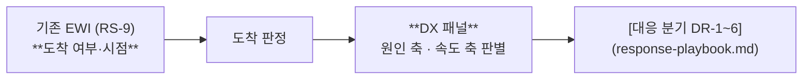

# 감별 지표 DX-1 ~ DX-8 — 다운턴의 원인·속도를 판별하는 패널

> 기존 EWI([RS-9](../strategies/invariant/rs9-demand-inflection-sensing.md)·[수요 변곡 EWI](../concepts/demand-inflection-ewi.md))는 **"다운턴이 오는가"**를 묻는다. DX 패널은 **"어떤 다운턴인가"**를 묻는다. 두 체계는 대체가 아니라 직렬이다.

## 1. 설계 원칙

### 1.1 결과 지표만으로는 판별할 수 없다

가격 하락·재고 증가·매출 감소는 **네 시나리오 전부에서 동일하게 나타난다.** 원인을 판별하려면 **맥락 지표**가 필요하다 — 수요 측에서 무슨 일이 일어나는지, 공급 측에서 무슨 일이 일어나는지를 각각 직접 보는 지표.

| 유형 | 예 | 판별력 |
|---|---|---|
| 결과 지표 | 계약가, 재고일수, 매출, OPM | **없음** — 모든 시나리오에서 같은 방향 |
| 수요 측 맥락 | FCF, 조달 스프레드, GPU 임대가, DC 착공 취소, 메모리 원단위 | 원인 축 판별 |
| 공급 측 맥락 | 증설 공시, 웨이퍼 투입-출하 갭, 경쟁사 점유율, 인증 개방 | 원인 축 판별 |
| 형태 지표 | 변화율의 2차 미분, 현물-계약 스프레드, 만기 집중도 | 속도 축 판별 |

### 1.2 임계형과 추세형을 병행한다

**침식형(DT-B·DT-D)은 임계를 한 번에 넘지 않는다.** 임계 기반 경보만 걸어두면 침식형에서는 영원히 울리지 않는다. 3차 대비기의 실패(DS 재고 +76.6% 방치)가 그 사례다 ([samsung-pre-downturn-preparation-2005-2022-2026-08-08.md](../../sources/articles/samsung-pre-downturn-preparation-2005-2022-2026-08-08.md)).

따라서 각 DX 지표는 **레벨 임계**와 **추세 조건**을 함께 정의한다.

---

## 2. 원인 축 판별 지표 (DX-1 ~ DX-5)

### DX-1 — 하이퍼스케일러 FCF 부호 + 조달 스프레드 🔵 **수요발 최선행**

| 항목 | 내용 |
|---|---|
| **정의** | 빅테크 4~5사의 잉여현금흐름(FCF) 부호·추세 + AI 인프라 관련 회사채/SPV 스프레드 |
| **판별** | 수요발 (DT-A 강·DT-B 약) |
| **선행 시간** | 6~12개월 |
| **레벨 임계** | FCF 마이너스 **2분기 연속** + 조달 스프레드 확대 |
| **추세 조건** | CapEx **증가율**(레벨 아님)의 2분기 연속 감속 → DT-B 신호 |
| **현재 (2026-08)** | ⚠️ **경보** — Meta FCF -91%(→$784M)·Amazon TTM FCF 마이너스 전환(~-$7.6B). 단 4사 CapEx 전원 상향·삭감 0건 ([hyperscaler-q2-2026-actuals-gpu-rental-2026-08-11.md](../../sources/articles/hyperscaler-q2-2026-actuals-gpu-rental-2026-08-11.md)) |
| **판독 노트** | "진짜 꼭짓점은 CapEx가 아니라 FCF" — CapEx가 늘면서 FCF가 흑자→마이너스로 반전하는 것이 하락 tell ([lee-changsoo-memory-sales-interview-2026-08-03.md](../../sources/raw-notes/lee-changsoo-memory-sales-interview-2026-08-03.md)) |
| **기존 EWI 연계** | `bigtech_capex_growth`·`demand_inflection_divergence` |

### DX-2 — GPU 현물 임대가 6개월 변화율 🔵 **Tier0 최선행**

| 항목 | 내용 |
|---|---|
| **정의** | H100·H200 등 온디맨드 임대가 바스켓의 6개월 변화율 |
| **판별** | 수요발 (DT-A) |
| **선행 시간** | 3~6개월 |
| **레벨 임계** | 6개월 **-35%** |
| **추세 조건** | 3분기 연속 하락 (급락 없이) → DT-B 신호 |
| **현재 (2026-08)** | ✅ **미발동** — firming/flat (H100 ~$2.69·H200 ~$4.38) |
| **판독 노트** | 컴퓨트 수급의 가장 빠른 실시간 프록시. 대시보드 자동 갱신(Vast.ai) |

### DX-3 — AI DC 착공·가동 취소·연기 건수

| 항목 | 내용 |
|---|---|
| **정의** | [DC 착공 트래커](../concepts/ai-datacenter-buildout.md)(55.9GW·47건) 대비 취소·연기 전환 건수와 GW |
| **판별** | 수요발 (DT-A 강) |
| **선행 시간** | 6~24개월 (메모리 수요 선행) |
| **레벨 임계** | 분기 취소·연기 GW가 파이프라인의 유의미한 비중 초과 |
| **추세 조건** | 신규 착공 건수의 3분기 연속 감소 → DT-B |
| **판독 노트** | **전력 병목에 의한 지연(S2·E1)과 수요 소멸을 구분해야 한다.** 지연은 수요를 뒤로 밀 뿐이고 침식형 쪽으로 형태를 끈다 |

### DX-4 — 웨이퍼 투입 대 업계 출하 갭 + 증설 공시 🔵 **공급발 최선행**

| 항목 | 내용 |
|---|---|
| **정의** | 3사+CXMT 웨이퍼 투입 증가율 − 업계 출하(비트) 증가율 / 신규 증설·장비 발주 공시 건수 |
| **판별** | 공급발 (DT-C 강) |
| **선행 시간** | **12개월 — 가장 긴 예고 시간** |
| **레벨 임계** | 갭이 2분기 연속 플러스 확대 |
| **추세 조건** | 증설 공시 누적 건수 상승 |
| **보조 정성 지표** | **절제 이탈 신호** — 점유율 목표 공개 언급, 가동률 유지 공언, 예정보다 이른 램프업. 이것이 DT-C의 **급락 스위치** |
| **판독 노트** | 공급발 다운턴은 예고 시간이 가장 길다. 여기서 놓치면 다른 지표로는 못 잡는다 |

### DX-5 — CXMT·YMTC 점유율 + 인증 개방 🔵 **DT-D 전용**

| 항목 | 내용 |
|---|---|
| **정의** | CXMT DRAM·YMTC NAND의 캐파 점유율·출하 점유율 / 글로벌 대형 고객의 인증 승인 여부 |
| **판별** | 공급발 침식 (DT-D) |
| **선행 시간** | 상시 (구조 지표) |
| **레벨 임계** | CXMT 캐파 점유 **15%** (2028E) |
| **리트머스 1** | **애플–CXMT 인증 승인/차단** — 승인 시 인증 장벽 붕괴, DT-D 가속 ([apple-cxmt-china-dram-2026-07-08.md](../../sources/articles/apple-cxmt-china-dram-2026-07-08.md)) |
| **리트머스 2** | CXMT 허페이 **본디드 DRAM 파일럿의 양산 전환** — EUV 우회 성공 여부 |
| **현재 (2026-08)** | ⚠️ 진행 — 캐파 점유 11% → 15%(2028E), 애플 검증 착수·미해결 |
| **기존 EWI 연계** | `cxmt_apple_qualification` |

---

## 3. 속도 축 판별 지표 (DX-6 ~ DX-8)

### DX-6 — 현물-계약 스프레드의 부호와 확대 속도 🔵 **급락 판별**

| 항목 | 내용 |
|---|---|
| **정의** | 현물가와 계약가의 괴리 폭·확대 속도 |
| **판별** | 속도 축 (급락 vs 침식) |
| **판독** | **급락형**: 현물이 계약을 크게 하회하며 괴리가 빠르게 확대 → 갱신 시점에 낙차가 확정된다 / **침식형**: 두 가격이 나란히 완만하게 하락, 괴리 안정 |
| **선행 시간** | 1~2분기 |
| **변형 (DT-D용)** | **레거시-선단 스프레드** — 레거시가 먼저 눌리면 저가 잠식의 상향 침투 신호 |

### DX-7 — 계약 만기 집중도 (HHI) 🔵 **이 트랙의 신규 지표**

| 항목 | 내용 |
|---|---|
| **정의** | 분기별 만기 도래 계약 금액의 집중도 (허핀달 지수 또는 최대 단일 분기 비중) |
| **판별** | 속도 축 — **DT-B → DT-A 전이 위험** |
| **왜 중요한가** | 계약은 급락을 막는 것이 아니라 **미룬다**. 만기가 한 분기에 몰려 있으면 그 시점에 시장가로 한꺼번에 재가격된다 → 커버리지가 두꺼울수록 낙차가 크다 |
| **레벨 임계** | 단일 분기 만기 도래액이 총 커버리지의 일정 비율 초과 |
| **데이터 소재** | **내부 계약 데이터** — 외부 지표가 아니다. 산출 체계 구축이 선행 필요 |
| **현재 상태** | 🔴 **미측정** — 2026 Q4까지 내부 산출 체계 확립이 [DP-1](preparation.md)의 첫 실행 항목 |
| **연계 액션** | [DP-1 만기 사다리화](preparation.md) |

### DX-8 — 메모리 원단위 (Memory Intensity) 🔵 **DT-B 유일 조기 신호**

| 항목 | 내용 |
|---|---|
| **정의** | AI 가속기 1장당 HBM 용량, AI 서버 1대당 DRAM 용량, (가능하면) 토큰당 메모리 소요 |
| **판별** | 수요발 침식 (DT-B) |
| **왜 중요한가** | DT-B는 **수요가 줄어서가 아니라 원단위가 줄어서** 오는 다운턴이다. 총 AI 투자를 아무리 봐도 잡히지 않는다 |
| **레벨 임계** | 신규 가속기 세대의 메모리 탑재 증가율이 전 세대 대비 감속 |
| **추세 조건** | 메모리 매출 성장률 < AI 인프라 지출 성장률이 **2분기 연속** |
| **보조 관측** | KV 캐시 SSD 오프로드 채택률, CXL 풀링 어태치율, 추론 프레임워크의 메모리 절감 벤치마크 |
| **반대 방향 힘** | 에이전트·추론 폭증(T10)이 원단위 감소를 상쇄할 수 있다 — **순(net) 방향**을 봐야 한다 |
| **현재 상태** | 🟠 **부분 측정** — 세대별 탑재량은 추적 가능, 토큰당 소요는 방법론 미확립 |

---

## 4. 판별 결정표

DX 패널 판독 결과의 조합 → 시나리오 배정.

| DX-1 FCF·조달 | DX-2 임대가 | DX-4 투입갭·증설 | DX-6 스프레드 | DX-8 원단위 | → 시나리오 |
|---|---|---|---|---|---|
| 🔴 악화 | 🔴 급락 | 🟢 정상 | 🔴 급확대 | — | **DT-A 급제동** |
| 🟠 증가율 감속 | 🟠 완만 하락 | 🟢 정상 | 🟢 안정 | 🔴 원단위 하락 | **DT-B 긴 하산** |
| 🟢 정상 | 🟢 정상 | 🔴 갭 확대 + 절제 이탈 | 🔴 급확대 | 🟢 정상 | **DT-C 동시 방류** |
| 🟢 정상 | 🟢 정상 | 🟠 갭 완만 | 🟠 레거시 선행 하락 | 🟢 정상 | **DT-D 저가 잠식** (+ DX-5 점유율 상승) |
| 🟢 정상 | 🟢 정상 | 🟢 정상 | 특정 제품군만 | — | **DT-E 판 갈이** (총시장 성장률과의 괴리 확인) |

### 오진 방지 체크

| 오진 | 감별 키 |
|---|---|
| 전환발(DT-E)을 수요발로 오독 | **총시장 성장률 vs 자사 해당 제품군 성장률의 괴리** — 시장이 성장 중이면 수요발이 아니다 |
| 전력 지연(S2·E1)을 수요 소멸로 오독 | DX-3의 취소 vs 연기 구분 — 연기는 수요가 뒤로 밀린 것 |
| 침식형을 "이상 없음"으로 오독 | 레벨이 아닌 **추세·2차 미분** 판독 병행 |
| DT-D를 못 봄 | DT-D는 **배경**이라 다른 시나리오와 동시 진행한다 — 별도 판정 필수 |

---

## 5. 현재 패널 상태 (2026-08-15)

| 지표 | 상태 | 값·비고 |
|---|---|---|
| **DX-1** FCF·조달 | ⚠️ 경보 | Meta FCF -91%·Amazon TTM 마이너스. 단 CapEx 삭감 0건 |
| **DX-2** GPU 임대가 | ✅ 정상 | firming/flat (H100 ~$2.69·H200 ~$4.38) |
| **DX-3** DC 취소·연기 | ✅ 정상 | 파이프라인 55.9GW 유지, 대규모 취소 미관측 |
| **DX-4** 투입갭·증설 | 🟠 주의 | 2028~29 신규 캐파 파이프라인 확정. 절제 이탈 신호는 **미관측** |
| **DX-5** CXMT·인증 | ⚠️ 진행 | 캐파 점유 11%→15%(2028E), 애플 검증 미해결 |
| **DX-6** 현물-계약 스프레드 | ✅ 정상 | 계약가 상승 지속(Q3 +13~18% 감속) |
| **DX-7** 만기 집중도 | 🔴 **미측정** | **최우선 구축 항목** |
| **DX-8** 메모리 원단위 | 🟠 부분 측정 | 세대별 탑재량 추적 가능, 토큰당 방법론 미확립 |

### 종합 판독

> **다운턴 미도착. 수요 측 경보 1건(DX-1)·공급 측 진행 2건(DX-4·DX-5).** 최선행 지표(DX-2)는 미발동이며 결과 지표(가격·재고)도 정상이다. 현재 국면은 **대비(preparation) 국면**이며, 가장 시급한 것은 판별 능력 자체의 공백을 메우는 것 — **DX-7(만기 집중도) 미측정**이 유일한 🔴 항목이다.

---

## 6. 구축 로드맵

| 순위 | 항목 | 기한 | 담당 성격 |
|---|---|---|---|
| 1 | **DX-7 만기 집중도** 산출 체계 | 2026 Q4 | 내부 계약 데이터 — 영업·기획 |
| 2 | **DX-8 메모리 원단위** 방법론 확립 | 2027 H1 | 상품기획·기술전략 |
| 3 | **DX-4 투입-출하 갭** 추정 모델 | 2027 H1 | 시장분석 |
| 4 | DX-1~3·5~6 대시보드 자동 갱신 확장 | 상시 | 기존 EWI 체계 확장 |
| 5 | 판별 결정표의 **트리거 배선** (30일 집행 의무) | 2027 H1 | [DP-4](preparation.md) |

## 7. 갱신 규칙

- 각 지표의 임계·현재값이 바뀌면 이 페이지와 `dashboard/src/data/downturnPlanning.js`의 `DT_INDICATORS`를 동반 갱신한다.
- 기존 EWI([indicators.js](../../dashboard/src/data/indicators.js))와 중복되는 지표는 **기존 지표를 단일 소스로** 하고 여기서는 판별 관점의 해석만 기록한다.
- 판별 결정표는 실제 다운턴 도착 시 관측으로 검증하고, 오진이 발생하면 그 사례를 표에 추가한다.
