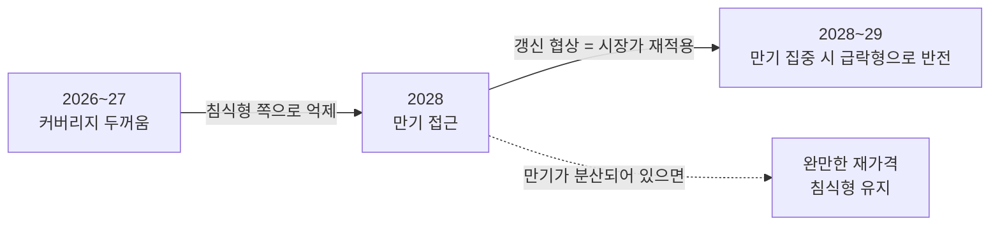

# 다운턴 핵심 Driving Forces — DF-D1 · DF-D2

> 사용자 문제 정의를 그대로 축으로 옮긴다: **"어떤 원인으로 오는가"(DF-D1)** × **"어떤 방식으로 오는가"(DF-D2)**.

## 1. 선별 프로세스

[STEEP 40개 요인](steep-factors.md)의 Top 12에서 두 기준을 적용했다.

1. **점수 기준** — I×U 상위군
2. **독립성 기준** — 한 축이 다른 축의 원인·결과로 포섭되지 않을 것

선정 결과: **DF-D1(발원지) × DF-D2(전개 속도)**를 주축으로, **전환군(T1·T2·T5)**은 와일드카드 축으로 분리.

---

## 2. DF-D1 — 다운턴의 발원지: 수요 수축 주도 vs 공급 확대 주도

- **정의**: 2027~2030 다운턴의 1차 방아쇠가 **수요 측**(AI 투자·조달·메모리 원단위)에 있는가, **공급 측**(신규 캐파 도래·절제 붕괴·저원가 진입자)에 있는가.

- **왜 핵심인가**: 이 축이 **"무엇을 조절할 것인가"**를 결정한다. 공급발이면 공급을 줄이는 것이 가격에 직접 작동한다 — 수요는 그대로이므로 수급 균형이 회복된다. 수요발이면 공급을 줄여도 가격이 돌아오지 않는다. 사라진 것은 수요이기 때문이다. **삼성은 이 구분을 틀려서 이미 한 번 큰 비용을 치렀다** — 2022-10-27 "인위적 감산 없다" → 2023-01-31 재확인 → 2023-04-07 감산 공식화로 이어진 6개월의 궤적에서 DS는 -4.58조 사상 최대 적자를 냈고, 소모전 교범(체력 열위 경기자 퇴출)은 3강 과점 맥락에서 **불발**했다 ([samsung-downturn-actions-2007-2023-2026-08-07.md](../../sources/articles/samsung-downturn-actions-2007-2023-2026-08-07.md)). 원인 오판은 대응 전체를 무효화한다.

### Pole A — 수요 수축 주도 (Demand-led)

AI 인프라 투자의 **자금 또는 명분**이 먼저 끊긴다. 두 경로가 있다.

- **금융 경로**: 하이퍼스케일러의 CapEx-FCF 다이버전스가 조달 조건 악화로 전이 → 신규 DC 발주 동결. 이 경로는 **이미 실측 단계에 진입**했다: Meta FCF -91%(→$784M)·Amazon TTM FCF 마이너스 전환(~-$7.6B), 4사 2026 CapEx 합산 ~$745~750B(+82% YoY)이면서 **삭감은 0건** ([hyperscaler-q2-2026-actuals-gpu-rental-2026-08-11.md](../../sources/articles/hyperscaler-q2-2026-actuals-gpu-rental-2026-08-11.md)). 즉 지출은 늘고 현금 창출은 줄어드는 후기순환 tell이 관측되고 있다. 영업 수장의 프레임도 같다 — **"진짜 꼭짓점은 CapEx가 아니라 FCF"** ([lee-changsoo-memory-sales-interview-2026-08-03.md](../../sources/raw-notes/lee-changsoo-memory-sales-interview-2026-08-03.md)).
- **기술 경로**: 추론 최적화·모델 경량화·CXL 풀링으로 **메모리 원단위**(GPU 1장당·토큰당 GB)가 하락 → AI가 계속 성장해도 메모리 수요 증가율이 꺾인다. 붕괴 없이 성장률만 0으로 수렴하는 경로.

- 노출 구조: 삼성의 고부가 캐파(HBM·서버)가 직격. HBM 편중 다운사이드 — "HBM이 꺼지면 캐파가 stranded되고, HBM↔DDR 상쇄로 shortage가 oversupply로 반전"([choi-jangseok-product-planning-interview-2026-07-29.md](../../sources/raw-notes/choi-jangseok-product-planning-interview-2026-07-29.md)).

### Pole B — 공급 확대 주도 (Supply-led)

수요는 유지되는데 공급이 앞선다. 세 개의 힘이 **동시에** 2028~29에 도착한다.

1. **신규 캐파 동시 도래** — Micron Idaho·SK 용인·한국 팹 증설분. 착공·발주가 이미 끝난 **확정 사실**이다([semiconductor-cycle.md](../concepts/semiconductor-cycle.md)).
2. **감가 정점 통과** — 삼성 기계장치 내용연수 5년·상각률 77.1%, 감가상각비의 85~93%가 기계장치([semiconductor-depreciation-cost-structure-2026-08.md](../../sources/articles/semiconductor-depreciation-cost-structure-2026-08.md)). 2028~29에 감가가 끝난 설비 풀이 최대가 되면 **원가 하한이 내려간다** → 가격이 더 깊이 내려갈 여지가 생긴다. 방어 자산이면서 동시에 과잉의 연료다.
3. **보조금 기반 진입자** — CXMT 캐파 점유 11%→15%(2028) 접근([apple-cxmt-china-dram-2026-07-08.md](../../sources/articles/apple-cxmt-china-dram-2026-07-08.md)). 원가 논리로 퇴출되지 않는 공급자의 등장은 **소모전 교범의 전제를 무너뜨린다**([memory-cycle-storyline-r3-2026-08-12.md](../../sources/raw-notes/memory-cycle-storyline-r3-2026-08-12.md) 치킨게임 4대 전제 붕괴).

### 현재 위치 (2026-08-15): **공급 쪽으로 소폭 (+0.5 / 척도 -10 수요발 ↔ +10 공급발)**

양쪽 압력이 모두 축적 중이나 성격이 다르다.

| | 수요 측 | 공급 측 |
|---|---|---|
| 관측된 것 | CapEx-FCF 다이버전스 **실측**, GPU 임대가 firming/flat(H100 ~$2.69·H200 ~$4.38 — **붕괴 아님**) | 신규 캐파 파이프라인 **착공 완료**, 감가 정점 도래 확정, CXMT 점유 상승 진행 |
| 사실의 성격 | **신호** — 아직 발화 전 | **확정** — 되돌릴 수 없음 |
| 판정 | 경보 단계 | 진행 단계 |

→ 무게를 준다면 공급 측. **확정된 사실이 신호보다 무겁기 때문**이지, 수요 붕괴 확률이 낮아서가 아니다. 단 +0.5의 소폭에 그친다 — 수요 측 신호가 임계를 넘으면 즉시 반전 가능한 거리다.

---

## 3. DF-D2 — 조정의 전개 형태: 급락형 vs 침식형

- **정의**: 하강이 **2~4분기 내 큰 낙차**로 진행되는가(급락형·Cliff), **2~3년에 걸쳐 완만하게** 진행되는가(침식형·Grind).

- **왜 핵심인가**: 이 축이 **"언제 결정할 것인가"**를 결정한다.
  - **급락형에서는 대응할 시간이 없다.** 도착 후에 논의를 시작하면 끝난다. 결과는 **도착 시점에 이미 갖춰져 있던 것**(계약 커버리지·현금·트리거 배선)으로 거의 결정된다 → **대비의 문제**.
  - **침식형에서는 시간은 있는데 위기감이 없다.** 매 분기 "일시적"으로 설명 가능하고, 재고는 임계까지 안 가고, 적자는 안 난다. 그래서 결정이 계속 미뤄진다 → **인지의 문제**. 3차 대비기의 실패(DS 재고 16.5조→29.1조 **+76.6%**를 방치, 2022-10 무감산 선언, 2023-04 뒤늦은 선회)가 정확히 이 실패 유형이다([samsung-pre-downturn-preparation-2005-2022-2026-08-08.md](../../sources/articles/samsung-pre-downturn-preparation-2005-2022-2026-08-08.md)).

  **한 문장으로**: 급락형은 준비의 문제, 침식형은 인지의 문제다.

### Pole A — 급락형 (Cliff)

- 방아쇠: **계약 만기 집중**(Ec5) · **더블오더링 언와인드**(Ec6) · **신용 이벤트**(Ec2) · **절제 붕괴**(Ec7).
- 메커니즘: 현물가가 먼저 무너지고 계약가가 갱신 시점에 한꺼번에 반영된다. 재고가 없는 핸드투마우스 상태에서 반전하면 낙차가 최대가 된다.
- 지속: 4~6분기. 이후 V자 또는 U자.

### Pole B — 침식형 (Grind)

- 방아쇠: **메모리 원단위 감소**(T4) · **CXMT 점진 침투**(T6·Ec8) · **수요의 지연**(S2·E1).
- 메커니즘: 가격이 폭락하는 대신 **성장률이 0으로 수렴**한다. 분기마다 -3~8%씩, 재고는 위험 수준에 도달하지 않고, 마진만 지속적으로 얇아진다.
- 지속: 8~12분기. 회복이 **원래 수준으로 돌아오지 않을** 수 있다(특히 DT-D).

### 현재 위치 (2026-08-15): **침식 쪽으로 (-1.0 / 척도 -10 침식 ↔ +10 급락) — 단 부호가 시간에 따라 반전**

현재 take-or-pay 멀티이어·NTB(Not-To-Below) 가격 하한·NTE 상한이 다수 체결되어 있고 선수금이 예치된 상태다([lee-changsoo-memory-sales-interview-2026-08-03.md](../../sources/raw-notes/lee-changsoo-memory-sales-interview-2026-08-03.md)). 이 구조는 초기 급락을 흡수한다 → 침식 쪽.

**그러나 이것이 이 트랙의 가장 중요한 발견이다:**

> **계약은 급락을 막는 것이 아니라 미룬다.** 커버리지가 두꺼울수록 만기 시점의 낙차가 커진다. 만기가 한 시점에 몰려 있으면, 계약은 **급락 방지 장치가 아니라 급락 발사 장치**가 된다.



따라서 DF-D2의 현재 위치 -1.0은 **시점 조건부**다. 계약 만기 구조를 모르면 이 축의 위치를 알 수 없다 → [DP-1 만기 사다리화](preparation.md)와 [DX-7 만기 집중도](differential-indicators.md)가 여기서 나온다.

---

## 4. 독립성 검증 — 네 사분면 모두 역사적 실례가 있는가

두 축이 독립이려면 **네 조합 모두 실현 가능**해야 한다. 메모리 산업 역사로 검증한다.

| 조합 | 역사적 실례 | 근거 |
|---|---|---|
| **수요발 × 급락** | 2008 Q4 금융위기 — 수요 급정지. 삼성 2008 Q4 반도체 -0.56조(OPM -14%), 경쟁사는 -40% 이하 | [samsung-downturn-actions-2007-2023-2026-08-07.md](../../sources/articles/samsung-downturn-actions-2007-2023-2026-08-07.md) |
| **수요발 × 침식** | 2022~23 — 팬데믹 반동·금리에 의한 수요 둔화가 **6개월 이상 "일시적"으로 해석**되는 동안 재고 +76.6% 축적. 급락이 아니라 인지 실패의 사례 | [samsung-pre-downturn-preparation-2005-2022-2026-08-08.md](../../sources/articles/samsung-pre-downturn-preparation-2005-2022-2026-08-08.md) |
| **공급발 × 급락** | 2007~09 치킨게임 1차 — 6강 캐파 경쟁으로 현물가가 원가 이하로 붕괴, 키몬다 누적손실 $30억·2009-01 파산 | [dram-chicken-game-history-2026-08-05.md](../../sources/articles/dram-chicken-game-history-2026-08-05.md) |
| **공급발 × 침식** | 2010~13 치킨게임 2차 — 급락이 아니라 **2년 이상 저가 지속**으로 엘피다가 부채 4,480억 엔에 소진되어 2012 파산 | [dram-chicken-game-history-2026-08-05.md](../../sources/articles/dram-chicken-game-history-2026-08-05.md) |

**네 사분면 모두 실례가 있다.** 즉 원인이 속도를 결정하지 않는다 — 수요발도 급락·침식 양쪽으로 갈 수 있고, 공급발도 마찬가지다. 독립성 기준 **충족**.

> 다만 완전 독립은 아니다. **Ec2(신용 이벤트)는 수요발이면서 급락 가속 요인**이고, **T4(원단위)는 수요발이면서 침식 요인**이다. 즉 일부 요인은 두 축에 동시에 걸린다. 이는 2×2 축의 통상적 상관 수준이며(SP-1의 DF1·DF2도 완전 독립은 아니다), 네 사분면이 모두 실현 가능한 이상 매트릭스 구성에 문제가 없다.

---

## 5. 기각된 축 후보 — 그리고 그 이유

방법론상 중요하므로 명시한다. 기각된 축은 사라지지 않고 **시나리오 내부 변수**로 재배치된다.

| 기각된 축 후보 | 기각 이유 | 재배치 |
|---|---|---|
| **"다운턴이 오는가 / 안 오는가"** | 이 트랙은 도착을 **전제로 고정**한다(README §1.1). 도착 여부는 SP-1의 DF1이 이미 다룬다 | SP-1 DF1 |
| **제품별 분화 (HBM 방어 vs 전 제품 동반)** | DF-D1의 **종속 결과**다 — 수요발이면 HBM 직격, 공급발이면 범용 우선. 독립 아님 | 각 시나리오의 "제품 축 노출" 절 |
| **미중 지정학 강도** | SP-1의 DF2와 **완전 중복**. 축으로 재사용하면 두 트랙이 같은 그림이 된다 | 각 시나리오의 "배경 조건" |
| **3사 절제 유지 여부 (치킨게임 재발)** | 공급발의 하위 메커니즘이면서 **동시에 속도 가속 요인**이라 축으로는 이중 계상된다 | DF-D1 Pole B에 흡수 + DF-D2 급락 방아쇠로 병기 |
| **기술 패러다임 전환 (3D DRAM·zHBM)** | 방향이 아니라 **판 자체를 바꾼다** — 수요/공급 어느 쪽도 아닌 제품 정의의 변화. 2×2에 넣을 수 없음 | **와일드카드 [DT-E](scenario-DT-E.md)** |
| **재무 체력·현금 보유고** | 삼성이 **통제 가능한 내부 변수**다. 시나리오 플래닝의 축은 외부 변수여야 함 | 대비 전략([preparation.md](preparation.md)) |

---

## 6. 축 조합 — 2×2 구성

```
                        급락형 (DF-D2 Pole A)
                              ↑
                              │
      DT-A 「급제동」          │          DT-C 「동시 방류」
   (수요발 × 급락) 20%         │        (공급발 × 급락) 22%
                              │
수요발 ────────────────────────┼──────────────────────── 공급발
 (DF-D1 Pole A)               │                    (DF-D1 Pole B)
                              │
      DT-B 「긴 하산」         │          DT-D 「저가 잠식」
   (수요발 × 침식) 24%         │        (공급발 × 침식) 26%
                              │
                              ↓
                        침식형 (DF-D2 Pole B)

※ DT-E 「판 갈이」 (와일드카드, 8%): 전환군 발화 — 수요·공급 어느 축에도 속하지 않는
   제품 정의의 변화. 총시장은 성장하는데 특정 자산군만 다운턴.
```

상세는 [scenario-matrix.md](scenario-matrix.md).

### 두 축이 각각 무엇을 결정하는가

| 축 | 결정하는 것 | 실무 번역 |
|---|---|---|
| **DF-D1 발원지** | **무엇을 조절할지** | 공급발 → 감산·투자 이연이 직접 작동 / 수요발 → 감산 무효, 캐파 전환·계약 방어·저가 매수로 |
| **DF-D2 전개 속도** | **언제 결정할지** | 급락형 → 도착 전 배선이 전부(대비) / 침식형 → 판단 기준을 가격이 아닌 **원가 곡선 백분위**로 전환(인지) |

이 두 문장이 [대응 플레이북](response-playbook.md)의 전체 골격이다.
