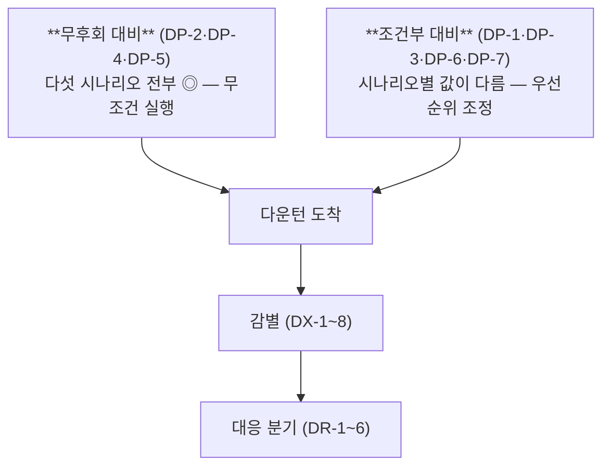

# 다운턴 대비 전략 DP-1 ~ DP-7

> **대비는 지금 이 순간에만 살 수 있다.** 다운턴이 도착한 뒤에는 계약 커버리지를 새로 만들 수도, 확정 발주를 옵션으로 되돌릴 수도, 전환 라인을 훈련시킬 수도 없다. 이 페이지의 일곱 항목은 전부 **유효기간이 있는 결정**이다.

## 1. 설계 원칙

### 1.1 왜 Main Bet이 없는가

[SP-1](../scenarios/strategy.md)은 시나리오 B에 Main Bet을 걸었다. SP-2에는 Main Bet이 없다. 특정 하강 형태가 오기를 전제하고 자원을 몰아넣는 것은 **"원인을 하나로 단정하고 대응 몰아주기"**([CMO 매트릭스 §4.3](../storyline/cmo-matrix.md)의 실수 패턴)와 같기 때문이다.

대신 구조는 이렇다:

### 1.2 역사가 말하는 제약 — 레퍼토리가 얇다

[CMO 매트릭스 §3.3](../storyline/cmo-matrix.md)의 결론을 그대로 승계한다. 세 번의 대비기(2005~07·2009~10·2020~22) 20년에 걸쳐 **다운턴을 겨냥한 의도적 대비는 7건뿐**이었고, 그중 2건은 미실행(✕)·3건은 부분(△)이었다. 명확히 성공한 것은 둘뿐이다:

| 성공한 대비 | 형태 |
|---|---|
| **양산 투입 이연** (2007, 50nm 개발 완료·양산 2008로) | 속도를 늦춘 것 |
| **선급 장기공급계약 참여** (2005-11 Apple) | 바닥을 깐 것 |

**"무엇을 더 한 것"이 아니라 "투입을 늦추고 하한을 깐 것"이 통했다.** 반면 실패한 2건은 **하지 않은 것**(HBM 니치 조직 유지·재고 조정)이었다.

따라서 DP-1~7의 설계 방침은 다음과 같다. **① 늦출 수 있게 만든다(DP-2) ② 하한을 깐다(DP-1) ③ 안 하는 것을 막는 배선을 건다(DP-4·DP-5) ④ 역사에 없던 수단을 처음 갖춘다(DP-3·DP-6·DP-7).**

---

## 2. DP-1 — 계약 바닥의 **만기 사다리화** (Maturity Laddering)

**이 트랙의 신규 기여.** 기존 전략([RS-8](../strategies/invariant/rs8-structured-revenue-hedging.md)·[RS-4](../strategies/invariant/rs4-customer-portfolio-diversification.md)·D12)은 커버리지 **총량**을 KPI로 삼는다. 이 항목은 거기에 **만기 분산**을 추가한다.

### 문제

현재 take-or-pay 멀티이어·NTB(Not-To-Below) 하한·NTE 상한이 다수 체결되어 있고 선수금이 예치되어 있다 ([lee-changsoo-memory-sales-interview-2026-08-03.md](../../sources/raw-notes/lee-changsoo-memory-sales-interview-2026-08-03.md)). 이 구조는 다운턴 초기를 흡수한다.

**그러나 계약은 급락을 막는 것이 아니라 미룬다.** 만기가 2028~29에 몰려 있다면 그 시점에 시장가로 한꺼번에 재가격된다. 커버리지가 두꺼울수록 그 낙차가 크다. **계약이 급락 방지 장치가 아니라 급락 발사 장치가 되는 구조**다.

이것이 [DT-B → DT-A 전이](scenario-matrix.md)의 메커니즘이고, SP-2가 발견한 가장 실무적인 리스크다.

### 실행

| 항목 | 내용 |
|---|---|
| **신규 KPI** | 커버리지 비율(기존) + **분기별 만기 도래 금액의 집중도(HHI)** — [DX-7](differential-indicators.md) |
| **목표** | 어느 단일 분기에도 총 커버리지의 일정 비율 이상이 만기 도래하지 않도록 상한 설정 |
| **수단** | 신규 계약의 기간을 의도적으로 어긋나게 설계(3년·4년·5년 혼합), 기존 계약의 조기 갱신으로 만기 분산 |
| **부가 조건** | 갱신 시 **가격 재협상과 물량 재협상을 분리**(HTA 구조) — 물량은 유지하고 가격만 재산정하는 경로 확보 |
| **평시 창** | **부족 국면에만 열린다** — 고객이 먼저 선급·다년 계약에 들어오는 지금이 유일한 창 |

### 시나리오 가치

| DT-A | DT-B | DT-C | DT-D | DT-E |
|---|---|---|---|---|
| ◎ | ◎ | ◎ | △ | △ |

- DT-A·B: 분산되어 있으면 재가격이 한꺼번에 오지 않는다 → **급락을 침식으로 변환**
- DT-C: 과잉은 비계약 노출 물량에만 직접 타격 → 커버리지가 방패
- DT-D: 갱신 시점에 **이미 낮아진 앵커**로 재가격되므로 방패의 유효기간이 짧다
- DT-E: 구세대 제품에 묶일 위험 — 계약이 오히려 부담

### 연결
[RS-8 구조화 매출 헤징](../strategies/invariant/rs8-structured-revenue-hedging.md) · [RS-4 고객 포트폴리오 분산](../strategies/invariant/rs4-customer-portfolio-diversification.md) · [LTA→SCA 전환](../concepts/lta-to-sca-transition.md) · [호황 참여 헤지 구조](../benchmark/upside-participation-hedging.md)

---

## 3. DP-2 — 옵션형 캐파 강제 🔵 무후회

**Fab Shell 선행 + 장비 단계 반입.** 신규 캐파는 확정 일괄 발주가 아니라 **중단 가능한 단계 구조**를 기본형으로 한다.

### 근거

세 번의 대비기를 통틀어 **옵션형 캐파는 한 번도 시도되지 않았다** — 전부 확정형 일괄 집행이었다 ([CMO 매트릭스 §3.3](../storyline/cmo-matrix.md)). 그 비용은 3차에서 실증됐다:

- 평택 P2·P3·P4 연속 건설 — 리드타임 관점에서는 정석이나 **확정형이라 되돌릴 여지가 없었다**
- Taylor 팹 $17B 결정(2021-11, 호황 정점) → 가동 2026~27 순연, 총투자 $37~44B로 확대. **확정 커밋의 되돌릴 수 없음이 그대로 비용**

### 실행

| 단계 | 커밋 수준 | 중단 비용 |
|---|---|---|
| Shell 건설 | 낮음 | 낮음 — 신기술 전용 전환 가능 |
| 유틸리티·클린룸 | 중간 | 중간 |
| 장비 1단계 반입 | 중간 | 중간 |
| 장비 2·3단계 | 높음 | 높음 |

- **원칙**: 각 단계 진행 결정을 EWI 상태에 연동. 예외는 **인증·계약 확약이 확보된 물량분**만.
- **부수 효과**: 중단 옵션의 존재 자체가 경쟁사에 **절제 신호**로 작동한다(게임이론 렌즈).

### 시나리오 가치

| DT-A | DT-B | DT-C | DT-D | DT-E |
|---|---|---|---|---|
| ◎ | ◎ | ◎ | ◎ | ◎ |

**다섯 전부 ◎ — cause-robust.** 어떤 원인·속도의 다운턴이 와도 손해가 아니다.

### 연결
[RS-1 옵션형 캐파 체계](../strategies/invariant/rs1-options-based-capacity.md) · [RS-5 재무 규율](../strategies/invariant/rs5-financial-discipline-reinvestment.md) · [실물옵션 렌즈](../storyline/storyline-real-options.md)

---

## 4. DP-3 — 원가 곡선 위치의 상시 측정

**판단 기준을 절대 가격에서 원가 곡선 백분위로 전환한다.**

### 문제

침식형 시나리오(DT-B·DT-D)에서 가격 하락은 **정상**이다. 매 분기 "일시적"으로 설명 가능하다. 그래서 가격을 기준으로 삼으면 2년간 아무 결정도 내리지 못한다. 3차 대비기의 실패가 정확히 이것이었다.

**변명이 불가능한 숫자가 필요하다.** 원가 곡선 상에서 삼성의 위치가 뒤로 밀리는 것은 해석의 여지가 없다.

### 실행

| 항목 | 내용 |
|---|---|
| **좌표계** | 3사가 아니라 **CXMT·YMTC 포함 4~5자 원가 곡선**. DT-D에서는 3사 비교가 무의미하다 |
| **반영 요소** | 감가 완료 설비 비중(2028~29 정점), 공정 세대별 원가, 전환 리드타임 9~12개월의 옵션 가치 |
| **주기** | 분기 — 경영 지표로 격상 |
| **판정 규칙** | 특정 제품군에서 백분위가 2분기 연속 후퇴하면 [DR-5 층 이동](response-playbook.md) 검토 자동 개시 |
| **한계** | 경쟁사·중국 업체 원가는 추정치다. **추정 방법론과 오차 범위를 함께 기록**한다 |

### 근거

- 감가상각 구조: 삼성 기계장치 내용연수 5년·상각률 77.1%, 감가상각비의 85~93%가 기계장치, 마이크론 FY2023 감가 = 매출 49.4%, TSMC 레거시가 이익 73% ([semiconductor-depreciation-cost-structure-2026-08.md](../../sources/articles/semiconductor-depreciation-cost-structure-2026-08.md))
- 원가 비교열위 인식: 현 이익률은 "AI가 준 선물" ([lee-changsoo-memory-sales-interview-2026-08-03.md](../../sources/raw-notes/lee-changsoo-memory-sales-interview-2026-08-03.md))
- 벤치마크: 키엔스의 사이클 무관 50~56% 영업이익률 밴드 ([keyence-benchmark-note-2026-08-12.md](../../sources/raw-notes/keyence-benchmark-note-2026-08-12.md))

### 시나리오 가치

| DT-A | DT-B | DT-C | DT-D | DT-E |
|---|---|---|---|---|
| △ | ◎ | ◎ | ◎ | △ |

DT-A: 원가 우위가 있어도 수요가 없으면 팔 곳이 없다. DT-E: 진부화된 제품의 원가 우위는 의미 없다.

### 연결
[RS-6 공정 리더십](../strategies/invariant/rs6-process-leadership.md) · [메모리 3사 CAPEX 히스토리](../concepts/memory-capex-history.md)

---

## 5. DP-4 — 감별 EWI + 트리거 사전 배선 🔵 무후회

**[DX-1~DX-8](differential-indicators.md)을 배선하고, 트리거 도달 시 30일 내 집행 의무를 부착한다.**

### 문제

3차 대비기의 두 실패는 모두 **"신호는 있었으나 배선이 없었음"**이다. DS 재고가 +76.6% 증가하는 동안 감산·생산 조정으로 연결되지 않았고, 결과는 2022-10 무감산 선언 → 2023-04 뒤늦은 선회였다 ([samsung-pre-downturn-preparation-2005-2022-2026-08-08.md](../../sources/articles/samsung-pre-downturn-preparation-2005-2022-2026-08-08.md)).

### 실행

| 항목 | 내용 |
|---|---|
| **결과 지표 + 맥락 지표 병기** | 가격·재고 같은 결과 변수만 보면 **원인을 판별할 수 없다**. DX는 원인 판별용 맥락 지표를 포함한다 |
| **임계형 + 추세형 병행** | 침식형(DT-B·DT-D)은 임계를 한 번에 넘지 않는다 → 2차 미분·추세 지표 필수 |
| **집행 의무** | 트리거 도달 → **30일 내** 정의된 액션 집행 또는 명시적 기각 사유 기록 |
| **기각 기록** | "일시적 해석"으로 기각한 경우 그 판단을 문서화 — 다음 점검에서 재검토 |

### 시나리오 가치

| DT-A | DT-B | DT-C | DT-D | DT-E |
|---|---|---|---|---|
| ◎ | ◎ | ◎ | ◎ | ◎ |

**cause-robust.** 단 시나리오마다 유효 지표가 다르다 — DT-A는 FCF·임대가, DT-C는 증설·투입갭, DT-D는 점유율·인증, DT-E는 채택 공시.

### 연결
[RS-9 수요 변곡 센싱](../strategies/invariant/rs9-demand-inflection-sensing.md) · [수요 변곡 EWI](../concepts/demand-inflection-ewi.md) · D15·D16

---

## 6. DP-5 — 차세대 별동대 + R&D 하한 🔵 무후회

**주력 배분 논리에서 면제된 별동대를 유지하고, R&D 지출에 하한을 건다.**

### 근거 — 가장 비쌌던 대비 실패

2019년 HBM 전담조직 해체 → 대비기 전 구간 부재 → 2024-04 재구성. 결과는 **HBM 점유 40%→17%, 33년 만의 DRAM 매출 역전**이다. 다운턴 중의 HBM 후순위는 단발 판단이 아니라 **이 무행동의 연장**이었다 ([samsung-pre-downturn-preparation-2005-2022-2026-08-08.md](../../sources/articles/samsung-pre-downturn-preparation-2005-2022-2026-08-08.md)).

반대 방향의 성공 사례도 있다. 2023년 사상 최대 적자(DS -4.58조) 연도에 R&D를 삭감이 아니라 **증액**했다(2022 24.92조 → 2023 28.34조, 매출비 10.9%). 이것이 엘피다형 경로(다운턴 R&D 삭감 → 다음 세대 탈락)를 회피했다.

### 실행

| 항목 | 내용 |
|---|---|
| **면제 규칙** | 별동대 예산·인력을 분기 주력 배분 심사에서 **면제**. 침식형에서는 큰 삭감이 아니라 **매 분기 조금씩** 잠식되므로 면제가 필수 |
| **R&D 하한** | 매출비 기준 하한을 사전 규범화. 2023년 선례를 예외가 아니라 규범으로 |
| **대상** | HBM4E·zHBM·3D DRAM·4F² · NAND 하이브리드 본딩 자체 IP · AI SSD/FDP 소프트웨어 층 |
| **감축 예외 명시** | 컨트롤러·펌웨어·시스템 SW 인력을 다운턴 감축 대상에서 사전 제외 |

### 시나리오 가치

| DT-A | DT-B | DT-C | DT-D | DT-E |
|---|---|---|---|---|
| ◎ | ◎ | ◎ | ◎ | **◎◎** |

**cause-robust이며 DT-E에서는 유일한 응수.**

### 연결
D6(R&D 하한) · D13 · SD-1 · [RS-6](../strategies/invariant/rs6-process-leadership.md) · [RS-7](../strategies/invariant/rs7-ai-engineering-automation.md)

---

## 7. DP-6 — 전환 가능한 몸 (Fungibility) 사전 훈련

**라인 전환을 다운턴 도착 후에 시작하면 이미 늦다. 평시에 최소 1회 실증한다.**

### 근거

- DRAM↔CIS 설비 공용률 **80%**(단 전환 시 캐파는 50% 감소), 전환 병목은 설비가 아니라 **고객 퀄과 후공정**. 화성 12라인·평택 P4 전환 사례 존재 ([fab-toolset-commonality-conversion-2026-08.md](../../sources/articles/fab-toolset-commonality-conversion-2026-08.md))
- 전환 리드타임 **9~12개월** ([mfg-fungibility-proposal.md](../../outputs/storyline/mfg-fungibility-proposal.md))
- 과제팀 브레인스토밍에서 "전환 TAT 훈련"·"낸드-DRAM 라인 일체화"가 2차 저지선 아이디어로 제기됨 ([action-learning-brainstorming-2026-08-11.md](../../sources/raw-notes/action-learning-brainstorming-2026-08-11.md))
- 역사적 선례: 오스틴 메모리→로직 전환($3.6B, 2010-06 착수 → 2012-08 플래시 종료) — **다운턴 대비기에 착수했기에 다운턴 중에 완료할 수 있었다**

### 실행

| 항목 | 내용 |
|---|---|
| **실증 요건** | 평시에 **1개 라인 이상** 실제 전환을 완주해 TAT·수율·고객 퀄 소요를 실측 |
| **설계 반영** | 신규 라인 설계 시 세대 연장성·제품 간 동일성·N-1 설계를 요구사항으로 |
| **전환 목적지 사전 정의** | DRAM→CIS·특수·파운드리, NAND↔DRAM 공용 구간 |
| **주의** | 전환은 캐파 50% 손실을 동반한다 — **감산의 대안이지 공짜가 아니다** |
| **한계** | 완전 가변 팹은 실패 실증이 있다. 목표는 전 라인 가변화가 아니라 **선택된 라인의 전환 옵션 보유** |

### 시나리오 가치

| DT-A | DT-B | DT-C | DT-D | DT-E |
|---|---|---|---|---|
| ◎ | △ | ◎ | **◎ (1순위)** | ◎ |

DT-B에서 △인 이유: 전환 목적지도 함께 침식 중이다.

### 연결
[「전환할 수 있는 몸」 제안서](../../outputs/storyline/mfg-fungibility-proposal.md) · [RS-2 바벨 포트폴리오](../strategies/invariant/rs2-barbell-portfolio.md)

---

## 8. DP-7 — 다운턴 조직·인재 매뉴얼 사전 정의

**2009년형 재편을 사후 대응이 아니라 사전 설계로.**

### 근거 — 대칭 실패

| 다운턴 | 조직 대응 | 판정 |
|---|---|---|
| 1차 (2009-01) | DS/DMC 2부문 통합·임원 연봉 -20% — **첫 분기 적자가 재편 명분을 만들어 발화** → 2009 연결 매출 136.3조·영업이익 10.9조 | **◎** |
| 3차 (2022~23) | 사상 최대 적자 국면인데 재편 부재. 리더십 교체는 **2024-05 사후** | △ |

역사상 다운턴 조직 대응 매뉴얼은 **한 번도 사전 정의된 적이 없다**. 재편은 항상 도착 후이거나 미실행이었다.

### 실행

| 항목 | 내용 |
|---|---|
| **사전 정의 대상** | 통합·분리 대안 시나리오, 의사결정 권한 재배치, 발동 조건, 발표 순서 |
| **발동 조건** | **손익 무관 조건을 포함** — 침식형(DT-B)에서는 적자가 나지 않아 명분이 안 생긴다 |
| **감축 예외 명시** | 별동대, 컨트롤러·펌웨어·시스템 SW, 인증 진행 중 프로젝트 |
| **인재 리텐션** | 2026 성과급 급등(삼성 ~6억·SK 상한철폐)의 **반작용 대비** — 다운턴기 보상 역진 시 핵심 인재 이탈 리스크. 성과급 외 리텐션 수단(프로젝트 인센티브·장기 베스팅)을 평시에 설계 ([star-engineer-context-2026-07.md](../../sources/articles/star-engineer-context-2026-07.md)) |
| **법무 사전 검토** | 감산·구조조정 커뮤니케이션 템플릿을 반독점 관점에서 사전 합의 ([DRAM 반독점 소송](../concepts/dram-antitrust-litigation.md) 계류 중) |

### 시나리오 가치

| DT-A | DT-B | DT-C | DT-D | DT-E |
|---|---|---|---|---|
| ◎ | △ | ◎ | ◎ | ◎ |

DT-B에서 △: 위기 명분이 없어 발동 자체가 어렵다 → **손익 무관 발동 조건**이 이 시나리오를 위한 설계다.

### 연결
D16(조직 대응 매뉴얼) · [개발실 체질 전환](../strategies/dev-org-transformation.md)

---

## 9. 종합 매트릭스

| 코드 | 대비 전략 | DT-A 급제동 | DT-B 긴 하산 | DT-C 동시 방류 | DT-D 저가 잠식 | DT-E 판 갈이 | 성격 |
|---|---|---|---|---|---|---|---|
| **DP-1** | 계약 만기 사다리화 | ◎ | ◎ | ◎ | △ | △ | 조건부 |
| **DP-2** | 옵션형 캐파 강제 | ◎ | ◎ | ◎ | ◎ | ◎ | 🔵 **무후회** |
| **DP-3** | 원가 곡선 상시 측정 | △ | ◎ | ◎ | ◎ | △ | 조건부 |
| **DP-4** | 감별 EWI + 트리거 배선 | ◎ | ◎ | ◎ | ◎ | ◎ | 🔵 **무후회** |
| **DP-5** | 차세대 별동대 + R&D 하한 | ◎ | ◎ | ◎ | ◎ | ◎◎ | 🔵 **무후회** |
| **DP-6** | 전환 가능한 몸 훈련 | ◎ | △ | ◎ | ◎ | ◎ | 조건부 |
| **DP-7** | 조직·인재 매뉴얼 | ◎ | △ | ◎ | ◎ | ◎ | 조건부 |

**무후회 3종(DP-2·DP-4·DP-5)은 [CMO 매트릭스 §4.2의 cause-robust 3종](../storyline/cmo-matrix.md)(옵션형 캐파·맥락 EWI·차세대 별동대)과 정확히 일치한다.** 서로 다른 방법론(CMO 렌즈 vs 시나리오 플래닝)이 같은 결론에 도달했다는 점에서 교차 검증된다.

## 10. 유효기간 — 지금 결정하지 않으면 사라지는 것

| 대비 | 창이 닫히는 시점 | 이유 |
|---|---|---|
| **DP-1** | 다운턴 진입 전 | 고객이 선급·다년 계약에 들어오는 것은 **부족 국면에만** 일어난다 |
| **DP-2** | 각 신규 팹의 발주 확정 시점 | 확정 발주 후에는 옵션으로 되돌릴 수 없다 |
| **DP-6** | 전환 필요 시점 -12개월 | 전환 TAT 9~12개월. 필요할 때 시작하면 늦는다 |
| **DP-5** | 상시 (그러나 조직 해체는 되돌리는 데 5년) | 2019 해체 → 2024 재구성에 5년, 그 사이 40%→17% |
| **DP-3·4·7** | 상시 | 언제든 시작 가능하나, 다운턴 중에는 설계할 여유가 없다 |
