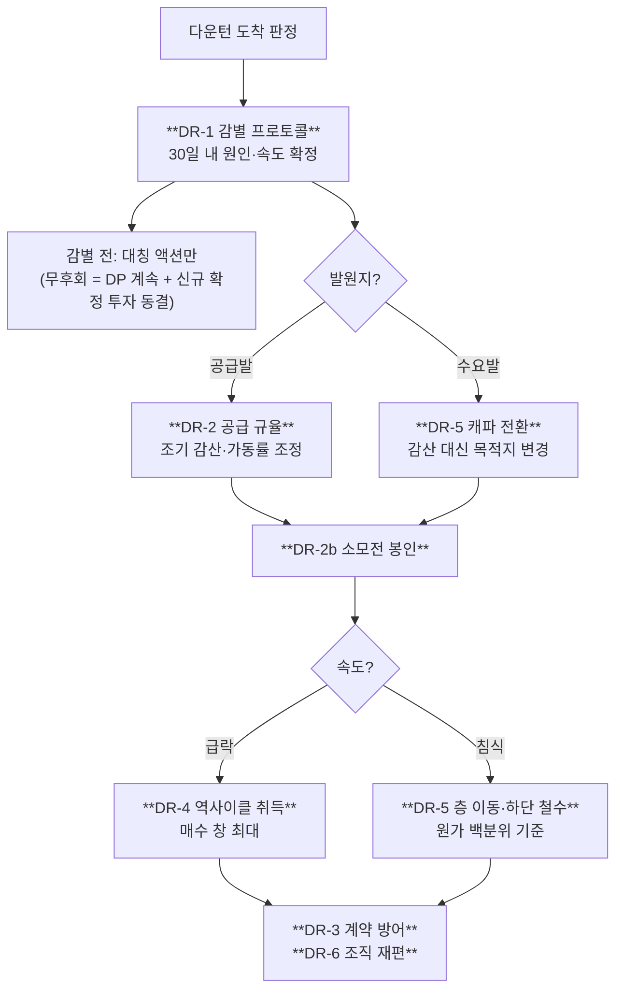

# 다운턴 대응 플레이북 DR-1 ~ DR-6

> **원인을 모르면 처방이 반대로 나간다.** 감산은 공급발에서는 직접 효과가 있고 수요발에서는 없다. 저가 매수는 급락형에서는 창이 열리고 침식형에서는 매물이 안 나온다. 이 페이지의 첫 항목이 감별인 이유다.

## 1. 플레이북의 구조

---

## 2. DR-1 — 감별 프로토콜 (Differential Diagnosis)

**다운턴 도착 판정 후 30일 내에 원인 축과 속도 축을 확정한다. 그 전까지는 대칭 액션만 집행한다.**

### 왜 이것이 1순위인가

[CMO 매트릭스 §4.3](../storyline/cmo-matrix.md)이 지목한 실수 패턴 중 하나가 **"원인을 하나로 단정하고 대응 몰아주기"**다. 조기 신호는 "원인 가설이 하나로 수렴 / EWI가 결과 변수에만 편중"이다. 가격과 재고만 보면 네 시나리오가 전부 같아 보인다.

### 프로토콜

| 단계 | 기간 | 내용 |
|---|---|---|
| **D+0** | — | 도착 판정 (EWI 복합 트리거) |
| **D+0~30** | 30일 | [DX-1~DX-8](differential-indicators.md) 전 패널 판독 → 원인·속도 확정. 이 기간 중 **비대칭 액션 금지** |
| **D+30** | — | 판정서 작성: 시나리오 배정 + 확신도 + 반증 조건 |
| **D+30~** | — | 해당 시나리오의 대응 분기 집행 |
| **재판정** | 분기 | 시나리오 전이 확인 ([전이 경로](scenario-matrix.md)) |

### 감별 전 허용되는 대칭 액션

원인과 무관하게 손해가 아닌 것들만:
- DP-2~DP-7 계속 집행
- 신규 **확정** 투자 동결 (옵션 단계는 유지)
- 재고 축적 중단
- 계약 갱신 협상 개시 (조건 확정은 판정 후)

### 판정서에 반드시 포함할 것

1. **배정 시나리오와 확신도**
2. **반증 조건** — 어떤 관측이 나오면 이 판정을 뒤집는가
3. **기각한 대안 가설과 그 이유**
4. **DT-D 배경 판정** — DT-D는 다른 시나리오와 배타적이지 않고 **밑에 깔린다**. 지배적 형태가 아니더라도 동시 진행 여부를 별도 판정한다

---

## 3. DR-2 — 공급 규율 (감산·가동률 조정)

**공급발(DT-C·DT-D)에서만 발동. 수요발에서는 무효.**

### 근거 — 같은 액션의 정반대 판정

| 다운턴 | 액션 | 맥락 | 판정 |
|---|---|---|---|
| 1차 (2007~09) | 무감산 버티기 | 6강 대칭 — 체력 열위 퇴출 가능 | **◎** 키몬다 누적손실 $30억·2009-01 파산, 퇴출 직후 현물가 급등 |
| 3차 (2022~23) | 무감산 선언(2022-10-27) → 재확인(2023-01-31) → **감산 공식화(2023-04-07)** | 3강 과점 — 퇴출 후보 없음 | **✕** 퇴출자 0·Q1 2023 영업이익 0.6조(-96%)·DS -4.58조 사상 최대 적자 끝에 자진 철회 |

출처: [samsung-downturn-actions-2007-2023-2026-08-07.md](../../sources/articles/samsung-downturn-actions-2007-2023-2026-08-07.md)

**교훈은 "감산하라"도 "하지 마라"도 아니다. "맥락을 판별하고, 판별했으면 6개월 늦지 마라"다.** 선언→재확인→번복의 6개월 동안 DS -4.58조가 누적됐다.

### 실행 규칙

| 항목 | 내용 |
|---|---|
| **발동 조건** | DR-1 판정에서 **공급발** 확정 + 재고일수 트리거 도달 |
| **집행 기한** | 트리거 도달 후 **30일 내** 집행 또는 명시적 기각 사유 기록 (D15·D16) |
| **수요발일 때** | 발동하지 않는다. 대신 [DR-5 캐파 전환](#6-dr-5--층-이동--캐파-전환--하단-철수) |
| **법무 선행** | [DRAM 반독점 소송](../concepts/dram-antitrust-litigation.md) 계류 중(2026-06-25 제소, 3사 공동 피고). 감산 발표 문구·타이밍·대외 커뮤니케이션 템플릿을 **평시에** 법무와 사전 합의. 사후 검토는 대응 속도를 죽인다 ([july-2026-market-update-2026-07-04.md](../../sources/articles/july-2026-market-update-2026-07-04.md)) |
| **NAND 우선** | 3차에서 NAND 감산이 가장 깊고 길게(50% 유지) 유지되어 재고·가격 정상화에 기여했다 — 다만 선회가 6개월 늦어 효과는 제한적이었다 |

### DR-2b — 소모전 봉인 (금지 옵션)

**무감산 버티기를 명시적으로 "금지 옵션"으로 분류한다.**

치킨게임 4대 전제가 CXMT 상대로는 전부 붕괴했다 ([DT-D §3](scenario-DT-D.md), [memory-cycle-storyline-r3-2026-08-12.md](../../sources/raw-notes/memory-cycle-storyline-r3-2026-08-12.md)):
① 손실 → 퇴출 (보조금이 흡수) ② 자본시장 접근 제약 (국가 자본) ③ 기술 격차 → 원가 격차 (보조금 상쇄) ④ 고객이 최저가 선택 (국산 선호 정책)

**퇴출 함수가 없는 상대에게 소모전은 자기 손실만 만든다.** 의사결정 문서에 이 판단을 명시해 재발 압력을 차단한다.

### 시나리오 가치

| DT-A | DT-B | DT-C | DT-D | DT-E |
|---|---|---|---|---|
| ✕ | △ | **◎ (1순위)** | △ | ✕ |

DT-B에서 △: 수요발이라 가격 회복 효과는 없으나, **가동률 미세 조정**이 재고 축적 방지에 유효.
DT-D에서 △: 감산해도 CXMT가 그 공백을 메운다 — 점유율만 잃는다.

---

## 4. DR-3 — 계약 방어

**파기·재협상 요구에 "가격 인하"가 아니라 "물량 이연·기간 연장"으로 응수한다.**

### 원칙

| 요구 | ✅ 응수 | ❌ 회피 |
|---|---|---|
| 물량 축소 | 기간 연장으로 총량 유지 | 총량 축소 |
| 가격 인하 | 물량 이연 + NTB 하한 유지 | 단가 인하 |
| 계약 파기 | 페널티 유예 ↔ 기간 연장 교환 | 무조건 파기 수용 |

**단가를 깎으면 회복기에도 그 단가에서 시작한다.** 물량 이연은 시간 문제이지만 가격 인하는 앵커 문제다.

### 구조적 한계

**커버리지는 다운턴이 시작된 뒤에는 새로 만들 수 없다.** 고객이 선급·다년 계약에 들어오는 것은 부족 국면에서만 일어난다. 따라서 DR-3은 신규 창출이 아니라 **기존 계약의 재구조화**가 전부다 → [DP-1](preparation.md)의 유효기간이 여기서 나온다.

### 시나리오 가치

| DT-A | DT-B | DT-C | DT-D | DT-E |
|---|---|---|---|---|
| ◎ | ◎ | ◎ | △ | ✕ |

DT-E에서 ✕: 제품이 진부화되면 계약 자체가 부담이 된다.

---

## 5. DR-4 — 역사이클 자산 취득

**대상은 캐파가 아니라 기술 자산·인재·IP.**

### 근거 — 두 번의 불발

| 시점 | 사건 | 결과 |
|---|---|---|
| 2008-09~10 | SanDisk 인수 시도($5.85B) → **자진 철회** | 매수 창은 열렸으나 불발. 가격 규율의 사내 선례로는 남음 |
| 2012 | 엘피다 입찰 **불참** | 마이크론이 인수해 모바일 DRAM 스케일 + 다사이트 중앙 운영 체계 확보 |

출처: [samsung-downturn-actions-2007-2023-2026-08-07.md](../../sources/articles/samsung-downturn-actions-2007-2023-2026-08-07.md)

**매수 창은 바닥의 짧은 구간에만 열리고, 그때 조직은 방어 모드다.** 그래서 트리거·프리미엄·PMI 각본이 **미리** 있어야 한다.

### 실행

- EV/EBITDA 트리거 사전 설정 + 프리미엄 예산 사전 적립 + PMI 각본 상비 (D9)
- 대상 우선순위: 신기술 IP > 팀·인재 > 고객 접점 > 캐파
- 오픈이노베이션 축과의 충돌 해소는 [「지금만 살 수 있는 것」](../../outputs/storyline/open-innovation-proposal.md) 참조 (가격 vs 기술 vs 자리)

### 시나리오 가치

| DT-A | DT-B | DT-C | DT-D | DT-E |
|---|---|---|---|---|
| **◎ (창 최대)** | △ | △ | ✕ | ◎ |

- DT-A: 급락 + 자금 경색이 동시에 오므로 매물이 가장 많이 나온다
- DT-C: 계약 바닥이 매물 출현을 억제
- DT-D: **매물이 나오지 않는다** — 아무도 죽지 않고 서서히 마른다
- DT-E: 신기술 IP·팀 매수 창

---

## 6. DR-5 — 층 이동 / 캐파 전환 / 하단 철수

세 개의 강도가 다른 액션을 하나의 축으로 묶는다.

| 강도 | 액션 | 발동 시나리오 |
|---|---|---|
| 1 | **층 이동** — 마진이 얇아진 제품군에서 위로 이동 | DT-B·DT-C |
| 2 | **캐파 전환** — 라인을 다른 제품으로 (DRAM↔CIS 공용률 80%, 캐파 -50%) | DT-A·DT-C·DT-D |
| 3 | **하단 철수** — 해당 제품군에서 나온다 | **DT-D만** |

### 수요발에서 감산의 대체재

DT-A에서 감산은 무효다. 그러나 stranded된 고부가 캐파를 그대로 두는 것도 손실이다. **전환이 감산의 대체재**가 된다 — 단 캐파 50% 손실을 동반하므로 공짜가 아니고, 리드타임 9~12개월이므로 [DP-6](preparation.md)의 평시 훈련 없이는 실행 불가다 ([fab-toolset-commonality-conversion-2026-08.md](../../sources/articles/fab-toolset-commonality-conversion-2026-08.md)).

### 하단 철수의 판단 기준 (DT-D 전용)

절대 손익이 아니라:
1. 해당 제품군의 **CXMT 포함 원가 곡선 백분위**
2. **3년 후 가격 앵커 전망** — 회복 여부가 아니라 앵커의 영구 이동 여부
3. 감가 완료 설비의 **수확 전략 종료 시점**

선택지: ① 고부가 이동 ② CIS·특수로 전환 ③ 감가 완료 설비 최소 원가 유지(수확) ④ 철수

### 시나리오 가치

| DT-A | DT-B | DT-C | DT-D | DT-E |
|---|---|---|---|---|
| ◎ (전환) | ◎ (층 이동) | ◎ (층 이동) | **◎ (1순위, 철수 포함)** | △ |

---

## 7. DR-6 — 조직 재편을 다운턴 안에서

**[DP-7 매뉴얼](preparation.md)을 발동한다. 회복 이후로 미루지 않는다.**

### 근거 — 대칭 실패

2009-01 재편(DS/DMC 통합·임원 연봉 -20%)은 **◎**였고, 2022~23 무대응은 **△**였다. 3차의 리더십 교체는 2024-05 사후에야 이뤄졌다.

**첫 분기 적자가 재편 명분을 만든다** — 명분이 있을 때 하지 않으면 다음 기회는 회복 이후이고, 그때는 명분이 없다.

### 시나리오별 발동 조건

| 시나리오 | 명분 | 발동 조건 |
|---|---|---|
| DT-A | 최대 (급락 + 적자) | 즉시 |
| DT-C | 큼 | 감산 결정과 **동시** 발동 |
| DT-D | 중간 (철수 결정 동반) | 하단 철수 결정 시 동반 |
| DT-B | **없음** (적자 미발생) | **손익 무관 발동 조건**으로만 가능 — DP-7 설계의 핵심 |
| DT-E | 다름 (경계 재획정) | 제품 정의 변화에 맞춘 조직 경계 재설정 |

### 감축 예외 (전 시나리오 공통)

별동대 · 컨트롤러/펌웨어/시스템 SW · 인증 진행 중 프로젝트 · 하이브리드 본딩 자체 IP 트랙

---

## 8. 종합 매트릭스 — 시나리오 × 대응

| 코드 | 대응 | DT-A 급제동 | DT-B 긴 하산 | DT-C 동시 방류 | DT-D 저가 잠식 | DT-E 판 갈이 |
|---|---|---|---|---|---|---|
| **DR-1** | 감별 프로토콜 | ◎ | ◎ | ◎ | ◎ | ◎ |
| **DR-2** | 공급 규율 (감산) | ✕ | △ | **◎ 1순위** | △ | ✕ |
| **DR-2b** | 소모전 봉인 | ◎ | ◎ | ◎ | **◎ 필수** | — |
| **DR-3** | 계약 방어 | ◎ | ◎ | ◎ | △ | ✕ |
| **DR-4** | 역사이클 자산 취득 | **◎ 창 최대** | △ | △ | ✕ | ◎ |
| **DR-5** | 층 이동·전환·철수 | ◎ 전환 | ◎ 층이동 | ◎ 층이동 | **◎ 1순위 철수** | △ |
| **DR-6** | 조직 재편 | ◎ | △ | ◎ | ◎ | ◎ |
| — | **1순위** | DR-3 → DR-5 → DR-4 | DR-5 → DR-1 재판정 | **DR-2** → DR-5 | **DR-5** → DR-2b | DP-5 계속 → DR-4 |

## 9. 금지 목록 (안티패턴)

[CMO 매트릭스 §4.3](../storyline/cmo-matrix.md)의 12개 실수 패턴 중 SP-2 대응 국면에 직결되는 것:

| 금지 | 조기 신호 | 차단 장치 |
|---|---|---|
| **무감산 소모전의 3번째 재사용** | 경쟁사 감산 후에도 가동률 유지 공언 / "점유율 사수" 프레임 | DR-2b 금지 옵션 분류 + 감산 규칙 EWI 사전 배선 |
| **감산 판단 6개월 지연** | 재고일수 상한 초과에도 "일시적" 해석 | 트리거 30일 내 집행 의무 |
| **원인 단정 후 몰빵** | 원인 가설이 하나로 수렴 / EWI가 결과 변수에만 편중 | DR-1 감별 프로토콜 + 반증 조건 명기 |
| **R&D "일시 조정"** | R&D 매출비 하락 / 선행 인력의 양산 전환 배치 | 2023 선례(적자에도 R&D 사상 최대)를 규범으로 |
| **별동대 재후순위화** | 별동대 예산이 분기 심사에서 주력으로 재배분 | 주력 배분 논리에서 면제(SD-1) + R&D 하한(D6) |
| **저가 매물 앞 관망** | 매물 검토가 "회복 후 재논의"로 반복 연기 | EV/EBITDA 트리거 + 프리미엄 사전 적립 + PMI 각본(D9) |
| **계약 커버리지를 호황 마진과 맞바꾸기** | 분기 ASP 극대화가 영업 KPI 지배 | 커버리지 비율 + **만기 집중도**를 KPI화 (DP-1) |
| **조직 재편을 회복 이후로** | 조직 논의가 "정상화 시점"으로 연기 | DP-7 매뉴얼 + 트리거 동시 발동 |
