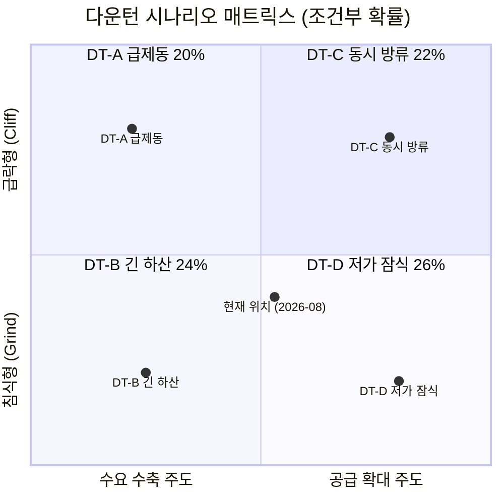
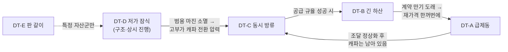

# 다운턴 시나리오 매트릭스 (SP-2)

축: **[DF-D1 발원지](key-drivers.md)** (수요발 ↔ 공급발) × **[DF-D2 전개 속도](key-drivers.md)** (급락형 ↔ 침식형)

## 1. 2×2 매트릭스

> **와일드카드 [DT-E 「판 갈이」](scenario-DT-E.md) (8%)**: 전환군(3D DRAM·4F² COP·zHBM·CXL) 발화. 수요·공급 어느 축에도 속하지 않는 **제품 정의의 변화**. 총시장은 성장하는데 삼성의 특정 자산군만 다운턴에 들어간다 → 2×2 평면 밖.

## 2. 시나리오 개요표

| 시나리오 | DF-D1 | DF-D2 | 1차 방아쇠 | 메커니즘 | 삼성에 대한 함의 |
|---|---|---|---|---|---|
| **DT-A 「급제동」** | 수요발 | 급락 | AI 인프라 **조달 경색** — FCF 마이너스 지속 → 채권·SPV 조달 악화 → 신규 발주 동결 | 2~3분기 내 주문 취소·계약 재협상 요구. 현물가 선행 붕괴 | 고부가 캐파 stranded. **대응할 시간이 없다** — 도착 전 배선이 결과의 전부 |
| **DT-B 「긴 하산」** | 수요발 | 침식 | **메모리 원단위 감소** — 추론 최적화·모델 경량화·CXL 풀링 | 폭락이 아니라 성장률이 0으로 수렴. 분기 -3~8%가 8~12분기 | 재고·적자 임계에 도달하지 않아 **위기감이 생기지 않는다**. 3차 대비기 실패 패턴의 재현 조건 |
| **DT-C 「동시 방류」** | 공급발 | 급락 | 2028~29 신규 캐파 동시 도래 + **3강 절제 붕괴** | 수요는 유지되는데 공급이 앞섬. 감가 정점으로 원가 하한이 낮아져 낙폭 여지 확대 | **감산·투자 규율이 직접 효과를 내는 유일한 시나리오.** 단 소모전 교범은 봉인(2023 실증·반독점 계류) |
| **DT-D 「저가 잠식」** | 공급발 | 침식 | 보조금 기반 CXMT·YMTC의 **점진 침투** (캐파 점유 11%→15%) | 급락 없이 범용 가격대 자체가 영구 하락. 레거시부터 위로 | **사이클이 아니라 구조 변화 — 회복이 없다.** 철수·전환 결정이 핵심 액션이 되는 유일한 시나리오 |
| **DT-E 「판 갈이」** | — | — | 3D DRAM·4F² COP·zHBM·CXL 채택 개시 | 비동기·부분적. 제품 정의가 바뀌어 기존 자산이 조기 소멸 | **다운턴 매뉴얼이 작동하지 않는다** — 감산도 계약도 무의미. 유일한 응수는 개발 선행 |

## 3. 확률 — 조건부임에 주의

> **⚠️ 확률의 성격**: 아래 확률은 **"2027~2030 사이 메모리 다운턴이 도착한다는 조건 하에서, 그 다운턴이 각 유형일 확률"**이다. SP-1의 무조건부 확률(A26·B39·C8·D21·E6)과 **직접 더하거나 비교할 수 없다**. 다운턴 자체의 도착 확률은 이 트랙의 전제([README §1.1](README.md))로 고정되어 있다.

| 시나리오 | 조건부 확률 | 근거 |
|---|---|---|
| **DT-D 저가 잠식** | **26%** | 최고 확률. 근거는 **확정성** — CXMT 캐파 점유 11%→15%(2028)는 진행 중이고, 보조금 기반이라 원가 논리로 되돌아가지 않는다. 애플의 CXMT 기술 검증 착수는 인증 장벽마저 열릴 수 있음을 시사 ([apple-cxmt-china-dram-2026-07-08.md](../../sources/articles/apple-cxmt-china-dram-2026-07-08.md)). 다른 넷과 달리 **방아쇠가 필요 없다 — 이미 진행 중이다** |
| **DT-B 긴 하산** | **24%** | take-or-pay·NTB 커버리지가 초기 낙차를 흡수하는 구조가 실재하므로, 수요 측이 발화해도 급락보다 침식으로 나타날 공산이 크다. 여기에 T4(원단위 감소)와 T10(에이전트 추론 폭증)이 상쇄하며 성장률만 깎는 경로가 겹친다 |
| **DT-C 동시 방류** | **22%** | 신규 캐파 도래는 확정 사실이나, **급락으로 전환되려면 절제 붕괴(Ec7)라는 추가 스위치가 필요**하다. 3강 과점에서 선제 증설 선언의 유인은 2007년보다 약하고, 반독점 소송 계류가 역설적으로 공격적 가격 행동을 억제할 수 있다. 그래서 DT-D보다 낮다 |
| **DT-A 급제동** | **20%** | CapEx-FCF 다이버전스가 **실측 등장**해 경로는 열려 있으나, 4사 CapEx 삭감 0건·GPU 임대가 firming으로 아직 발화 전이다 ([hyperscaler-q2-2026-actuals-gpu-rental-2026-08-11.md](../../sources/articles/hyperscaler-q2-2026-actuals-gpu-rental-2026-08-11.md)). 계약 락인이 초기 6~12개월을 흡수하므로 **순수 급락형이 되려면 만기 집중과 겹쳐야 한다** |
| **DT-E 판 갈이** | **8%** | 2027~2030 시계에서는 3D DRAM 상용화가 이르다(실질 위협 2030년대 중반). 단 zHBM·CXL의 **부분** 발화는 이 시계 안에서 가능하므로 0이 아니다 |
| 합계 | **100%** | |

### 3.1 확률 배분의 세 가지 논리

1. **확정 > 신호** — 진행 중인 사실(CXMT 침투·캐파 도래)이 아직 신호 단계인 것(FCF 경보)보다 무겁다. 그래서 공급발 합계(DT-C+DT-D = **48%**)가 수요발 합계(DT-A+DT-B = **44%**)보다 높다.
2. **계약이 속도를 눌러준다** — take-or-pay·NTB 구조가 살아 있는 동안은 침식형 쪽 확률이 높다. 그래서 침식형 합계(DT-B+DT-D = **50%**)가 급락형 합계(DT-A+DT-C = **42%**)보다 높다.
3. **단, 2번은 시점 조건부다** — 커버리지 만기가 2028~29에 몰려 있다면 그 시점에 침식형→급락형 재배분이 일어난다. 만기 구조 파악([DX-7](differential-indicators.md))이 확정되면 확률을 재산정한다.

### 3.2 축별 한계 확률

| | 급락형 | 침식형 | **행 합계** |
|---|---|---|---|
| **수요발** | DT-A 20% | DT-B 24% | **44%** |
| **공급발** | DT-C 22% | DT-D 26% | **48%** |
| **열 합계** | **42%** | **50%** | (와일드카드 DT-E 8% 별도) |

## 4. 시나리오 간 전이 — 다운턴은 한 상자에 머물지 않는다

이것이 SP-1 매트릭스와 다른 점이다. SP-1의 시나리오는 서로 배타적인 세계이지만, **다운턴은 한 유형으로 시작해 다른 유형으로 넘어간다.**

| 전이 경로 | 조건 | 실무 함의 |
|---|---|---|
| **DT-B → DT-A** | 계약 만기 집중 시점 도달 | **가장 위험한 경로.** 침식형이라 방심한 상태에서 급락형 낙차를 맞는다 → [DP-1 만기 사다리화](preparation.md)의 존재 이유 |
| **DT-D → DT-C** | 범용 마진 소멸로 3사가 고부가 캐파를 동시 증설 | 저가 잠식이 상위 제품군의 과잉을 유발 |
| **DT-A → DT-C** | 조달 정상화로 수요는 돌아오지만 캐파는 그대로 남음 | 수요발 다운턴의 **꼬리**가 공급발 다운턴이 된다 |
| **DT-C → DT-B** | 공급 규율이 성공해 급락은 멈췄으나 수요 성장률은 회복 안 됨 | "감산은 통했는데 좋아지지 않는다" 국면 |

> **DT-D는 다른 넷과 층위가 다르다.** 나머지 넷이 "사건"이라면 DT-D는 **상시 진행되는 배경**이다. 다른 시나리오와 배타적이지 않고 **밑에 깔린다** — 어떤 다운턴이 오든 그 밑에는 저가 잠식이 계속 진행되고 있다. 확률 26%는 "DT-D가 지배적 형태가 될 확률"로 읽어야 한다.

## 5. 분기점 모니터링 일정

| 분기 요인 | 결정 시점 | 모니터링 지표 | 판별 대상 |
|---|---|---|---|
| 하이퍼스케일러 FCF 부호·조달 스프레드 | 상시 (분기 실적) | [DX-1](differential-indicators.md) — FCF 마이너스 2분기 연속 + 회사채 스프레드 확대 | DT-A |
| 자사·업계 **계약 만기 집중도** | **2026 Q4까지 내부 확정 필요** | [DX-7](differential-indicators.md) — 분기별 만기 도래 금액 HHI | DT-B → DT-A 전이 |
| 경쟁사 증설 공시·웨이퍼 투입 갭 | 2027 ~ 2028 | [DX-4](differential-indicators.md) — 증설 공시 건수, 투입-출하 갭 | DT-C |
| 3강 절제 이탈 선언 | 상시 | 점유율 목표 공개 언급·가동률 유지 공언 | DT-C 급락 스위치 |
| CXMT 캐파 점유율 · 애플 인증 결과 | 2026 ~ 2028 | [DX-5](differential-indicators.md) — TrendForce 분기 점유율 15% 임계, 애플–CXMT 승인/차단 | DT-D |
| 메모리 원단위 (GPU 1장당 GB·토큰당 GB) | 상시 (반기) | [DX-8](differential-indicators.md) — 신규 가속기 세대별 메모리 탑재량 추세 | DT-B |
| 3D DRAM·zHBM 채택 개시 | 2027 ~ 2029 | 전력 50% 개선 입증·커스텀 칩 채택 공시 | DT-E |
| 감가 정점 통과 · 원가 곡선 위치 | 2028 ~ 2029 | 감가 완료 설비 비중, 3사+CXMT 대비 원가 백분위 | 전 시나리오 (배경) |

## 6. SP-1과의 대조표

| | SP-1 | SP-2 |
|---|---|---|
| 최고 확률 | B AI 르네상스 39% | DT-D 저가 잠식 26% |
| Main Bet | B (AI 지속 + 공존) | **없음** — 다운턴은 베팅 대상이 아니라 대비 대상. 대신 [무후회 대비 DP-1~7](preparation.md) |
| 와일드카드 | E 패러다임 전환 6% | DT-E 판 갈이 8% (같은 뿌리, 다른 시계) |
| 시나리오 간 관계 | 배타적 세계 | **전이 가능** — 한 유형에서 다른 유형으로 넘어감 |

> SP-2에 Main Bet이 없는 것은 의도적이다. 다운턴 시나리오에 베팅한다는 것은 특정 하강 형태가 오기를 바라고 자원을 몰아넣는다는 뜻인데, 그것은 **원인 단정 후 몰빵**([CMO 매트릭스 §4.3의 실수 패턴](../storyline/cmo-matrix.md))과 같다. SP-2의 전략 구조는 **무후회 대비 + 감별 후 분기 대응**이다.
