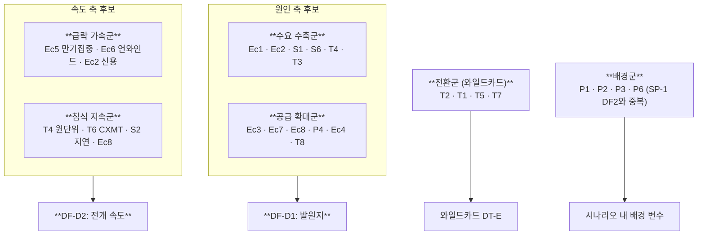

# 다운턴 STEEP 요인 + Impact × Uncertainty (SP-2)

> [SP-1의 STEEP](../steep/technology.md)이 "메모리 산업의 미래를 무엇이 움직이는가"를 묻는다면, 이 페이지는 **"무엇이 다운턴을 만들거나 다운턴의 형태를 바꾸는가"**만 묻는다. 같은 요인이라도 채점 기준이 다르다.

## 1. 채점 기준 (SP-1과의 차이)

| 축 | SP-1 정의 | **SP-2 정의 (이 페이지)** |
|---|---|---|
| **Impact (1~5)** | 메모리사업부 전략에 미치는 영향의 크기 | **다운턴의 심도·형태를 바꾸는 힘** — 이 요인이 움직이면 다운턴의 모양이 달라지는가 |
| **Uncertainty (1~5)** | 2026~2035 시계의 방향 불확실성 | **2027~2030 시계**의 방향 불확실성 (창이 짧아 확정 사실이 더 많다 → 평균 U가 낮음) |

**시계 단축의 효과**: 2028~29 신규 캐파 도래처럼 이미 착공·발주가 끝난 사실은 SP-1에서는 불확실했으나 SP-2 시계에서는 **거의 확정**이다(U=3). 반대로 계약 만기 집중처럼 SP-1이 다루지 않던 요인이 여기서는 최상위로 올라온다.

---

## 2. STEEP 요인 40개

카테고리 코드는 이 트랙 내부 네임스페이스다(SP-1의 S1·T1과 별개).

### S — 사회 (6개)

| ID | 요인 | I | U | I×U | 다운턴과의 연결 |
|---|---|---|---|---|---|
| S1 | AI 유용성에 대한 신뢰 반전 — ROI 회의론의 임계 확산 | 5 | 4 | **20** | 수요발의 사회적 방아쇠. MIT 95% 미실현·NBER 90% 미체감 계열 논거가 투자자 언어로 번역되는 순간 |
| S2 | AI DC 전력 민원·인허가 지연 | 3 | 4 | 12 | 수요를 **없애지 않고 뒤로 민다** → 침식형 쪽으로 형태를 끈다 |
| S3 | 소비자 IT(스마트폰·PC) 교체 수요 침체 지속 | 3 | 2 | 6 | 범용 수요의 만성 하방. 급락 요인은 아님 |
| S4 | 다운턴기 핵심인재 유출 (성과급 역진) | 4 | 3 | 12 | 다운턴의 원인이 아니라 **다운턴 비용의 증폭기**. 2026 성과급 급등의 반작용 |
| S5 | 중국 내수 국산 반도체 선호 고착 | 4 | 2 | 8 | DT-D 저가 잠식의 사회적 기반 |
| S6 | "AI 거품" 담론의 자기실현 — 투자심리 전염 | 4 | 4 | 16 | 담론이 조달 조건을 바꾸면 실물이 된다. S1의 금융 전달 경로 |

### T — 기술 (10개)

| ID | 요인 | I | U | I×U | 다운턴과의 연결 |
|---|---|---|---|---|---|
| T1 | HBM 세대 전환(HBM4E·HBM5) 타이밍의 앞당김/지연 | 5 | 4 | **20** | 전환 지연 = 기존 세대 캐파 과잉. 전환 가속 = 미준비 캐파 진부화 |
| T2 | 3D DRAM·4F² COP 상용화 시점 | 5 | 5 | **25** | 유일한 I=5·U=5. 도착이 빠르면 기존 자산군이 조기 소멸 → DT-E |
| T3 | CXL 메모리 풀링 확산 — 워크로드당 DRAM 소요 감소 | 4 | 4 | 16 | 수요를 **구조적으로** 깎는다. 침식형 수요발의 메커니즘 |
| T4 | 추론 최적화·모델 경량화에 의한 **메모리 원단위 감소** | 5 | 4 | **20** | AI가 성장해도 메모리 수요 증가율이 꺾이는 경로. DT-B의 엔진 |
| T5 | 커스텀 ASIC·zHBM 전환에 의한 표준 HBM 수요 이동 | 4 | 4 | 16 | 총수요는 유지되나 **삼성의 특정 제품**만 다운턴 |
| T6 | CXMT/YMTC 선단 도달 속도 (EUV 우회·하이브리드 본딩) | 5 | 4 | **20** | DT-D의 속도를 결정. 허페이 본디드 DRAM 파일럿이 리트머스 |
| T7 | NAND 하이브리드 본딩 아키텍처 전환 | 4 | 3 | 12 | 자체 IP 미보유 시 다음 세대 원가 열위 → 침식 심화 |
| T8 | 공정 전환 주기 연장 — 감가 완료 설비의 유효 수명 | 4 | 3 | 12 | 원가 곡선 하단을 만든다. 침식형의 방어 수단이자 공급 과잉의 연료 |
| T9 | AI SSD·FDP 표준 선점 여부 | 3 | 4 | 12 | 다운턴 중 고부가 믹스 방어선의 존재 여부 |
| T10 | 에이전트·추론 폭증에 의한 메모리 원단위 **반등** (T4의 역방향) | 4 | 4 | 16 | T4를 상쇄하는 힘. 두 힘의 순차가 DT-B 발화 여부를 가른다 |

### E — 환경 (6개)

| ID | 요인 | I | U | I×U | 다운턴과의 연결 |
|---|---|---|---|---|---|
| E1 | 전력 게이트키퍼 — 그리드 대기열이 DC 가동을 지연 | 4 | 3 | 12 | 수요의 **지연**은 공급 과잉과 동일한 효과를 낸다 |
| E2 | 변압기·가스터빈 리드타임(최대 5년) | 3 | 3 | 9 | E1의 하위 병목 |
| E3 | 자연재해·팹 사고 — 단일 거점 집중 | 4 | 2 | 8 | 다운턴을 **끝내는** 방향의 충격(공급 감소). 역방향 와일드카드 |
| E4 | 용수·탄소 규제에 의한 가동 제약 | 2 | 2 | 4 | 원가 압박 요인, 사이클 무관 |
| E5 | 희토류·소재 수출통제 | 3 | 4 | 12 | 공급 측 충격이나 다운턴 완화 방향 |
| E6 | 탄소국경세(CBAM)·F-gas 규제 확대 | 2 | 3 | 6 | 장기 원가 구조 |

### Ec — 경제 (11개) — 가장 두꺼운 층

다운턴은 본질적으로 경제 현상이므로 이 카테고리에 최상위 요인이 집중된다.

| ID | 요인 | I | U | I×U | 다운턴과의 연결 |
|---|---|---|---|---|---|
| Ec1 | 하이퍼스케일러 **CapEx-FCF 다이버전스** → 조달 경색 | 5 | 4 | **20** | Meta FCF -91%·Amazon TTM FCF 마이너스가 **이미 실측**. "꼭짓점은 CapEx가 아니라 FCF" |
| Ec2 | AI 인프라 부채·SPV·네오클라우드 신용 이벤트 | 5 | 4 | **20** | DT-A의 직접 방아쇠. 실물 수요보다 **자금**이 먼저 끊긴다 |
| Ec3 | 2028~29 신규 캐파 동시 도래 (Micron Idaho·SK 용인·한국 팹) | 5 | 3 | 15 | **거의 확정 사실** — U가 낮은 것이 오히려 위험. 확정된 미래는 헤지되지 않는다 |
| Ec4 | 감가상각 정점 통과(2028~29) → 원가 하한 하락 | 4 | 2 | 8 | 가격이 더 깊이 내려갈 **여지**를 만든다. 삼성 기계장치 내용연수 5년·상각률 77.1% |
| Ec5 | take-or-pay·NTB 커버리지의 **만기 집중** (계약 절벽) | 5 | 4 | **20** | 이 트랙의 신규 발견. 계약은 급락을 막는 게 아니라 **미룬다** |
| Ec6 | 더블오더링 언와인드 — 부족 정점 → 재고 급반전 | 5 | 4 | **20** | 급락형의 고전적 증폭기. 핸드투마우스 상태에서 반전 시 낙차 최대 |
| Ec7 | 3강 절제 균형의 지속 여부 — 치킨게임 재발 | 5 | 4 | **20** | 공급발 다운턴을 **급락형으로 전환시키는 스위치** |
| Ec8 | CXMT 캐파 점유 11%→15%(2028) — 범용 가격 앵커 하락 | 4 | 3 | 12 | DT-D의 정량 축 |
| Ec9 | 금리·유동성 — CapEx 조달 비용 | 3 | 3 | 9 | Ec1·Ec2의 배경 조건 |
| Ec10 | 중국 내수 침체·비동조화 | 3 | 3 | 9 | 미주 수요와 중국 수요가 따로 움직임 → 부분 다운턴 가능성 |
| Ec11 | 원-달러 환율 변동성 | 2 | 3 | 6 | 손익 진폭 요인, 사이클 원인 아님 |

### P — 정치 (7개)

| ID | 요인 | I | U | I×U | 다운턴과의 연결 |
|---|---|---|---|---|---|
| P1 | 대중 수출통제 확대/완화 (MATCH 법안) | 4 | 5 | **20** | 다운턴의 원인이자 형태 변경자. 통제 강화는 CXMT 침식을 늦추고 시안 리스크를 키운다 |
| P2 | 한국산 반도체 관세 (25% 시나리오) | 4 | 4 | 16 | 원가 구조를 직접 타격 — 다운턴 중이면 손실 가속 |
| P3 | 시안 팹 라이선스 갱신 | 4 | 4 | 16 | NAND 캐파 40%+의 단일 거점 리스크 |
| P4 | 중국 보조금에 의한 CXMT 가격 하한 붕괴 (원가 이하 판매) | 5 | 3 | 15 | **체력 우위가 작동하지 않는다** — 소모전 교범을 무효화하는 요인 |
| P5 | DRAM 반독점 소송 계류 — 공급 규율의 법적 자유도 제약 | 4 | 3 | 12 | 2026-06-25 제소(3사 공동 피고). **감산·가격 규율이 담합으로 해석될 리스크** |
| P6 | 미중 정상 외교·대만 해협 | 4 | 4 | 16 | 배경 조건. SP-1 DF2와 중복되므로 SP-2에서는 축이 아닌 변수 |
| P7 | 한국 정부 지원·전력 인프라 정책 | 3 | 3 | 9 | 국가계획 800조의 공급 씨앗 성격 |

**요인 총계**: S 6 + T 10 + E 6 + Ec 11 + P 7 = **40개**

---

## 3. Impact × Uncertainty 매트릭스

### 3.1 분포 요약

| 구간 | 정의 | 요인 수 |
|---|---|---|
| **핵심 불확실성** (I≥4 · U≥4) | Driving Force 후보 | **17** |
| 확정 리스크 (I≥4 · U≤3) | 헤지 대상이지 시나리오 축이 아님 | 8 |
| 감시 대상 (I≤3 · U≥4) | 임계 넘으면 승격 | 5 |
| 배경 (그 외) | | 10 |

> **확정 리스크가 8개라는 점이 SP-1과 가장 다른 특징이다.** Ec3(신규 캐파 도래)·Ec4(감가 정점)·P4(보조금 가격)·T8(설비 수명)은 **이미 결정된 미래**다. 시나리오 축은 될 수 없지만, 다섯 시나리오 **전부의 배경에 깔린 공통 조건**으로 작동한다 — 즉 어떤 다운턴이 오든 이 넷은 함께 온다.

### 3.2 Top 12 핵심 불확실성

I×U 동점(20점)이 9개로 몰려 있어, 동점 내 순위는 **"이 요인이 다운턴의 형태를 직접 가르는가(직접성)"**로 배열했다.

| 순위 | ID | 요인 | I×U | 형태 결정력 |
|---|---|---|---|---|
| 1 | **T2** | 3D DRAM·4F² 상용화 시점 | **25** | 유일한 25점. 단 2027~30 시계에서는 확률이 낮아 와일드카드로 배치 |
| 2 | **Ec1** | 하이퍼스케일러 CapEx-FCF 다이버전스 | 20 | **수요발 판별의 최선행 지표** — 이미 실측 등장 |
| 3 | **Ec5** | 계약 커버리지 만기 집중 | 20 | **속도 축을 직접 결정** — 만기 전엔 침식, 만기 시엔 급락 |
| 4 | **Ec7** | 3강 절제 균형 붕괴 (치킨게임 재발) | 20 | **공급발을 급락형으로 전환시키는 스위치** |
| 5 | **Ec6** | 더블오더링 언와인드 | 20 | 급락형의 증폭기 |
| 6 | **Ec2** | AI 인프라 신용 이벤트 | 20 | DT-A의 방아쇠 |
| 7 | **T4** | 메모리 원단위 감소 | 20 | **침식형 수요발의 유일한 엔진** |
| 8 | **T6** | CXMT/YMTC 선단 도달 속도 | 20 | DT-D의 속도 |
| 9 | **S1** | AI 유용성 신뢰 반전 | 20 | 수요발의 사회적 방아쇠 |
| 10 | **T1** | HBM 세대 전환 타이밍 | 20 | 제품 축 분화 결정 |
| 11 | **P1** | MATCH 법안 | 20 | 배경 조건 (SP-1 DF2와 중복) |
| 12 | **S6** | AI 거품 담론의 자기실현 | 16 | S1의 금융 전달 경로 |

### 3.3 클러스터링 — 축으로 묶기

Top 12와 인접 요인을 인과 방향으로 묶으면 네 덩어리가 나온다.

- **원인 축**과 **속도 축**은 각각 독립적인 요인군을 갖는다 → 2×2의 전제인 독립성을 만족할 가능성이 높다. 정식 검증은 [key-drivers.md](key-drivers.md)에서 수행한다.
- **전환군**은 방향이 아니라 **판 자체를 바꾸므로** 2×2에 넣을 수 없다 → 와일드카드.
- **배경군**은 SP-1의 DF2와 중복되므로 SP-2에서 축으로 재사용하면 두 트랙이 같은 그림이 된다 → 각 시나리오의 배경 변수로 강등.

---

## 4. 갱신 규칙

- 새 소스가 특정 요인의 방향을 **실현된 사실**로 확정하면 U를 낮추고, 확정 리스크군으로 이동시킨다(예: 계약 만기 구조가 공시되면 Ec5의 U 4→2).
- I×U 상위 12위 안에서 순위 변동이 발생하면 [key-drivers.md](key-drivers.md)의 축 선정 근거를 재검토한다.
- 이 페이지가 바뀌면 `dashboard/src/data/downturnPlanning.js`의 `DT_STEEP_DATA`를 동반 갱신한다 (CLAUDE.md §6).
