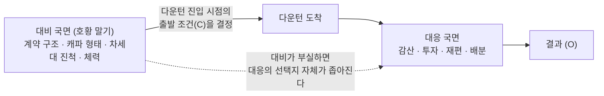

# CMO 통합 매트릭스 — 네 번의 다운턴 (대비 · 대응 · 추천 · 실수)

> **이 페이지의 역할**: [CMO 렌즈 스토리라인](storyline-cmo.md)이 다운턴별로 나눠 서술한 M×C→O 분석을, **하나의 필터 가능한 데이터셋**으로 통합한 것이다. 대시보드 **CMO Matrix 탭**의 단일 소스이며, 렌즈 페이지가 "서사"라면 이 페이지는 "데이터"다.

## 1. 이 매트릭스의 다섯 축

| 축 | 값 | 정의 |
|---|---|---|
| **다운턴** | 1차(2007~09) · 2차(2010~13) · 3차(2022~23) · **4차(2028~29 예측)** | 사건 창. 1~3차는 관측, 4차는 예측 |
| **국면** | **대비** · **대응** / (4차) **추천** · **실수** | **대비 = 다운턴이 오기 전(호황 말기)에 한 것**, **대응 = 다운턴 기간 중에 한 것**. 4차는 권고 액션과 반복될 오류 패턴 |
| **제품 (M 분류)** | DRAM · NAND · SSD·UFS · 공통 | 액션이 걸린 제품 라인. 전 제품 공통이거나 특정 제품에 귀속되지 않으면 "공통" |
| **관점 (C 분류)** | 제조 · 투자 · 개발 · 제품 · 운영 | 다운턴마다 달랐던 개별 맥락 대신, **모든 다운턴에 공통으로 적용되는 5관점**으로 통일해 비교 가능성을 확보 |
| **판정 (O)** | ◎ 효과 분명 · △ 조건부·부분 · ✕ 역효과·불발 | 4차는 단일 판정 대신 **원인 3종별 판정**으로 분기 |

### 관점(C) 5분류의 정의

| 관점 | 포함 범위 |
|---|---|
| **제조** | 팹·라인·공정 전환·캐파 가동률·감산 |
| **투자** | CapEx 규모·신규 팹 결정·M&A·지분투자 |
| **개발** | R&D 지출·차세대 기술·신공정 개발·표준화 참여 |
| **제품** | 제품 믹스·신제품 출시·포트폴리오 구성·고부가 전환 |
| **운영** | 조직·인력·재고·계약/영업 구조·가격 정책·고객 관계 |

> **왜 C를 통일했나**: [렌즈 페이지](storyline-cmo.md)의 개별 매트릭스는 다운턴마다 C 열을 새로 정의해(6강 대칭 / PC→모바일 전환 / 3강 과점 …) 그 다운턴의 고유 발화 조건을 정밀하게 짚는다. 그 방식은 한 다운턴을 깊게 보는 데는 최적이지만 **표를 가로질러 비교할 수 없다**. 이 페이지는 반대로, 5관점을 고정해 "같은 관점에서 네 번의 다운턴에 무엇을 했고 무엇이 통했나"를 세로로 읽게 한다. 두 표는 경쟁하지 않고 보완한다.

## 2. 대비 vs 대응 — 왜 나누는가

과거 분석은 전부 **대응**(다운턴 기간 중 액션)만 다뤘다. 그러나 CMO 관점에서 다운턴의 결과를 가장 크게 좌우하는 것은 다운턴이 시작될 때 이미 정해져 있는 것들 — 계약 커버리지, 캐파의 확정/옵션 비율, 차세대 기술의 진척도, 재무 체력 — 이고, 그것들은 전부 **대비 국면의 산물**이다.

**한 다운턴의 M이 다음 다운턴의 C가 된다** — 이 순환이 대비/대응 구분의 핵심이다. 2019년 HBM팀 축소(그 시점의 대비 국면 M)는 2022~23 다운턴에서는 바꿀 수 없는 출발 위치(C)였다. 지금 2026년의 액션이 2028~29 다운턴의 C가 된다.

## 3. 통합 매트릭스 — 1~3차 (관측)

> 아래는 위키의 전체 목록이다. **필터·검색·상세는 대시보드 CMO Matrix 탭**에서 제품·관점·국면·판정 조건을 조합해 볼 수 있다.

### 3.1 대응 (다운턴 기간 중)

| 다운턴 | 제품 | 관점 | 액션 (M) · 메커니즘 | 결과 (O) | 판정 |
|---|---|---|---|---|---|
| 1차 | 공통 | 제조 | 무감산 버티기 — *소모전(체력 열위 퇴출)* | 6강 대칭 구조였으므로 완전 발화 → 키몬다 누적손실 $30억·2009-01 파산, 퇴출 직후 현물가 급등. 버티기 비용도 즉시 노출 — 2008 Q4 반도체 -0.56조(OPM -14%, 경쟁사 -40% 이하 대비 우위) | **◎** |
| 1차 | DRAM | 개발 | 40nm급 공정 선행 (2009-02 최초 검증 → 2009-07 세계 최초 40nm급 DDR3 양산) — *원가 격차 확대* | 원가=점유율 맥락에서 발화 → 50nm급 대비 생산성 +60%·전력 -30%, 경쟁사 퇴출 압력 가속 | **◎** |
| 1차 | 공통 | 운영 | 조직 통합 (2009-01 DS/DMC 2부문·임원 연봉 -20%) — *위기를 재편의 창으로* | 첫 분기 적자가 재편 명분을 만들어 발화 → 이듬해 2009 연결 매출 136.3조·영업이익 10.9조 | **◎** |
| 1차 | NAND | 투자 | SanDisk 인수 시도 → 철회 ($5.85B 제안 2008-09 → 2008-10-22 철회) — *다운턴 저가 매수 + 가격 규율* | 매수 창은 열렸으나 SanDisk Q3 -$250M·손실 확대 전망을 사유로 자진 철회 → 인수 불발, 가격 규율의 사내 선례 | △ |
| 1차 | DRAM | 투자 | 퇴출 확인 직후 역사이클 증설 (2010 메모리 5.5조→9조, 반도체 12.7조·전사 21.6조) — *회복기 점유율 흡수* | 캐파=점유율 맥락 + 키몬다 퇴출 확인이 타이밍 트리거 → 회복기 점유율 흡수. 경쟁사는 투자 삭감으로 캐파 부재 | **◎** |
| 2차 | DRAM | 투자 | Line-16 착공·가동 (2010-05 → 2011-09, 12조·세계 최대 메모리 팹) — *역사이클 캐파 선점* | 가동과 동시에 20nm급 DDR3 양산. 같은 국면에서 엘피다는 투자 여력 없이 부채 4,480억 엔 파산 | **◎** |
| 2차 | DRAM | 개발 | 공정 세대 선행 (30nm급 2010-07 → 20nm급 2011-09 세계 최초) — *기술 전환 심판대 선점* | "전환 성패 = 퇴출 순서" 맥락에서 발화 → 세계 최초 연속(생산성 2배 이상)으로 심판대 통과 | **◎** |
| 2차 | DRAM | 제품 | 모바일 DRAM 전환 (2011 LPDDR2 → 2012-08 세계 최초 2GB LPDDR3) — *수요 구조 전환 추종* | 같은 심판대에서 엘피다는 "PC→모바일 전환 대응 실패"가 파산 요인에 명시되며 탈락 — 전환 성패의 양방향 실증 | **◎** |
| 2차 | NAND | 제조 | Austin 팹 메모리→로직 전환 (2010-06 $3.6B → 2012-08 플래시 종료 + $4B) — *수요 전환 추종 재배분* | 당시 텍사스 사상 최대 외국인 투자 규모의 로직 전환(Apple向 AP 연계). 단 NAND 캐파의 이탈이기도 하며 정량 효과는 미확인 | △ |
| 2차 | NAND | 투자 | 시안 NAND 팹 다운턴 착공 (2012-09 → 2014-05 양산) — *리드타임 소화* | 다운턴에 건설 기간을 소화해 2014년 수요 확대기에 양산 진입. 동서 균형 공급(MB-2)의 토대 | **◎** |
| 2차 | SSD·UFS | 제품 | HDD 사업 매각 (2011-04 Seagate $1.375B) — *비핵심 경량화·NAND 집중* | 모바일 전환으로 HDD가 사양화되는 맥락에서 발화 → $1.375B 회수 + Seagate 지분·NAND 공급 파트너십. 메모리 점유율 효과는 간접 | △ |
| 2차 | DRAM | 투자 | **[무행동]** 엘피다 입찰 불참 (2012) — *다운턴 저가 매수 불행사* | 매수 창이 열렸으나 불발 → 마이크론이 인수해 모바일 DRAM 스케일 + 다사이트 중앙 운영 체계 확보. (+) 3강 압축 유산은 공유 / (−) 경쟁자 스케일 점프 허용 | △ |
| 3차 | 공통 | 제조 | "인위적 감산 없다"(2022-10-27) → 재확인(2023-01-31) → **감산 공식화(2023-04-07)** → 연말 연장 — *소모전의 3강 맥락 재사용* | 퇴출 후보가 없는 3강 과점이었으므로 불발 → 퇴출자 0, Q1 2023 영업이익 0.6조(-96%)·DS -4.58조 사상 최대 적자 끝에 자진 철회. (+) 범용 점유 방어 / (−) 메커니즘 불발 | **✕** |
| 3차 | 공통 | 투자 | 감산과 분리한 CapEx 역사이클 (2023 전사 53.1조·DS 48.4조 사상 최대) — *재무 요새 기반 역사이클* | 현금 요새 맥락에서 발화 → 사상 최대 적자 연도에 CapEx 사상 최대 동시 집행. SK는 적자 -7.7조에 CapEx ~10조로 절감 — 분리 집행은 3강 중 삼성 단독 | **◎** |
| 3차 | 공통 | 개발 | R&D 역사이클 증액 (2022 24.92조 → 2023 28.34조 사상 최대, 매출비 10.9%) — *R&D 하한 사수* | 적자에도 삭감이 아니라 증액 → 엘피다형 "다운턴 R&D 삭감 → 다음 세대 탈락" 경로 회피. 단 배분 방향은 별도 문제 | **◎** |
| 3차 | 공통 | 투자 | Taylor 팹 다운사이클 착공 (2021-11 $17B 발표 → 2022 H1 착공) — *리드타임 소화* | 착공은 성사됐으나 4nm→2nm 상향·수율·고객 확보로 가동이 2026~27로 순연, 투자 $17B→$37~44B 확대 → 배당 미실현 | △ |
| 3차 | DRAM | 제품 | **[무행동]** HBM 니치 후순위 (2019 팀 축소의 연장) — *주력 논리에 의한 니치 배제* | 인증이 배분을 결정하는 게임으로 이동 중이었으므로 역효과 → HBM 40%→17%·33년 만의 DRAM 역전. 수습은 전부 다운턴 종료 후. SK는 같은 맥락에서 방향 유지 → HBM 57%·OP 47.2조 | **✕** |
| 3차 | NAND | 제조 | NAND 감산 연장·확대 (2023-07 연장 → 2024-02 감산률 50% 유지) — *뒤늦은 감산의 심화* | 선회 후 NAND에서 가장 깊고 길게 유지 → 재고·가격 정상화에 기여했으나, 선회 자체가 6개월 지연된 뒤라 적자 축소 효과는 제한적 | △ |
| 3차 | 공통 | 운영 | **[무행동]** 조직 구조 대응 부재 (리더십 교체는 2024-05 사후) — *1차전형 재편 불행사* | 사상 최대 적자 국면인데 2009년형 재편이 불발 → 조직 배선 전환이 2024-05까지 지연. 2009년(◎)과의 대칭 실패 | △ |

### 3.2 대비 (다운턴이 오기 전)

> 대비기 정의: 1차 **2005~2007 H1** · 2차 **2009 H2~2010** · 3차 **2020~2022 H1**. 근거는 전용 리서치 노트 ([samsung-pre-downturn-preparation-2005-2022-2026-08-08.md](../../sources/articles/samsung-pre-downturn-preparation-2005-2022-2026-08-08.md)).

| 다운턴 | 제품 | 관점 | 액션 (M) · 메커니즘 | 결과 (O) | 판정 |
|---|---|---|---|---|---|
| 1차 | 공통 | 투자 | **CapEx 선제 삭감 계획** (2007-01 — 반도체 5.44조 -18%·메모리 4.82조 -17%) — *호황 말기 투자 절제* | 세 대비기 중 **유일하게 호황 말기에 브레이크를 밟은 사례** — "삼성은 항상 역사이클로 늘린다"는 통설의 반례. 다만 직전까지 오스틴 Fab2·화성 증설이 진행돼 캐파 커밋은 이미 확대된 뒤였고 2007 Q1 반도체 영업이익은 이미 5,400억으로 반토막 — 브레이크가 늦었다 | △ |
| 1차 | NAND | 투자 | 오스틴 Fab2 신설 ($3.5B, 2006-04 착공 → 2007-06 준공) — *호황기 캐파 선제 확보* | 가격 붕괴가 시작되는 2007년 중반에 신규 캐파 도래 — 리드타임상 불가피했으나 진입 시점 고정비 증가. NAND 장기 성장의 토대라는 상방과 정점 준공이라는 하방 공존 | △ |
| 1차 | DRAM | 개발 | **공정 선행 + 양산 이연** (80nm 2006-08 → 60nm 2007-03 세계 최초 / 50nm은 개발 완료·양산은 2008로 이연) — *원가 우위 축적 + 전환 타이밍 절제* | 60nm 전환으로 생산성 +40%를 쥔 채 진입 → 2008 Q4 반도체 OPM -14%로 경쟁사(-40% 이하) 대비 손실률 우위. **개발은 선행하되 양산 투입은 늦춘 배합**이 대비기 절제의 실질 형태 | **◎** |
| 1차 | NAND | 개발 | 40nm 32Gb + CTF 세계 최초 (2006-09/10) — *차세대 아키텍처 선행* | 다운턴 진입 전 NAND 원가·밀도 리더십 확보 → 붕괴 국면에서 버틸 원가 여력의 토대 | **◎** |
| 1차 | SSD·UFS | 제품 | 세계 최초 32GB SSD 탑재 PC (2006-05-24) · 1.8" 64GB SSD 양산 (2007-06) — *신규 제품 축 개설* | 스토리지 완제품 축을 다운턴 전에 개설. 단 시장 규모가 미미해 1차 손익 기여는 없음. **UFS는 규격 자체가 2011년 제정 — 이 시기 해당 없음(제품 부재)** | △ |
| 1차 | NAND | 운영 | **Apple NAND 장기공급계약 참여** (2005-11-21, 5개사 대상 Apple 선급 총 $1.25B — 삼성 배분액 미확인) — *계약적 매출 바닥* | **삼성이 2005년에 이미 선급 LTA의 공급자 당사자였다는 사내 최초 선례** — "계약 바닥은 2026년의 신규 메커니즘"이라는 정리를 부분 교정한다. 단 당시는 고객 주도 개별 계약이었고 전사 커버리지 정책으로 제도화되지 않았다 | **◎** |
| 2차 | DRAM | 투자 | 화성 Line-16 착공 (2010-05, 총 12조 — 세계 최대 메모리 팹) — *역사이클 캐파 선점* | 2차 다운턴 직전 착공 → 붕괴 국면에 가동 도래, 20nm급 DDR3 동시 양산. 같은 국면에서 엘피다는 투자 여력 없이 파산 — 12조 투입 자체가 소모전 압박으로도 작동 | **◎** |
| 2차 | NAND | 제조 | 오스틴 메모리→로직 전환 착수 ($3.6B, 2010-06) — *수요 전환 추종 재배분* | PC→모바일 전환기에 맞춰 메모리 캐파 일부를 로직(AP)으로 선제 재배분 → 2012-08 플래시 종료·$4B 추가로 연결. 메모리 관점에선 NAND 캐파 이탈이며 정량 효과 미확인 | △ |
| 2차 | DRAM | 개발 | 공정 세대 선행 (40nm 2009-07 → 30nm 2010-07 세계 최초) — *심판대 사전 통과* | 2차 다운턴의 심판대(전환 성패 = 퇴출 순서)를 대비기에 미리 통과 → 다운턴 중 20nm급 선행으로 연결 | **◎** |
| 2차 | NAND | 개발 | NAND 미세화 선행 (20nm급 32Gb 2010-04 → 64Gb 3bit 2010-10) — *원가·밀도 리더십* | 진입 전 세대 우위 확보 → 하락기 원가 여력 유지. **대비기 개발 선행이 DRAM·NAND 양쪽에서 동시에 이뤄진 유일한 기간** | **◎** |
| 2차 | 공통 | 투자 | 2011년 투자계획 증액 (총 47.8조 +12%·반도체 15조·채용 2.6만) — *호황 지속 전제의 확대* | 붕괴 직전 해 증액 편성 → 다운턴에 신규 캐파·고정비 도래. 다만 그 캐파가 체력 열위 경기자 퇴출을 앞당긴 압박으로도 작동해 상·하방 공존 | △ |
| 2차 | 공통 | 투자 | 5대 신수종사업 (23.3조/10년, 2010-05-11) — *사이클 외부 다각화* | 메모리 사이클과 상관이 낮은 축으로 변동성 분산 시도. 다운턴 손익을 상쇄할 규모로 성장한 축은 이 시기 기준 확인되지 않음 | △ |
| 2차 | SSD·UFS | 제품 | 첫 브랜드 소비자 SSD 470 출시 (2010-08) — *채널·제품 축 확장* | B2B를 넘어 브랜드 완제품 채널을 다운턴 전에 개설. 규모상 2차 손익 기여는 미확인 | △ |
| 3차 | 공통 | 투자 | **반도체 CapEx 3년 연속 증액** (32.9조 → 43.6조 → 47.9조) — *호황 지속 전제의 무절제 확대* | 수요 절벽 직전까지 브레이크 없이 증액 → 진입 시점 고정비·감가상각 최대. **1차 대비기(-18% 삭감)와 정반대의 선택**이며 2023년 DS -4.58조의 구조적 배경 | **✕** |
| 3차 | 공통 | 투자 | 그룹 투자계획 2연발 (240조/3년 2021-08 → **450조/5년·8만 명 2022-05-24**) — *정점 확신의 대외 공표* | 수요 절벽 약 6개월 전에 사상 최대 5년 계획을 공표 → 대외 공약이 이후 감산·투자 조정의 자유도를 좁혔다. 정점 낙관 편향이 조직 밖으로 고정된 형태 | **✕** |
| 3차 | DRAM | 제조 | 평택 P2·P3·P4 연속 건설 (P2 2020-05 착공 10조 → P3 2022-07 양산 → P4 2022-09 기초공사) — *리드타임 소화 + 캐파 선제* | 리드타임 관점에선 정석이나 **확정형 일괄 집행이라 되돌릴 여지가 없었다** — Fab Shell 선행·장비 단계 반입의 부재. 회복기 공급 기반(상방)과 다운턴 고정비(하방) 공존 | △ |
| 3차 | NAND | 제조 | 시안 2공장 완공 (총 $15B, 2단계 2022-03 완료, 月 13만 장 = 전체 NAND 40%+) — *단일 거점 집중 확대* | 진입 직전 NAND 캐파의 40%+가 단일 해외 거점으로 집중 완료 → 이후 NAND 감산(50% 유지)의 부담이 이 거점에 집중. 동서 균형의 자산이자 지정학 집중점 | △ |
| 3차 | 공통 | 투자 | Taylor 팹 $17B 결정·발표 (2021-11-23) — *정점 확정 커밋* | 호황 정점에 확정한 투자가 다운턴 기간 고정 지출로 이어졌고, 가동은 2026~27로 순연·총투자 $37~44B로 확대 — **확정 커밋의 되돌릴 수 없음이 그대로 비용** | △ |
| 3차 | DRAM | 개발 | 선단 공정·DDR5 선행 (EUV DRAM 2020-03 → 512GB DDR5 HKMG 세계 최초 2021-03 → 14nm 1a EUV DDR5 양산 2021-10) — *차세대 표준 선행* | 다운턴 전에 DDR5·EUV 전환을 끝내둔 것이 2025~26 회복기 범용 마진 우위의 토대. **대비기 개발 축은 세 다운턴 중 가장 강했다 — 문제는 같은 시기 HBM 축이 정반대였다는 점** | **◎** |
| 3차 | NAND | 개발 | V-NAND 세대 전환 (V7 176단 2021-04 → V8 236단 2022-11) — *적층 세대 선행* | 세대 전환을 이어가 원가 경쟁력 유지. 단 같은 시기 Kioxia는 CBA(hybrid bonding)로 아키텍처 자체를 먼저 바꿨고, **삼성의 hybrid bonding 자체 IP 트랙은 이 대비기에 확보되지 않았다** | **◎** |
| 3차 | SSD·UFS | 제품 | PM9A3 DC SSD 양산 (2021-03) · **UFS 4.0 세계 최초 개발** (2022-05) — *고부가 스토리지 축 선행* | 1~3차를 통틀어 SSD·UFS 축에서 가장 두터운 대비 — DC·모바일 양쪽 세대 선행. 이 축의 대비가 2025~26 enterprise SSD 1위(38.2%)로 이어졌다 | **◎** |
| 3차 | DRAM | 운영 | **[무행동] HBM 전담조직 복원 부재** (2019 해체 → 대비기 전 구간 부재 → 2024-04 재구성) — *니치 배제의 지속* | **대비기 전 구간의 조직 부재가 3차 다운턴의 출발 위치(C)를 만들었다.** 다운턴 중 HBM 후순위는 단발 판단이 아니라 이 무행동의 연장이었고, 결과는 HBM 40%→17%·33년 만의 DRAM 역전 — 한 시기의 무행동이 다음 시기의 소여가 되는 순환의 가장 선명한 사례 | **✕** |
| 3차 | 공통 | 운영 | **[무행동] 재고 급증에 대한 조치 부재** (전사 41.4조 → 52.2조, **DS 16.5조 → 29.1조 +76.6%**) — *조기경보 신호의 미행동* | 진입 6~12개월 전 재고가 정량 경보를 보냈으나 감산·생산 조정으로 연결되지 않았다 → 2022-10 무감산 선언, 2023-04 뒤늦은 선회로 이어짐. **재고일수를 EWI 트리거로 사전 배선해야 하는 이유의 직접 근거** | **✕** |
| 3차 | DRAM | 운영 | 판매 측 절제 — 2022 Q2 "disciplined sales strategy" (서버 집중·ASP 유지) — *가격 규율* | 대비기 말의 유일한 절제 신호이나 판매 축에 국한 — **캐파는 늘리고 판매만 조인 비대칭**. 생산 측 절제가 동반되지 않아 재고 축적을 막지 못했다 | △ |
| 3차 | 공통 | 운영 | 조직 개편 (2021-12-07 DS부문장 선임 + CE·IM → DX 통합) — *리더십·조직 재편* | 대비기 말 개편은 있었으나 다운턴 대비 목적의 재편은 아니었고, 이후 다운턴 기간에는 조직 대응이 부재 — 대응 성격의 교체는 2024-05에야 이뤄진다 | △ |

#### 대비기의 절제 여부 — 세 기간의 대조

| 대비기 | 캐파·투자 | 개발 | 판매·운영 | 종합 |
|---|---|---|---|---|
| **1차 (2005~07)** | **삭감** (2007-01 반도체 -18%) — 단 2006년까지는 확대 | 선행하되 양산 이연(50nm→2008) | Apple 선급 LTA 참여 | **유일하게 절제** — 늦었지만 브레이크를 밟음 |
| **2차 (2009~10)** | **확대** (Line-16 12조·2011 계획 +12%) | DRAM·NAND 동시 선행 | — | **확대 — 단 결과적으로 경쟁사 퇴출을 앞당김** |
| **3차 (2020~22)** | **확대** (CapEx 3년 연속 증액·450조 계획) | DRAM·NAND·SSD 선행(HBM 제외) | 판매만 절제, 재고 방치, HBM 조직 부재 | **캐파는 늘리고 니치와 판매를 조인 비대칭** |

### 3.3 다운턴 대비 전략만 추리기 — 25건 중 7건

§3.2의 대비 25건은 성격이 섞여 있다. **호황 수요에 대응한 성장 액션이 대비기에 실행된 것**과 **다운턴 자체를 겨냥한 포지셔닝**은 다른 문제다. 후자만 추리면 삼성이 실제로 보유한 **다운턴 대비 레퍼토리**가 드러난다.

**분류 기준 (3종)**

| 성격 | 정의 | 건수 |
|---|---|---|
| **다운턴 대비** | 의도 자체가 다가올 하강 국면에 대한 포지셔닝 — 절제·바닥·버퍼·규율 | **7** |
| **결과적 대비** | 의도는 경쟁력·수요 추종이었으나 다운턴에서 생존 메커니즘으로 발화 | 7 |
| **호황 성장** | 다운턴 대비가 아님 — 호황 수요 대응·사업 확장이 대비기에 실행됐을 뿐 | 11 |

#### 다운턴 대비 전략 7건 (의도적)

| # | 다운턴 | 제품 | 관점 | 대비 전략 | 메커니즘 | 결과 | 판정 |
|---|---|---|---|---|---|---|---|
| 1 | 1차 | 공통 | 투자 | **CapEx 선제 삭감** (2007-01 반도체 -18%·메모리 -17%) | 투자 절제 — 고정비 커밋 축소 | 세 대비기 중 유일한 호황 말기 브레이크. 단 직전까지 확대가 이어져 늦었다 | △ |
| 2 | 1차 | DRAM | 개발 | **양산 투입 이연** (50nm 개발 완료·양산은 2008로) | 전환 타이밍 절제 — 개발은 선행, 투입은 지연 | 60nm 우위를 쥔 채 진입 → 2008 Q4 OPM -14%(경쟁사 -40% 이하) | **◎** |
| 3 | 1차 | NAND | 운영 | **Apple 선급 장기공급계약 참여** (2005-11, Apple 선급 총 $1.25B/5개사) | 계약적 매출 바닥 | 삼성이 이미 선급 LTA 공급자였던 사내 최초 선례 — 단 개별 계약, 전사 정책 아님 | **◎** |
| 4 | 2차 | 공통 | 투자 | **사이클 외부 다각화** (5대 신수종 23.3조/10년, 2010-05) | 변동성 분산 | 사이클 상관이 낮은 축 개설 시도 — 다운턴 손익을 상쇄할 규모의 축은 미확인 | △ |
| 5 | 3차 | DRAM | 운영 | **판매 측 규율** (2022 Q2 "disciplined sales" — 서버 집중·ASP 유지) | 가격 규율 | 대비기 말 유일한 절제 신호이나 판매 축에 국한 — **캐파는 늘리고 판매만 조인 비대칭** | △ |
| 6 | 3차 | DRAM | 운영 | **[미실행] HBM 니치 조직 유지** (2019 해체 후 대비기 전 구간 부재) | 니치 역량 보존 | 마땅히 했어야 할 대비의 부재가 3차 다운턴의 출발 위치(C)를 만듦 → HBM 40%→17% | **✕** |
| 7 | 3차 | 공통 | 운영 | **[미실행] 재고 조정** (DS 16.5조 → 29.1조 +76.6% 방치) | 재고 버퍼 관리 | 진입 6~12개월 전 정량 경보가 감산으로 연결되지 않음 → 2022-10 무감산·2023-04 뒤늦은 선회 | **✕** |

#### 이 7건이 말하는 것

1. **레퍼토리가 얇다** — 세 번의 대비기, 20년에 걸쳐 다운턴을 겨냥한 의도적 대비는 7건뿐이고, 그중 **2건은 미실행(✕), 3건은 부분(△)**이다. 명확히 성공한 대비는 **양산 이연**과 **선급 계약** 둘뿐이다.
2. **성공한 2건은 둘 다 "속도를 늦추거나 바닥을 까는" 형태였다** — 무엇을 더 한 것이 아니라, 투입을 늦추고(2번) 매출 하한을 계약으로 깐 것(3번)이다. 반면 실패한 2건은 **하지 않은 것**(니치 조직·재고 조정)이다.
3. **대비의 무게중심이 운영 축에 있다** — 7건 중 4건이 운영(계약·재고·판매·조직)이다. 반면 실제 자원은 대비기 내내 투자 축(캐파)으로 쏠렸다. **돈이 간 곳과 대비가 필요했던 곳이 어긋나 있었다.**
4. **1차 → 3차로 갈수록 대비가 약해졌다** — 1차 대비기에는 삭감·이연·계약이라는 세 가지 의도적 대비가 있었지만, 3차 대비기의 의도적 대비는 판매 규율 하나(△)뿐이고 나머지 둘은 미실행이었다.

#### 역사에 아예 없는 대비 수단 — 4차에서 처음 시도해야 하는 것

과거 세 대비기를 통틀어 **한 번도 시도되지 않은** 대비 수단이 있다. 4차 추천 전략(§4.2)의 대비 항목이 대부분 여기에 해당하며, 그래서 그것들은 "과거를 반복하는 일"이 아니라 **레퍼토리를 처음 늘리는 일**이다.

| 대비 수단 | 과거 시도 | 4차 추천 | 왜 지금인가 |
|---|---|---|---|
| **옵션형 캐파** (Fab Shell 선행 + 장비 단계 반입) | **없음** — 세 대비기 모두 확정형 일괄 집행 | RS-1·RS-5 | 확정 커밋의 되돌릴 수 없음이 3차에서 비용으로 실증(평택·Taylor) |
| **계약 커버리지 정책화** (take-or-pay·NTB 전사 표준) | 개별 계약 1건(2005 Apple)뿐 — 정책은 없음 | RS-8·RS-4·D12 | 고객이 먼저 선급·다년 계약에 들어오는 창은 부족 국면에만 열림 |
| **EWI 트리거 사전 배선** (재고일수·FCF 반전 → 30일 내 집행) | **없음** — 3차의 재고 +76.6%가 행동으로 연결 안 됨 | RS-9·D15·D16 | 대비 실패 2건이 모두 "신호는 있었으나 배선이 없었음" |
| **다운턴 조직 대응 매뉴얼** (사전 정의된 재편안) | **없음** — 재편은 항상 다운턴 도착 후(2009) 또는 미실행(2022~23) | D16 | 2009년 재편(◎)의 성공을 사후 대응이 아니라 사전 설계로 |
| **M&A 트리거·프리미엄 사전 적립** | **없음** — 2008 SanDisk는 즉흥 시도·철회, 2012 엘피다는 불참 | D9 | 매수 창은 바닥의 짧은 구간에만 열리고 그때는 조직이 방어 모드 |
| **니치 조직 보존 규칙** (주력 배분 논리에서 면제) | **없음** — 2019 HBM팀 해체가 정반대 사례 | D13·SD-1·D6 | 대비 실패 중 가장 비쌌던 항목(40%→17%) |

> **요약** — 다운턴 대비라는 문제를 풀 때 참고할 사내 선례는 **양산 이연(2007)**과 **선급 계약(2005)** 둘뿐이고, 나머지는 대부분 하지 않았던 일의 목록이다. 따라서 4차 대비 설계는 "과거 성공 공식의 재현"이 아니라 **없던 수단을 처음 갖추는 일**로 접근해야 한다.

## 4. 4차 다운사이클 (2028~29 예측)

> **[2026-08-15] 후속 트랙**: 아래 §4.1의 "원인 3종"은 이후 정식 시나리오 플래닝 트랙 **[SP-2](../downturn/README.md)**로 전개됐다. 원인 축(수요발↔공급발)에 **속도 축**(급락형↔침식형)을 직교시켜 2×2 + 와일드카드로 재구성하고([SP-2 key-drivers](../downturn/key-drivers.md)), 시나리오별 [대비 DP-1~7](../downturn/preparation.md)·[대응 DR-1~6](../downturn/response-playbook.md)·[감별 지표 DX-1~8](../downturn/differential-indicators.md)로 분화했다. §4.2의 cause-robust 3종은 SP-2의 무후회 대비 3종(DP-2·DP-4·DP-5)과 정확히 일치한다.

### 4.1 다운사이클 원인 3종 — O가 갈리는 분기점

| 원인 | 경로 | 확인 트리거 | 시나리오 |
|---|---|---|---|
| **① 수요발** | AI 투자수익률(CAPEX/ROI) 재평가 — 병목 모델 하방 민감도 최대(-31.5%), "꼭짓점은 FCF" ([deep-research-2030-bottleneck-quant-model-2026-06.md](../../sources/papers/deep-research-2030-bottleneck-quant-model-2026-06.md)) | 빅테크 FCF 반전 · CapEx 25%+ 삭감 · GPU 임대가 6개월 -35% | C·D (~29%) |
| **② 공급발** | 2028~29 신규 캐파 동시 도래(마이크론 Idaho·SK 용인·한국 팹 2+2) + CXMT 캐파 15% 접근 — 수요가 유지돼도 과잉 ([semiconductor-cycle.md](../concepts/semiconductor-cycle.md)) | 경쟁사 증설 공시 · 재고일수 · 계약가 감속 지속 | A·B 내 조정 |
| **③ 전환발** | 3D DRAM·CXL·zHBM 채택 개시로 HBM 스택 수요 이동 — 부분적·비동기 다운턴 ([key-drivers.md](../driving-forces/key-drivers.md) DF3) | 3D DRAM 전력 50% 개선 입증 · 커스텀 칩 CXL/3D 채택 | E (5~10%) |

### 4.2 추천 전략

| 국면 | 제품 | 관점 | 액션 (M) | ① 수요발 | ② 공급발 | ③ 전환발 |
|---|---|---|---|---|---|---|
| 대비 | 공통 | 운영 | 계약 바닥 선점 — take-or-pay·NTB·Participating Forward 커버리지 표준화 (RS-8·RS-4·D12) | **◎** 커버리지만큼 매출 바닥 유지 | **◎** 과잉은 비계약 물량에만 노출 | △ 갱신 시점 **커버리지 공동화** |
| 대비 | 공통 | 투자 | 옵션형 캐파 강제 — Fab Shell 선행 + 장비 단계 반입 (RS-1·RS-5) | **◎** 동결로 손실 최소 | **◎** 중단 옵션 = 절제 신호 | **◎** Shell 신기술 전용 |
| 대비 | 공통 | 운영 | 맥락 EWI + 다운턴 조직 대응 매뉴얼 사전 정의 (RS-9·D15·D16) | **◎** FCF·CapEx·임대가로 식별 | **◎** 증설 공시·재고로 식별 | **◎** 전력 개선·CXL 채택으로 식별 |
| 대비 | DRAM | 개발 | 차세대 별동대 + R&D 하한 — HBM4E·zHBM·3D DRAM 선행 (D13·D6·SD-1) | **◎** 회복기 배분 결정 | **◎** 인증·커스텀 층만 방어 | **◎** 유일한 응수 |
| 대비 | NAND | 개발 | hybrid bonding 자체 IP + 공정 전환 주기 연장 R&D (RS-6·RS-7·D10) | △ capex 회수 압박에 삭감 위험 | **◎** 원가·밀도 우위가 방어선 | **◎** IP 보유자가 다음 세대의 갑 |
| 대비 | SSD·UFS | 제품 | AI SSD 니치 조기 진입 — SCADA 대응 + FDP 소프트웨어 층 (MB-4·RS-3) | △ 채택 지연으로 배당 지연 | **◎** 고부가 믹스 방어선 | **◎** 선점자가 표준을 쥔다 |
| 대응 | 공통 | 투자 | 다운사이클 M&A + PMI 각본 (D9 — 대상은 캐파가 아니라 기술 자산·인재) | **◎** 매수 창 최대 | △ 계약 바닥이 매물 억제 | **◎** 신기술 IP·팀 매수 창 |
| 대응 | DRAM | 제조 | 게임 분리 — 소모전 불행사 + 로엔드 원가 방어 + 고부가 이동 (RS-6·RS-2·MB-4) | △ CXMT 상대 체력 우위 | **◎** 소모전 대신 층 이동만 작동 | △ 고부가 층 정의 재이동 |
| 대응 | 공통 | 운영 | 조직 재편을 다운턴 안에서 실행 (2009년형, D16 매뉴얼 발동) | **◎** 재편 명분 최대 | △ 이익 유지 시 동력 부족 | **◎** 조직 경계 재획정 필수 |

**cause-robust** — 세 원인 모두에서 ◎인 것은 **옵션형 캐파 · 맥락 EWI · 차세대 별동대** 셋뿐이다. 이는 [다섯 렌즈 교차 검증](storyline.md)의 프레임워크 불변 전략과 정확히 겹친다. 나머지는 원인 판별(EWI)에 행사를 위임한다.

### 4.3 예상되는 흔한 실수 — 반복될 오류 패턴

> 실수 항목은 "하지 말 것"의 목록이 아니라 **재발 압력이 실재하는 경로**의 목록이다. 각 항목은 과거 관측에 근거하며, 조기 신호와 차단 장치를 함께 정의한다.

| 제품 | 관점 | 실수 패턴 | 근거 (과거 관측) | 조기 신호 | 차단 장치 |
|---|---|---|---|---|---|
| 공통 | 제조 | **무감산 소모전의 3번째 재사용** — 1차전 교범을 CXMT에 적용 | 2023-04 자진 철회로 3강 맥락 불발이 이미 실증 | 경쟁사 감산 후에도 가동률 유지 공언 / "점유율 사수" 프레임 확산 | 감산 결정 규칙을 EWI 트리거에 사전 배선(D16) |
| 공통 | 제조 | **감산 판단 6개월 지연** — 선언·재확인·번복 궤적 반복 | 2022-10 선언 → 2023-04 철회까지 DS -4.58조 누적 | 재고일수 상한 초과에도 "일시적" 해석 | 트리거에 30일 내 집행 의무 부착(D15·D16) |
| DRAM | 제품 | **차세대 니치 재후순위화** — 이번 대상은 zHBM·커스텀 HBM·3D DRAM | HBM 40%→17%를 만든 바로 그 배분 논리 | 별동대 예산이 분기 심사에서 주력으로 재배분 | 별동대를 주력 배분 논리에서 면제(SD-1) + R&D 하한(D6) |
| 공통 | 개발 | **다운턴 R&D "일시 조정"** — 회복하면 되돌린다는 전제 | 엘피다 사망 요인. NAND 기준 양산 6개월 지연 = 이익 2/3 소실 | R&D 매출비 하락 / 선행 인력의 양산 전환 배치 | 2023년 선례(적자에도 R&D 사상 최대)를 규범으로 제도화 |
| 공통 | 투자 | **저가 매물 앞 관망** — "지금은 현금을 지킬 때" | 2012 엘피다를 마이크론이 가져가 스케일 점프 | 매물 검토가 "회복 후 재논의"로 반복 연기 | EV/EBITDA 5배 트리거 + 프리미엄 사전 적립 + PMI 각본 상비(D9) |
| 공통 | 투자 | **호황 정점 확정형 대규모 증설** — 옵션형을 "느리다"고 우회 | σ 60~120% 산업에서 확정 투자는 가장 비싼 선택 | 경쟁사 증설에 "맞불" 검토 / Shell 단계화 생략 일괄 발주 | 신규 캐파는 Shell+단계 반입 기본형 강제, 예외는 인증 확보분만 |
| 공통 | 운영 | **계약 커버리지를 호황 마진과 맞바꾸기** | 커버리지는 다운턴 시작 후엔 새로 못 만든다 | 분기 ASP 극대화가 영업 KPI 지배 / 장기계약 협상 연기 | 커버리지 비율을 EWI 맥락 지표로 감시 + 목표 하한 KPI화 |
| 공통 | 운영 | **조직 재편을 회복 이후로** | 2009 재편(◎) vs 2022~23 무대응(△)의 대칭 실패 | 조직 논의가 "정상화 시점"으로 반복 연기 | 다운턴 조직 대응 매뉴얼 사전 정의 + 트리거 동시 발동(D16) |
| NAND | 개발 | **hybrid bonding 자체 IP 후순위** — "라이선스로 충분" | YMTC가 핵심 특허 다수 보유, V10 이후 의존 고착 | 자체 특허 출원 정체 / 로드맵에서 IP 목표 비율 소멸 | 자체 IP 비율을 로드맵 KPI로, 다운턴에도 이 트랙만은 유지 |
| SSD·UFS | 제품 | **AI SSD·FDP 투자를 "NAND 회복 후"로** | SCADA 레퍼런스 고착 후 진입 비용은 몇 배 — HBM이 증명 | 마일스톤 이월 / 컨트롤러·펌웨어 인력이 절감 대상에 | SCADA 대응을 기한 있는 결정으로, SW 층 인력은 감축 예외 |
| DRAM | 제조 | **인증 없는 캐파로 점유율 방어** — "캐파=점유율" 낡은 등식 | 2022~23에 실증 — 범용은 이겼고 HBM은 전환 실패 | HBM 증설이 인증·물량 확약보다 선행 | 고부가 캐파는 인증·계약 확약 선행(마이크론 역순 이식) |
| 공통 | 개발 | **원인을 하나로 단정하고 대응 몰아주기** | 수요발·공급발·전환발은 처방이 다르다 | 원인 가설이 하나로 수렴 / EWI가 결과 변수에만 편중 | EWI에 맥락 지표를 함께 올려 원인 판별(D15) |

## 5. 이 매트릭스에서 읽히는 것

0. **대비기 절제는 1차에서만 있었다** — 2007-01 CapEx -18% 삭감은 "삼성 = 항상 역사이클 확대"라는 통설의 반례이며, 2·3차 대비기에는 붕괴 직전까지 증액했다. 특히 3차는 수요 절벽 6개월 전에 450조 5년 계획을 공표해 이후 조정의 자유도를 스스로 좁혔다. **절제의 형태도 다르다** — 1차는 "개발은 선행하되 양산 투입은 이연"이라는 배합이었고, 3차는 "캐파는 늘리고 판매만 조이는" 비대칭이었다.
1. **효과가 분명했던 액션의 관점 편중** — ◎ 판정은 **개발·투자**에 몰려 있고(공정 세대 선행, 역사이클 증설, R&D 하한), **제조(감산·가동률)** 축에서는 1차의 무감산만 ◎이며 3차에서는 같은 액션이 ✕가 됐다. 제조 축의 교범은 맥락 의존성이 가장 크다.
2. **무행동이 만든 손실이 행동의 실패보다 크다** — ✕·△ 중 상당수가 무행동이다(HBM 후순위, 엘피다 불참, 조직 무대응). 다운턴 전략의 실패는 대개 "잘못한 것"이 아니라 "안 한 것"에서 온다.
3. **SSD·UFS 축의 얇음이 곧 다음 리스크** — 1~3차를 통틀어 SSD·UFS 항목은 HDD 매각 한 건뿐이다. 스토리지가 AI 인프라의 전선이 된 지금, 이 축의 대비 공백이 4차에서 가장 큰 미검증 영역이다.
4. **대비 국면이 대응의 선택지를 결정한다** — 2019년 HBM팀 축소가 2022~23의 출발 위치가 됐듯, 지금(2026~27)의 계약 커버리지·옵션 캐파 비율·별동대 진척이 2028~29의 C가 된다. 4차 추천 전략에서 **대비 항목이 대응 항목보다 많은 이유**다.
5. **계약 바닥은 삼성에게 완전히 새로운 메커니즘이 아니다** — 2005-11 Apple NAND 장기공급계약(선급 총 $1.25B, 5개사)에서 삼성은 이미 선급 LTA의 공급자 당사자였다 ([samsung-pre-downturn-preparation-2005-2022-2026-08-08.md](../../sources/articles/samsung-pre-downturn-preparation-2005-2022-2026-08-08.md)). 다르게 말하면 4차 추천 1순위(계약 바닥)는 없던 능력을 새로 만드는 일이 아니라, **20년 전 개별 계약으로 했던 것을 전사 커버리지 정책으로 제도화하는 일**이다 — 실행 난이도의 성격이 달라진다.
7. **대비기 액션의 72%는 다운턴 대비가 아니었다** — 25건 중 다운턴을 겨냥한 의도적 대비는 7건(28%)뿐이고, 11건은 호황 성장, 7건은 결과적 대비였다(§3.3). 다운턴 대비를 문제로 삼는다면 참고할 사내 선례의 모수 자체가 작다는 것이 출발점이다.
6. **무행동은 대비 국면에서 더 치명적이다** — 대응 국면의 ✕는 2건(무감산·HBM 후순위)이지만, 3차 대비 국면에서만 ✕가 4건(CapEx 무절제·450조 공표·HBM 조직 부재·재고 방치)이다. 그리고 그중 둘(HBM 조직 부재·재고 방치)은 **무행동**이다 — 다운턴이 오기 전의 무행동이 다운턴 중의 선택지를 지운다.

---

## 갱신 규칙

- 새 소스로 과거 액션의 사실·수치가 교정되면 이 페이지와 `dashboard/src/data/cmoMatrix.js`를 동반 갱신한다 (CLAUDE.md §6).
- 4차 다운턴이 실제로 도착하면 §4를 관측으로 대체하고, 그 시점의 대비 국면(2026~27) 액션을 §3.2에 4차 대비 행으로 추가한다.
- [CMO 렌즈 스토리라인](storyline-cmo.md)의 다운턴별 매트릭스와 판정이 어긋나면 **두 페이지 중 더 최근 근거를 가진 쪽으로 통일**하고 양쪽을 함께 고친다.
