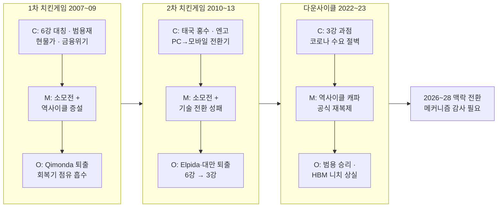
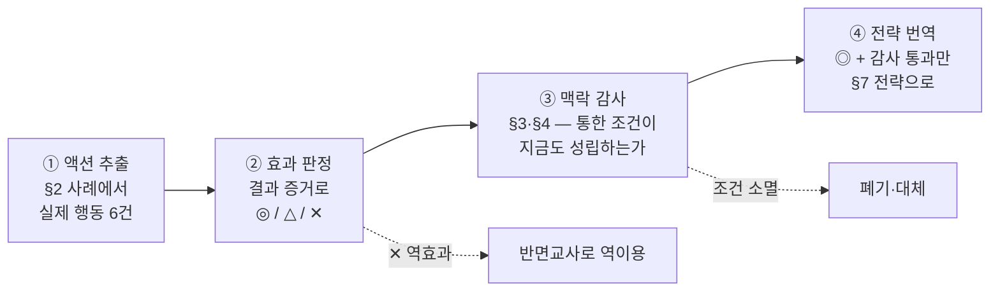
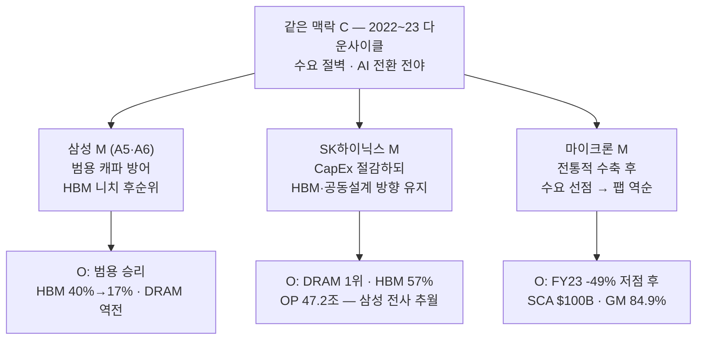

# 스토리라인 (CMO 렌즈) — 같은 전략은 같은 결과를 재생하지 않는다

> **한 문장 논지**: 리얼리스트 평가(Pawson & Tilley)의 Context-Mechanism-Outcome 방법론으로 삼성 메모리의 과거 다운턴을 분해하면, 승리의 원인은 "전략 목록"이 아니라 **"특정 맥락(C)이 특정 메커니즘(M)을 발화시켜 만든 결과(O)의 구성"**이었음이 드러난다. 2026년의 맥락은 과거 다운턴들과 여섯 지점에서 구조적으로 다르므로, 다음 다운턴 전략은 과거 성공 공식의 복제가 아니라 **맥락 감사(context audit)를 통과한 메커니즘만으로 재조립**해야 한다.

이 페이지는 [시나리오 플래닝 스토리라인](storyline.md)과 같은 위키 지식을 리얼리스트 평가(realist evaluation)의 CMO 프레임워크라는 다른 렌즈로 다시 서사화한 것이다. 시간축(미래 분기) 대신 **인과축(과거 다운턴의 발화 조건 → 현재 맥락에서의 이전 가능성)**으로 이야기를 푼다. 다섯 렌즈 중 유일하게 시간을 거꾸로 본다.

## CMO 구성 한눈에

## 1. 방법론 — 왜 Context-Mechanism-Outcome인가

사이클 산업의 전략 논의는 대개 "무엇이 통했나"의 목록으로 귀결된다 — 역사이클 투자, 재무 요새, 불황기 M&A 같은 [7대 패턴](../benchmark/cyclical-strategy-benchmark.md)이 그것이다. CMO 방법론은 여기에 한 단계를 더 요구한다: **결과(Outcome)는 전략이 만드는 것이 아니라, 특정 맥락(Context)에서만 발화(fire)하는 메커니즘(Mechanism)이 만든다.** 같은 전략이라도 맥락이 바뀌면 메커니즘이 발화하지 않고, 발화하지 않는 메커니즘은 결과를 재생하지 못한다. 따라서 질문은 "과거에 무엇이 통했나"가 아니라 **"무엇이, 어떤 조건에서, 왜 통했고 — 그 조건이 지금도 성립하는가"**다.

이 렌즈가 삼성 메모리에 특히 필요한 이유는 역설적이게도 삼성이 과거 다운턴의 승자이기 때문이다. 승자는 자기 성공 공식을 복제하려는 유인이 가장 강하고, 복제의 함정 — 맥락이 바뀐 것을 모른 채 낡은 메커니즘을 재발화시키는 것 — 에 가장 깊이 노출된다. 아래 사례 분해가 보여주듯, 그 함정은 가설이 아니라 이미 한 번 실현된 관측이다.

## 2. 사례 분해 — 세 번의 다운턴, 세 개의 CMO 구성

### 요약 표 — 다운턴 3건의 CMO 구성 + 다음 다운턴 설계

| 구성 | Context (맥락) | Mechanism (메커니즘) | Outcome (결과) | 다음 다운턴에의 교훈 |
|---|---|---|---|---|
| **CMO-1** · 1차 치킨게임 (2007~09) | 6강 대칭 과점 · 비차별 범용재 · 현물가 거래 · 금융위기 수요 충격 · 삼성 재무 체력 우위 | 소모전(가격 -85%·-58%에도 전원 버티기 → 체력 열위 퇴출) + 역사이클 증설 | Qimonda 파산(2009-01) → 현물가 급등 · 삼성 2009 매출 100조·2010 투자 5.5조→9조 상향 → 회복기 점유율 흡수 | 소모전·역사이클 모두 완전 발화 — 단, 발화 조건은 "대칭적 이윤 극대화 경기자 + 캐파=점유율" |
| **CMO-2** · 2차 치킨게임 (2010~13) | 태국 홍수·엔고 외생 충격 + PC→모바일 수요 구조 전환기 | 소모전 + 다운턴 중 기술 전환 성패가 퇴출 순서 결정 | Elpida 파산(부채 4,480억 엔)·대만 진영 퇴장 → 6강→3강 압축 · "3사만 가능한 공급 규율" 유산 | 다운턴은 다음 세대 기술 전환의 심판대 — 전환 실패는 체력과 무관하게 치명 |
| **CMO-3** · 다운사이클 (2022~23) | 3강 과점 · 코로나 수요 절벽 · 삼성 현금 ~$63B | 1차 승리 공식 재복제 — "인위적 감산 없다"(2022-10) · CapEx 47.7조 · Taylor 착공, 단 **2023-04-07 감산 공식화로 소모전 자진 철회** | **결과 이질성** — 범용 게임 승리(2025~26 사상 최대 실적) / HBM 인증 게임 상실(40%→17% · 33년 만의 DRAM 역전) | 메커니즘은 발화해도, 맥락이 이동한 곳에서는 결과를 재생하지 못한다 |
| **CMO-4 (설계)** · 다음 다운턴 (2028~29 창) | §3의 6대 변화 — 절제 균형+CXMT · 계약 바닥 · 인증 게임 · 비동기 사이클 · CAPEX/ROI 진입 경로 · 추격자 출발 위치 | §5 액션 판정·§6 경쟁사 벤치마킹·§7의 감사 통과 메커니즘만 재조립 — 계약 바닥 선점 · 역사이클 대상 교정 · 치킨게임 봉인 · 맥락 EWI | (목표) 매출 바닥이 계약으로 보장된 다운턴 · 다음 세대 인증 선점 · 절제 균형 유지 | 과거 공식의 복제가 아니라, 맥락 감사를 통과한 재조립 |

*표의 수치·사실의 출처는 아래 각 구성 절의 인용을 따른다.*

### CMO-1 · 1차 치킨게임 (2007~09) — 소모전 메커니즘의 완전 발화

- **Context**: 6개 이상의 대칭적 경기자(삼성 ~30%, 하이닉스 ~19%, 엘피다 ~15%, 마이크론 ~11%, 키몬다 ~10%, 대만 진영), 차별화 없는 범용재, 현물가 중심 거래, 금융위기발 수요 급감, 그리고 삼성의 상대적 재무 체력 ([dram-chicken-game-history-2026-08-05.md](../../sources/articles/dram-chicken-game-history-2026-08-05.md)).
- **Mechanism**: ① 소모전 — 가격이 붕괴(2007년 -85%, 2008년 -58%)해도 전원이 증설·버티기를 선택하면, 원가와 현금 체력이 열위인 기업부터 퇴출된다. ② 역사이클 증설 — 경쟁사 퇴출 직후 캐파를 늘린 쪽이 회복기 점유율을 흡수한다.
- **Outcome**: 키몬다가 누적 손실 $30억을 견디지 못하고 2009년 1월 파산했고, 퇴출 발표 직후 현물가가 급등하며 "경기자 1개 퇴출이 즉시 가격 균형을 바꾸는" 과점 구조가 실증됐다. 삼성은 2009년 매출 100조 원·영업이익 10조 원을 달성하고 2010년 메모리 시설투자를 5.5조에서 9조 원으로 상향해 회복기 점유율을 흡수했다 ([dram-chicken-game-history-2026-08-05.md](../../sources/articles/dram-chicken-game-history-2026-08-05.md)).

### CMO-2 · 2차 치킨게임 (2010~13) — 다운턴은 기술 전환의 심판대

- **Context**: 태국 홍수·엔고라는 외생 충격에 **PC→모바일이라는 수요 구조 전환기**가 겹쳤다 ([dram-chicken-game-history-2026-08-05.md](../../sources/articles/dram-chicken-game-history-2026-08-05.md)).
- **Mechanism**: 소모전 메커니즘이 다시 발화하되, 이번에는 퇴출 순서를 정한 것이 현금 체력만이 아니라 **다운턴 중 기술·제품 전환의 성패**였다 — 엘피다의 파산 요인에는 가격 급락과 함께 "PC→모바일 전환 대응 실패"가 명시된다.
- **Outcome**: 엘피다(부채 4,480억 엔, 전후 일본 제조업 최대 파산)와 대만 진영이 퇴장하며 6강이 3강으로 압축됐고, "3사는 6사가 할 수 없는 공급 규율 조율이 가능하다"는 구조적 유산 — 이후 모든 사이클의 전제 — 를 남겼다 ([dram-chicken-game-history-2026-08-05.md](../../sources/articles/dram-chicken-game-history-2026-08-05.md)).

### CMO-3 · 다운사이클 (2022~23) — 복제된 메커니즘의 결과 이질성

- **Context**: 이미 3강 과점, 코로나 특수 소멸로 인한 수요 절벽, 삼성의 현금 약 $630억 ([cyclical-strategy-benchmark.md](../benchmark/cyclical-strategy-benchmark.md)).
- **Mechanism**: 삼성은 1차 치킨게임의 승리 공식을 그대로 재발화시켰다 — "인위적 감산은 고려하지 않는다"를 공식 선언하고 2022년 47.7조 원의 CapEx를 집행했으며, 텍사스 Taylor 팹을 다운사이클 한복판에 착공했다 ([cyclical-strategy-benchmark.md](../benchmark/cyclical-strategy-benchmark.md)).
- **Outcome — 이 렌즈의 핵심 관측**: 결과는 둘로 갈라졌다. 복제된 메커니즘이 겨냥한 **낡은 게임(범용 캐파 경쟁)에서는 승리**했다 — 회복기인 2025~26년 사상 최대 실적이 그 배당이다. 그러나 **같은 기간 진행되던 새 게임(HBM 인증 니치)은 놓쳤다** — HBM 점유율은 2023년 40%에서 2025년 상반기 17%로 추락했고, 33년 만에 DRAM 1위를 SK하이닉스에 내줬다 ([dram-market-share.md](../concepts/dram-market-share.md)). CMO 언어로 말하면 이것은 **결과 이질성(outcome heterogeneity)** 이다: 메커니즘은 발화했으나, 맥락이 이동한 곳(캐파가 아니라 인증이 점유율을 결정하는 게임)에서는 그 메커니즘이 결과를 만들지 못했다. 다음 다운턴 준비의 출발점은 바로 이 관측이어야 한다.

## 3. 맥락 감사 — 2026~28의 C는 과거와 어디가 다른가

과거 CMO 구성의 발화 조건과 현재 맥락을 항목별로 대조하면 여섯 개의 구조 변화가 나온다.

| # | 맥락 변수 | 과거 다운턴 (2007~09 · 2010~13 · 2022~23) | 2026~28 |
|---|---|---|---|
| 1 | 경기자 구조 | 6강 대칭 소모전 → 3강 압축 | 3강 **절제 균형**("with discipline" 공개 신호) + 이윤이 아니라 국가 목표로 움직이는 이단 경기자 CXMT ([bloomberg-micron-ceo-virginia-2026-05-22.md](../../sources/articles/bloomberg-micron-ceo-virginia-2026-05-22.md), [cxmt.md](../entities/cxmt.md)) |
| 2 | 계약 구조 | 현물가 중심, 고객의 이탈 자유 → 다운턴 시 매출 바닥 없음 | take-or-pay 멀티이어·NTB 가격 하한·수백억 달러 선수금·SCA 16건 $100B — **매출 바닥이 계약으로 존재** ([lee-changsoo-memory-sales-interview-2026-08-03.md](../../sources/raw-notes/lee-changsoo-memory-sales-interview-2026-08-03.md), [micron-q3-fy26.md](../../sources/filings/micron-q3-fy26.md)) |
| 3 | 제품 성격 | 차별화 없는 범용재 — 캐파와 원가가 점유율을 결정 | HBM은 **인증 슬롯이 배분을 결정하는 준커스텀재** — Vera Rubin 배정(SK 60~70% vs 삼성 25~30%)은 캐파가 아니라 인증 순위의 결과 ([july-2026-market-update-2026-07-04.md](../../sources/articles/july-2026-market-update-2026-07-04.md)) |
| 4 | 사이클 구조 | 단일 DRAM 사이클 — 전 제품이 함께 오르내림 | HBM·범용 DRAM·GDDR·LPDDR·플래시가 **종류별 비동기 사이클** — 다운턴도 부분적·비동기적으로 올 수 있음 ([youtube-kwon-cycle-formula-2026-05-21.md](../../sources/articles/youtube-kwon-cycle-formula-2026-05-21.md)) |
| 5 | 다운턴 진입 경로 | PC·스마트폰 소비 사이클의 수요 둔화 | 가장 유력한 경로는 **AI 투자수익률 재평가**(병목 모델 하방 민감도 CAPEX/ROI -31.5%)와 2028~29 신규 캐파 동시 도래 — "꼭짓점은 FCF" ([deep-research-2030-bottleneck-quant-model-2026-06.md](../../sources/papers/deep-research-2030-bottleneck-quant-model-2026-06.md), [semiconductor-cycle.md](../concepts/semiconductor-cycle.md), [lee-changsoo-memory-sales-interview-2026-08-03.md](../../sources/raw-notes/lee-changsoo-memory-sales-interview-2026-08-03.md)) |
| 6 | 삼성의 출발 위치 | 명백한 원가·기술 리더로 다운턴 진입 | HBM 후순위·DRAM 역전 상태로 진입할 수 있음 — 리더의 소모전이 아니라 **추격자의 다운턴**이 될 위험 ([dram-market-share.md](../concepts/dram-market-share.md)) |

## 4. 메커니즘 감사 — 아직 발화하는 것, 부러진 것, 새로 생긴 것

### 요약 표 — 메커니즘별 발화 판정

| 메커니즘 | 과거 발화 사례 | 2026~28 판정 | 판정 근거 (§3 맥락 변수) | 전략 배선 |
|---|---|---|---|---|
| 재무 요새 | CMO-1·3 (호황·불황 관통) | **유지** | 맥락에 거의 의존하지 않는 준불변 메커니즘 | RS-5 |
| 다운턴 저가 매수 | Disney-Marvel·ExxonMobil-Pioneer형 벤치마크 | **유지** | 자산 가격 폭락 시 매수자 우위는 불변 | D9 M&A 펀드 (EV/EBITDA 5배 트리거) |
| 다운턴 중 기술 전환 투자 | CMO-2 (Elpida 반면교사) | **강화** | 인증이 배분을 결정하는 맥락(#3)에서 배당 증가 | D6 R&D 하한 · HBM4E·zHBM·3D DRAM·CXL |
| 소모전 (치킨게임) | CMO-1·2 (퇴출 → 가격 급등) | **부러짐** | 3강 절제 균형에선 자해(#1) · CXMT는 "이윤 극대화 경기자" 전제 불충족 | 봉인 — RS-6·RS-2·MB-4로 대체 |
| 무차별 역사이클 캐파 증설 | CMO-1·3 | **약화** | 인증 없는 캐파는 점유율로 전환 불가(#3) · 치킨게임 재점화 방아쇠 | RS-1 옵션형(Fab Shell)으로만 허용 |
| 계약적 매출 바닥 | 없음 (신규) | **신규** | 발화 조건(공급 부족 호황 + 고객 물량 불안)이 지금만 성립(#2) | RS-8·RS-4·D12 |
| SW 전환비용 락인 | 없음 (신규) | **신규** | CMX·SCADA·FDP 소프트웨어 층의 등장 | RS-3 |
| 데이터 트리거 규율 | 없음 (신규) | **신규** | EWI 인프라·트리거-행동 배선 가용(#4·#5 감시) | RS-9·D15·D16 |

**그대로 발화하는 메커니즘** — ① *재무 요새*: 다운턴을 버티는 현금·저부채 체력은 맥락에 거의 의존하지 않는 준불변 메커니즘이다 ([cyclical-strategy-benchmark.md](../benchmark/cyclical-strategy-benchmark.md)). ② *다운턴 저가 매수*: 자산 가격이 폭락하면 매수자 우위가 열리는 메커니즘(Disney-Marvel·ExxonMobil-Pioneer형)도 유효하다 — D9 다운사이클 M&A 펀드가 그 행사 장치다 ([strategy.md](../scenarios/strategy.md)). ③ *다운턴 중 기술 전환 투자*: 엘피다의 반면교사가 보여주듯 다운턴은 다음 세대의 심판대이며, 인증이 배분을 결정하는 새 맥락(#3)에서 이 메커니즘은 오히려 **강화**됐다 — 다음 다운턴 중의 HBM4E·zHBM·3D DRAM·CXL 전환 성패가 다음 사이클의 순위를 정한다.

**부러졌거나 약화된 메커니즘** — ① *소모전(치킨게임)*: 두 겹으로 부러졌다. 3강 절제 균형에서 소모전 재개는 균형을 스스로 깨는 자해이고([게임이론 렌즈](storyline-game-theory.md)), 이단 경기자 CXMT에게는 퇴출 메커니즘 자체가 작동하지 않는다 — 손실을 국가가 흡수하는 경기자는 가격으로 퇴출시킬 수 없다 ([cxmt.md](../entities/cxmt.md)). ② *무차별 역사이클 캐파 증설*: 인증 없는 캐파는 점유율로 전환되지 않는 맥락(#3)에서, 2008년형 캐파 선제는 발화 조건을 잃었다 — 게다가 그 시도 자체가 치킨게임 재점화의 방아쇠가 된다.

**새로 생긴 메커니즘 (과거엔 존재하지 않았던 것)** — ① *계약적 매출 바닥*: take-or-pay·NTB·Participating Forward는 다운턴이 매출에 도달하기 전에 차단하는 메커니즘으로, 과거 세 다운턴 어디에도 없었다 ([lee-changsoo-memory-sales-interview-2026-08-03.md](../../sources/raw-notes/lee-changsoo-memory-sales-interview-2026-08-03.md), [rs8-structured-revenue-hedging.md](../strategies/invariant/rs8-structured-revenue-hedging.md)). ② *소프트웨어 전환비용 락인*: CMX·SCADA·FDP 통합으로 고객 이탈 비용을 쌓는 메커니즘 ([rs3-customer-switching-cost.md](../strategies/invariant/rs3-customer-switching-cost.md)). ③ *데이터 트리거 규율*: 정점의 낙관과 바닥의 공포를 우회하는 EWI-행동 배선 ([rs9-demand-inflection-sensing.md](../strategies/invariant/rs9-demand-inflection-sensing.md)).

## 5. 액션 추적 — 무엇을 했고, 무엇이 통했고, 무엇으로 이어지는가

§2가 다운턴을 "사례" 단위로 분해했다면, 이 절은 같은 역사를 **삼성이 실제로 한 액션** 단위로 다시 분해한다. 사고의 과정은 네 단계다: ① §2 사례에서 삼성의 실제 액션을 추출하고, ② 결과 증거로 효과를 판정하고(◎ 분명 / △ 조건부 / ✕ 역효과), ③ §3 맥락 감사·§4 메커니즘 감사로 "그 액션이 통한 조건이 지금도 성립하는가"를 심사한 뒤, ④ **판정 ◎이면서 감사를 통과한 액션만** §7의 전략으로 번역한다.

### 액션 유효성 판정 표

| # | 다운턴 액션 (시기) | 효과 증거 (Outcome) | 판정 | 왜 통했나 (발화 조건) | 지금도 성립? (맥락 감사) | 전략 번역 (2026) |
|---|---|---|---|---|---|---|
| A1 | 위기 국면 구조 대응 — 사업부 통합 (2008~09) | 2009년 매출 100조·영업이익 10조 달성 ([dram-chicken-game-history-2026-08-05.md](../../sources/articles/dram-chicken-game-history-2026-08-05.md)) | **◎ 분명** | 불황을 버티는 시간이 아니라 조직 재편의 창으로 사용 | 성립 — 맥락에 거의 무관 | D16 정점 규율 + 다운턴 조직 대응 매뉴얼 사전 정의 |
| A2 | 경쟁사 퇴출 직후 역사이클 증설 — 메모리 투자 5.5조→9조 상향 (2010) | 회복기 점유율 흡수 ([dram-chicken-game-history-2026-08-05.md](../../sources/articles/dram-chicken-game-history-2026-08-05.md)) | **◎ 분명** | **타이밍** — 퇴출 "확인 직후" 저가 국면 투입 + 캐파=점유율 맥락 | 절반 성립 — "바닥에서 산다" 원칙은 유효하나, 캐파=점유율 등식은 소멸(§3 #3 인증 게임) | D9 다운사이클 M&A 펀드(EV/EBITDA 5배 트리거) — 사는 대상을 캐파에서 기술 자산·인재로 교체 |
| A3 | 재무 요새 유지 — 현금 ~$63B·저부채 (전 기간 관통) | A1·A2·A4의 전제 조건으로 기능 ([cyclical-strategy-benchmark.md](../benchmark/cyclical-strategy-benchmark.md)) | **◎ 분명** (전제) | 맥락 준불변 — 어떤 다운턴이든 버틸 체력이 모든 액션의 밑돌 | 성립 | RS-5 재무 규율 + D6 이사회 정책화(R&D 하한 포함) |
| A4 | 다운사이클 한복판 팹 착공 — Taylor (2022) | 업사이클 시작 시점 가동 → 공급 부족기 흡수 ([cyclical-strategy-benchmark.md](../benchmark/cyclical-strategy-benchmark.md)) | **◎ 분명** | 건설 리드타임(수년)을 불황 기간에 소화 | 성립 — 단 장비 확정은 분리 | RS-1 옵션형 캐파 — Fab Shell 선행은 유지, 장비 반입은 수요 확인 후 단계화 |
| A5 | "인위적 감산 없다" 선언 → 2023-04 감산 공식화 선회 (2022-10 선언·2023-01 재확인·**2023-04-07 철회**·연말 연장 + CapEx 47.7조) | 범용 점유는 방어(2025~26 회복기 배당)했으나 **소모전 자체는 불발** — Q1 2023 영업이익 0.6조(-96%)·DS -4.58조 사상 최대 적자 끝에 자진 철회 ([samsung-downturn-actions-2007-2023-2026-08-07.md](../../sources/articles/samsung-downturn-actions-2007-2023-2026-08-07.md)) | **✕ 불발·자진 철회** (△에서 강등 — M×C 매트릭스 참조) | 다수의 이윤 극대화 경기자를 상대로 한 퇴출 유도 — 그 조건에서만 발화 | **불성립** — 3강 절제 균형에선 자해(§3 #1), CXMT는 가격으로 퇴출 불가(§4). 3강 맥락에서의 불발은 2023년에 이미 실증됨 | 폐기·대체 — 절제 공개 신호(D16) + 게임 분리(RS-6·RS-2·MB-4) |
| A6 | 다운턴 중 자원배분 — 범용 캐파 우선·HBM 니치 후순위 (2022~23) | HBM 40%→17% 추락·33년 만의 DRAM 역전 ([dram-market-share.md](../concepts/dram-market-share.md), [choi-jangseok-product-planning-interview-2026-07-29.md](../../sources/raw-notes/choi-jangseok-product-planning-interview-2026-07-29.md)) | **✕ 역효과** (실기) | — (주력 사업의 자원배분 논리가 니치를 합리적으로 배제) | 재발 위험 — 다음 니치는 zHBM·3D DRAM·CXL·AI SSD | 반면교사 — D6 R&D 하한 + D13 차세대 별동대 + SD-1 독립 P&L |

### 도출 원리 — 효과가 분명했던 액션의 공통 분모

판정 ◎ 액션(A1~A4)의 공통 분모는 하나다: **다운턴을 버티는 시간이 아니라 사용하는 시간으로 썼다** — 조직을 재편하고(A1), 싸진 자산을 사들이고(A2), 리드타임을 소화하고(A4), 그 전부를 가능케 하는 체력을 유지했다(A3). §7의 전략 순위는 이 공통 분모의 2026년 번역이다: **2순위(역사이클 대상 교정)는 A2·A3·A4의 직계 후손**이고, A5는 2023-04 감산 선회가 실증한 불발(✕)로서 폐기·대체되며(3순위), A6은 반면교사로 역이용된다(2순위의 R&D 하한·별동대). 주목할 것은 **1순위(계약 바닥)만이 과거 액션 목록에 없는 신규**라는 점이다 — 효과가 분명했던 과거 액션들조차 전부 "다운턴 도착 후"의 대응이었지만, 계약 바닥은 도착 전에만 만들 수 있고 그 창이 지금 열려 있다 ([lee-changsoo-memory-sales-interview-2026-08-03.md](../../sources/raw-notes/lee-changsoo-memory-sales-interview-2026-08-03.md)).

### 다운턴별 M×C→O 매트릭스 — 삼성 관점

> 📊 **통합·필터 버전**: 아래 표들을 1~3차+4차 통합 데이터셋으로 재구성하고 대비/대응 국면과 제품(DRAM·NAND·SSD·UFS)축을 추가한 것이 [CMO 통합 매트릭스](cmo-matrix.md)다 (대시보드 **CMO Matrix 탭**). 이 절이 다운턴별 정밀 분석이라면, 통합 매트릭스는 가로지르는 비교와 필터를 위한 것이다.

위의 액션 판정 표(A1~A6)를 다운턴별로 펼친 것이 아래 매트릭스 3종이다. **행 = 삼성의 액션(M, 메커니즘명 병기)**, **열 = 그 다운턴의 맥락(C, 값 명시)**, **셀 = 그 맥락에서 그 액션이 만든 결과(O)**다. 모든 셀은 "C가 [값]이었으므로 M은 [발화/부분 발화/불발] → [관측 결과]" 템플릿을 따르며, 판정은 4등급 — **◎**(효과 분명: 수치 관측+시간 선행+C 경로 서술 가능) · **△**(부분·조건부) · **✕**(역효과·불발) · **—**(그 M×C 상호작용이 무의미해 비움) — 에 증거 첨자 ¹(1차 수치) ²(2차 서술) ³(추정, ◎³ 금지)를 붙인다. 같은 O가 여러 셀에 걸치면 primary 셀 1곳에만 완전 서술하고 나머지는 "↖(행×열 참조)"로 표시하며 색을 한 단계 낮춘다. 색은 대시보드(Storyline 탭 → CMO 렌즈)에서 셀 배경으로 구분되고, 위키에서는 이모지 — 🟩(◎ primary)·🟢(◎ 참조)·🟡(△)·🟥(✕) — 와 기호로 이중 부호화한다. 무행동도 배분 결정이므로 `[배분]` 태그로 행에 포함한다.

#### CMO-1 · 1차 치킨게임 (2007~09)

**M/C 판별 기준**: 2007년 다운턴 진입 시점에 삼성이 선택할 수 없었던 소여(6강 구조·범용재 배분 규칙·현물가/금융위기·자신의 리더 위치) = C, 기간 중 삼성이 선택·배분한 것(버티기·공정 전환·조직 통합·M&A 시도·역사이클 증설) = M.

C 열 정의:
- **C1-a 경기자 구조** = 6강 대칭·전원 이윤극대화 (삼성 ~30%·하이닉스 ~19%·엘피다 ~15%·마이크론 ~11%·키몬다 ~10%·대만 진영)
- **C1-b 배분 규칙** = 캐파·원가가 점유율 결정 (비차별 범용재)
- **C1-c 수요·거래 구조** = 현물가 중심 + 금융위기 수요 급감 (DRAM 가격 2007 -85%·2008 -58%)
- **C1-d 삼성 출발 위치** = 재무·원가 리더 (2008 Q4 반도체 영업이익률 -14% vs 경쟁사 -40% 이하)

| M (액션 · 메커니즘) | C1-a 경기자 구조 = 6강 대칭·전원 이윤극대화 | C1-b 배분 규칙 = 캐파·원가가 점유율 결정 | C1-c 수요·거래 = 현물가·금융위기 수요 급감 | C1-d 출발 위치 = 재무·원가 리더 |
|---|---|---|---|---|
| **무감산 버티기 + CapEx 유지** — 메커니즘: 소모전(체력 열위 퇴출) | 🟩**◎¹** C가 6강 대칭·전원 이윤극대화였으므로 소모전 M은 완전 발화 → 키몬다 누적손실 $30억·2009-01 파산, 퇴출 직후 현물가 급등 — 경기자 1개 퇴출이 즉시 가격 균형을 바꾸는 과점 구조 실증 [대조 ᵃ] | — | 🟡**△¹** C가 현물가·수요 절벽(가격 -85%·-58%)이었으므로 버티기의 비용도 즉시 손익에 노출 — 부분 발화 → 2008 Q4 전사 사상 첫 분기 적자 -0.94조·반도체 -0.56조(-14%). 체력 격차가 손실률 격차(-14% vs -40% 이하)로 전환되는 것이 소모전의 작동 형태 | 🟢**◎¹** ↖(무감산×C1-a 참조) — 재무·원가 리더 위치가 버티기의 전제 조건으로 기능 |
| **40nm 공정 선행** (2009-02 업계 최초 검증·2009-07 세계 최초 40nm급 DDR3 양산) — 메커니즘: 원가 격차 확대 | — | 🟩**◎¹** C가 원가=점유율의 범용재였으므로 공정 선행 M 발화 → 50nm급 대비 생산성 +60%·전력 -30% — 가격 붕괴 국면에서 원가 격차가 경쟁사 퇴출 압력을 가속 [대조 ᵇ] | — | — |
| **A1 · 조직 통합** (2009-01 DS/DMC 2부문 체제·임원 연봉 -20%) — 메커니즘: 위기를 구조 재편의 창으로 사용 | — | — | 🟩**◎¹** C가 금융위기 수요 충격(전사 첫 분기 적자)이었으므로 구조 재편 M 발화 → 2009-01 부품/완제품 2부문 통합·임원 연봉 약 -20%, 이듬해 2009 연결 매출 136.3조·영업이익 10.9조(위기 이듬해 사상 최대급) [대조 ᶜ] | — |
| **[배분] SanDisk 인수 시도→철회** ($5.85B·$26/주 제안 2008-09 → 철회 2008-10-22) — 메커니즘: 다운턴 저가 매수 + 가격 규율 | — | — | 🟡**△¹** C가 금융위기 자산가격 붕괴였으므로 저가 매수 창이 열림 — M은 부분 발화 후 자진 철회 → SanDisk Q3 영업손실 $250M·손실 확대 전망을 사유로 명시하며 철회. 인수는 불발, 다운턴 M&A의 가격 규율은 관측 | — |
| **A2 · 퇴출 확인 직후 역사이클 증설** (2010 메모리 시설투자 5.5조→9조 상향) — 메커니즘: 회복기 점유율 흡수 | 🟢**◎¹** ↖(역사이클 증설×C1-b 참조) — 키몬다 퇴출 확인(2009-01)이 투입 타이밍의 트리거 | 🟩**◎¹** C가 캐파=점유율이었으므로 역사이클 증설 M 발화 → 2010 시설투자 21.6조(반도체 12.7조·메모리 5.5→9조 상향) → 회복기 점유율 흡수 [대조 ᵈ] | — | — |

- ᵃ 동일 C에서 하이닉스·엘피다·마이크론·대만 진영은 감산·정부지원에 의존했고 키몬다는 퇴출 — 무감산 유지는 삼성 단독 (생존자 편향 완화 대조).
- ᵇ 동일 C에서 40nm급 검증·양산은 삼성이 업계 최초 — 경쟁사는 같은 시점 미도달.
- ᶜ 동일 C에서 경쟁사 대응은 구조 재편이 아니라 투자 삭감·정부지원 의존이 다수.
- ᵈ 동일 C에서 경쟁사는 2008~09 투자 삭감으로 회복기 캐파 부재 — 같은 타이밍의 확대 투자는 삼성 단독.

> **고정 각주** — ① *반사실 한계*: "삼성이 감산/인수를 택했다면"의 대조군은 존재하지 않는다. 판정은 동시대 경쟁사 대조(각주 ᵃ~ᵈ, §6)로 보완하되 인과 확정이 아닌 정합성 판단이다. ② *C 교호작용*: C1-a(6강)와 C1-c(금융위기 수요 급감)는 결합해야 소모전을 발화시킨다 — 단독 열 귀속은 서술 편의이며, C1-d(재무 리더)는 특정 M의 발화 경로가 아니라 모든 M의 공통 전제(enabler)다. ③ *채움률*: 8/20 = 40% ("—"는 M×C 상호작용이 무의미한 칸).
>
> 출처 일괄: 수치·시점의 1차 확인은 [samsung-downturn-actions-2007-2023-2026-08-07.md](../../sources/articles/samsung-downturn-actions-2007-2023-2026-08-07.md) (2008 Q4 실적·40nm·2009 조직개편·SanDisk·2010 투자 내역), 구조 서술은 [dram-chicken-game-history-2026-08-05.md](../../sources/articles/dram-chicken-game-history-2026-08-05.md) (6강 구도·가격 -85%/-58%·키몬다 $30억·현물가 급등·5.5→9조).

#### CMO-2 · 2차 치킨게임 (2010~13)

**M/C 판별 기준**: 2010~11년 진입 시점의 소여(태국 홍수·엔고 외생 충격, PC→모바일 수요 구조 전환, 6강 잔존 구조, 1차전 승자라는 출발 위치) = C, 기간 중 선택(Line-16 역사이클, 공정·모바일 세대 선행, 포트폴리오 재배분, HDD 매각, 엘피다 입찰 불참) = M.

C 열 정의:
- **C2-a 경기자 구조** = 6강 잔존·엘피다는 엔고로 체력 열위 심화
- **C2-b 배분 규칙** = 캐파·원가 + **다운턴 중 기술·제품 전환 성패가 퇴출 순서 결정**
- **C2-c 수요·거래 구조** = PC→모바일 구조 전환 + 태국 홍수·엔고 외생 충격
- **C2-d 삼성 출발 위치** = 1차전 승자·현금 창출 우위

| M (액션 · 메커니즘) | C2-a 경기자 구조 = 6강 잔존·엘피다 체력 열위 | C2-b 배분 규칙 = 캐파·원가 + 전환 성패가 퇴출 결정 | C2-c 수요·거래 = PC→모바일 전환·외생 충격 | C2-d 출발 위치 = 1차전 승자·현금 우위 |
|---|---|---|---|---|
| **Line-16 역사이클 착공·가동** (2010-05 착공 → 2011-09 가동·총 12조·세계 최대 메모리 팹) — 메커니즘: 역사이클 캐파 선점 | 🟢**◎¹** ↖(Line-16×C2-b 참조) — 체력 열위 경기자 잔존 국면에서 12조 투입 자체가 소모전 압박을 병행 | 🟩**◎¹** C가 캐파·원가 게임이었으므로 역사이클 캐파 M 발화 → 가동과 동시에 20nm급 DDR3 양산 개시(30nm급 대비 생산성 2배 이상), 6강→3강 압축 후에도 1위 유지의 캐파 기반 [대조 ᵃ] | — | — |
| **공정·모바일 세대 선행** (30nm급 2010-07·20nm급 2011-09 세계 최초 / LPDDR2→2012-08 세계 최초 LPDDR3) — 메커니즘: 기술 전환 심판대 선점 | — | 🟩**◎¹** C가 "다운턴 중 전환 성패 = 퇴출 순서"였으므로 세대 선행 M 발화 → 30nm→20nm급 세계 최초 연속 + 모바일 DRAM 세대 선행으로 심판대 통과 — 같은 심판대에서 엘피다는 탈락 [대조 ᵇ] | 🟢**◎¹** ↖(세대 선행×C2-b 참조) — 모바일 세대 선행이 수요 구조 전환 방향과 정렬 | — |
| **포트폴리오 재배분** (Austin 플래시 종료→28nm AP 전환 $4B 2012-08 · 시안 NAND 착공 2012-09) — 메커니즘: 수요 전환 추종 재배분 | — | — | 🟡**△²** C가 PC→모바일 전환이었으므로 재배분 M 발화 → Austin 메모리→로직 전환($4B, 당시 텍사스 사상 최대 외국인 투자·Apple向 AP 연계), 시안 NAND $7B 착공(2014-05 양산). 단 PC→모바일 믹스 이동의 점유율 정량 효과는 미확인 — 부분 발화 판정 | — |
| **HDD 사업 매각** (2011-04 Seagate에 $1.375B, 2011-12 종결) — 메커니즘: 비핵심 경량화·NAND 집중 | — | — | 🟡**△¹** C가 모바일 전환(HDD 수요 구조 사양화)이었으므로 경량화 M 발화 → $1.375B 회수 + Seagate 지분·NAND 공급 파트너십 확보 — 단 메모리 점유율에의 효과는 간접 | — |
| **[배분] 엘피다 입찰 불참** (2012 — 참여 기록 부재) — 메커니즘: 다운턴 저가 매수 불행사 | 🟡**△²** C가 엘피다 체력 열위(퇴출 임박)로 저가 매수 창이 열렸으나 M은 불발(입찰 참여 기록 부재) → 마이크론이 인수해 모바일 DRAM 스케일 + 다사이트 중앙 운영 체계 확보. 병기: (+) 6강→3강 압축·공급 규율 유산은 삼성도 공유 / (−) 경쟁자의 스케일 점프 허용 — 등급은 낮은 쪽 | — | — | 🟡**△²** ↖(엘피다 불참×C2-a 참조) — 현금 우위로 인수 여력은 있었으나 배분은 불행사 |

- ᵃ 동일 C에서 엘피다는 신규 캐파 투자 여력 없이 부채 4,480억 엔(전후 일본 제조업 최대)으로 파산 — 역사이클 12조와의 직접 대조.
- ᵇ 동일 C에서 엘피다의 파산 요인에 "PC→모바일 전환 대응 실패"가 명시 — 전환 심판대의 양방향 실증.

> **고정 각주** — ① *반사실 한계*: 엘피다 입찰 참여의 반사실은 검증 불가이며, "불참" 자체도 공식 확인이 아니라 참여 기록 부재로만 확인된다. ② *C 교호작용*: C2-c(수요 구조 전환)는 C2-b의 "전환 성패 = 퇴출 규칙"을 만든 상류 변수 — 두 열은 독립이 아니라 인과 사슬이다. ③ *채움률*: 8/20 = 40%.
>
> 출처 일괄: Line-16·공정/모바일 세대·Austin·시안·HDD 매각·엘피다 불참의 수치·시점은 [samsung-downturn-actions-2007-2023-2026-08-07.md](../../sources/articles/samsung-downturn-actions-2007-2023-2026-08-07.md), 엘피다 파산(부채 4,480억 엔·전환 실패 요인)·6강→3강 구조는 [dram-chicken-game-history-2026-08-05.md](../../sources/articles/dram-chicken-game-history-2026-08-05.md), 마이크론의 엘피다 인수·PMI는 [micron.md](../entities/micron.md).

#### CMO-3 · 다운사이클 (2022~23)

**M/C 판별 기준**: 2022년 진입 시점의 소여(3강 과점·배분 규칙의 캐파→인증 이원화 진행·코로나 수요 절벽·현금 ~$63B와 2019 HBM팀 축소라는 출발 위치) = C, 기간 중 선택(무감산→감산 선회, CapEx·R&D 배분, Taylor 착공, HBM 후순위, 조직 무대응) = M. 주의 — 2019년 HBM팀 축소는 그 시점의 M이지만 2022년 진입 시점에는 C(출발 위치)로 전환되어 있다: 한 다운턴의 M이 다음 다운턴의 C가 된다.

C 열 정의:
- **C3-a 경기자 구조** = 3강 과점·전원 이윤극대화 (퇴출 후보 부재, CXMT는 태동기)
- **C3-b 배분 규칙** = 이원화 진행 중 — 범용은 캐파·원가, HBM은 인증 슬롯이 배분 결정
- **C3-c 수요·거래 구조** = 코로나 특수 소멸 수요 절벽 · AI 전환 전야
- **C3-d 삼성 출발 위치** = 현금 ~$63B·범용 1위 / HBM은 2019 팀 축소로 후순위

| M (액션 · 메커니즘) | C3-a 경기자 구조 = 3강 과점·퇴출 후보 부재 | C3-b 배분 규칙 = 범용 캐파 vs HBM 인증 이원화 | C3-c 수요·거래 = 코로나 수요 절벽·AI 전야 | C3-d 출발 위치 = 현금 $63B·HBM 후순위 |
|---|---|---|---|---|
| **A5 · 무감산 선언→감산 선회 전 궤적** ("인위적 감산 없다" 2022-10-27 → 재확인 2023-01-31 → **감산 공식화 2023-04-07** → 연말까지 연장) — 메커니즘: 소모전(퇴출 유도) | 🟥**✕¹** C가 3강 과점(전원 이윤극대화·퇴출 후보 부재)이었으므로 소모전 M은 불발 → 퇴출자 0, Q1 2023 전사 영업이익 0.6조(-96%·2009년 이후 최악)·DS부문 -4.58조 사상 최대 부문 적자, 2023-04-07 삼성 스스로 "의미 있는 수준" 감산 공식화로 철회. 병기: (+) 범용 점유 방어 → 2025~26 회복기 사상 최대 실적 배당 / (−) 메커니즘 자체는 불발·자진 철회 — 등급은 낮은 쪽 [대조 ᵃ] | — | **✕¹** ↖(무감산 궤적×C3-a 참조) — 수요 절벽이 버티기 비용을 증폭한 경로 (Q4 2022 DS 영업이익 0.27조·8년 최저) | 🟡**△¹** C가 현금 ~$63B 요새였으므로 18개월 버티기는 가능했고 철회 후에도 재무 훼손 없이 회복기 진입 — 버티기의 가능 조건은 성립, 퇴출 결과는 불발 |
| **감산과 분리된 투자·R&D 역사이클** (2023 CapEx 53.1조·DS 48.4조 / R&D 28.34조·매출 대비 10.9% — 모두 사상 최대, 용처는 HBM·DDR5 선단 캐파) — 메커니즘: 재무 요새 기반 역사이클 투자 | — | 🟡**△¹** C가 배분 규칙 이원화 중이었으므로 M은 부분 발화 → 범용·선단(DDR5) 캐파는 회복기 실적으로 전환됐으나, HBM 인증 게임에서는 캐파·금액 투자가 점유율로 전환되지 않음(인증 상실은 A6 행 참조) | — | 🟩**◎¹** C가 현금 요새(재무 규율)였으므로 M 발화 → 사상 최대 부문 적자 연도에 CapEx 53.1조·R&D 28.34조 동시 사상 최대 — 생산 감산과 투자·R&D를 분리 집행한 관측 [대조 ᵇ] |
| **A4 · Taylor 다운사이클 착공** (2021-11 $17B 발표 → 2022 H1 착공) — 메커니즘: 리드타임 소화 | — | — | 🟡**△¹** C가 다운사이클이었으므로 리드타임 소화 M은 부분 발화 → 착공은 다운턴에 성사됐으나 공정 4nm→2nm 상향·수율·고객 확보 문제로 가동이 당초 2024 H2에서 2026~27로 순연, 투자 $17B→$37B+ 확대 — "업사이클 시점 가동" 배당은 미실현 | — |
| **A6 · [배분] HBM 니치 후순위** (2019 팀 축소의 연장 — 다운턴 중 범용 우선 배분) — 메커니즘: 주력 우선 자원배분 | — | 🟥**✕¹** C가 HBM 인증 슬롯이 배분을 결정하는 게임으로 이동 중이었으므로 니치 후순위 M은 역효과 → HBM 점유율 40%(2023)→17%(2025 H1)·33년 만의 DRAM 역전. 수습 액션(2023-09 NVIDIA向 HBM3 공급·2024-04 HBM 전담팀·2024-05 DS부문장 교체)은 전부 다운턴 종료 후 [대조 ᶜ] | — | — |
| **[배분] 조직 구조 무대응** (통합·구조조정 기록 부재 — 리더십 교체는 2024-05 사후) — 메커니즘: 1차전형 조직 재편 불행사 | — | — | 🟡**△²** C가 사상 최대 부문 적자 국면이었는데 1차전형 조직 재편 M은 불발(통합·구조 대응 기록 부재 — 부재 자체가 기록된 사실) → 위기 신호의 조직 배선 전환은 2024-05 리더십 교체로 지연 — 2009 A1(◎)과의 대칭 실패 | — |

- ᵃ 동일 C에서 SK하이닉스·마이크론은 2022년 하반기부터 선제 감산·CapEx 절감으로 대응 (마이크론 FY2023 매출 -49%의 전통적 수축) — 무감산 버티기는 삼성 단독이었고, 그 삼성이 철회했다.
- ᵇ 동일 C에서 SK하이닉스는 영업적자 -7.7조 속 CapEx를 ~10조로 절감 — 감산 연도에 투자·R&D 동시 사상 최대는 3강 중 삼성 단독 (재무 요새 C의 차이가 M의 가능 범위를 갈랐다).
- ᶜ 동일 C에서 SK하이닉스는 같은 적자 국면에 HBM·NVIDIA 공동설계 방향을 유지 → HBM 57%·DRAM 1위·FY2025 OP 47.2조로 삼성 전사(43.6조) 추월 — 배분 방향만 다른 자연 실험 (§6.1).

> **고정 각주** — ① *반사실 한계*: "무감산을 유지했다면 / HBM을 선행했다면"의 대조군은 없다. SK·마이크론 대조(각주 ᵃ~ᶜ, §6)로 보완하되 기업 간 포트폴리오·고객 구성의 이질성은 통제 불가. ② *C 교호작용*: C3-d의 "HBM 후순위 출발"은 2019년 M(팀 축소)의 산물 — **한 다운턴의 M이 다음 다운턴의 C로 전환되는 순환**이 이 표의 핵심 교호작용이며, C3-b의 이원화는 C3-c의 AI 전환 전야와 동일 현상의 양면이다. ③ *채움률*: 8/20 = 40%.
>
> 출처 일괄: 무감산→감산 선회 타임라인·실적 수치(0.6조 -96%·DS -4.58조·0.27조)·2023 CapEx 53.1조/DS 48.4조·R&D 28.34조·Taylor 순연·2019 HBM팀 축소·수습 액션은 [samsung-downturn-actions-2007-2023-2026-08-07.md](../../sources/articles/samsung-downturn-actions-2007-2023-2026-08-07.md), 현금 ~$63B·2022 CapEx 47.7조는 [cyclical-strategy-benchmark.md](../benchmark/cyclical-strategy-benchmark.md), HBM 40%→17%·33년 만의 역전은 [dram-market-share.md](../concepts/dram-market-share.md), SK 대조(-7.7조·~10조·HBM 57%·OP 47.2조)는 [sk-hynix.md](../entities/sk-hynix.md), 마이크론 대조(FY2023 -49%)는 [micron.md](../entities/micron.md).

#### CMO-4 (예측) · 다음 다운사이클 (2028~29 창) — C는 예측, M은 제안, O는 원인 조건부 가설

앞의 세 표와 결정적으로 다른 점: 과거 표의 O는 관측이지만 **이 표의 O는 가설**이다. 따라서 증거 첨자(¹²³) 대신 예측 표기 **ᶠ**(forecast)를 쓰고, 색 규칙도 바뀐다 — **세 원인 모두에서 ◎ᶠ가 기대되는 primary 셀(cause-robust)만 🟩 딥 그린**으로 칠한다. 다운사이클은 하나의 얼굴로 오지 않으므로, O가 원인에 따라 갈리는 셀은 ①②③ 변이로 분해해 적는다 (셀 내 🟢◎ᶠ·🟡△ᶠ·🟥✕ᶠ).

**다운사이클 원인 3종 (예상) — 각 원인은 M6 EWI의 확인 트리거와 배선된다**

| 원인 | 경로 | 조기 확인 트리거 (M6) | 시나리오 연결 |
|---|---|---|---|
| **① 수요발** | AI 투자수익률(CAPEX/ROI) 재평가 — 병목 모델 하방 민감도 최대(-31.5%), "꼭짓점은 FCF" ([deep-research-2030-bottleneck-quant-model-2026-06.md](../../sources/papers/deep-research-2030-bottleneck-quant-model-2026-06.md), [lee-changsoo-memory-sales-interview-2026-08-03.md](../../sources/raw-notes/lee-changsoo-memory-sales-interview-2026-08-03.md)) | 빅테크 FCF 반전 · CapEx 25%+ 삭감 · GPU 임대가 6개월 -35% | C·D (합산 ~29%) |
| **② 공급발** | 2027 말 부분 정상화 → 2028~29 신규 캐파 동시 도래(마이크론 Idaho·SK 용인 + 한국 신규 팹 2+2) + CXMT 캐파 15% 접근 — 수요가 유지돼도 과잉 ([semiconductor-cycle.md](../concepts/semiconductor-cycle.md), [micron.md](../entities/micron.md), [apple-cxmt-china-dram-2026-07-08.md](../../sources/articles/apple-cxmt-china-dram-2026-07-08.md)) | 경쟁사 증설 공시(절제 균형 이탈) · 재고일수 · DRAM 계약가 감속 지속 | A·B 내 사이클 조정 |
| **③ 전환발** | 3D DRAM·CXL·zHBM 채택 개시로 HBM 스택 수요 이동 — 부분적·비동기 다운턴 ([key-drivers.md](../driving-forces/key-drivers.md) DF3, [scenario-E.md](../scenarios/scenario-E.md), [choi-jangseok-product-planning-interview-2026-07-29.md](../../sources/raw-notes/choi-jangseok-product-planning-interview-2026-07-29.md)) | 3D DRAM 전력 50% 개선 입증 · 빅테크 커스텀 칩의 CXL/3D 인터페이스 채택 | E (5~10%) |

**M/C 판별 기준**: C는 §3 맥락 감사의 2026~28 값을 2028~29 창으로 연장한 예측(삼성이 바꿀 수 없는 소여), M은 §7 전략·§6 벤치마킹(B1~B5)에서 제안된 선택지 — **아직 실행 전인 제안**이다.

C 열 정의:
- **C4-a 경기자 구조** = 3강 절제 균형 + 국가보조 이단 경기자 CXMT (로엔드 침식 진행)
- **C4-b 배분 규칙** = 인증·공동설계 슬롯이 고부가 배분 지배, 범용은 원가 (이원화 고착)
- **C4-c 수요·거래 구조** = 계약 바닥 존재(커버리지가 변수) · 종류별 비동기 사이클
- **C4-d 삼성 출발 위치** = HBM 후순위 회복 중(HBM4E 선행 창) · 재무 요새 · 영업 4단계 격차

| M (제안 액션 · 메커니즘) | C4-a 경기자 = 3강 절제 + CXMT | C4-b 배분 규칙 = 인증 지배·이원화 고착 | C4-c 수요·거래 = 계약 바닥·비동기 사이클 | C4-d 출발 위치 = HBM 회복 중·재무 요새·4단계 격차 |
|---|---|---|---|---|
| **M1 · 계약 바닥 선점** (RS-8·RS-4·D12 — 다운턴 도착 전 커버리지 확보) — 메커니즘: 계약적 매출 바닥 | — | — | **원인 의존** — 🟢①수요발 ◎ᶠ: 현물가가 붕괴해도 take-or-pay·NTB 커버리지만큼 매출 바닥 유지(붕괴가 매출에 미도달). 잔여 리스크는 고객 신용·재협상 압박 / 🟢②공급발 ◎ᶠ: 과잉은 비계약 물량에만 노출 — 커버리지가 하한 방어, 3사 커버리지 확산은 치킨게임 재점화 유인 자체를 제거 / 🟡③전환발 △ᶠ: 계약은 기존 제품 기준 — 수요가 대체 기술로 이동하면 **갱신 시점에 커버리지 공동화** (계약은 사이클은 막아도 전환은 못 막는다) | 🟡**△ᶠ (원인 공통)** 발화 창은 다운턴 도착 전뿐 — 영업 4단계 격차(SK·마이크론 선행)만큼 바닥의 격차 ↖(M1×C4-c) |
| **M2 · 다운사이클 M&A + PMI 각본** (D9 EV/EBITDA 5배 트리거, §6 B3 이식) — 메커니즘: 다운턴 저가 매수 (대상 = 기술 자산·인재) | **원인 의존** — 🟢①수요발 ◎ᶠ: 밸류에이션 전반 폭락 → 트리거 발동 확률·매수 창 최대 (2012 엘피다 불참 △²의 교정 실행 기회) / 🟡②공급발 △ᶠ: 3사 계약 바닥이 헐값 매물 출현을 억제 — 매물은 장비·소재·설계 인접군 중심 / 🟢③전환발 ◎ᶠ: 구세대 자산 급락 + 신기술 IP·팀 매수 창 — 단 매수 대상 선별이 원인 판별(M6)에 종속 | — | — | 🟢**◎ᶠ** ↖(M4×C4-d 참조) — 현금 요새가 발화 전제 (2023 분리 집행 선례) |
| **M3 · R&D 하한 + 차세대 별동대** (D6·D13 — zHBM·3D DRAM·CXL·AI SSD 방향 유지, §6 B1 이식) — 메커니즘: 다운턴 중 기술 전환 선행 | — | 🟩**◎ᶠ cause-robust** — ①수요발: 다운턴 중 인증·차세대 선행이 회복기 배분을 결정 (2022~23 SK 실증의 반복) / ②공급발: 과잉기 범용 마진 붕괴 시 인증·커스텀 층만 방어 — 선행 가치 최대 / ③전환발: 전환 자체가 심판대 — 별동대가 유일한 응수 (시나리오 E 보험). **세 원인 모두 ◎ᶠ = 어떤 얼굴의 다운턴이 와도 발화** | — | 🟢**◎ᶠ** ↖(M3×C4-b 참조) — HBM4E 선행 유지가 "후순위 출발 위치"를 반전시키는 마지막 창 |
| **M4 · 옵션형 캐파 + 재무 요새** (RS-1 Shell 선행·장비 단계 반입 + RS-5) — 메커니즘: 교정형 역사이클 투자 | 🟢**◎ᶠ** ↖(M4×C4-c 참조) — ②공급발 국면에서 신속 증설 능력의 보유 자체가 절제 균형의 억지력 (게임이론 렌즈) | — | 🟩**◎ᶠ cause-robust** — ①수요발: 장비 미반입 동결로 확정 캐파 대비 손실 최소 / ②공급발: 증설 중단 옵션 행사가 곧 절제 신호 겸용 / ③전환발: Shell·인프라는 신기술 라인으로 전용 가능 — 전환 유연성. **옵션 가치는 원인과 무관하게 변동성 자체에 비례** (실물옵션 렌즈) | 🟢**◎ᶠ** (원인 공통) 재무 요새는 전 M의 공통 전제 — 2023년 감산·투자 분리 집행이 사내 선례 |
| **M5 · 게임 분리** (RS-6 1c 원가 + RS-2 바벨 + MB-4 커스텀 — 치킨게임 봉인) — 메커니즘: 소모전 불행사 + 고부가 판 옮기기 | **원인 의존** — 🟡①수요발 △ᶠ: 수요 붕괴 시 국가보조 CXMT의 상대 체력 우위 — 로엔드 방어선 후퇴 압박, 바벨 하단은 원가 사수가 마지노선 / 🟢②공급발 ◎ᶠ: CXMT 캐파가 과잉의 일부일 때 소모전 재사용 대신 고부가 층 이동만 작동 (A5 ✕의 직접 교훈) / 🟡③전환발 △ᶠ: 전환기엔 고부가 층의 정의 자체가 이동 — MB-4 커스텀도 재정의 필요 | 🟢**◎ᶠ** ↖(M5×C4-a 참조) — 커스텀·솔루션 층은 인증 게임의 상단 확장 | — | — |
| **M6 · 맥락 EWI + 조직 대응 매뉴얼** (RS-9·D15·D16 — 트리거 30일 내 집행) — 메커니즘: 데이터 트리거 규율 + 조직 재편 사전 배선 | — | — | 🟩**◎ᶠ cause-robust** — 이 M의 산출물이 곧 **원인 판별**이다: ①은 FCF 반전·CapEx -25%·GPU 임대가 -35%로, ②는 증설 공시·재고일수·CXMT 캐파로, ③은 전력 50% 개선·커스텀 칩 CXL 채택으로 조기 식별 → M1~M5의 행사 스위치를 켠다. **원인 구분이 무의미한 유일한 셀 — 판별기 그 자체** | 🟡**△ᶠ (원인 공통)** 다운턴 조직 대응 매뉴얼 사전 정의 — 2022~23 조직 무대응(△²)의 반면교사 |

> **고정 각주** — ① *가설 한계*: 이 표의 모든 등급은 예측(ᶠ)이며, §3 맥락의 연장과 과거 3표·경쟁사 자연 실험(§6)에서 유추한 기대값이다. 다운턴이 실제 도착하면 §2 CMO-4 행과 이 표를 관측으로 대체하고 재감사한다(갱신 규칙). ② *원인 판별 위임*: 원인 의존 셀(M1·M2·M5)의 행사 여부·강도는 M6이 판별한 원인에 종속된다 — 이 표의 실행 순서는 "M6 상시 → M1 즉시(창 마감 전) → 나머지는 트리거 발동 시". ③ *채움률*: 13/24 = 54%.
>
> 출처 일괄: 원인 3종의 경로·트리거는 위 원인 표의 인용을 따르고, M·C는 본 페이지 §3·§5~§7의 인용을 따른다.

#### 매트릭스가 §7 전략에 주는 추가 통찰

1. **치킨게임 봉인(3순위)은 반사실이 아니라 기실현 관측이다** — 2023-04-07 감산 공식화는 소모전 메커니즘이 3강 과점 C에서 불발함을 삼성 스스로 철회로 실증한 사건이다(무감산×C3-a ✕¹). §5의 A5 판정은 이 관측을 반영해 ✕(불발·자진 철회)로 강등했으며, "CXMT에 소모전을 재사용하지 마라"는 §7 3순위는 이미 한 번 치른 수업료 위에 서 있다 ([samsung-downturn-actions-2007-2023-2026-08-07.md](../../sources/articles/samsung-downturn-actions-2007-2023-2026-08-07.md)).
2. **A5 폐기 ≠ 역사이클 폐기 — 분리는 이미 사내 선례가 있다** — 같은 2023년에 생산은 감산하면서 CapEx 53.1조·R&D 28.34조를 사상 최대로 집행한 것(투자·R&D 역사이클×C3-d ◎¹)은 §7 2순위(역사이클 대상 교정)와 D6 R&D 하한이 신설 규범이 아니라 2023년 행동의 제도화임을 보여준다.
3. **무행동도 배분이다 — 엘피다 불참 vs 마이크론 인수** — 저가 매수 창이 열려도 트리거·각본이 없으면 불행사된다(엘피다 불참×C2-a △²). D9 M&A 펀드의 EV/EBITDA 5배 트리거와 PMI 각본(§6 B3)은 2012년 관측의 직접 교정 장치이고, 2008년 SanDisk 철회(△¹)는 그 트리거의 가격 규율이 삼성 자신의 행동 패턴이었음을 보여주는 사내 근거다.
4. **조직 대응의 비대칭** — 2009년 위기의 조직 통합(◎¹)과 2022~23년 무대응(△²)의 대칭 실패는, D16 정점 규율에 "다운턴 조직 대응 매뉴얼 사전 정의"가 포함되어야 하는 이유를 표 안에서 직접 증명한다.
5. **예측 표(CMO-4)의 cause-robust 셀이 곧 Robust의 매트릭스 재확인이다** — 세 원인 모두에서 ◎ᶠ인 것은 M3(별동대)·M4(옵션 캐파·재무 요새)·M6(EWI) 셋뿐이며, 이는 §7 순위 및 다섯 렌즈 교차 검증의 프레임워크 불변 전략과 정확히 겹친다. 원인 의존 셀(M1의 전환발 공동화, M2의 공급발 매물 제약, M5의 수요발 방어선 압박)은 행사를 M6의 원인 판별에 위임한다 — "무엇을 할까"만큼 "어느 얼굴의 다운턴인지 먼저 알아내는 것"이 전략이다.

## 6. 경쟁사 CMO 비교 — 같은 맥락, 다른 선택, 갈라진 결과 (DRAM·NAND)

같은 다운턴 맥락(C)을 공유한 경기자들이 서로 다른 메커니즘(M)을 발화시켰다면, 그것은 **자연 실험(natural experiment)** 이다 — 결과(O)의 차이가 곧 선택의 차이를 증명한다. 이 절은 §5의 삼성 액션(A1~A6)과 경쟁사의 같은 시기 액션을 나란히 놓고 "무엇이 달랐고 그래서 결과가 어떻게 갈렸는가"를 DRAM·NAND로 나눠 비교한 뒤, 경쟁사가 잘한 것을 벤치마킹 항목(B1~B5)으로 추출해 §7 전략에 이식한다.

### 6.1 DRAM — 갈린 것은 지출의 양이 아니라 배분의 방향이었다

| 경기자 | 다운턴 액션 (M) | 삼성(A5·A6)과 달랐던 점 | 결과 (O) | 판정 |
|---|---|---|---|---|
| **SK하이닉스** | 2023년 영업적자 -7.7조 속에서 CapEx를 ~10조로 절감(삼성과 같은 "절감")하되, **HBM 니치와 NVIDIA 공동설계의 방향은 유지** — HBM4 아키텍처를 NVIDIA와 공동 정의하고, TSV·MR-MUF 품질 기반으로 HBM3E 사실상 단독 공급 지위 구축, 패키징 내재화(청주 19조) ([sk-hynix.md](../entities/sk-hynix.md)) | 삼성이 범용 캐파를 방어(A5)하며 니치를 후순위(A6)에 둘 때, SK는 **돈의 양이 아니라 방향을 바꿨다** — 축소 국면에서도 "다음 게임의 인증 슬롯"에 자원을 집중 | 33년 만의 DRAM 1위(2025 Q1 36% vs 34%), HBM 57%(vs 삼성 22%), Rubin 2/3+ 락인, FY2025 OP 47.2조로 **삼성 전사(43.6조) 추월** — 메모리부문의 1.9배, Q1 2026 OPM 72% ([sk-hynix.md](../entities/sk-hynix.md), [counterpoint-memory-batch-2025-11-to-2026-04.md](../../sources/articles/counterpoint-memory-batch-2025-11-to-2026-04.md)) | **◎◎ 최우수** — 다운턴 중 니치 선행 + 고객 공동설계 락인 |
| **마이크론** | 2022~23은 전통적 수축(CapEx 10%+ 삭감, FY2023 매출 -49%) ([cyclical-strategy-benchmark.md](../benchmark/cyclical-strategy-benchmark.md), [micron.md](../entities/micron.md)). 그러나 두 개의 예외적 액션: ① (2차 치킨게임) **파산한 엘피다를 인수**해 모바일 DRAM 스케일 확보 + 다사이트 중앙 운영 체계(central coordination·고객 요구 중앙 DB) 구축 ([dram-chicken-game-history-2026-08-05.md](../../sources/articles/dram-chicken-game-history-2026-08-05.md), [micron.md](../entities/micron.md)) ② 회복기에 **"수요 선점 → 팹 건설" 역순** — HBM 전량 사전 완판 후 캐파 확대, CHIPS 보조금 $64.4억 레버리지, SCA 16건 $100B·예치금 $22B로 계약 구조 선도, "with discipline" 공개 신호 + Shell 단계화 ([micron.md](../entities/micron.md), [micron-q3-fy26.md](../../sources/filings/micron-q3-fy26.md), [bloomberg-micron-ceo-virginia-2026-05-22.md](../../sources/articles/bloomberg-micron-ceo-virginia-2026-05-22.md)) | 삼성이 캐파를 먼저 확정하고 고객을 찾을 때, 마이크론은 **수요 확약을 먼저 잠그고 CapEx를 나중에 집행** — 투자 리스크의 순서를 뒤집었다 | FY2023 $15.5B(-49%) 저점에서 FY26 Q3 $41.46B(+346%)·GM 84.9% — 단 HBM 기술 순위전에서는 후발(Rubin 배정 "잔여" 최소) ([micron.md](../entities/micron.md)) | **△→◎** — 다운턴 수축 자체는 교훈이 아니나, 다운턴 M&A와 계약·보조금 구조 혁신은 1급 벤치마킹 |
| CXMT | (참고) 다운턴과 무관한 국가 자금 진입 — 보수함수가 달라 비교 불가, §4 참조 ([cxmt.md](../entities/cxmt.md)) | — | — | 벤치마킹 대상 아님 |

### 6.2 NAND — 체력 열위자와 제재 대상자의 생존 공식

| 경기자 | 다운턴·제약 하의 액션 (M) | 삼성과 달랐던 점 | 결과 (O) | 판정 |
|---|---|---|---|---|
| **Kioxia (/SanDisk)** | 재무 체력 열위의 수세 국면 — 삼성 무감산 압박(A5)의 표적 — 에서 캐파 경쟁 대신 **아키텍처 세대를 선행**: 2023년 업계 최초 CBA(hybrid bonding) 양산, 2026 CapEx +41% 전환 가속, SanDisk와 팹 공동투자 JV로 고정비 분담 ([nand-process-transition.md](../concepts/nand-process-transition.md), [sk-hynix.md](../entities/sk-hynix.md)) | 체력으로 못 이기는 게임을 **세대 전환의 순서**로 바꿨다 — 삼성·SK보다 2~3년 먼저 hybrid bonding 양산 리스크를 소화 | BiCS10 332단·밀도 37.6 Gb/mm²(QLC)로 SK V9 대비 +30% — 적층 경쟁 선두 진입, 4파전 재편. SCADA SLC AI SSD 전략 파트너 선점(SK와 함께) ([nand-process-transition.md](../concepts/nand-process-transition.md), [nvidia-cmx-scada.md](../entities/nvidia-cmx-scada.md)) | **◎** — 체력 열위자의 생존 공식 = 아키텍처 선행 |
| **YMTC** | 2022년 12월 엔티티 리스트 등재라는 **강제된 다운턴** 하에서, 원가 경쟁 대신 **Xtacking 자체 아키텍처 IP + hybrid bonding 핵심 특허 지배 + 국산 장비 라인(50%+ 목표)**으로 제약을 우회 ([ymtc.md](../entities/ymtc.md)) | 제약(장비 차단)을 받아들이는 대신 **의존의 방향을 역전** — 이제 삼성·SK가 V10 세대에서 YMTC 라이선스에 의존하는 정황 ([nand-process-transition.md](../concepts/nand-process-transition.md)) | 점유 ~5%(2023) → 13%(Q3 2025), 294단 글로벌 동세대 복귀, 3공장 DRAM/HBM 확장 시도 ([ymtc.md](../entities/ymtc.md)) | **◎ (경계 겸 벤치마킹)** — 제약의 아키텍처 우회 |
| **SK–Solidigm** (스토리지 완제품) | **다운턴 직전 정점 매수** — 인텔 NAND $9B 인수 계약(2020-10) → 1단계 $7B 종결(2021-12-29, NAND 다운사이클 진입 직전) → 2023 H1 그룹 영업손실 ~$4.49B의 약 80%가 NAND ([samsung-ssd-ufs-history-competition-2026-08-15.md](../../sources/articles/samsung-ssd-ufs-history-competition-2026-08-15.md)) | 삼성 SanDisk 철회(2008)·엘피다 불참(2012)과 정반대로 **정점에서 대형 인수를 감행** — 최악의 타이밍이 그대로 수업료가 됐다 | **122TB QLC eSSD(2024-11)가 AI DC 수요와 정합 → 2024 인수 후 첫 연간 흑자, QLC eSSD 점유 42%(2024)→51% 전망** — 자산·시장 정합이 타이밍 실패를 구제 ([samsung-ssd-ufs-history-competition-2026-08-15.md](../../sources/articles/samsung-ssd-ufs-history-competition-2026-08-15.md)) | **△→◎** — 매수 타이밍의 교훈(정점 금지)과 자산 선택의 교훈(시장이 오는 곳)을 동시에 주는 양면 사례 |

**삼성의 NAND 위치 (자기 대조)**: 무감산 압박(A5)은 범용 점유 방어에 기여했으나, hybrid bonding IP는 YMTC 의존 정황이 있고 SCADA AI SSD 니치는 SK·Kioxia에 선점당한 후발이다 ([nand-process-transition.md](../concepts/nand-process-transition.md), [nvidia-cmx-scada.md](../entities/nvidia-cmx-scada.md)) — **DRAM의 A6 패턴(니치 후순위 → 레퍼런스 고착)이 NAND에서 반복될 위험**이 §7 전략의 긴급성을 높인다. 단 스토리지 완제품 축에는 정반대의 사내 선례도 있다 — 2차 다운턴 중 소비자 SSD를 니치에서 2013 전체 SSD 1위로 키운 830→840(세계 최초 TLC) 플레이북 ([samsung-ssd-ufs-history-competition-2026-08-15.md](../../sources/articles/samsung-ssd-ufs-history-competition-2026-08-15.md)) — AI SSD 대응의 벤치마크는 외부가 아니라 2012년의 삼성 자신이다.

### 6.3 벤치마킹 종합 — 경쟁사가 잘한 것 → 삼성 이식처

| # | 경쟁사가 잘한 것 | CMO 해석 (왜 통했나) | 삼성 이식처 |
|---|---|---|---|
| B1 | **SK: 다운턴 중 "다음 게임" 선행** — 적자 속 CapEx 절감에도 HBM 방향 유지 | 다운턴 대응의 변수는 지출의 양이 아니라 **배분의 방향** — 축소 국면이야말로 니치 전환의 최적기(§5 A6의 정확한 반례) | D13 차세대 별동대 + D6 R&D 하한 — 다음 다운턴에 zHBM·3D DRAM·CXL·AI SSD 방향 유지 |
| B2 | **SK: 고객 공동설계 락인** — HBM4 아키텍처를 NVIDIA와 공동 정의, 패키징 내재화 | 인증 게임(§3 #3)에서 공동설계는 인증 슬롯의 선점권 — 영업 4단계(선급금·Strategic Partner)까지 SK가 선행 ([sk-hynix.md](../entities/sk-hynix.md)) | MB-4 커스텀 공동설계 + RS-3 전환비용 + SCA 4단계 격차 해소 ([customer-co-design-anthropic.md](../concepts/customer-co-design-anthropic.md)) |
| B3 | **마이크론: 다운턴 M&A + PMI 역량** — 파산 엘피다 인수로 스케일 점프, 다사이트 중앙 운영 체계화 | §4 "다운턴 저가 매수" 메커니즘의 최대 실증 — 인수 자체가 아니라 **인수 후 통합(중앙 DB·표준화)** 이 배당을 결정 | D9 M&A 펀드에 트리거뿐 아니라 **PMI 실행 각본** 추가 + 공정·수율·고객요구 중앙 DB ([micron.md](../entities/micron.md)) |
| B4 | **마이크론: 수요 선점 → 팹 건설 역순 + 계약·보조금 레버리지** — 사전 완판 후 CapEx, SCA $100B 공시, 보조금 $64.4억 | 투자 리스크의 순서 역전 — 수요 확약이 CapEx를 정당화하는 구조는 다운턴이 와도 무너지지 않는다 | RS-8·D12 가속 (삼성은 후발 — 속도가 벤치마킹 포인트) + 정부 보조금 레버리지 극대화 |
| B5 | **Kioxia·YMTC: 제약 국면의 아키텍처 선행** — CBA 최초 양산, Xtacking 자체 IP | 체력·장비로 못 이기는 게임은 **세대·IP의 순서**로 바꾼다 — 다운턴에도 아키텍처 전환 R&D를 멈추지 않은 쪽이 다음 세대의 갑이 된다 | SA-2 NIL(EUV 우회) + BV NAND·hybrid bonding 자체 IP(RS-6·RS-7 — YMTC 의존 해소) |

> **비교의 결론** — SK가 증명한 것은 "다운턴에 돈을 더 쓰라"가 아니라 **"방향을 바꾸라"**는 것이다. 2023년 SK도 삼성처럼 CapEx를 줄였지만 ([sk-hynix.md](../entities/sk-hynix.md)), HBM·공동설계의 방향을 지킨 쪽과 범용 캐파를 지킨 쪽의 결과는 3년 뒤 DRAM 왕좌의 주인을 갈랐다. **갈린 것은 지출의 양이 아니라 배분의 방향이었다** — 이것이 DRAM·NAND 비교가 §7 전략에 주는 단일 교훈이다.

## 7. 이 렌즈가 도출하는 최적 전략 — 다음 다운턴의 CMO를 설계하는 순서

CMO가 묻는 질문은 하나다: "다음 다운턴에서 원하는 결과(O)에서 출발해, 2026~28의 맥락(C)에서 실제로 발화하는 메커니즘(M)만으로 대응을 재조립하면 무엇부터 해야 하는가?" 발화의 창이 닫히는 순서 — 지금 하지 않으면 영영 못 하는 것부터 — 로 배열한다.

**1순위 — 다운턴이 오기 전에 매출 바닥을 계약으로 만들어라 (RS-8·RS-4 계약 구조, D12)**

- *무엇을 하자는 것인가*: "사겠다고 약속한 물량은 안 사가도 돈을 내는" take-or-pay 다년 계약, "이 가격 밑으로는 안 판다"는 가격 하한(NTB), 하한을 보장받는 대신 상승분의 절반을 나누는 Participating Forward를 계약 커버리지의 표준으로 만드는 것 — [RS-8 구조화 매출 헷지](../strategies/invariant/rs8-structured-revenue-hedging.md)와 [RS-4 고객 분산·장기계약](../strategies/invariant/rs4-customer-portfolio-diversification.md)이고, 실행 결정은 D12다.
- *왜 1순위인가*: §5 액션 목록의 유일한 공백이자 §6 B4(마이크론 계약·수요 선점 역순)가 이미 실증한 구조 — 과거 세 다운턴에 존재하지 않았던 **새 메커니즘**이며, 그 발화 조건(C)이 "공급 부족 호황 + 고객의 물량 불안"인데 이 조건은 지금만 성립한다 — 고객들이 스스로 선수금을 예치하고 다년 계약에 서명하는 국면은 다운턴이 시작되는 순간 끝난다 ([lee-changsoo-memory-sales-interview-2026-08-03.md](../../sources/raw-notes/lee-changsoo-memory-sales-interview-2026-08-03.md), [micron-q3-fy26.md](../../sources/filings/micron-q3-fy26.md)). 과거 공식이 "폭락을 체력으로 버틴다"였다면, 새 공식은 **"폭락이 매출에 도달하지 못하게 한다"**다.

**2순위 — 역사이클 투자는 유지하되, 사는 것을 캐파에서 인증·기술·자산으로 바꿔라 (RS-5 + D9 + D6, RS-1 옵션형만 허용)**

- *무엇을 하자는 것인가*: 역사이클 메커니즘의 핵심 — "남들이 멈출 때 산다" — 은 유지하되, 사는 대상을 바꾸는 것이다. 2008·2022년형 웨이퍼 캐파 대신 ① 다운턴에 싸지는 기술 자산·인재를 D9 M&A 펀드(EV/EBITDA 5배 트리거)로 매수하고, ② 다운사이클에도 R&D 예산 하한을 이사회 정책으로 못박아(D6) HBM4E 6개월 선행 같은 다음 세대 인증 준비를 계속하며 ([june-2026-market-update-2026-06-14.md](../../sources/articles/june-2026-market-update-2026-06-14.md)), ③ 캐파형 역사이클은 [RS-1 옵션형(Fab Shell + 단계 반입)](../strategies/invariant/rs1-options-based-capacity.md)으로만 수행한다. 재무 체력의 원천은 [RS-5 재무 규율](../strategies/invariant/rs5-financial-discipline-reinvestment.md)이다.
- *왜 2순위인가*: §5 판정 ◎ 액션 A2(역사이클 매수)·A3(재무 요새)·A4(다운턴 착공)의 직계이자 A6(✕ HBM 실기)의 반면교사이며, §6 B1(SK 니치 방향 유지)·B3(마이크론 엘피다 PMI)·B5(아키텍처 선행)가 경쟁사 실증 사례다. 여전히 발화하는 메커니즘 중 가장 배당이 크지만, **발화 대상을 교정해야 하기 때문**이다. 맥락 #3(인증이 배분을 결정)에서 인증 없는 캐파는 점유율로 전환되지 않고, 맥락 #6(추격자의 다운턴)에서 진짜 사야 할 것은 캐파가 아니라 다음 세대의 인증 슬롯이다. 엘피다는 다운턴 중 기술 전환에 실패해서 죽었다 — 2022~23의 삼성은 범용 캐파를 지키느라 HBM 전환을 놓쳤다. 두 사례가 같은 경고를 두 번 반복한다.

**3순위 — 치킨게임 메커니즘을 CXMT에 재사용하지 마라 (RS-6 원가 방어 + RS-2 바벨 + MB-4 판 옮기기)**

- *무엇을 하자는 것인가*: 다운턴이 오면 "저가 공세로 열위 경쟁자를 털어낸다"는 과거 승리 공식을 CXMT에 적용하려는 유혹을 명시적으로 금지하고, 대신 [RS-6 1c nm 원가 우위](../strategies/invariant/rs6-process-leadership.md)로 로엔드의 손실 한계를 관리하며, [RS-2 바벨 포트폴리오](../strategies/invariant/rs2-barbell-portfolio.md)와 MB-4 커스텀 솔루션으로 국가 보조가 닿지 않는 고부가 층에서 승부하는 것이다 ([strategy.md](../scenarios/strategy.md)).
- *왜 3순위인가*: §5·M×C 매트릭스에서 ✕(불발·자진 철회) 판정을 받은 A5("인위적 감산 없다" → 2023-04-07 감산 공식화)의 폐기·대체다 — 3강 맥락에서의 소모전 불발은 가설이 아니라 이미 치른 수업료다. 소모전 메커니즘의 발화 조건은 "상대가 이윤 극대화 경기자"라는 것인데, CXMT는 이 조건을 충족하지 않는다 — 손실을 국가가 메우는 상대는 가격으로 퇴출되지 않는다 ([cxmt.md](../entities/cxmt.md), [apple-cxmt-china-dram-2026-07-08.md](../../sources/articles/apple-cxmt-china-dram-2026-07-08.md)). 부러진 메커니즘을 재발화시키려는 시도는 결과를 만들지 못할 뿐 아니라, 3강 절제 균형(맥락 #1)까지 파괴하는 이중 비용을 치른다.

**4순위 — EWI에 결과 지표만이 아니라 맥락 지표를 올려라 (RS-9·D15·D16)**

- *무엇을 하자는 것인가*: 조기경보 체계가 감시하는 대상을 "다운턴의 도착"(가격·수요·FCF 같은 결과 변수)에서 **"맥락의 변화"**(어떤 메커니즘이 유효한지를 결정하는 조건 변수)로 확장하는 것이다. 구체적으로 — 계약 커버리지 비율(1순위 메커니즘의 유효성), 경쟁사 증설 공시(절제 균형 유지 여부, D16 발동 신호), CXMT 하이엔드 진입 신호(게임 분리 유효성), 메모리 종류별 사이클 위치(비동기 다운턴 감시) — 를 [RS-9 수요 변곡 센싱](../strategies/invariant/rs9-demand-inflection-sensing.md)·D15 트리거 체계에 배선한다.
- *왜 4순위인가*: CMO의 고유한 기여가 바로 이것이다 — **어떤 메커니즘을 발화시킬지는 맥락이 결정하므로, 전략의 마지막 조각은 맥락 자체를 계기판에 올리는 것**이다. 과거 다운턴의 승자가 다음 다운턴에서 지는 경로는 신호를 못 봐서가 아니라, 낡은 지도를 들고 신호를 읽어서다.

> 📊 대시보드에서 자세히: 전략 전체는 **Strategy 탭 → Robust Strategy / Core Strategy**, 17개 결정은 **Strategy 탭 → Decisions**, 트리거는 **EWI 탭**에서 볼 수 있다.

## 8. 이 렌즈의 결론

CMO 렌즈에서 삼성의 다운턴 전략은 하나의 문장으로 요약된다 — **지난 전쟁의 교범을 다음 전쟁에 그대로 들고 가지 마라.** 2022~23이 그 증거다: 복제된 역사이클 공식이 낡은 게임(범용 캐파)을 이기는 동안 새 게임(HBM 인증)을 놓쳤고, 그 대가가 40%→17%와 33년 만의 역전이었다 ([dram-market-share.md](../concepts/dram-market-share.md)). 다음 다운턴을 준비하는 순서는 그래서 명확하다: 지금만 열려 있는 새 메커니즘(계약 바닥)부터 잠그고, 여전히 발화하는 메커니즘(역사이클)은 대상을 교정해서 쓰고, 부러진 메커니즘(치킨게임)은 명시적으로 봉인하고, 맥락의 변화 자체를 계기판에 올려라. 시나리오 렌즈가 "어떤 미래가 오는가"를 묻는다면, 이 렌즈는 **"과거의 어떤 교훈이 그 미래로 이전 가능한가"를 심사**한다 — 두 렌즈는 예측과 학습이라는 서로 다른 방향에서 같은 Robust 전략 세트를 정당화한다.

---

## 갱신 규칙

- 다운턴 사례·맥락 변수에 영향을 주는 페이지(entities의 경쟁 구도, concepts의 사이클·계약 구조 데이터, strategies)가 바뀌면 이 페이지와 `dashboard/src/data/storylineLenses.js`의 CMO 렌즈를 동반 갱신한다 (CLAUDE.md §6).
- 새 다운턴이 실제로 시작되면(§3 맥락 #5 경로 확인 시) §2에 CMO-4 구성을 추가하고 §3~7(액션 판정·경쟁사 비교 표 포함)을 재감사한다.
