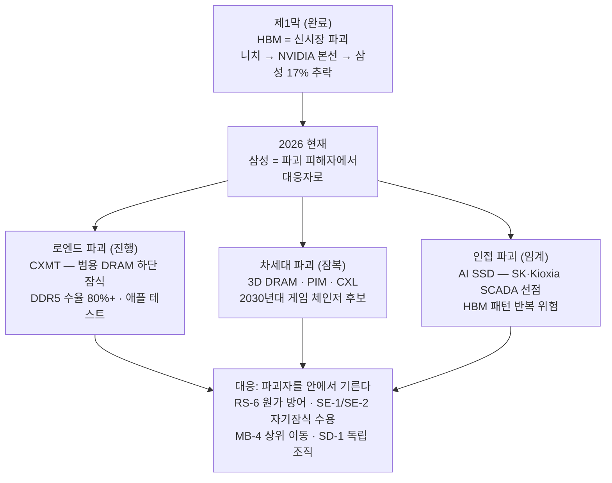

# 스토리라인 (파괴적 혁신 렌즈) — 삼성은 이미 한 번 파괴당했다

> **한 문장 논지**: 크리스텐슨의 렌즈로 보면 HBM 추락은 품질 사고가 아니라 **전형적인 파괴 피해 사례**다 — 주력 시장(범용 DRAM)의 우등생이 주변부 니치(HBM)를 과소평가하는 사이 니치가 주류가 됐다. 같은 패턴이 지금 세 방향(로엔드 CXMT·차세대 3D DRAM/CXL·인접 AI SSD)에서 반복되려 하고 있으며, 전략의 핵심은 **파괴자를 밖에 두지 않고 안에서 기르는 것**이다.

이 페이지는 [시나리오 플래닝 스토리라인](storyline.md)과 같은 위키 지식을 클레이튼 크리스텐슨의 파괴적 혁신(Disruptive Innovation) 렌즈로 다시 서사화한 것이다. 미래의 확률 대신 **파괴의 궤적(trajectory)**으로 이야기를 푼다.

## 파괴의 지도 한눈에

## 1. 제1막 — HBM은 삼성을 어떻게 파괴했나

교과서의 파괴는 이렇게 진행된다: 주변부의 열등해 보이는 기술이 니치에서 출발하고, 주력 시장의 강자는 그것을 "작은 시장·낮은 마진"으로 합리적으로 무시하며, 니치가 성능 궤적을 타고 올라와 어느 날 주류의 요구 수준을 충족하는 순간 지위가 역전된다. HBM이 정확히 이 경로를 걸었다. 범용 DRAM의 절대 강자였던 삼성에게 초기 HBM은 니치였다 — HBM 하나가 DDR 4~5개 캐파를 희생시키는 구조는 주력 사업의 논리로는 매력이 없다 ([choi-jangseok-product-planning-interview-2026-07-29.md](../../sources/raw-notes/choi-jangseok-product-planning-interview-2026-07-29.md)). 그러나 AI가 니치를 본선으로 바꿨고, 결과는 2023년 40%에서 2025년 상반기 17%로의 추락과 33년 만의 DRAM 왕좌 상실이었다 ([dram-market-share.md](../concepts/dram-market-share.md)). 파괴 이론의 핵심 교훈이 여기 있다 — **삼성을 이긴 것은 더 나은 범용 DRAM이 아니라, 범용 DRAM의 성공 공식이 무시하게 만든 다른 궤적이었다.**

## 2. 제2막 (진행 중) — CXMT의 로엔드 파괴

지금 진행 중인 것은 가장 고전적인 로엔드 파괴다. CXMT는 "충분히 좋은(good enough)" 품질 — DDR5 수율 80%+, 글로벌 빅3 근접 — 을 낮은 가격과 국가 보조로 무장하고 시장 하단에서 진입 중이며 ([2026-q1-current-state.md](../concepts/2026-q1-current-state.md), [cxmt.md](../entities/cxmt.md)), 애플이 중국 내수용 기기에 CXMT DRAM 테스트를 시작한 사건은 "로엔드 진입자가 메인스트림 고객의 인증 문턱에 도달"하는 파괴의 임계 신호다 ([apple-cxmt-china-dram-2026-07-08.md](../../sources/articles/apple-cxmt-china-dram-2026-07-08.md)). 크리스텐슨의 처방은 도망(상위 이동)이 아니라 이중 대응이다: 로엔드에서 원가로 맞서 잠식 속도를 늦추고(RS-6 1c nm 원가 우위), 동시에 상위 층의 가치를 새로 만든다(MB-4 커스텀 솔루션) ([strategy.md](../scenarios/strategy.md)). 상위 이동만 하는 기업은 결국 옥상까지 몰린다 — 그래서 RS-2 바벨은 로엔드(범용)를 버리지 않는 구조 그 자체다.

## 3. 제3막 (잠복) — 3D DRAM·CXL은 HBM의 HBM이다

HBM에게 당한 일은 HBM에게도 일어날 수 있다. 3D DRAM·PIM·CXL 메모리 패브릭은 지금의 HBM에게 "열등해 보이는 대안"이지만, 궤적이 교차하는 순간 40조 원+ HBM 투자가 좌초된다 — 시나리오 E의 세계다 ([key-drivers.md](../driving-forces/key-drivers.md) DF3, [scenario-E.md](../scenarios/scenario-E.md)). 외부 전문가 진단도 "2030년대 후반 게임 체인저 = 3D DRAM + CXL"을 지목한다 ([youtube-kwon-seokjun-2026-04-11.md](../../sources/articles/youtube-kwon-seokjun-2026-04-11.md)). 크리스텐슨이 남긴 유일하게 검증된 해법은 **자기잠식을 수용하는 별동대**다 — 주력 조직의 자원 배분 논리(HBM 마진 우선)에서 분리된 조직만이 파괴 기술을 진심으로 키울 수 있다. SE-1(3D DRAM 전담 300~500인 + IMEC 협약)과 SE-2(CXL 표준 주도권)는 정확히 이 구조이고, SD-1(HBM 조직 독립 P&L)은 조직 분리 원칙의 또 다른 적용이다 ([strategy.md](../scenarios/strategy.md), [core-strategy-selection.md](../scenarios/core-strategy-selection.md)). 커스텀 HBM 퇴조론과 zHBM(GPU 위 3D 적층) 부상론의 사내 논쟁 자체가, 다음 궤적이 이미 형성되고 있다는 신호다 ([choi-jangseok-product-planning-interview-2026-07-29.md](../../sources/raw-notes/choi-jangseok-product-planning-interview-2026-07-29.md)).

## 4. 제4막 (임계) — AI SSD에서 HBM 패턴이 반복되려 한다

파괴는 인접 시장에서도 진행 중이다. NVIDIA SCADA(GPU 네이티브 스토리지)에서 SK하이닉스·Kioxia가 SLC 기반 초고 IOPS AI SSD로 전략 파트너를 선점하고 있다 — HBM에서 벌어진 "니치 선점 → 레퍼런스 고착 → 구조적 열위"가 SSD에서 반복될 수 있는 구도다 ([nvidia-cmx-scada.md](../entities/nvidia-cmx-scada.md)). 이번에는 삼성이 니치를 무시하지 않는다는 것이 차이다: PM1763 시연·CMX 공식 공급 파트너 지위를 발판으로 2026년 내 SCADA 호환 전략을 확정하는 것이 MB-4의 하위 과제로 명시돼 있고, FDP 호스트 협력 플랫폼은 하드웨어가 아니라 소프트웨어 층에서 전환비용을 쌓는 대응이다 ([fdp-host-ssd-platform.md](../strategies/fdp-host-ssd-platform.md), [strategy.md](../scenarios/strategy.md)).

## 5. 이 렌즈의 결론

파괴적 혁신 렌즈에서 삼성 전략의 요체는 한 문장이다 — **다시는 궤적을 밖에서 맞지 마라.** 로엔드 파괴(CXMT)에는 원가 방어와 바벨로, 차세대 파괴(3D DRAM·CXL·zHBM)에는 자기잠식을 허락받은 별동대로, 인접 파괴(AI SSD)에는 니치 단계의 조기 진입으로 대응한다. 시나리오 렌즈가 파괴를 "확률 6%의 시나리오 E"로 계량한다면, 이 렌즈는 파괴가 확률이 아니라 **궤적**임을 상기시킨다 — 궤적은 어느 날 갑자기 오는 것이 아니라 지금 이미 그려지고 있고, EWI의 3D DRAM·CXL 트리거는 그 궤적의 교차점을 감시하는 장치다 ([strategy.md](../scenarios/strategy.md)).

---

## 갱신 규칙

- CXMT·3D DRAM·CXL·AI SSD(SCADA) 관련 페이지, SE-1·SE-2·SD-1·MB-4 전략이 바뀌면 이 페이지와 `dashboard/src/data/storylineLenses.js`의 파괴적 혁신 렌즈를 동반 갱신한다 (CLAUDE.md §6).
