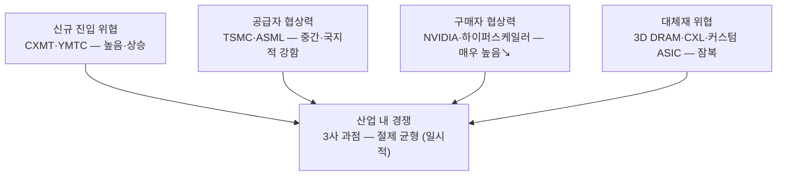

# 스토리라인 (파이브 포스 렌즈) — 협상력의 지도를 다시 그리는 싸움

> **한 문장 논지**: 시나리오로 보면 미래가 다섯 개지만, 포터의 다섯 힘으로 보면 싸움은 하나다 — **AI 메모리 가치사슬에서 협상력이 어디에 쌓이는가.** 삼성의 전략은 전부 "다섯 힘의 화살표를 자기 쪽으로 꺾는 작업"으로 다시 읽을 수 있다.

이 페이지는 [시나리오 플래닝 스토리라인](storyline.md)과 같은 위키 지식을 마이클 포터의 산업구조 분석(Five Forces)이라는 다른 렌즈로 다시 서사화한 것이다. 시간축(미래 분기) 대신 **구조축(힘의 배분)**으로 이야기를 푼다.

## 다섯 힘 한눈에

## 1. 구매자 — 산업 역사상 가장 강한 고객, 그러나 균열이 시작됐다

이 산업의 이익 지도를 지배하는 것은 구매자다. NVIDIA는 HBM4 공급 배정을 사실상 단독으로 결정하며 — Vera Rubin 배정에서 SK하이닉스 60~70%, 삼성 25~30%로 갈랐다 ([july-2026-market-update-2026-07-04.md](../../sources/articles/july-2026-market-update-2026-07-04.md)) — AI 데이터센터에서 60%대 영업이익률을 가져가는 동안 메모리 3사는 슈퍼사이클 정점에도 그 절반 이하를 가져간다 ([strategy.md](../scenarios/strategy.md)). 애플이 중국 내수용 DRAM에서 CXMT 카드를 꺼내 가격 지렛대를 만드는 것도 같은 구매자 권력의 행사다 ([apple-cxmt-china-dram-2026-07-08.md](../../sources/articles/apple-cxmt-china-dram-2026-07-08.md)).

그런데 2026년, 힘의 방향이 처음으로 흔들리고 있다. 공급 부족 국면에서 구매자들이 스스로 take-or-pay 멀티이어 계약에 서명하고 수백억 달러 선수금을 예치하기 시작했다 — NTB(Not-To-Below) 가격 하한까지 계약에 박힌다 ([lee-changsoo-memory-sales-interview-2026-08-03.md](../../sources/raw-notes/lee-changsoo-memory-sales-interview-2026-08-03.md)). 마이크론의 SCA 16건 $100B가 이 구조의 산업 표준화를 보여준다 ([micron-q3-fy26.md](../../sources/filings/micron-q3-fy26.md)). 구매자 권력의 원천이 "언제든 갈아탈 수 있음"이라면, 다년 락인은 그 원천을 스스로 봉인하는 행위다. **RS-3(CMX·SCADA·FDP 전환비용 극대화)와 RS-4(LTA·Take-or-Pay·단일 고객 ≤25%)는 이 균열을 구조로 굳히는 전략이다** ([invariant/README.md](../strategies/invariant/README.md)).

## 2. 산업 내 경쟁 — 6강의 살육전에서 3강의 절제 균형으로

현재의 경쟁 강도는 역사의 산물이다. 두 차례 치킨게임(2007~09, 2010~13)이 키몬다·엘피다·대만 진영을 퇴출시키고 6강을 3강으로 압축했으며, "3사는 6사가 할 수 없는 공급 규율 조율이 가능하다"는 구조를 남겼다 ([dram-chicken-game-history-2026-08-05.md](../../sources/articles/dram-chicken-game-history-2026-08-05.md)). 지금의 경쟁은 가격 살육전이 아니라 **NVIDIA 인증 슬롯을 둘러싼 기술 순위전**이다 — 33년 만의 DRAM 역전과 HBM 17% 추락이 보여주듯, 이 순위전에서 밀리는 비용은 점유율 몇 %p가 아니라 세대 전체다 ([dram-market-share.md](../concepts/dram-market-share.md)). 상세한 균형 분석은 [게임이론 렌즈](storyline-game-theory.md)에서 잇는다.

## 3. 신규 진입 — 국가가 뒤에 서 있는 진입자

교과서적으로 메모리는 진입장벽(자본·공정 노하우)이 극도로 높은 산업이지만, CXMT는 빅펀드와 IPO의 이중 자금원으로 그 장벽을 국가 재정으로 넘고 있다 — DDR5 수율 80%+, HBM3 양산 개시, 월 30만 장 캐파 ([2026-q1-current-state.md](../concepts/2026-q1-current-state.md), [cxmt.md](../entities/cxmt.md)). 진입 억지의 고전 수단(가격 보복)은 국가 보조 진입자에게 통하지 않는다. 그래서 삼성의 대응은 다른 층으로 올라간다 — **RS-6 공정 리더십(1c nm 원가 우위)으로 로엔드 방어선을 치고, MB-4 커스텀 솔루션으로 진입자가 오를 수 없는 고부가 층을 만든다** ([strategy.md](../scenarios/strategy.md)).

## 4. 공급자와 대체재 — 조용하지만 결정적인 두 힘

공급자 힘은 국지적으로 강하다. 첨단 패키징(CoWoS)은 TSMC가 NVIDIA 배정 60%를 쥐고 있고, 노광은 ASML 독점이며 High-NA 도입 일정이 산업 전체의 파라미터다 ([july-2026-market-update-2026-07-04.md](../../sources/articles/july-2026-market-update-2026-07-04.md), [tsmc.md](../entities/tsmc.md)). Hybrid Bonding 자체 IP(RS-6)와 일본 R&D 허브의 NIL(EUV 우회, SA-2)은 공급자 종속을 끊는 수직 통합 수다 ([core-strategy-selection.md](../scenarios/core-strategy-selection.md)).

대체재는 잠복 중인 최대 변수다. HBM의 대체재(3D DRAM·PIM·CXL 패브릭·커스텀 ASIC 내장 메모리)는 아직 점유율이 아니라 로드맵 위에 있지만 ([key-drivers.md](../driving-forces/key-drivers.md) DF3), 대체가 시작되면 HBM 집중 투자 전체가 좌초된다(시나리오 E). SE-1(3D DRAM)·SE-2(CXL 표준 주도권)는 대체재 위협을 **자기 포트폴리오 안으로 흡수**하는 고전적 응수다 ([strategy.md](../scenarios/strategy.md)).

## 5. 이 렌즈의 결론

다섯 힘 지도에서 삼성의 전략은 하나의 문장으로 요약된다 — **모든 힘의 화살표를 자기 쪽으로 꺾어라**: 구매자에게는 전환비용(RS-3)과 계약 구조(RS-4·RS-8)로, 경쟁자에게는 기술 순위전 승리(MB-1)와 절제 균형 유지(RS-5)로, 진입자에게는 원가 방어선(RS-6)으로, 공급자에게는 내재화(Hybrid Bonding IP)로, 대체재에게는 흡수(SE-1·SE-2)로. 시나리오 렌즈가 "어느 미래에 베팅할까"를 묻는다면, 이 렌즈는 "어느 미래가 와도 협상력 구조에서 이겨야 이익이 남는다"를 보여준다 — 두 렌즈는 같은 전략 세트를 서로 다른 이유로 정당화한다.

---

## 갱신 규칙

- 힘의 강도 평가에 영향을 주는 페이지(entities·concepts의 경쟁·고객·공급망 데이터, strategies)가 바뀌면 이 페이지와 `dashboard/src/data/storylineLenses.js`의 파이브 포스 렌즈를 동반 갱신한다 (CLAUDE.md §6).
