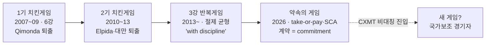

# 스토리라인 (게임이론 렌즈) — 치킨게임에서 약속의 게임으로

> **한 문장 논지**: 메모리 산업은 두 번의 치킨게임으로 경기자를 6명에서 3명으로 줄였고, 지금은 **절제가 균형인 반복게임**을 두고 있다 — 삼성의 전략은 이 균형을 유지하는 약속 장치(commitment device)를 쌓되, 균형을 깨는 이단 경기자(CXMT)의 등장에 별도의 게임으로 대응하는 것이다.

이 페이지는 [시나리오 플래닝 스토리라인](storyline.md)과 같은 위키 지식을 게임이론의 렌즈로 다시 서사화한 것이다. 미래의 분기 대신 **경기자·보수·균형의 변화**로 이야기를 푼다.

## 게임의 진화 한눈에

## 1. 원게임 — 치킨게임은 왜 두 번이나 벌어졌나

일회성 대칭 게임에서 증설은 지배전략에 가깝다 — 내가 절제해도 상대가 증설하면 점유율만 잃는다. 그래서 2007~09년 6강 전원이 증설·버티기를 선택했고, DRAM 가격은 2007년 -85%, 2008년 -58%로 붕괴했다. 결과는 승자의 시장 재편이었다: 키몬다가 누적 손실 $30억을 견디지 못하고 2009년 1월 퇴출됐고, 퇴출 발표 직후 현물가가 급등하며 "경기자 수가 곧 가격"임을 실증했다. 2012년에는 엘피다(부채 4,480억 엔, 전후 일본 제조업 최대 파산)와 대만 진영이 퇴장했다 ([dram-chicken-game-history-2026-08-05.md](../../sources/articles/dram-chicken-game-history-2026-08-05.md)). 삼성은 이 게임의 승자였다 — 위기 직후인 2010년 메모리 시설투자를 5.5조에서 9조 원으로 올리는 역사이클 증설로 회복기 점유율을 흡수했다 (같은 소스).

## 2. 반복게임 — 3강 체제에서 절제는 균형이 된다

경기자가 3명으로 줄자 게임의 성격이 바뀌었다. 반복게임에서는 미래 보복(상대 증설 유발)의 그림자가 현재의 절제를 지탱한다 — "3사는 6사가 할 수 없는 공급 규율 조율이 가능하다" ([dram-chicken-game-history-2026-08-05.md](../../sources/articles/dram-chicken-game-history-2026-08-05.md)). 2026년 이 균형은 공개 신호로 유지되고 있다: 마이크론 CEO는 "shortage well beyond 2026"을 말하며 한 발표에서 "with discipline"을 4회 반복했고 ([bloomberg-micron-ceo-virginia-2026-05-22.md](../../sources/articles/bloomberg-micron-ceo-virginia-2026-05-22.md)), HBM 점유율을 DRAM 점유율에 묶어 웨이퍼 잠식을 회피한다고 공시했다 ([micron-q3-fy26.md](../../sources/filings/micron-q3-fy26.md)). 경쟁사가 동시에 절제하는 환경에서는 삼성의 단독 절제가 점유율 손실로 이어질 우려도 약화된다 ([strategy.md](../scenarios/strategy.md) D16). **RS-5(재무 규율)와 RS-1(옵션형 캐파)은 삼성이 이 균형에 내는 판돈이다** — 절제를 내부 거버넌스로 명문화해 스스로 이탈 유혹을 차단한다 ([invariant/README.md](../strategies/invariant/README.md)).

## 3. 약속 장치 — 계약이 게임의 보수 구조를 바꾼다

2026년의 진짜 혁신은 공급자-구매자 게임에서 일어났다. 호황-불황 사이클의 근원은 수요자의 이탈 자유(불황 시 발주 취소)와 공급자의 증설 유혹이 서로를 증폭하는 데 있다. take-or-pay 멀티이어 계약·수백억 달러 선수금 예치·NTB 가격 하한은 **양쪽의 이탈 옵션을 계약으로 태워버리는 약속 장치**다 — "구매 의무를 저버리면 개수×판가로 캐시에서 차감"되는 구조는 사우디 오일 계약처럼 배신의 비용을 명시화한다 ([lee-changsoo-memory-sales-interview-2026-08-03.md](../../sources/raw-notes/lee-changsoo-memory-sales-interview-2026-08-03.md)). 마이크론 SCA 16건 $100B의 공시 제도화가 이를 산업 표준으로 만들었고, UBS는 "LTA가 메모리 순환성을 근본적으로 제거한다"고까지 평가한다 ([lta-to-sca-industry-context-2026-06.md](../../sources/articles/lta-to-sca-industry-context-2026-06.md)). 게임이론적으로 이것은 치킨게임의 핸들을 뽑아 창밖으로 던지는 고전적 수 — 선택지를 없애 상대의 기대를 바꾸는 것이다. **RS-8(구조화 매출 헷지)·RS-4(Take-or-Pay LTA)는 이 약속 게임에서 삼성 몫의 계약 설계다.**

## 4. 이단 경기자 — CXMT는 다른 보수함수로 게임한다

이 균형의 최대 위협은 3강 내부가 아니라 외부에 있다. CXMT는 이윤 극대화가 아니라 **국가 목표(반도체 자립)를 보수함수로 갖는 경기자**다 — 빅펀드 III와 IPO의 이중 자금원, DDR5 수율 80%+, HBM3 양산 개시 ([cxmt.md](../entities/cxmt.md), [2026-q1-current-state.md](../concepts/2026-q1-current-state.md)). 손실을 국가가 흡수하는 경기자에게는 가격 보복(치킨게임의 위협)이 억지력을 갖지 못한다. 따라서 대응 게임이 달라진다: 같은 코스트 게임을 받아주는 대신, **RS-6(1c nm 원가 우위)으로 로엔드의 손실 한계를 관리하고, RS-2(바벨)·MB-4(커스텀 솔루션)로 국가보조가 닿지 않는 고부가 층으로 게임판을 옮긴다** ([strategy.md](../scenarios/strategy.md)). 중국 시장이 미주 AI 사이클과 비동조화되어 있다는 관찰도 이 게임의 분리 가능성을 지지한다 ([lee-changsoo-memory-sales-interview-2026-08-03.md](../../sources/raw-notes/lee-changsoo-memory-sales-interview-2026-08-03.md)).

## 5. 이 렌즈가 도출하는 최적 전략 — 균형을 지키는 수의 순서

게임이론이 묻는 질문은 하나다: "지금의 '3사 모두 증설을 자제하는 균형'은 모두에게 이익인데, 이 균형을 어떻게 오래 유지하고, 깨졌을 때 어떻게 살아남는가?" 균형에 기여하는 크기 순으로 전략을 배열하면 다음과 같다.

**1순위 — 절제를 공개적으로 약속하라 (D16 호황 정점 규율 + D6 이사회 정책화)**

- *무엇을 하자는 것인가*: "우리는 호황이라고 무리하게 증설하지 않는다"는 원칙 — 재고일수 상한, 장기계약 없는 신규 증설 금지, 다운사이클에도 R&D 예산 하한 유지 — 을 이사회 공식 정책으로 결의하고 밖에서 보이게 만드는 것이다. [RS-5 재무 규율](../strategies/invariant/rs5-financial-discipline-reinvestment.md)이 내용이고, D6(이사회 정책화)·D16(정점 규율 즉시 발동)이 실행 결정이다 ([strategy.md](../scenarios/strategy.md) §7.1).
- *왜 이것이 1순위인가*: 반복게임의 역설 — 가장 강한 수는 내 선택지를 스스로 줄여서 상대가 나를 믿게 만드는 것이다. 상대가 "삼성은 증설로 배신하지 않는다"고 믿어야 상대도 절제하고, 그래야 3사 모두 이익을 지킨다. 마이크론 CEO가 실적 발표에서 "with discipline(절제하며)"을 4번 반복하고 HBM 생산을 DRAM 점유율에 묶겠다고 공시한 것이 정확히 이런 신호다 ([bloomberg-micron-ceo-virginia-2026-05-22.md](../../sources/articles/bloomberg-micron-ceo-virginia-2026-05-22.md), [micron-q3-fy26.md](../../sources/filings/micron-q3-fy26.md)). 상대는 이미 신호를 보냈고, 삼성이 응답할 차례다.

**2순위 — 고객과의 약속을 계약서에 못박아라 (take-or-pay·NTB + RS-8 표준화)**

- *무엇을 하자는 것인가*: 사이클 붕괴의 뇌관은 "불황이 오면 고객이 주문을 취소하고, 그 공포 때문에 호황에 다들 과잉 증설하는" 악순환이다. 이를 끊는 방법이 계약이다 — 안 사가도 돈을 내는 take-or-pay, 가격이 이 밑으로 못 내려가는 하한(NTB), 하한을 보장받는 대신 상승분의 절반을 나누는 Participating Forward. 이런 계약 템플릿의 표준화가 [RS-8](../strategies/invariant/rs8-structured-revenue-hedging.md)이고 실행 결정이 D12다.
- *왜 2순위인가*: 계약으로 묶인 물량이 캐파의 과반을 훨씬 넘으면 ([lee-changsoo-memory-sales-interview-2026-08-03.md](../../sources/raw-notes/lee-changsoo-memory-sales-interview-2026-08-03.md) — 실제 영업 현장의 목표다), 다운턴이 와도 매출 바닥이 계약으로 보장되므로 **치킨게임을 다시 시작할 유인 자체가 사라진다**. 1순위(내 절제)가 균형의 한쪽 축이라면, 이것은 게임의 판돈 구조 자체를 바꾸는 축이다.

**3순위 — 보복 능력은 버리지 마라 (RS-1 옵션형 캐파)**

- *무엇을 하자는 것인가*: 팹 건물(Fab Shell)은 미리 지어두되 고가 장비는 수요가 확인될 때만 단계적으로 반입하는 증설 방식이다 ([rs1-options-based-capacity.md](../strategies/invariant/rs1-options-based-capacity.md)). 평소에는 증설하지 않지만, 마음먹으면 경쟁사보다 빨리 증설할 수 있는 상태를 싸게 유지한다.
- *왜 3순위인가*: 협조 균형은 선의로 유지되는 게 아니라 "배신하면 응징당한다"는 믿음으로 유지된다. 상대가 균형을 깨고 공격적 증설에 나설 때 삼성이 신속하게 대응 증설할 수 있다는 사실 자체가, 상대가 애초에 배신하지 않게 만드는 억지력이다. 절제(1순위)와 모순되지 않는다 — 총을 쏘지 않는 것과 총을 버리는 것은 다르다.

**4순위 — 국가보조 경기자와는 판을 갈아라 (RS-6 + RS-2 + MB-4)**

- *무엇을 하자는 것인가*: 중국 CXMT는 이윤이 아니라 국가 목표(반도체 자립)를 위해 움직이므로, 손실을 국가가 메워주는 상대와 가격 전쟁(치킨게임)을 하는 것은 이길 수 없는 게임이다. 대신 ① 최신 공정 원가 우위([RS-6](../strategies/invariant/rs6-process-leadership.md))로 로엔드에서 버티는 한계선을 관리하고, ② 고부가(HBM·커스텀)와 저원가(범용) 양 끝을 다 잡는 [RS-2 바벨 포트폴리오](../strategies/invariant/rs2-barbell-portfolio.md)를 유지하며, ③ 국가 보조금이 닿지 않는 커스텀 솔루션 층(MB-4)으로 게임판을 옮긴다.
- *왜 4순위인가*: 시급하지만, 1~3순위(3강 균형·계약 구조)가 무너지면 이 전략도 함께 무너지므로 균형 유지가 선행 조건이다. 중국 시장이 미주 AI 사이클과 따로 움직인다는 관찰 ([lee-changsoo-memory-sales-interview-2026-08-03.md](../../sources/raw-notes/lee-changsoo-memory-sales-interview-2026-08-03.md))은 판 분리가 실제로 가능함을 시사한다.

**시나리오 렌즈와 어떻게 다른가**: 이 렌즈의 고유한 기여는 경고다. 시나리오 B 공략(점유율 회복)을 **증설 경쟁으로 수행하면 그것이 바로 치킨게임 재점화의 방아쇠**가 된다 — 1990~2000년대의 역사가 그랬다. 그래서 MB-1(기술 1위 탈환)은 캐파를 늘리는 방식이 아니라 수율·인증·HBM4E 세대 선행 같은 기술 순위전으로만 수행해야 하며, 경쟁사의 공격적 증설(균형 이탈 신호)은 EWI로 감시해 D16 대응과 연동한다.

> 📊 대시보드에서 자세히: **Strategy 탭 → Robust Strategy**(RS-1~9 상세), **Strategy 탭 → Decisions**(D1~D17 로드맵), **EWI 탭 → 시나리오 트리거**(균형 이탈 감시).

## 6. 이 렌즈의 결론

게임이론 렌즈에서 삼성 전략의 요체는 세 문장이다. **첫째, 절제 균형을 지켜라** — RS-5·RS-1로 자기 손을 묶고, 경쟁사의 공개 절제 신호를 EWI로 감시한다(균형 이탈 = D16 발동 신호). **둘째, 약속 장치를 쌓아라** — take-or-pay·NTB·SCA로 다운사이클의 보수 구조 자체를 바꾼다. **셋째, 이단 경기자와는 다른 판에서 싸워라** — 원가 방어선 위에 커스텀·솔루션 층을 올린다. 시나리오 렌즈의 "다섯 개의 미래"는 이 렌즈에서 "균형이 유지되는 미래(A·B)와 균형이 깨지는 미래(C·D·E)"로 다시 읽히며, 두 렌즈 모두 같은 결론에 도달한다 — 호황 정점의 규율이 다음 게임의 승패를 결정한다.

---

## 갱신 규칙

- 경쟁사 캐파·절제 신호·계약 구조(LTA/SCA)·CXMT 관련 페이지가 바뀌면 이 페이지와 `dashboard/src/data/storylineLenses.js`의 게임이론 렌즈를 동반 갱신한다 (CLAUDE.md §6).
