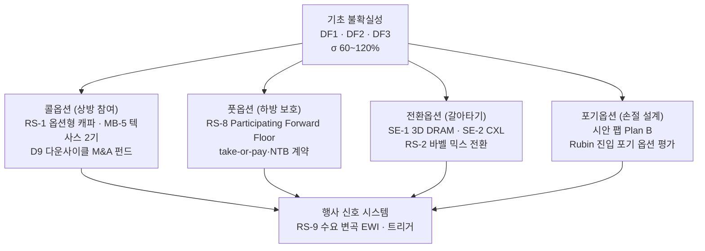

# 스토리라인 (실물옵션 렌즈) — 변동성이 클수록 옵션은 비싸진다

> **한 문장 논지**: 메모리처럼 변동성(σ 60~120%)이 극단적인 산업에서 "확정 투자"는 가장 비싼 선택이다 — 삼성의 전략 포트폴리오는 사실상 **콜·풋·전환·포기 옵션의 묶음**이며, EWI는 그 옵션들의 행사 신호 시스템이다.

이 페이지는 [시나리오 플래닝 스토리라인](storyline.md)과 같은 위키 지식을 실물옵션(Real Options) 렌즈로 다시 서사화한 것이다. "어느 미래에 베팅하나" 대신 **"불확실성 아래에서 언제·얼마나 결정을 미루고, 무엇을 미리 사두나"**로 이야기를 푼다.

## 옵션 포트폴리오 한눈에

## 1. 왜 옵션인가 — 이 산업의 변동성은 확정 투자를 벌한다

메모리 가격 변동성은 σ 60~120%로 원유(30%)·주식시장(18%)의 2~4배에 달하고, 2025년 하반기에는 16Gb DDR5가 넉 달 만에 +297% 점프했다 ([agri-hedging-to-memory-semi.md](../benchmark/agri-hedging-to-memory-semi.md)). 옵션 가치는 변동성에 비례한다 — 이 산업에서 "결정을 나중에 내릴 권리"와 "하방을 잘라낼 권리"는 금융시장 어디보다 비싸다. 지난 30년 다섯 번의 다운턴마다 이익의 84%가 사라진 역사는 ([semiconductor-cycle.md](../concepts/semiconductor-cycle.md)), 확정 캐파·확정 가격으로 이 변동성을 정면으로 받아온 비용의 기록이다. 실물옵션 렌즈의 출발점은 그래서 단순하다: **캐파·가격·기술·지역 — 네 영역 모두에서 "확정"을 "옵션"으로 바꿔라.**

## 2. 콜옵션 — 상방을 사되, 프리미엄만 내라

RS-1 옵션형 캐파는 교과서적 콜옵션 구조다: Fab Shell(건물)을 선행 투자하고 장비 반입을 단계화하면, 수요 상방이 실현될 때만 잔여 행사가격(장비 capex)을 지불한다 — "켜고 끌 수 있는 능력"의 제도화다 ([rs1-options-based-capacity.md](../strategies/invariant/rs1-options-based-capacity.md)). MB-5 텍사스 테일러 2기도 같은 구조다 — 1단계 가동과 보조금 협상으로 미국 생산의 옵션을 확보하되, 본격 행사(HBM 전용 라인)는 수요 확인 후로 미룬다 ([strategy.md](../scenarios/strategy.md)). 가장 우아한 콜은 D9 다운사이클 M&A 펀드다: EV/EBITDA 5배 이하 6개월 지속이라는 행사 조건을 사전에 정의하고 5,000억 원의 프리미엄을 미리 적립해, 자산 가격 폭락(다른 모두에게는 재앙)을 매수 기회로 바꾼다 ([strategy.md](../scenarios/strategy.md) D9).

## 3. 풋옵션 — 하방을 계약으로 잘라낸다

RS-8의 Participating Forward는 명시적 풋 구조다: Floor(변동비+5~10%)를 보장받고 상방의 50%에 참여한다 — 매출 변동성을 ±25%에서 ±12%로 절반 축소한다 ([agri-hedging-to-memory-semi.md](../benchmark/agri-hedging-to-memory-semi.md), [invariant/README.md](../strategies/invariant/README.md)). 여기서 하나의 금지 조항이 옵션 설계의 정수를 보여준다: sub-put을 매도해 프리미엄을 아끼는 Three-way Collar는 절대 금지 — 셰일 업계가 2014·2020년 두 차례 증명했듯, 아낀 프리미엄은 폭락 구간에서 손실 가속으로 돌아온다 ([upside-participation-hedging.md](../benchmark/upside-participation-hedging.md)). 2026년 현재 이 풋은 이미 현실이 되고 있다 — take-or-pay 멀티이어 계약과 NTB 가격 하한이 "컬랩스가 와도 상당한 이익률"의 바닥을 계약으로 고정한다 ([lee-changsoo-memory-sales-interview-2026-08-03.md](../../sources/raw-notes/lee-changsoo-memory-sales-interview-2026-08-03.md)).

## 4. 전환·포기옵션 — 갈아탈 권리와 손절할 권리

기술 축의 불확실성(DF3: HBM 지속 vs 3D DRAM·CXL 대체)에는 전환옵션으로 대응한다. SE-1(3D DRAM 전담 조직 + IMEC 협약)과 SE-2(CXL 표준 주도권)는 지금 소액의 프리미엄(R&D 재배분)으로 패러다임 전환 시 갈아탈 권리를 사두는 것이고 ([strategy.md](../scenarios/strategy.md)), RS-2 바벨 포트폴리오는 HBM↔범용 사이의 믹스 전환권이다 — 2026년 1분기 일반 DRAM 마진이 HBM을 앞선 순간, 이 전환권의 가치는 실증됐다 ([2026-q1-current-state.md](../concepts/2026-q1-current-state.md)). 반대편에는 포기옵션이 있다: 시안 팹 단계적 축소 Plan B(지정학 트리거 발동 시 손절 경로 사전 설계)와, KPI 미달 시 Rubin 세대를 건너뛰고 HBM4E·HBM5로 윈도우를 이동하는 진입 포기 옵션 평가가 그것이다 ([strategy.md](../scenarios/strategy.md)).

## 5. 행사 신호 — EWI는 옵션 데스크의 시세판이다

옵션 포트폴리오의 가치는 행사 타이밍이 결정한다. RS-9의 수요 변곡 EWI(GPU 임대가·신용 스프레드·스팟-계약 괴리·발주-셀스루 갭)와 4대 병목 정량 모델은 각 옵션의 기초자산 가격을 실시간으로 읽는 시세판이다 ([demand-inflection-ewi-2026-06.md](../../sources/raw-notes/demand-inflection-ewi-2026-06.md), [deep-research-2030-bottleneck-quant-model-2026-06.md](../../sources/papers/deep-research-2030-bottleneck-quant-model-2026-06.md)). 트리거는 행사 규칙이다 — GPU 임대가 6개월 -35%면 콜(RS-1 증설) 동결·풋 점검, EV/EBITDA 5배 이하 6개월이면 M&A 콜 행사, 3D DRAM 전력 50% 개선 입증이면 전환옵션 행사 ([strategy.md](../scenarios/strategy.md) 시나리오 전환 트리거). "꼭짓점은 FCF"라는 영업 현장의 렌즈는 이 시세판의 대표 지표다 ([lee-changsoo-memory-sales-interview-2026-08-03.md](../../sources/raw-notes/lee-changsoo-memory-sales-interview-2026-08-03.md)).

## 6. 이 렌즈가 도출하는 최적 전략 — 옵션 데스크의 집행 순서

실물옵션이 묻는 질문은 하나다: "앞날을 모를 때, 어떤 결정을 지금 확정하고 어떤 결정을 되돌릴 수 있는 형태로 남겨둘 것인가?" 가격이 극단적으로 출렁이는 지금(변동성 σ 60~120%, 수요 축 정점) 기준으로 집행 순서를 매기면 다음과 같다.

**1순위 — 보험부터 들어라 (D12 Participating Forward 시범 + D16 정점 규율)**

- *무엇을 하자는 것인가*: 금융의 풋옵션(가격이 폭락해도 최저 매도가를 보장받는 권리)에 해당하는 것을 실물 계약으로 만드는 것이다. 구체적으로는 "최저 가격(Floor, 변동비+5~10%)을 보장받는 대신 가격 상승분의 50%를 고객과 나누는" Participating Forward 계약을 주요 고객 1~2사와 시범 체결한다 — [RS-8 구조화 매출 헷지](../strategies/invariant/rs8-structured-revenue-hedging.md)의 핵심이고 실행 결정은 D12다 ([strategy.md](../scenarios/strategy.md) §7.1).
- *왜 이것이 1순위인가*: 보험은 불나기 전에 드는 것이고, 지금이 바로 그 시점이기 때문이다. 사상 최고 마진, 범용 가격 상승 감속, 일반 DRAM 마진이 HBM을 앞서는 역전 — 호황의 끝물에 나타나는 신호들이 겹쳐 있다 ([key-drivers.md](../driving-forces/key-drivers.md)). 게다가 고객들이 스스로 다년 계약과 가격 하한(NTB)에 들어오는 지금은 Floor를 유리하게 협상할 수 있는 드문 창이다 ([lee-changsoo-memory-sales-interview-2026-08-03.md](../../sources/raw-notes/lee-changsoo-memory-sales-interview-2026-08-03.md)).

**2순위 — 큰 투자는 전부 "되돌릴 수 있는 형태"로 바꿔라 (RS-1 옵션형 캐파)**

- *무엇을 하자는 것인가*: 신규 증설을 한 번에 확정하지 말고, 건물(Fab Shell)만 미리 짓고 수조 원짜리 장비는 수요가 실제로 확인될 때 단계적으로 들이는 방식([RS-1](../strategies/invariant/rs1-options-based-capacity.md))을 모든 신규 캐파의 기본 형태로 강제하는 것이다. 텍사스 2기(MB-5)도 같은 단계화 구조를 유지한다.
- *왜 2순위인가*: 옵션 이론의 기본 — 불확실성이 클수록 "기다릴 수 있는 권리"의 가치가 커진다. 지금처럼 변동성이 극단적일 때 수십조 원을 한 번에 확정하는 것은 그 권리를 공짜로 버리는 셈이다. 예외는 이미 승산이 확인된 자산뿐이다 — 업계 최초 샘플로 경쟁사 대비 6개월 앞선 것이 확인된 HBM4E 세대 ([june-2026-market-update-2026-06-14.md](../../sources/articles/june-2026-market-update-2026-06-14.md)) 같은 경우만 확정 투자를 허용한다.

**3순위 — 갈아탈 권리의 보험료를 아끼지 마라 (D13 3D DRAM · D14 CXL)**

- *무엇을 하자는 것인가*: HBM이 언젠가 다른 기술(3D DRAM·CXL)로 대체될 경우를 대비해, 지금 R&D 예산의 일부(전체 대비 소액)를 차세대 기술에 계속 투입하는 것이다 — SE-1(3D DRAM 조직·IMEC 협약 확대, D13)과 SE-2(CXL 표준 주도권, D14).
- *왜 3순위인가*: 이 지출은 "패러다임이 바뀌면 갈아탈 수 있는 권리"의 보험료다. 보험료가 아깝다고 끊는 순간 — 3D DRAM·CXL 투자 중단 — 대체가 시작됐을 때 삼성은 무방비가 된다. 셰일 업계가 보험료를 아끼려다(sub-put 매도) 폭락 때 손실이 가속된 사례가 반면교사다 ([upside-participation-hedging.md](../benchmark/upside-participation-hedging.md)).

**4순위 — 행사는 사람 말고 규칙이 하게 하라 (D15 EWI 운영)**

- *무엇을 하자는 것인가*: 위 옵션들을 "언제 행사할지"를 사람의 그때그때 판단이 아니라 사전에 정한 규칙에 맡기는 것이다. GPU 임대가 6개월 -35% → 증설 동결, 기업가치 폭락(EV/EBITDA 5배 이하 6개월) → M&A 펀드 집행, 3D DRAM 전력 50% 개선 입증 → 차세대 투자 확대 — 이런 트리거-행동 배선을 완성하는 것이 D15(수요 변곡 조기경보 운영)다 ([strategy.md](../scenarios/strategy.md) §7.3, [demand-inflection-ewi-2026-06.md](../../sources/raw-notes/demand-inflection-ewi-2026-06.md)).
- *왜 4순위인가*: 옵션 가치의 절반은 규율 있는 행사에서 나온다. 정점에서는 낙관이, 바닥에서는 공포가 판단을 왜곡한다 — 규칙만이 그 왜곡을 피한다.

**시나리오 렌즈와 어떻게 다른가**: 시나리오 렌즈는 "가장 큰 미래(B)에 베팅하라"고 말한다. 이 렌즈는 그 베팅의 **형태**를 교정한다 — 같은 B 공략이라도 수십조 원을 한 번에 확정하는 방식이 아니라, 확정은 최소로·옵션은 최대로 하는 구조로 수행하라. **최적 전략은 "무엇에 베팅하나"만큼 "얼마나 되돌릴 수 있게 베팅하나"로 결정된다.**

> 📊 대시보드에서 자세히: **Strategy 탭 → Robust Strategy**(RS-1·RS-8 상세), **EWI 탭**(트리거·지표 실시간), **Bottleneck Model 탭**(수요 실현 가능성 정량 모델).

## 7. 이 렌즈의 결론

실물옵션 렌즈에서 보면 시나리오 플래닝의 "Main Bet + Side Bet + Robust"는 정확히 옵션 포트폴리오의 언어로 번역된다 — Main Bet은 가장 큰 내가격(in-the-money) 가능성에 대한 포지션, Side Bet은 외가격 보험, Robust는 어떤 기초자산 경로에서도 양(+)의 감마를 갖는 구조다. 이 렌즈가 더하는 고유한 통찰은 하나다: **변동성이 역대 최고인 지금이야말로 옵션(유연성)의 가치가 역대 최고이며, 따라서 확정 증설·확정 가격이라는 "옵션 없는 전략"의 기회비용도 역대 최고라는 것.** 호황 정점에서 유연성을 사두는 비용은, 다운턴에서 유연성이 없어 치르는 비용의 몇 분의 일에 불과하다.

---

## 갱신 규칙

- RS-1·RS-8·D9 등 옵션 구조 전략, EWI·트리거 정의, 변동성 데이터가 바뀌면 이 페이지와 `dashboard/src/data/storylineLenses.js`의 실물옵션 렌즈를 동반 갱신한다 (CLAUDE.md §6).
