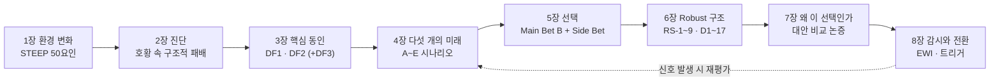
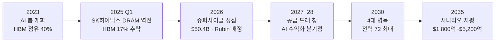

# 스토리라인 — 환경 변화에서 전략적 선택까지

> **한 문장 논지**: 사상 최대 호황의 정점에서 삼성전자 메모리사업부가 내려야 할 결정은 "더 크게 베팅하라"가 아니라, **가장 큰 미래(시나리오 B, 39%)에 베팅하되 어떤 미래가 와도 지지 않는 구조(RS-1~9)를 먼저 깔고, 전환 시점은 데이터(EWI)가 알려주게 하는 것**이다.

이 페이지는 위키 전체 지식 — 환경 변화([STEEP](../steep/economy.md)) → 진단([entities](../entities/samsung.md)·[concepts](../concepts/hbm-market.md)) → 핵심 동인([driving-forces](../driving-forces/key-drivers.md)) → 갈림길([scenarios](../scenarios/scenario-matrix.md)) → 선택([strategies](../scenarios/strategy.md)) — 을 하나의 이야기로 잇는 종합 서사다. 위키에 새 소스가 들어와 하류 페이지가 바뀌면 이 서사도 함께 갱신된다(CLAUDE.md §6 정합성 체인).

## 스토리 흐름 한눈에

## 연대기

---

## 1장. 2023년, 게임의 규칙이 바뀌었다

이야기는 2023년에 시작된다. 생성형 AI가 데이터센터의 설계도를 다시 그리면서, 30년간 PC와 스마트폰의 사이클을 따라 움직이던 메모리 산업에 완전히 새로운 수요 엔진이 장착됐다. 빅테크 4사의 AI 설비투자는 2024년 $200B에서 2026년 $725B로 2년 만에 3배 이상 불어났고, 2026년 성장률만 +77%에 달한다 ([samsung-hbm4-volume-order-pending-2026-07-17.md](../../sources/articles/samsung-hbm4-volume-order-pending-2026-07-17.md)). 전 세계 17개국에서 55.9GW 규모의 AI 데이터센터가 착공 파이프라인에 올라 있으며 ([ai-datacenter-buildout-2026-06.md](../../sources/raw-notes/ai-datacenter-buildout-2026-06.md)), 마이크로소프트는 2026년 CapEx $190B 중 $25B가 메모리·반도체 가격 상승분이라고 직접 인정했다 ([2026-q1-current-state.md](../concepts/2026-q1-current-state.md)).

이 수요 폭발은 메모리 시장 전체를 들어올렸다. 2026년 글로벌 메모리 시장은 $551.6B(+134% YoY)로 전망되고, HBM은 전 물량이 Sold Out이다 ([memory-market-overview.md](../concepts/memory-market-overview.md)). 그러나 환경 변화는 수요만이 아니다. [STEEP 50요인 분석](../steep/economy.md)이 보여주듯, 반도체는 국가 안보 자산이 됐고([political.md](../steep/political.md)), 데이터센터 전력망은 새로운 병목으로 떠올랐으며([environment.md](../steep/environment.md)) — 2026년 7월 기준 4대 병목 제약지수에서 전력이 72로 최대 병목이다 ([july-2026-market-update-2026-07-04.md](../../sources/articles/july-2026-market-update-2026-07-04.md)) — AI 투자의 ROI 논쟁은 사회적 회의론으로 번지고 있다([social.md](../steep/social.md)). 게임의 규칙이 바뀌었다는 것은, 기회와 위험의 규칙이 동시에 바뀌었다는 뜻이다.

## 2장. 호황 속의 구조적 패배

숫자만 보면 삼성전자 메모리사업부는 승자다. 2026년 1분기 메모리 매출은 사상 최대 74.8조 원($50.4B, +292% YoY)을 기록했고, HBM4를 업계 최초로 양산했다 ([2026-q1-current-state.md](../concepts/2026-q1-current-state.md)). 경쟁사 실적은 슈퍼사이클의 강도를 실증한다 — 마이크론의 FY26 3분기 매출은 $41.46B(+346% YoY), 매출총이익률은 사상 최고 84.9%였다 ([micron-q3-fy26.md](../../sources/filings/micron-q3-fy26.md)).

그러나 이 호황의 안쪽에서 삼성은 구조적으로 지고 있다. 2025년 1분기, SK하이닉스가 33년 만에 처음으로 DRAM 점유율에서 삼성을 추월했다 ([dram-market-share.md](../concepts/dram-market-share.md)). 원인은 HBM이다. 2023년 40%였던 삼성의 HBM 점유율은 HBM3E 품질 이슈를 거치며 2025년 상반기 17%까지 추락했고 ([dram-market-share.md](../concepts/dram-market-share.md)), AI 시대의 본선인 NVIDIA Vera Rubin 플랫폼 HBM4 배정에서 SK하이닉스 60~70%, 삼성 25~30%로 후순위가 확정됐다 ([july-2026-market-update-2026-07-04.md](../../sources/articles/july-2026-market-update-2026-07-04.md)). 2026년 7월 HBM4 인증을 통과하고도 볼륨 발주는 아직 전환되지 않았다 ([samsung-hbm4-volume-order-pending-2026-07-17.md](../../sources/articles/samsung-hbm4-volume-order-pending-2026-07-17.md)).

이것이 위험한 이유는 메모리가 사이클 산업이기 때문이다. 지난 30년간 다섯 번의 다운턴마다 매출의 38%, 이익의 84%가 사라졌다 ([semiconductor-cycle.md](../concepts/semiconductor-cycle.md)). 호황 속의 점유율 패배는 다운턴의 손실을 키운다. 희망적 신호가 없는 것은 아니다 — 삼성은 HBM4E 샘플을 업계 최초로 출하하며(3.6TB/s, 경쟁사 대비 6개월 선행) 다음 세대 역전의 창을 열었다 ([june-2026-market-update-2026-06-14.md](../../sources/articles/june-2026-market-update-2026-06-14.md)). 문제는 이 창이 열려 있는 동안 어떤 미래가 오는가다.

## 3장. 답할 수 없는 두 개의 질문

미래를 결정하는 것은 삼성이 통제할 수 없는 두 개의 질문이다. [50개 STEEP 요인을 Impact × Uncertainty로 평가](../driving-forces/impact-uncertainty-matrix.md)한 결과, 최상위 불확실성은 두 축으로 수렴했다 ([key-drivers.md](../driving-forces/key-drivers.md)).

**첫 번째 질문(DF1): AI 수요는 구조적으로 지속되는가?** 빅테크 CapEx가 2027년 $1조를 돌파하는 슈퍼사이클(Pole A)과, ROI 실망으로 2027~2028년 투자가 급삭감되는 버블 붕괴(Pole B)가 양 극단이다. 현재 위치는 8.5 — 정점이다. 마이크론의 사상 최고 마진(84.9%)과 SCA 16건 $100B의 계약 락인 ([micron-q3-fy26.md](../../sources/filings/micron-q3-fy26.md)), take-or-pay 멀티이어 계약과 NTB 가격 하한으로 바닥까지 경직화된 수급 ([lee-changsoo-memory-sales-interview-2026-08-03.md](../../sources/raw-notes/lee-changsoo-memory-sales-interview-2026-08-03.md))이 상방을 지지하지만, 바로 그 사상 최고 마진과 범용 DRAM 계약가의 첫 감속(Q3 +13~18%, Q2 +58~63% 대비)이 후기순환의 전형적 신호이기도 하다 ([july-2026-market-update-2026-07-04.md](../../sources/articles/july-2026-market-update-2026-07-04.md)).

**두 번째 질문(DF2): 미중 디커플링은 어디까지 가는가?** 삼성은 시안 팹(글로벌 NAND의 40%)과 대중 수출, 대미 관세에 동시에 노출된 '이중 노출' 구조로 이 축에 가장 취약하다 ([key-drivers.md](../driving-forces/key-drivers.md)). 현재 위치는 0.5로 관리된 공존 쪽에 소폭 기울어 있다 — 애플이 중국 내수용 CXMT DRAM 테스트에 착수하고 미 행정부에 승인을 로비 중인 사건이 최신 리트머스다 ([apple-cxmt-china-dram-2026-07-08.md](../../sources/articles/apple-cxmt-china-dram-2026-07-08.md)). 두 질문은 서로 독립적이다 — 하나는 기술·경제 내적 논리로, 다른 하나는 외교·안보 논리로 움직인다. 그래서 하나의 예측이 아니라 조합의 시나리오가 필요하다. 보조 축(DF3)으로는 HBM 패러다임이 3D DRAM·PIM·CXL로 대체될 가능성을 별도로 감시한다 ([key-drivers.md](../driving-forces/key-drivers.md)).

## 4장. 다섯 개의 미래

두 축을 교차하면 네 개의 사분면, 그리고 하나의 와일드카드가 나온다 ([scenario-matrix.md](../scenarios/scenario-matrix.md)). 2026년 8월 4일 정기 재평가 기준 확률은 다음과 같다.

- **[시나리오 A "황금 요새"](../scenarios/scenario-A.md) (26%)** — AI 지속 + 디커플링. 시안 팹을 잃지만 서방 HBM 듀오폴리의 고마진 공급자가 된다. 2035년 시장 $4,500억.
- **[시나리오 B "AI 르네상스"](../scenarios/scenario-B.md) (39%) ⭐** — AI 지속 + 관리된 공존. 2035년 시장 $5,200억으로 최대이며, 동서 양쪽 시장을 모두 공략할 수 있는 유일한 미래.
- **[시나리오 C "기술 냉전"](../scenarios/scenario-C.md) (8%)** — AI 붕괴 + 디커플링. 이중 충격으로 사상 최대 손실 가능성. 2035년 시장 $2,600억.
- **[시나리오 D "조용한 재편"](../scenarios/scenario-D.md) (21%)** — AI 붕괴 + 공존. 2022~2023년형 다운사이클의 재현이자 체질 개선의 기회. 2035년 시장 $3,200억.
- **[시나리오 E "패러다임 전환"](../scenarios/scenario-E.md) (6%)** — 와일드카드. HBM이 3D DRAM·CXL로 대체되며 HBM 집중 투자가 매몰 비용화된다.

확률은 고정된 숫자가 아니라 매주 소스가 들어올 때마다 재평가되는 살아있는 값이다 — 마이크론 실적으로 B가 35→37로, LTA→SCA 계약 체제 확립으로 37→38로, 애플–CXMT 건으로 38→39로 움직여 온 이력 전체가 [scenario-matrix.md](../scenarios/scenario-matrix.md)에 기록돼 있다. 2035년 시장 규모가 시나리오에 따라 $1,800억~$5,200억까지 갈리는 만큼 ([scenario-matrix.md](../scenarios/scenario-matrix.md)), 어느 하나만 가정한 단선적 계획은 위험하다.

## 5장. 선택 — 가장 큰 미래에 베팅하되, 자동 실현을 믿지 않는다

삼성의 선택은 **Main Bet 시나리오 B**다. 확률이 가장 높고(39%), 시장이 가장 크고($5,200억), 삼성의 동서 균형 포지션 — 평택·시안·텍사스를 모두 가진 유일한 플레이어 — 이 최대 가치를 발휘하는 미래이기 때문이다 ([strategy.md](../scenarios/strategy.md)). 그러나 시나리오 B는 저절로 실현되지 않는다. B가 와도 SK하이닉스의 선점이 유지되는 미래와, 삼성이 1번 자리를 되찾는 미래가 갈린다. 그래서 Main Bet은 5개의 실행 이니셔티브로 구체화된다 ([strategy.md](../scenarios/strategy.md)): **MB-1** HBM4E·HBM5 기술 1위 탈환(NVIDIA 듀얼소싱 1번 공급사), **MB-2** 동서 균형 공급망(시안 유지 + 텍사스 + 인도), **MB-3** 1c nm 공정 조기 전환(원가 우위 복원), **MB-4** 커스텀 AI 메모리 솔루션(HBM+CXL+PIM+CMX 복합 — [핵심전략 평가에서 임팩트·창의성·모방난이도 만점](../scenarios/core-strategy-selection.md)), **MB-5** 텍사스 테일러 2기(미국 현지 HBM 생산).

동시에, 나머지 미래를 버리지 않는다. 시나리오 A·C·D·E 각각에 Side Bet을 배치한다 — 시안 팹 축소 Plan B와 일본 R&D 허브(A), 비중국 소재 공급선과 순현금 버퍼(C), HBM 조직 독립 P&L과 산업용 AI 메모리(D), 3D DRAM + IMEC 협약 + CXL 표준 주도권(E) ([strategy.md](../scenarios/strategy.md)). 특히 E 헤지는 "2030년대 후반 게임 체인저는 3D DRAM과 CXL"이라는 외부 전문가 진단과 정합한다 ([youtube-kwon-seokjun-2026-04-11.md](../../sources/articles/youtube-kwon-seokjun-2026-04-11.md)).

## 6장. 어떤 미래에도 지지 않는 구조

베팅과 헤지 아래에는 더 근본적인 층이 있다. 시나리오와 무관하게 — 다섯 개 미래 전부에서 — 가치를 만드는 [9개 불변전략(RS-1~9)](../strategies/invariant/README.md)이다. 9개 전략 × 5개 시나리오 = 45셀 모두에서 긍정 가치가 확인됐다 ([invariant/README.md](../strategies/invariant/README.md)).

구조는 네 축이다. **공급 거버넌스** — RS-1 옵션형 캐파(Fab Shell 선행 + 장비 단계 반입, "켜고 끌 수 있는 능력")와 RS-5 재무 규율(재고일수 상한·다운사이클 capex 하한 4조 원/년, Nucor·ExxonMobil 벤치마크 — [cyclical-strategy-benchmark.md](../benchmark/cyclical-strategy-benchmark.md)), 그리고 그 발동 시점을 알려주는 RS-9 수요 변곡 센싱. **포트폴리오** — RS-2 바벨(HBM ↔ 범용 1c nm 양 끝)과 RS-6 공정 리더십(1c nm + NAND 주기 연장 + Hybrid Bonding 자체 IP). 2026년 1분기에 일반 DRAM 마진이 HBM을 앞선 사건은 바벨의 가치를 실시간으로 증명했다 ([2026-q1-current-state.md](../concepts/2026-q1-current-state.md)). **고객 관계** — RS-3 전환비용 극대화(NVIDIA CMX·SCADA·FDP 통합 — [nvidia-cmx-scada.md](../entities/nvidia-cmx-scada.md))와 RS-4 고객 분산(LTA·Take-or-Pay·단일 고객 ≤25%). **신규 도구** — RS-7 AI 엔지니어링 자동화와 RS-8 구조화 매출 헷지(Participating Forward 등으로 매출 변동성 ±25%→±12% — [agri-hedging-to-memory-semi.md](../benchmark/agri-hedging-to-memory-semi.md)).

이 구조는 결정으로 실행된다. 2026년 4분기까지 묶음으로 처리해야 할 **17개 결정(D1~D17)**이 마감 클러스터 D-150·D-240·D-330으로 배열되어 있다 — 가장 임박한 묶음에는 HBM4 점유율 회복(D1), 이사회 정책화(D6), 수요 변곡 조기경보 운영(D15), 호황 정점 공급 규율 즉시 발동(D16, critical)이 들어 있다 ([strategy.md](../scenarios/strategy.md)). 17개를 낱개로 흩으면 효과가 사라진다 — 묶음이 곧 전략이다.

## 7장. 왜 이 선택인가 — 세 개의 대안과 비교하면

이 제안의 우수성은 대안과 나란히 놓을 때 분명해진다.

**대안 1: 단일 시나리오 올인** — "B가 가장 유력하니 HBM에 전부 건다." 가장 흔한 선택이고, 39%의 확률로 최대 수익을 준다. 그러나 61%의 확률로 틀린다. HBM이 꺼지는 순간 전용 캐파는 좌초자산이 되고 HBM↔DDR 상쇄로 shortage가 oversupply로 반전된다는 것이 삼성 상품기획 수장의 자체 진단이다 ([choi-jangseok-product-planning-interview-2026-07-29.md](../../sources/raw-notes/choi-jangseok-product-planning-interview-2026-07-29.md)). 30년간 다섯 번의 다운턴이 증명하듯 ([semiconductor-cycle.md](../concepts/semiconductor-cycle.md)), 사이클 산업에서 올인은 전략이 아니라 도박이다.

**대안 2: 현상 유지·관망** — "호황이니 지금 구조로 이익을 극대화한다." 정점의 이익은 지켜주지만, 이미 진행 중인 구조적 패배(2장)를 방치한다. HBM4 배정에서 밀린 채 관망하면 HBM4E·HBM5 세대에서도 후순위가 고착되고, 다운턴이 오면 점유율 열위 상태로 맞는다. 영업 수장조차 "충분히 올랐다, 파티할 때가 아니다"라며 2차 방어선을 요구하는 국면이다 ([lee-changsoo-memory-sales-interview-2026-08-03.md](../../sources/raw-notes/lee-changsoo-memory-sales-interview-2026-08-03.md)).

**대안 3: 전면 방어·수축** — "버블이 무섭니 투자를 줄이고 현금을 쌓는다." C·D 시나리오(합산 29%)에서는 옳지만, 71%의 확률로 성장 미래를 통째로 내준다. 다운사이클에 R&D를 삭감한 기업이 회복기에 경쟁력을 잃는다는 것이 사이클 산업 7개 벤치마크의 공통 교훈이다 ([cyclical-strategy-benchmark.md](../benchmark/cyclical-strategy-benchmark.md)).

**본 제안 — 확률가중 베팅 + Robust 헤지 + 데이터 트리거** — 는 세 대안의 강점만 취한다. 가장 큰 미래를 공략하고(대안 1의 상방), 어떤 미래에서도 흑자 구조를 유지하며(대안 3의 하방 방어), 전환 시점 판단을 사람의 낙관이 아니라 EWI 데이터에 위임한다(대안 2가 놓치는 규율). [24개 후보 전략을 임팩트×창의성×모방난이도로 점수화해 선별](../scenarios/core-strategy-selection.md)했고, 9개 불변전략은 재검증을 거쳐 45셀 가치 매트릭스로 입증됐다 ([robust-reverification.md](../scenarios/robust-reverification.md)). 반론도 수용한다 — "Robust는 공짜가 아니다"라는 비판은 옳다. 옵션형 캐파와 헤지에는 기회비용이 있다. 그러나 메모리 가격 변동성(σ 60~120%)이 원유(30%)의 2~4배인 산업에서 ([agri-hedging-to-memory-semi.md](../benchmark/agri-hedging-to-memory-semi.md)), 변동성 관리의 기대가치는 그 비용을 압도한다.

## 8장. 감시와 전환 — 이야기는 데이터가 계속 쓴다

이 스토리의 마지막 장은 열려 있다. 어느 시나리오가 실현될지는 예측이 아니라 감시의 대상이기 때문이다. 그래서 전략의 마지막 조각은 **조기경보 체계(EWI)**다. GPU 현물 임대가·신용 스프레드·스팟-계약 괴리·재고일수·발주-셀스루 갭을 주간 감시하는 수요 변곡 EWI 앙상블 ([demand-inflection-ewi-2026-06.md](../../sources/raw-notes/demand-inflection-ewi-2026-06.md))과, 2030년 수요의 실현 가능성을 제약하는 4대 병목(전력·CAPEX/ROI·파운드리·패키징) 정량 모델 ([deep-research-2030-bottleneck-quant-model-2026-06.md](../../sources/papers/deep-research-2030-bottleneck-quant-model-2026-06.md))이 두 레이어를 이룬다. 병목 모델의 하방 민감도 분석은 버블 붕괴의 가장 유력한 진입 경로가 기술이 아니라 투자수익률 재평가(CAPEX/ROI -31.5%)임을 보여준다 ([deep-research-2030-bottleneck-quant-model-2026-06.md](../../sources/papers/deep-research-2030-bottleneck-quant-model-2026-06.md)). "꼭짓점은 FCF다 — CapEx가 늘어나는데 FCF가 흑자에서 마이너스로 반전되는 순간이 진짜 하락 신호"라는 영업 현장의 렌즈도 EWI에 이식됐다 ([lee-changsoo-memory-sales-interview-2026-08-03.md](../../sources/raw-notes/lee-changsoo-memory-sales-interview-2026-08-03.md)).

경보는 행동과 배선되어 있다. 빅테크 CapEx 25%+ 삭감, GPU 임대가 6개월 -35%, MATCH 법안 통과 같은 트리거가 발동하면 RS-1 캐파 동결·RS-5 규율 전면 발동·시안 Plan B 같은 사전 정의된 행동이 30일 내 집행된다 ([strategy.md](../scenarios/strategy.md)). 요컨대 이 스토리라인은 완결된 예언이 아니라 **자기 갱신하는 전략 서사**다. 새 소스가 들어오면 확률이 움직이고, 확률이 움직이면 전략 배분이 조정되고, 트리거가 발동하면 장이 다시 쓰인다. 호황의 정점이 다운턴 준비의 마지막 기회라는 것 — 그것이 이 이야기가 지금 여기서 멈추지 않는 이유다.

---

## 갱신 규칙

- `wiki/steep/`·`wiki/driving-forces/`·`wiki/scenarios/`·`wiki/strategies/` 중 어느 것이든 바뀌면 이 페이지의 해당 장(1·3·4·5·6장)과 대시보드 미러(`dashboard/src/data/storyline.js`)를 동반 갱신한다 (CLAUDE.md §6).
- 시나리오 확률·DF 위치가 바뀌면 3·4장 수치와 7장 논증의 확률 인용을 함께 수정한다.
- 대시보드 Storyline 탭은 이 페이지의 미러다 — 진실의 원천은 항상 이 페이지.
