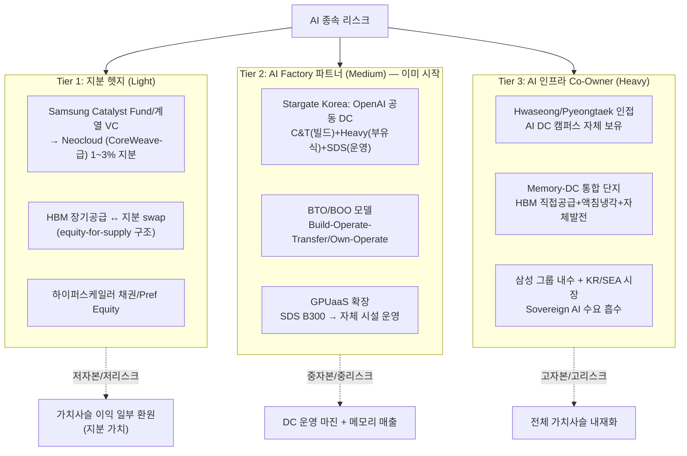

# 현황 분석: SE-3 AI 인프라 수직 진출 (Vertical Ascent)

> **전략 핵심**: AI 가치사슬에서 메모리는 "원재료" 위치 — NVIDIA(영업이익률 60%)·하이퍼스케일러(33%)에 마진이 집중되는 구조. 삼성이 AI 서비스에 락인되면 영업이익 상당 부분을 위에 헌납. 이를 헷지하기 위해 (Tier 1) 지분 투자, (Tier 2) AI Factory 파트너, (Tier 3) 자체 AI DC 캠퍼스 3단계로 가치사슬 상류로 이동.
> **분류**: 사이드벳 (헷지 + 신규 수익원), 시나리오 A·B·D 강화, 시나리오 E 보험

---

## 1. 정량 현황

### AI 가치사슬 마진 분포 — 왜 메모리는 "재료"인가

| 계층 | 대표 기업 | 매출 (FY2025/2026) | 영업이익률 | 가치 포지션 | 출처 / 신뢰도 |
|------|---------|-----------------|-----------|----------|---------|
| **AI 가속기** | NVIDIA Data Center | **$197.3B** (FY26) | **60.4%** | 상위 포식자 | [NVIDIA Q4 FY26](https://nvidianews.nvidia.com/news/nvidia-announces-financial-results-for-fourth-quarter-and-fiscal-2026) · ✅ |
| **하이퍼스케일러 (클라우드)** | AWS | $115B (FY25) | **32.9%** | 상위 포식자 | [theCUBE Cloud Q2 2025](https://thecuberesearch.com/286-breaking-analysis-cloud-quarterly-azures-ai-pop-aws-supply-pinch-google-execution/) · ✅ |
| | Microsoft Azure | ~$100B (FY25) | (Intelligent Cloud +39% YoY) | 상위 포식자 | 동일 출처 · 🔵 |
| | Google Cloud | $48B (FY25) | **32.9%** (전년 17.8%→) | 상위 포식자 | [IndexBox Q1 2026](https://www.indexbox.io/blog/google-cloud-leads-ai-cloud-race-with-63-revenue-growth-outpacing-azure-and-aws/) · ✅ |
| **Neocloud (GPUaaS)** | CoreWeave | $5.1B (2025), 백로그 $55.6B | (적자, 그러나 매출 +170% YoY) | 신규 진입 포식자 | [Sacra](https://sacra.com/c/coreweave/) · ✅ |
| | Neocloud 합계 | $25B (2025) → $180B (2030, 69% CAGR) | — | 빠른 성장 트랙 | [DCD](https://www.datacenterdynamics.com/en/news/neocloud-revenue-exceeds-25bn-in-2025/) · 🔵 |
| **AI 서버 OEM** | Dell | $12.5B AI server (2025) | ~3-5% (전사 수준) | 박리다매 | [IDC via Network World](https://www.networkworld.com/article/4147841/idc-dell-leads-server-market-driven-by-ai-infrastructure-needs.html) · ✅ |
| | Supermicro | $11.7B AI server (2025) | ~10% (가속기 베이스) | 박리다매 | 동일 출처 · ✅ |
| **메모리** | Samsung Memory (현재) | (사이클 의존) | 슈퍼사이클 ~25% / 다운사이클 적자 | **재료 공급자** | 본 프로젝트 분석 · 🔵 |

> **시사점**: NVIDIA 영업이익률 60%, 하이퍼스케일러 33%는 메모리 슈퍼사이클 피크 대비도 **1.3~2.4배**. 메모리 사이클을 넘어 "구조적 마진 차이". 삼성이 AI 서비스 채택 시 이 차이만큼이 클라우드 비용으로 영업이익에서 이탈.

### AI 데이터센터 시장 규모 (수직 진출 시 TAM)

| 지표 | 2025 | 2030 | CAGR | 출처 / 신뢰도 |
|------|------|------|------|------|
| **전 세계 DC 용량** | 103 GW | **200 GW** | 14% | [JLL 2026 Outlook](https://www.jll.com/en-us/insights/market-outlook/data-center-outlook) · ✅ |
| **AI DC 시장 (보수)** | $147B | $811B (2033) | 23.9% | [Grand View Research](https://www.grandviewresearch.com/industry-analysis/ai-data-center-market-report) · 🔵 |
| **AI DC 시장 (공격)** | $344B | $2,024B (2032) | 27.5% | [Markets and Markets](https://www.marketsandmarkets.com/Market-Reports/ai-data-center-market-267395404.html) · 🔵 |
| **AI 서버 시장** | $245B (ABI) / $125B (GVR) | $524B / $854B (2030) | 18~38% | [ABI Research](https://www.abiresearch.com/blog/ai-server-market-size-vendor-shares-and-investment-drivers), [Grand View](https://www.grandviewresearch.com/industry-analysis/ai-server-market-report) · 🔵 |
| **DC 건설비/MW (표준)** | $10.7M | $11.3M+ | 6%/yr | [JLL](https://www.jll.com/en-us/insights/market-outlook/data-center-outlook), [DCD](https://www.datacenterdynamics.com/en/news/building-scale-hyperscalers-aim-build-6m-mw/) · ✅ |
| **DC 건설비/MW (AI 최적화)** | **$20M+** | (상승) | — | [Construct Elements](https://www.constructelements.com/post/cost-to-build-modern-data-center-2026), [JLL](https://www.jll.com/en-us/insights/market-outlook/data-center-outlook) · 🔵 |

### 하이퍼스케일러 Capex — 이들이 수요자

| 기업 | 2025 Capex | 2026 계획 | YoY | 출처 / 신뢰도 |
|------|-----------|----------|-----|------|
| Amazon | $125B | **$200B** | +60% | [Tom's Hardware](https://www.tomshardware.com/tech-industry/big-tech/big-techs-ai-spending-plans-reach-725-billion) · 🔵 |
| Google | $91B | $175~185B | +98% | 동일 출처 · 🔵 |
| Microsoft | $90B | $110~120B | +28% | 동일 출처 · 🔵 |
| Meta | $72B | $115~135B | +74% | 동일 출처 · 🔵 |
| **Big 4 합계** | **$388B** | **$630B (~$725B)** | +62~87% | [datacenterrichness](https://datacenterrichness.substack.com/p/hyperscalers-plan-630-billion-in) · 🔵 |
| AI 인프라 비중 | ~75% ($291B) | ~75% ($450B+) | — | [Visual Capitalist](https://www.visualcapitalist.com/visualized-big-tech-ai-spending/) · 🔵 |

> **시사점**: Big 4의 2026 capex $630B 중 ~$450B가 AI 인프라. 이 중 일부(GPU $200B+, 메모리 $80~100B 추정)만 삼성 메모리 매출로 환원. **나머지 70%(서버 조립/네트워크/시설/전력/운영)는 가치사슬 상류에 누적** — Samsung이 진입 가능한 인접 시장.

### 삼성그룹 내 DC 인접 자산 — 이미 보유한 퍼즐 조각

| 그룹사 | DC 관련 자산 | 현황 | 출처 / 신뢰도 |
|------|-----------|------|------|
| **Samsung C&T (E&C)** | 데이터센터 사업팀, 침지냉각 파일럿 (PUE <1.15), DataBean 협력 | 운영 중 — Hwaseong HPC ($1.13B, 116K servers), HCM City CMC $1B (1단계 30 MW) | [Samsung C&T Newsroom 2025-09](https://news.samsungcnt.com/en/features/engineering-construction/2025-09-building-the-backbone-of-the-ai-era-samsung-cts-data-center-business-team/), [w.media](https://w.media/samsung-ct-cmc-ink-mou-to-build-us1-billion-data-center-in-ho-chi-minh-city/) · ✅ |
| **Samsung SDS** | SCP (Samsung Cloud Platform), GPUaaS (NVIDIA B300), 대구 DC, DBO 신사업 | 매출 13.93조원 (2025), 영업이익 9,571억원, 클라우드 +15.4% (2.68조원) | [Samsung SDS 2025 결산](https://www.samsungsds.com/en/news/financial-260126.html), [Telecompaper](https://www.telecompaper.com/news/samsung-sds-posts-modest-revenue-growth-in-2025--1559951) · ✅ |
| **Samsung Heavy Industries** | 부유식(floating) 데이터센터 — OpenAI Stargate 공동 개발 | 2025-10 LOI 체결, 토지 부족·냉각·탄소 절감 솔루션 | [Samsung Newsroom](https://news.samsung.com/global/samsung-and-openai-announce-strategic-partnership-to-accelerate-advancements-in-global-ai-infrastructure), [DCD](https://www.datacenterdynamics.com/en/news/openai-plans-stargate-data-center-in-south-korea-samsung-electronics-sk-hynix-to-supply-memory-chips/) · ✅ |
| **Samsung Electronics (메모리)** | Hwaseong HPC Center (자체 운영, 1.5조원, 116K servers), 화성/평택 캠퍼스 인근 부지 | 자체 R&D·운영용 + Stargate 한국 DC 공동개발 LOI | [Samsung Newsroom](https://news.samsung.com/global/samsung-and-openai-announce-strategic-partnership-to-accelerate-advancements-in-global-ai-infrastructure) · ✅ |
| **Samsung Catalyst Fund + 계열 VC** | 반도체·인프라 스타트업 투자 풀 | 운영 중 — CoreWeave-급 neocloud 지분 인수 가능 비클 | 추정 · ⚠️ |

> **시사점**: 삼성그룹은 이미 (a) DC 건설 조직(C&T), (b) 클라우드/GPUaaS 사업체(SDS), (c) 부유식 DC R&D(Heavy), (d) 자체 HPC 운영 경험(Electronics)을 **분산 보유**. Stargate Korea LOI(2025-10)는 이를 한 번에 묶을 발판. 부재한 것은 **그룹 차원의 통합 의사결정·P&L·고객 인터페이스**.

### 삼성 반도체 역량 → DC 사업 전이 매트릭스

| 역량 | 메모리 Fab에서 보유 수준 | DC 사업 요구 수준 | 전이 가능성 | 비고 |
|------|----------------------|-------------------|-----------|------|
| **메가프로젝트 실행** | $20B+ fab 6년 빌드 | $1~2B/100MW DC, 2~3년 | **High ✅** | 평택·화성 단지 건설 노하우 직접 적용 |
| **고밀도 전력 인프라** | Fab 1동 ~100MW | AI DC 100~300MW | **High ✅** | UPS·변전·송전 설계 동등 수준 |
| **냉각 엔지니어링** | Cleanroom HVAC + chilled water | Liquid/immersion cooling | **Medium 🔵** | 침지냉각 파일럿(C&T+DataBean) 진행 중 |
| **24/7 가동 문화** | Fab uptime 99.99% | DC SLA 99.999% (Tier IV) | **High ✅** | 운영 KPI 동등 |
| **부지·전력·물 확보** | 한국 5거점 + 美 Taylor | 메가와트급 전력·수자원 입지 선정 | **High ✅** | 정부·지자체 협상력 동급 |
| **공급망 통합** | HBM 생태계 (foundry+packaging+memory) | GPU+CPU+NIC+스토리지+냉각 | **Medium 🔵** | 자체 메모리·foundry 통합 강점, 외부 GPU 의존 |
| **소프트웨어/클라우드 스택** | Fab MES/EDA 한정 | 가상화·k8s·AI 오케스트레이션 | **Low ⚠️** | Samsung SDS 의존 — 인력 갭 큼 |
| **B2B 고객 인터페이스** | 메모리 sales (소수 고객) | DC/Cloud sales (다수 엔터프라이즈) | **Low ⚠️** | SDS B2B 영업망 활용 필요 |
| **장기 투자 자본** | 현금 $63B | DC capex 회수 7~10년 | **High ✅** | RS-5 재무 규율 자산 활용 가능 |

> **결론**: 물리 인프라 영역(전력·냉각·건설·운영)은 **현 역량으로 직접 진입 가능**. 소프트웨어 스택과 고객 인터페이스는 **Samsung SDS 의존 + 외부 파트너십 필수**. 따라서 진입 모델은 "fab-style 인프라 사업자" — 코로케이션/AI Factory 모델이 자연스럽고, 풀스택 클라우드(AWS 모방)는 비현실적.

---

## 2. 정성 현황 (SWOT)

| | 내용 |
|---|---|
| **강점 (S)** | (1) 메가프로젝트 실행력 — fab 6년 빌드 노하우는 100MW DC 2년 빌드보다 난이도 높음. (2) 그룹 내 DC 인접 자산 4개 보유 — C&T(빌드), SDS(클라우드), Heavy(부유식), Electronics(HPC). (3) Stargate Korea LOI(2025-10) — OpenAI 공동개발 발판 확보. (4) 현금 $63B + RS-5 재무 규율 — 단계적 진입 자본 자산. (5) HBM 공급 협상력 — equity-for-supply swap 구조 가능. |
| **약점 (W)** | (1) 그룹사 분산 — C&T·SDS·Heavy·Electronics 통합 P&L·의사결정 부재. 별도 TF 신설 없이 **Stargate Korea 컨소시엄 자체**가 거버넌스 단위가 되도록 운영 협약·이익 분배 구조 설계 필요. (2) 클라우드 SW 스택 인력 갭 — 하이퍼스케일러 대비 1/100 수준 추정. (3) DC 사업 경험 — 한국 외 운영 트랙레코드 부족 (CMC HCM 1단계 30MW가 첫 해외 케이스). (4) 고객 충돌 우려 — NVIDIA·하이퍼스케일러 자체가 메모리 大고객인데, DC 사업으로 경쟁 시 보복 리스크. (5) ESG·전력 — 한국 전력망 제약 → 대형 DC 입지 한정. |
| **기회 (O)** | (1) AI DC 시장 $147B → $811B (2033, 24% CAGR) — TAM 5배. (2) Big 4 capex $630B (2026), 75%가 AI 인프라 — 자본이 시장에 흘러 들어옴. (3) Neocloud $25B → $180B (2030, 69% CAGR) — 메모리 vendor가 지분 진입할 신생 트랙. (4) Stargate $500B 프로젝트 — 한국·동남아 capacity 평가 진행 중. (5) 부유식 DC 차별화 — 토지·냉각·탄소 솔루션 (Samsung Heavy 독점적 IP). (6) HBM-for-equity swap — 공급 우선권을 지분으로 전환. |
| **위협 (T)** | (1) **고객 카니발리제이션** — AWS·Azure가 Samsung을 "DC 경쟁자"로 인식하면 메모리 발주 축소. (2) **자본 분산 리스크** — 메모리 capex와 DC capex 동시 진행 시 RS-5 (다운사이클 capex 하한) 위반 가능. (3) **운영 인력 부족** — 클라우드 SRE/SW 엔지니어 채용 경쟁 (구글·MS와). (4) **지정학** — 美中 갈등 심화 시 동서 DC 분리 (MB-2와 동일 압력). (5) **하이퍼스케일러 자체 칩 + 자체 DC** — Trainium·TPU·MI 가속 시 NVIDIA 가치 재분배 가능 → 삼성이 NVIDIA 대신 하이퍼스케일러와 직접 경합. |

### 외부 평가

- **OpenAI**: Samsung C&T+Heavy+SDS와 "한국 DC capacity 확대 평가" 공식 발표 ([Samsung Newsroom 2025-10](https://news.samsung.com/global/samsung-and-openai-announce-strategic-partnership-to-accelerate-advancements-in-global-ai-infrastructure))
- **Samsung C&T**: AI 시대 백본으로 데이터센터 사업 핵심 정조준 — 침지냉각·연료전지 발전 솔루션 ([Samsung C&T 2025-09](https://news.samsungcnt.com/en/features/engineering-construction/2025-09-building-the-backbone-of-the-ai-era-samsung-cts-data-center-business-team/))
- **JLL**: AI DC capex 6%/yr 상승, 입지·전력·냉각이 진입 장벽 — Samsung 보유 자원과 정확히 일치 ([JLL](https://www.jll.com/en-us/insights/market-outlook/data-center-outlook))
- **CoreWeave 사례**: 매출 +170% YoY, 백로그 $55.6B (10년치) — 메모리 vendor가 장기 공급 대신 지분 받았으면 가치 향상 가능 ([Sacra](https://sacra.com/c/coreweave/))

---

## 3. 우리의 현재 위치 평가

### 어디에 있는가

- **메모리 매출 비중**: 100% — AI 가치사슬에서 "재료 공급자" 위치 고착
- **DC 인접 자산 통합도**: ⚠️ 분산 — Stargate Korea LOI는 그룹 통합의 첫 시그널 (2025-10)
- **그룹 차원 P&L·의사결정**: ⚠️ 부재 — DC 통합 사업체 미설립
- **외부 가시성**: 🔵 부분 — C&T·SDS·Heavy 각각의 보도자료, 통합 비전 IR 미공개

### 3-Tier 헷지 전략 (단계적 진입)

### Tier별 액션·자본·KPI

| Tier | 핵심 액션 | 자본 (5년 누계) | 리스크 | 주요 KPI |
|------|---------|-------------|--------|---------|
| **Tier 1: 지분 헷지** | (a) Catalyst Fund로 CoreWeave-급 neocloud 1~3% 지분 (b) HBM 장기공급 → equity-for-supply swap (c) 하이퍼스케일러 pref equity | $5~10B | 낮음 — 운영 부담 없음 | 지분 IRR 15%+, AI 가치사슬 이익 환수율 5%+ |
| **Tier 2: AI Factory 파트너** | (a) Stargate Korea 본 계약 — C&T+Heavy+SDS 통합 컨소시엄 (b) Floating DC 상용화 (Heavy 독점 IP) (c) BTO/BOO 모델로 OpenAI/Anthropic/xAI에 KR·SEA capacity 공급 (d) Samsung SDS GPUaaS를 자체 시설로 확장 | $15~25B | 중 — 고객 충돌 가능 (하이퍼스케일러) | DC 운영 매출 $5B (2030), C&T 신규 수주 $10B/yr, SDS 클라우드 5조원+ |
| **Tier 3: AI 인프라 Co-Owner** | (a) 화성/평택 메모리 fab 인접 100~300MW AI DC 캠퍼스 (b) HBM 직공급 + 액침냉각 + 자체 LNG/연료전지 (c) Sovereign AI(KR 정부·SEA·중동) 시장 자체 운영 | $20~40B | 높음 — 메모리 capex와 충돌, 카니발리제이션 | 자체 DC 200MW (2030), Sovereign AI 매출 $3B (2032), 그룹 통합 P&L 분리 |

### 시나리오별 Tier 우선순위

| 시나리오 (확률) | 주력 Tier | 이유 |
|----|----|----|
| **A: 동맹 강세 + AI 폭발** (20%) | Tier 2 강력, Tier 3 일부 | 자본 풍부, 고객·파트너 우호 — 한 번에 본격 진입 |
| **B: 분절 + AI 폭발** (25%) | Tier 2 (한국·동남아 집중) | 동서 분리로 신뢰 가능한 한국·SEA capacity 가치 상승, 미주는 Tier 1 |
| **C: AI 둔화** (15%) | Tier 1만 유지 | DC TAM 축소, 자본 보수 운영, 옵션 가치만 보존 |
| **D: 변동성** (25%) | Tier 1 + Tier 2 (자본 분담) | 파트너/SI와 JV로 capex 공유, 단일 베팅 회피 |
| **E: 패러다임 재편** (15%) | Tier 3 검토 | 메모리 자체 가치 흔들릴 때, DC 운영 사업이 "포식자 진입" 보험 |

### 다음 마일스톤

| 시점 | 이벤트 | 의미 |
|------|------|------|
| 2026 H1 | **Stargate Korea 컨소시엄 운영 협약** (Electronics·C&T·SDS·Heavy 4사 간 사업 분담·이익 분배 합의) | SE-3 작동 기반 — 별도 TF 없이 컨소시엄 거버넌스로 분산 자산 통합 |
| 2026 H1 | Stargate Korea 본 계약 (LOI → DA) | Tier 2 본격 시작 |
| 2026 H2 | Catalyst Fund/계열 VC를 통한 첫 neocloud 지분 인수 | Tier 1 시그널 — equity-for-supply 구조 확립 |
| 2027 | 첫 BTO/BOO 컨소시엄 수주 — OpenAI 또는 Anthropic 한국 capacity | Tier 2 매출 인식 시작 |
| 2027~2028 | Floating DC 1호 상용 (Heavy + C&T) | 차별화 기술 검증 |
| 2028 | 그룹 AI 인프라 사업 P&L 분리 공시 (SD-1과 병행) | 외부 평가 가시성 — IR 메시지 |
| 2029~2030 | Hwaseong/Pyeongtaek 인접 자체 AI DC 캠퍼스 1단계 (50~100MW) | Tier 3 진입 — 메모리 fab 시너지 |
| 2030 | 그룹 AI 인프라 매출 합계 $5B+, 영업이익률 25%+ | SE-3 KPI 달성 |
| 2032 | Sovereign AI 시장 (KR·SEA·중동) 자체 운영 매출 $3B+ | 메모리 사이클 의존도 완화 |

### 핵심 의사결정 노드 (Trigger)

1. **2026 Stargate Korea 본계약 체결 여부** — Tier 2 진입 가/부 결정. 결렬 시 Tier 1만 유지.
2. **하이퍼스케일러 메모리 발주 반응** — 카니발리제이션 신호 발생 시 Tier 2 속도 조절, Tier 1 비중 확대.
3. **CoreWeave-급 neocloud 밸류에이션 (2026~2027)** — Tier 1 진입 시점 결정. 거품 신호 시 보수.
4. **메모리 슈퍼사이클 종료 시점 (~2027~2028)** — 다운사이클에서 Tier 3 capex 가능 여부, RS-5와 충돌 점검.

### 신뢰도 한계

- 그룹 통합 AI 인프라 TF는 strategy.md 내부 — 외부 미공개 ⚠️.
- CoreWeave-급 neocloud 지분 1~3% 인수, $5~10B 자본 등 수치는 **자체 추정** — 실제 협상 가격에 따라 변동.
- "고객 카니발리제이션 리스크"는 정성적 — AWS·MS·Google이 Samsung을 DC 경쟁자로 인식할지는 LOI·계약 단계에서 검증 필요.
- 한국 전력망 제약·지자체 인허가는 본 분석 외 — RS-5/MB-2 재검토 필요.

---

## 4. 다른 전략과의 연계

| 연계 전략 | 관계 | 영향 |
|---------|------|------|
| **MB-4 커스텀 AI 메모리** | 보완 | 자체 DC 캠퍼스에 커스텀 HBM 우선 공급 — feedback loop 단축 |
| **RS-3 고객특화·전환비용** | 보완 | NVIDIA·하이퍼스케일러 외 OpenAI·Anthropic·neocloud 고객 다변화 |
| **RS-5 재무 규율** | **충돌 가능** | DC capex가 RS-5 다운사이클 하한 정책과 경합 — 상호 조율 필수 |
| **SD-1 HBM P&L 분리** | 시너지 | "AI 인프라 P&L 분리"와 동일 패턴 — IR 메시지 일관성 |
| **SE-2 CXL 표준 주도** | 보완 | 자체 DC가 CXL 4.0 multi-rack 첫 도입 사이트가 됨 — 표준 검증 가속 |
| **MB-2 동서 균형 공급망** | 보완 | DC 캠퍼스도 동서 분리 — KR·SEA(서) + Taylor(동) 양립 |

---

## 5. 출처

### 시장·하이퍼스케일러
- [JLL 2026 Global Data Center Outlook](https://www.jll.com/en-us/insights/market-outlook/data-center-outlook)
- [Grand View Research — AI Data Center Market](https://www.grandviewresearch.com/industry-analysis/ai-data-center-market-report)
- [Markets and Markets — AI Data Center Market 2026-2032](https://www.marketsandmarkets.com/Market-Reports/ai-data-center-market-267395404.html)
- [DCD — Hyperscalers $6m per MW](https://www.datacenterdynamics.com/en/news/building-scale-hyperscalers-aim-build-6m-mw/)
- [Construct Elements — Modern DC Cost 2026](https://www.constructelements.com/post/cost-to-build-modern-data-center-2026)
- [Tom's Hardware — Big Tech $725B Capex 2026](https://www.tomshardware.com/tech-industry/big-tech/big-techs-ai-spending-plans-reach-725-billion)
- [Visual Capitalist — Big Tech AI Spending 2022-2025](https://www.visualcapitalist.com/visualized-big-tech-ai-spending/)
- [Datacenterrichness — Hyperscalers $630B 2026](https://datacenterrichness.substack.com/p/hyperscalers-plan-630-billion-in)
- [theCUBE Research — Cloud Quarterly Q2 2025](https://thecuberesearch.com/286-breaking-analysis-cloud-quarterly-azures-ai-pop-aws-supply-pinch-google-execution/)
- [IndexBox — Google Cloud Q1 2026](https://www.indexbox.io/blog/google-cloud-leads-ai-cloud-race-with-63-revenue-growth-outpacing-azure-and-aws/)

### NVIDIA / 서버 / Neocloud
- [NVIDIA Q4 FY26 Results](https://nvidianews.nvidia.com/news/nvidia-announces-financial-results-for-fourth-quarter-and-fiscal-2026)
- [NVIDIA Profit Margins — Macrotrends](https://www.macrotrends.net/stocks/charts/NVDA/nvidia/profit-margins)
- [Network World — IDC Server Market 2025](https://www.networkworld.com/article/4147841/idc-dell-leads-server-market-driven-by-ai-infrastructure-needs.html)
- [ABI Research — AI Server Market](https://www.abiresearch.com/blog/ai-server-market-size-vendor-shares-and-investment-drivers)
- [Grand View — AI Server Market](https://www.grandviewresearch.com/industry-analysis/ai-server-market-report)
- [Sacra — CoreWeave Profile](https://sacra.com/c/coreweave/)
- [DCD — Neocloud Revenue >$25B 2025](https://www.datacenterdynamics.com/en/news/neocloud-revenue-exceeds-25bn-in-2025/)
- [ABI Research — Leading Neocloud Companies](https://www.abiresearch.com/blog/leading-neocloud-companies)

### Samsung 그룹 자산
- [Samsung C&T — Building the Backbone of the AI Era](https://news.samsungcnt.com/en/features/engineering-construction/2025-09-building-the-backbone-of-the-ai-era-samsung-cts-data-center-business-team/)
- [Samsung-OpenAI Strategic Partnership 2025-10](https://news.samsung.com/global/samsung-and-openai-announce-strategic-partnership-to-accelerate-advancements-in-global-ai-infrastructure)
- [OpenAI — Samsung & SK Join Stargate](https://openai.com/index/samsung-and-sk-join-stargate/)
- [DCD — OpenAI Stargate Korea](https://www.datacenterdynamics.com/en/news/openai-plans-stargate-data-center-in-south-korea-samsung-electronics-sk-hynix-to-supply-memory-chips/)
- [Samsung SDS 2025 Annual Results](https://www.samsungsds.com/en/news/financial-260126.html)
- [Telecompaper — Samsung SDS 2025](https://www.telecompaper.com/news/samsung-sds-posts-modest-revenue-growth-in-2025--1559951)
- [w.media — Samsung C&T CMC HCM City $1B](https://w.media/samsung-ct-cmc-ink-mou-to-build-us1-billion-data-center-in-ho-chi-minh-city/)
- [TechCrunch — OpenAI Samsung SK Stargate](https://techcrunch.com/2025/10/01/openai-ropes-in-samsung-sk-hynix-to-source-memory-chips-for-stargate/)

### 내부 자료
- [wiki/scenarios/strategy.md](../../scenarios/strategy.md)
- [current-state-rs5-financial-discipline.md](current-state-rs5-financial-discipline.md) — RS-5 자본 충돌 점검
- [wiki/strategies/core/current-state-mb2-east-west-supply.md](current-state-mb2-east-west-supply.md) — MB-2 동서 분리 패턴
- [wiki/strategies/core/current-state-se2-cxl-sig-leadership.md](current-state-se2-cxl-sig-leadership.md) — SE-2 표준 시너지
