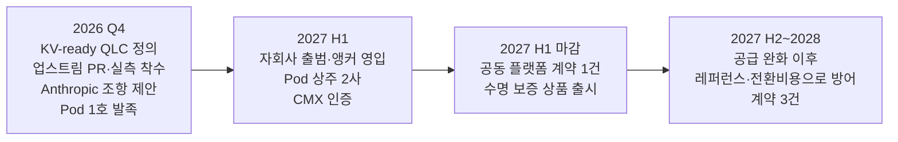

# QLC 추론 캐시 티어 실행 전략 — 인사·조직·문화·전략·재무 5축과 고객 협업 제안

> **한 줄 요약**: Phase 1·2·3 역량([qlc-workload-capability-phases.md](qlc-workload-capability-phases.md))은 엔지니어 개인의 노력으로 쌓이지 않는다. 경쟁사는 이미 조직으로 답했다. SK hynix는 실리콘밸리에 $10B 캐피털콜 "AI Company"를 세웠고, Micron은 Anthropic과 SSD 공동 설계·공급·자본을 한 계약에 묶었으며, Astera Labs는 KV cache 스타트업(Pliops) 팀을 약 $70M에 흡수했다. 삼성의 답은 **① 실리콘밸리 추론 스토리지 자회사(별도 보상·지분·미주 현지 채용), ② 고객 상주 co-design 조직과 고객 시스템을 아는 시스템 소프트웨어 전문가의 채용·양성, ③ 오픈소스 생태계를 주도하는 문화, ④ "수명 보증 + TCO 연동" 계약 상품, ⑤ 고객·생태계 지분 참여**를 한 묶음으로 실행하고, 공급자 우위가 남은 2027년 상반기까지 고객에게 워크로드·스펙 접근권을 계약으로 확보하는 것이다.

> **투자 상한 없음, 가성비 기준** (사용자 결정 2026-09-17, [prompt-qlc-ssd-strategy.md](../../sources/prompt/prompt-qlc-ssd-strategy.md) 피드백 8). 각 안에 규모·선례·회수 시계를 붙이고 즉시(90일)·1년·3년 3티어로 배열한다. 사내 수치는 `[사내 확인]`.
>
> **재점검 (2026-09-17 2차 피드백)**: 실행 전략의 초점을 **두 목표**로 좁혔다. ① 고객의 워크로드를 공유받는다(트레이스·KV 수명 정책·레퍼런스 스펙 자리). ② 고객 시스템 안으로 들어가 함께 설계한다(상주 엔지니어·업스트림 코드·공용 TCO 모델). 다섯 축(전략·조직·인사·문화·재무)은 이 두 목표를 여는 수단이다. 스타트업 팀 인수(ScaleFlux acqui-hire)는 선택지에서 제외했다: 목표는 팀을 사는 것이 아니라 고객 시스템 안에 우리 사람이 들어가는 것이다.
>
> **재점검 (2026-09-17 3차 피드백)**: 문화 축을 "업스트림 우선"에서 **오픈소스 생태계를 주도하는 기업 문화**로 격상했다(기여자 → 메인테이너·프로젝트 운영자). 인사 축에는 **고객의 시스템을 잘 이해하는 시스템 소프트웨어 전문가의 채용·양성으로 해당 조직을 강화**하는 것과 **미주 고객 협업을 위한 현지 채용 증대**를 명시했다. 두 목표(워크로드를 받는다·들어간다)를 실제로 수행할 사람이 누구이고 어디에 있어야 하는가에 대한 답이다.

---

## 1. 왜 "하던 대로"는 안 되는가

| 하던 대로 | 왜 안 되나 | 근거 |
|---|---|---|
| 고객 스펙을 받아 정확히 납품 | 캐시 티어의 스펙(수명·재사용·무효화 정책)은 고객 캐시 관리자 안에 있고 RFQ에 안 적힌다 | ②계층 README에 배치·내구성 언급 0 ✅ ([kv-cache-qlc-tech-stack-vendor-capability-2026-09.md](../../sources/articles/kv-cache-qlc-tech-stack-vendor-capability-2026-09.md) §1) |
| 펌웨어 엔지니어가 호스트 SW를 "겸업" | 커널·파일시스템·추론 엔진·캐시 관리자 4개 커뮤니티의 메인테이너 문법은 겸업으로 얻어지지 않는다 | FlexKV·CacheLib 메인라인 머지가 co-design의 증거 ✅ |
| 국내 보상 체계로 실리콘밸리 채용 | 삼성 SV L6 TC $392K vs NVIDIA IC6 $626K·Meta E6 $708K·Google L6 $700K, 격차 1.5~1.8배, 원인은 주식 부재 | levels.fyi 🟡 ([execution-benchmarks-sw-capability-customer-collab-2026-09.md](../../sources/articles/execution-benchmarks-sw-capability-customer-collab-2026-09.md) §3.1) |
| 오픈소스는 연구소 취미 | Intel OTC는 사업 철수와 함께 소멸했고, 제품 로드맵에 묶인 Kioxia AiSAQ·Huawei UCM은 남았다 | 같은 소스 §1 |
| 물량 계약만 체결 | Micron↔Anthropic은 공동 설계·운영 통합·자본까지 묶었고, 삼성·SK↔Anthropic 계약에는 공동 최적화 문구가 없다 | 같은 소스 §4 🟡 |
| 성능으로 채택을 가른다 | "성능은 시스템 계층이 흡수한다. 상쇄 불가한 축은 파워·원가·품질" | 송용호 인터뷰 ([song-yongho-ax-pi-interview-2026-09-03.md](../../sources/raw-notes/song-yongho-ax-pi-interview-2026-09-03.md)) |

## 2. 5축 실행 전략

### 2.0 두 목표 — 워크로드가 오고, 우리가 들어간다

| 목표 | 무엇을 얻나 | 어떻게 여나 | 성공 신호 |
|---|---|---|---|
| **① 워크로드를 받는다** | KV 블록 트레이스(세션·prefix·재사용·무효화), 캐시 관리자의 수명 정책, 레퍼런스 스펙에 삼성 구현이 기본값으로 앉는 자리, 활성화 약정 | 공급 부족기의 다년 물량·가격 확약과 교환, 계약된 접근권으로 고정(공동 플랫폼 계약), 수명 보증·NRE 흡수로 고객 리스크를 우리가 부담 | 트레이스 기반 워크로드 프로파일 3종, WAF·유효 DWPD 실측 공개 |
| **② 고객 시스템 안으로 들어간다** | 캐시 관리자·I/O 경로·커널에 우리 코드가 메인라인으로, 고객 아키텍트 옆에 우리 엔지니어가 상주, 공용 TCO 모델로 스펙 상류 대화 | Co-Design Pod(FDE) 상주, 업스트림 우선 문화, 실리콘밸리 자회사의 별도 보상, 시스템 아키텍트 조직 | 메인라인 머지 건수, Pod 상주 고객 수, 공동 플랫폼 계약 |

두 목표는 서로를 강화한다. 워크로드가 와야 최적화할 수 있고, 안에 들어가야 워크로드가 온다. 그래서 첫 계약은 "들어갈 권리"와 "받을 권리"를 함께 담아야 한다.

**두 목표의 선례와 파급** (2026-09-17 3차 피드백 반영):
- **② 들어간다 = FDE(Forward Deployed Engineer)**. 고객사 파견 엔지니어를 FDE로 명명한다. Palantir가 10여 년 전 창안한 역할(내부 코드명 Delta)로, 고객 환경 내부에 상주하며 실제 운영 제약 아래서 프로덕션 시스템을 직접 구축하고 청구 시간이 아니라 성과(outcome)로 평가받는다. "명시적 요구 vs 실제 요구"의 간극을 현장에서 코드로 메우고, 특정 고객용 거친 해법(gravel road)이 제품 표준 기능(paved highway)으로 포장되는 피드백 루프를 만든다. 파급: 고객 락인의 동력이자 640% 주가 수익률의 원천으로 회자되며, Anthropic·OpenAI가 엔터프라이즈 GTM 전략으로 채택했다(OpenAI는 2025년 초 FDE 팀 2명 → 10명+) ([palantir-fde-model-2026-07.md](../../sources/articles/palantir-fde-model-2026-07.md)). 메모리는 제조 리드타임이 길어 FDE에 시스템 아키텍트·TCO 모델링 역량을 결합한다.
- **① 받는다 = 전략적 협약(SCA)**. 워크로드 공유는 개별 NDA가 아니라 공동 설계·다년 공급·운영 통합·자본을 한 계약에 묶는 전략적 협약으로 확보한다. 선례는 Micron↔Anthropic(2026-06-22): Micron의 HBM·DRAM·데이터센터 SSD를 Claude 학습·추론 워크로드에 맞춰 공동 설계·최적화("메모리·스토리지 서브시스템 설계와 최적화에 대한 공동 작업") + 다년 공급 + Claude 사내 배치 + Series H 지분. Micron은 SCA 16건·최소 계약매출 약 $100B·예치금 $22B를 공시했고 발표 후 주가는 사상 최고가를 경신했다 ([micron-anthropic-sca-2026-06-22.md](../../sources/articles/micron-anthropic-sca-2026-06-22.md), [micron-q3-fy26.md](../../sources/filings/micron-q3-fy26.md)). 삼성·SK의 Anthropic 공급계약에는 공동 설계 조항이 없으므로 우리가 먼저 제안한다.

### 2.1 전략 축 — 하나의 베팅, 세 개의 순서

- **베팅**: "QLC로 추론 캐시 티어를 가져간다." 니어라인 HDD 대체는 들어가지 않는다(공급 부족 3~5년, 커머디티 경쟁, 접점 부재). 모델상 이 티어는 2030년 350EB(전 미디어)이고 QLC 침투 50%가 조건부 상방이다 ([qlc-ssd-market.md](../concepts/qlc-ssd-market.md) §4).
- **순서**: Phase 1 "KV-ready QLC"(RUH 200+·수명 보증 조건표) → Phase 2 등대 고객 1~2사와 워크로드 프로파일·WAF 실측 공개(업계 최초) → Phase 3 공동 플랫폼 계약(공급+공동 최적화+수명 보증+자본).
- **시계**: 공급자 우위는 2027년 하반기 공급 완화 전까지. 워크로드·스펙 접근권을 계약으로 고정할 창은 **2026년 4분기부터 2027년 상반기**다 ([qlc-essd-market-size-forecast-data-2026-09.md](../../sources/articles/qlc-essd-market-size-forecast-data-2026-09.md) §3.1).
- **경계**: 오케스트레이션(Dynamo·LMCache·Mooncake) 자체를 만들지 않는다. 그 아래의 기본 백엔드·디바이스·통합 서비스가 자리다 ([kv-cache-ssd-offload-ecosystem-2026-08.md](../../sources/articles/kv-cache-ssd-offload-ecosystem-2026-08.md) §3).

### 2.2 조직 축 — 세 개의 새 조직, 하나의 기존 조직

| 조직 | 형태 | 역할 | 선례·규모 |
|---|---|---|---|
| **추론 스토리지 소프트웨어 자회사(실리콘밸리)** | Memory Solutions Lab을 모체로 별도 법인화, 자체 CEO·보상·지분, **인력의 다수를 미주 현지 채용** | ③④계층 업스트림 팀, 캐시 관리자 플러그인, 프로파일러·에뮬레이터 제품화, 고객 상주 엔지니어(FDE)의 홈, **시스템 소프트웨어 전문가 조직의 본거지** | SK hynix AI Company(2026-01, ≥$10B 캐피털콜), Solidigm(독립 자회사, 공동 CEO 본사+현지) ✅ |
| **Co-Design Pod(고객 상주)** | 고객 1사당 3~5명, 홈 조직은 자회사, 평가는 outcome | 명시 요구와 실제 요구의 간극을 현장에서 해소, 메인라인 머지·활성화 용량 책임 | Palantir FDE, NVIDIA DevTech/SA ([dev-org-transformation.md](dev-org-transformation.md) §4.5) |
| **시스템 아키텍트·TCO 모델링 조직** | 본사·자회사 겸속, 외부 채용 + 내부 육성 | 디바이스→랙→DC 캐시 티어 TCO 모델, 고객 공용 시뮬레이션 자산 | Micron↔Anthropic "token economics" 공동 분석 🟡 |
| **데이터센터 SSD 개발 조직(기존)** | 유지 | Phase 1 KV-ready QLC 제품·펌웨어(RUH 200+)·수명 보증 텔레메트리 | 세 번의 전환을 만든 기존 강점 ([fdp-host-ssd-platform.md](fdp-host-ssd-platform.md) §2.5) |

**강화할 조직은 시스템 소프트웨어 조직이다.** 삼성은 배치 표준 오픈소스 자산(xNVMe·CacheLib 배치 표준 지원·XFS write streams·GOST 기여)이 5사 중 가장 두텁지만 KV cache 스택(추론 엔진·캐시 관리자·I/O)에 연결한 공개물이 없고, 캐시 관리자 4종 저장소에 삼성 기여 흔적이 없다 ([kv-cache-qlc-tech-stack-vendor-capability-2026-09.md](../../sources/articles/kv-cache-qlc-tech-stack-vendor-capability-2026-09.md) §3·§4). 디바이스 조직은 세 번의 전환을 만든 강점이 있으므로 유지·집중하고, 부족한 것은 **고객의 시스템을 읽고 고칠 수 있는 시스템 소프트웨어 전문가**다. 자회사·Co-Design Pod·TCO 조직 모두 이 전문가 풀에서 사람을 끌어 쓰므로, 조직 강화의 순서는 (1) 시스템 SW 직무 정의를 고객 시스템 기준으로 다시 쓰고 (2) 미주 현지 채용으로 풀을 키우고 (3) 내부 펌웨어·FTL 인력을 전환 트랙으로 합류시키는 것이다(§2.3).

거버넌스: 자회사는 본사 SSD 로드맵과 **동일 P&L 지표(캐시 티어 QLC 활성화 EB)** 로 묶는다. Intel OTC의 실패(사업과 분리된 오픈소스)와 WD Tegile의 실패(채널 충돌)를 피하려면 자회사는 SSD 판매의 도구이지 별개 사업이 아니다.

### 2.3 인사 축 — 고객 시스템을 아는 사람을 미주 현지에서 뽑고, 안에서 기른다

핵심은 **고객의 시스템을 잘 이해하는 시스템 소프트웨어 전문가**를 채용·양성해 해당 조직을 강화하는 것이고, 그 채용의 무게중심은 **미주 현지**다. 여섯 장치를 한 묶음으로 쓴다.

1. **시스템 소프트웨어 전문가 채용 — 기준은 "고객 시스템을 아는가"**: 채용 기준을 SSD 지식이 아니라 고객 시스템 이해로 둔다. 추론 엔진(vLLM·SGLang·TensorRT-LLM)의 커넥터·스케줄러, KV 캐시 관리자(Dynamo KVBM·LMCache·Mooncake·FlexKV)의 퇴거·빈도 정책, I/O 라이브러리(NIXL·GDS·io_uring·xNVMe)와 커널 블록·XFS 경로를 **읽고 고쳐 본 사람**이 대상이다. 표적은 커널 블록·XFS write streams 메인테이너, LMCache·FlexKV·Mooncake 커미터, 하이퍼스케일러 스토리지팀·NVIDIA DevTech 출신 ([dev-org-transformation.md](dev-org-transformation.md) §4.6). 현재 MSL(San Jose)의 공개 채용은 "Sr. Storage Software Engineer" 수준으로 KV cache·캐시 관리자 언급이 확인되지 않으므로 ([kv-cache-qlc-tech-stack-vendor-capability-2026-09.md](../../sources/articles/kv-cache-qlc-tech-stack-vendor-capability-2026-09.md) §5 조직 신호), 직무 정의서를 고객 시스템(캐시 관리자·I/O·커널) 기준으로 다시 쓰는 것이 첫 행동이다. 이 전문가 풀이 자회사·Co-Design Pod·TCO 조직의 공통 원천이다.
2. **미주 현지 채용 증대 — 고객 협업은 고객이 있는 시간대에서**: 대상 고객(NVIDIA·Meta·OpenAI·Anthropic·Google·Microsoft·AWS)의 추론 스택 팀과 캐시 관리자 커미터의 다수가 미국에 있고, FDE 상주·업스트림 리뷰·SNIA/OCP 워킹그룹은 같은 시간대·같은 언어에서 돌아간다. 본사 파견만으로는 로테이션 주기마다 관계와 맥락이 끊긴다. 자회사 정원의 **다수(목표 70% 이상 `[사내 확인]`)를 현지 채용**으로 채우고 본사 로테이션은 양성 목적으로 한정한다. 거점은 이미 있다(Samsung Semiconductor US MSL, San Jose — 시스템 SW·오픈소스 미션, [execution-benchmarks-sw-capability-customer-collab-2026-09.md](../../sources/articles/execution-benchmarks-sw-capability-customer-collab-2026-09.md) §2). 선례는 Solidigm의 공동 CEO(본사+현지) 체제와 SK hynix AI Company의 실리콘밸리 법인이다(같은 소스 §4). 현지 채용이 시장가에 미달하면 성립하지 않으므로 4번(별도 보상)이 전제다.
3. **내부 양성 트랙 — 펌웨어·FTL 엔지니어의 호스트 SW 전환**: 6~12개월 미국 로테이션 + 현지 멘토 페어링. 커리큘럼은 고객 스택 코드 리딩(vLLM·LMCache·Mooncake·io_uring·XFS) → 트레이스 기반 실측 프로젝트 → **업스트림 PR 1건 이상 머지를 수료 조건**으로 한다. 미디어 모델링 강점이 호스트 SW와 만나는 브리지 인력이 가장 희소하고, 이 트랙만이 그것을 만든다. 업스트림 기여를 평가에 반영한다.
4. **별도 보상 체계**: 자회사 지분·RSU형 장기 보상으로 실리콘밸리 시니어 시장가(TC $600~700K대)에 맞춘다. 삼성 SV 소프트웨어 엔지니어 중위 TC $226K(L6 $392K)와 빅테크 시니어+의 1.5~1.8배 격차는 주식 부재가 원인이다. SK hynix는 성과급 일부를 자사주로 지급(2026년 누적 410,807주·12,064명)했고 ADR 상장으로 미국 주식 통화를 확보했다. 삼성 국내는 메모리 인당 약 6억 원 특별성과급으로 상향 리셋돼 사내 형평 마찰이 과거보다 작다 ([execution-benchmarks-sw-capability-customer-collab-2026-09.md](../../sources/articles/execution-benchmarks-sw-capability-customer-collab-2026-09.md) §3.1·§3.2).
5. **고객·생태계 출신 앵커 + 상주 로테이션**: 하이퍼스케일러 스토리지팀·NVIDIA DevTech·캐시 관리자 커미터 출신을 Co-Design Pod(FDE) 앵커로 영입하고(미국 고객과 영어로 대등하게 토론할 앵커 5명 이상), 본사 펌웨어·FTL 엔지니어를 고객 상주로 6~12개월 로테이션한다. 스타트업 팀 인수(ScaleFlux acqui-hire)는 선택지에서 제외한다(사용자 결정 2026-09-17): 목표는 팀을 사는 것이 아니라 고객 시스템 안에 우리 사람이 들어가는 것이다. 시장 기준가만 참고로 남긴다(Astera↔Pliops 약 $70M/60명, 같은 소스 §2). Tensormesh(LMCache)는 NVIDIA·AMD·CoreWeave가 이미 지분을 가져 공동 투자·기여가 현실적이다.
6. **호명되는 전문가 트랙**: 마스터 제도(연 10명 규모)와 별개로 미국 고객이 인식하는 Distinguished Engineer/Fellow 직함, 논문·업스트림·표준 발표를 KPI에 넣어 "삼성의 그 아키텍트"를 만든다. CacheLib 논문 저자군이 원형이다.

### 2.4 문화 축 — 오픈소스 생태계를 주도하고, 결과로 평가

- **오픈소스 생태계를 주도하는 기업 문화**: 기여자(contributor)에서 **주도자(maintainer·프로젝트 운영자)** 로 올라간다. 삼성은 배치 표준 오픈소스 자산이 5사 중 가장 두텁고(xNVMe를 직접 개발, CacheLib 배치 표준 지원을 업스트림 머지·대규모 배포하고 EuroSys'25 논문으로 공개, XFS write streams·fio·SPDK 기여) 이미 가장 강한 co-design 실적을 가졌지만, 그것이 KV cache 스택으로 이어지지 않았다 ([execution-benchmarks-sw-capability-customer-collab-2026-09.md](../../sources/articles/execution-benchmarks-sw-capability-customer-collab-2026-09.md) §1·§2, [kv-cache-qlc-tech-stack-vendor-capability-2026-09.md](../../sources/articles/kv-cache-qlc-tech-stack-vendor-capability-2026-09.md) §4). 자산이 가장 두터운 곳이 주도권을 가져야 한다. 구체적으로 ① **우리가 시작·운영하는 레퍼런스 프로젝트**(KV cache 오프로드용 배치 표준 저장 백엔드: 캐시 관리자 4종 공용 플러그인 + 트레이스·실측 도구)를 공개 저장소로 열고 외부 기여를 받는다, ② LMCache·Mooncake·FlexKV·커널 블록/XFS·xNVMe에 **메인테이너·커미터를 배출**한다(프로젝트당 2명 이상, 조직 KPI), ③ SNIA SDC StorageAI·OCP 워킹그룹에서 **스펙 기여로 의장·에디터 자리**를 얻는다(OCP는 기여가 자금보다 우대되고 스펙 기여 자체가 참여 자격이다, 같은 소스 §4), ④ 리뷰·문서·릴리스 관리 시간을 근무의 일정 비율로 보장한다(기여 시간 보장 규칙 `[사내 확인]`). 조건은 하나다: 오픈소스 조직은 제품 로드맵과 결합돼야 지속한다(Intel OTC는 사업 철수와 함께 소멸했다, 같은 소스 §2·§4). 그래서 프로젝트의 홈은 자회사이고 지표는 활성화 EB에 묶인다.
- **업스트림 우선**: 코드는 사내 브랜치가 아니라 메인라인에 머지될 때 완성이다. 성과 단위는 PR 머지·활성화 용량·WAF 실측 공개. 주도 문화의 최소 조건이다.
- **명시 요구 vs 실제 요구**: 상주 엔지니어(FDE)의 첫 임무는 고객이 말한 스펙과 캐시 관리자 코드가 실제로 요구하는 것의 간극을 문서화하는 것.
- **실패 예산**: 선제 제안의 일정 비율은 채택되지 않는 것이 정상. 제안 시도 자체를 세고, 채택률은 보조 지표.
- **공개 문화**: KV cache 워크로드에서의 배치 표준 WAF 실측을 업계 최초로 공개한다(현재 어느 벤더도 공개하지 않은 공백). 첫 공개가 레퍼런스가 되고, 레퍼런스가 채용 브랜드가 된다 — 현지 채용(§2.3)의 유인이기도 하다.
- **품질·원가를 프레임에**: "다음 다운턴의 첫 장면은 대규모 RMA"(송용호). 수명 보증 상품은 품질 데이터 없이는 위험하므로 텔레메트리와 필드 품질 조직을 처음부터 묶는다.

### 2.5 재무 축 — 물량 계약을 공동 플랫폼 계약으로, 지분으로 접근권을 산다

| 수단 | 내용 | 선례 | 규모·회수 |
|---|---|---|---|
| **공동 플랫폼 계약(SCA)** | 다년 공급 + 공동 최적화 + 워크로드·트레이스 접근권 + 수명 보증 + 선급 | Micron↔Anthropic(SCA 16건 $100B·예치금 $22B), 메모리 3사 선급 약 $38B | 선급이 R&D 재원, 2027년 이전 체결 |
| **수명 보증 상품(DWPD 보증)** | 워크로드 프로파일 조건부로 유효 DWPD·WAF·TB당 와트를 SLA로 보증, 미달 시 교체·크레딧 | Pure Evergreen//One(Watts/TiB·99.9999% SLA, STaaS TCV $120M/분기) ✅ | QLC의 내구성 우려를 보험 형태로 흡수, 프리미엄 가격의 근거 |
| **TCO 연동 가격** | 절감된 GPU 시간·전력의 일부를 가격에 연동(성과 공유) | 결과 연동 STaaS 선례 | "원가 절감분을 고객과 나누는 게임"(송용호) |
| **고객·생태계 지분** | Anthropic Series H 참여(기존), Mistral €3B 리드(기존), **DDN 전략 라운드(2026 연내)**, Tensormesh 공동 투자 | Samsung Catalyst Fund 채널 존재(스토리지 SW 투자 실적은 없음) | 지분은 워크로드 접점과 이사회 정보 접근권을 산다 |
| **캐피털콜형 생태계 펀드** | 추론 스토리지 스타트업·OSS 재단·대학랩 전용, 딜별 콜 | SK hynix AI Company ≥$10B uncalled | 초호황 현금의 "역동성" 활용(인사·조직 노트) |
| **NRE·디자인윈 펀딩** | 등대 고객의 qualification·통합 비용을 삼성이 흡수, 대신 활성화 약정 | 커스텀 HBM NRE 관행 🟡 | 12~18개월 qualification의 병목 해소 |

## 3. 볼드 안 3티어

### 3.1 즉시 (90일, 2026년 4분기)

| # | 액션 | 산출물 | 담당 |
|---|---|---|---|
| I-1 | **KV-ready QLC 제품 정의** — BM1773 후속에 RUH 200+·텔레메트리·수명 보증 조건표를 스펙으로 확정, 로드맵 공개 | 제품 정의서·공개 로드맵 | DC SSD 개발 조직 |
| I-2 | **업계 최초 공개 실측 착수** — LMCache·FlexKV io_uring 경로에 write stream 부착 PR + KV cache 트레이스 기반 WAF·유효 DWPD 실측 | 업스트림 PR 2건, 실측 백서 | MSL(GOST) |
| I-3 | **Anthropic 공급계약에 공동 최적화 조항 제안** — Micron 선례 문구 준용, KV cache 수명 정책 공동 설계 | 계약 부속서 초안 | 영업 + 개발실 |
| I-4 | **NVIDIA 공동 기술 정의 요청** — DOCA Memos 힌트↔배치 표준 매핑, STX 인증 | 기술 협의 착수 | MSL + 제품기획 |
| I-5 | **DDN 전략 라운드 참여 검토** — 워크로드 접점·네오클라우드 채널 확보용 지분 | 투자 심의 안건 | 전략투자 |
| I-6 | **자회사 설계안** — 법인 형태·보상 밴드·지분 구조·P&L 지표 | 이사회 안건 | 경영지원 + HR |
| I-7 | **Co-Design Pod 1호 발족** — 등대 고객 1사(LLM 기업 우선) 상주 조건·NDA·outcome 평가 설계, 본사 엔지니어 로테이션 1기 선발 | Pod 헌장·상주 인력 | 개발실 + HR |
| I-8 | **시스템 SW 직무 정의 재작성 + 미주 현지 채용 개시** — MSL 공고를 고객 시스템(캐시 관리자·I/O·커널) 기준으로 다시 쓰고, 현지 채용 목표·보상 밴드·내부 양성 트랙 1기 커리큘럼 확정 | 직무 정의서·채용 계획·양성 커리큘럼 | HR + MSL |
| I-9 | **오픈소스 주도 헌장** — 우리가 운영할 레퍼런스 프로젝트(KV cache 오프로드 배치 표준 백엔드) 공개 저장소 개설, 메인테이너 목표·기여 시간 보장 규칙, SNIA/OCP 워킹그룹 참여 신청 | 헌장·공개 저장소 | MSL(GOST) |

### 3.2 1년 (2027년 3분기까지, 공급자 우위 창 안에)

| # | 액션 | 산출물 |
|---|---|---|
| Y-1 | 실리콘밸리 추론 스토리지 자회사 출범, 별도 보상·지분, 스타 앵커 3명 이상 영입, **정원의 다수를 미주 현지 채용**(목표 70%+ `[사내 확인]`) | 법인·조직·채용 |
| Y-2 | 고객·생태계 출신 앵커 영입 + 본사 엔지니어 상주 로테이션 1기 복귀(Phase 2 역량 내재화), 내부 양성 트랙 1기 수료(업스트림 PR 1건 이상) | 영입·로테이션·수료 |
| Y-3 | 등대 고객 2사 Co-Design Pod 상주(LLM 기업 1 + 하이퍼스케일러 1), 워크로드 프로파일 3종·수명 보증 조건표 공개 | 프로파일·백서·조건표 |
| Y-4 | **공동 플랫폼 계약 1건 체결**(공급+공동 최적화+수명 보증+선급) | 계약 |
| Y-5 | CMX/STX 인증 + 기본 백엔드 지위(Dynamo·LMCache 레퍼런스에 삼성 KV-ready QLC 명시) | 인증·레퍼런스 |
| Y-6 | 시스템 TCO 모델 v1(서버→랙), 고객 공용 시뮬레이터 배포 | 모델·도구 |
| Y-7 | 수명 보증 + TCO 연동 가격 상품 출시 | 상품·SLA |
| Y-8 | **메인테이너·커미터 3명 이상 배출**(캐시 관리자·커널·xNVMe), 우리가 운영하는 레퍼런스 프로젝트에 외부 기여자 유입 | 메인테이너 지위·외부 기여 |

### 3.3 3년 (2029년까지)

| # | 목표 | 지표 |
|---|---|---|
| L-1 | 추론 캐시 티어 QLC 침투 25%+(모델 2028년 44EB) 중 삼성 40% | 활성화 EB |
| L-2 | 공동 플랫폼 계약 3건 이상, 그중 하이퍼스케일러 1건 | 계약 수 |
| L-3 | 캐시 관리자 4종(KVBM·LMCache·Mooncake·FlexKV)에 배치 표준 백엔드 기본 탑재 | 메인라인 머지 |
| L-4 | 시스템 TCO 모델 v2(DC 레벨), 계약 협상에 직접 사용 | 모델 |
| L-5 | 자회사 프리IPO 옵션 확보(Solidigm 선례) | 회수 경로 |
| L-6 | 고객 시스템을 아는 시스템 SW 전문가 조직이 자회사의 핵심으로 정착(현지 채용 다수, 양성 트랙 3기), 메인테이너·커미터 10명+ | 인원·현지 채용 비율·메인테이너 수 |

### 3.4 가성비 판정

| 안 | 규모(추정) | 회수 시계 | 판정 |
|---|---|---|---|
| 업스트림 PR·실측 공개(I-2) | 인건비 수준 | 즉시(레퍼런스·채용 브랜드) | **최고 가성비** |
| KV-ready QLC 제품(I-1) | 기존 로드맵 내 | 1년 | 필수 |
| 자회사 + 별도 보상(Y-1) | 초기 100~200명, 인건비 연 $100~150M 추정 | 2~3년 | 높음(경쟁사 선례) |
| Co-Design Pod 상주(I-7·Y-3) | Pod당 3~5명, 인건비·체재비 수준 | 6~12개월 | **최고 가성비**(워크로드·시스템 접근을 동시에 연다) |
| 시스템 SW 전문가 채용·양성 + 미주 현지 채용(I-8·Y-1·Y-2) | 자회사 인건비에 포함(현지 시니어 TC $600~700K대), 양성 트랙은 체재비 수준 | 1~2년 | 높음(Phase 2·3의 전제 — 사람이 없으면 나머지가 작동하지 않는다) |
| 오픈소스 주도(I-9·Y-8) | 기여 시간 보장(근무의 일정 비율) + 저장소 운영 | 즉시~1년(레퍼런스·채용 브랜드·표준 자리) | **최고 가성비** |
| DDN 지분(I-5) | 라운드 규모 미공개, $5B 밸류 기준 소수 지분 | 2~3년 | 중간(채널·워크로드 접점) |
| 수명 보증 상품(Y-7) | 보험 준비금 `[사내 확인]` | 1년 | 높음(프리미엄 근거) |
| 캐피털콜 펀드 | 딜별 | 3년+ | 옵션 |

## 4. 고객 협업 제안 — 누구에게 무엇을 주고 무엇을 받나

### 4.1 원칙

고객이 내주는 것은 워크로드·코드베이스·레퍼런스 자리이고, 벤더가 내주는 것은 업스트림 구현·전속 로드맵·보증·자본이다 ([execution-benchmarks-sw-capability-customer-collab-2026-09.md](../../sources/articles/execution-benchmarks-sw-capability-customer-collab-2026-09.md) §4). 삼성은 Meta CacheLib에서 이미 전자를 받았고, 후자를 줄 창이 2026년 하반기에 열려 있다. 물량은 지렛대이지 목적이 아니다.

### 4.2 층별 제안

| 층 | 대상 | 우리가 주는 것 | 우리가 받는 것 | 첫 행동 |
|---|---|---|---|---|
| **스펙 상류(LLM 기업)** | Anthropic(우선: 자본 관계·공급계약 기존재), OpenAI(파운드리·HBM 협력 확장) | KV-ready QLC 우선 공급, 공동 최적화 엔지니어 상주, 수명 보증, 공용 TCO 모델, 자본 | KV 수명·재사용·무효화 정책 접근, 레퍼런스 스펙에 삼성 구현 기본값, 공동 발표 | 공급계약 부속서(공동 최적화 조항) 제안 |
| **플랫폼 게이트(NVIDIA)** | CMX·BlueField-4·Dynamo | STX 인증 통과 디바이스, 힌트 매핑 공동 정의, 기본 백엔드 코드 | G3.5 티어 레퍼런스 지위, 힌트 인터페이스 조기 접근 | 기술 협의 요청 |
| **실증·채널(스토리지 벤더)** | DDN(전략 라운드 열림·KV cache SW), VAST(Dynamo 연동, $30B 밸류라 인수 불가), WEKA | 지분·SSD 공급·공동 레퍼런스 아키텍처 | 6~12개월 실증 무대, 네오클라우드 채널, 워크로드 접점 | DDN 라운드 참여 |
| **물량·수확(하이퍼스케일러)** | Meta(CacheLib 선례, 구매 SSD 전량 배치 표준 탑재·기본 비활성 → 활성화 싸움), Google(배치 표준 공동 설계자), Microsoft·AWS | 활성화 엔지니어링(NRE 흡수), 수명 보증, 다년 공급 | 다년 물량·선급, 캐시 티어 활성화 약정, qualification 슬롯 | Meta: CacheLib 협업을 KV cache로 확장 제안 |
| **오픈소스 생태계** | Tensormesh(LMCache), Mooncake·FlexKV·Tair 커뮤니티, Linux·XFS | 코드·실측·공동 투자 | 기본 백엔드 지위, 인터페이스 정합 | 업스트림 PR |

### 4.3 협력을 이끌어내는 유인 설계

1. **거절하기 어려운 교환**: 공급 부족 국면에 다년 물량·가격 확약을 주고 트레이스·스펙 접근권을 받는다. 계약이 끝나면 창이 닫히므로 계약된 권리로 고정한다 ([fdp-host-ssd-platform.md](fdp-host-ssd-platform.md) §4.5 실행전략 1).
2. **리스크를 우리가 진다**: 수명 보증(DWPD·WAF SLA)과 NRE 흡수로 고객의 QLC 도입 리스크를 벤더가 떠안는다. Pure는 Watts/TiB까지 SLA로 보증한다.
3. **락인 없는 락인**: 기본 라이브러리·연동·적합성은 공개하고, 미디어·FTL 모델·정책 추천·예측 모델은 차별화로 남긴다. 고객은 표준 위에 있으므로 두려움 없이 깊이 들어오고, 깊이 들어올수록 전환비용이 쌓인다 (같은 페이지 실행전략 6).
4. **호명과 공동 저작**: 공동 논문·표준 기여·컨퍼런스 발표로 고객 엔지니어에게도 명성을 준다. Meta↔삼성 EuroSys'25가 선례.
5. **자본으로 문을 연다**: 지분 참여는 이사회 정보와 우선 협의권을 산다. Anthropic·Mistral·DDN.
6. **고객의 고객을 움직인다**: LLM 기업에서 잡은 스펙이 하이퍼스케일러 협상에서 "고객의 고객이 요구하는 스펙"이 된다 (같은 페이지 §4.6).

### 4.4 시퀀싱 (2026 Q4 ~ 2027)

공급 완화(2H27) 이후에는 협상력이 아니라 이미 심어 둔 레퍼런스와 전환비용이 방어선이다.

## 5. KPI

핵심: **고객 캐시 티어에서 실제 활성화된 삼성 QLC 용량(EB)**. 보조: 업스트림 머지 건수·캐시 관리자 기본 백엔드 채택 수·공개 실측 인용 수·공동 플랫폼 계약 수·수명 보증 SLA 이행률·qualification 기간·RUH 활용률·유효 DWPD 실측·스타 영입·자회사 이직률. 인사·문화: **미주 현지 채용 비율·시스템 SW 전문가 인원·양성 트랙 수료자 수·메인테이너/커미터 수·우리 프로젝트의 외부 기여자 수**.

## 6. 리스크와 대응

| 리스크 | 대응 |
|---|---|
| 자회사가 본사와 분리돼 별개 사업화(WD Tegile) | 동일 P&L 지표(활성화 EB), SSD 판매의 도구로 정의 |
| 오픈소스 조직이 사업 철수와 함께 소멸(Intel OTC) | 제품 로드맵과 결합, 자회사 P&L에 귀속 |
| 하이퍼스케일러 협업이 통제권 잠식으로 역전 | 펌웨어·텔레메트리 통제권은 내주지 않는 조건부 심화 ([fdp-host-ssd-platform.md](fdp-host-ssd-platform.md) §4.6) |
| KV cache 압축·SLC 상단 이동으로 QLC 자리 축소 | 캐시 티어의 대용량·긴 수명 블록 구간에 집중, 용량 티어 QLC로 회귀 가능한 공통 펌웨어 유지 |
| 수명 보증 상품의 품질 리스크(대규모 RMA) | 텔레메트리·필드 품질 조직 선행, 보증 조건표를 워크로드 프로파일에 한정 |
| 인재 유출(SK hynix poaching) | 별도 보상·지분이 영입뿐 아니라 리텐션 수단 |
| 현지 채용 인력과 본사의 이질감·리텐션 | 공동 CEO(본사+현지, Solidigm 선례)·동일 P&L 지표·별도 보상, 본사 로테이션은 양성 목적으로 한정해 현지 팀의 주도권 유지 |
| 메인테이너 지위가 개인에게 귀속돼 이탈 시 소멸 | 프로젝트당 메인테이너 2명 이상, 조직 계정·문서화, 레퍼런스 프로젝트는 자회사 소유 |

## 7. 시나리오 연결

- B(AI 르네상스): 전 티어 실행, 계약 3건 이상. A(황금 요새): 진영 내 NVIDIA·CSP 생태계 인증이 장벽으로 작동. C·D(AI 조정): 자회사 규모를 조절하되 업스트림·수명 보증 자산은 유지(전환비용). E(패러다임 전환): 커널·플랫폼 계층 참여가 헤지.
- 연결: [qlc-ssd-market.md](../concepts/qlc-ssd-market.md) · [qlc-workload-capability-phases.md](qlc-workload-capability-phases.md) · [fdp-host-ssd-platform.md](fdp-host-ssd-platform.md) · [dev-org-transformation.md](dev-org-transformation.md) · [rs3-customer-switching-cost.md](invariant/rs3-customer-switching-cost.md) · [rs8-structured-revenue-hedging.md](invariant/rs8-structured-revenue-hedging.md)
