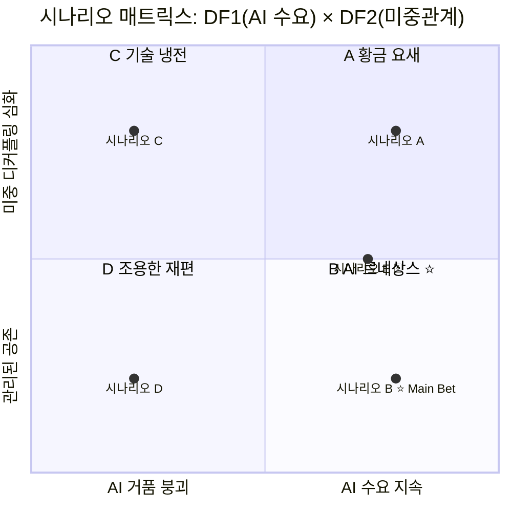
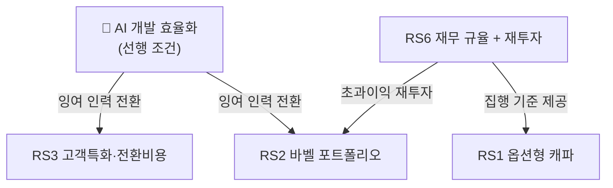

# 클로드 코드와 함께 보고서 만들기
## 세미나 기술 문서

**작성일**: 2026년 5월  
**대상**: 전략기획·연구·분석 업무 종사자 (개발 경험 불필요)  
**소요 시간**: 90분  
**형식**: 강의 40% + 라이브 데모 50% + Q&A 10%

---

## 1. 왜 지금 이 세미나인가?

### 1.1 보고서 작성의 현실

전략 보고서 한 편을 만드는 데 통상적으로 이런 과정을 거친다:

```
자료 수집 (2~3일)
    ↓
데이터 정리·분석 (1~2일)
    ↓
초안 작성 (1~2일)
    ↓
검토·수정 (1일)
    ↓
시각화·슬라이드 (1~2일)
──────────────────
총 6~10일
```

클로드 코드를 활용하면 이 흐름에서 반복적·기계적 작업을 AI가 처리하고, 사람은 **판단과 전략적 사고**에 집중할 수 있다.

### 1.2 이 세미나에서 보여줄 것

이 세미나는 **실제 만들어진 산출물**을 토대로 진행한다.  
삼성전자 메모리사업부 시나리오 플래닝 전략 보고서(약 600줄, 25개 슬라이드 기획서, 16개 데이터 파일)를 클로드 코드로 제작한 실제 사례가 데모의 중심이다.

---

## 2. 클로드 코드란?

### 2.1 개념

**클로드 코드(Claude Code)**는 터미널(CLI)에서 실행되는 AI 에이전트다.  
채팅창에 메시지를 보내는 것이 아니라, **실제 파일을 읽고·쓰고·실행하고·검색하는** 에이전트다.

```
[일반 AI 챗봇]                    [클로드 코드]
사용자 입력                       사용자 지시
    ↓                                 ↓
텍스트 생성                       파일 읽기 → 분석
    ↓                                 ↓
화면에 출력                       웹 검색 → 데이터 수집
(복사해서 직접 정리해야 함)           ↓
                                  파일 쓰기 → 보고서 생성
                                      ↓
                                  git 커밋 → 버전 관리
```

### 2.2 핵심 기능

| 기능 | 설명 | 보고서 작성에 활용 |
|------|------|-----------------|
| **파일 읽기·쓰기** | 로컬 파일 직접 접근 | 데이터 파일 → 보고서로 변환 |
| **웹 검색·페이지 패치** | 실시간 정보 수집 | 시장 데이터, 경쟁사 정보 자동 수집 |
| **코드 실행 (Bash)** | 터미널 명령 실행 | git 커밋, 파일 구조화, 자동화 |
| **서브에이전트** | 여러 AI가 병렬 작업 | 데이터 수집·분석·작성 동시 진행 |
| **장기 컨텍스트** | 대용량 문서 처리 | 수백 줄 보고서 전체 이해 및 수정 |
| **MCP 도구 연결** | 외부 앱 통합 | Notion, Google Drive 등 직접 연동 |

### 2.3 일반 AI 챗봇과의 결정적 차이

```
[챗봇 한계]                      [클로드 코드 해결]
"결과를 복사해서 붙여넣어야 해"    → 파일에 직접 저장
"길어지면 잊어버려"              → 파일 기반 영구 컨텍스트
"매번 처음부터 시작"             → CLAUDE.md로 프로젝트 기억
"혼자서 다 해야 해"              → 서브에이전트 병렬 처리
"수정하면 또 다 쓴다"            → 특정 섹션 정밀 수정
```

---

## 3. 핵심 개념: 보고서 작업에 필요한 것만

### 3.1 CLAUDE.md — 프로젝트 기억

`CLAUDE.md` 파일은 프로젝트 루트에 두는 **규칙서**다.  
클로드 코드가 모든 세션에서 이 파일을 읽어 프로젝트 맥락을 유지한다.

```markdown
# 프로젝트 가이드라인

## 규칙
- 모든 문서는 한국어 작성
- 숫자 형식: 억 → B 변환 ($5,516억 → $551.6B)
- 데이터 추가 시 data/metadata.md 업데이트 필수
- 모든 변경사항 git commit
```

> **포인트**: "매번 같은 말을 반복하지 않아도 된다."  
> 형식, 언어, 명명 규칙, 파일 구조를 한 번만 정의하면 이후 모든 세션에서 자동 적용.

### 3.2 서브에이전트 — 병렬 작업

복잡한 보고서는 하나의 AI가 순차적으로 처리하는 것보다  
**여러 AI가 동시에 작업**하면 훨씬 빠르다.

```
[사용자]
"시장 데이터·경쟁사·기술 트렌드·정책 환경을 조사해줘"
    ↓
[클로드 코드 메인]
    ├→ [리서치 에이전트 1] 시장 데이터 수집 (동시)
    ├→ [리서치 에이전트 2] 경쟁사 분석 (동시)
    ├→ [리서치 에이전트 3] 기술 트렌드 조사 (동시)
    └→ [리서치 에이전트 4] 정책 환경 조사 (동시)
    ↓
결과 통합 → 보고서 작성
```

순차 처리 대비 **3~4배 빠른** 데이터 수집 가능.

### 3.3 Mermaid 다이어그램 — 코드로 시각화

보고서에 들어가는 도표를 이미지 편집 도구 없이 **텍스트로 작성**한다.  
GitHub, Notion 등에서 자동 렌더링된다.

**예시: 시나리오 매트릭스 (2×2 사분면)**

````markdown
```mermaid
quadrantChart
    title 시나리오 매트릭스
    x-axis AI 거품 붕괴 --> AI 수요 지속
    y-axis 관리된 공존 --> 미중 디커플링 심화
    quadrant-1 A: 황금 요새
    quadrant-2 C: 기술 냉전
    quadrant-3 D: 조용한 재편
    quadrant-4 B: AI 르네상스 ⭐
    시나리오 B: [0.78, 0.22]
    시나리오 A: [0.78, 0.80]
```
````

**예시: 전략 흐름도**

````markdown

````

### 3.4 PROMPT.md — 지시사항 로그

모든 사용자 지시를 누적 기록하는 파일.  
프로젝트 히스토리를 유지하고, 세션이 바뀌어도 이전 요청을 참조할 수 있다.

```markdown
## 2026-05-05: Bet 전략 심화 지시
전략 보고서의 Bet 전략 부분을 다음 7개 방향으로 수정:
1. 옵션형 캐파 체계
2. HBM 초과이익 재투자 원칙 명문화
...
```

---

## 4. 실전 워크플로: 전략 보고서 만들기

### 4.1 전체 흐름

```
Step 1: 프로젝트 초기화
    → CLAUDE.md 작성 (규칙 정의)
    → 디렉토리 구조 생성
    → git init

Step 2: 데이터 수집
    → 서브에이전트에 수집 지시
    → data/{카테고리}/ 에 마크다운으로 저장
    → data/metadata.md 인덱스 자동 업데이트

Step 3: 분석 및 보고서 초안
    → 수집된 데이터 기반으로 분석 지시
    → analysis/ 에 초안 생성
    → Mermaid 다이어그램 포함

Step 4: 보고서 정제
    → 섹션별 수정 지시
    → 형식 일관성 검토
    → 수치 검증

Step 5: 슬라이드 기획서
    → 보고서 기반 슬라이드 구조 설계
    → 각 슬라이드 콘텐츠·시각자료·발표자 노트 포함

Step 6: 버전 관리
    → git commit (작업 단위별)
    → GitHub push
```

### 4.2 효과적인 프롬프트 작성법

#### ❌ 나쁜 예 (모호함)
```
"시장 분석 해줘"
```

#### ✅ 좋은 예 (구체적)
```
"@data/market/ 디렉토리에 HBM 시장 데이터를 수집해줘.
2024~2028년 시장 규모(B$ 단위), 업체별 점유율,
가격 트렌드를 포함하고, TrendForce·Yole·BofA 출처 명시.
수집 후 data/metadata.md에 항목 추가해줘."
```

#### 핵심 원칙
1. **대상 파일/디렉토리 명시** (`@파일명` 형태)
2. **출력 형식 지정** (표, 마크다운, B$ 단위 등)
3. **출처 요건 명시** (신뢰도 중요 시)
4. **후속 작업 연결** (메타데이터 업데이트 등)

### 4.3 수정 지시 패턴

```
# 특정 섹션 수정
"@report/scenario-planning-report.md의 Section 6.1 MB-4에
CMX/SCADA 관련 내용을 추가해줘. strategy.md의 해당 섹션 참고."

# 형식 통일
"보고서 전체에서 억 단위 금액을 B 형식으로 변환해줘.
1억 = $100M = $0.1B 기준."

# 구조 변경
"RS6와 RS7을 하나의 전략으로 병합해줘.
두 전략이 동전의 양면이므로 이사회 정책 패키지로 통합."
```

---

## 5. 실제 사례 분석: 시나리오 플래닝 보고서

### 5.1 프로젝트 개요

| 항목 | 내용 |
|------|------|
| **주제** | 삼성전자 메모리사업부 불확실성 대응 전략 |
| **방법론** | Shell 시나리오 플래닝 |
| **소요 기간** | 수 시간 (AI 지원) vs 통상 2~3주 (인력 단독) |
| **산출물** | 전략 보고서 600줄 + 슬라이드 기획서 25매 + 데이터 16개 파일 |
| **에이전트 수** | 메인 1 + 서브 최대 4개 병렬 |

### 5.2 산출물 예시

#### 데이터 메타데이터 인덱스 (`data/metadata.md`)
```markdown
### hbm-market.md
- **수집일**: 2026-05-05 | **신뢰도**: High | **태그**: #HBM #AI #market-share
- **요약**: 2025년 HBM 매출 ~$34B(전년 2배). SK하이닉스 57~62%, Micron 21%,
  삼성 17~22%. 2030년 CAGR 33%.
- **출처**: Yole Group, BofA, Counterpoint Research
```

#### 시나리오 매트릭스 (Mermaid quadrantChart)


#### 전략 상호의존 관계도 (Mermaid flowchart)


### 5.3 슬라이드 기획서 구조

슬라이드 1개의 기획서 예시:

```markdown
## 슬라이드 3: Executive Summary

**레이아웃**: 3개 핵심 메시지 카드, 번호 강조 레이아웃
**목적**: 결론 선행 구조 — 경영진 두뇌에 먼저 핵심을 심기

### 콘텐츠
[카드 1 — 블루] ① 위기의 역설
  33년 만의 DRAM 1위 역전 / HBM 점유율 40%→17%

[카드 2 — 오렌지] ② Main Bet: AI 르네상스 (30~35%)
  2026년 5개 즉시 결정 필요

[카드 3 — 그린] ③ Robust 전략: 지금 당장 실행
  RS1~RS6: 시나리오 불문 즉시 착수

### 스피커 노트
"결론부터 말씀드립니다. 첫째, 우리는 지금 호황 속에서 구조적으로 지고 있습니다..."

### 디자인 지침
- 카드 2 오렌지 배경 — 가장 강조 (Main Bet)
- 수치 Bold 32pt
```

---

## 6. 모범 사례 & 주의사항

### 6.1 잘 되는 것

| 작업 유형 | 효과 | 이유 |
|---------|------|------|
| 구조화된 데이터 수집·정리 | ★★★★★ | 반복 패턴 자동화에 최적 |
| 마크다운 문서 작성·편집 | ★★★★★ | 텍스트 조작이 AI 핵심 역량 |
| 여러 파일 간 일관성 유지 | ★★★★☆ | 전체 파일 동시 참조 가능 |
| 형식 변환 (숫자·표·다이어그램) | ★★★★★ | 규칙 기반 변환 완벽 처리 |
| 초안 빠르게 잡기 | ★★★★★ | 구조 잡는 시간 90% 단축 |

### 6.2 주의할 것

| 주의 사항 | 대응 방법 |
|---------|---------|
| **수치 검증 필수** | AI가 생성한 수치는 반드시 출처 확인 |
| **전략적 판단은 사람이** | AI는 구조를 짜고, 옳고 그름은 사람이 결정 |
| **컨텍스트 한계** | 매우 긴 세션은 CLAUDE.md + 파일 참조로 보완 |
| **보안 민감 정보** | API 키, 내부 기밀 데이터는 입력 금지 |

### 6.3 세션 간 연속성 유지

```
세션 1: 데이터 수집 → git commit → 세션 종료
세션 2: "이전에 수집한 @data/ 기반으로 분석 진행해줘" → 즉시 재개
세션 3: "어제 작성한 @report/scenario-planning-report.md의
         Section 6 전략 부분을 수정해줘" → 맥락 즉시 복원
```

**핵심**: 파일 기반 작업이므로 세션이 끊겨도 **작업 내용은 파일에 남아있다.**

---

## 7. 환경 설정 (실습 준비)

### 7.1 설치

```bash
# Node.js 18+ 필요
npm install -g @anthropic-ai/claude-code

# 실행
claude
```

### 7.2 CLAUDE.md 템플릿 (보고서 프로젝트용)

```markdown
# 프로젝트 가이드라인

## 기본 규칙
- 모든 문서: 한국어 작성 (기술 용어 영어 병기)
- 수치 형식: 원화 원 단위, 달러 B/M 단위
- 모든 변경사항: git commit
- 데이터 추가 시: metadata.md 업데이트 필수

## 디렉토리 구조
- 원시 데이터: data/{카테고리}/
- 분석 결과: analysis/
- 보고서: report/
- 발표자료 기획: presentation/

## 인용 규칙
- 모든 수치에 출처 표기 필수
- 출처 형식: (출처명, 연도)

## 서브에이전트 규칙
- Research Agent: 데이터 수집만, 판단 금지
- Report Agent: 수치는 반드시 출처 표기
```

### 7.3 권장 프로젝트 구조

```
my-report/
├── CLAUDE.md          ← 규칙 정의
├── PROMPT.md          ← 지시사항 로그
├── README.md          ← 프로젝트 개요
├── data/              ← 수집 데이터
│   ├── market/
│   ├── competitors/
│   └── metadata.md    ← 데이터 인덱스
├── analysis/          ← 분석 결과
├── report/            ← 최종 보고서
└── presentation/      ← 슬라이드 기획
```

---

## 8. 자주 묻는 질문 (Q&A)

**Q. 코딩을 전혀 몰라도 되나요?**  
A. 네. 이 세미나의 데모는 터미널에서 한국어로 지시하는 것이 전부입니다. 코드를 작성할 필요가 없습니다.

**Q. 회사 기밀 자료를 입력해도 되나요?**  
A. 클로드 코드는 Anthropic 서버를 거칩니다. 공개되면 안 되는 민감 기밀은 입력하지 않는 것을 권장합니다. 내부 서버에서 로컬 모델을 운영하는 방식도 있습니다.

**Q. 얼마나 정확한가요?**  
A. 구조 잡기·형식 변환·문서 편집은 매우 정확합니다. 다만 수치·사실 정보는 반드시 검증이 필요합니다. AI가 "출처"를 포함해도 직접 확인해야 합니다.

**Q. 비용은 얼마나 드나요?**  
A. 클로드 코드는 API 사용량 기반 과금입니다. 이 세미나의 전체 보고서 프로젝트(약 5~10시간 작업)는 수십 달러 수준입니다.

**Q. 기존 보고서를 AI가 수정하게 할 수 있나요?**  
A. 네. 기존 파일을 프로젝트 디렉토리에 넣고 `@파일명`으로 참조하면 됩니다.

---

## 부록: 실습 과제

### 과제 1: 미니 시장 조사 보고서 (30분)

1. `my-report/` 디렉토리 생성
2. CLAUDE.md 작성
3. "관심 산업의 2024~2025년 시장 규모와 주요 플레이어를 조사해서 data/market.md에 저장해줘" 지시
4. "수집된 데이터를 기반으로 report/summary.md에 요약 보고서 작성해줘" 지시
5. git commit

### 과제 2: Mermaid 다이어그램 실습 (15분)

1. 본인 업무의 프로세스를 flowchart로 표현해달라고 지시
2. 업무 우선순위를 quadrantChart (중요도 × 긴급도)로 표현해달라고 지시

### 과제 3: 기존 보고서 리팩토링 (20분)

1. 기존에 작성한 마크다운 문서를 프로젝트에 추가
2. "이 보고서의 형식을 CLAUDE.md 규칙에 맞게 통일해줘" 지시
3. "핵심 논지를 3줄 요약하고 Executive Summary 섹션을 추가해줘" 지시
