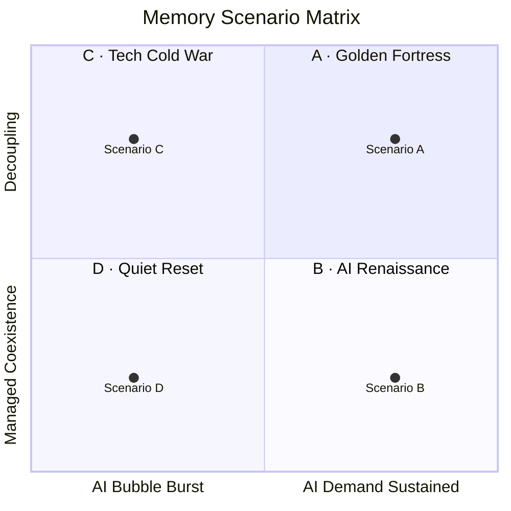

# AI Harness Engineering — 보고서 워크플로우
## 세미나 슬라이드 기획서 (v3 — 신설 트랙만, 라이트 테마)

**작성일**: 2026년 5월 (v3.1 — 자동화 워크플로우 2매 추가)
**슬라이드 수**: 25매
**발표 예상 시간**: 60분 (이론 25 + 실전 28 + Q&A 7)
**대상**: 전략기획·연구·분석 담당자 (개발 경험 불필요)
**컨셉**: 두 트랙으로 이론 → 실전을 잇는다. AI 하네스 엔지니어링의 개념을 잡고, 실제 보고서 프로젝트의 git 발췌로 검증한 뒤, **변경 정합성 체인을 CLAUDE.md 규칙으로 박제하는 메타 패턴까지** 보여준다.
**2대 트랙**: ① 00 · 하네스 엔지니어링 (이론, 10매) → ② 04 · 케이스 스터디 (실전 9매 + 자동화 워크플로우 2매)

---

## 디자인 시스템 (v3 — 라이트 개발자 테마)

| 요소 | 사양 |
|------|------|
| 슬라이드 크기 | 13.33" × 7.5" (LAYOUT_WIDE, 16:9) |
| 배경 | **순수 화이트 `#FFFFFF`** |
| 패널/카드 BG | **`#F8FAFC` (slate-50) · `#F1F5F9` (slate-100)** |
| 보더 | `#E2E8F0` (slate-200) |
| 1차 강조 (Primary) | **인디고 `#4F46E5` (indigo-600)** — 기존 시안 자리 |
| 2차 강조 (Secondary) | **핑크 `#EC4899` (pink-500)** — 기존 앰버 자리 |
| 본문 텍스트 | **`#0F172A` (slate-900)** — 다크 잉크 |
| 보조 텍스트 | `#1E293B` (slate-800) · `#475569` (slate-600) |
| 푸터/캡션 | `#64748B` (slate-500) |
| 상태 색 | 그린 `#059669` (emerald-600) · 레드 `#DC2626` (red-600) |
| 헤드라인 폰트 | Arial Black (84pt 표지 / 36pt 본문) |
| 본문 폰트 | Calibri (14~18pt) |
| 코드 폰트 | Consolas (10~13pt) |
| 우측 엣지 | 인디고 세로 라인 (x=13.18", w=0.04") 전 슬라이드 공통 |

### 슬라이드 공통 영역 (chrome)

| 위치 | 요소 |
|------|------|
| 좌상단 (0.60, 0.35) | 섹션 라벨 — 인디고 10pt Calibri (예: `▍ AI HARNESS  00 · DEFINITION`) |
| 우상단 (11.73, 0.35) | 페이지 카운터 — 슬레이트 10pt Consolas (예: `03 / 23`) |
| 본문 타이틀 (0.60, 0.85) | 36pt Arial Black 다크 잉크 |
| 본문 서브타이틀 (0.60, 1.70) | 14pt Calibri 슬레이트-600 |
| 좌하단 (0.60, 7.05) | 푸터 — `#64748B` 9pt Calibri (`Claude Code for Reports · Technical Seminar`) |

---

## 📌 슬라이드 구성 요약 (25매)

| # | 트랙 | 내용 | 형태 |
|---|------|------|------|
| 1 | COVER | 표지 — "AI Harness / Engineering." | 풀스크린 타이포그래피 |
| 2 | AGENDA | 2 트랙 + Q&A | 3행 큰 카드 |
| **3** | **00 · HARNESS** | **AI 하네스 엔지니어링이란** (인용 + 두뇌·환경 비유) | 인용구 + 3박스 |
| **4** | **00 · HARNESS** | **LLM vs LLM + Harness — 결과물 비교 8항목** | 비교 표 |
| **5** | **00 · HARNESS** | **하네스의 5대 빌딩 블록** | 5칸 그리드 |
| **6** | **00 · HARNESS** | **에이전틱 루프 (Plan→Act→Observe→Decide)** | 4카드 + 비교 |
| **7** | **00 · HARNESS** | **컨텍스트 엔지니어링 — 4 레이어 + 절약 기법** | 레이어 + 팁 |
| **8** | **00 · HARNESS** | **서브에이전트 패턴 3종 (Researcher · Specialist · Critic)** | 3칸 카드 |
| **9** | **00 · HARNESS** | **도구 사용 위계 + 권한 모드 3종** | 피라미드 + 모드 |
| **10** | **00 · HARNESS** | **영속성 레이어 — 파일 시스템 = 외부 두뇌** | 4행 표 + 4 효과 |
| **11** | **00 · HARNESS** | **Claude Code = reference 하네스 — 4분면 위치도** | 4분면 + 이유 |
| **12** | **00 · HARNESS** | **하네스 설계 원칙 5가지** | 5칸 카드 |
| **13** | **04 · CASE** | **케이스 개요 — 시나리오 플래닝 보고서** | 카드 + 산출물 트리 |
| **14** | **04 · CASE** | **첫 프롬프트 → 하네스가 세운 6단계 계획** | 인용 + 단계 표 |
| **15** | **04 · CASE** | **디렉토리 구조 — 워크플로우의 척추** | 트리 + 화살표 |
| **16** | **04 · CASE** | **CLAUDE.md — 프로젝트 헌법 (실제 발췌)** | 코드 패널 + 효과 |
| **17** | **04 · CASE** | **6개 서브에이전트 — 역할 기반 전문화** | 6행 표 |
| **18** | **04 · CASE** | **데이터 수집 + metadata.md (실제 발췌)** | 카테고리 + 코드 |
| **19** | **04 · CASE** | **STEEP 50요인 → I×U → 3개 Driving Force** | 깔때기 + DF 결과 |
| **20** | **04 · CASE** | **시나리오 매트릭스 — Mermaid quadrantChart** | 코드 + 렌더링 |
| **21** | **04 · CASE** | **Strategy Agent — 7개 벤치마크 cross-check** | 매핑 7행 표 |
| **22** | **04 · CASE** | **report → slide-outline → PPTX 자동 빌드** | 3단 파이프라인 |
| **23** | **04 · CASE** | **변경 정합성 체인 — 두 갈래 (PPTX + 대시보드)** | 두 갈래 다이어그램 |
| **24** | **04 · CASE** | **자동화 보존 — CLAUDE.md 규칙으로 박제** | 규칙 발췌 + 효과 4개 |
| 25 | CLOSING | Questions & Discussion + takeaway 3줄 | 표지 톤 |

---

## 슬라이드 1: 표지 (COVER)

**섹션 라벨**: `▍ TECHNICAL  SEMINAR  ·  v3`

### 레이아웃
```
[좌상단] ▍ TECHNICAL  SEMINAR · v3        (인디고)

[중앙 좌측 정렬]
AI Harness                                 (84pt 다크 잉크)
Engineering.                               (84pt 인디고)

보고서 워크플로우 — 이론에서 실전까지         (18pt 슬레이트-800)
두 트랙으로 진행합니다 — 00 · 하네스 (10매) + 04 · 케이스 스터디 (10매)
                                            (14pt italic 핑크)

$ harness --tracks=00,04 --slides=25      (13pt 인디고 Consolas)

발표자: 권의혁  ·  소속: 메모리사업부  ·  2026.05.06
```

### 디자인 지침
- "Engineering." 만 인디고로 강조 (구 "for Reports." 위치)
- 우측 엣지 인디고 세로 라인 유지
- 핑크 italic 한 줄 = 두 트랙 구조 안내 (오리엔테이션)

---

## 슬라이드 2: AGENDA

**섹션 라벨**: `▍ AI HARNESS  AGENDA`
**서브타이틀**: 이론 트랙 → 실전 트랙 → Q&A — 그대로 이어 읽으면 하나의 주장이 됩니다

### 콘텐츠 (3 트랙)
| # | 제목 | 부제 | 슬라이드 | 시간 |
|---|------|------|---------|------|
| **00** | AI Harness Engineering | LLM을 자율 에이전트로 동작시키기 위한 외부 시스템 설계 | 3~12 (10매) | 25분 |
| **04** | Case — 시나리오 플래닝 보고서 + 자동화 | 실제 PROMPT · CLAUDE.md · 6 서브에이전트 · 디렉토리 + 변경 정합성 체인 | 13~24 (12매) | 28분 |
| **Q** | Questions & Discussion | 이론과 실전의 연결 — 자유롭게 질문 | 25 (1매) | 7분 |

### 디자인 지침
- 3행 큰 카드 (가로 폭 12.05"). 카드 좌측 큰 번호 (00=인디고, 04=핑크, Q=뮤트 슬레이트)
- 카드 우측에 시간 메타 (예: `12매 · 약 28분 · 슬라이드 13~24`)
- 하단 중앙 캡션: `총 25슬라이드 · 약 60분`

---

## 슬라이드 3: 00 · HARNESS — AI 하네스 엔지니어링이란

**섹션 라벨**: `▍ AI HARNESS  00 · DEFINITION`
**서브타이틀**: LLM을 자율 에이전트로 동작시키기 위한 외부 시스템 설계

### 좌측 — 인용구 패널
- 큰 시안 `"` 마크 (96pt)
- 본문(18pt 시안):
  > "**LLM은 텍스트 생성기다. 하네스(harness)는 그 텍스트가 파일을 읽고, 도구를 부르고, 실행하고, 다음 행동을 결정하는 시스템이다.**
  > 모델 자체가 아니라 모델을 둘러싼 엔지니어링이 자율 에이전트의 능력을 결정한다."
- 보조(13pt 회색): "Anthropic의 *building effective agents* (2024) — '하네스'라는 용어는 LLM을 환경과 연결하는 코드·도구·프롬프트의 총체를 가리킨다."

### 우측 — 비유 다이어그램 (가로 3박스)
| LLM (두뇌) | + 하네스 (몸·환경) | = 자율 에이전트 |
|-----------|------------------|----------------|
| 텍스트 생성 | 파일 R/W · 도구 호출 · 컨텍스트 관리 · 루프 제어 | 보고서를 끝까지 만든다 |

### 하단 캡션
`✱ 좋은 모델 + 나쁜 하네스 = 챗봇. 평범한 모델 + 좋은 하네스 = 작업하는 동료.`

---

## 슬라이드 4: 00 · HARNESS — LLM vs LLM + Harness

**섹션 라벨**: `▍ AI HARNESS  00 · CONTRAST`
**서브타이틀**: 같은 지시, 전혀 다른 결과물

### 2열 비교 (전체 영역)

| 구분 | 일반 LLM 챗봇 | LLM + 하네스 |
|------|--------------|--------------|
| **입력** | "메모리 시장 시나리오 보고서 써줘" | (동일) |
| **응답 형식** | 채팅창 내 텍스트 1~3쪽 | 디렉토리·파일·다이어그램·커밋 이력 |
| **출처** | 학습 시점 지식, 환각 위험 | 웹 검색 결과 + 인용 footnote 자동 |
| **재현성** | 같은 질문도 매번 답변이 다름 | 파일·git이 남아 누구나 재실행 가능 |
| **검증성** | 답변 자체로 끝 | 데이터 → 분석 → 결론까지 추적 가능 |
| **분량 한계** | 컨텍스트 윈도우 1회분 | 파일에 저장 → 다음 세션에서 이어쓰기 |
| **공동작업** | 대화 사본 공유 | Git PR·코드 리뷰 동일 워크플로우 |
| **현실 작업** | 사람이 받아 적어 정리 | 산출물 자체가 최종 형태 |

### 디자인 지침
- 첫 컬럼은 회색 톤(`#94A3B8`), 두 번째 컬럼은 시안 액센트로 강조
- 표 상단에 라벨: `BEFORE / AFTER`

---

## 슬라이드 5: 00 · HARNESS — 하네스의 5대 빌딩 블록

**섹션 라벨**: `▍ AI HARNESS  00 · BUILDING BLOCKS`
**서브타이틀**: 모든 코딩·문서 에이전트가 이 다섯 요소의 조합으로 환원된다

### 5칸 그리드 (1행 5열, 또는 2+3 배치)

| # | 블록 | 정의 | 본 프로젝트 사례 |
|---|------|------|-----------------|
| **01** | **Tool Use** | LLM이 호출할 수 있는 외부 함수 — 파일 R/W, 셸, 웹 검색, MCP 서버 | Read·Write·Bash·WebSearch·Mermaid 렌더 |
| **02** | **Persistent State** | 컨텍스트 윈도우 밖에 살아남는 상태 — 파일 시스템, Git, DB, MCP 메모리 | `data/` `analysis/` `report/` 디렉토리 + git history |
| **03** | **Context Engineering** | 모델에 무엇을 보여주고 무엇을 감출지 결정 — system prompt, CLAUDE.md, retrieval | `CLAUDE.md`(63줄)가 매 세션 자동 주입 |
| **04** | **Subagent Orchestration** | 메인 에이전트가 자식 에이전트를 분배·격리·취합 | Research / STEEP / Scenario / Strategy 등 6개 |
| **05** | **Loop Control** | 자율 루프의 종료·승인·확인 메커니즘 — turn limit, plan mode, human approval | 사용자 승인 게이트 + PROMPT.md 누적 로깅 |

### 디자인 지침
- 카드 좌측 큰 시안 번호. `01·02`는 시안, `03·04·05`는 앰버로 액센트 분리
- 카드 좌측 액센트 라인

### 하단 캡션
`✱ 모델을 바꿔도 이 5가지가 잘 설계되어 있으면 작업 결과가 안정적으로 유지됩니다.`

---

## 슬라이드 6: 00 · HARNESS — 에이전틱 루프

**섹션 라벨**: `▍ AI HARNESS  00 · AGENTIC LOOP`
**서브타이틀**: 결과를 보고 다음을 결정하는 자율성 — 챗봇과 에이전트의 분기점

### 좌측 — 순환 다이어그램 (4단계 시계 방향)
```
       ┌─────────────┐
       │   PLAN      │   ① 사용자 의도 파싱·계획 수립
       │  (계획)     │      → "STEEP 50요인 도출 후 점수화"
       └──────┬──────┘
              ▼
       ┌─────────────┐
       │   ACT       │   ② 도구 호출 (Read·Write·Bash·Search)
       │  (실행)     │      → analysis/steep/economy.md 생성
       └──────┬──────┘
              ▼
       ┌─────────────┐
       │  OBSERVE    │   ③ tool result 관찰
       │  (관찰)     │      → "10개 요인 도출됨, 점수 비어있음"
       └──────┬──────┘
              ▼
       ┌─────────────┐
       │  DECIDE     │   ④ 다음 행동 결정 (계속/완료/사용자에게 확인)
       │  (결정)     │      → "각 요인에 1~5점 부여 후 다음 카테고리"
       └──────┬──────┘
              └────── repeat ──────┘
```

### 우측 — 단순 호출 vs 에이전틱 루프

| 항목 | 단순 LLM 호출 | 에이전틱 루프 |
|------|--------------|--------------|
| **턴 수** | 1턴 | N턴 (성공·종료까지) |
| **자가 수정** | 없음 (출력 1번) | 가능 (관찰 → 재계획) |
| **다중 단계** | 사용자가 매번 지시 | 한 번 지시로 자율 수행 |
| **실패 회복** | 사람이 재시도 | 에이전트가 다른 도구로 재시도 |

### 하단 캡션
`✱ 본 프로젝트는 30개 이상의 작업이 자동 분기 — 사용자가 매번 지시하지 않았습니다.`

---

## 슬라이드 7: 00 · HARNESS — 컨텍스트 엔지니어링

**섹션 라벨**: `▍ AI HARNESS  00 · CONTEXT`
**서브타이틀**: 컨텍스트 윈도우는 한정 자원 — 무엇을 채울지가 곧 능력이 된다

### 좌측 — 4단 레이어 다이어그램 (위가 영구, 아래가 휘발)
```
┌────────────────────────────────────────┐
│ ① System Prompt        영구 · 자동 주입 │  하네스 정체성, 안전 규칙
├────────────────────────────────────────┤
│ ② CLAUDE.md            영구 · 자동 주입 │  프로젝트 헌법 (63줄)
├────────────────────────────────────────┤
│ ③ File References      온디맨드        │  @data/ @report/ 명시 시 주입
├────────────────────────────────────────┤
│ ④ Conversation Turns   휘발 · 누적     │  사용자·에이전트 대화 + 도구 결과
└────────────────────────────────────────┘
```

### 우측 — 컨텍스트 절약 기법

✱ **CLAUDE.md = 영속 규칙**
   "한국어, 수치는 B 단위, 출처 표기" → 매 세션 자동 적용

✱ **Subagent isolation**
   리서치는 격리 컨텍스트 → 메인 에이전트에 핵심만 반환

✱ **File references**
   필요할 때만 `@analysis/steep/economy.md` 명시

✱ **Periodic compaction**
   자동 요약으로 오래된 턴은 압축

### 하단 캡션
`✱ 1M 토큰 윈도우도 잘못 쓰면 200K로 끝납니다. 무엇을 안 보여줄지가 무엇을 보여줄지보다 중요합니다.`

---

## 슬라이드 8: 00 · HARNESS — 서브에이전트 패턴 3종

**섹션 라벨**: `▍ AI HARNESS  00 · SUBAGENTS`
**서브타이틀**: 격리된 컨텍스트로 노이즈를 차단한다

### 3칸 카드 그리드

| 패턴 | 정의 | 본 프로젝트 적용 |
|------|------|----------------|
| **① Researcher** | 격리 컨텍스트에서 자료를 광범위 수집 → 정제된 요약만 반환. 메인 컨텍스트 보존. | Research Agent가 18개 데이터 파일 수집, metadata.md만 메인에 노출 |
| **② Specialist** | 특정 도메인·방법론에 특화. 동일 입력에서 일관된 산출. | STEEP Agent (1~5점 점수), Scenario Agent (중립적 이름), Strategy Agent (벤치마크 cross-check) |
| **③ Critic** | 다른 에이전트 결과를 별도 시각으로 검증. 편향·누락 검출. | RS3 팩트체크 — 검증 에이전트가 SCADA·FDP 시장성 재검토 후 권고안 보강 |

### 디자인 지침
- 각 카드 상단에 큰 시안 번호 (96pt)
- 카드 BG `#111B2E`, 좌측 액센트 라인
- 카드 하단에 본 프로젝트 적용 사례를 작은 회색 텍스트로

### 하단 캡션
`✱ 한 에이전트에 모든 걸 시키지 마세요. 역할 분리만으로 환각·누락이 절반으로 줍니다.`

---

## 슬라이드 9: 00 · HARNESS — 도구 사용 위계 + 권한 모델

**섹션 라벨**: `▍ AI HARNESS  00 · TOOLS`
**서브타이틀**: 자율성과 안전성의 균형

### 좌측 — 피라미드 (위가 강력·위험, 아래가 안전)
```
              ┌──────────────────┐
              │  ④ Subagent      │  격리 실행, 외부 시스템 조작 가능
              │     · MCP write  │  (Notion 페이지 수정, GitHub PR 생성)
              ├──────────────────┤
              │  ③ Bash · Edit   │  파일 수정, 셸 명령 — 사용자 승인 권장
              ├──────────────────┤
              │  ② Web · Search  │  외부 정보 fetch — 안전, 검증 필수
              ├──────────────────┤
              │  ① Read · Glob   │  파일 읽기 — 거의 항상 안전
              └──────────────────┘
```

### 우측 — 권한 모드 3종

| 모드 | 동작 | 적합한 단계 |
|------|------|-----------|
| **read-only** | 파일 읽기만, 수정·실행 차단 | 탐색·디버깅 초반 |
| **confirm** | 도구 호출 전 사용자 승인 | 첫 자동화·규모 큰 변경 |
| **autonomous** | 사전 정의 도구 자유 사용 | 신뢰된 반복 워크플로우 (CI 등) |

### 하단 캡션
`✱ 본 프로젝트는 데이터 수집·분석은 autonomous, 보고서 최종화·git push는 confirm으로 운영했습니다.`

---

## 슬라이드 10: 00 · HARNESS — 영속성 레이어

**섹션 라벨**: `▍ AI HARNESS  00 · PERSISTENCE`
**서브타이틀**: 파일 시스템은 LLM의 외부 두뇌

### 좌측 — 4단 레이어 비교

| 레이어 | 영속성 | 용량 | 검색 | 본 프로젝트 사례 |
|-------|-------|------|------|----------------|
| **In-context memory** | 세션 종료 시 소멸 | 1M 토큰 | 직접 읽음 | 대화 중 도구 결과 |
| **Memory files (MCP)** | 세션 간 영속 | 디스크 한계 | 인덱스 + 읽기 | `~/.claude/.../memory/MEMORY.md` |
| **Project workspace** | 영속 + 공유 | 디스크 한계 | grep · find | `data/` `analysis/` `report/` |
| **External (Git·MCP)** | 영속 + 분산 | 무제한 | 원격 검색 | GitHub `action-learning` repo + PR |

### 우측 — 파일 우선 워크플로우의 효과

✱ **재현 가능성**
   30개 커밋이 작업 단계별 스냅샷 → 누구나 어느 시점이든 재현

✱ **협업 가능성**
   PR·코드 리뷰 흐름 그대로 활용 — Slack 첨부 파일 주고받기 불필요

✱ **감사 가능성**
   `git log` + `PROMPT.md` 누적 로깅 → 어떤 지시로 어떤 결정이 났는지 추적

✱ **이어쓰기 가능성**
   다음 세션이 `report/` 읽고 그 위에 작업 — 컨텍스트 단절 없음

### 하단 캡션
`✱ "산출물을 채팅창에 출력하지 말고 파일에 써라" — 가장 단순한 단 하나의 규칙.`

---

## 슬라이드 11: 00 · HARNESS — Claude Code의 위치

**섹션 라벨**: `▍ AI HARNESS  00 · LANDSCAPE`
**서브타이틀**: 코딩 에이전트는 많다 — 보고서 워크플로우에 적합한 reference 하네스는?

### 좌측 — 4분면 위치도 (가로축: 코드 ↔ 문서, 세로축: GUI ↔ Terminal)

```
              ▲ Terminal·CLI 중심
              │
   Aider      │   Claude Code   ★
   (코드 편집) │   (문서·코드 양립)
              │
   ───────────┼───────────────────▶ 보고서·문서
   코드 중심   │                   중심
              │
   Cursor     │   Devin
   (IDE 통합)  │   (브라우저·계획·실행)
              │
              ▼ GUI·웹 중심
```

### 우측 — 본 세미나가 Claude Code를 선택한 이유

✱ **터미널 + 파일 시스템이 곧 워크플로우**
   디렉토리·파일·git이 1차 인터페이스 — 보고서 작업과 정확히 일치

✱ **Markdown·Mermaid 1급 시민**
   별도 디자인 도구 없이 GitHub 자동 렌더링

✱ **MCP 확장**
   Notion·Slack·Drive·Calendar — 같은 모델·동일 워크플로우

✱ **Agent SDK + 슬래시 커맨드**
   조직 표준 워크플로우를 명령으로 패키징

### 하단 캡션
`✱ "AI 하네스 엔지니어링" 자체는 도구 중립 개념입니다. 다음 슬라이드부터는 Claude Code를 reference 구현체로 자세히 봅니다.`

---

## 슬라이드 12: 00 · HARNESS — 하네스 설계 원칙 5가지

**섹션 라벨**: `▍ AI HARNESS  00 · PRINCIPLES`
**서브타이틀**: 보고서·문서 작업에 맞춰 검증된 5가지

### 5칸 카드 그리드

| # | 원칙 | 의미 | 본 프로젝트 적용 |
|---|------|------|----------------|
| **01** | **Plain text first** | 가능한 모든 산출물을 Markdown·MMD·CSV로 — 바이너리는 최소 | 보고서·시나리오·전략 모두 `.md`, 차트는 Mermaid |
| **02** | **Idempotent steps** | 같은 입력 → 같은 출력. 재실행 가능한 단계로 분해 | `generate-pptx.js` 다시 돌리면 동일 PPTX |
| **03** | **Audit trail** | 모든 결정에 입력·도구·결과 추적 가능 | Git log + PROMPT.md 누적 로깅 |
| **04** | **Human-in-the-loop** | 전략 판단·민감 정보·승인은 사람이 | RS3 팩트체크 사용자 피드백 5건이 권고안 형태 결정 |
| **05** | **Composable** | 하네스 + MCP + 외부 도구가 같은 메탈에서 합쳐짐 | Claude Code + python-pptx + matplotlib 조합 |

### 디자인 지침
- 5칸 (3+2 배치) 그리드, 각 카드 좌측 큰 시안 번호
- 원칙명은 영문 대형(앰버), 의미·사례는 14pt 본문

### 하단 캡션
`✱ 다음 트랙(01~03)에서는 Claude Code의 6가지 컴포넌트가 이 원칙들을 어떻게 구현하는지 봅니다.`

---

## 슬라이드 13: 04 · CASE — 케이스 개요 (시나리오 플래닝 보고서)

**섹션 라벨**: `▍ CASE STUDY  04 · OVERVIEW`
**타이틀**: 한 프로젝트, 모든 컴포넌트가 흐른다
**서브타이틀**: 삼성전자 메모리사업부 시나리오 플래닝 — 사용자 첫 프롬프트 한 번에서 시작된 30+ 커밋

### 좌측 — 프로젝트 카드

| 항목 | 내용 |
|------|------|
| **Focal Issue** | 2030~2035년 메모리 시장 불확실성에 어떻게 대응할 것인가 |
| **방법론** | Shell 시나리오 플래닝 (8단계) |
| **사용자** | 메모리사업부 전략 담당자 (개발 경험 없음) |
| **세션 수** | 약 20회, 30+ commits |
| **산출물** | 4종 — 데이터 인덱스 / 분석 / 보고서 / 발표자료(MD+PPTX) |
| **저장소** | `github.com/k31001/action-learning` (공개) |

### 우측 — 산출물 디렉토리 트리

```
action-learning/
├── CLAUDE.md             ← ① 프로젝트 헌법 (63줄)
├── PROMPT.md             ← ② 모든 사용자 지시 누적 (201줄)
├── data/                 ← ③ 18개 데이터 파일 + metadata.md
├── analysis/             ← ④ STEEP·DF·Scenario·Strategy
├── report/
│   └── scenario-planning-report.md  ← 649줄 최종 보고서
├── presentation/
│   ├── slide-outline.md             ← 1,137줄 슬라이드 기획
│   ├── scripts/generate_pptx.py     ← 자동 빌드
│   └── assets/                      ← matplotlib 차트 8종
└── working-style/seminar-claude-code-report/  ← 본 발표자료
```

### 하단 캡션
`✱ 다음 9슬라이드에서 각 산출물이 어떻게 만들어졌는지 실제 파일 발췌로 봅니다.`

---

## 슬라이드 14: 04 · CASE — 첫 프롬프트와 하네스가 세운 6단계 계획

**섹션 라벨**: `▍ CASE STUDY  04 · FIRST PROMPT`
**큰 번호**: `01 / 10`
**서브타이틀**: 한 번의 한국어 지시 → 자동 분기된 작업 계획

### 좌측 — 사용자 첫 프롬프트 (PROMPT.md 발췌)

파일명: `PROMPT.md` (line 1~30)
```markdown
# 목표
나는 삼성전자 메모리사업부의 일원으로 불확실성에 대응하기
위한 회사의 전략을 제안하기 위한 발표자료를 만들거야

# 방법론
쉘에서 사용한 '시나리오 플래닝' 기법 활용. Focal Issue 정의
→ STEEP 브레인스토밍 → Driving Forces → 시나리오 매트릭스
→ Main Bet + Side Bet → 어떤 시나리오에서도 생존하는 전략

# 산출물
1. 모든 데이터 수집 + 메타데이터 관리
2. 마크다운 전략 보고서 (시각자료 포함)
3. 슬라이드 기획서 (중간 산출물)
4. 파워포인트 자동 생성

# 주요 지침
- 역할별 서브에이전트 생성
- 모든 프롬프트는 PROMPT.md에 누적 기록
- 모든 데이터는 git으로 관리
- 마크다운 우선 (PPTX 제외)
```

### 우측 — 하네스가 자동 도출한 6단계 계획

| 단계 | 행동 | 산출 |
|------|------|------|
| 1 | 디렉토리 스캐폴딩 | `data/` `analysis/` `report/` `presentation/` 6개 카테고리 디렉토리 생성 |
| 2 | CLAUDE.md 작성 | 63줄 프로젝트 헌법 — 규칙·디렉토리·메타데이터 형식·서브에이전트 가이드 |
| 3 | 서브에이전트 정의 | Research·STEEP·Scenario·Strategy·Report·Presentation 6종 역할 명세 |
| 4 | 데이터 수집 → 분석 → 보고서 → 발표 | 8단계 시나리오 플래닝 워크플로우 매핑 |
| 5 | PROMPT.md 누적 로깅 | 모든 사용자 지시를 날짜·맥락 헤더와 함께 추가 |
| 6 | Git 자동 커밋 | 의미 단위로 커밋, 30+ commits 달성 |

### 하단 캡션
`✱ "프로젝트 시작해줘" 한 줄에서 위 계획이 자동 도출됨 — 사용자는 수정·승인만`

---

## 슬라이드 15: 04 · CASE — 디렉토리 구조 (워크플로우의 척추)

**섹션 라벨**: `▍ CASE STUDY  04 · DIRECTORY`
**큰 번호**: `02 / 10`
**서브타이틀**: 원시 데이터 → 가공 → 산출물의 단방향 흐름

### 전체 영역 — 디렉토리 트리 + 의미 주석

```
data/                         원시 자료 (Read-only)
├── market/                   시장 데이터 5종 (HBM·DRAM·NAND·AI 서버·가격)
├── competitors/              경쟁사 4종 (SK하이닉스·Micron·CXMT·YMTC)
├── technology/               기술 4종 (HBM4 로드맵·3D DRAM·CXL·PIM)
├── policy/                   정책 4종 (CHIPS·MATCH·VEU·중국 빅펀드 III)
├── macro/                    거시 4종 (AI CapEx·에너지·관세·인플레이션)
└── metadata.md               18개 데이터 인덱스 (수집일·신뢰도·태그·요약)

           ▼ Research Agent · 정제 추출

analysis/                     가공 결과 (Append-only)
├── steep/                    STEEP 5축 (econ·tech·env·social·political)
├── driving-forces/           I×U 매트릭스 + 핵심 3개 선별
├── scenarios/                5개 시나리오 + 매트릭스 (Mermaid)
├── benchmark/                7개 사이클 산업 벤치마크 패턴
└── ↳ scenarios/strategy.md   658줄 — Bet 전략 통합 본

           ▼ Strategy Agent · 통합 정리

report/scenario-planning-report.md   649줄 최종 전략 보고서

           ▼ Presentation Agent · 형식 변환

presentation/
├── slide-outline.md          1,137줄 — 슬라이드별 텍스트·차트·레이아웃
├── scripts/generate_pptx.py  matplotlib + python-pptx 자동 빌드
└── assets/                   차트 8종 (PNG)
```

### 디자인 지침
- 트리 좌측은 흰색, 우측 의미 주석은 회색(`#94A3B8`)
- 단계 화살표(`▼`)는 시안 큰 글자

### 하단 캡션
`✱ 디렉토리 = 단계. 각 단계가 끝나면 다음 디렉토리에 산출물이 쌓입니다. 절대 거꾸로 흐르지 않습니다.`

---

## 슬라이드 16: 04 · CASE — CLAUDE.md (프로젝트 헌법)

**섹션 라벨**: `▍ CASE STUDY  04 · CLAUDE.md`
**큰 번호**: `03 / 10`
**서브타이틀**: 한 번 작성하면 모든 세션이 같은 톤으로 작동한다

### 좌측 — 실제 파일 발췌

파일명: `CLAUDE.md` (line 1~40)
```markdown
# 프로젝트 가이드라인

## 프로젝트 정보
- 주제: 삼성전자 메모리사업부 시나리오 플래닝
- 방법론: Shell 시나리오 플래닝
- 최종 산출물: 보고서(MD) + 슬라이드 기획(MD) + PPTX

## 필수 규칙

### 파일 관리
- 모든 사용자 지시는 PROMPT.md에 누적 기록
- 모든 문서는 Markdown 형식 (PowerPoint 제외)
- 데이터 수집/수정 시마다 data/metadata.md 업데이트
- 모든 변경사항은 git commit

### 디렉토리 규칙
- 원시 데이터: data/{category}/
- 분석 결과: analysis/{type}/
- 보고서 시각자료: report/assets/

### 데이터 메타데이터 형식
각 데이터 항목은 다음 형식으로 기록:
- 파일/링크: 경로 또는 URL
- 수집일: YYYY-MM-DD
- 출처: 기관명
- 신뢰도: High/Medium/Low
- 태그: #market #HBM #competitor 등
- 요약: 2~3줄 핵심 내용

### 시나리오 플래닝 방법론 순서
1. Focal Issue 정의
2. STEEP 30~50개 브레인스토밍
3. Impact × Uncertainty 매트릭스
4. 핵심 Driving Forces 2~3개 선별
... (총 8단계)
```

### 우측 — 이 한 파일이 만들어내는 효과

✱ **언어·형식 영속화**
   "한국어, 수치 B 단위, 출처 표기" — 매번 말하지 않아도 적용

✱ **방법론을 코드로 박제**
   8단계 시나리오 플래닝이 파일에 적혀 있어 어떤 세션에서도 같은 순서

✱ **에이전트 역할 사전 분리**
   Research/STEEP/Scenario/Strategy 권한·금지사항 명시

✱ **자동 주입 (system prompt)**
   세션마다 자동 로드 — 사용자가 의식할 필요 없음

### 하단 캡션
`✱ 30분 들여 만든 CLAUDE.md가 이후 20세션 × 평균 2시간을 일관되게 만듭니다.`

---

## 슬라이드 17: 04 · CASE — 6개 서브에이전트 (역할 기반 전문화)

**섹션 라벨**: `▍ CASE STUDY  04 · SUBAGENTS`
**큰 번호**: `04 / 10`
**서브타이틀**: 한 에이전트에 모든 걸 시키지 않는다

### 전체 영역 — 6행 표

| Agent | 책임 | 산출물 | 핵심 규칙 (CLAUDE.md 명시) | 컨텍스트 |
|-------|------|-------|----------------------------|---------|
| **Research** | 자료 수집 (웹·파일) | `data/*/*.md`, `metadata.md` | 판단 금지, 출처 의무 표기, 신뢰도 라벨 | 격리 (메인에 요약만 반환) |
| **STEEP** | 환경 요인 도출 | `analysis/steep/*.md` (5축) | 1~5점 점수 부여, 30~50개 브레인스토밍 | 격리 |
| **Driving Force** | 핵심 요인 선별 | `impact-uncertainty-matrix.md`, `key-drivers.md` | 독립성 검증 (한 축이 다른 축 원인이면 탈락) | 메인 직접 |
| **Scenario** | 5개 시나리오 작성 | `scenarios/scenario-{A..E}.md` + matrix | 중립적 이름 (좋고 나쁨 평가 금지) | 격리 |
| **Strategy** | Bet 전략 도출 | `strategy.md` (658줄) | 모든 전략은 시나리오와 연결고리 명시, 벤치마크 cross-check | 격리 |
| **Report / Presentation** | 최종 산출물 | `report/*.md`, `slide-outline.md`, `*.py` | 수치 출처 표기, Mermaid 우선 | 메인 직접 |

### 디자인 지침
- 표 헤더 행은 시안 BG, 흰색 텍스트
- Agent 컬럼은 큰 시안 텍스트 (Arial Black)
- 컨텍스트 컬럼: "격리"는 앰버 라벨, "메인 직접"은 회색

### 하단 캡션
`✱ "Scenario Agent가 중립적 이름을 못 지키네" 같은 피드백이 한 번에 한 에이전트만 고치면 끝나는 구조`

---

## 슬라이드 18: 04 · CASE — 데이터 수집 + metadata.md

**섹션 라벨**: `▍ CASE STUDY  04 · DATA`
**큰 번호**: `05 / 10`
**서브타이틀**: 18개 파일 6개 카테고리 — 한 번 지시로 메타데이터까지

### 좌측 — 카테고리 분포

| 카테고리 | 파일수 | 대표 파일 |
|---------|-------|----------|
| 시장 (`data/market/`) | 5 | hbm-market.md, price-trends.md, ai-server-demand.md |
| 경쟁사 (`data/competitors/`) | 4 | sk-hynix.md, micron.md, cxmt.md |
| 기술 (`data/technology/`) | 4 | hbm4-roadmap.md, 3d-dram.md, cxl-pim.md |
| 정책 (`data/policy/`) | 4 | chips-act.md, match-act.md, china-bigfund-iii.md |
| 거시 (`data/macro/`) | 4 | ai-capex.md, energy.md, tariffs.md |
| 벤치마크 (`analysis/benchmark/`) | 1 | cyclical-strategy-benchmark.md (7개 산업) |

### 우측 — 실제 metadata.md 발췌

파일명: `data/metadata.md` (line 21~40)
```markdown
## 시장 데이터 (`data/market/`)

### hbm-market.md
- 수집일: 2026-05-05 | 신뢰도: High | 태그: #HBM #AI
- 요약: 2025년 HBM 매출 ~$340억(전년 2배). SK하이닉스
  57~62%, Micron 21%, 삼성 17~22% (점유율 역전).
  2030년 CAGR 33%.
- 출처: Yole Group, BofA, Counterpoint Research

### price-trends.md
- 수집일: 2026-05-05 | 신뢰도: High | 태그: #price #cycle
- 요약: 2026 Q1 DRAM 계약가 +55~60% QoQ (역대 최대).
  HBM4 단가 ~$500/개(HBM3E +67%). NAND +33~38% QoQ.
- 출처: TrendForce, NAND Research, Tom's Hardware
```

### 하단 캡션
`✱ Research Agent가 자동 작성 — 사용자는 카테고리만 지시. 신뢰도·태그·출처가 표준 포맷으로 누적됩니다.`

---

## 슬라이드 19: 04 · CASE — STEEP 50요인 → I×U → 3개 Driving Force

**섹션 라벨**: `▍ CASE STUDY  04 · STEEP`
**큰 번호**: `06 / 10`
**서브타이틀**: 점수 기반 정렬로 최종 2축을 자동 도출

### 좌측 — 깔때기 다이어그램

```
┌─────────────────────────────────┐
│  STEEP 5축 × 약 10개씩          │   ① analysis/steep/{economy,
│  ≈ 50개 환경 요인 브레인스토밍    │      tech,env,social,political}.md
└─────────────┬───────────────────┘
              ▼
┌─────────────────────────────────┐
│  Impact × Uncertainty 점수       │   ② impact-uncertainty-matrix.md
│  (각 1~5점, 합산 정렬)           │      상위 20개 추출
└─────────────┬───────────────────┘
              ▼
┌─────────────────────────────────┐
│  독립성 검증 → 3개 선별           │   ③ key-drivers.md
│  (한 축이 다른 축 원인이면 탈락)  │      DF1·DF2 주축, DF3 와일드카드
└─────────────────────────────────┘
```

### 우측 — 실제 결과 (key-drivers.md 발췌)

| DF | 정의 | Pole A | Pole B |
|----|------|--------|--------|
| **DF1** | AI 수요의 구조적 지속성 | AI 슈퍼사이클 (CapEx $1조+) | 거품 붕괴·수요 재조정 |
| **DF2** | 미중 지정학 강도 | 전면 기술 디커플링 | 관리된 공존 |
| **DF3** | AI 메모리 기술 패러다임 (와일드카드) | HBM 지속 | 3D DRAM·PIM·CXL 부상 |

### 하단 캡션
`✱ STEEP Agent + DrivingForce Agent의 협업 산출. 점수가 명시적이라 사용자가 "DF3을 와일드카드로 빼자" 같은 판단 가능.`

---

## 슬라이드 20: 04 · CASE — 시나리오 매트릭스 (Mermaid quadrantChart)

**섹션 라벨**: `▍ CASE STUDY  04 · SCENARIOS`
**큰 번호**: `07 / 10`
**서브타이틀**: 텍스트 한 블록이 GitHub에서 곧바로 4분면 시각화

### 좌측 — 실제 Mermaid 코드 (scenarios/scenario-matrix.md)

파일명: `scenarios/scenario-matrix.md`
````markdown

````

### 우측 — GitHub 자동 렌더링 (mock-up)

```
       Decoupling ▲
                  │
   C 기술 냉전    │   A 황금 요새
   (10~15%)      │   (25~30%)
                  │
─────────────────┼───────────────▶
                  │
   D 조용한 재편  │   B AI 르네상스 ⭐
   (20~25%)      │   (30~35%)
                  │      Main Bet
       Coexist ▼
   AI Burst             AI Sustained

※ E 패러다임 전환 (5~10%): 와일드카드, 사분면 미해당
```

### 하단 캡션
`✱ 디자인 도구 없이 Mermaid 한 블록 = GitHub·Notion·VS Code에서 모두 자동 렌더링. 5개 시나리오 + 확률까지 한 장.`

---

## 슬라이드 21: 04 · CASE — Strategy Agent의 벤치마크 cross-check

**섹션 라벨**: `▍ CASE STUDY  04 · STRATEGY`
**큰 번호**: `08 / 10`
**서브타이틀**: 7개 산업 사이클 패턴을 본 권고안에 매핑 — 누락 자동 검출

### 전체 영역 — 매핑 표 (strategy.md 발췌)

| # | 벤치마크 패턴 | 대표 사례 | 본 권고안 매핑 | 상태 |
|---|--------------|----------|---------------|------|
| 1 | 역(逆)사이클 투자 | Samsung 2022~23, ExxonMobil-Pioneer | RS6 (재무 규율), MB-3 (1c nm 다운턴 전환) | ✅ 반영 |
| 2 | 변동비 구조 | Nucor 전기로 미니밀 | RS1 (옵션형 캐파), 롤링 캐파 리뷰 | ✅ 반영 |
| 3 | 자산 경량화 | Marriott · Maersk | RS3 (소프트웨어 구독: FDP·SCADA SW) | ⚠️ **확장 필요** |
| 4 | 수직·수평 통합 | Maersk (해운+물류) | RS2 (바벨 포트폴리오) | ✅ 반영 |
| 5 | 헤징·장기계약 | Southwest 연료 / Samsung-Tesla | RS4 (LTA·Take-or-Pay) | ✅ 반영 |
| 6 | 요새형 재무 | Nucor 순부채/EBITDA <1배 | RS6, SC-2 (순현금 30조 원 버퍼) | ✅ 반영 |
| 7 | 불황기 M&A | Disney-Marvel · ExxonMobil | Option L-4 + SE-1 (3D DRAM M&A 펀드) | ✅ 반영 |

### 하단 캡션 (좌)
`✱ "⚠️ 확장 필요" 1건은 Strategy Agent가 자동 검출 → 사용자에게 보강 권고 → RS3에 "테슬라 FSD식 SW 구독 모델" 명문화로 마무리`

### 하단 캡션 (우)
`✱ 결과: Robust Strategy 6개 + Side Bet 4개 + 9개 즉시 결정`

---

## 슬라이드 22: 04 · CASE — report → slide-outline → PPTX 자동 빌드

**섹션 라벨**: `▍ CASE STUDY  04 · BUILD`
**큰 번호**: `09 / 10`
**서브타이틀**: outline.md를 단일 진실로 — 차트도 코드, 슬라이드도 코드

### 전체 영역 — 3단 파이프라인

```
┌──────────────────────────────────────┐
│  1. report/scenario-planning-report.md │   649줄
│     벤치마크 정합성 점검 + Main Bet    │   사람이 읽는 최종 보고서
│     + Side Bet + Robust 6개 + 9결정  │
└────────────────┬─────────────────────┘
                 ▼  Presentation Agent
┌──────────────────────────────────────┐
│  2. presentation/slide-outline.md      │   1,137줄
│     슬라이드별 텍스트 + 차트 명세      │   25개 슬라이드 명세
│     + 레이아웃 + 색상 + 타이포        │
└────────────────┬─────────────────────┘
                 ▼  generate_pptx.py
┌──────────────────────────────────────┐
│  3. presentation/scripts/              │   2,318줄 Python
│     · matplotlib 차트 8종 → PNG       │   · samsung_quarterly.png
│     · python-pptx 25슬라이드 빌드     │   · scenario_matrix.png
│     · template.pptx 색상·폰트 차용    │   · iu_matrix.png ...
└──────────────────────────────────────┘
                 ▼
         scenario-planning.pptx (다운로드)
```

### 하단 캡션
`✱ outline.md 한 글자 수정 → 차트·슬라이드 자동 재빌드. PowerPoint를 사람이 클릭하지 않습니다.`

---

## 슬라이드 23: 04 · CASE — 변경 정합성 체인 (자동화 워크플로우)

**섹션 라벨**: `▍ CASE STUDY  04 · CONSISTENCY`
**큰 번호**: `10 / 11`
**큰 제목**: 변경 정합성 체인 — 한 번 지시 = 두 갈래 동시 갱신
**서브타이틀**: 데이터 → 분석 → 전략·보고서 → ① 발표자료(PPTX) + ② 대시보드(Vercel)

### 전체 영역 — 두 갈래 다이어그램 (코드 패널)

파일명: `consistency-chain.txt`
```
data/{category}/                          (원시 데이터)
        ↓ Research Agent
analysis/{steep, driving-forces,           (분석)
         scenarios, benchmark}/
        ↓ Strategy Agent
analysis/scenarios/strategy.md             (전략 통합)
        ↓
report/scenario-planning-report.md         (전략 보고서)
        ↓
        ├── ① 발표자료 갈래 ──────────────────────┐
        │       presentation/slide-outline.md       │
        │       → python3 generate_pptx.py          │
        │       → samsung-memory-...pptx            │
        │                                           │
        └── ② 대시보드 갈래 ────────────────────────┤
                dashboard/src/data/indicators.js    │
                dashboard/src/components/           │
                          DecisionTracker.jsx       │
                → cd dashboard && npm run build     │
                                                    │
                          ↓                         │
                git commit + git push origin main ──┘
                          ↓
            ✓ GitHub 동기화   ✓ Vercel 자동 배포 (대시보드)
```

### 하단 캡션
`✱ 한 번의 데이터 변경이 양쪽 갈래로 자동 흐름. 발표자가 PPTX와 대시보드를 따로 갱신할 필요 없음.`

### 강조 포인트 (발표자가 말로 설명)
- 두 갈래의 핵심 차이: **PPTX는 `.gitignore` (스크립트만 커밋)**, **대시보드는 Vercel에 자동 배포 (소스만 커밋)**
- 사용자는 데이터 변경 한 번만 지시 — 양쪽 모두 자동
- 양쪽 빌드가 통과해야 push 진행 — 정합성 보장

---

## 슬라이드 24: 04 · CASE — 자동화 보존 (CLAUDE.md 규칙으로 박제)

**섹션 라벨**: `▍ CASE STUDY  04 · RULE`
**큰 번호**: `11 / 11`
**큰 제목**: 자동화 보존 — CLAUDE.md 규칙으로 박제
**서브타이틀**: 자연어 규칙으로 워크플로우를 박제 → 다음 세션도 같은 흐름을 따른다

### 좌측 — CLAUDE.md 발췌 (코드 패널)

파일명: `CLAUDE.md (변경 정합성 체인 발췌)`
```markdown
### 변경 정합성 체인 (Continuous Consistency)

데이터·분석·전략·보고서 중 어느 단계든 변경되면
아래 사슬을 따라 두 갈래(① 발표자료 / ② 대시보드)의
하류를 모두 갱신한 뒤 git push 한 번으로 마무리한다.
(push가 Vercel 자동 배포 트리거)

#### 마무리 단계 (모든 변경의 종착점)

1. PPTX 재생성: python3 generate_pptx.py
2. 대시보드 빌드 검증: cd dashboard && npm run build
3. git commit (의미 단위)
4. git push origin main  ← 이 규칙으로 사전 승인됨
5. Vercel 자동 배포 결과 확인

#### 사전 승인 범위
- 본 체인 흐름의 commit + push + Vercel 배포
- 제외: force push, branch 삭제, history rewrite,
       Vercel 환경변수 변경 (매번 별도 확인)
```

### 우측 — 이 한 섹션이 만들어내는 효과 4가지

✱ **다음 세션도 같은 흐름**
   auto-loaded CLAUDE.md → 어떤 Claude 세션도 이 워크플로우를 자동 추적

✱ **사전 승인된 commit + push**
   워크플로우 안에서 일어나는 push는 매번 확인 불필요

✱ **양쪽 갈래 빌드 검증 의무화**
   PPTX 스크립트 + dashboard `npm run build` 모두 통과해야 push

✱ **destructive 작업은 매번 확인**
   force push · branch 삭제 · 환경변수 변경은 사전 승인 범위 밖

### 하단 캡션
`✱ 워크플로우는 코드가 아니라 자연어 규칙으로 박제됨 — Claude 세션·모델·도구가 바뀌어도 행동은 일관됨.`

### 강조 포인트 (발표자가 말로 설명)
- CLAUDE.md = 프로젝트의 헌법 (슬라이드 16에서 본 것과 같은 패턴)
- 이번엔 *워크플로우 자체*를 헌법에 박제 — "한 번의 지시로 끝까지" 룰을 메타 규칙으로 승화
- 5블록·5원칙 중 **③ Context Engineering**과 **⑤ Loop Control**의 결합

---

## 슬라이드 25: CLOSING — Q&A

### 표지 톤의 단순한 마무리
```
[좌상단] ▍ THANK YOU                     (시안)

Questions                                  (84pt 흰색)
&  Discussion.                             (84pt 시안)

Claude Code = 보고서를 만들어내는 LLM 에이전트.
시작은 CLAUDE.md 한 줄, 그 다음은 자동입니다.

발표자료 / 코드: github.com/k31001/action-learning
연락: euihyeok.kwon@gmail.com
```

---

## 발표자 가이드

### 시간 배분 (60분 표준)

| 구간 | 슬라이드 | 시간 | 비고 |
|------|---------|-----|------|
| 오프닝 (표지 + 목차) | 1~2 | 3분 | 두 트랙의 흐름을 한 번에 안내 |
| **트랙 00 · 하네스 엔지니어링** (이론) | 3~12 | 25분 | 슬라이드 12 마지막 캡션이 트랙 04로 넘어가는 다리 역할 |
| **트랙 04 · 케이스 + 자동화** (실전) | 13~24 | 25분 | 13~22 케이스 9 + 23~24 자동화 워크플로우 (정합성 체인 + CLAUDE.md 박제) |
| Q&A | 25 | 7분 | takeaway 3줄 + 저장소 링크 |

### 발표 동선 팁
- **개발 비전공 청중**: 슬라이드 6 (에이전틱 루프), 8 (서브에이전트 3패턴)에 시간 더 할애. 슬라이드 9 (도구 위계)는 압축 가능
- **개발 전공 청중**: 슬라이드 11 (Claude Code 위치도), 슬라이드 23~24 (자동화 워크플로우 + CLAUDE.md 규칙)에서 시간 더 할애
- **데모를 곁들이고 싶을 때**: 슬라이드 14 (PROMPT.md), 16 (CLAUDE.md), 20 (Mermaid), **24 (CLAUDE.md 변경 정합성 체인 섹션 직접 보여주기)**를 GitHub 페이지로 이동해서 보여주기
- **단축 시 1순위 압축 대상**: 슬라이드 9 (도구 위계), 18 (metadata 표) — 핵심 메시지를 한 줄로 요약하고 패스

### 라이브 데모 체크리스트
- [ ] 터미널 폰트 18pt 이상
- [ ] VS Code: `action-learning/` 디렉토리 열고 CLAUDE.md · PROMPT.md · scenarios/scenario-matrix.md · report/scenario-planning-report.md 탭으로 띄우기
- [ ] 브라우저: github.com/k31001/action-learning에서 `analysis/scenarios/scenario-matrix.md` 열어두기 (Mermaid 렌더링 확인용)
- [ ] `git log --oneline` 출력 캡처 — 슬라이드 14 (첫 프롬프트→6단계) 보충용
- [ ] `presentation/scripts/generate_pptx.py` 실행 가능 상태 — 슬라이드 22 (PPTX 자동 빌드) 데모용

### 라이브 데모 대안
모든 케이스 슬라이드 우측 코드 영역이 이미 데모 스크립트 역할을 하므로, 인터넷이 끊겨도 슬라이드만으로 시연 가능합니다.

---

## 논리적 흐름 — 두 트랙이 하나의 주장이 되도록

**트랙 00 (이론)의 결론** = 하네스가 잘 설계되어야 LLM이 자율 에이전트로 작동한다 (5블록·5원칙).
**트랙 04 (실전)의 결론** = 그 5블록·5원칙이 실제 프로젝트에서 어떻게 작동했는지를 30+ 커밋의 git 발췌로 검증한다.

### 트랙 사이의 다리 (슬라이드 12 ↔ 13)
- **슬라이드 12 끝 캡션**: "여기까지가 이론입니다. 다음 10슬라이드에서는 이 5가지 원칙이 실제 보고서 프로젝트에서 어떻게 작동했는지를 git 파일 발췌로 봅니다."
- **슬라이드 13 시작 캡션**: "앞에서 본 5대 빌딩 블록 · 5가지 설계 원칙이 실제로 어떻게 작동했는지를 11슬라이드(9 케이스 + 2 자동화 워크플로우) 동안 git 발췌로 봅니다."

### 슬라이드 매핑 — 5블록·5원칙 ↔ 케이스 슬라이드 (자동화 포함)

| 트랙 00 요소 | 트랙 04에서 검증 |
|------------|----------------|
| Tool Use (블록 01) | 슬라이드 18 (Research Agent의 18개 파일 수집) |
| Persistent State (블록 02) | 슬라이드 15 (디렉토리 구조), 슬라이드 22 (자동 빌드) |
| Context Engineering (블록 03) | 슬라이드 16 (CLAUDE.md 헌법), **슬라이드 24 (자동화 규칙 박제)** |
| Subagent Orchestration (블록 04) | 슬라이드 17 (6개 서브에이전트), 슬라이드 21 (Strategy 벤치마크) |
| Loop Control (블록 05) | 슬라이드 14 (첫 프롬프트 + 6단계 자동 계획), **슬라이드 23 (정합성 체인 종착점 = git push)**, **슬라이드 24 (사전 승인된 commit + push 흐름)** |
| Plain text first (원칙 01) | 슬라이드 20 (Mermaid 매트릭스 — 디자인 도구 없이) |
| Idempotent steps (원칙 02) | 슬라이드 22 (`generate_pptx.py` 재실행), **슬라이드 23 (양쪽 갈래 모두 재실행 가능)** |
| Audit trail (원칙 03) | 슬라이드 14 (PROMPT.md 누적), **슬라이드 24 (CLAUDE.md 자체가 감사 추적)** |
| Human-in-the-loop (원칙 04) | 슬라이드 21 (RS3 사용자 피드백 5건이 권고안 형태 결정), **슬라이드 24 (destructive 작업은 매번 확인)** |
| Composable (원칙 05) | 슬라이드 22 (Claude Code + python-pptx + matplotlib), **슬라이드 23 (PPTX 갈래 + 대시보드 갈래)** |

> **핵심**: 슬라이드 23~24는 트랙 00의 **모든 5블록 + 5원칙**이 메타 수준에서 한 번 더 실현되는 자리. "워크플로우 자체를 자연어 규칙으로 박제"하는 것이 곧 Context Engineering + Loop Control의 결합 사례.

---

## 변경 이력

### v3.1 — 2026-05-06 (현재) — 자동화 워크플로우 2매 추가
| 항목 | 변경 |
|------|------|
| 슬라이드 수 | 23 → **25** |
| 발표 시간 배분 | 이론 25 + 실전 22 + Q&A 10 → **이론 25 + 실전 25 + Q&A 7** |
| 신설 슬라이드 23 | **변경 정합성 체인 (자동화 워크플로우)** — 두 갈래 다이어그램 (PPTX + 대시보드) |
| 신설 슬라이드 24 | **자동화 보존 (CLAUDE.md 규칙 박제)** — 규칙 발췌 + 효과 4개 |
| 표지 보조 | `$ harness --tracks=00,04 --slides=23` → `$ harness --tracks=00,04 --slides=25` |
| Closing | 슬라이드 23 → **슬라이드 25** |
| 매핑 표 갱신 | 슬라이드 23, 24를 5블록·5원칙 매핑에 통합 (Context Engineering + Loop Control이 메타 수준에서 한 번 더 실현됨을 명시) |

### v3 — 2026-05-06 (이전)
| 항목 | 변경 |
|------|------|
| 슬라이드 수 | 34 → 23 |
| 발표 시간 | 90~110분 → 60분 |
| 제거 | 슬라이드 13~21 (Claude Code 정의·Why·6 컴포넌트), 32 (Lessons), 33 (Ecosystem) |
| 유지 | 트랙 00 (3~12, 10매), 트랙 04 (13~22, 10매) |
| 테마 | 다크 네이비 → 라이트 (화이트 + 인디고 + 핑크) |
| 표지 | "Claude Code / for Reports." → "AI Harness / Engineering." |
| 트랙 사이 다리 | 슬라이드 12 끝 + 13 시작 캡션이 명시적으로 서로 참조 |
| 매핑 표 추가 | 5블록·5원칙 ↔ 케이스 슬라이드 |

### v2 — 2026-05-06 (이전)
- 슬라이드 16 → 34, Harness 트랙(10) + Case 트랙(10) 신설
